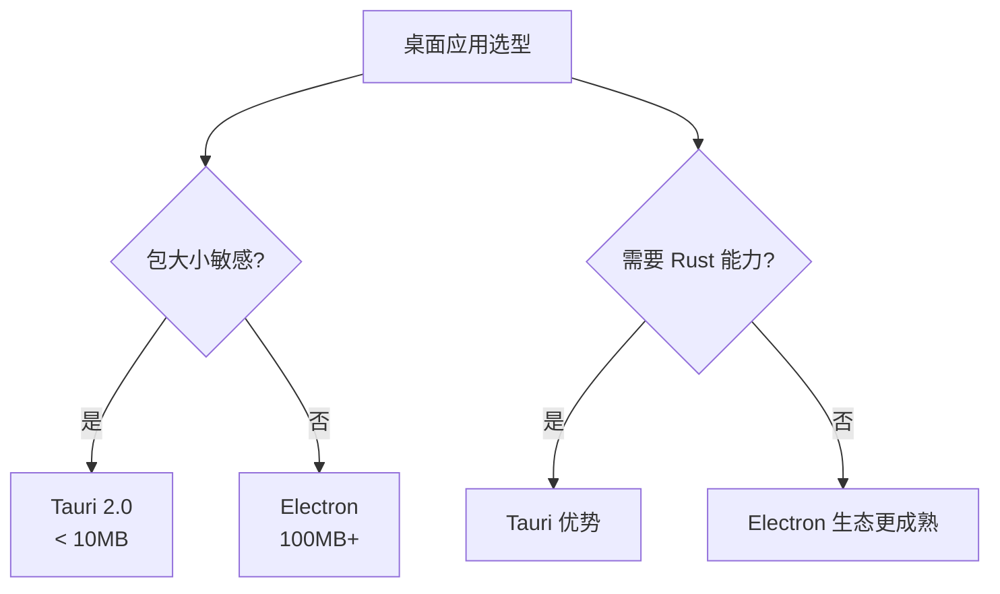
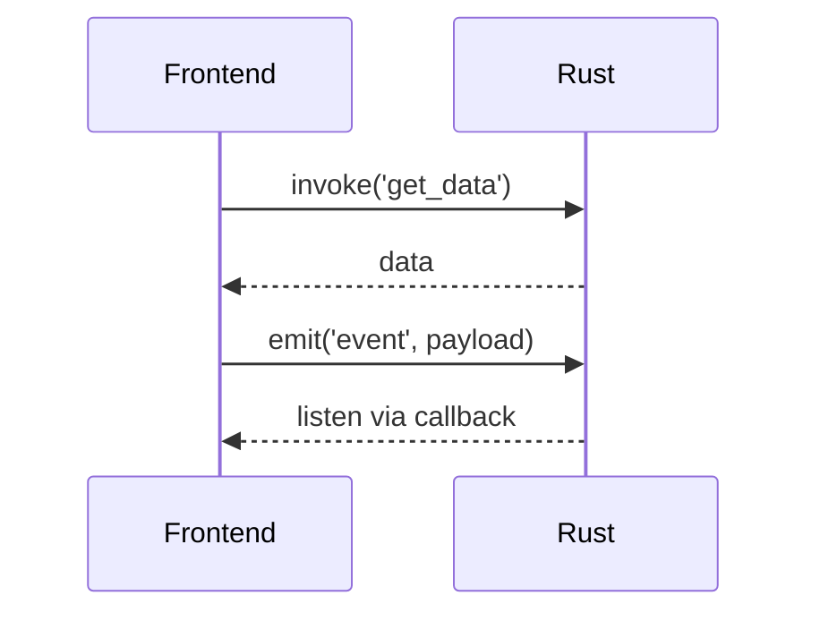

# Tauri 2.0

## 引言：反直觉代码

Tauri 2.0 的关键不是语法——是**看起来对**的代码背后那些'踩坑点'。

本篇用 3 个反直觉片段切入，把面试/生产中常被问起、但一深入就漏馅的点摆出来。

---

> 一句话定位：**Tauri — Rust 后端 + Web 前端的轻量级桌面应用框架**

## 1. 一句话定位

Tauri 是 2020 年开源的桌面应用框架，2.0 版本（2024）支持 iOS/Android/Web/Desktop 全平台。使用 Rust 作为后端，Web 技术作为前端，对比 Electron 包大小从 100MB+ 缩到 10MB-。

## 2. 核心能力

- **WebView 集成**：macOS WKWebView / Windows WebView2 / Linux WebKitGTK
- **Rust 命令桥接**：前端通过 `invoke` 调用 Rust 函数
- **权限系统**：细粒度权限控制（文件系统 / 网络 / shell）
- **Updater**：内置应用更新机制
- **多窗口**：跨平台多窗口管理
- **系统托盘**：跨平台系统托盘 API
- **移动端支持**（2.0）：iOS + Android

## 3. 生态速查

| 类别 | 推荐 | 备选 |
|------|------|------|
| 前端框架 | Vite + React/Vue/Svelte | 任意 |
| 状态管理 | 框架自带 | Zustand/Pinia |
| UI 库 | shadcn/ui / Element Plus | 任意 |
| Rust 库 | tauri-plugin-sql | tauri-plugin-store |
| 打包 | tauri build | - |
| CI/CD | GitHub Actions | Codemagic |

## 4. 选型建议



## 5. 性能优势

- **启动速度**：Rust 后端 < 100ms（vs Electron 500ms+）
- **包大小**：10MB（vs Electron 100MB+）
- **内存占用**：50MB（vs Electron 200MB+）
- **CPU 占用**：低（Rust 原生编译）

## 6. 实战场景

- **某代码编辑器**：Tauri 2.0 + Monaco Editor，启动 200ms，包 8MB
- **某笔记应用**：Tauri + 本地优先，端到端加密
- **某 DevOps 工具**：Tauri + 系统集成（shell、文件系统、网络）

## 7. 学习资源

- 官方文档：https://tauri.app/
- Tauri 2.0 文档：https://v2.tauri.app/
- Awesome Tauri：https://github.com/tauri-apps/awesome-tauri

## 8. 关键术语

| 术语 | 解释 |
|------|------|
| Tauri | 桌面应用框架 |
| WebView | 系统浏览器内核组件 |
| Rust | Tauri 后端语言 |
| invoke | 前端调用 Rust 函数 |
| Bundle | 应用打包 |
| IPC | 进程间通信 |

## 9. Commands 示例

### 9.1 Rust 端定义命令

```rust
use serde::{Deserialize, Serialize}

#[derive(Serialize, Deserialize)]
struct Todo {
    id: u32,
    title: String,
    done: bool,
}

#[tauri::command]
async fn get_todos(state: tauri::State<'_, AppState>) -> Result<Vec<Todo>, String> {
    let db = state.db.lock().await
    sqlx::query_as::<_, Todo>("SELECT id, title, done FROM todos")
        .fetch_all(&db)
        .await
        .map_err(|e| e.to_string())
}

#[tauri::command]
async fn create_todo(title: String, state: tauri::State<'_, AppState>) -> Result<Todo, String> {
    let db = state.db.lock().await
    sqlx::query_as::<_, Todo>(
        "INSERT INTO todos (title, done) VALUES (?, ?) RETURNING id, title, done"
    )
    .bind(&title)
    .bind(false)
    .fetch_one(&db)
    .await
    .map_err(|e| e.to_string())
}
```

### 9.2 前端 invoke 调用

```javascript
import { invoke } from '@tauri-apps/api/core'

// 调用 Rust 命令
const todos = await invoke('get_todos')
const newTodo = await invoke('create_todo', { title: '学习 Tauri' })

// 错误处理
try {
  await invoke('create_todo', { title: '' })
} catch (e) {
  console.error('创建失败:', e)
}
```

## 10. 插件开发

### 10.1 自定义 Plugin 结构

```rust
// src-tauri/src/lib.rs
use tauri::{plugin::{Builder, TauriPlugin}, Manager}

#[derive(serde::Serialize)]
struct PluginResponse {
    message: String,
}

#[tauri::command]
fn my_command(name: String) -> PluginResponse {
    PluginResponse { message: format!("Hello, {}!", name) }
}

pub fn init() -> TauriPlugin {
    Builder::new("my-plugin")
        .invoke_handler(tauri::generate_handler![my_command])
        .build()
}
```

### 10.2 权限配置

```json
// src-tauri/permissions/my-plugin/default.toml
[[permission]]
identifier = "allow-my-command"
description = "允许调用 my-command"
commands = ["my_command"]
```

```rust
// main.rs 注册插件
tauri::Builder::default()
    .plugin(my_plugin::init())
    .run(tauri::generate_context!())
    .expect("error while running tauri application")
```

## 11. 状态管理

### 11.1 tauri-plugin-store 持久化

```javascript
import { Store } from '@tauri-apps/plugin-store'

const store = new Store('settings.json')

// 存储
await store.set('theme', 'dark')
await store.save()

// 读取
const theme = await store.get('theme')

// 监听变化
await store.onChange((key, value) => {
  console.log(`${key} changed to ${value}`)
})
```

### 11.2 自定义 IPC 模式



- `invoke`：前端 → Rust 请求-响应
- `emit/listen`：双向事件广播
- 适合实时通信（WebSocket 转发、文件监听）

## 12. 实战案例

### 12.1 代码编辑器

- Monaco Editor / CodeMirror 6
- 文件系统 API（tauri-plugin-fs）
- LSP 集成（Rust 后端进程）

### 12.2 笔记应用

- 本地优先 + 端到端加密
- SQLite + tauri-plugin-sql
- Markdown 实时预览

### 12.3 DevOps 工具

- 系统集成（shell、文件系统、网络）
- 终端模拟（xterm.js）
- 进程管理

### 12.4 设计工具

- Canvas + Fabric.js
- tauri-plugin-dialog 文件选择
- 导出多格式

### 12.5 AI 应用

- 本地 LLM（llama.cpp / Ollama）
- 流式输出（emit 事件）
- RAG 向量数据库

## 13. Tauri 2.0 移动端

### 13.1 iOS 编译

```bash
# 安装前置
cargo install tauri-cli --version "^2.0"
rustup target add aarch64-apple-ios

# 开发运行
cargo tauri ios dev

# 打包发布
cargo tauri ios build
```

### 13.2 Android 编译

```bash
# 配置 Android SDK / NDK
export ANDROID_HOME=$HOME/Android/Sdk
export NDK_HOME=$ANDROID_HOME/ndk/26.1.10909125

# 开发运行
cargo tauri android dev

# 打包 APK/AAB
cargo tauri android build
```

### 13.3 移动端能力

- tauri-plugin-geolocation（位置）
- tauri-plugin-camera（相机）
- tauri-plugin-push-notification（推送）
- tauri-plugin-biometric（生物识别）
