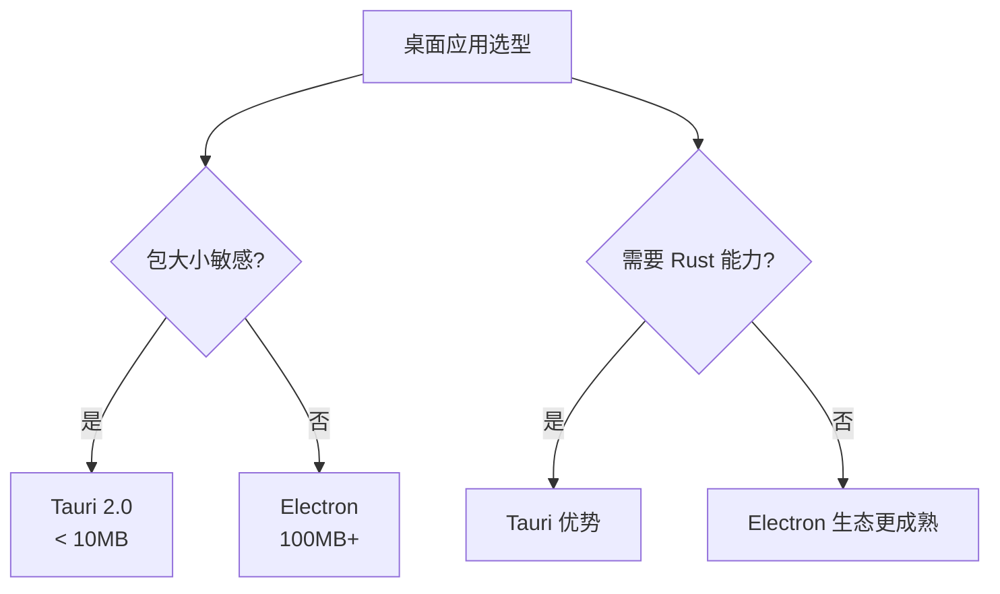

# Tauri 2.0

> 一句话定位：**Tauri — Rust 后端 + Web 前端的轻量级桌面应用框架**

## 1. 一句话定位

Tauri 是 2020 年开源的桌面应用框架，2.0 版本（2024）支持 iOS/Android/Web/Desktop 全平台。使用 Rust 作为后端，Web 技术作为前端，对比 Electron 包大小从 100MB+ 缩到 10MB-。

## 2. 核心能力

- **WebView 集成**：macOS WKWebView / Windows WebView2 / Linux WebKitGTK
- **Rust 命令桥接**：前端通过 `invoke` 调用 Rust 函数
- **权限系统**：细粒度权限控制（文件系统 / 网络 / shell）
- **Updater**：内置应用更新机制
- **多窗口**：跨平台多窗口管理
- **系统托盘**：跨平台系统托盘 API
- **移动端支持**（2.0）：iOS + Android

## 3. 生态速查

| 类别 | 推荐 | 备选 |
|------|------|------|
| 前端框架 | Vite + React/Vue/Svelte | 任意 |
| 状态管理 | 框架自带 | Zustand/Pinia |
| UI 库 | shadcn/ui / Element Plus | 任意 |
| Rust 库 | tauri-plugin-sql | tauri-plugin-store |
| 打包 | tauri build | - |
| CI/CD | GitHub Actions | Codemagic |

## 4. 选型建议

## 5. 性能优势

- **启动速度**：Rust 后端 < 100ms（vs Electron 500ms+）
- **包大小**：10MB（vs Electron 100MB+）
- **内存占用**：50MB（vs Electron 200MB+）
- **CPU 占用**：低（Rust 原生编译）

## 6. 实战场景

- **某代码编辑器**：Tauri 2.0 + Monaco Editor，启动 200ms，包 8MB
- **某笔记应用**：Tauri + 本地优先，端到端加密
- **某 DevOps 工具**：Tauri + 系统集成（shell、文件系统、网络）

## 7. 学习资源

- 官方文档：https://tauri.app/
- Tauri 2.0 文档：https://v2.tauri.app/
- Awesome Tauri：https://github.com/tauri-apps/awesome-tauri

## 8. 关键术语

| 术语 | 解释 |
|------|------|
| Tauri | 桌面应用框架 |
| WebView | 系统浏览器内核组件 |
| Rust | Tauri 后端语言 |
| invoke | 前端调用 Rust 函数 |
| Bundle | 应用打包 |
| IPC | 进程间通信 |
