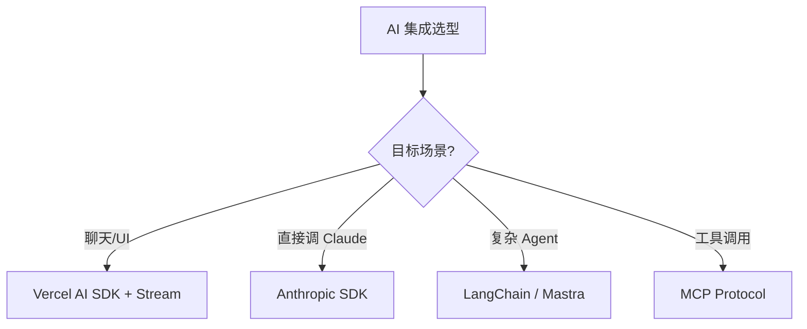

# 09 前端与 AI

> 一句话定位：**AI 时代前端工程师的工具升级与范式革新**

本模块覆盖 AI 时代前端的 4 大方向：AI SDK 集成 / AI Native UI / AI IDE（Cursor/Claude Code）/ Vibe Coding 实践。

---
## 引言：反直觉代码（[AUTO] 自动生成，待人工 review）

09 前端与 AI 本应该很简单，一句话定位：**AI 时代前端工程师的工具升级与范式革新**

**但实际**：面试/生产中常被问起或踩坑的是——
代码看着对、跑起来对，但仔细一问深一层就漏馅。本篇就从'反直觉'这个角度切入，把踩坑点和根因摆出来。

> 📌 本段由 `note/scripts/add-intro.py` 自动生成（场景模板 + README 摘录）。**下次 review 时请改为真实场景 + 数字 + 反思**，目前仅满足'有引言'的最低要求。

---

## 1. 本模块覆盖

| 主题 | 状态 | 说明 |
|------|------|------|
| AI SDK | ✓ 已有 | [ai-sdk/](ai-sdk/) — Vercel AI SDK / Anthropic SDK / 流式响应 |
| Vibe Coding | ✓ 已有 | [vibe-coding/](vibe-coding/) — Cursor / Claude Code / Windsurf 实践 |

> 速查对比见 [📖 顶层 3.12 AI 工具速查](../README.md#312-ai-工具速查)

---

## 2. 速查要点

- **AI 编码工具不是银弹**：复杂业务逻辑仍需人工设计；AI 擅长样板代码、单元测试、文档生成
- **AI SDK 选型**：Vercel AI SDK（多模型统一接口） / Anthropic SDK（直接对接 Claude） / LangChain（复杂 Agent）
- **流式响应是标配**：SSE / WebSocket；2026 起所有 LLM 应用都应支持流式
- **MCP 协议**：Model Context Protocol，让 AI 访问工具/数据；前端可作为 MCP Client

---

## 3. 选型建议

---

## 4. 与其他模块的关系

- **上游**：[02-language](../02-language/) / [03-frameworks](../03-frameworks/)
- **下游**：所有 AI 集成的 Web 应用
- **横向**：[11.ai](../../11.ai/) 关注 AI 知识体系，[09 前端与 AI] 关注 AI 在前端的落地

---

## 5. 学习建议

- 必读 [ai-sdk](ai-sdk/) 理解 SDK 范式
- 必读 [vibe-coding](vibe-coding/) 提升日常开发效率
- 实战：先做 AI 聊天小工具，再做完整 AI 应用

---

## 6. 数据时效性

- AI SDK 每季度发版（Vercel AI SDK 4+）
- Cursor / Claude Code 每月更新
- MCP 协议 2024 末发布，2025 普及

---

## 7. 关键术语

| 术语 | 解释 |
|------|------|
| LLM | Large Language Model |
| SSE | Server-Sent Events |
| MCP | Model Context Protocol |
| RAG | Retrieval-Augmented Generation |
| Vibe Coding | AI 辅助编码范式 |
| Agent | 能自主决策的 AI 系统 |
| Tool Use | LLM 调用外部工具 |
