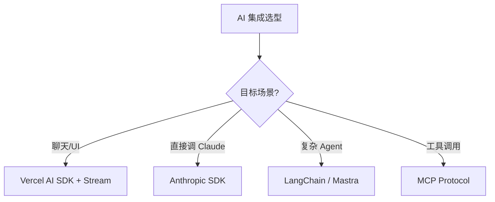

<!--
module:
  parent: note
  slug: 09.front-end/ai
  type: article
  category: 主模块子文章
  summary: 前端 09 前端与 AI
-->

# 09 前端与 AI

> 一句话定位：**AI 时代前端工程师的工具升级与范式革新**

本模块覆盖 AI 时代前端的 4 大方向:AI SDK 集成 / AI Native UI / AI IDE(Cursor / Claude Code)/ Vibe Coding 实践。

---

## 1. 模块导航

| 主题 | 状态 | 说明 |
|------|------|------|
| AI SDK | ✓ 已有 | [ai-sdk/](ai-sdk/) — Vercel AI SDK / Anthropic SDK / 流式响应 |
| Vibe Coding | ✓ 已有 | [vibe-coding/](vibe-coding/) — Cursor / Claude Code / Windsurf 实践 |

### 1.1 学习路径

- **入门**:必读 [ai-sdk](ai-sdk/) 理解 SDK 范式(`streamText` / `useChat` / `generateObject`)
- **实践**:必读 [vibe-coding](vibe-coding/) 提升日常开发效率
- **进阶**:学习 MCP 协议、Agent 编排、Human-in-the-Loop 审查
- **实战**:先做 AI 聊天小工具,再做完整 AI 应用

---

## 2. 知识脉络

---

## 3. 速查要点

- **AI 编码工具不是银弹**:复杂业务逻辑仍需人工设计;AI 擅长样板代码、单元测试、文档生成
- **AI SDK 选型**:Vercel AI SDK(多模型统一接口)/ Anthropic SDK(直接对接 Claude)/ LangChain(复杂 Agent)
- **流式响应是标配**:SSE / WebSocket;2026 起所有 LLM 应用都应支持流式
- **MCP 协议**:Model Context Protocol,让 AI 访问工具 / 数据;前端可作为 MCP Client

---

## 4. 工具与 SDK 对比

| 工具 | 形态 | 模型 | 适用 |
|------|------|------|------|
| Cursor | IDE | 多模型 | AI 编码主战场 |
| Claude Code | CLI | Claude | 终端 / 工作流集成 |
| Windsurf | IDE | 多模型 | 团队协作 |
| Copilot | 插件 | GPT | GitHub 用户 |
| Vercel AI SDK | 库 | 多模型 | 集成 AI 能力 |
| Anthropic SDK | 库 | Claude | 直接对接 Claude |

---

## 5. 最佳实践

- AI 集成优先流式响应(SSE / WebStream),离线式"长等"是 UX 反模式
- 多模型架构用 Vercel AI SDK 抽象,避免绑定单一厂商
- AI IDE 辅助编码(Cursor / Claude Code)+ Vibe Coding 适用原型,生产代码需人工审查
- AI 聊天 + Generative UI:模型生成 React / Vue 组件,落地前必须 schema 校验
- MCP 协议让 AI 访问工具 / 数据;前端可作为 MCP Client 调用工具集

---

## 6. 常见面试题

- 流式响应 SSE 与 WebSocket 的取舍:断线重连 / 单向 / 双向差异
- Vercel AI SDK 的 `streamText` / `useChat` / `generateObject` 三个 API 适用场景
- MCP(Model Context Protocol)与传统 Function Calling 的本质区别
- AI Native UI 的渲染边界:模型生成代码的沙箱化执行与 schema 校验
- Vibe Coding 在生产环境的边界:人类审查的 5 个检查点(架构 / 安全 / 性能 / 一致性 / 测试)

---

## 7. 与其他模块的关系

- **上游**:[02-language](../02-language/) / [03-frameworks](../03-frameworks/)
- **下游**:所有 AI 集成的 Web 应用
- **横向**:[11.ai](../../11.ai/) 关注 AI 知识体系,[09 前端与 AI] 关注 AI 在前端的落地

---

## 📊 本节统计

- **主题数**:2(AI SDK / Vibe Coding)
- **子 README 数**:2 + 1 顶层 = 3
- **模块导航行数**:2(全已有)
- **学习路径主题数**:3(入门 / 进阶 / 实战)
- **面试题数**:5
- **数据快照**:2026-06

---

← [返回前端工程总览](../README.md)
