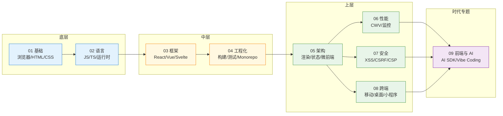

<!--
module:
  number: 09
  slug: front-end
  topic: 前端工程
  audience: 前端 / 全栈工程师
  category: 主模块
  summary: 现代前端工程的知识地图——从浏览器原理到 AI 协同开发
-->

# 九、[前端工程](README.md)

> 现代前端工程的知识地图——从浏览器原理到 AI 协同开发

本章节是 14 主模块中「前端」主题的入口，按 **9 大模块** 收纳前端各方向内容,纵向从浏览器原理到 AI 协同,横向覆盖框架选型、性能、安全与跨端。

---

## 1. 模块导航

| 序号 | 主题 | 核心内容 | 主要子 README | 学习价值 |
|------|------|---------|--------------|---------|
| 01 | [基础](./01-foundation/) | 浏览器原理 / HTML 语义化 / CSS 工程化 / Web 标准 | [browser-rendering](./01-foundation/browser-rendering/) / [css-engineering](./01-foundation/css-engineering/) | 性能优化、卡顿分析的根因地图 |
| 02 | [语言](./02-language/) | JavaScript ES2024-2026 / TypeScript 5 / 运行时 | [typescript](./02-language/typescript/) / [runtime](./02-language/runtime/) | 类型系统 / 异步 / 模块化基石 |
| 03 | [框架](./03-frameworks/) | React 19 / Vue 3.4+ / Svelte 5 / Solid / Astro | [react](./03-frameworks/react/) / [vue](./03-frameworks/vue/) | UI 开发范式选择 |
| 04 | [工程化](./04-engineering/) | Vite / Rspack / Monorepo / 测试 / Lint | [vite](./04-engineering/vite/) / [monorepo-practice](./04-engineering/monorepo-practice/) | 团队协作与构建效率 |
| 05 | [架构](./05-architecture/) | 渲染模式 / 状态 / 路由 / 微前端 / BFF / 设计系统 | [rendering-modes](./05-architecture/rendering-modes/) / [state-management](./05-architecture/state-management/) / [routing](./05-architecture/routing/) / [micro-frontend](./05-architecture/micro-frontend/) / [web-components](./05-architecture/web-components/) / [bff](./05-architecture/bff/) / [design-system](./05-architecture/design-system/) | 大型应用的可维护性 |
| 06 | [性能](./06-performance/) | Core Web Vitals / 监控 / 优化手段 | [core-web-vitals](./06-performance/core-web-vitals/) / [monitoring](./06-performance/monitoring/) / [optimization](./06-performance/optimization/) | 用户体验与转化率 |
| 07 | [安全](./07-security/) | XSS / CSRF / CSP / CORS / 会话 / 供应链 | [xss](./07-security/xss/) / [csrf](./07-security/csrf/) / [csp](./07-security/csp/) / [cors](./07-security/cors/) / [sessions](./07-security/sessions/) / [supply-chain](./07-security/supply-chain/) | 攻击防护与合规 |
| 08 | [跨端](./08-cross-platform/) | React Native / Flutter / Tauri / PWA / 小程序 | [mobile-tech-stack](./08-cross-platform/mobile-tech-stack/) / [react-native](./08-cross-platform/react-native/) / [flutter](./08-cross-platform/flutter/) / [tauri](./08-cross-platform/tauri/) / [pwa](./08-cross-platform/pwa/) / [mini-program](./08-cross-platform/mini-program/) | 一次开发多端部署 |
| 09 | [前端与 AI](./09-frontend-and-ai/) | AI SDK / AI Native UI / Vibe Coding | [ai-sdk](./09-frontend-and-ai/ai-sdk/) / [vibe-coding](./09-frontend-and-ai/vibe-coding/) | AI 时代开发范式升级 |

### 1.1 学习路径

- **新人入门**:`01 基础` → `02 语言` → `03 框架`(React 或 Vue 任一) → `04 工程化`,按主链自下而上
- **进阶架构**:`03 框架` → `04 工程化` → `05 架构`(渲染模式 / 状态 / 路由),掌握应用层设计
- **性能专攻**:`01 基础`(浏览器原理) → `06 性能`(CWV / 监控 / 优化)
- **AI 时代前端**:`03 框架` + `02 语言` → `09 前端与 AI`(SDK / Vibe Coding)
- **跨端开发者**:`03 框架` → `05 架构`(BFF) → `08 跨端`(选 1-2 个深入)

---

## 2. 知识脉络

**阅读顺序**:从底层原理(浏览器 / 语言)出发 → 框架与工程化 → 应用架构与横切关切(性能 / 安全) → 跨端形态 → AI 时代范式。

---

## 3. 模块简介

### 3.1 基础
浏览器解析 HTML、构建 DOM/CSSOM、布局、合成、绘制的流水线——理解这条流水线才能解释卡顿、白屏、动画掉帧。HTML 语义化与无障碍(a11y)是把"页面"升级为"应用"的起点,CSS 工程化(PostCSS / CSS Modules / Tailwind / CSS-in-JS 的取舍)决定大型项目的样式可维护性。

### 3.2 语言
JavaScript 与 TypeScript 是前端的"母语"。ES2024-2026 新特性(Decorators / Records & Tuples / Pattern Matching / Temporal)、TypeScript 5.x 严格模式、Node.js / Deno / Bun 多运行时、ESM vs CJS 互操作。TS 5 的 `satisfies`、模板字面量类型、类型守卫是把"动态脚本"变成"工程语言"的关键。

### 3.3 框架
React 19(Server Components / Actions / use Hook)与 Vue 3.4+(Reactivity Transform 稳定、defineModel 双向绑定)形成"两强"格局;Svelte 5(runes)与 Solid(细粒度响应式)代表"编译时 + 细粒度"路线;Astro / Next.js / Nuxt / SvelteKit 等元框架把 SSR / SSG / ISR / RSC 抽象为部署目标。

### 3.4 工程化
Vite 6+(基于 Rolldown / 依赖预构建)是新建项目的事实标准;Rspack / Turbopack 是 Webpack 生态的 Rust 化迁移路径。Monorepo 工具(pnpm workspaces / Turborepo / Nx)解决多包共享与增量构建;测试金字塔(Vitest / Testing Library / Playwright / Storybook)保障迭代安全;ESLint 9 / Prettier / Biome 构成代码质量门禁。

### 3.5 架构
渲染模式(CSR / SSR / SSG / ISR / RSC / 流式)决定首屏与 SEO;状态管理(Redux Toolkit / Zustand / Jotai / Pinia / Signals)划分"局部 vs 全局";路由(文件系统路由 / 嵌套路由 / 路由守卫)串联页面与权限;微前端(qiankun / Module Federation)解决巨型应用的独立交付;BFF(GraphQL / tRPC / Hono)让前端拥有自己的"胶水层";设计系统(Tokens / 组件库 / 主题)保证视觉与交互一致性。

### 3.6 性能
Core Web Vitals(LCP / INP / CLS / TTFB)是 Google 排名因子;监控(web-vitals / Sentry Performance / Datadog RUM)把"卡"变成可定位的火焰图;优化(资源加载优先级、Code Splitting、图片格式、字体子集化、SSR/Streaming、Edge 缓存)从网络、渲染、JS 执行三层切入。性能不是事后优化,而是架构决策的第一性约束。

### 3.7 安全
XSS(反射型 / 存储型 / DOM 型)是注入攻击的经典;CSRF 与 SameSite Cookie 防护状态变更请求;CSP 把可执行脚本锁定到白名单;CORS 决定跨域资源能否被读取;会话管理(JWT / Session ID / Refresh Token 轮换)影响鉴权安全;依赖供应链(npm audit / SBOM / 锁文件 / Sigstore)防止恶意包注入。

### 3.8 跨端
React Native(New Architecture / Hermes / Fabric)与 Flutter(Skia 自绘 / Impeller)是两大跨端路线;Tauri(Rust 内核 + Webview)是桌面端"轻量 Electron 替代品";PWA(Service Worker / Manifest / Push API)把 Web 装进桌面与离线场景;小程序(微信 / 支付宝 / 抖音)的双线程模型是中国特色。跨端的核心权衡是"渲染一致 vs 平台能力调用"。

### 3.9 前端与 AI
Vercel AI SDK / Anthropic SDK / OpenAI SDK 把 LLM 调用抽象为 `streamText` / `useChat` / `generateObject`;AI Native UI(Generative UI / Tool Use / Structured Output)让模型直接生成可渲染组件;Vibe Coding(Cursor / Claude Code / Windsurf / Copilot)让 AI 深度参与代码生成、调试、重构。本模块教"如何设计 AI 协同的工作流"——Prompt 工程、上下文管理、Agent 编排、Human-in-the-Loop 审查。

---

## 4. 最佳实践

| 场景 | 实践要点 |
|------|---------|
| **性能优化** | Core Web Vitals 先行(LCP < 2.5s, INP < 200ms, CLS < 0.1);代码分割 + 懒加载;图片用 WebP/AVIF + `loading="lazy"` |
| **状态管理** | 服务端状态用 TanStack Query / SWR;客户端状态用 Zustand / Jotai;避免全局 Redux 过度使用 |
| **安全** | CSP + SRI 标配;XSS 防御用框架内置转义;依赖审计 `npm audit` + Socket.dev |
| **工程化** | TypeScript strict 模式;ESLint + Prettier 统一风格;Vitest 单测 + Playwright E2E |
| **跨端选型** | 移动端优先 React Native / Flutter;桌面端 Tauri(轻量)/ Electron(生态);小程序 Taro / uni-app |
| **AI 协同** | AI IDE(Cursor / Claude Code)辅助编码;Vibe Coding 适用原型,生产代码需人工审查 |

---

## 5. 常见面试题

- **浏览器渲染流水线**:从 URL 输入到页面可交互的完整过程,关键优化点是什么?
- **React Fiber 与 Vue 响应式原理差异**:为什么 Vue 3 用 Proxy,React 19 的 Compiler 解决了什么?
- **CSR / SSR / SSG / ISR / RSC 五种渲染模式**:SEO、首屏、可交互性、维护成本怎么权衡?
- **XSS 三种类型与防御**:反射型 / 存储型 / DOM 型,从输入过滤到 CSP 兜底的全链路
- **SameSite Cookie 三种取值**:Strict / Lax / None 的 CSRF 防护差异与适用场景
- **Core Web Vitals 三指标**:LCP / INP / CLS 的测量方式、达标阈值与典型优化手段
- **微前端三种方案**:qiankun / Module Federation / Vite Plugin Federation 的隔离粒度与运行时差异
- **TypeScript 类型体操边界**:什么时候该用 `infer` / 条件类型 / 模板字面量类型?过度类型化的代价是什么?

---

## 6. 相关章节

- 上游:[`02.computer-basics/01-network`](../02.computer-basics/01-network/) — HTTP 协议族
- 下游:[`06.spring`](../06.spring/) / [`11.ai`](../11.ai/) — 后端与 AI 知识体系
- 横切:[`05.tools/05-monorepo`](../05.tools/05-monorepo/) — Monorepo 工具链与 `04-engineering` 互补
- 关联:[`04.system-design`](../04.system-design/) — 跨端与架构的系统设计参考
- 主题阅读:[`12.story`](../12.story/) — 阿明餐厅系列(前端篇 / 多端篇 / AI 学习悖论)
- 咬文嚼字:[`13.split-hairs/09.front-end`](../13.split-hairs/09.front-end/) — 前端细节专题

---

## 7. 开源参考

| 类别 | 项目 | 关联模块 |
|------|------|---------|
| **构建工具** | [Vite](https://github.com/vitejs/vite) / [Rspack](https://github.com/web-infra-dev/rspack) / [Turbopack](https://turbo.build/pack) | 04 工程化 |
| **框架** | [React](https://github.com/facebook/react) / [Vue](https://github.com/vuejs/core) / [Svelte](https://github.com/sveltejs/svelte) / [Astro](https://github.com/withastro/astro) | 03 框架 |
| **元框架** | [Next.js](https://github.com/vercel/next.js) / [Nuxt](https://github.com/nuxt/nuxt) / [SvelteKit](https://github.com/sveltejs/kit) | 05 架构 |
| **UI / 设计系统** | [shadcn/ui](https://github.com/shadcn-ui/ui) / [Material UI](https://github.com/mui/material-ui) / [Ant Design](https://github.com/ant-design/ant-design) | 05 架构 |
| **AI SDK** | [Vercel AI SDK](https://github.com/vercel/ai) / [Anthropic SDK](https://github.com/anthropics/anthropic-sdk-typescript) | 09 前端与 AI |
| **AI 编码工具** | [Cursor](https://www.cursor.com/) / [Claude Code](https://docs.claude.com/en/docs/claude-code) / [Windsurf](https://codeium.com/windsurf) | 09 前端与 AI |
| **跨端框架** | [React Native](https://github.com/facebook/react-native) / [Flutter](https://github.com/flutter/flutter) / [Tauri](https://github.com/tauri-apps/tauri) / [Taro](https://github.com/NervJS/taro) | 08 跨端 |
| **测试** | [Vitest](https://github.com/vitest-dev/vitest) / [Playwright](https://github.com/microsoft/playwright) | 04 工程化 |
| **性能监控** | [web-vitals](https://github.com/GoogleChrome/web-vitals) | 06 性能 |

---

## 📊 本节统计

- **一级模块数**:9(01 基础 / 02 语言 / 03 框架 / 04 工程化 / 05 架构 / 06 性能 / 07 安全 / 08 跨端 / 09 前端与 AI)
- **二级子 README 数**:32 + 9 顶层 = **41**(28 / 25 / 6-工 = 31 → 32 实际值,见 fix commit)
- **frontmatter 覆盖率**:42/42 = **100%**
- **学习路径主题数**:5(新人 / 进阶 / 性能 / AI 时代 / 跨端)
- **面试题数**:8(浏览器 / 框架 / 渲染 / XSS / Cookie / CWV / 微前端 / TS)
- **开源参考数**:9 类(构建 / 框架 / 元框架 / UI / AI SDK / AI 工具 / 跨端 / 测试 / 监控)
- **覆盖周期**:从浏览器原理到 AI 协同开发的全链路,数据快照 2026-06
- **历史口径说明**:02-04 等速查占位主题(HTML / Web 标准 / 包管理 / 测试 / Lint)在分类 README 中以"📝 速查"形式出现,不计入深度 README 数

---

← [返回笔记目录](../README.md)
