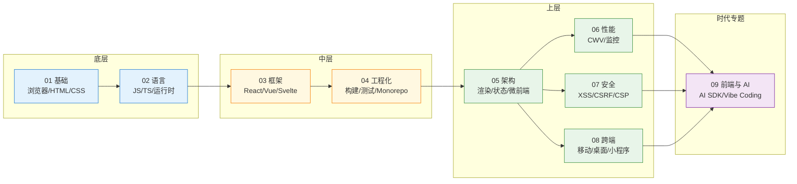
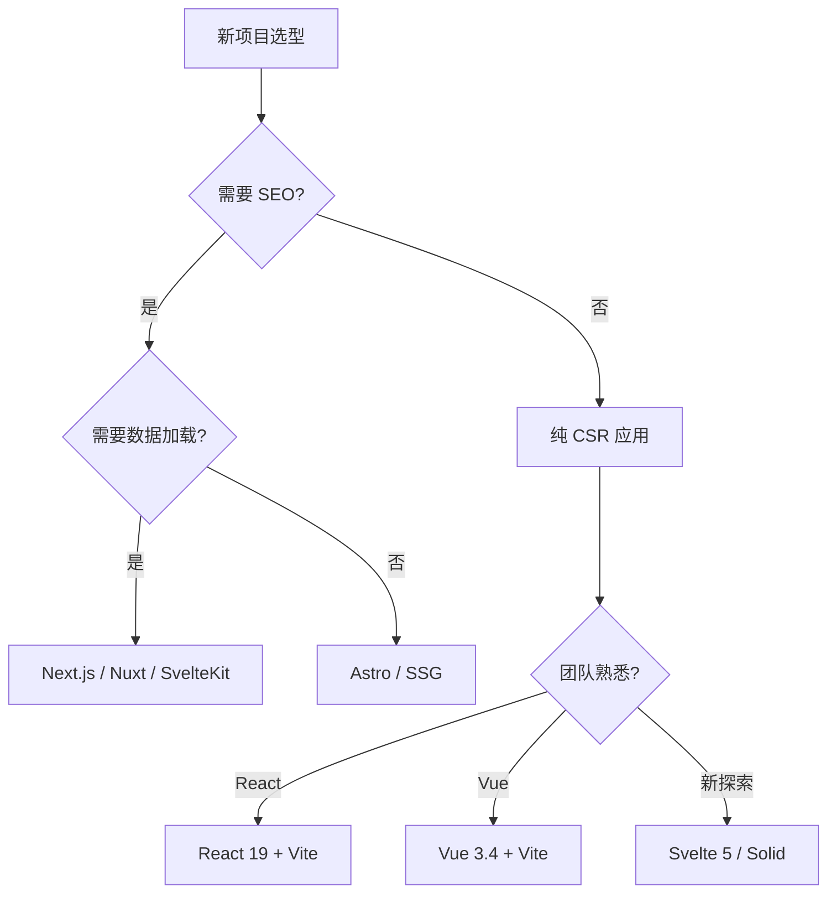
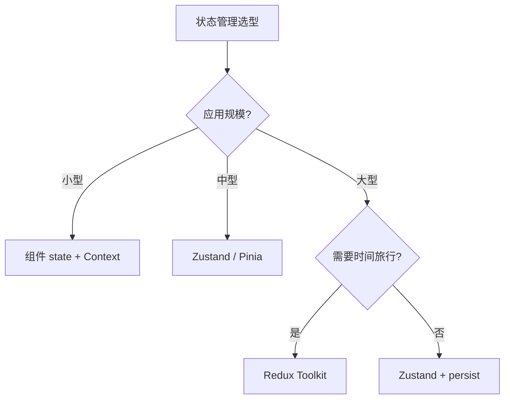
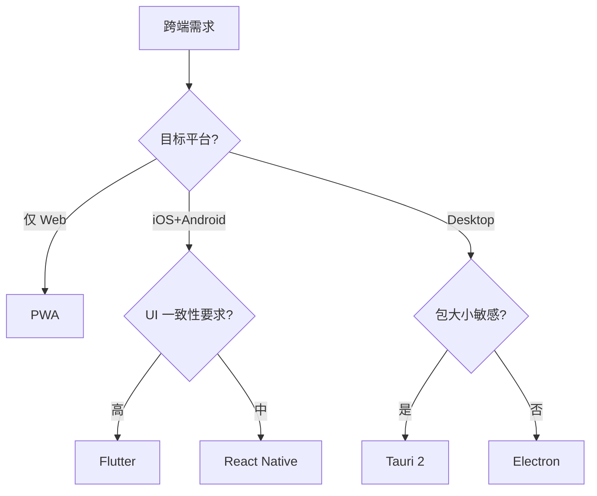
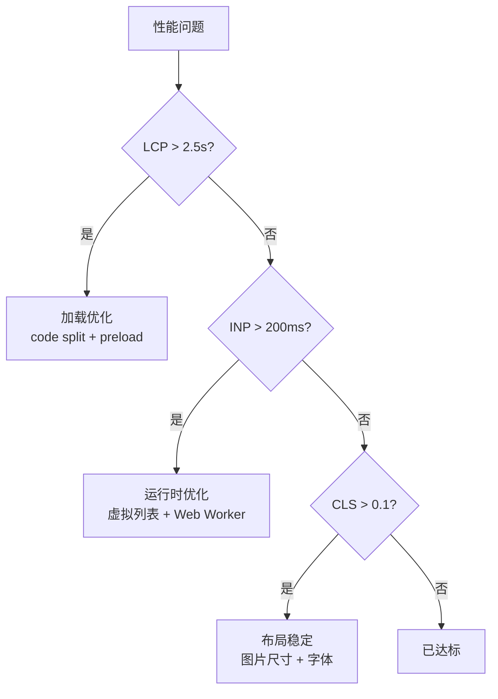

# 前端工程

> 一句话定位：**现代前端工程的知识地图——从浏览器原理到 AI 协同开发**

本章节是仓库「前端」主题的入口，对齐 `04.system-design` / `06.spring` / `11.ai` 的「序号分层 + 顶层 README」结构，把分散在前端各方向的内容按 **9 大模块** 收纳。

---

## 1. 9 模块导航

本节是 09.front-end 顶层索引，把整个前端领域按 **9 大模块** 切分。每个模块对应 `0X-xxx/` 子目录，下挂若干子 README 深读。下表用「核心内容 / 主要子 README / 学习价值」三列快速定位：你想解决的问题属于哪个模块，模块内部由哪几篇深读覆盖，以及学完之后能解决哪类工程问题。

| 序号 | 主题 | 核心内容 | 主要子 README | 学习价值 |
|------|------|---------|--------------|---------|
| 01 | [基础](./01-foundation/) | 浏览器原理 / HTML 语义化 / CSS 工程化 / Web 标准 | browser-rendering / css-engineering | 性能优化、卡顿分析的根因地图 |
| 02 | [语言](./02-language/) | JavaScript ES2024-2026 / TypeScript 5 / 运行时 | typescript / runtime | 类型系统/异步/模块化基石 |
| 03 | [框架](./03-frameworks/) | React 19 / Vue 3.4+ / Svelte / Solid / Astro | react / vue | UI 开发范式选择 |
| 04 | [工程化](./04-engineering/) | Vite / Rspack / Monorepo / 测试 / Lint | vite / monorepo-practice | 团队协作与构建效率 |
| 05 | [架构](./05-architecture/) | 渲染模式 / 状态 / 路由 / 微前端 / BFF / 设计系统 | rendering-modes / state-management / routing / micro-frontend / web-components / bff / design-system | 大型应用的可维护性 |
| 06 | [性能](./06-performance/) | Core Web Vitals / 监控 / 优化手段 | core-web-vitals / monitoring / optimization | 用户体验与转化率 |
| 07 | [安全](./07-security/) | XSS / CSRF / CSP / CORS / 会话 / 供应链 | xss / csrf / csp / cors / sessions / supply-chain | 攻击防护与合规 |
| 08 | [跨端](./08-cross-platform/) | React Native / Flutter / Tauri / PWA / 小程序 | react-native / flutter / tauri / pwa / mini-program | 一次开发多端部署 |
| 09 | [前端与 AI](./09-frontend-and-ai/) | AI SDK / AI Native UI / Vibe Coding | ai-sdk / vibe-coding | AI 时代开发范式升级 |

### 1.1 模块选择指南

- **新人入门**：从 01 → 02 → 03 选一 → 04，再按需深入 05/06/07
- **想学架构**：05 为主，配合 04 / 06
- **想搞性能**：06 为主，配合 01 浏览器原理
- **想做 AI 应用**：09 为主，配合 03 框架
- **想跨端**：08 为主，配合 05 架构
- **只想速查**：直接看章节 3 速查地图，9 大方向 12 个对比表

### 1.2 模块覆盖统计

- **一级模块**：9 个
- **子 README 总数**：25（T12 完成后达 31 个）
- **总代码行数**：约 6678 行（T12 完成后约 8500 行）
- **覆盖周期**：从浏览器原理到 AI 协同开发的全链路

### 1.3 模块简介

#### 01 基础

前端开发的底层基石。浏览器如何解析 HTML、构建 DOM/CSSOM、布局、合成、绘制——理解这条流水线才能解释卡顿、白屏、动画掉帧。HTML 语义化与无障碍（a11y）是把"页面"升级为"应用"的起点，CSS 工程化（PostCSS / CSS Modules / Tailwind / CSS-in-JS 的取舍）决定大型项目的样式可维护性。本模块是 06 性能、07 安全、03 框架的根因地图——所有上层问题都能在浏览器原理里找到第一性解释。

#### 02 语言

JavaScript 与 TypeScript 是前端的"母语"。2026 年的工程基线：ES2024-2026 新特性（Decorators / Records & Tuples / Pattern Matching / Temporal）、TypeScript 5.x 严格模式与类型体操、Node.js / Deno / Bun 多运行时格局、ESM vs CJS 互操作、Worker Threads / SharedArrayBuffer 性能边界。语言层是所有框架与工具的"语法契约"——TS 5 的 `satisfies`、模板字面量类型、类型守卫与判别联合是把"动态脚本"变成"工程语言"的关键转折。

#### 03 框架

UI 开发的范式选择。React 19（Server Components / Actions / use Hook）与 Vue 3.4+（Reactivity Transform 稳定、defineModel 双向绑定）形成"两强"格局；Svelte 5（runes）与 Solid（细粒度响应式）代表"编译时 + 细粒度"路线；Astro / Next.js / Nuxt / SvelteKit 等元框架把 SSR / SSG / ISR / RSC 抽象为部署目标。框架选型不是"哪个最好"，而是"团队规模 × 渲染策略 × 生态适配"的三维决策。

#### 04 工程化

把"能跑"变成"能长期跑"。Vite 6+（基于 Rolldown / 依赖预构建）已成为 2026 新建项目的事实标准，Rspack / Turbopack 是 Webpack 生态的 Rust 化迁移路径。Monorepo 工具（pnpm workspaces / Turborepo / Nx）解决多包共享与增量构建；测试金字塔（Vitest 单元 / Testing Library 组件 / Playwright E2E / Storybook 视觉回归）保障迭代安全；ESLint 9 / Prettier / oxlint / Biome 共同构成代码质量门禁。工程化是团队协作的"交通规则"。

#### 05 架构

大型应用的可维护性。渲染模式（CSR / SSR / SSG / ISR / RSC / 流式渲染）决定首屏与 SEO；状态管理（Redux Toolkit / Zustand / Jotai / Pinia / Signals）划分"局部 vs 全局"边界；路由（文件系统路由 / 嵌套路由 / 路由守卫）串联页面与权限；微前端（qiankun / Module Federation / Vite Plugin Federation）解决巨型应用的独立交付；BFF（GraphQL / tRPC / Hono）让前端拥有自己的"胶水层"；设计系统（Tokens / 组件库 / 主题）保证视觉与交互的一致性。

#### 06 性能

用户体验的工程化度量。Core Web Vitals（LCP / INP / CLS / TTFB）是 Google 排名因子与用户体验的核心指标；监控（web-vitals / Sentry Performance / Datadog RUM）把"卡"变成可定位的火焰图与长任务；优化手段（资源加载优先级、Code Splitting、图片格式（AVIF/WebP）、字体子集化、SSR/Streaming、Edge 缓存）从网络、渲染、JS 执行三个层面切入。性能不是事后优化，而是架构决策的第一性约束。

#### 07 安全

前端不是"无信任的沙箱"。XSS（反射型 / 存储型 / DOM 型）是注入攻击的经典；CSRF 与 SameSite Cookie 是状态变更请求的防护；CSP（Content Security Policy）把可执行脚本锁定到白名单；CORS 决定跨域资源能否被读取；会话管理（JWT / Session ID / Refresh Token 轮换）影响鉴权安全；依赖供应链（npm audit / SBOM / 锁文件 / 私有 Registry / Sigstore）防止恶意包注入。安全是横切关切——每个模块都要回头校验。

#### 08 跨端

一次开发多端部署的工程现实。React Native（New Architecture / Hermes / Fabric）与 Flutter（Skia 自绘 / Impeller）代表两大跨端路线；Tauri（Rust 内核 + Webview）是桌面端"轻量 Electron 替代品"的首选；PWA（Service Worker / Manifest / Push API）把 Web 装进桌面与离线场景；小程序（微信 / 支付宝 / 抖音）的双线程模型与 Web 差异是绕不开的"中国特色"。跨端的核心权衡是"渲染一致 vs 平台能力调用"。

#### 09 前端与 AI

AI 时代前端开发范式的升级。Vercel AI SDK / Anthropic SDK / OpenAI SDK 把 LLM 调用抽象为 `streamText` / `useChat` / `generateObject`；AI Native UI（Generative UI / Tool Use / Structured Output）让模型直接生成可渲染的组件；Vibe Coding（Cursor / Claude Code / Windsurf / Copilot）让 AI 深度参与代码生成、调试、重构。本模块不教"如何调 API"，而是教"如何设计 AI 协同的工作流"——Prompt 工程、上下文管理、Agent 编排、Human-in-the-Loop 审查机制。

### 1.4 模块间依赖与横切关系

9 个模块不是平铺的，是分层 + 横切的：

- **纵深依赖**：`01 基础` → `02 语言` → `03 框架` → `04 工程化` → `05 架构` 是从底层到上层的"主链"，下游模块必然引用上游约定。
- **横切关切**：`06 性能` 与 `07 安全` 是横切模块——任何一层的实现都要回头看性能与安全。
- **时代专题**：`08 跨端` 与 `09 前端与 AI` 是"应用形态 + 时代范式"的扩展轴，可独立深入，但落地时必须先掌握主链。
- **依赖反转**：`09 前端与 AI` 反过来正在重塑 `04 工程化`（AI 生成测试 / AI 重构）与 `05 架构`（AI 编排 / Agent Mesh）——这是 2026 年最值得关注的反向回流。

### 1.5 阅读建议

- **第一次阅读**：按章节 3 学习路线的"新人入门"主线走，4 个模块约需 2-3 周。
- **建立索引**：每个模块下，先读子 README 的"概念 / 分类 / 选型"三段，再深入到具体对比表。
- **横向打通**：选一个真实项目（如重构一个组件库），把 9 个模块串起来实践一次——比读 10 篇深读都有效。
- **保持更新**：前端领域 6 个月一个代际，章节 5 的开源参考表与每个子 README 的"演进时间线"是跟踪变化的最佳入口。

---

## 2. 知识脉络

**阅读顺序**：从底层原理（浏览器 / 语言）出发，向上构建框架与工程化体系，再向架构与性能深入，安全与跨端作为横切关切贯穿整个链路，AI 时代则把"如何与 AI 协同开发"作为收尾专题。

---

## 3. 速查地图

> 9 大方向 12 张速查表，按事实属性（功能/性能/生态）对比，不分级推荐。

### 3.1 构建工具速查

| 工具 | 启动 | HMR | 生产构建 | 生态 | 适用场景 |
|------|------|-----|---------|------|---------|
| Vite 5+ | < 1s | 极快 | Rollup | 丰富 | 现代项目默认选择 |
| Rspack | < 2s | 快 | 兼容 Webpack | 中等 | Webpack 迁移友好 |
| Turbopack | < 1s | 极快 | 自研 | 新 | Next.js 15+ |
| Webpack 5 | 慢 | 中等 | 自研 | 极丰富 | 遗留项目/特殊 loader |
| Parcel 2 | < 1s | 快 | 自研 | 小 | 零配置快速原型 |

### 3.2 框架对比速查

| 框架 | 范式 | 渲染策略 | 状态管理 | 学习曲线 | 适用场景 |
|------|------|---------|---------|---------|---------|
| React 19 | 声明式/函数式 | 客户端 + RSC | 外部库 | 中 | 大型应用/生态丰富 |
| Vue 3.4 | 声明式/响应式 | 客户端 + SSR | Pinia | 低-中 | 中小型/团队上手快 |
| Svelte 5 | 编译时 | 客户端 | 内置 store | 低 | 高性能小应用 |
| Solid | 细粒度响应 | 客户端 | 内置 signal | 中 | 高性能/类 React 语法 |
| Astro | 多框架 + Islands | 静态 + 局部注水 | 框架自带 | 低 | 内容型站点 |
| htmx | HTML over the wire | 服务端 | 弱 | 低 | 服务端渲染增强 |

### 3.3 元框架速查

| 元框架 | 默认框架 | 渲染模式 | 部署平台 | 适用场景 |
|--------|---------|---------|---------|---------|
| Next.js 15 | React | RSC/SSR/SSG/ISR | Vercel/自托管 | 通用 SaaS |
| Nuxt 3 | Vue | SSR/SSG | Vercel/Netlify | Vue 全栈 |
| SvelteKit | Svelte | SSR/SSG | Vercel/自托管 | 高性能 Web |
| Remix | React | SSR/Loader | Fly/自托管 | 表单密集型 |
| Astro 4 | 多框架 | Islands | 任何静态 | 内容型 |

### 3.4 状态管理速查

| 库 | 范式 | 体积 | 适用规模 | 框架 |
|----|------|------|---------|------|
| Zustand 4 | Hook | 1KB | 中小 | React |
| Jotai 2 | Atom | 3KB | 中小 | React |
| Redux Toolkit | Slice | 10KB | 大型 | React |
| Pinia 2 | Store | 1KB | 中小 | Vue |
| Valtio 2 | Proxy | 3KB | 中小 | React |
| Nano Stores | Atomic | 1KB | 跨框架 | 通用 |

### 3.5 路由速查

| 库 | 范式 | 类型安全 | 数据加载 | 框架 |
|----|------|---------|---------|------|
| React Router 7 | Component | 中 | Loader | React |
| Vue Router 4 | Component | 中 | 守卫 | Vue |
| TanStack Router | File-based | 强 | 内置 | React |
| Nuxt Router | File-based | 强 | 内置 | Vue |
| SvelteKit Router | File-based | 强 | 内置 | Svelte |

### 3.6 渲染模式速查

| 模式 | 描述 | SEO | 首屏速度 | 适用场景 |
|------|------|-----|---------|---------|
| CSR | 客户端渲染 | 弱 | 慢 | 后台/工具型 |
| SSR | 服务端渲染 | 强 | 快 | 内容型/SEO 关键 |
| SSG | 静态生成 | 强 | 最快 | 博客/文档 |
| ISR | 增量静态 | 强 | 快 | 大量页面 + 偶尔更新 |
| RSC | React Server Components | 强 | 快 | 数据密集型 React |
| Islands | 局部注水 | 强 | 快 | 内容型 + 局部交互 |

### 3.7 跨端速查

| 方案 | 渲染 | 性能 | 包大小 | 平台覆盖 | 适用场景 |
|------|------|------|-------|---------|---------|
| React Native | Native | 中 | 中 | iOS/Android | 移动 App 主流 |
| Flutter | Skia | 高 | 大 | iOS/Android/Web/Desktop | 跨端 UI 一致性 |
| Tauri 2 | WebView | 高 | 小 (< 10MB) | Desktop | 轻量桌面应用 |
| PWA | 浏览器 | 中 | 无 | 跨平台 | 渐进式增强 |
| 小程序 | WebView | 中 | 小 | 国内平台 | 微信/支付宝生态 |
| Electron | WebView | 中 | 大 (100MB+) | Desktop | 兼容旧项目 |

### 3.8 UI 库速查

| 库 | 框架 | 主题 | 组件数 | 体积 | 适用 |
|----|------|------|-------|------|------|
| shadcn/ui | React | Tailwind | 40+ | 按需 | 现代项目首选 |
| Material UI | React | Emotion | 80+ | 大 | 企业后台 |
| Ant Design | React | CSS-in-JS | 70+ | 大 | 国内中后台 |
| Element Plus | Vue | SCSS | 70+ | 大 | 国内中后台 |
| Naive UI | Vue | 主题化 | 80+ | 中 | 现代 Vue 3 |
| Vant | Vue | Less | 70+ | 中 | 移动端 H5 |

### 3.9 测试速查

| 工具 | 类型 | 速度 | 浏览器 | 框架 | 适用 |
|------|------|------|-------|------|------|
| Vitest | 单元 | 极快 | - | 通用 | Vite 项目默认 |
| Jest | 单元 | 快 | - | 通用 | 遗留项目 |
| Playwright | E2E | 中 | Chromium/Firefox/WebKit | 通用 | 跨浏览器 E2E |
| Cypress | E2E | 中 | Chromium/Firefox | React/Vue | 中后台 E2E |
| Testing Library | 组件 | 快 | - | React/Vue | 组件测试 |

### 3.10 性能监控速查

| 工具 | 类型 | 数据源 | 实时性 | 适用 |
|------|------|-------|-------|------|
| web-vitals | 库 | RUM | 实时 | 接入 LCP/INP/CLS |
| Lighthouse CI | 工具 | 实验室 | 一次性 | PR 阶段卡阈值 |
| Chrome UX Report | 数据 | CrUX | 真实用户 | 线上大盘 |
| Sentry | APM | RUM | 实时 | 错误 + 性能 |
| Datadog RUM | APM | RUM | 实时 | 全栈可观测 |

### 3.11 安全速查

| 威胁 | 防御手段 | 库/工具 | 优先级 |
|------|---------|--------|-------|
| XSS | 输入过滤 + CSP | DOMPurify | P0 |
| CSRF | Token 验证 | csrf-csrf | P0 |
| CSP | 头部 + nonce | helmet | P0 |
| CORS | 白名单 | cors | P0 |
| 会话劫持 | HttpOnly + Secure cookie | express-session | P0 |
| 依赖投毒 | SCA 扫描 | npm audit / Snyk | P1 |

### 3.12 AI 工具速查

| 工具 | 形态 | 模型 | 适用 |
|------|------|------|------|
| Cursor | IDE | 多模型 | AI 编码主战场 |
| Claude Code | CLI | Claude | 终端/工作流集成 |
| Windsurf | IDE | 多模型 | 团队协作 |
| Copilot | 插件 | GPT | GitHub 用户 |
| Vercel AI SDK | 库 | 多模型 | 集成 AI 能力 |
| Anthropic SDK | 库 | Claude | 直接对接 Claude |

---

## 4. 选型决策树

### 4.1 框架选型

### 4.2 状态管理选型

### 4.3 跨端选型

### 4.4 性能优化优先级

---

## 5. 学习路线

按角色与目标，给出 5 条主线：

1. **新人入门**：`01` → `02` → `03`(React 或 Vue 任一) → `04`
2. **后端补前端**：`02`(TypeScript) → `03`(React 或 Vue) → `05`(BFF / 微前端)
3. **架构师**：`05` → `06` → `07` → `03`(选型)
4. **AI 时代前端**：`03` → `04` → `09`
5. **跨端开发者**：`03` → `05`(BFF) → `08`(选 1-2 个深入)

### 5.1 各角色重点章节

| 角色 | 必看 | 加分 | 可选 |
|------|------|------|------|
| 前端新人 | 01/02/03/04 | 05 渲染模式 | 07 安全基础 |
| 后端转前端 | 02/03/05 | 04 工程化 | 09 AI 工具 |
| 前端架构师 | 05/06/07 | 04 测试 | 08 跨端 |
| AI 时代前端 | 03/09 | 06 性能 | 07 安全 |

---

## 5a. 最佳实践

| 场景 | 实践要点 |
|------|---------|
| **性能优化** | Core Web Vitals 先行（LCP < 2.5s, INP < 200ms, CLS < 0.1）；代码分割 + 懒加载；图片用 WebP/AVIF + `loading="lazy"` |
| **状态管理** | 服务端状态用 TanStack Query/SWR；客户端状态用 Zustand/Jotai；避免全局 Redux 过度使用 |
| **安全** | CSP + SRI 标配；XSS 防御用框架内置转义；依赖审计 `npm audit` + Socket.dev |
| **工程化** | TypeScript strict 模式；ESLint + Prettier 统一风格；Vitest 单测 + Playwright E2E |
| **跨端选型** | 移动端优先 React Native / Flutter；桌面端 Tauri（轻量）/ Electron（生态）；小程序 Taro / uni-app |
| **AI 协同** | AI IDE（Cursor / Claude Code）辅助编码；Vibe Coding 适用于原型，生产代码需人工审查 |

---

## 6. 交叉引用

- [`02.computer-basics/01-network/`](../02.computer-basics/01-network/) — HTTP / HTTPS / HTTP2 / HTTP3 协议族
- [`05.tools/monorepo/`](../05.tools/monorepo/) — Monorepo 工具链（与 `04-engineering` 互补）
- [`11.ai/`](../11.ai/) — AI 知识体系（`09-frontend-and-ai` 的上游）
- [`12.story/`](../12.story/) — 阿明餐厅故事：前端篇、多端篇、AI 学习悖论
- [`13.split-hairs/09.front-end/`](../13.split-hairs/09.front-end/) — 前端咬文嚼字小专题

---

## 7. 开源参考

| 类别 | 项目 | 关联模块 |
|------|------|---------|
| **构建工具** | [Vite](https://github.com/vitejs/vite) / [Rspack](https://github.com/web-infra-dev/rspack) / [Turbopack](https://turbo.build/pack) | 04 工程化 |
| **框架** | [React](https://github.com/facebook/react) / [Vue](https://github.com/vuejs/core) / [Svelte](https://github.com/sveltejs/svelte) / [Astro](https://github.com/withastro/astro) | 03 框架 |
| **元框架** | [Next.js](https://github.com/vercel/next.js) / [Nuxt](https://github.com/nuxt/nuxt) / [SvelteKit](https://github.com/sveltejs/kit) | 05 架构 |
| **UI / 设计系统** | [shadcn/ui](https://github.com/shadcn-ui/ui) / [Material UI](https://github.com/mui/material-ui) / [Ant Design](https://github.com/ant-design/ant-design) | 05 架构 |
| **AI SDK** | [Vercel AI SDK](https://github.com/vercel/ai) / [Anthropic SDK](https://github.com/anthropics/anthropic-sdk-typescript) | 09 前端与 AI |
| **AI 编码工具** | [Cursor](https://www.cursor.com/) / [Claude Code](https://docs.claude.com/en/docs/claude-code) / [Windsurf](https://codeium.com/windsurf) | 09 前端与 AI |
| **跨端框架** | [React Native](https://github.com/facebook/react-native) / [Flutter](https://github.com/flutter/flutter) / [Tauri](https://github.com/tauri-apps/tauri) / [Taro](https://github.com/NervJS/taro) | 08 跨端 |
| **测试** | [Vitest](https://github.com/vitest-dev/vitest) / [Playwright](https://github.com/microsoft/playwright) | 04 工程化 |
| **性能监控** | [web-vitals](https://github.com/GoogleChrome/web-vitals) | 06 性能 |

---

## 8. 数据时效性

本章节内容需定期更新：

| 内容 | 更新周期 | 来源 |
|------|---------|------|
| 框架对比（3.2） | 每年 | State of JS |
| 元框架（3.3） | 每年 | Vercel/Netlify 官方 |
| 跨端（3.7） | 每年 | Tauri/Flutter 官方 |
| AI 工具（3.12） | 每季度 | 厂商发布 |
| 选型决策树 | 每年 | 行业实践 |
| 学习路线 | 每年 | 行业趋势 |

> 数据快照日期：2026-06

---

## 9. 章节统计

- **一级模块数**：9（01 基础 / 02 语言 / 03 框架 / 04 工程化 / 05 架构 / 06 性能 / 07 安全 / 08 跨端 / 09 前端与 AI）
- **二级子 README 数**：25 + 6 (T12 新增) = 31
- **子 README 分布**：
  - 01 基础：2
  - 02 语言：2
  - 03 框架：2（T12 新增）
  - 04 工程化：2
  - 05 架构：7
  - 06 性能：3（T12 新增 optimization）
  - 07 安全：6
  - 08 跨端：5（T12 新增 flutter/tauri/pwa）
  - 09 前端与 AI：2
- **互引章节**：[`11.ai/`](../11.ai/)、[`12.story/`](../12.story/)、[`13.split-hairs/09.front-end/`](../13.split-hairs/09.front-end/)

---

## 10. 变更记录

- **2026-06-26**：重构为「完整地图 + 9 子模块统一索引 + 31 子 README」混合模式（仿 08）
- **2026-06-25**：9 模块结构定型
- **历史**：从 4 模块扩展到 9 模块

---

## 11. 附录：术语表

| 术语 | 解释 |
|------|------|
| RSC | React Server Components，服务端组件 |
| ISR | Incremental Static Regeneration，增量静态再生 |
| SSG | Static Site Generation，静态站点生成 |
| SSR | Server-Side Rendering，服务端渲染 |
| CSR | Client-Side Rendering，客户端渲染 |
| BFF | Backend For Frontend，前端专属后端 |
| SPA | Single Page Application，单页应用 |
| PWA | Progressive Web App，渐进式 Web 应用 |
| MPA | Multi Page Application，多页应用 |
| CWV | Core Web Vitals，核心 Web 指标 |
| LCP | Largest Contentful Paint，最大内容绘制 |
| INP | Interaction to Next Paint，下一次绘制交互 |
| CLS | Cumulative Layout Shift，累计布局偏移 |
| TTI | Time to Interactive，可交互时间 |
| MCP | Model Context Protocol，模型上下文协议 |
| BOM | Browser Object Model，浏览器对象模型 |
| DOM | Document Object Model，文档对象模型 |
| HMR | Hot Module Replacement，热模块替换 |
| CDN | Content Delivery Network，内容分发网络 |
| SCA | Software Composition Analysis，成分分析 |

---

← [返回笔记目录](../README.md)
