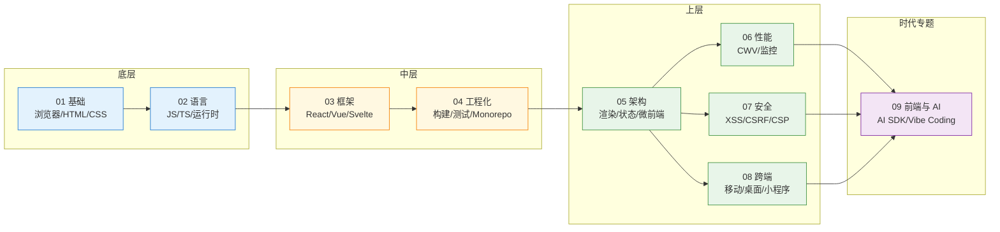

# 前端工程

> 一句话定位：**现代前端工程的知识地图——从浏览器原理到 AI 协同开发**

本章节是仓库「前端」主题的入口，对齐 `04.system-design` / `06.spring` / `11.ai` 的「序号分层 + 顶层 README」结构，把分散在前端各方向的内容按 **9 大模块** 收纳。

---

## 1. 9 模块导航

| 序号 | 主题 | 核心内容 |
|------|------|---------|
| 01 | [基础](01-foundation/) | 浏览器原理 / HTML 语义化 / CSS 工程化 / Web 标准 |
| 02 | [语言](02-language/) | JavaScript ES2024-2026 / TypeScript 5 工程实践 |
| 03 | [框架](03-frameworks/) | 2026 框架格局 / React / Vue / Svelte / 元框架 / 选型 |
| 04 | [工程化](04-engineering/) | Vite / Webpack / 包管理 / Monorepo / 测试 / Lint |
| 05 | [架构](05-architecture/) | 渲染模式 / 微前端 / Web Components / BFF / 状态 / 路由 |
| 06 | [性能](06-performance/) | Core Web Vitals / Lighthouse / 监控 |
| 07 | [安全](07-security/) | XSS/CSRF/CSP / CORS / Sessions / 依赖供应链 |
| 08 | [跨端](08-cross-platform/) | 移动 / 桌面 / 小程序 / PWA |
| 09 | [前端与 AI](09-frontend-and-ai/) | AI SDK / AI Native UI / AI IDE / Vibe Coding |

---

## 2. 知识脉络

**阅读顺序**：从底层原理（浏览器 / 语言）出发，向上构建框架与工程化体系，再向架构与性能深入，安全与跨端作为横切关切贯穿整个链路，AI 时代则把"如何与 AI 协同开发"作为收尾专题。

---

## 3. 学习路线

按角色与目标，给出 4 条主线：

1. **新人入门**：`01` → `02` → `03`(React 或 Vue 任一) → `04`
2. **后端补前端**：`02`(TypeScript) → `03`(React 或 Vue) → `05`(BFF / 微前端)
3. **架构师**：`05` → `06` → `07` → `03`(选型)
4. **AI 时代前端**：`03` → `04` → `09`

---

## 4. 交叉引用

- [`02.computer-basics/01-network/`](../02.computer-basics/01-network/) — HTTP / HTTPS / HTTP2 / HTTP3 协议族
- [`05.tools/monorepo/`](../05.tools/monorepo/) — Monorepo 工具链（与 `04-engineering` 互补）
- [`11.ai/`](../11.ai/) — AI 知识体系（`09-frontend-and-ai` 的上游）
- [`12.story/`](../12.story/) — 阿明餐厅故事：前端篇、多端篇、AI 学习悖论
- [`13.split-hairs/09.front-end/`](../13.split-hairs/09.front-end/) — 前端咬文嚼字小专题

---

## 5. 开源参考

| 类别 | 项目 | 关联模块 |
|------|------|---------|
| **构建工具** | [Vite](https://github.com/vitejs/vite) / [Rspack](https://github.com/web-infra-dev/rspack) / [Turbopack](https://turbo.build/pack) | 04 工程化 |
| **框架** | [React](https://github.com/facebook/react) / [Vue](https://github.com/vuejs/core) / [Svelte](https://github.com/sveltejs/svelte) / [Astro](https://github.com/withastro/astro) | 03 框架 |
| **元框架** | [Next.js](https://github.com/vercel/next.js) / [Nuxt](https://github.com/nuxt/nuxt) / [SvelteKit](https://github.com/sveltejs/kit) | 05 架构 |
| **UI / 设计系统** | [shadcn/ui](https://github.com/shadcn-ui/ui) / [Material UI](https://github.com/mui/material-ui) / [Ant Design](https://github.com/ant-design/ant-design) | 05 架构 |
| **AI SDK** | [Vercel AI SDK](https://github.com/vercel/ai) / [Anthropic SDK](https://github.com/anthropics/anthropic-sdk-typescript) | 09 前端与 AI |
| **AI 编码工具** | [Cursor](https://www.cursor.com/) / [Claude Code](https://docs.claude.com/en/docs/claude-code) / [Windsurf](https://codeium.com/windsurf) | 09 前端与 AI |
| **跨端框架** | [React Native](https://github.com/facebook/react-native) / [Flutter](https://github.com/flutter/flutter) / [Tauri](https://github.com/tauri-apps/tauri) / [Taro](https://github.com/NervJS/taro) | 08 跨端 |
| **测试** | [Vitest](https://github.com/vitest-dev/vitest) / [Playwright](https://github.com/microsoft/playwright) | 04 工程化 |
| **性能监控** | [web-vitals](https://github.com/GoogleChrome/web-vitals) | 06 性能 |

---

## 6. 章节统计

- **一级模块数**：9（01 基础 / 02 语言 / 03 框架 / 04 工程化 / 05 架构 / 06 性能 / 07 安全 / 08 跨端 / 09 前端与 AI）
- **二级子 README 数**：28 个
  - 01 基础：2（browser-rendering / css-engineering）
  - 02 语言：2（typescript / runtime）
  - 04 工程化：2（vite / monorepo-practice）
  - 05 架构：7（rendering-modes / state-management / routing / micro-frontend / web-components / bff / design-system）
  - 06 性能：2（core-web-vitals / monitoring）
  - 07 安全：6（xss / csrf / csp / supply-chain / cors / sessions）
  - 08 跨端：2（react-native / mini-program）
  - 09 前端与 AI：2（ai-sdk / vibe-coding）
- **互引章节**：[`11.ai/`](../11.ai/)、[`12.story/`](../12.story/)、[`13.split-hairs/09.front-end/`](../13.split-hairs/09.front-end/)
