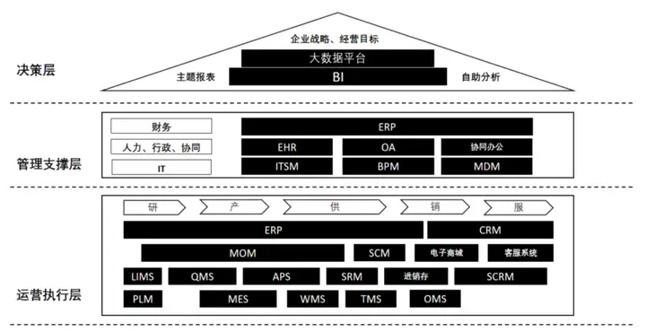
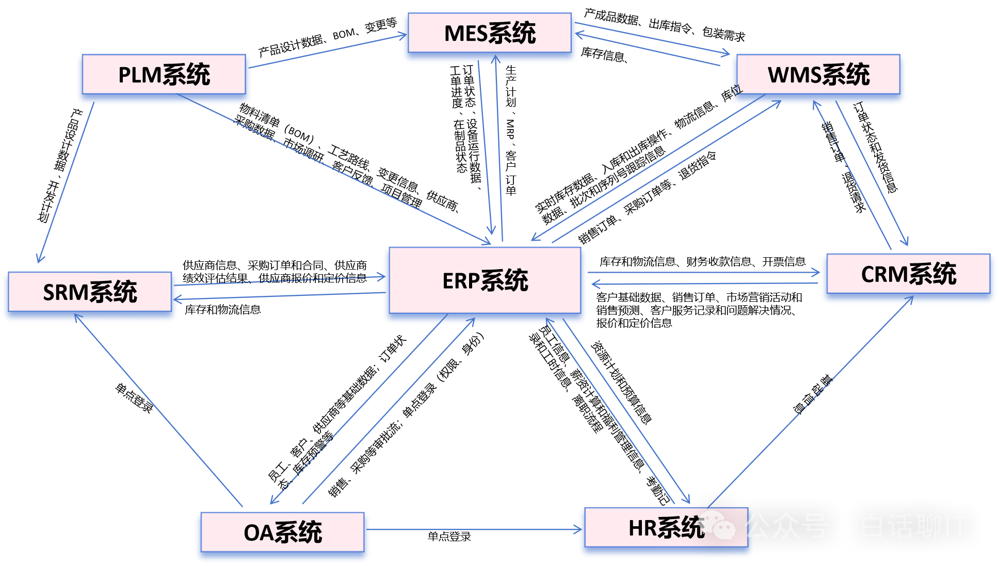

# 常用系统

**企业的数字化转型，一定是战略驱动的**。那么，如何落地实现经营目标呢？传统企业的决策和制定指标通常是拍脑袋完成的，而数字化企业则依赖于数据来支持战略决策，用数据驱动业务发展。在战略和经营目标之下，我们需要构建完整的管理支撑能力，让组织、人员和机制相匹配，而系统则是实现这种支撑能力的得力助手。

**接下来我们要考虑的是业务运营执行层面**。区别于传统的信息化，数字化更注重多过程管理，注重全要素数据化，从“研产供销服”到“人机料法环”，都要能够实现在线、链接。基于以上的企业业务开展模型，对数字化系统进行了分层和分类。

系统就是保存各种东西的集合：
- 哪些东西需要保存、需要放在一起；
- 哪些东西使用有先后顺序、需要合理摆放；
- 哪些东西放在一起可能产生不良反应、需要避开存放等。

## 系统名词表

| 缩写    | 全称                                       | 主要功能                                  | 关键优势                     | 适用场景        |
|-------|------------------------------------------|---------------------------------------|--------------------------|-------------|
| MES   | Manufacturing Execution System           | 实时监控和管理工厂操作，提供生产进度和设备效率信息。            | 提高生产透明度和效率，优化生产流程。       | 制造和生产环境。    |
| ERP   | Enterprise Resource Planning             | 集成企业所有部门的关键业务过程，提供共享数据源。              | 提高数据精确性和决策速度，减少数据重复。     | 多元化企业资源管理。  |
| SCM   | Supply Chain Management                  | 管理供应链活动，从采购到产品交付。                     | 降低成本，提高供应链的透明度和响应速度。     | 供应链管理。      |
| WMS   | Warehouse Management System              | 管理仓库操作，包括库存跟踪和货物处理。                   | 提高库存准确性和仓库操作效率。          | 仓库和物流中心。    |
| APS   | Advanced Planning and Scheduling         | 高级计划与排程系统，优化资源使用和生产能力。                | 提高生产计划的效率和准确性。           | 生产计划和调度。    |
| SCADA | Supervisory Control And Data Acquisition | 监督控制与数据采集系统，监控和控制工业过程，收集实时数据。         | 远程监控和控制，提高操作效率。          | 工业自动化和远程监控。 |
| PLM   | Product Lifecycle Management             | 产品生命周期管理系统，管理产品从概念到退役的整个生命周期。         | 加速产品开发，优化资源使用。           | 产品开发和管理。    |
| QMS   | Quality Management System                | 质量管理系统，管理和改进产品和服务质量，确保合规性。            | 保证产品和服务质量，提高客户满意度。       | 质量控制和保证。    |
| CRM   | Customer Relationship Management         | 客户关系管理系统，管理客户关系和互动，提高客户满意度和忠诚度。       | 提高销售效率，增强客户服务。           | 销售和客户服务。    |
| EAM   | Enterprise Asset Management              | 企业资产管理，管理企业物理资产和基础设施，最大化资产性能和价值。      | 降低运营成本，提高资产利用率。          | 资产管理和维护。    |
| SRM   | Supplier Relationship Management         | 供应商管理系统，管理供应商关系，优化采购流程，提高供应链稳定性。      | 增强供应商合作，降低采购成本，提高供应链效率。  | 供应链管理。      |
| OMS   | Order Management System                  | 订单管理系统，管理订单处理流程，包括订单接收、处理和发货。         | 提高订单处理效率，减少错误和延误。        | 电子商务和零售。    |
| SCRM  | Social Customer Relationship Management  | 社交客户关系管理系统，通过社交媒体平台管理客户关系，提高客户互动和满意度。 | 利用社交媒体提高品牌影响力和客户忠诚度。     | 社交媒体营销。     |
| OA    | Office Automation                        | 办公管理系统，实现办公流程的自动化，提高工作效率。             | 降低办公成本，提高团队协作效率。         | 企业内部管理。     |
| MOM   | Manufacturing Operation Management       | 制造运营管理，综合管理制造操作，包括生产计划、调度和执行。         | 提高制造效率，优化资源使用。           | 制造和生产环境。    |
| TMS   | Transportation Management System         | 运输管理系统，管理运输流程，包括物流规划、调度和跟踪。           | 降低运输成本，提高物流效率。           | 物流和运输。      |
| LIMS  | Laboratory Information Management System | 实验室信息管理系统，管理实验室信息，包括样品管理、数据分析和报告。     | 提高实验室工作效率，确保数据准确性和合规性。   | 实验室管理。      |
| CMS   | Content Management System                | 内容管理系统，管理网站、博客等的内容，包括创建、编辑和发布。        | 提供易于使用的内容管理平台，提高内容质量和效率。 | 内容管理。       |
| BI    | Business Intelligence                    | 商业智能系统，提供数据分析和报告，支持企业决策。              | 提供数据驱动的决策支持，提高业务洞察力和效率。  | 企业决策支持。     |
| PMS   | Project Management System                | 项目管理系统，管理项目流程，包括项目计划、资源分配和进度跟踪。       | 提高项目管理效率，确保项目按时交付和成本控制。  | 项目管理。       |

## 系统间关系

| 系统1 | 系统2   | 关系说明                | 数据交换方式        | 集成关键点         | 技术细节           | 用户角色        | 安全性考虑    | 维护和支持       | 可扩展性       | 示例                   | 响应时间和性能      |
|-----|-------|---------------------|---------------|---------------|----------------|-------------|----------|-------------|------------|----------------------|--------------|
| ERP | MES   | MES接收ERP生产计划并执行     | API, 直接数据库访问  | 生产计划同步，实时数据反馈 | 使用中间件进行数据映射和转换 | 生产经理，操作员    | 确保数据传输加密 | 定期升级和技术支持   | 支持新工艺和设备集成 | 集成SAP ERP与MES系统      | 快速响应生产变更     |
| ERP | SCM   | SCM与ERP共享物料和库存信息    | EDI, Web服务    | 库存同步，订单处理     | 集成计划和执行监控      | 采购经理，供应链分析师 | 防止未授权访问  | 系统升级和合作伙伴集成 | 支持新的物流渠道   | 集成Oracle ERP与SCM系统   | 减少库存积压       |
| ERP | WMS   | WMS提供ERP库存的实时数据     | 条形码扫描，RFID    | 库存准确性，仓库操作效率  | WMS API与ERP同步  | 仓库管理员，物流协调员 | 仓库数据安全   | 硬件维护和软件升级   | 适应新的仓库技术   | 集成Dynamics ERP与WMS系统 | 提高库存查询速度     |
| ERP | APS   | APS为ERP提供精细的生产排程    | 计划数据文件，API    | 生产资源优化，计划精度   | 排程算法集成         | 生产规划师，调度员   | 保护计划数据   | 定期优化排程逻辑    | 适应多变的市场需求  | 集成ERP与APS系统          | 优化生产流程       |
| MES | SCADA | SCADA为MES提供生产设备数据   | OPC, MQTT     | 实时监控，设备控制     | 实时数据接口         | 维护技术员，生产监督  | 设备访问控制   | 设备和软件维护     | 集成新设备      | 集成MES与SCADA系统        | 实时监控生产线      |
| ERP | SCADA | SCADA提供ERP生产过程数据    | 定制接口，数据库      | 生产监控，性能分析     | 数据采集和报告        | 生产工程师，数据分析师 | 保护生产数据   | 定期校准和维护     | 集成新技术      | 集成ERP与SCADA系统        | 快速响应设备故障     |
| ERP | PLM   | PLM与ERP集成，更新产品设计信息  | 集成平台，API      | 产品设计到生产的转换    | 产品数据管理         | 产品经理，设计工程师  | 保护知识产权   | 产品生命周期维护    | 支持新产品开发    | 集成ERP与PLM系统          | 加速产品设计到生产的流程 |
| ERP | QMS   | QMS与ERP集成，确保产品和服务质量 | 数据接口，报告       | 质量控制，客户满意度    | 质量数据分析         | 质量经理，检验员    | 保护质量记录   | 质量系统维护      | 适应新质量标准    | 集成ERP与QMS系统          | 提高质量问题响应速度   |
| ERP | CRM   | CRM与ERP集成，共享客户数据    | CRM系统API，数据同步 | 销售效率，客户服务     | 客户数据集成         | 销售代表，客户服务代表 | 保护客户隐私   | CRM系统升级     | 支持新销售渠道    | 集成ERP与CRM系统          | 提升客户满意度      |
| ERP | EAM   | EAM提供ERP资产信息和维护数据   | 资产数据接口，API    | 资产使用优化，维护计划   | 资产数据同步         | 资产管理者，维护协调员 | 保护资产信息   | 资产系统维护      | 集成新资产类型    | 集成ERP与EAM系统          | 优化资产使用效率     |
