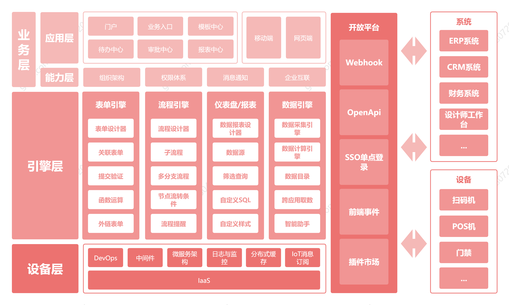

# 零代码平台高性能可扩展架构设计

## PlantUML架构图代码

```plantuml
@startuml ZeroCodePlatform_Architecture

skinparam {
    shadowing false
    linetype ortho
    defaultTextAlignment center
    componentStyle rectangle
}

title 零代码平台高性能可扩展架构

rectangle "用户交互层" as ui_layer #E1F5FE {
    rectangle "Web前端" as web_ui <<UI>>
    rectangle "移动端" as mobile_ui <<UI>>
}

rectangle "核心服务层" as core_layer #BBDEFB {
    rectangle "API网关" as gateway <<Gateway>> #C8E6C9
    
    rectangle "表单引擎" as form_engine <<Service>> {
        rectangle "表单设计器" as form_designer
        rectangle "表单渲染器" as form_renderer
        rectangle "表单数据服务" as form_data
    }
    
    rectangle "流程引擎" as workflow_engine <<Service>> {
        rectangle "流程设计器" as workflow_designer
        rectangle "流程执行器" as workflow_executor
        rectangle "任务分配器" as task_assigner
    }
    
    rectangle "数据处理引擎" as data_engine <<Service>> {
        rectangle "数据转换器" as data_transformer
        rectangle "数据聚合器" as data_aggregator
        rectangle "报表生成器" as report_generator
    }
}

rectangle "数据持久层" as data_layer #B3E5FC {
    database "表单元数据存储" as form_meta <<DB>>
    database "表单数据存储" as form_data_db <<DB>>
    database "流程定义存储" as workflow_meta <<DB>>
    database "流程实例存储" as workflow_instance <<DB>>
    database "业务数据存储" as business_data <<DB>>
    database "报表配置存储" as report_meta <<DB>>
}

rectangle "集成与扩展层" as ext_layer #C5CAE9 {
    rectangle "消息队列" as mq <<MQ>> #FFCCBC
    rectangle "外部系统连接器" as connectors <<Service>>
    rectangle "AI/ML服务" as ai_service <<Service>>
}

rectangle "基础设施" as infra_layer #CFD8DC {
    rectangle "缓存层\n(Redis集群)" as cache <<Cache>>
    rectangle "搜索引擎\n(Elasticsearch)" as search <<Search>>
    rectangle "对象存储\n(MinIO)" as storage <<Storage>>
}

' 数据流关系
web_ui --> gateway : "1. 用户请求"
mobile_ui --> gateway : "1. 用户请求"

gateway --> form_engine : "2. 表单操作请求"
gateway --> workflow_engine : "3. 流程操作请求"
gateway --> data_engine : "4. 数据操作请求"

form_designer --> form_meta : "5a. 保存元数据"
form_renderer --> form_meta : "5b. 读取元数据"
form_data --> form_data_db : "5c. 持久化数据"
form_renderer <--> cache : "6. 缓存加速"

workflow_designer --> workflow_meta : "7a. 保存流程定义"
workflow_executor --> workflow_meta : "7b. 读取流程定义"
workflow_executor --> workflow_instance : "7c. 持久化实例"
workflow_executor --> mq : "8. 异步任务分发"
task_assigner --> mq : "9. 任务通知"

data_transformer --> business_data : "10a. 数据处理"
data_aggregator --> business_data : "10b. 数据聚合"
report_generator --> report_meta : "10c. 报表配置"
report_generator --> search : "10d. 复杂查询"
report_generator --> cache : "10e. 报表缓存"

connectors <--> mq : "11. 事件驱动集成"
ai_service <--> business_data : "12. 智能分析"

' 扩展性说明
note right of form_engine
    表单引擎支持热部署新表单类型
    表单渲染器使用虚拟DOM技术提升性能
end note

note right of workflow_engine
    流程执行器支持状态机模式
    可水平扩展处理高并发流程实例
end note

note right of data_engine
    数据聚合器支持流式处理
    报表生成器使用预计算优化性能
end note

@enduml
```

## 架构设计说明

### 1. 整体结构

架构分为四个主要层次：
1. **用户交互层**：提供Web和移动端多渠道访问
2. **核心服务层**：包含三大核心引擎（表单、流程、数据）
3. **数据持久层**：分库分表存储各类元数据和业务数据
4. **集成与扩展层**：支持系统集成和智能扩展

### 2. 性能和扩展性考虑

- **横向扩展方案**：
    - 表单/流程/数据服务均可独立扩展
    - 使用API网关进行请求路由和负载均衡
    - 数据库采用读写分离+分片策略
    - 缓存层使用Redis集群支持高并发

- **关键扩展点**：
    - 表单引擎支持动态加载新表单类型
    - 流程引擎可水平扩展处理更多实例
    - 数据处理引擎支持流式处理大数据量

### 3. 数据流说明

1. 用户请求通过网关路由到相应服务
2. 表单操作流（设计→存储→渲染→数据持久化）
3. 流程操作流（设计→执行→实例存储→任务分发）
4. 数据处理流（转换→聚合→报表生成→缓存）

异步操作：
- 流程任务通知通过消息队列实现
- 外部系统集成采用事件驱动架构
- 报表生成使用预计算+缓存策略

### 4. 关键技术亮点

#### 表单搭建能力
- **组件**：表单设计器、渲染器、数据服务
- **优势**：
    - 拖拽式设计器支持快速构建复杂表单
    - 渲染器使用虚拟DOM技术提升性能
    - 元数据与数据分离存储，支持版本控制
- **性能提升**：
    - 缓存层存储常用表单结构
    - 数据服务支持批量操作减少IO

#### 企业审批流程
- **组件**：流程设计器、执行器、任务分配器
- **优势**：
    - 可视化流程设计支持复杂审批逻辑
    - 状态机模式确保流程一致性
    - 异步任务处理避免阻塞
- **可靠性提升**：
    - 流程实例持久化支持故障恢复
    - 消息队列确保任务不丢失

#### 数据处理及图表
- **组件**：数据转换器、聚合器、报表生成器
- **优势**：
    - 流式处理支持大数据量
    - 预计算策略优化报表生成
    - 搜索引擎支持复杂查询
- **性能优化**：
    - 多级缓存（Redis+CDN）
    - 读写分离架构
    - 异步报表生成避免实时计算

### 5. 关键设计决策

1. **微内核架构**：
    - 核心引擎保持最小化，功能通过插件扩展
    - 提高系统稳定性和可维护性

2. **事件驱动设计**：
    - 使用消息队列解耦各服务
    - 提高系统弹性和可扩展性

3. **多级缓存策略**：
    - Redis缓存热点数据
    - 浏览器缓存静态资源
    - CDN分发报表结果

4. **分库分表策略**：
    - 表单/流程/业务数据物理隔离
    - 按租户或时间分片存储历史数据

### 6. 组件功能说明

| 组件    | 功能         | 作用          |
|-------|------------|-------------|
| API网关 | 请求路由、认证、限流 | 统一入口，保护后端服务 |
| 表单引擎  | 表单全生命周期管理  | 核心业务数据采集能力  |
| 流程引擎  | 企业审批流程执行   | 业务流程自动化核心   |
| 数据引擎  | 数据处理与可视化   | 业务洞察和决策支持   |
| 消息队列  | 异步任务处理     | 系统解耦和弹性扩展   |
| 缓存层   | 热点数据加速     | 提升系统响应速度    |
| 搜索引擎  | 复杂查询支持     | 增强数据分析能力    |

此架构设计通过清晰的层次划分、合理的组件解耦和针对性的性能优化，能够满足零代码平台高并发、大数据量和复杂业务流程的处理需求。