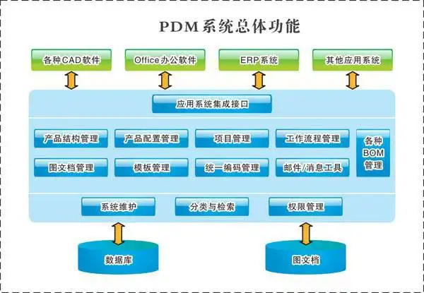

# PDM

PDM是Product Data Management的缩写，即产品数据管理，是现代产品开发环境中发展起来的一项管理产品数据的新技术，用来管理所有与产品相关的信息(包括零件信息、配置、文档、CAD文件、结构、权限信息等)和所有与产品相关的过程(包括过程定义和管理)才能帮助工作小组、部门或企业在整个产品生命周期内对产品数据和开发过程实施有效地管理，从而提高产品研发管理水平，减少工程更改，提高产品质量，缩短产品研发周期。

## PDM产生的背景
在20世纪的60，70年代，企业在其设计和生产过程中开始使用CAD，CAM等技术，新技术的应用在促进生产力发展的同时也带来了新的挑战。对于制造企业而言，虽然各单元的计算机辅助技术己经日益成熟，但都自成体系，彼此之间缺少有效的信息共享和利用，形成所谓的“信息孤岛“，并且随着计算机应用的飞速发展，随之而来的各种数据也急剧膨胀，对企业的相应管理形成巨大压力：数据种类繁多、数据重复冗余、数据检索困难、数据的安全性及共享管理等等。

许多企业己经意识到，实现信息的有序管理将成为在未来的竞争中保持领先的关键因素。在这一背景下产生一项新的管理思想和技术PDM，即以软件技术为基础，以产品为核心，实现对产品相关的数据、过程、资源一体化集成管理的技术。PDM明确定位为面向制造企业，以产品为管理的核心，以数据、过程和资源为管理信息的三大要素。

## PDM的发展历程
PDM技术一产生，便受到制造企业的极大关注，同时也促进了PDM技术的迅猛发展，使其从最初的单一功能的数据管理技术发展成为当今的产品生命周期管理思想模式。具体地，PDM的发展主要经历了以下四个阶段：纯数据管理的PDM、应用集成的PDM、过程集成的PDM，跨企业的全生命周期管理PLM(Product Lifecycle Management)即产品生命周期管理)。

### 纯数据管理的PDM
PDM技术的产生，最初就是因为大量产品数据的管理乏力，所以最初的PDM系统仅仅对产品研发过程中产生的数据进行管理，如对工程图纸、技术报告、说明书以及其它研发信息等进行有效管理，尚缺乏信息集成的能力。

### 应用集成的PDM
随着计算机技术的快速发展，到上世纪80年代，CAD(计算机辅助设计技术)技术已经在企业得到了广一泛的应用，CAD技术使得设计人员彻底甩开图板，从繁琐的手工制图工作中解放了出来，大大提高了绘图效率。但是设计人员在提高绘图效率的同时，也需要花费大量时问管理CAD图样数据，于是CAD软件开发商结合其CAD产品，开发出能与其CAD软件集成的PDM系统，从而实现产况，结构管理、零部件数据查询等功能，具备了信息集成的能力，但还不能对产品研发过程进行有效控制。

### 过程集成的PDM
随着信息集成的PDM系统的广泛应用，PDM系统的应用已经在企业中取得巨大成效，此时，PDM己经成为IT产业的一个重要分支。到上世纪90年代中期，很多PDM产品的集成能力和开放程度都有较大的提升，少数PDM产品曾加了工作流程管理、工程变更管理以及项目管理的功能，己经从信息管理发展到过程管理，可以实现企业级的信息集成和过程集成。

### 跨企业的全生命周期管理PLM
上世纪90年代末，随着市场竞争的加剧以及互联网技术的发展，制造业巨头纷纷利用电子商务开展全球化经营战略，全球化经营的趋势对PDM产品向跨企业的全生命周期管理发展起了很大的促进作用，为了使分布在世界各地的企业成员能并行地开展协同工作，一种以PDM为核心的产品全生命周期管理理念适时诞生。

## PDM的应用现状
PDM是当今计算机应用领域的重要技术之一，是产品工业中发展最快的一种技术。随着工业企业对PDM需求的增长，涌现了大量PDM系统产品。目前，PDM技术在国外已得到广泛的应用，美国CIMdata公司调查的企业中，98%的企业都要实施PDM。事实上，PDM系统的应用己经给企业带来了非凡的成就。

