# 零代码流程平台

## [宜搭核心能力](https://docs.aliwork.com/docs/yida_support/kab9piibinwhk1zn#miHco)
> 宜搭的核心能力分为基础能力、体系能力、开放连接和高扩展性四个部分，你可以参考以下内容了解宜搭的核心能力。
### 基础能力
> 宜搭基础能力提供了灵活的表单搭建能力、数字化的企业审批流程和丰富的数据处理及图表能力。你可以使用宜搭基础能力快速的搭建个性化应用。  

  
1. **表单**能力为你提供了丰富的字段类型，通过数据联动，关联表单，公式运算等能力，实现灵活的低代码可视化设计和页面搭建的功能。其中表单搭建能力分为普通表单和流程表单两种。
- 普通表单通常用于数据收集和事件跟进。 
- 流程表单通常用于业务审批和任务协同。
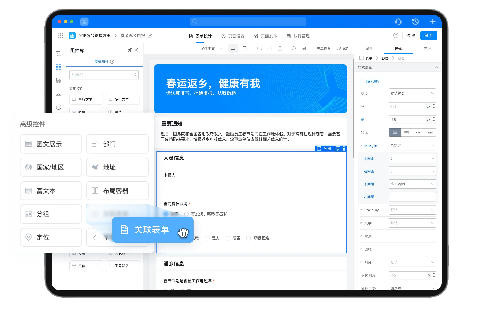

2. **审批流程**提供了丰富流程设计能力，支持流程节点新增、删除、编辑、配置节点审批人、审批规则、条件设置、节点动作等。
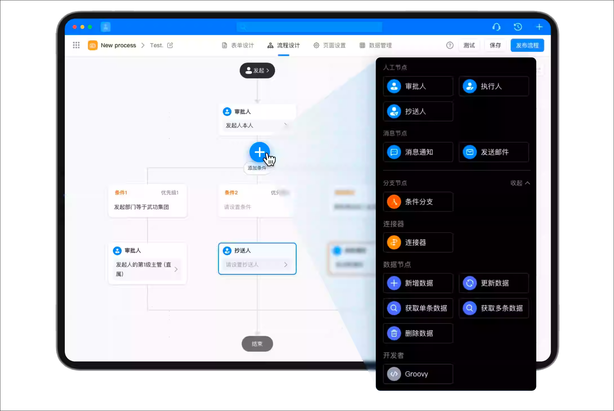

3. 宜搭**报表**提供了丰富的数据图表和数据处理能力，高效的可视化方案能为客户提供数据分析和洞察价值。
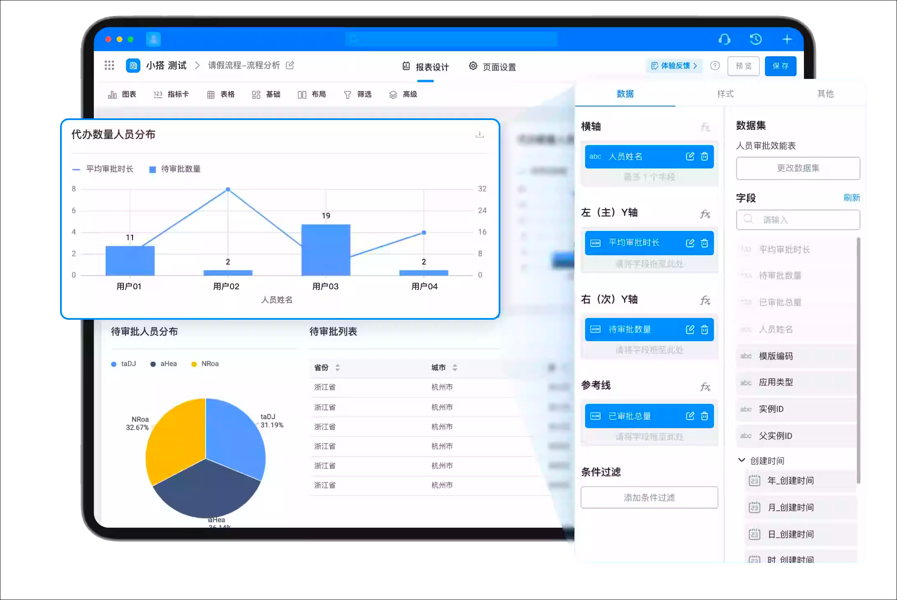

### 体系能力
> 使用宜搭创建的应用还支持打通钉钉组织架构，配置灵活高效的权限管控体系。并且还支持发送钉钉消息通知的能。
1. **权限管理**能力提供了权限自定义配置，满足灵活高效性的要求，分层分级的权限管理体系，保障权责一致，数据安全的一体化管控。
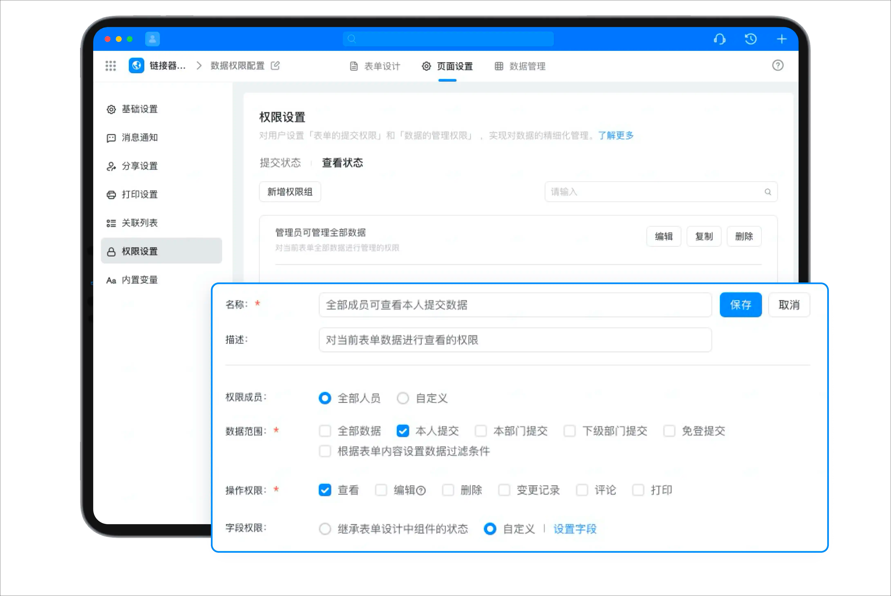

2. 通过打通钉钉**组织架构及关联组织**，实现钉钉组织内的角色，流程，数据，消息等互通，支持跨组织业务协同。
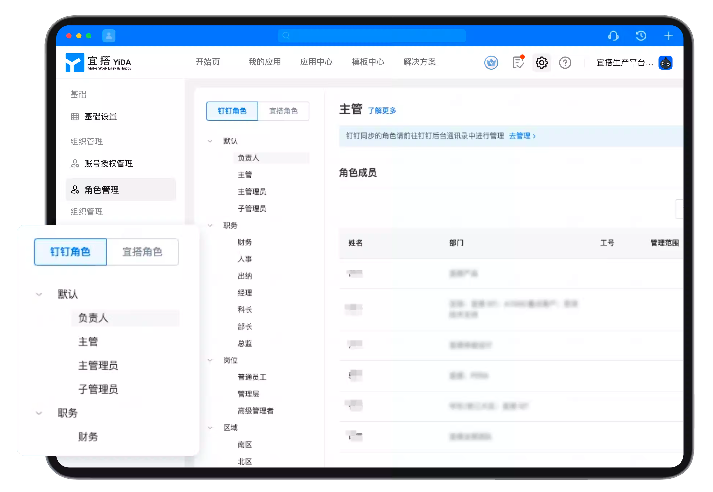

3. 通过深度整合钉钉的**消息能力**，使应用支持工作通知、待办、快捷卡片消息、邮件等多种灵活通知方式，满足各种业务场景。
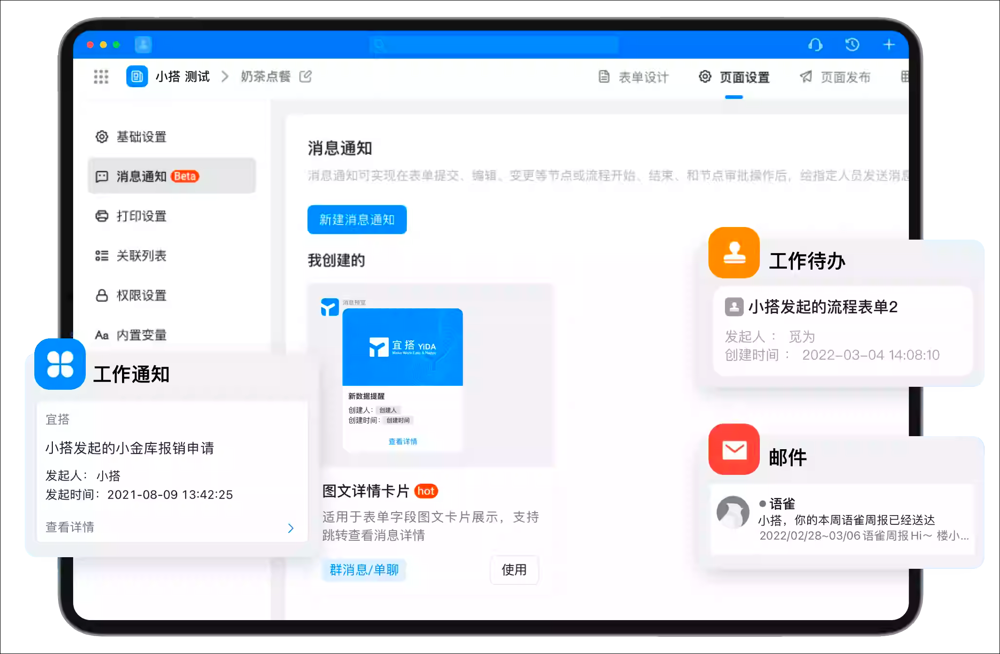

### 开放连接
> 打通阿里云和钉钉的底层能力和技术，将企业原有系统与钉钉连接，降低企业数字化门槛。
#### 强大的连接器能力
1. 可**连接钉钉一方**能力，如工作通知、待办、考勤等。同时支持自定义连接器， 实现钉钉宜搭与生态或三方应用的资源数据打通。
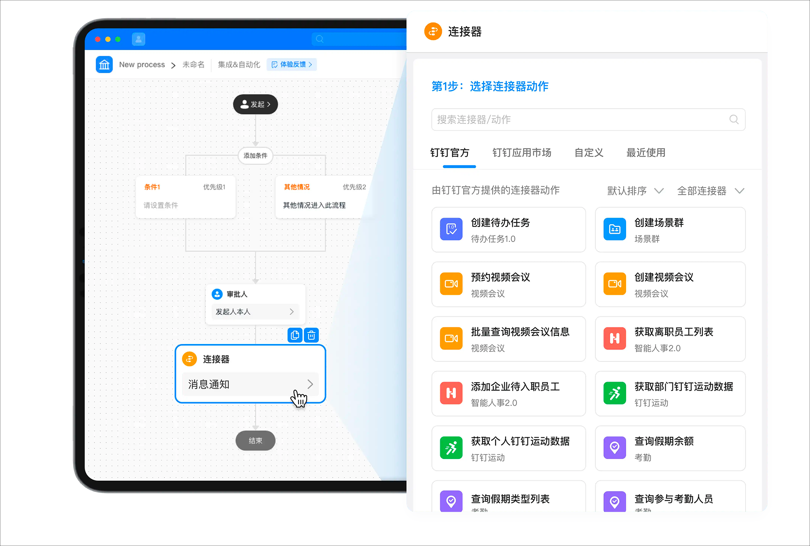

2. 宜搭平台为用户、生态伙伴**开放openAPI**，操作宜搭数据，灵活构建应用。
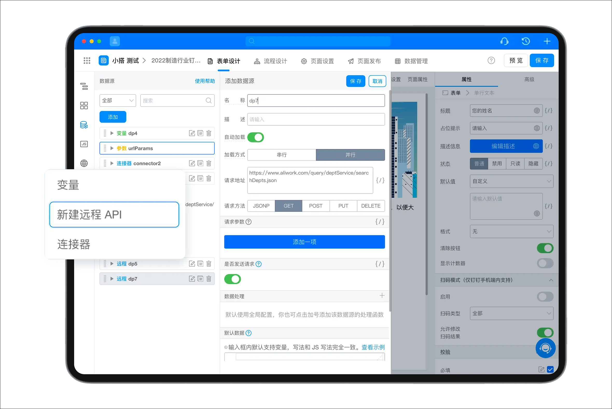

### 更多扩展性
> 宜搭具有出色的可扩展性和易维护性。它可以与阿里云其他产品无缝集成，实现数据共享和协同办公。同时，宜搭还支持自定义业务流程和数据字段，提供更加灵活的业务流程管理和优化方案。
> - 多样化组件
> 
> - 数据大屏
> 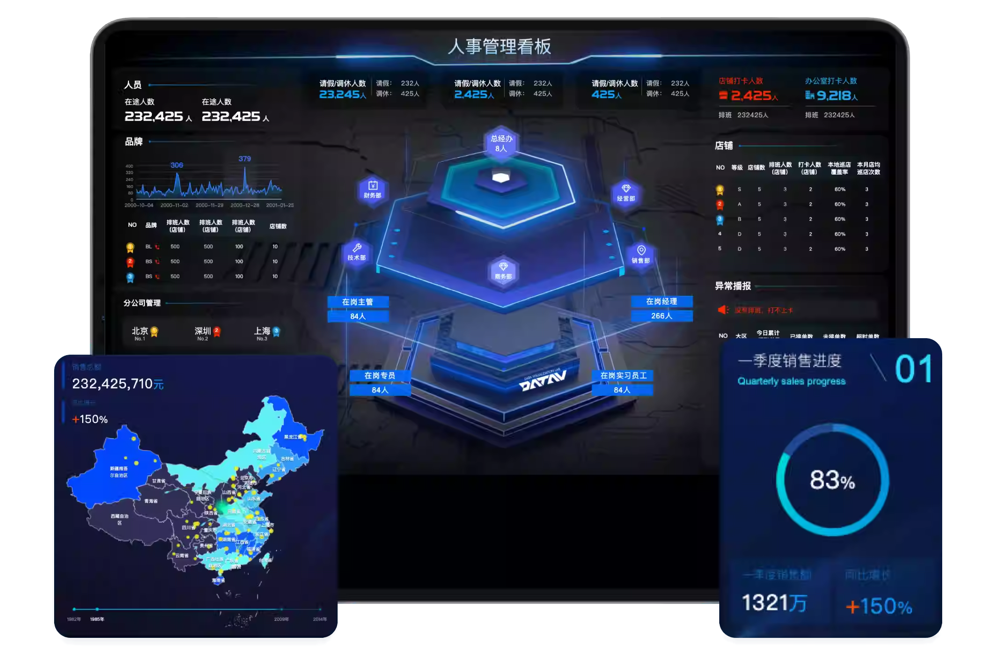
> - 自定义页面
> 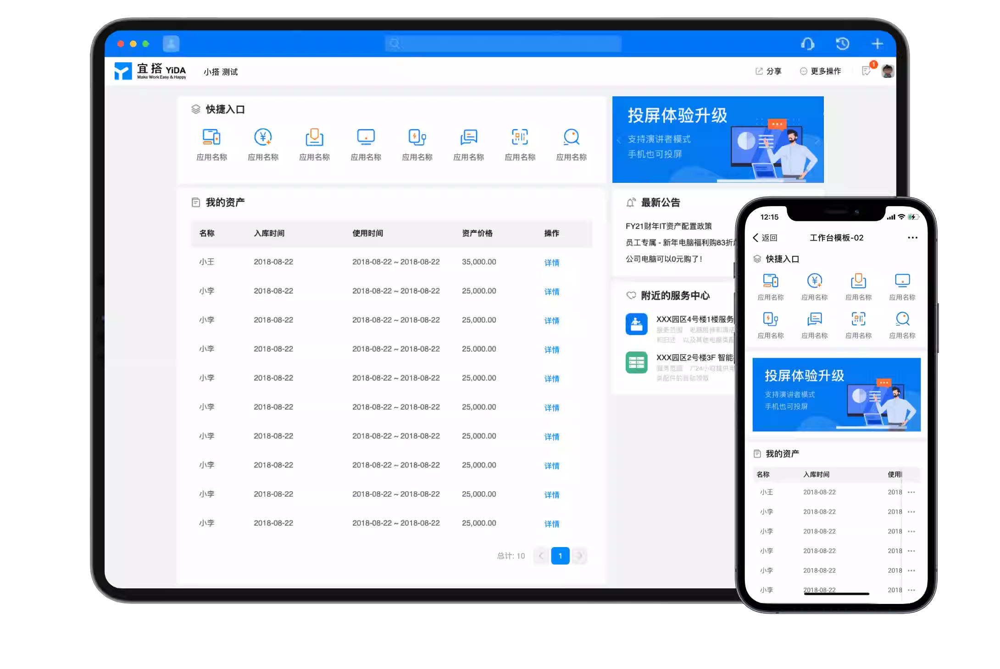
> - Excel 生成应用
> 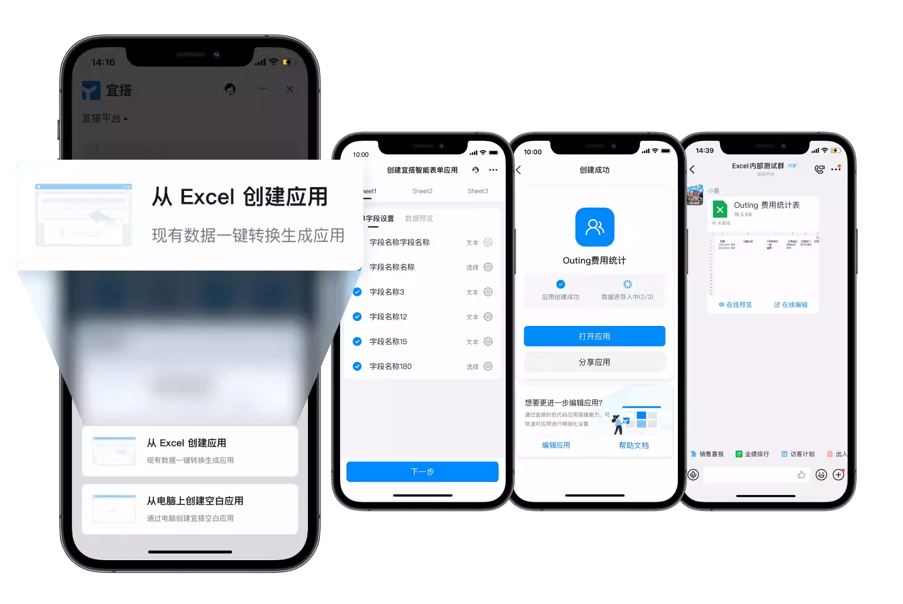
> - 酷应用
> 

## 总结一下
```
宜搭平台
├─基础能力
│  ├─表单
│  │  ├─普通表单
│  │  └─流程表单
│  ├─审批流程
│  └─[分析]报表
├─体系能力
│  ├─权限管理
│  ├─组织架构
│  ├─消息能力
│  └─[单点登录]
├─开放连接
│   ├─连接器
│   └─开放接口
└─更多扩展性
    ├─多样化组件
    ├─数据大屏
    ├─自定义页面
    ├─Excel 生成应用
    └─酷应用
```
## 宜搭产品核心特征
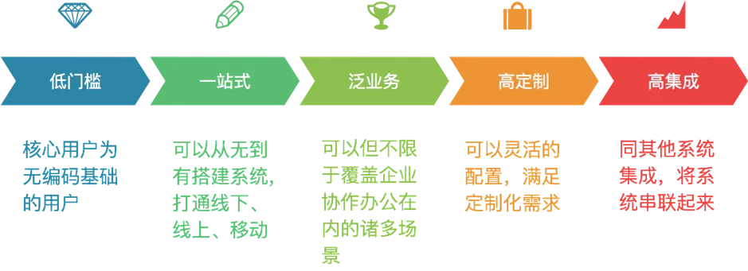

## 宜搭产品架构
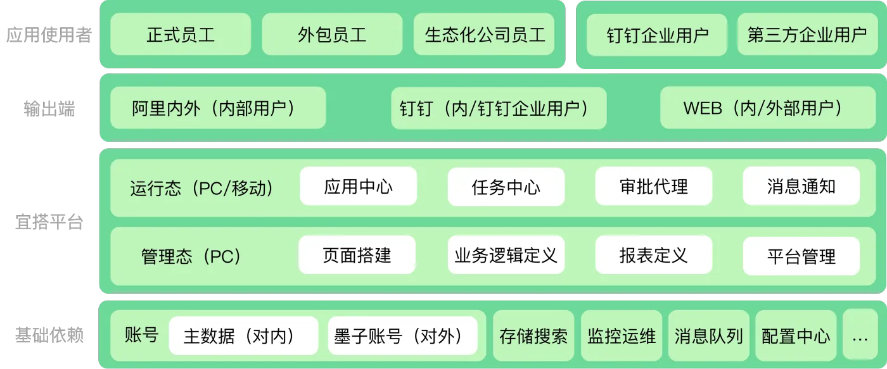

## 宜搭技术架构


## 简单云 零代码工具功能介绍


## 简单云 零代码开发关键步骤


## 简单云 典型场景模板框架


### 选型因素
#### 通用因素
##### 功能因素
> - 核心功能数据收集、流程运转、数据分析、数据展示、自动化
> - 预搭建的业务管理模板，覆盖常规企业80%的管理业务
##### 性能因素
> - 上手的难度：因为不同的开发者思考问题的方式、学习平台时采用的路径及开发习惯不同，平台是否好用，很大程度上取决于开发者个人的感受。
> - “硬实力”：比如响应速度、数据容量、安全性、功能迭代的频率等，需要使用者根据实际需求和预算进行考量。
#### 企业规模因素
##### 小微企业
> - 产品的易用性
> - 是否提供大量高质量的业务管理模板
> - 是否有覆盖中小企业的完善售后服务
##### 中大企业
> - 集成与扩展能力
> - 安全性与合规性
> - 数据应用能力

## 零代码流程平台功能架构
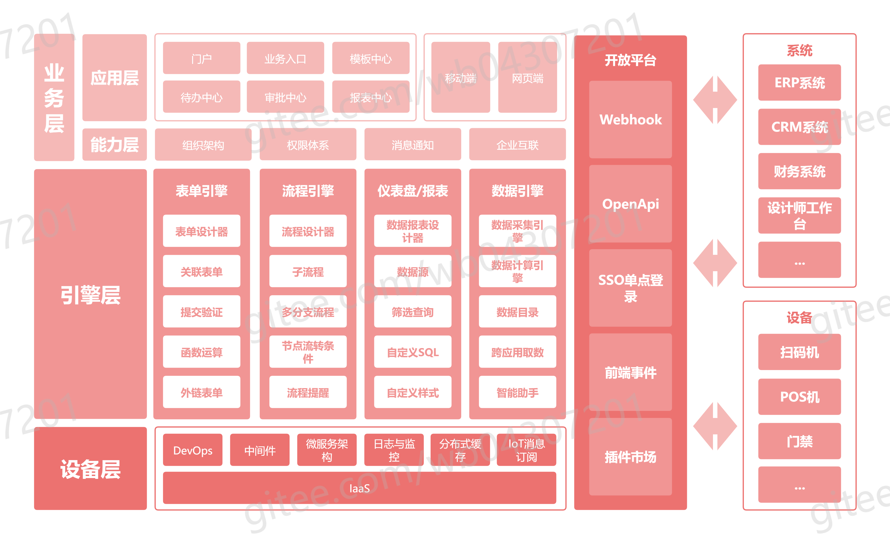

1. 表单引擎
2. [流程引擎](..%2F..%2F07.process-engine%2FREADME.md)
3. 自动化引擎
4. BI仪表盘
