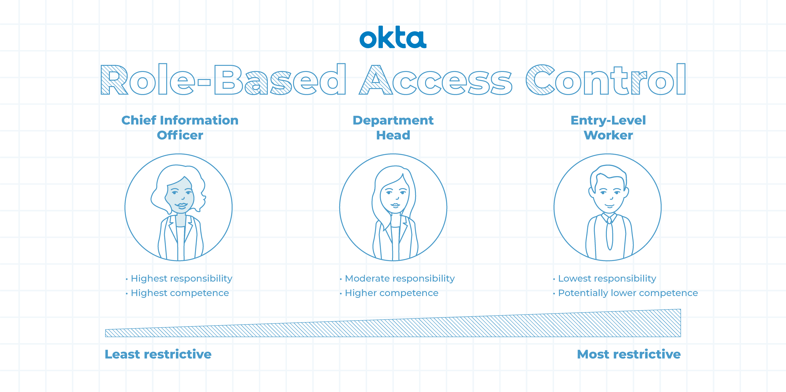
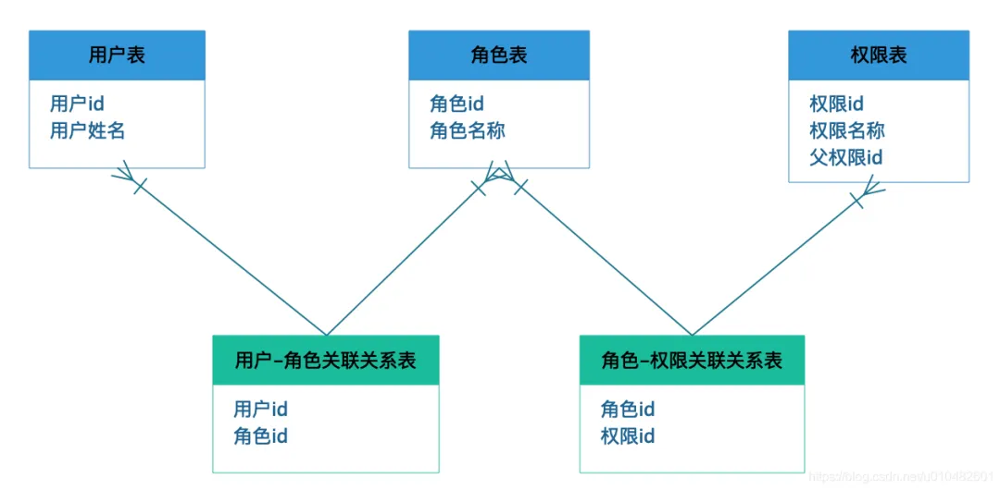
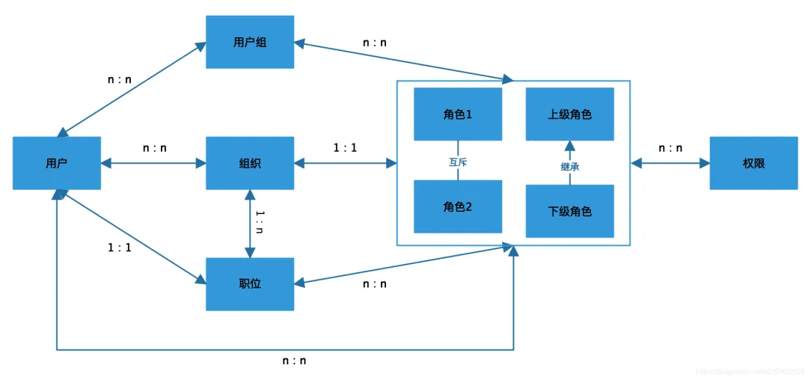
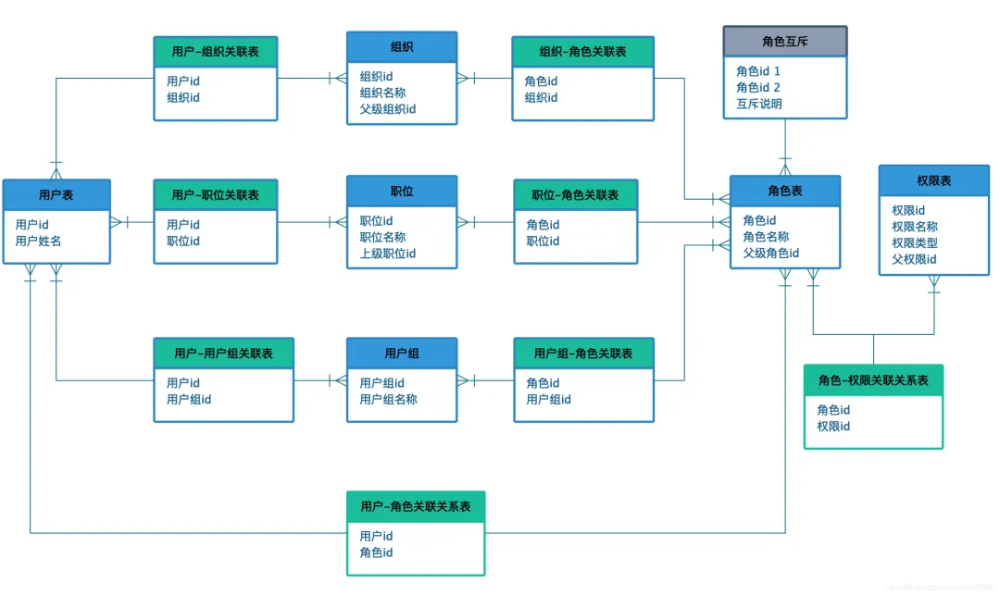
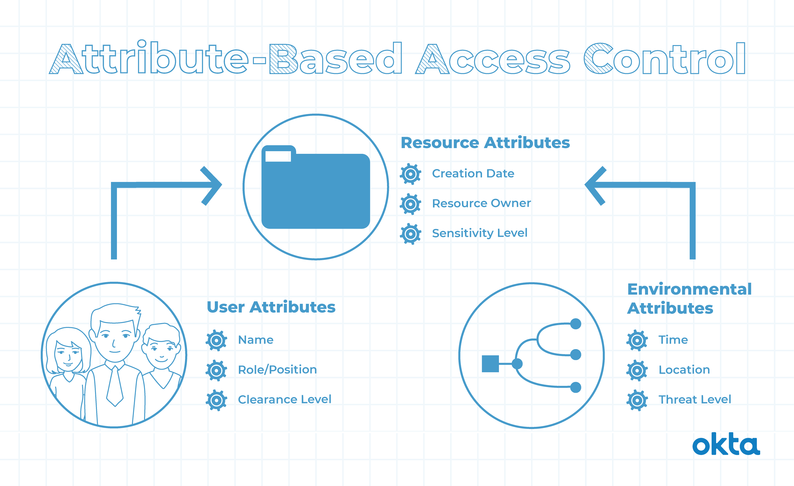

# 权限控制

> - `ACL`是最简单的权限模型，适用于小型系统。
> - `RBAC`基于角色进行权限控制，适合大型系统，尤其是公司内部管理。
> - `ABAC`是基于属性的控制，适合需要动态和灵活控制的复杂环境。

## ACL(Access Control List：访问控制列表)
> `ACL`是最简单的权限管理模型之一。它基于对象与主体之间的关系来控制访问权限。ACL
> 将权限直接与用户或用户组相关联，管理员直接给用户授予某些权限即可。  
> 这种模型适用于小型和简单系统，其中权限控制较为简单，并且角色和权限的变化较少。
### DAC（Discretionary Access Control,自主访问控制)
> 在`ACL`基础上，允许主体可以将自己拥有的 权限自主地授予其他主体，权限可以随意传递。缺点：权限控制比较分散，主体权限太大，有泄露信息的危险。
### AC（Mandatory Access Control,强制访问控制)
> 双向验证机制，常用于机密机构或者其他等级观念强的行列；主体和客体都有权限标识，主体能否对客体进行操作取决于双方的权限标识信息。缺点：控制严格、实现工作量大，缺乏灵活性。

## RBAC(Role-Based Access Control,基于角色的访问控制)
> `RBAC`
> 是应用最广泛的权限管理模型之一。它通过定义角色和角色的权限集合来管理访问控制。用户被分配到角色，角色与权限相关联，从而精确地控制用户对系统资源的访问。  
> 适用于大型系统，特别是那些需要灵活、可扩展的权限管理的场景。使用 RBAC 可以简化权限管理的复杂性并提高系统的安全性。
>   
> 一般最适合公司内部的管理系统，不适合对外互联网用户的系统。
### RBAC 三要素
> - **用户**：系统中的所有账户
> - **角色**：一系列权限的集合
> - **权限**：菜单、按钮、数据的增删改查
### 标准的RBAC模型表设计

### RBAC 的深度拓展
> `RBAC`模型可以分为：`RBAC0`、`RBAC1`、`RBAC2`、`RBAC3`四个阶段。  
> 一般公司使用`RBAC0`的模型就可以，`RBAC0`相当于底层逻辑，后三者都是在`RBAC0`模型上的拓展。
> - **`RBAC0`**: 用户和角色、角色和权限多对多的关系。
> - **`RBAC1`**: 增加了角色的分级逻辑，类似树结构，下一节点继承于上一节点的权限。
> - **`RBAC2`**: 增加更多限制条件：角色互斥、角色数量限制，为了权责明确、系统安全
> - **`RBAC3`**: 综合了`RBAC1`和`RBAC2`的所有特点。
### 理想的RBAC模型

### 理想的RBAC模型表设计

## ABAC(Attribute-Based Access Control,基于属性的访问控制)
> `ABAC`,又称为PBAC(Policy-Based Access Control,基于策略的访问控制),或CBAC(Claims-Based Access
> Control,基于声明的访问控制)。  
> `ABAC`是一种基于属性的权限管理模型，它根据多个属性（如用户属性、环境条件、时间等）来进行访问控制决策。  
> `ABAC`通过定义策略来决定用户是否有权访问特定的资源。  
> 适合于需要更细粒度、动态和灵活的访问控制的场景。ABAC 在复杂的环境中可以提供高度的可配置性和可扩展性。
> 
### ABAC 的四要素
> - **对象**：对象是当前请求访问资源的用户。用户的属性包括 ID，个人资源，角色，部门和组织成员身份等
> - **资源**：资源是当前用户要访问的资产或对象，例如文件，数据，服务器，甚至 API
> - **操作**：操作是用户试图对资源进行的操作。常见的操作包括 “读取”，“写入”，“编辑”，“复制” 和 “删除”
> - **环境**：环境是每个访问请求的上下文。环境属性包含访问的时间和位置，对象的设备，通信协议和加密强度等。

## 对比
| 权限管理模型 | 原理                      | 应用场景                                  | 需要创建的表结构                                                                     | 优缺点          |
|--------|-------------------------|---------------------------------------|------------------------------------------------------------------------------|--------------|
| DAC    | 允许用户自由地选择他们想要访问的资源。     | 适用于对数据安全性要求不高的场景，如个人电脑、家庭网络等。         | 无                                                                            | 灵活性高，但安全性较低。 |
| MAC    | 要求所有用户都必须遵守相同的规则。       | 适用于对数据安全性要求较高的场景，如银行、政府机构等。           | 无                                                                            | 安全性高，但灵活性较低。 |
| RBAC   | 将权限分配给一组角色，而不是单个用户。     | 适用于企业内部的权限管理，如员工、部门等。                 | 角色表 (role)、用户表 (user)、角色权限表 (role_permission)                                | 安全性高，灵活性较高。  |
| ABAC   | 根据用户的属性来决定他们是否可以访问某个资源。 | 适用于对数据安全性要求较高且需要个性化权限管理的场景，如医疗保健、金融等。 | 用户属性表 (user_attribute)、资源属性表 (resource_attribute)、用户 - 资源关系表 (user_resource) | 安全性高，灵活性较高。  |

## 实现系统访问控制模型的方法和技术
> - **身份认证技术**：用于验证用户的身份，例如密码、数字证书等。
> - **授权管理技术**：用于确定用户可以访问哪些资源和执行哪些操作，例如基于角色的访问控制`RBAC`、基于属性的访问控制`ABAC`等。
> - **访问日志记录技术**：用于记录用户的访问行为，以便进行审计和安全分析。
> - **安全策略管理技术**：用于定义和管理系统的安全策略，例如防火墙、入侵检测系统等。
> - **加密技术**：用于保护数据的机密性和完整性，例如 SSL/TLS 协议、AES 加密算法等。
> - **漏洞扫描和修复技术**：用于发现和修复系统中的漏洞，以提高系统的安全性。

## Casbin
> Casbin是一个强大且高效的开源访问控制库，支持各种访问控制模型，用于在全局范围内执行授权。
> 
> 执行一组规则就像在策略文件中列出主题、对象和期望的允许操作（或根据您的需要的任何其他格式）一样简单。 这在所有使用Casbin的流程中都是同义的。 开发者/管理员对布局、执行和授权条件的控制是完全的，这些都是通过模型文件设置的。 Casbin提供了一个Enforcer，用于根据提供给Enforcer的策略和模型文件验证传入的请求。
