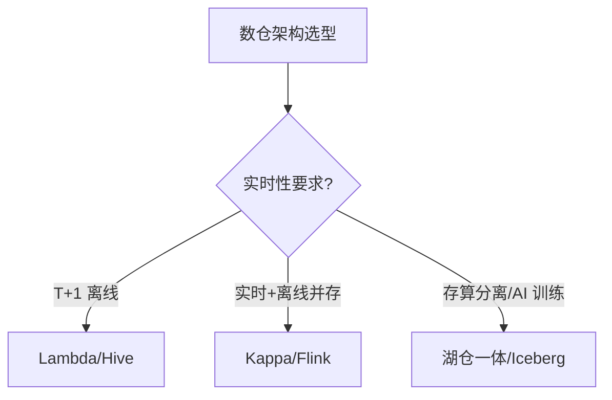
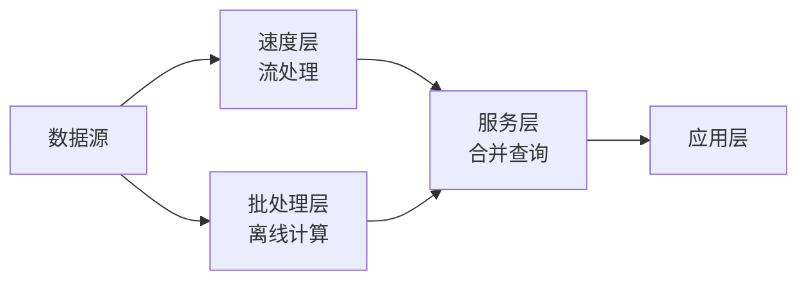
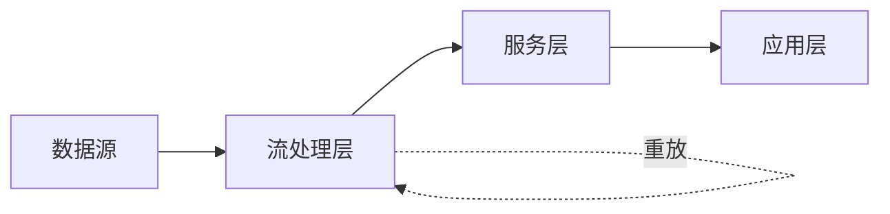
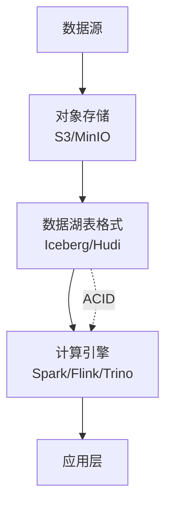
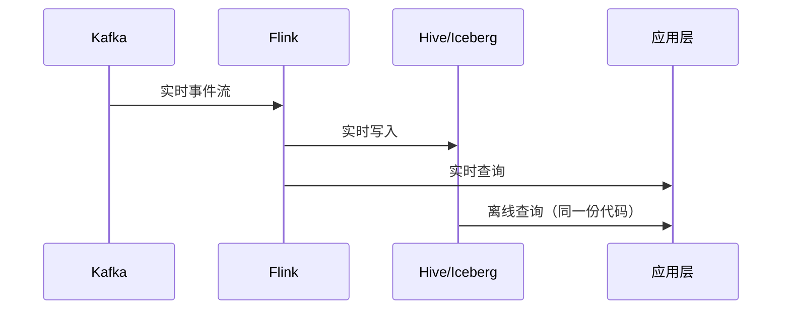

# 01 数仓架构

> 一句话定位：**Lambda / Kappa / 湖仓一体——大数据架构选型的三种主流范式**

本模块覆盖三种数仓架构范式：Lambda（实时+离线双链路）、Kappa（流批一体）、湖仓一体（存算分离 + AI 友好），对比延迟、复杂度、成本、适用场景。

---
## 引言：架构困境

01 数仓架构 的关键不是'选型'——是**选完之后怎么在 5 个 trade-off 里活下来**。

本篇用'决策困境'切入，比较几种主流路径并讲清取舍。

---

## 1. 本模块覆盖

| 主题 | 状态 | 说明 |
|------|------|------|
| Lambda 架构 | ✓ 已有 | 实时层 + 离线层双链路 |
| Kappa 架构 | ✓ 已有 | 单链路流批一体 |
| 湖仓一体 | ✓ 已有 | 数据湖 + 数仓融合 |
| 批流融合 | ✓ 已有 | Flink/Spark 流批统一 |

> 速查对比见 [📖 顶层 4.1 架构对比](../../README.md#41-架构对比)

---

## 2. 速查要点

- **Lambda 架构**：批层（离线准确）+ 速度层（实时近似）+ 服务层（合并查询）；复杂度高、成本高
- **Kappa 架构**：单一实时链路 + Kafka 重放历史；实现简单、延迟低
- **湖仓一体**：数据湖（对象存储 + 表格式）+ 数仓（ACID + 查询引擎）；AI/ML 训练友好
- **批流融合**：Flink / Spark 3.x 统一 API + 同一份代码处理流批

---

## 3. 选型建议

---

## 4. 与其他模块的关系

- **上游**：[08 同步工具](../08-sync-tools/)（数据采集）
- **下游**：被 [05 OLAP](../05-olap/) / [04 数据湖](../04-data-lake/) 复用
- **横向**：[03 实时计算](../03-realtime-compute/) / [06 调度](../06-scheduling/) 协同

---

## 5. 学习建议

- 先理解 [📖 顶层 4.1 架构对比](../../README.md#41-架构对比)
- 推荐学习路径：Lambda → Kappa → 湖仓一体
- 实战：先做 Lambda 小项目，再优化为 Kappa

---

## 6. 数据时效性

- Flink 2.0 / Spark 4.0 等流批统一引擎每年大版本
- Iceberg/Hudi/Delta Lake 每月小版本
- 架构选型每年更新（参考各厂商博客）

---

## 7. 关键术语

| 术语 | 解释 |
|------|------|
| Lambda | 实时+离线双链路架构 |
| Kappa | 单链路流批一体架构 |
| Iceberg | 数据湖表格式 |
| Hudi | 数据湖表格式 |
| Delta Lake | 数据湖表格式（Databricks） |
| 流批融合 | 同一份代码处理流批 |

---

## 8. 架构图

### Lambda 架构

### Kappa 架构

### 湖仓一体

### 批流融合时序

