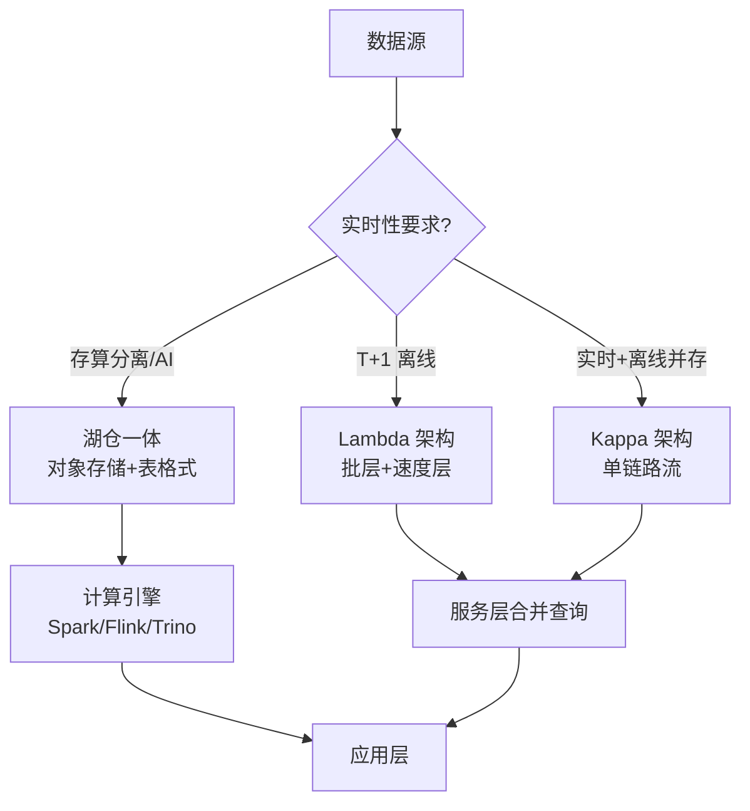
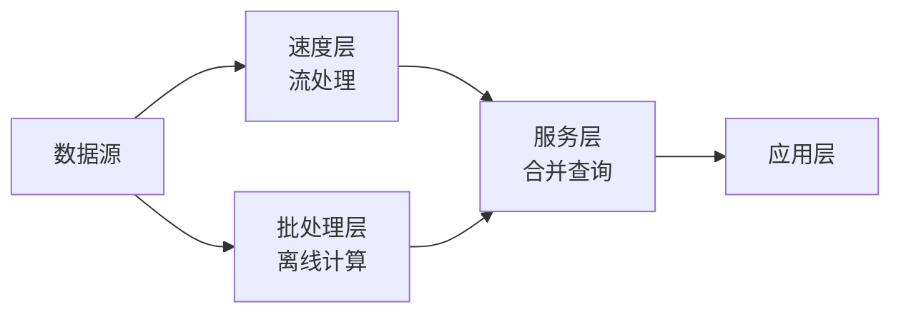
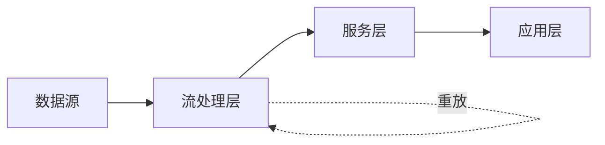
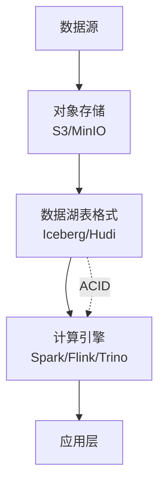
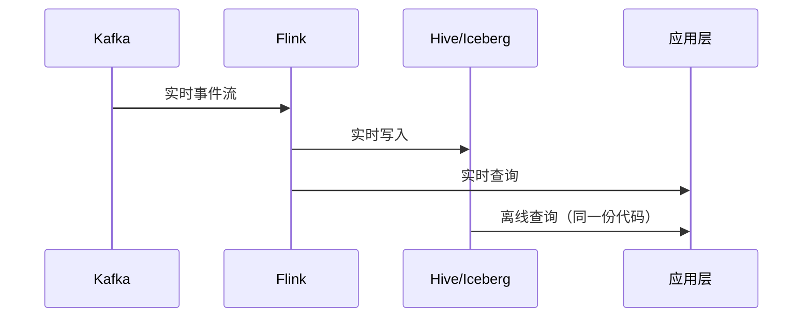

<!--
module:
  parent: big-data
  slug: big-data/data-warehouse
  type: index
  category: 主模块子文章
  summary: Lambda / Kappa / 湖仓一体——大数据架构选型的三种主流范式
-->

# 01 数仓架构

> 一句话定位：**Lambda / Kappa / 湖仓一体——大数据架构选型的三种主流范式**

本模块覆盖三种数仓架构范式：Lambda（实时+离线双链路）、Kappa（流批一体）、湖仓一体（存算分离 + AI 友好），对比延迟、复杂度、成本、适用场景。

---

## 1. 模块导航

| 主题 | 状态 | 说明 |
|------|------|------|
| Lambda 架构 | ✓ 已有 | 实时层 + 离线层双链路 |
| Kappa 架构 | ✓ 已有 | 单链路流批一体 |
| 湖仓一体 | ✓ 已有 | 数据湖 + 数仓融合 |
| 批流融合 | ✓ 已有 | Flink/Spark 流批统一 |

> 速查对比见 [📖 顶层 4.1 架构对比](../../README.md#41-架构对比)

### 1.1 学习路径

- 新人：从 Lambda 概念入手，理解批/速两层职责拆分
- 进阶：比较 Kappa 与 Lambda 的取舍，掌握流批统一 API
- 实战：搭建湖仓一体小项目（S3 + Iceberg + Spark）

---

## 2. 知识脉络

---

## 3. 速查要点

| 范式 | 核心特点 | 复杂度 | 延迟 |
|------|---------|-------|------|
| **Lambda** | 批层（离线准确）+ 速度层（实时近似）+ 服务层合并 | 高（双链路） | 秒级 |
| **Kappa** | 单一实时链路 + Kafka 重放历史 | 中（单链路） | 毫秒级 |
| **湖仓一体** | 数据湖（对象存储+表格式）+ 数仓（ACID+查询引擎） | 中 | 秒级 |
| **批流融合** | Flink / Spark 3.x 统一 API + 同一份代码处理流批 | 中 | 取决于 runner |

- **Lambda 适用**：实时+离线并存，但接受双链路维护成本
- **Kappa 适用**：纯实时场景，历史数据通过 Kafka 重放
- **湖仓一体适用**：AI 训练 / 存算分离 / 数据科学协作
- **批流融合适用**：Flink / Spark 3.x 统一流批 API

---

## 4. 核心内容

### 4.1 Lambda 架构

### 4.2 Kappa 架构

### 4.3 湖仓一体

### 4.4 批流融合时序

---

## 5. 最佳实践

| 实践 | 说明 |
|------|------|
| 数仓分层 | ODS → DWD → DWS → ADS 四层；维度建模（星型/雪花）；SCD Type 1/2/3 |
| Lambda → Kappa | 渐进式迁移，先收敛实时层到单一链路 |
| 湖仓选型 | Iceberg 优先（ACID + Schema Evolution + Time Travel） |
| 存算分离 | S3/OSS + 计算引擎独立扩展，避免长期运行 Spark 集群 |
| 流批统一 | Flink / Spark 3.x 同一份代码处理流批，降低维护成本 |

---

## 6. 常见面试题

| 题目 | 核心考点 |
|------|---------|
| Lambda 与 Kappa 本质区别？ | 双链路 vs 单链路，复杂度/成本/延迟 trade-off |
| Lambda 速度层与批层结果如何合并？ | 服务层 merge / 批覆盖 / 实时优先 |
| 湖仓一体解决了什么问题？ | 传统数据湖无 ACID + 传统数仓无弹性 |
| Iceberg 隐藏分区原理？ | partition transform 不依赖目录名，schema 演进友好 |
| 何时选 Lambda，何时选 Kappa？ | 双链路成本 vs 纯实时 + 历史重放 |
| 批流融合的关键技术？ | 统一 API + 状态后端 + 时间语义 + 精确一次 |

---

## 7. 与其他模块的关系

- **上游**：[08 同步工具](../08-sync-tools/)（数据采集）
- **下游**：被 [05 OLAP](../05-olap/) / [04 数据湖](../04-data-lake/) 复用
- **横向**：[03 实时计算](../03-realtime-compute/) / [06 调度](../06-scheduling/) 协同

---

## 📊 本节统计

| 维度 | 数字 |
|------|------|
| 子 README 数 | 1（本目录为分类顶层） |
| 二级 leaf README 数 | 0 |
| 速查表行数 | 4（Lambda / Kappa / 湖仓一体 / 批流融合） |
| 架构图数 | 4（Lambda / Kappa / 湖仓一体 / 批流融合时序） |
| 最佳实践条数 | 5 |
| 常见面试题数 | 6 |
| frontmatter 覆盖率 | 1 / 1 = 100% |
| 文末回链覆盖 | 1 / 1 = 100% |

---

← [返回大数据总览](../../README.md)