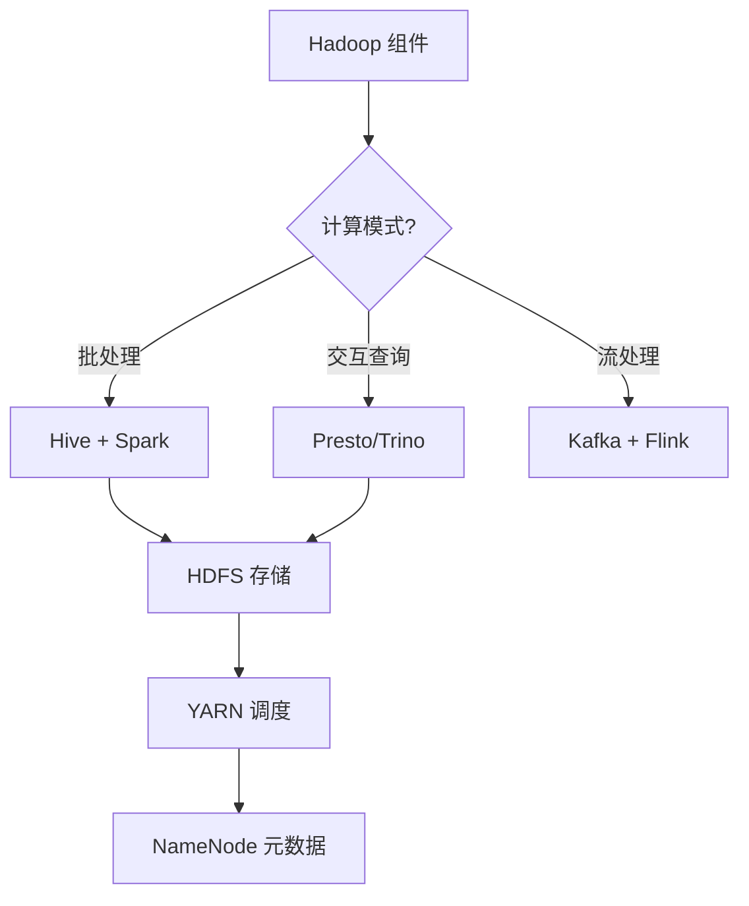
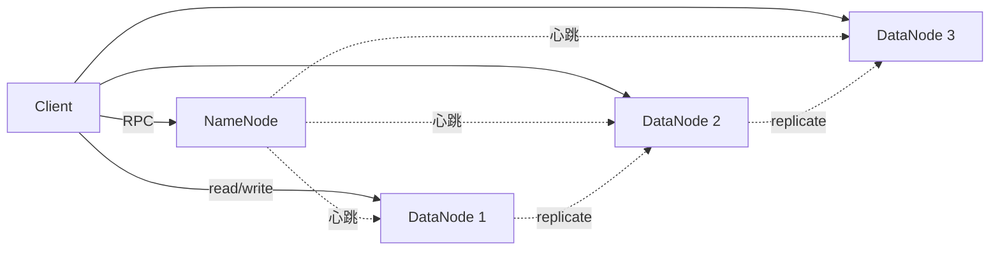
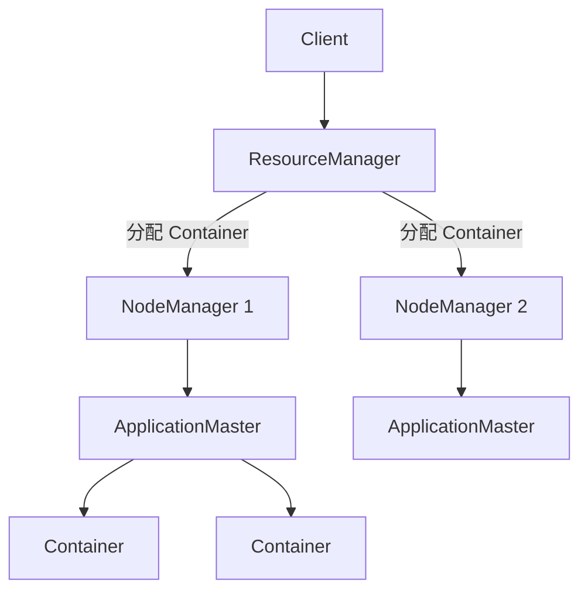

<!--
module:
  parent: big-data
  slug: big-data/hadoop-ecosystem
  type: index
  category: 主模块子文章
  summary: Hadoop 三件套 + 上层引擎（Hive / Presto）——离线数仓基石
-->

# 02 Hadoop 生态

> 一句话定位：**Hadoop 三件套（HDFS/YARN/MapReduce）+ 上层引擎（Hive/Presto）——离线数仓基石**

本模块覆盖 Hadoop 生态核心组件：HDFS 分布式存储、YARN 资源调度、Hive 数据仓库、Presto/Trino 分布式 SQL 查询，是离线批处理的传统基石。

---

## 1. 模块导航

| 主题 | 状态 | 说明 |
|------|------|------|
| HDFS | 📝 已有 | 分布式文件系统 |
| YARN | 📝 已有 | 资源调度 |
| Hive | 📝 已有 | 数据仓库 |
| Presto/Trino | 📝 已有 | 分布式 SQL |
| MapReduce | 📝 已有 | 编程模型（已逐步被 Spark 替代） |

> 速查对比见 [📖 顶层 4.2 计算引擎对比](../../README.md#42-计算引擎对比)

### 1.1 学习路径

- 新人：从 HDFS 架构入手，理解 NameNode/DataNode 角色
- 进阶：掌握 YARN Capacity Scheduler 多租户资源隔离
- 实战：搭建 3 节点 Hadoop 集群做离线数仓 ETL

---

## 2. 知识脉络



---

## 3. 速查要点

| 组件 | 核心要点 |
|------|---------|
| **HDFS** | NameNode（元数据）/ DataNode（数据块）/ Secondary NameNode（checkpoint） |
| **YARN** | Capacity Scheduler（队列）/ Fair Scheduler（公平）/ FIFO |
| **Hive** | 执行引擎 MR（老）→ Tez（快）→ Spark（最快） |
| **Presto** | MPP 内存计算（秒级），区别于 Hive 批处理（分钟-小时） |
| **Trino** | 原 PrestoSQL，2020 改名，独立社区 |

---

## 4. 核心内容

### 4.1 HDFS 架构



- 文件按 128 MB（默认）切分为 block 副本存放，默认副本数 3
- 机架感知策略：1 节点本地 + 1 同机架 + 1 不同机架

### 4.2 YARN 调度



- RM（集群级）+ NM（节点级）+ AM（应用级）+ Container（资源抽象）
- Capacity Scheduler 多租户资源隔离（队列配置）

### 4.3 Hive 执行引擎演进

- MR（MapReduce，慢）→ Tez（DAG，快 5-10x）→ Spark（RDD，最快）
- `SET hive.execution.engine=spark` 切换 Spark 引擎
- ORC + 矢量化 + Cost-Based Optimization（CBO）联合使用

### 4.4 Presto/Trino 联邦查询

```sql
SELECT
  o.order_id, o.amount, u.user_name, p.product_name
FROM hive.sales.orders o
JOIN mysql.crm.users u ON o.user_id = u.id
JOIN postgres.product.items p ON o.product_id = p.id
WHERE o.dt = '2026-06-25' AND o.amount > 1000;
```

- MPP 内存计算，适合亚秒-秒级交互查询
- 反模式：Presto 做大批量 ETL（> 1 TB 数据扫描）→ OOM 风险
- 正确做法：Hive/Spark 做 ETL → 结果写入 Parquet → Presto 交互查询

---

## 5. 最佳实践

| 实践 | 说明 |
|------|------|
| HDFS 副本策略 | `dfs.replication=3` + 异地机房副本 |
| NameNode 内存 | 单 NameNode 内存堆 32 GB（避免千万级文件块 OOM） |
| YARN 队列隔离 | ETL 队列 60% + 即席查询 20% + 默认 20% |
| Hive 执行引擎 | 默认 Spark + `hive.merge.mapfiles=true` 小文件合并 |
| Presto 调优 | `query.max-memory=50 GB` + `task.writer-count=8` |

---

## 6. 常见面试题

| 题目 | 核心考点 |
|------|---------|
| HDFS 副本策略？ | 默认 3 副本 + 机架感知（1 同节点 + 1 同机架 + 1 不同机架） |
| NameNode HA 怎么做？ | 2.x 起支持双 NameNode + ZKFC + JournalNode |
| YARN Capacity vs Fair Scheduler？ | 队列配额 vs 公平分配 |
| Hive 执行引擎演进？ | MR → Tez → Spark 性能对比 |
| Presto vs Hive？ | MPP 内存 vs 批处理，秒级 vs 分钟-小时 |
| Presto 为何不能做大批量 ETL？ | coordinator 内存瓶颈 + 无状态 |
| Trino 与 Presto 关系？ | 2020 分叉，原 PrestoSQL 改名为 Trino |

---

## 7. 与其他模块的关系

- **上游**：[08 同步工具](../08-sync-tools/)（数据写入 HDFS）
- **下游**：被 [01 数仓架构](../01-data-warehouse/) / [04 数据湖](../04-data-lake/) 复用
- **横向**：[03 实时计算](../03-realtime-compute/) 互补（离线 vs 实时）

---

## 📊 本节统计

| 维度 | 数字 |
|------|------|
| 子 README 数 | 1（本目录为分类顶层） |
| 二级 leaf README 数 | 0 |
| 速查要点组件数 | 5（HDFS / YARN / Hive / Presto / Trino） |
| 架构图数 | 3（HDFS / YARN / Hive 演进） |
| 实战案例数 | 4（HDFS 配置 / YARN 队列 / Hive SQL / Presto 联邦） |
| 最佳实践条数 | 5 |
| 常见面试题数 | 7 |
| frontmatter 覆盖率 | 1 / 1 = 100% |
| 文末回链覆盖 | 1 / 1 = 100% |

---

← [返回大数据总览](../../README.md)