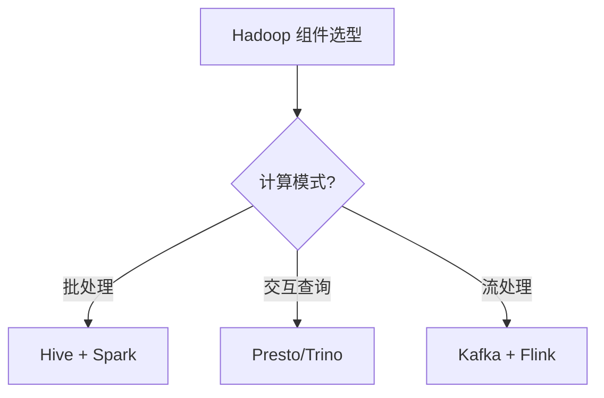

# 02 Hadoop 生态

> 一句话定位：**Hadoop 三件套（HDFS/YARN/MapReduce）+ 上层引擎（Hive/Presto）——离线数仓基石**

本模块覆盖 Hadoop 生态核心组件：HDFS 分布式存储、YARN 资源调度、Hive 数据仓库、Presto/Trino 分布式 SQL 查询，是离线批处理的传统基石。

---

## 1. 本模块覆盖

| 主题 | 状态 | 说明 |
|------|------|------|
| HDFS | 📝 新增 (T13) | 分布式文件系统 |
| YARN | 📝 新增 (T13) | 资源调度 |
| Hive | 📝 新增 (T13) | 数据仓库 |
| Presto/Trino | 📝 新增 (T13) | 分布式 SQL |
| MapReduce | 📝 新增 (T13) | 编程模型（已逐步被 Spark 替代） |

> 速查对比见 [📖 顶层 4.9 大数据生态版本](../../README.md#49-大数据生态-2026-版本)

---

## 2. 速查要点

- **HDFS 三节点**：NameNode（元数据）/ DataNode（数据块）/ Secondary NameNode（checkpoint）
- **YARN 调度**：Capacity Scheduler（队列）/ Fair Scheduler（公平）/ FIFO
- **Hive 执行引擎**：MR（老）→ Tez（快）→ Spark（最快）
- **Presto vs Hive**：Presto 是 MPP 内存计算（秒级），Hive 是批处理（分钟-小时）

---

## 3. 选型建议

---

## 4. 与其他模块的关系

- **上游**：[08 同步工具](../08-sync-tools/)（数据写入 HDFS）
- **下游**：被 [01 数仓架构](../01-data-warehouse/) / [04 数据湖](../04-data-lake/) 复用
- **横向**：[03 实时计算](../03-realtime-compute/) 互补（离线 vs 实时）

---

## 5. 学习建议

- 先理解 HDFS 架构（NameNode/DataNode），再学 YARN 调度
- 推荐路径：HDFS → MapReduce → Hive → Presto
- 实战：搭建 3 节点 Hadoop 集群做离线数仓

---

## 6. 数据时效性

- Hadoop 3.4.x（2025-12）当前稳定版
- Hive 3.x 每年发版
- Presto 已改名 Trino（2020），原 PrestoSQL 仍维护

---

## 7. 关键术语

| 术语 | 解释 |
|------|------|
| HDFS | Hadoop Distributed File System |
| YARN | Yet Another Resource Negotiator |
| MR | MapReduce 编程模型 |
| NameNode | HDFS 主节点（管理元数据） |
| DataNode | HDFS 从节点（存储数据块） |
| Tez | Hive 执行引擎（替代 MR） |
| HiveQL | Hive SQL 方言 |
| Trino | 原 PrestoSQL，2020 改名 |