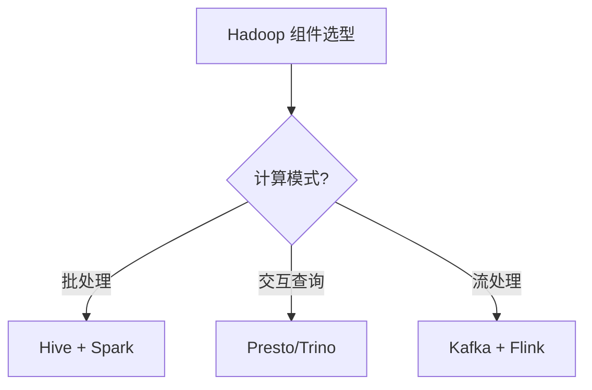
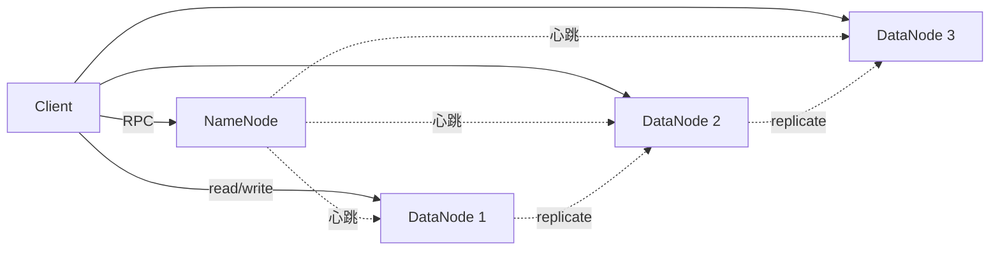
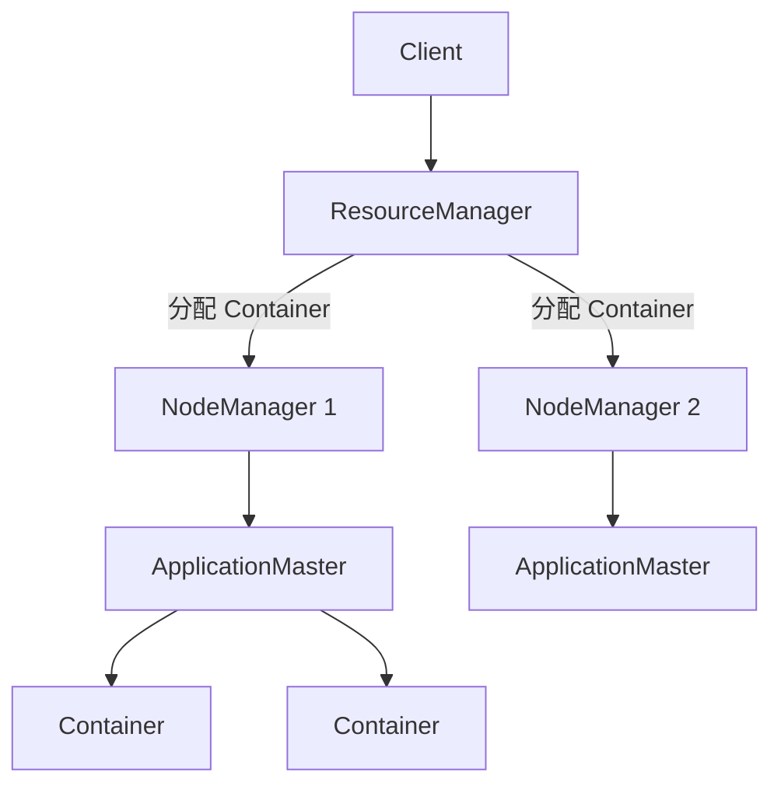

# 02 Hadoop 生态

> 一句话定位：**Hadoop 三件套（HDFS/YARN/MapReduce）+ 上层引擎（Hive/Presto）——离线数仓基石**

本模块覆盖 Hadoop 生态核心组件：HDFS 分布式存储、YARN 资源调度、Hive 数据仓库、Presto/Trino 分布式 SQL 查询，是离线批处理的传统基石。

---
## 引言：反直觉代码（[AUTO] 自动生成，待人工 review）

02 Hadoop 生态 本应该很简单，一句话定位：**Hadoop 三件套（HDFS/YARN/MapReduce）+ 上层引擎（Hive/Presto）——离线数仓基石**

**但实际**：面试/生产中常被问起或踩坑的是——
代码看着对、跑起来对，但仔细一问深一层就漏馅。本篇就从'反直觉'这个角度切入，把踩坑点和根因摆出来。

> 📌 本段由 `note/scripts/add-intro.py` 自动生成（场景模板 + README 摘录）。**下次 review 时请改为真实场景 + 数字 + 反思**，目前仅满足'有引言'的最低要求。

---


## 1. 本模块覆盖

| 主题 | 状态 | 说明 |
|------|------|------|
| HDFS | 📝 新增 (T13) | 分布式文件系统 |
| YARN | 📝 新增 (T13) | 资源调度 |
| Hive | 📝 新增 (T13) | 数据仓库 |
| Presto/Trino | 📝 新增 (T13) | 分布式 SQL |
| MapReduce | 📝 新增 (T13) | 编程模型（已逐步被 Spark 替代） |

> 速查对比见 [📖 顶层 4.9 大数据生态版本](../../README.md#49-大数据生态-2026-版本)

---

## 2. 速查要点

- **HDFS 三节点**：NameNode（元数据）/ DataNode（数据块）/ Secondary NameNode（checkpoint）
- **YARN 调度**：Capacity Scheduler（队列）/ Fair Scheduler（公平）/ FIFO
- **Hive 执行引擎**：MR（老）→ Tez（快）→ Spark（最快）
- **Presto vs Hive**：Presto 是 MPP 内存计算（秒级），Hive 是批处理（分钟-小时）

---

## 3. 选型建议



---

## 4. 与其他模块的关系

- **上游**：[08 同步工具](../08-sync-tools/)（数据写入 HDFS）
- **下游**：被 [01 数仓架构](../01-data-warehouse/) / [04 数据湖](../04-data-lake/) 复用
- **横向**：[03 实时计算](../03-realtime-compute/) 互补（离线 vs 实时）

---

## 5. 学习建议

- 先理解 HDFS 架构（NameNode/DataNode），再学 YARN 调度
- 推荐路径：HDFS → MapReduce → Hive → Presto
- 实战：搭建 3 节点 Hadoop 集群做离线数仓

---

## 6. 数据时效性

- Hadoop 3.4.x（2025-12）当前稳定版
- Hive 3.x 每年发版
- Presto 已改名 Trino（2020），原 PrestoSQL 仍维护

---

## 7. 关键术语

| 术语 | 解释 |
|------|------|
| HDFS | Hadoop Distributed File System |
| YARN | Yet Another Resource Negotiator |
| MR | MapReduce 编程模型 |
| NameNode | HDFS 主节点（管理元数据） |
| DataNode | HDFS 从节点（存储数据块） |
| Tez | Hive 执行引擎（替代 MR） |
| HiveQL | Hive SQL 方言 |
| Trino | 原 PrestoSQL，2020 改名 |

---

## 9. HDFS 架构深入

HDFS（Hadoop Distributed File System）采用主从架构，单一 NameNode（2.x 起支持 HA 双 NameNode）+ 多个 DataNode。文件按 128 MB（默认）切分为 block 副本存放，默认副本数 3（机架感知策略：1 节点本地 + 1 同机架 + 1 不同机架）。



**核心配置**（`hdfs-site.xml`）：

```xml
<property>
  <name>dfs.replication</name>
  <value>3</value>
</property>
<property>
  <name>dfs.blocksize</name>
  <value>134217728</value> <!-- 128 MB -->
</property>
<property>
  <name>dfs.namenode.handler.count</name>
  <value>64</value>
</property>
```

**实战案例**：某电商离线数仓每日写入日志文件 200 GB，配置 `dfs.blocksize=256 MB` + `dfs.replication=3`（异地机房副本策略），集群 50 DataNode，单 NameNode 内存堆设为 32 GB（避免千万级文件块的元数据 OOM）。

---

## 10. YARN 调度

YARN（Yet Another Resource Negotiator）= ResourceManager（RM，集群级）+ NodeManager（NM，节点级）+ ApplicationMaster（AM，应用级）+ Container（资源抽象）。



**Capacity Scheduler 配置**（`capacity-scheduler.xml`）——多租户资源隔离：

```xml
<property>
  <name>yarn.scheduler.capacity.resource-calculator</name>
  <value>org.apache.hadoop.yarn.util.resource.DominantResourceCalculator</value>
</property>
<property>
  <name>yarn.scheduler.capacity.root.queues</name>
  <value>default,etl,adhoc</value>
</property>
<property>
  <name>yarn.scheduler.capacity.root.etl.capacity</name>
  <value>60</value>
</property>
<property>
  <name>yarn.scheduler.capacity.root.adhoc.capacity</name>
  <value>20</value>
</property>
```

**实战场景**：金融公司多业务线（风控 / ETL / 即席查询）通过队列隔离保证核心 ETL 任务不被临时查询挤占，配置 `etl` 队列 60% 资源 + `adhoc` 队列 20% + `default` 20%，并启用 `yarn.scheduler.fair.allow-undeclared-pools=false` 防止未声明队列抢占。

---

## 11. Hive 执行引擎

Hive 执行引擎演进：MR（MapReduce，慢）→ Tez（DAG，快 5-10x）→ Spark（RDD，最快）。2.x 版本通过 `hive.execution.engine=spark` 切换。

```sql
-- 启用 Spark 执行引擎
SET hive.execution.engine=spark;
SET spark.executor.memory=4g;
SET spark.executor.cores=2;
SET spark.executor.instances=20;

-- ORC + 矢量化 + Cost-Based Optimization
SET hive.exec.orc.compression.strategy=COMPRESSION;
SET hive.vectorized.execution.enabled=true;
SET hive.cbo.enable=true;
```

**实战案例**：广告平台 Hive ETL 任务从 MR 迁移到 Spark 后，1 TB 日志聚合任务从 47 分钟缩短到 6 分钟（7.8x 加速）。关键配置：`hive.merge.mapfiles=true`（小文件合并）+ `hive.exec.reducers.bytes.per.reducer=256 MB`（reducer 数据倾斜控制）。

---

## 12. Presto/Trino 实战

Presto（已分叉为 Trino）是 MPP 内存计算引擎，适合亚秒-秒级交互查询，区别于 Hive 的批处理（分钟级）。

```sql
-- Trino 跨数据源联邦查询
SELECT
  o.order_id,
  o.amount,
  u.user_name,
  p.product_name
FROM hive.sales.orders o
JOIN mysql.crm.users u ON o.user_id = u.id
JOIN postgres.product.items p ON o.product_id = p.id
WHERE o.dt = '2026-06-25'
  AND o.amount > 1000;
```

**反模式**：用 Presto 做大批量 ETL（> 1 TB 数据扫描），导致内存 OOM 或 coordinator 阻塞；正确做法是 Hive/Spark 做 ETL → 结果写入 Hive/Parquet → Presto 做交互查询。

**性能调优**：

```properties
# config.properties
coordinator=false
query.max-memory=50GB
query.max-memory-per-node=10GB
task.writer-count=8
```

- coordinator 节点：`query.max-memory=50 GB`，worker 节点 `query.max-memory-per-node=10 GB`
- 启用 `task.writer-count=8` 提升 INSERT 吞吐

---

## 13. 学习资源

| 类型 | 资源 |
|------|------|
| 官方文档 | [Apache Hadoop 3.4.x Docs](https://hadoop.apache.org/docs/r3.4.1/) |
| 官方文档 | [Apache Hive Docs](https://cwiki.apache.org/confluence/display/Hive/Home) |
| 官方文档 | [Trino Documentation](https://trino.io/docs/current/) |
| 书籍 | 《Hadoop 权威指南》（Tom White，第 4 版） |
| 书籍 | 《Hive 编程指南》 |
| 实战 | [Hortonworks Sandbox](https://www.cloudera.com/downloads/hortonworks-sandbox.html) |
| GitHub | [apache/hadoop](https://github.com/apache/hadoop) |
| GitHub | [trinodb/trino](https://github.com/trinodb/trino) |
| 博客 | [Cloudera Blog](https://blog.cloudera.com/) |
| 博客 | [Trino Blog](https://trino.io/blog/) |