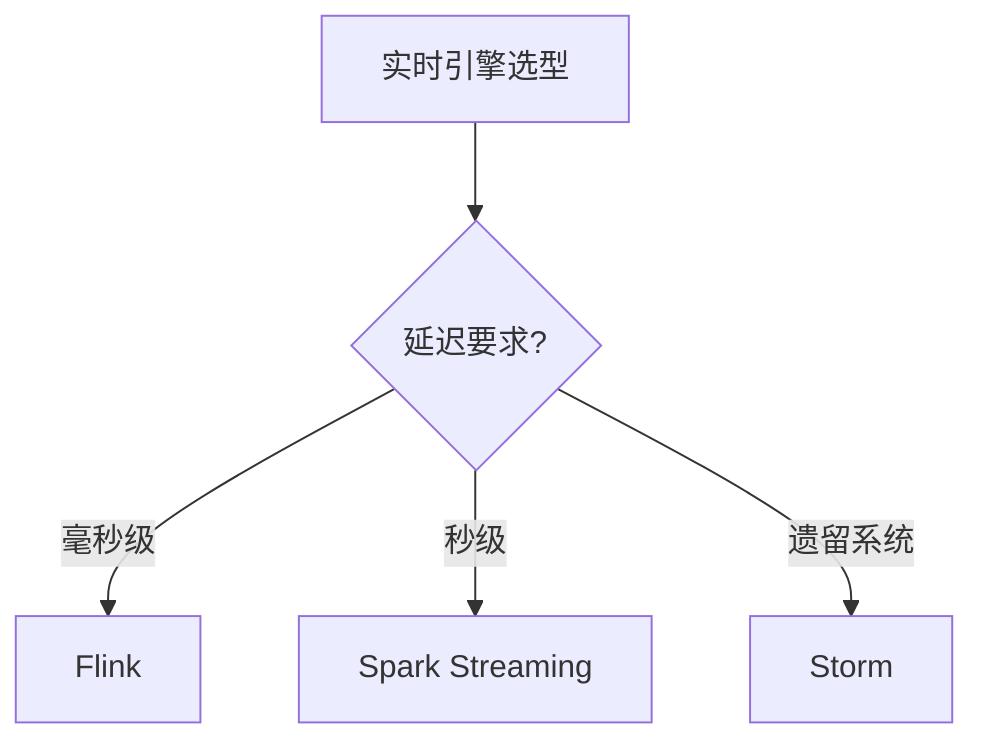

# 03 实时计算

> 一句话定位：**Flink / Spark Streaming / Storm——毫秒-秒级延迟的流处理引擎**

本模块覆盖三大实时计算引擎：Flink（流批一体主流）、Spark Streaming（微批）、Storm（早期流式），对比延迟、状态管理、容错、生态。

---

## 1. 本模块覆盖

| 主题 | 状态 | 说明 |
|------|------|------|
| Flink | 📝 新增 (T13) | 流批一体 / 状态管理 / Exactly-Once |
| Spark Streaming | 📝 新增 (T13) | 微批 / 与 Spark 生态统一 |
| Storm | 📝 新增 (T13) | 早期流式 / 已被 Flink 替代 |

> 速查对比见 [📖 顶层 4.2 计算引擎对比](../../README.md#42-计算引擎对比)

---

## 2. 速查要点

- **Flink 流批一体**：同一份代码处理有界流 + 无界流
- **状态后端**：RocksDB（TB 级） / HashMapStateBackend（小状态）
- **Checkpoint vs Savepoint**：Checkpoint 自动（容错），Savepoint 手动（版本管理）
- **Watermark 处理乱序**：bounded out-of-orderness / idleness detection

---

## 3. 选型建议

---

## 4. 与其他模块的关系

- **上游**：[08 同步工具](../08-sync-tools/)（Kafka 数据源）
- **下游**：被 [04 数据湖](../04-data-lake/) / [05 OLAP](../05-olap/) 消费
- **横向**：[02 Hadoop 生态](../02-hadoop-ecosystem/) 离线批处理互补

---

## 5. 学习建议

- 必学 Flink（事实标准）
- 推荐路径：Flink DataStream API → Flink SQL → State / Checkpoint
- 实战：Kafka → Flink → ClickHouse 实时链路

---

## 6. 数据时效性

- Flink 1.20 / 2.0-rc（2025-Q4）当前主流
- Spark 3.5.x / 4.0（2025-Q4）
- Storm 已停止大版本更新（2024）

---

## 7. 关键术语

| 术语 | 解释 |
|------|------|
| Flink | Apache Flink 流批一体引擎 |
| Watermark | 水位线，处理乱序事件 |
| Checkpoint | Flink 自动快照（容错） |
| Savepoint | Flink 手动快照（版本管理） |
| Exactly-Once | 精确一次语义 |
| RocksDB | Flink 状态后端 |
| Micro-batch | 微批处理（Spark Streaming） |
| Event Time | 事件时间 |
| Processing Time | 处理时间 |
