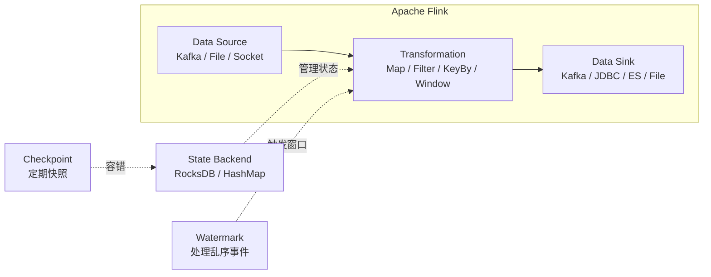

<!--
module:
  parent: big-data
  slug: big-data/realtime-compute
  type: index
  category: 主模块子文章
  summary: Flink / Spark Streaming / Storm——毫秒-秒级延迟的流处理引擎
-->

# 03 实时计算

> 一句话定位：**Flink / Spark Streaming / Storm——毫秒-秒级延迟的流处理引擎**

本模块覆盖三大实时计算引擎：Flink（流批一体主流）、Spark Streaming（微批）、Storm（早期流式），对比延迟、状态管理、容错、生态。

---

## 1. 模块导航

| 主题 | 状态 | 说明 | 子 README |
|------|------|------|-----------|
| Apache Flink | ✅ 事实标准 | 流批一体 / 状态管理 | [01-flink-vs-spark-streaming](./01-flink-vs-spark-streaming/) |
| Spark Streaming | ⚠️ 遗留 | 微批 / Spark 生态 | [01-flink-vs-spark-streaming](./01-flink-vs-spark-streaming/) |
| Apache Storm | ❌ 已淘汰 | 早期流式 | — |

> 速查对比见 [📖 顶层 4.2 计算引擎对比](../../README.md#42-计算引擎对比)

### 1.1 学习路径

- 新人：从 Flink DataStream API 入手，掌握 Source → Transform → Sink
- 进阶：Flink SQL + Window + Watermark，处理乱序与窗口聚合
- 实战：Kafka → Flink → ClickHouse，端到端实时链路

---

## 2. 知识脉络



---

## 3. 速查要点

| 维度 | Apache Flink | Spark Streaming | Apache Storm |
|------|-------------|----------------|--------------|
| 计算模型 | 真流式（逐条处理） | 微批（Mini-batch） | 真流式（逐条处理） |
| 延迟 | 毫秒级 | 秒级（batch 间隔） | 毫秒级 |
| 吞吐 | 百万 events/s | 百万 events/s | 十万 events/s |
| 状态管理 | 原生强大（RocksDB / HashMap） | 有限（RDD 无状态） | 无状态（需外部存储） |
| 容错 | Checkpoint（Chandy-Lamport） | Spark 线路图重算 | ACK 机制（易丢数据） |
| 语义保证 | Exactly-Once | At-Least-Once（可模拟 Exactly） | At-Most-Once / At-Least-Once |
| 时间语义 | Event Time + Watermark | 仅 Processing Time | 仅 Processing Time |
| SQL 支持 | Flink SQL（流批统一） | Spark SQL（批为主） | 无 |
| 状态 | ✅ 事实标准 | ⚠️ 遗留项目 | ❌ 已淘汰 |

---

## 4. 核心内容

### 4.1 Flink 状态后端

| 后端 | 存储位置 | 适用状态大小 | 特点 |
|------|---------|:----------:|------|
| HashMapStateBackend | TaskManager JVM 堆内存 | < 10 GB | 快，但受内存限制 |
| EmbeddedRocksDBStateBackend | 本地磁盘 + 内存缓存 | TB 级 | 生产推荐，支持增量 Checkpoint |

### 4.2 Checkpoint vs Savepoint

| 特性 | Checkpoint | Savepoint |
|------|-----------|-----------|
| 触发方式 | 自动（按间隔） | 手动（用户触发） |
| 用途 | 容错恢复 | 版本升级、A/B 测试 |
| 格式 | 轻量（Flink 内部优化） | 标准（跨版本兼容） |
| 性能影响 | 小（增量 + 异步） | 较大（全量导出） |

### 4.3 Flink SQL 示例

```sql
-- 从 Kafka 读取订单流
CREATE TABLE orders (
    order_id STRING,
    user_id STRING,
    amount DOUBLE,
    order_time TIMESTAMP(3),
    WATERMARK FOR order_time AS order_time - INTERVAL '5' SECOND
) WITH (
    'connector' = 'kafka',
    'topic' = 'orders',
    'properties.bootstrap.servers' = 'kafka:9092',
    'format' = 'json'
);

-- 5 分钟滚动窗口聚合
SELECT
    TUMBLE_START(order_time, INTERVAL '5' MINUTE) AS window_start,
    user_id,
    COUNT(*) AS order_count,
    SUM(amount) AS total_amount
FROM orders
GROUP BY
    TUMBLE(order_time, INTERVAL '5' MINUTE),
    user_id;
```

### 4.4 典型架构

**实时数仓链路**：Kafka（原始数据）→ Flink（实时 ETL）→ Kafka（DWD/DWS）→ Flink（聚合）→ OLAP（Doris/ClickHouse）→ 报表/BI；或 → 数据湖（Iceberg/Hudi）→ 离线分析 / AI 训练

**实时风控链路**：交易流 → Kafka → Flink CEP → 规则引擎 + ML 模型 + Redis（实时画像）

---

## 5. 最佳实践

| 实践 | 说明 |
|------|------|
| Checkpoint 间隔 | 按业务 SLA 设定（60-300 秒）；不要太频繁 |
| 状态后端 | TB 级状态选 RocksDB；GB 级可选 HashMap |
| Watermark 乱序 | `bounded-out-of-orderness` 设为业务允许的最大乱序时间 |
| Exactly-Once | 开启 WAL + 两阶段提交 + Checkpoint |
| Savepoint | 版本升级 / A/B 测试前手动触发 |

---

## 6. 常见面试题

| 题目 | 核心考点 |
|------|---------|
| Flink vs Spark Streaming？ | 流式 vs 微批；延迟 / 状态 / 容错 |
| Exactly-Once 如何保证？ | Checkpoint + 两阶段提交 + WAL |
| Watermark 是什么？ | 处理乱序事件的机制 |
| Checkpoint vs Savepoint？ | 自动容错 vs 手动版本管理 |
| 状态后端选什么？ | RocksDB（TB 级）vs HashMap（< 10 GB） |
| Flink CEP 用什么场景？ | 复杂事件处理（风控规则） |
| Flink 与 Storm 区别？ | 状态管理 / 时间语义 / 容错机制 |

---

## 7. 与其他模块的关系

- **上游**：[08 同步工具](../08-sync-tools/)（Kafka 数据源）
- **下游**：被 [04 数据湖](../04-data-lake/) / [05 OLAP](../05-olap/) 消费
- **横向**：[02 Hadoop 生态](../02-hadoop-ecosystem/) 离线批处理互补
- **调度**：[06 调度系统](../06-scheduling/) 编排 Flink 作业

---

## 📊 本节统计

| 维度 | 数字 |
|------|------|
| 子 README 数 | 1（[01-flink-vs-spark-streaming](./01-flink-vs-spark-streaming/)） |
| 二级 leaf README 数 | 1 |
| 三大引擎对比维度数 | 9（模型 / 延迟 / 吞吐 / 状态 / 容错 / 语义 / 时间 / SQL / 状态） |
| 核心 Flink API 层 | 3（SQL / DataStream / ProcessFunction） |
| 状态后端类型 | 2（HashMap / RocksDB） |
| 典型架构数 | 2（实时数仓 / 实时风控） |
| 最佳实践条数 | 5 |
| 常见面试题数 | 7 |
| frontmatter 覆盖率 | 2 / 2 = 100% |
| 文末回链覆盖 | 2 / 2 = 100% |

---

← [返回大数据总览](../../README.md)