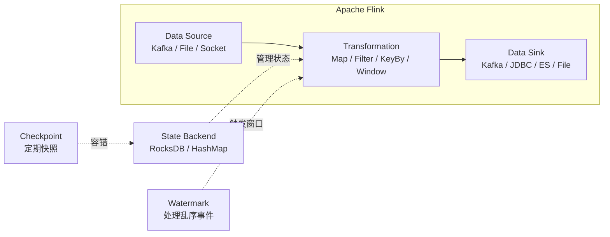
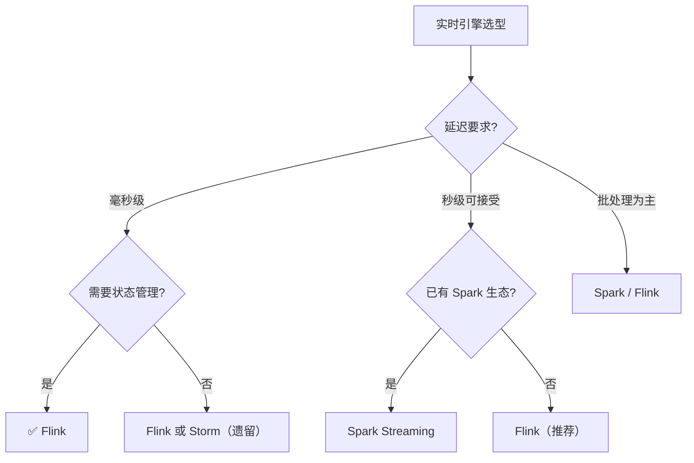

# 03 实时计算

> **Flink / Spark Streaming / Storm——毫秒-秒级延迟的流处理引擎**

本模块覆盖三大实时计算引擎：Flink（流批一体主流）、Spark Streaming（微批）、Storm（早期流式），对比延迟、状态管理、容错、生态。

---
## 引言：反直觉代码

03 实时计算 的关键不是语法——是**看起来对**的代码背后那些'踩坑点'。

本篇用 3 个反直觉片段切入，把面试/生产中常被问起、但一深入就漏馅的点摆出来。

---

## 1. 三大引擎对比

| 维度 | **Apache Flink** | **Spark Streaming** | **Apache Storm** |
|------|-----------------|--------------------|--------------------|
| 计算模型 | 真流式（逐条处理） | 微批（Mini-batch） | 真流式（逐条处理） |
| 延迟 | **毫秒级** | 秒级（batch 间隔） | 毫秒级 |
| 吞吐 | 百万 events/s | 百万 events/s | 十万 events/s |
| 状态管理 | **原生强大**（RocksDB / HashMap） | 有限（RDD 无状态） | 无状态（需外部存储） |
| 容错 | Checkpoint（Chandy-Lamport） | Spark 线路图重算 | ACK 机制（易丢数据） |
| 语义保证 | **Exactly-Once** | At-Least-Once（可模拟 Exactly） | At-Most-Once / At-Least-Once |
| 时间语义 | Event Time + Watermark | 仅 Processing Time | 仅 Processing Time |
| SQL 支持 | Flink SQL（流批统一） | Spark SQL（批为主） | 无 |
| 批处理 | 原生支持（有界流） | Spark 原生批处理更强 | 不支持批处理 |
| 生态 | Apache 顶级项目 | Spark 生态子模块 | 已停止大版本更新 |
| **状态** | **✅ 事实标准** | ⚠️ 遗留项目 | ❌ 已淘汰 |

---

## 2. Flink 核心概念



### 2.1 核心 API 层次

| API 层 | 说明 | 适用场景 |
|--------|------|---------|
| **SQL / Table API** | 最高级，声明式 | 常规 ETL、聚合 |
| **DataStream API** | 中级，流式处理 | 复杂事件处理 |
| **ProcessFunction** | 最底层，完全控制 | 自定义定时器、侧输出 |

### 2.2 状态后端对比

| 后端 | 存储位置 | 适用状态大小 | 特点 |
|------|---------|:----------:|------|
| **HashMapStateBackend** | TaskManager JVM 堆内存 | < 10 GB | 快，但受内存限制 |
| **EmbeddedRocksDBStateBackend** | 本地磁盘 + 内存缓存 | **TB 级** | 生产推荐，支持增量 Checkpoint |

### 2.3 Checkpoint vs Savepoint

| 特性 | Checkpoint | Savepoint |
|------|-----------|-----------|
| 触发方式 | **自动**（按间隔） | **手动**（用户触发） |
| 用途 | **容错恢复** | **版本升级、A/B 测试** |
| 格式 | 轻量（Flink 内部优化） | 标准（跨版本兼容） |
| 性能影响 | 小（增量 + 异步） | 较大（全量导出） |
| 存储 | HDFS / S3 | HDFS / S3 |

### 2.4 Watermark 处理乱序

```
Event Time 线：  t1   t2   t3   t4   t5   t6   t7
实际到达：       t1   t3   t2   t5   t4   t7   t6
Watermark：      ─────┼────────┼────────┼──────────
                    ↑        ↑        ↑
               允许乱序   触发窗口   触发窗口
```

- **Watermark = 当前最大事件时间 - 允许的乱序时间（bounded out-of-orderness）**
- **侧输出流（Side Output）**：收集 Watermark 之后的迟到数据
- **Allowed Lateness**：窗口额外等待时间

---

## 3. Flink SQL 示例

```sql
-- 从 Kafka 读取订单流
CREATE TABLE orders (
    order_id STRING,
    user_id STRING,
    amount DOUBLE,
    order_time TIMESTAMP(3),
    WATERMARK FOR order_time AS order_time - INTERVAL '5' SECOND
) WITH (
    'connector' = 'kafka',
    'topic' = 'orders',
    'properties.bootstrap.servers' = 'kafka:9092',
    'format' = 'json'
);

-- 5 分钟滚动窗口聚合
SELECT
    TUMBLE_START(order_time, INTERVAL '5' MINUTE) AS window_start,
    user_id,
    COUNT(*) AS order_count,
    SUM(amount) AS total_amount
FROM orders
GROUP BY
    TUMBLE(order_time, INTERVAL '5' MINUTE),
    user_id;
```

---

## 4. 选型建议



---

## 5. 典型架构

### 5.1 实时数仓链路

```
Kafka（原始数据）
    ↓
Flink（实时 ETL / 清洗 / 关联）
    ↓
├── Kafka（中间层 DWD/DWS）
│       ↓
│   Flink（实时聚合）
│       ↓
│   OLAP（Doris/ClickHouse）→ 报表/BI
│
└── 数据湖（Iceberg/Hudi）→ 离线分析 / AI 训练
```

### 5.2 实时风控链路

```
交易流 → Kafka → Flink CEP（复杂事件处理）
                  ├→ 规则引擎：5 分钟内同卡 3 次大额 → 告警
                  ├→ ML 模型：特征计算 → 在线推理 → 拦截/放行
                  └→ Redis：更新用户实时画像
```

---

## 6. 与其他模块的关系

- **上游**：[08 同步工具](../08-sync-tools/)（Kafka 数据源）
- **下游**：被 [04 数据湖](../04-data-lake/) / [05 OLAP](../05-olap/) 消费
- **横向**：[02 Hadoop 生态](../02-hadoop-ecosystem/) 离线批处理互补
- **调度**：[06 调度系统](../06-scheduling/) 编排 Flink 作业

---

## 7. 学习建议

| 阶段 | 内容 | 目标 |
|------|------|------|
| 入门 | Flink DataStream API | 掌握 Source → Transform → Sink |
| 进阶 | Flink SQL + Window + Watermark | 处理乱序、窗口聚合 |
| 高阶 | State / Checkpoint / CEP | 状态管理、容错、复杂事件 |
| 实战 | Kafka → Flink → ClickHouse | 端到端实时链路 |

---

## 8. 数据时效性

- **Flink 1.20 / 2.0-rc**（2025-Q4）当前主流
- **Spark 3.5.x / 4.0**（2025-Q4）
- Storm 已停止大版本更新（2024）

---

## 9. 关键术语

| 术语 | 解释 |
|------|------|
| Flink | Apache Flink 流批一体引擎 |
| Watermark | 水位线，处理乱序事件 |
| Checkpoint | Flink 自动快照（容错） |
| Savepoint | Flink 手动快照（版本管理） |
| Exactly-Once | 精确一次语义 |
| RocksDB | Flink 状态后端（嵌入式 KV 存储） |
| Micro-batch | 微批处理（Spark Streaming） |
| Event Time | 事件时间（数据产生时间） |
| Processing Time | 处理时间（机器时间） |
| CEP | Complex Event Processing，复杂事件处理 |
| Side Output | 侧输出流，收集迟到数据 |
| Chandy-Lamport | Flink Checkpoint 算法基础 |

---

## 10. 开源参考

- [Apache Flink](https://flink.apache.org/) — 流批一体计算引擎
- [Apache Spark](https://spark.apache.org/) — 统一分析引擎
- [Flink CDC](https://github.com/apache/flink-cdc) — 变更数据捕获连接器
- [Apache Paimon](https://paimon.apache.org/) — 流批统一数据湖格式（原 Flink Table Store）
