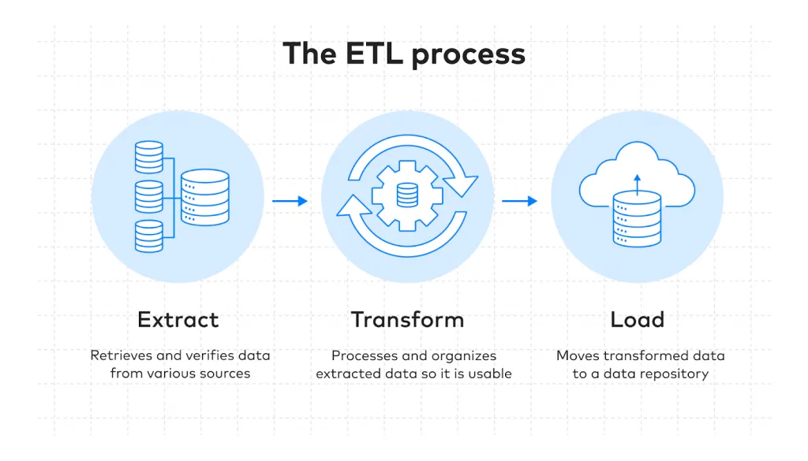
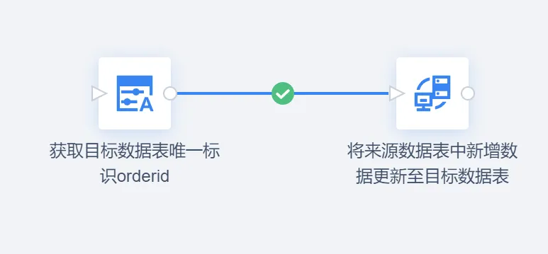

# ETL

## ETL增量抽取
> ETL增量抽取是一种数据处理技术，用于从源系统中抽取新数据并将其加载到数据仓库中，是企业进行数据同步和备份的重要手段。  
> 在增量抽取过程中，ETL工具会比较目标和源数据集之间的差异，并仅将新增和更改的记录加载到数据仓库中。  
> 这使得增量抽取比全量抽取更加高效，因为它可以减少处理时间和资源消耗，并保证数据实时同步和数据一致性。
### 基于时间戳的增量抽取
> 在源系统中添加一个时间戳字段，记录每条数据的更新时间。

### 基于主键的增量抽取
> 在源系统中添加一个主键字段，记录每条数据的唯一标识。
