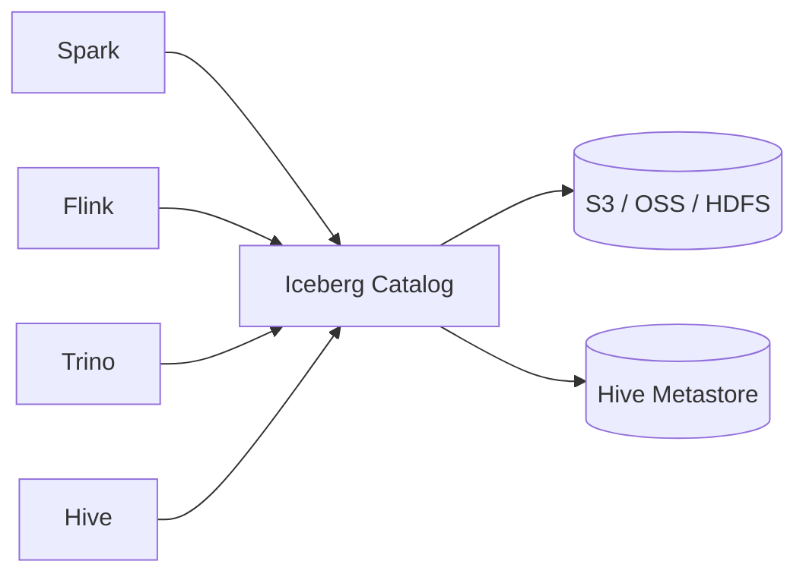
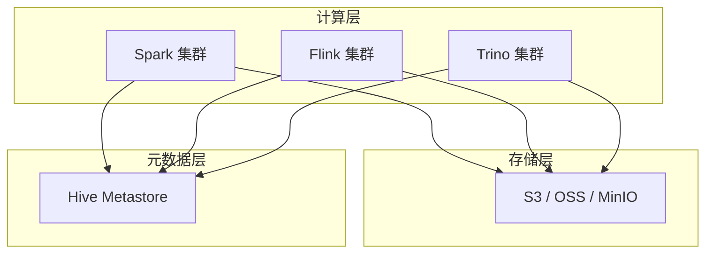

<!--
module:
  parent: big-data
  slug: big-data/data-lake
  type: index
  category: 主模块子文章
  summary: Iceberg / Hudi / Delta Lake——存算分离的现代数据湖表格式
-->

# 04 数据湖

> 一句话定位：**Iceberg / Hudi / Delta Lake——存算分离的现代数据湖表格式**

本模块覆盖三种主流数据湖表格式：Apache Iceberg（最广泛）、Apache Hudi（更新友好）、Delta Lake（Databricks 主推），对比 ACID、Schema Evolution、Time Travel、查询引擎集成。

---

## 1. 模块导航

| 主题 | 状态 | 说明 | 子 README |
|------|------|------|-----------|
| Apache Iceberg | ✅ 主流 | 隐藏分区 / 多引擎 | [01-iceberg-vs-delta-vs-hudi](./01-iceberg-vs-delta-vs-hudi/) |
| Apache Hudi | ✅ CDC 友好 | Copy-on-Write / Merge-on-Read | [01-iceberg-vs-delta-vs-hudi](./01-iceberg-vs-delta-vs-hudi/) |
| Delta Lake | ✅ Databricks | Spark 生态集成 | [01-iceberg-vs-delta-vs-hudi](./01-iceberg-vs-delta-vs-hudi/) |
| 存算分离架构 | ✅ 现代 | MinIO/S3 + 计算引擎 | — |

> 速查对比见 [📖 顶层 4.3 数据湖对比](../../README.md#43-数据湖对比)

### 1.1 学习路径

- 新人：从 Iceberg 入手，理解隐藏分区 + 多引擎
- 进阶：掌握 Hudi COW / MOR 表类型与索引选择
- 实战：S3 + Iceberg + Spark + Trino 端到端数据湖

---

## 2. 知识脉络



---

## 3. 速查要点

| 能力 | Iceberg | Hudi | Delta Lake |
|------|---------|------|------------|
| ACID | ✓ | ✓ | ✓ |
| Schema Evolution | ✓ | ✓ | ✓ |
| Time Travel | ✓ | ✓ | ✓ |
| Hidden Partition | ✓ | ✗ | ✗ |
| 主要引擎 | Spark / Flink / Trino | Spark / Flink | Spark |

- **三种表格式核心能力**：ACID / Schema Evolution / Time Travel / Partition Evolution
- **Iceberg 优势**：隐藏分区（partition transform 不依赖目录名）+ 多引擎（Spark/Flink/Trino）
- **Hudi 优势**：索引（bloom / simple / record level）+ 高效 update/delete
- **Delta Lake 优势**：与 Spark 深度集成、Databricks 生态完整

---

## 4. 核心内容

### 4.1 Iceberg 实战

```sql
CREATE TABLE orders.iceberg_orders (
    order_id BIGINT,
    user_id BIGINT,
    amount DECIMAL(10,2),
    dt DATE
) USING iceberg
PARTITIONED BY (days(dt))
TBLPROPERTIES (
    'write.format.default' = 'parquet',
    // 为什么 128MB？HDFS block 默认 128MB，对齐后可充分利用 HDFS 存储；小文件多则 IO 开销大，大文件少则并发读取能力弱
    'write.target-file-size-bytes' = '134217728',  -- 128 MB
    'commit.manifest.min-count-to-merge' = '5'
);

-- Time Travel
SELECT * FROM orders.iceberg_orders TIMESTAMP AS OF '2026-06-01 00:00:00';
SELECT * FROM orders.iceberg_orders VERSION AS OF 1234567890;
```

### 4.2 Hudi 表类型

- **Copy-on-Write (COW)**：写时合并，读快写慢，适合批量更新
- **Merge-on-Read (MOR)**：读时合并，写快读慢，适合实时 upsert
- 索引选择：BLOOM（通用）/ SIMPLE（< 1 亿）/ RECORD_INDEX（> 10 亿）

### 4.3 Delta Lake 实战

```sql
-- 性能调优
OPTIMIZE events ZORDER BY (user_id, event_type);
-- 增量统计
ANALYZE TABLE events COMPUTE STATISTICS FOR COLUMNS user_id, event_type;
```

- `OPTIMIZE` + `ZORDER BY` 优化查询性能（5-10x 提速）
- `VACUUM events RETAIN 168 HOURS` 清理过期文件

### 4.4 存算分离架构



- **优势**：计算弹性伸缩 / 存储成本低 / 多引擎共享一份数据
- **反模式**：Hive 强耦合 HDFS，无法享受存算分离红利

---

## 5. 最佳实践

| 实践 | 说明 |
|------|------|
| 表格式选型 | 多引擎 → Iceberg；CDC → Hudi；Databricks → Delta |
| 小文件合并 | 每天/每周定期 compaction |
| 监控指标 | 元数据文件大小 / snapshot 数量 / 文件数 |
| 存算分离 | S3 + Iceberg + 临时 EMR 集群（成本下降 60%） |
| 反模式 | 避免全公司混用 3 套表格式 |

---

## 6. 常见面试题

| 题目 | 核心考点 |
|------|---------|
| Iceberg 隐藏分区原理？ | partition transform 不依赖目录名 |
| Iceberg vs Hudi vs Delta 选型？ | 多引擎 vs CDC vs Spark 生态 |
| COW vs MOR 区别？ | 写时合并 vs 读时合并；性能特征 |
| 存算分离收益？ | 弹性伸缩 + 成本下降 + 多引擎共享 |
| Hudi 索引选择？ | BLOOM（通用）/ SIMPLE（< 1 亿）/ RECORD_INDEX（> 10 亿） |
| Time Travel 实现？ | 快照隔离 + 元数据文件 |

---

## 7. 与其他模块的关系

- **上游**：[02 Hadoop 生态](../02-hadoop-ecosystem/)（对象存储）
- **下游**：被 [05 OLAP](../05-olap/) / [03 实时计算](../03-realtime-compute/) 消费
- **横向**：[01 数仓架构](../01-data-warehouse/) 湖仓一体范式

---

## 📊 本节统计

| 维度 | 数字 |
|------|------|
| 子 README 数 | 1（[01-iceberg-vs-delta-vs-hudi](./01-iceberg-vs-delta-vs-hudi/)） |
| 二级 leaf README 数 | 1 |
| 三种表格式对比维度数 | 5（ACID / Schema Evolution / Time Travel / Hidden Partition / 主要引擎） |
| 实战案例数 | 5（Iceberg 配置 / Hudi 写入 / Delta 调优 / 存算分离 / 反模式） |
| 最佳实践条数 | 5 |
| 常见面试题数 | 6 |
| frontmatter 覆盖率 | 2 / 2 = 100% |
| 文末回链覆盖 | 2 / 2 = 100% |

---

← [返回大数据总览](../../README.md)