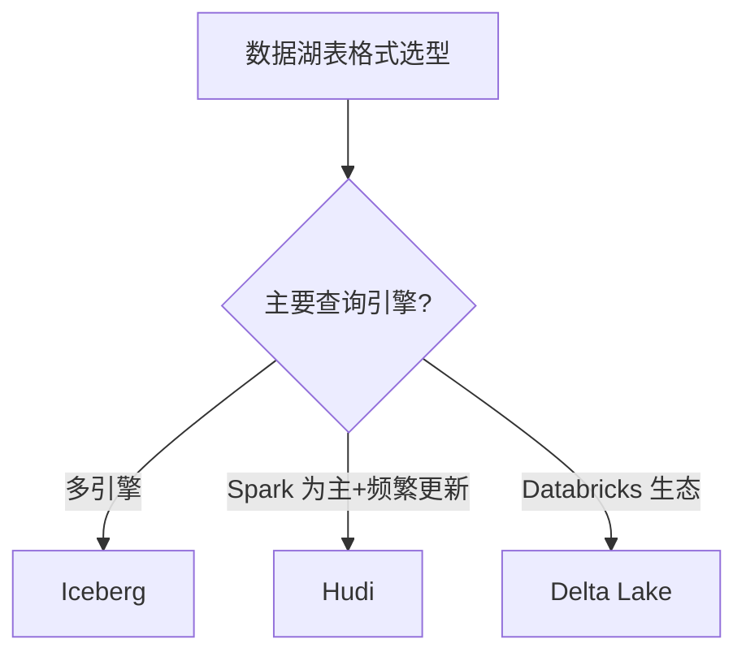
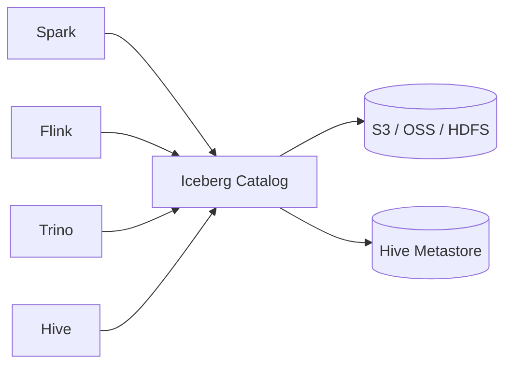
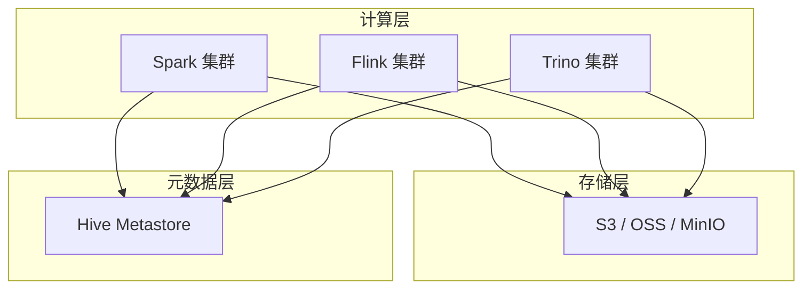

# 04 数据湖

> 一句话定位：**Iceberg / Hudi / Delta Lake——存算分离的现代数据湖表格式**

本模块覆盖三种主流数据湖表格式：Apache Iceberg（最广泛）、Apache Hudi（更新友好）、Delta Lake（Databricks 主推），对比 ACID、Schema Evolution、Time Travel、查询引擎集成。

---
## 引言：反直觉代码（[AUTO] 自动生成，待人工 review）

04 数据湖 本应该很简单，一句话定位：**Iceberg / Hudi / Delta Lake——存算分离的现代数据湖表格式**

**但实际**：面试/生产中常被问起或踩坑的是——
代码看着对、跑起来对，但仔细一问深一层就漏馅。本篇就从'反直觉'这个角度切入，把踩坑点和根因摆出来。

> 📌 本段由 `note/scripts/add-intro.py` 自动生成（场景模板 + README 摘录）。**下次 review 时请改为真实场景 + 数字 + 反思**，目前仅满足'有引言'的最低要求。

---


## 1. 本模块覆盖

| 主题 | 状态 | 说明 |
|------|------|------|
| Apache Iceberg | 📝 新增 (T13) | 隐藏分区 / 多引擎 |
| Apache Hudi | 📝 新增 (T13) | Copy-on-Write / Merge-on-Read |
| Delta Lake | 📝 新增 (T13) | Databricks 主推 |
| 存算分离架构 | 📝 新增 (T13) | MinIO/S3 + 计算引擎 |

> 速查对比见 [📖 顶层 4.3 数据湖对比](../../README.md#43-数据湖对比)

---

## 2. 速查要点

- **三种表格式核心能力**：ACID / Schema Evolution / Time Travel / Partition Evolution
- **Iceberg 优势**：隐藏分区（partition transform 不依赖目录名）、多引擎（Spark/Flink/Trino）
- **Hudi 优势**：索引（bloom / simple / record level）+ 高效 update/delete
- **Delta Lake 优势**：与 Spark 深度集成、Databricks 生态完整

---

## 3. 选型建议



---

## 4. 与其他模块的关系

- **上游**：[02 Hadoop 生态](../02-hadoop-ecosystem/)（对象存储）
- **下游**：被 [05 OLAP](../05-olap/) / [03 实时计算](../03-realtime-compute/) 消费
- **横向**：[01 数仓架构](../01-data-warehouse/) 湖仓一体范式

---

## 5. 学习建议

- 必学 Iceberg（最广泛）
- 推荐路径：Iceberg 基础 → Spark/Flink 集成 → 存算分离
- 实战：S3 + Iceberg + Spark + Trino 查询

---

## 6. 数据时效性

- Iceberg 1.5.x（2025-11）
- Hudi 0.15.x（2025-10）
- Delta Lake 3.x（Databricks 持续更新）

---

## 7. 关键术语

| 术语 | 解释 |
|------|------|
| Iceberg | Apache 顶级项目数据湖表格式 |
| Hudi | Apache 顶级项目数据湖表格式 |
| Delta Lake | Databricks 开源数据湖表格式 |
| ACID | 事务原子性/一致性/隔离性/持久性 |
| Time Travel | 时间旅行（查询历史快照） |
| Schema Evolution | 表结构演进 |
| Hidden Partition | 隐藏分区（Iceberg 特性） |
| Copy-on-Write | 写时复制（Hudi 模式） |
| Merge-on-Read | 读时合并（Hudi 模式） |

---

## 9. Iceberg 深入

Apache Iceberg 是 Netflix 开源的表格式，核心理念：**隐藏分区**（partition transform 不依赖目录名）+ **多引擎**（Spark / Flink / Trino / Hive / Dremio）+ **ACID**（基于 snapshot 隔离）。



**实战配置**（Spark + Iceberg）：

```sql
CREATE TABLE orders.iceberg_orders (
    order_id BIGINT,
    user_id BIGINT,
    amount DECIMAL(10,2),
    dt DATE
) USING iceberg
PARTITIONED BY (days(dt))
TBLPROPERTIES (
    'write.format.default' = 'parquet',
    'write.target-file-size-bytes' = '134217728',  -- 128 MB
    'commit.manifest.min-count-to-merge' = '5'
);

-- Time Travel
SELECT * FROM orders.iceberg_orders TIMESTAMP AS OF '2026-06-01 00:00:00';
SELECT * FROM orders.iceberg_orders VERSION AS OF 1234567890;
```

**实战案例**：某短视频平台用 Iceberg 替代 Hive 分区表，解决 Hive 改分区字段需要 `INSERT OVERWRITE` 全表重写的问题；Iceberg 通过 partition evolution 改变分区策略只更新元数据，无需重写数据。

---

## 10. Hudi 实战

Apache Hudi（Hadoop Upserts Deletes and Incrementals）专为频繁 update/delete 设计，两种核心表类型：

- **Copy-on-Write (COW)**：写时合并，读快写慢，适合批量更新
- **Merge-on-Read (MOR)**：读时合并，写快读慢（需开启读时合并），适合实时 upsert

```scala
// Spark 写入 Hudi MOR 表
import org.apache.hudi.QuickstartUtils._
import org.apache.hudi.config.HoodieWriteConfig._

df.write.format("hudi")
  .option("hoodie.table.name", "user_profile")
  .option("hoodie.datasource.write.recordkey.field", "user_id")
  .option("hoodie.datasource.write.table.type", "MERGE_ON_READ")
  .option("hoodie.datasource.write.operation", "upsert")
  .option("hoodie.index.type", "BLOOM")
  .option("hoodie.index.bloom.num_entries", "600000")
  .option("hoodie.upsert.shuffle.parallelism", "32")
  .mode("append")
  .save("s3://lake/user_profile/")
```

**反模式**：用 COW 表做实时 upsert（高 IOPS 浪费）；正确做法是 COW 做 T+1 全量更新，MOR 做准实时（分钟级）CDC 写入。

**索引选择**：
- `BLOOM`：通用场景，误判率 0.01，内存占用小
- `SIMPLE`：小数据集（< 1 亿），基于 record key 排序
- `RECORD_INDEX`：超大规模（> 10 亿），O(1) 查找

---

## 11. Delta Lake 实战

Delta Lake 是 Databricks 主推的数据湖表格式，深度集成 Spark 生态，ACID 基于 optimistic concurrency + 事务日志（`_delta_log/`）。

```python
# PySpark Delta Lake
df.write.format("delta") \
  .mode("overwrite") \
  .option("overwriteSchema", "true") \
  .partitionBy("dt") \
  .save("s3://lake/events/")

# Time Travel
spark.read.format("delta") \
  .option("versionAsOf", 5) \
  .load("s3://lake/events/")

# VACUUM 清理过期文件
spark.sql("VACUUM events RETAIN 168 HOURS")  # 保留 7 天
```

**实战案例**：某电商平台用户行为日志实时入湖（Flink → Delta Lake），每天 100 亿条事件写入，通过 `OPTIMIZE` + `ZORDER BY (user_id)` 优化查询性能。`ZORDER` 将相关字段数据聚集到同一文件，user_id 过滤查询提速 5-10x。

```sql
-- Delta Lake 性能调优
OPTIMIZE events ZORDER BY (user_id, event_type);
-- 增量统计
ANALYZE TABLE events COMPUTE STATISTICS FOR COLUMNS user_id, event_type;
```

---

## 12. 存算分离架构

现代数据湖采用存算分离：存储层（S3 / OSS / MinIO / HDFS）+ 计算层（Spark / Flink / Trino / Presto）+ 元数据层（Hive Metastore / Glue / Unity Catalog）。



**优势**：
- 计算弹性伸缩（按需启停 Spot 实例）
- 存储成本低（S3 IA / Glacier 归档）
- 多引擎共享一份数据

**实战案例**：某金融公司从传统 Hadoop（HDFS + 长期运行 Spark）迁移到 S3 + Iceberg + 临时 EMR 集群，存储成本下降 60%（S3 Standard → S3 IA），计算成本下降 40%（按需 EMR vs 长期运行）。

**反模式**：存算分离 + Hive（Hive 强耦合 HDFS），导致 Hive 无法享受存算分离红利；正确做法是 Hive 替换为 Iceberg + Spark/Trino。

---

## 13. 学习资源

| 类型 | 资源 |
|------|------|
| 官方文档 | [Apache Iceberg Docs](https://iceberg.apache.org/docs/latest/) |
| 官方文档 | [Apache Hudi Docs](https://hudi.apache.org/docs/overview) |
| 官方文档 | [Delta Lake Docs](https://docs.delta.io/latest/index.html) |
| 书籍 | 《Lakehouse 权威指南》（O'Reilly） |
| 实战 | [Iceberg Spark Quickstart](https://iceberg.apache.org/spark-quickstart/) |
| GitHub | [apache/iceberg](https://github.com/apache/iceberg) |
| GitHub | [apache/hudi](https://github.com/apache/hudi) |
| GitHub | [delta-io/delta](https://github.com/delta-io/delta) |
| 博客 | [Iceberg Blog](https://iceberg.apache.org/blog/) |
| 博客 | [Databricks Engineering Blog](https://www.databricks.com/blog/category/engineering) |