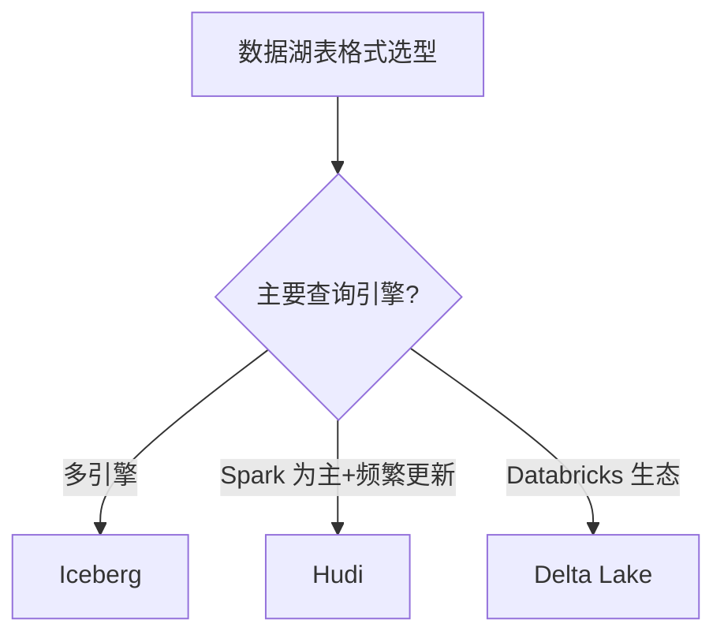

# 04 数据湖

> 一句话定位：**Iceberg / Hudi / Delta Lake——存算分离的现代数据湖表格式**

本模块覆盖三种主流数据湖表格式：Apache Iceberg（最广泛）、Apache Hudi（更新友好）、Delta Lake（Databricks 主推），对比 ACID、Schema Evolution、Time Travel、查询引擎集成。

---

## 1. 本模块覆盖

| 主题 | 状态 | 说明 |
|------|------|------|
| Apache Iceberg | 📝 新增 (T13) | 隐藏分区 / 多引擎 |
| Apache Hudi | 📝 新增 (T13) | Copy-on-Write / Merge-on-Read |
| Delta Lake | 📝 新增 (T13) | Databricks 主推 |
| 存算分离架构 | 📝 新增 (T13) | MinIO/S3 + 计算引擎 |

> 速查对比见 [📖 顶层 4.3 数据湖对比](../../README.md#43-数据湖对比)

---

## 2. 速查要点

- **三种表格式核心能力**：ACID / Schema Evolution / Time Travel / Partition Evolution
- **Iceberg 优势**：隐藏分区（partition transform 不依赖目录名）、多引擎（Spark/Flink/Trino）
- **Hudi 优势**：索引（bloom / simple / record level）+ 高效 update/delete
- **Delta Lake 优势**：与 Spark 深度集成、Databricks 生态完整

---

## 3. 选型建议

---

## 4. 与其他模块的关系

- **上游**：[02 Hadoop 生态](../02-hadoop-ecosystem/)（对象存储）
- **下游**：被 [05 OLAP](../05-olap/) / [03 实时计算](../03-realtime-compute/) 消费
- **横向**：[01 数仓架构](../01-data-warehouse/) 湖仓一体范式

---

## 5. 学习建议

- 必学 Iceberg（最广泛）
- 推荐路径：Iceberg 基础 → Spark/Flink 集成 → 存算分离
- 实战：S3 + Iceberg + Spark + Trino 查询

---

## 6. 数据时效性

- Iceberg 1.5.x（2025-11）
- Hudi 0.15.x（2025-10）
- Delta Lake 3.x（Databricks 持续更新）

---

## 7. 关键术语

| 术语 | 解释 |
|------|------|
| Iceberg | Apache 顶级项目数据湖表格式 |
| Hudi | Apache 顶级项目数据湖表格式 |
| Delta Lake | Databricks 开源数据湖表格式 |
| ACID | 事务原子性/一致性/隔离性/持久性 |
| Time Travel | 时间旅行（查询历史快照） |
| Schema Evolution | 表结构演进 |
| Hidden Partition | 隐藏分区（Iceberg 特性） |
| Copy-on-Write | 写时复制（Hudi 模式） |
| Merge-on-Read | 读时合并（Hudi 模式） |