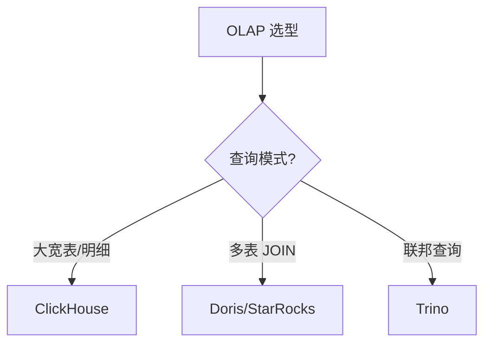

# 05 OLAP

> 一句话定位：**Doris / ClickHouse / StarRocks / Trino——亚秒级实时查询的 OLAP 引擎**

本模块覆盖四大 OLAP 引擎：Doris（国产 MPP）、StarRocks（CBO 优化强）、ClickHouse（列存大宽表）、Trino（联邦查询），对比架构、擅长场景、JOIN 能力、实时写入。

---

## 1. 本模块覆盖

| 主题 | 状态 | 说明 |
|------|------|------|
| Apache Doris | 📝 新增 (T13) | MPP / 国产开源 |
| StarRocks | 📝 新增 (T13) | CBO MPP / 极强 JOIN |
| ClickHouse | 📝 新增 (T13) | 列存 / 聚合强 |
| Trino | 📝 新增 (T13) | 联邦查询 |

> 速查对比见 [📖 顶层 4.4 OLAP 对比](../../README.md#44-olap-对比)

---

## 2. 速查要点

- **Doris 架构**：Frontend（查询规划）+ Backend（MPP 执行）+ Broker（外部数据源）
- **ClickHouse MergeTree**：家族引擎（ReplacingMergeTree / SummingMergeTree / AggregatingMergeTree）
- **StarRocks CBO**：基于成本的优化器，自动选择 JOIN 顺序
- **Trino 联邦**：跨数据源（Hive/MySQL/Kafka/ES）统一 SQL 查询

---

## 3. 选型建议

---

## 4. 与其他模块的关系

- **上游**：[04 数据湖](../04-data-lake/) / [03 实时计算](../03-realtime-compute/)（数据写入）
- **下游**：被 [11 数据可视化](../../11.ai/) / 报表工具消费
- **横向**：[02 Hadoop 生态](../02-hadoop-ecosystem/)（Presto/Trino 联邦）

---

## 5. 学习建议

- 必学 Doris 或 ClickHouse（事实标准之一）
- 推荐路径：Doris SQL → 表模型 → 数据导入
- 实战：Kafka → Flink → Doris 实时大屏

---

## 6. 数据时效性

- Doris 2.1.x / 3.0-rc（2025-Q4）
- StarRocks 3.4.x（2025-12）
- ClickHouse 24.x（2025-Q4）
- Trino 0.13.x（2025-Q4）

---

## 7. 关键术语

| 术语 | 解释 |
|------|------|
| OLAP | Online Analytical Processing |
| MPP | Massively Parallel Processing |
| CBO | Cost-Based Optimizer |
| MergeTree | ClickHouse 表引擎 |
| 物化视图 | 预计算结果集（加速查询） |
| Shard | 分片（Doris / StarRocks） |
| Tablet | Doris 数据分片单位 |
| Bitmap Index | 位图索引（加速过滤） |