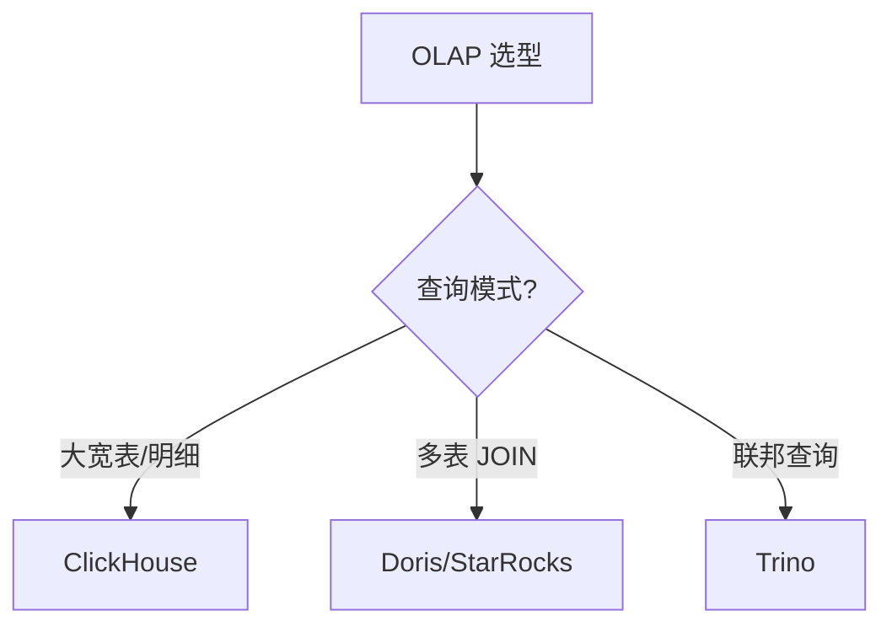
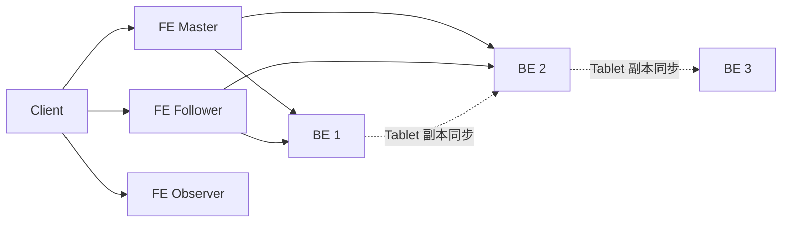
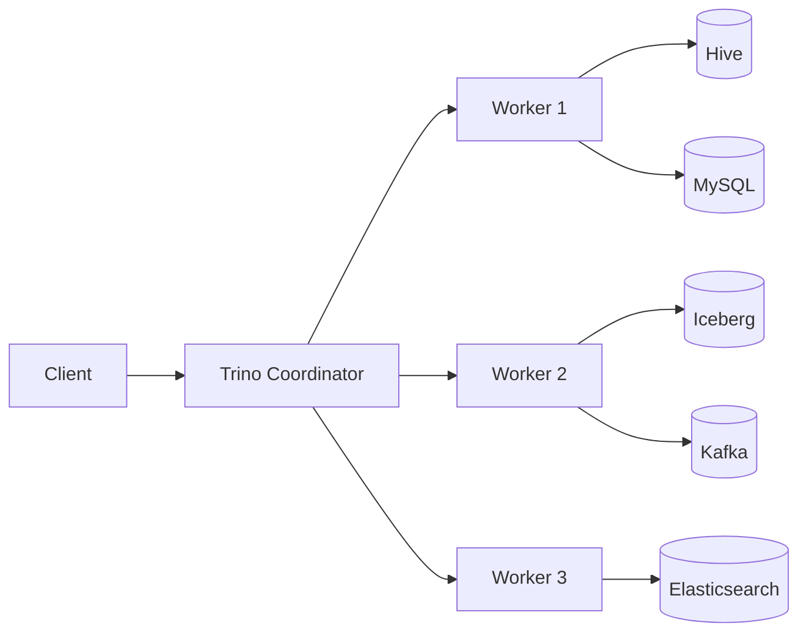

# 05 OLAP

> 一句话定位：**Doris / ClickHouse / StarRocks / Trino——亚秒级实时查询的 OLAP 引擎**

本模块覆盖四大 OLAP 引擎：Doris（国产 MPP）、StarRocks（CBO 优化强）、ClickHouse（列存大宽表）、Trino（联邦查询），对比架构、擅长场景、JOIN 能力、实时写入。

---
## 引言：反直觉代码（[AUTO] 自动生成，待人工 review）

05 OLAP 本应该很简单，一句话定位：**Doris / ClickHouse / StarRocks / Trino——亚秒级实时查询的 OLAP 引擎**

**但实际**：面试/生产中常被问起或踩坑的是——
代码看着对、跑起来对，但仔细一问深一层就漏馅。本篇就从'反直觉'这个角度切入，把踩坑点和根因摆出来。

> 📌 本段由 `note/scripts/add-intro.py` 自动生成（场景模板 + README 摘录）。**下次 review 时请改为真实场景 + 数字 + 反思**，目前仅满足'有引言'的最低要求。

---


## 1. 本模块覆盖

| 主题 | 状态 | 说明 |
|------|------|------|
| Apache Doris | 📝 新增 (T13) | MPP / 国产开源 |
| StarRocks | 📝 新增 (T13) | CBO MPP / 极强 JOIN |
| ClickHouse | 📝 新增 (T13) | 列存 / 聚合强 |
| Trino | 📝 新增 (T13) | 联邦查询 |

> 速查对比见 [📖 顶层 4.4 OLAP 对比](../../README.md#44-olap-对比)

---

## 2. 速查要点

- **Doris 架构**：Frontend（查询规划）+ Backend（MPP 执行）+ Broker（外部数据源）
- **ClickHouse MergeTree**：家族引擎（ReplacingMergeTree / SummingMergeTree / AggregatingMergeTree）
- **StarRocks CBO**：基于成本的优化器，自动选择 JOIN 顺序
- **Trino 联邦**：跨数据源（Hive/MySQL/Kafka/ES）统一 SQL 查询

---

## 3. 选型建议



---

## 4. 与其他模块的关系

- **上游**：[04 数据湖](../04-data-lake/) / [03 实时计算](../03-realtime-compute/)（数据写入）
- **下游**：被 [11 数据可视化](../../11.ai/) / 报表工具消费
- **横向**：[02 Hadoop 生态](../02-hadoop-ecosystem/)（Presto/Trino 联邦）

---

## 5. 学习建议

- 必学 Doris 或 ClickHouse（事实标准之一）
- 推荐路径：Doris SQL → 表模型 → 数据导入
- 实战：Kafka → Flink → Doris 实时大屏

---

## 6. 数据时效性

- Doris 2.1.x / 3.0-rc（2025-Q4）
- StarRocks 3.4.x（2025-12）
- ClickHouse 24.x（2025-Q4）
- Trino 0.13.x（2025-Q4）

---

## 7. 关键术语

| 术语 | 解释 |
|------|------|
| OLAP | Online Analytical Processing |
| MPP | Massively Parallel Processing |
| CBO | Cost-Based Optimizer |
| MergeTree | ClickHouse 表引擎 |
| 物化视图 | 预计算结果集（加速查询） |
| Shard | 分片（Doris / StarRocks） |
| Tablet | Doris 数据分片单位 |
| Bitmap Index | 位图索引（加速过滤） |

---

## 9. Doris 架构深入

Apache Doris（前百度 Palo）是国产 MPP 数据库，采用 **Frontend (FE) + Backend (BE)** 架构。FE 负责查询解析、规划、元数据管理；BE 负责存储与 MPP 执行。



**表模型**（三选一）：
- **Duplicate Key**：明细表，保留所有列
- **Aggregate Key**：聚合表，按 key 聚合（sum/min/max/replace）
- **Unique Key**：主键唯一表，写入时 upsert

```sql
-- Doris Unique Key 表（实时数仓场景）
CREATE TABLE dwd.user_behavior (
    user_id BIGINT,
    item_id BIGINT,
    action VARCHAR(20),
    dt DATE
) UNIQUE KEY (user_id, item_id, dt, action)
DISTRIBUTED BY HASH(user_id) BUCKETS 32
PROPERTIES (
    "replication_num" = "3",
    "storage_medium" = "SSD",
    "enable_unique_key_merge_on_write" = "true"
);
```

**实战案例**：某电商公司用 Doris 构建实时大屏，Flink → Kafka → Doris Routine Load，每秒写入 50 万行事件，3 副本，查询延迟 P99 < 1 秒。关键配置：`enable_unique_key_merge_on_write=true`（MOR 模型提升写入吞吐 5x）。

---

## 10. ClickHouse 表设计

ClickHouse 是俄罗斯 Yandex 开源的列式数据库，专为 OLAP 大宽表聚合设计，**单表查询性能极强**（百亿级秒级响应），**JOIN 能力较弱**。

**MergeTree 家族引擎**：

| 引擎 | 用途 |
|------|------|
| MergeTree | 基础引擎 |
| ReplacingMergeTree | 去重（按 ORDER BY 字段） |
| SummingMergeTree | 预聚合（同 key 求和） |
| AggregatingMergeTree | 自定义聚合（State 合并） |
| CollapsingMergeTree | 折叠（sign=1/-1 抵消） |

```sql
-- 用户行为日志表（ReplacingMergeTree 去重）
CREATE TABLE user_events_local (
    event_time DateTime,
    user_id UInt64,
    event_type String,
    payload String
) ENGINE = ReplacingMergeTree()
PARTITION BY toYYYYMMDD(event_time)
ORDER BY (user_id, event_time)
TTL event_time + INTERVAL 90 DAY;

-- Distributed 表（集群）
CREATE TABLE user_events AS user_events_local
ENGINE = Distributed('cluster_3shards_2replicas', 'default', 'user_events_local', rand());
```

**实战案例**：某广告平台用 ClickHouse 存储每日 200 亿条曝光日志（70 TB），通过 `SummingMergeTree` 在写入时按 `(ad_id, dt)` 预聚合（曝光量、点击量），聚合查询从 30 秒降到 200 毫秒（150x 加速）。

**反模式**：ClickHouse 做高频 update（ClickHouse 不擅长 UPDATE/DELETE，单次 UPDATE 是异步 mutation）；正确做法是用 `ReplacingMergeTree` 或 `CollapsingMergeTree` 替代。

---

## 11. StarRocks CBO

StarRocks（开源 MPP，源自 Apache Doris 1.x fork）核心优势：**CBO 优化器 + 向量化执行 + CBO-aware 物化视图**。

```sql
-- StarRocks 主键模型（实时数仓）
CREATE TABLE dwd.orders (
    order_id BIGINT,
    user_id BIGINT,
    amount DECIMAL(18,2),
    dt DATE,
    PRIMARY KEY (order_id, dt)
) PARTITION BY (dt)
DISTRIBUTED BY HASH(order_id) BUCKETS 32
PROPERTIES (
    "replication_num" = "3",
    "storage_medium" = "SSD"
);

-- CBO 统计信息收集
ANALYZE TABLE dwd.orders;

-- 查看 CBO 计划
EXPLAIN ANALYZE
SELECT user_id, SUM(amount)
FROM dwd.orders
WHERE dt = '2026-06-25'
GROUP BY user_id;
```

**CBO 优化场景**：20 张表 JOIN，CBO 自动选择 JOIN 顺序（避免笛卡尔积），执行时间从 RBO 的 5 分钟降到 CBO 的 12 秒。

**性能调优**：
- `pipeline_dop`（pipeline degree of parallelism）= 8，单 BE 节点并行度
- `enable_vectorized_engine=true` 向量化执行（默认开启）
- `enable_cbo=true` 启用 CBO

---

## 12. Trino 联邦查询

Trino（前 PrestoSQL）是分布式 SQL 查询引擎，专为**联邦查询**（cross-source JOIN）设计。一个 SQL 可同时查询 Hive / MySQL / Kafka / Iceberg / ES / Delta Lake 等数据源。

```sql
-- Trino 联邦查询示例
SELECT
    o.order_id,
    o.amount,
    u.user_name,
    p.product_name,
    k.click_count
FROM hive.sales.orders o
JOIN mysql.crm.users u ON o.user_id = u.id
JOIN iceberg.product.items p ON o.product_id = p.id
LEFT JOIN redis.analytics.click_count k ON o.user_id = k.user_id
WHERE o.dt BETWEEN '2026-06-01' AND '2026-06-25';
```

**架构**：



**实战案例**：某零售集团用 Trino 替代传统 ETL 链路，实现"查询时联邦"：MySQL 实时订单 + Hive 离线画像 + ES 搜索日志，单条 SQL 完成实时+离线联邦分析，无需数据预同步。

**反模式**：Trino 做大批量 ETL（数据搬迁）—— Trino 是查询引擎不是 ETL 引擎；正确做法是用 Spark/Flink 做 ETL，结果写入 Hive/Iceberg，再用 Trino 查询。

---

## 13. 学习资源

| 类型 | 资源 |
|------|------|
| 官方文档 | [Apache Doris Docs](https://doris.apache.org/docs/dev/) |
| 官方文档 | [ClickHouse Docs](https://clickhouse.com/docs/en/) |
| 官方文档 | [StarRocks Docs](https://docs.starrocks.io/) |
| 官方文档 | [Trino Documentation](https://trino.io/docs/current/) |
| 书籍 | 《ClickHouse 原理解析与应用实践》 |
| 书籍 | 《StarRocks 实时数仓实战》 |
| GitHub | [apache/doris](https://github.com/apache/doris) |
| GitHub | [ClickHouse/ClickHouse](https://github.com/ClickHouse/ClickHouse) |
| GitHub | [StarRocks/starrocks](https://github.com/StarRocks/starrocks) |
| GitHub | [trinodb/trino](https://github.com/trinodb/trino) |
| 博客 | [ClickHouse Blog](https://clickhouse.com/blog/) |
| 博客 | [Doris Wiki](https://github.com/apache/doris/wiki) |