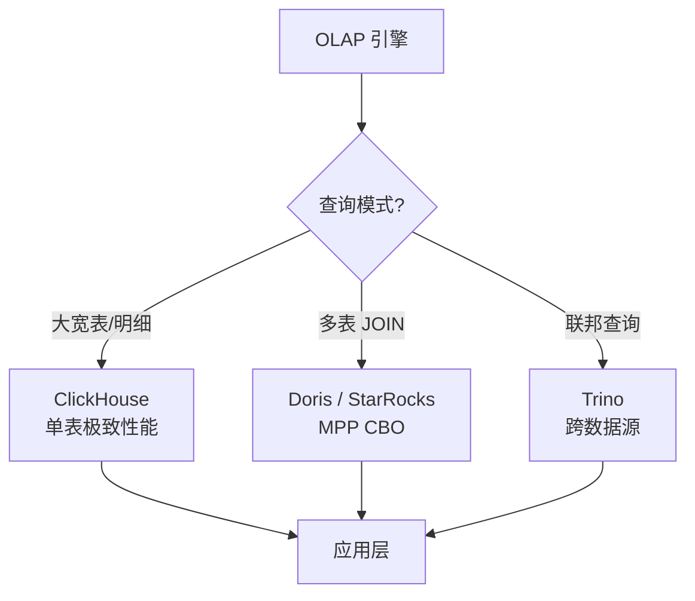

<!--
module:
  parent: big-data
  slug: big-data/olap
  type: index
  category: 主模块子文章
  summary: Doris / ClickHouse / StarRocks / Trino——亚秒级实时查询的 OLAP 引擎
-->

# 05 OLAP

> 一句话定位：**Doris / ClickHouse / StarRocks / Trino——亚秒级实时查询的 OLAP 引擎**

本模块覆盖四大 OLAP 引擎：Doris（国产 MPP）、StarRocks（CBO 优化强）、ClickHouse（列存大宽表）、Trino（联邦查询），对比架构、擅长场景、JOIN 能力、实时写入。

---

## 1. 模块导航

| 主题 | 状态 | 说明 | 子 README |
|------|------|------|-----------|
| Apache Doris | ✅ 国产主流 | MPP / MySQL 兼容 | [01-clickhouse-vs-doris-vs-starrocks](./01-clickhouse-vs-doris-vs-starrocks/) |
| StarRocks | ✅ CBO 之王 | CBO MPP / 复杂 JOIN | [01-clickhouse-vs-doris-vs-starrocks](./01-clickhouse-vs-doris-vs-starrocks/) |
| ClickHouse | ✅ 大宽表 | 列存 / 聚合强 | [01-clickhouse-vs-doris-vs-starrocks](./01-clickhouse-vs-doris-vs-starrocks/) |
| Trino | ✅ 联邦查询 | 跨数据源 SQL | — |

> 速查对比见 [📖 顶层 4.4 OLAP 对比](../../README.md#44-olap-对比)

### 1.1 学习路径

- 新人：从 Doris 入手（MySQL 协议兼容，学习曲线最低）
- 进阶：ClickHouse MergeTree 家族引擎
- 实战：Kafka → Flink → Doris 实时大屏链路

---

## 2. 知识脉络



---

## 3. 速查要点

| 引擎 | 架构 | 擅长场景 | JOIN 能力 | 实时写入 |
|------|------|---------|----------|---------|
| Doris | MPP | 大宽表+聚合 | 强 | ✓ |
| StarRocks | CBO MPP | 复杂查询 | 极强 | ✓ |
| ClickHouse | 列存 | 大宽表/明细 | 中 | ✓ |
| Presto/Trino | 协调者 | 联邦查询 | 强 | ✗ |

- **Doris 架构**：Frontend（查询规划）+ Backend（MPP 执行）+ Broker（外部数据源）
- **ClickHouse MergeTree**：家族引擎（ReplacingMergeTree / SummingMergeTree / AggregatingMergeTree）
- **StarRocks CBO**：基于成本的优化器，自动选择 JOIN 顺序
- **Trino 联邦**：跨数据源（Hive/MySQL/Kafka/ES）统一 SQL 查询

---

## 4. 核心内容

### 4.1 Doris 表模型

- **Duplicate Key**：明细表，保留所有列
- **Aggregate Key**：聚合表，按 key 聚合（sum/min/max/replace）
- **Unique Key**：主键唯一表，写入时 upsert

```sql
CREATE TABLE dwd.user_behavior (
    user_id BIGINT, item_id BIGINT, action VARCHAR(20), dt DATE
) UNIQUE KEY (user_id, item_id, dt, action)
DISTRIBUTED BY HASH(user_id) BUCKETS 32
PROPERTIES (
    "replication_num" = "3",
    "storage_medium" = "SSD",
    "enable_unique_key_merge_on_write" = "true"
);
```

### 4.2 ClickHouse MergeTree 家族

| 引擎 | 用途 |
|------|------|
| MergeTree | 基础引擎 |
| ReplacingMergeTree | 去重（按 ORDER BY 字段） |
| SummingMergeTree | 预聚合（同 key 求和） |
| AggregatingMergeTree | 自定义聚合（State 合并） |
| CollapsingMergeTree | 折叠（sign=1/-1 抵消） |

### 4.3 StarRocks CBO 调优

```sql
-- CBO 统计信息收集
ANALYZE TABLE dwd.orders;

-- 性能调优参数
SET pipeline_dop = 8;
SET enable_vectorized_engine = true;
SET enable_cbo = true;
```

- CBO 自动选择 JOIN 顺序（避免笛卡尔积）
- 20 张表 JOIN：RBO 5 分钟 → CBO 12 秒

### 4.4 Trino 联邦查询

```sql
SELECT
    o.order_id, o.amount, u.user_name, p.product_name, k.click_count
FROM hive.sales.orders o
JOIN mysql.crm.users u ON o.user_id = u.id
JOIN iceberg.product.items p ON o.product_id = p.id
LEFT JOIN redis.analytics.click_count k ON o.user_id = k.user_id
WHERE o.dt BETWEEN '2026-06-01' AND '2026-06-25';
```

---

## 5. 最佳实践

| 实践 | 说明 |
|------|------|
| OLAP 选型 | 高并发点查 → Doris/StarRocks；Ad-hoc → ClickHouse/Trino |
| 统一分析 | Doris + 物化视图（减少多套引擎） |
| ClickHouse 反模式 | 避免高频 UPDATE/DELETE（mutation 异步慢） |
| Trino 反模式 | 避免大批量 ETL（查询引擎不是 ETL 引擎） |
| Doris 实时 | `enable_unique_key_merge_on_write=true` 提升写入 5x |

---

## 6. 常见面试题

| 题目 | 核心考点 |
|------|---------|
| Doris / StarRocks / ClickHouse 怎么选？ | JOIN 复杂度 / 大宽表 / 国产化 |
| ClickHouse 为何不擅长 JOIN？ | 列存 + 单表极致优化，JOIN 需重写 |
| Doris Unique Key 表的 MOR 优势？ | 实时 upsert + 读时合并 |
| StarRocks CBO 比 Doris 强在哪？ | 基于成本的多表 JOIN 优化 |
| Trino 为何不能做 ETL？ | 内存计算 + 无状态 + 协调者架构 |
| 物化视图 vs 实时聚合？ | 预计算 vs 流式聚合；查询延迟 vs 实时性 |

---

## 7. 与其他模块的关系

- **上游**：[04 数据湖](../04-data-lake/) / [03 实时计算](../03-realtime-compute/)（数据写入）
- **下游**：被 [11 数据可视化](../../11.ai/) / 报表工具消费
- **横向**：[02 Hadoop 生态](../02-hadoop-ecosystem/)（Presto/Trino 联邦）

---

## 📊 本节统计

| 维度 | 数字 |
|------|------|
| 子 README 数 | 1（[01-clickhouse-vs-doris-vs-starrocks](./01-clickhouse-vs-doris-vs-starrocks/)） |
| 二级 leaf README 数 | 1 |
| 四 OLAP 引擎对比维度数 | 5（架构 / 擅长 / JOIN / 实时写入） |
| Doris 表模型类型 | 3（Duplicate / Aggregate / Unique） |
| ClickHouse MergeTree 引擎 | 5（基础 / Replacing / Summing / Aggregating / Collapsing） |
| 实战案例数 | 4（Doris 实时 / ClickHouse 聚合 / StarRocks CBO / Trino 联邦） |
| 最佳实践条数 | 5 |
| 常见面试题数 | 6 |
| frontmatter 覆盖率 | 2 / 2 = 100% |
| 文末回链覆盖 | 2 / 2 = 100% |

---

← [返回大数据总览](../../README.md)