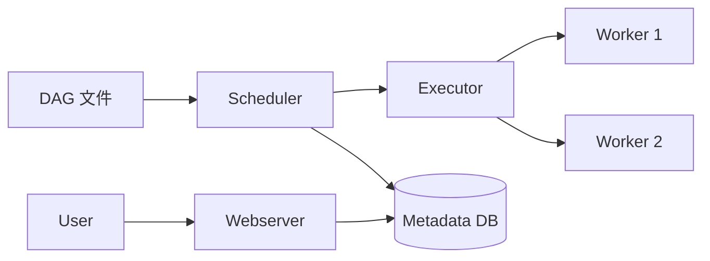

<!--
module:
  parent: big-data
  slug: big-data/scheduling
  type: index
  category: 主模块子文章
  summary: Airflow / DolphinScheduler / Azkaban——大数据任务编排系统
-->

# 06 调度

> 一句话定位：**Airflow / DolphinScheduler / Azkaban——大数据任务编排系统**

本模块覆盖大数据领域三大调度系统：Airflow（Python DAG 主流）、DolphinScheduler（国产去中心化）、Azkaban（遗留 Hadoop），对比 DAG 模型、部署模式、UI、学习曲线。

---

## 1. 模块导航

| 主题 | 状态 | 说明 |
|------|------|------|
| Apache Airflow | ✅ 事实标准 | Python DAG / 中心化 |
| DolphinScheduler | ✅ 国产主流 | YAML DAG / 去中心化 |
| Azkaban | ⚠️ 遗留 | 中心化 / Hadoop 内 |

> 速查对比见 [📖 顶层 4.5 调度对比](../../README.md#45-调度对比)

### 1.1 学习路径

- 新人：从 Airflow DAG 入手，掌握 Task Operator 编排
- 进阶：KubernetesExecutor 动态 Pod，云原生调度
- 实战：每日 Hive 任务 → Airflow 编排 + SLA 告警

---

## 2. 知识脉络



---

## 3. 速查要点

- **Airflow 架构**：Scheduler + Executor + Webserver + Metadata DB
- **DolphinScheduler 优势**：去中心化（Worker 节点独立）、租户隔离、可视化 DAG
- **任务依赖**：上游成功 → 下游执行；失败重试 + 告警
- **补数（Backfill）**：历史任务回填，Airflow 支持 backfill 命令

| 系统 | DAG 模型 | 部署 | UI | 学习曲线 |
|------|---------|------|----|---------|
| Airflow 2.x | Python DAG | 中心化 | 强 | 中 |
| DolphinScheduler | YAML DAG | 去中心化 | 强 | 低 |
| Azkaban | 配置文件 | 中心化 | 弱 | 低 |
| Oozie | XML DAG | 中心化 | 弱 | 高 |

---

## 4. 核心内容

### 4.1 Airflow DAG 示例

```python
from airflow import DAG
from airflow.operators.bash import BashOperator
from airflow.operators.python import PythonOperator
from datetime import datetime, timedelta

default_args = {
    'owner': 'data-eng',
    'retries': 3,
    'retry_delay': timedelta(minutes=5),
    'execution_timeout': timedelta(hours=2),
}

with DAG(
    'daily_etl',
    default_args=default_args,
    schedule_interval='0 2 * * *',
    start_date=datetime(2026, 1, 1),
    catchup=False,
    max_active_runs=1,
) as dag:
    extract = BashOperator(task_id='extract', bash_command='python /opt/etl/extract.py {{ ds }}')
    transform = PythonOperator(task_id='transform', python_callable=transform_func, op_kwargs={'dt': '{{ ds }}'})
    load = BashOperator(task_id='load', bash_command='spark-submit /opt/etl/load.py {{ ds }}')
    extract >> transform >> load
```

### 4.2 Executor 选择

| Executor | 适用场景 |
|---------|---------|
| SequentialExecutor | 单线程调试 |
| LocalExecutor | 单机并行（小团队） |
| CeleryExecutor | 分布式（Redis broker） |
| KubernetesExecutor | 动态 Pod（云原生首选） |

### 4.3 DolphinScheduler 去中心化

- Worker 拉取任务（Pull 模式），Master 故障不影响任务执行
- 租户隔离：每个租户独立 Linux 用户，文件权限隔离
- 可视化 DAG：拖拽式 UI，零代码生成 DAG
- 反模式：单 Master 部署 → 3 Master + N Worker + ZooKeeper 选举

### 4.4 自定义 Operator

```python
class SparkSubmitOperator(BaseOperator):
    @apply_defaults
    def __init__(self, main_jar: str, app_name: str, conf: dict = None, *args, **kwargs):
        super().__init__(*args, **kwargs)
        self.main_jar = main_jar
        self.app_name = app_name
        self.conf = conf or {}

    def execute(self, context):
        spark = SparkSession.builder.appName(self.app_name).getOrCreate()
        try:
            df = spark.read.parquet(self.conf.get('input_path'))
            df.createOrReplaceTempView("source")
            result = spark.sql(self.conf.get('sql'))
            result.write.parquet(self.conf.get('output_path'))
        finally:
            spark.stop()
```

---

## 5. 最佳实践

| 实践 | 说明 |
|------|------|
| Executor 选择 | 云原生 → KubernetesExecutor（动态伸缩 60% 节省） |
| SLA 告警 | 任务级 + 系统级 + 业务级三层指标 |
| 自定义 Operator | 封装团队标准 ETL（`HiveToIcebergOperator` 等） |
| Master 高可用 | DolphinScheduler 3 Master + N Worker |
| 监控 | Prometheus + Grafana + airflow-exporter |

---

## 6. 常见面试题

| 题目 | 核心考点 |
|------|---------|
| Airflow vs DolphinScheduler？ | Python DAG vs 可视化 DAG；中心化 vs 去中心化 |
| Executor 怎么选？ | 调试/小集群/中等/云原生 |
| Backfill 怎么做？ | `airflow dags backfill` 命令 + catchup |
| DolphinScheduler 租户隔离原理？ | 独立 Linux 用户 + 文件权限 |
| SLA 如何配置？ | `sla_miss_callback` + 任务超时设置 |
| 任务依赖怎么定义？ | `>>` / `<<` 位移操作符 / `set_downstream` |

---

## 7. 与其他模块的关系

- **上游**：所有任务模块（02-05, 08）
- **下游**：触发实际计算任务
- **横向**：[07 数据治理](../07-data-governance/)（任务血缘）

---

## 📊 本节统计

| 维度 | 数字 |
|------|------|
| 子 README 数 | 1（本目录为分类顶层） |
| 二级 leaf README 数 | 0 |
| 三大调度系统对比维度数 | 5（DAG 模型 / 部署 / UI / 学习曲线） |
| Executor 类型 | 4（Sequential / Local / Celery / Kubernetes） |
| 实战案例数 | 4（Airflow DAG / DolphinScheduler 架构 / 自定义 Operator / SLA 告警） |
| 最佳实践条数 | 5 |
| 常见面试题数 | 6 |
| frontmatter 覆盖率 | 1 / 1 = 100% |
| 文末回链覆盖 | 1 / 1 = 100% |

---

← [返回大数据总览](../../README.md)