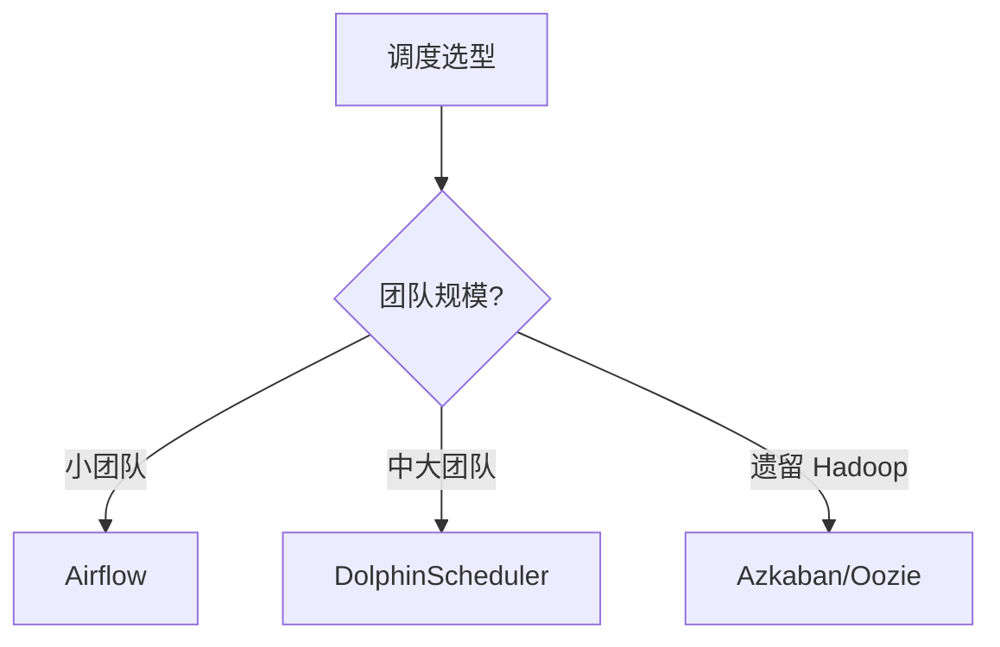

# 06 调度

> 一句话定位：**Airflow / DolphinScheduler / Azkaban——大数据任务编排系统**

本模块覆盖大数据领域三大调度系统：Airflow（Python DAG 主流）、DolphinScheduler（国产去中心化）、Azkaban（遗留 Hadoop），对比 DAG 模型、部署模式、UI、学习曲线。

---

## 1. 本模块覆盖

| 主题 | 状态 | 说明 |
|------|------|------|
| Apache Airflow | 📝 新增 (T13) | Python DAG / 中心化 |
| DolphinScheduler | 📝 新增 (T13) | YAML DAG / 去中心化 / 国产 |
| Azkaban | 📝 新增 (T13) | 遗留 Hadoop |

> 速查对比见 [📖 顶层 4.5 调度对比](../../README.md#45-调度对比)

---

## 2. 速查要点

- **Airflow 架构**：Scheduler + Executor + Webserver + Metadata DB
- **DolphinScheduler 优势**：去中心化（Worker 节点独立）、租户隔离、可视化 DAG
- **任务依赖**：上游成功 → 下游执行；失败重试 + 告警
- **补数（Backfill）**：历史任务回填，Airflow 支持 backfill 命令

---

## 3. 选型建议

---

## 4. 与其他模块的关系

- **上游**：所有任务模块（02-05, 08）
- **下游**：触发实际计算任务
- **横向**：[07 数据治理](../07-data-governance/)（任务血缘）

---

## 5. 学习建议

- 必学 Airflow（事实标准）
- 推荐路径：Airflow DAG → Executor → 自定义 Operator
- 实战：每日 Hive 任务 → Airflow 编排

---

## 6. 数据时效性

- Airflow 2.10+（2025）
- DolphinScheduler 3.x（2025）
- Azkaban 4.x（停止大版本更新）

---

## 7. 关键术语

| 术语 | 解释 |
|------|------|
| DAG | Directed Acyclic Graph |
| Executor | Airflow 任务执行器 |
| Operator | Airflow 任务模板 |
| Backfill | 历史任务回填 |
| SLA | Service Level Agreement |
| Cron | 定时任务表达式 |
| Worker | DolphinScheduler 执行节点 |
| Tenant | DolphinScheduler 租户隔离 |
