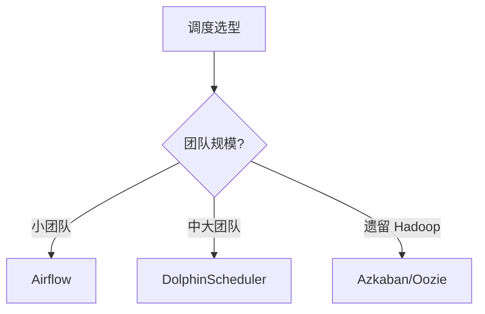
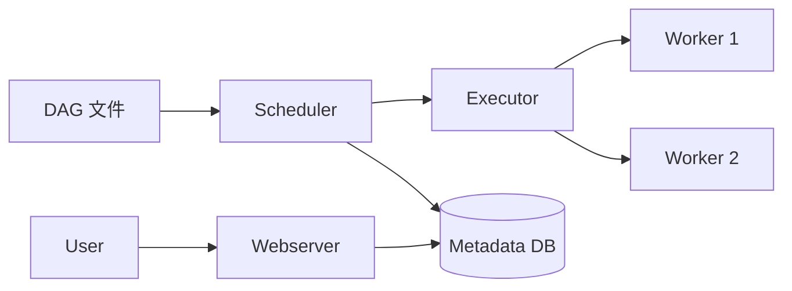
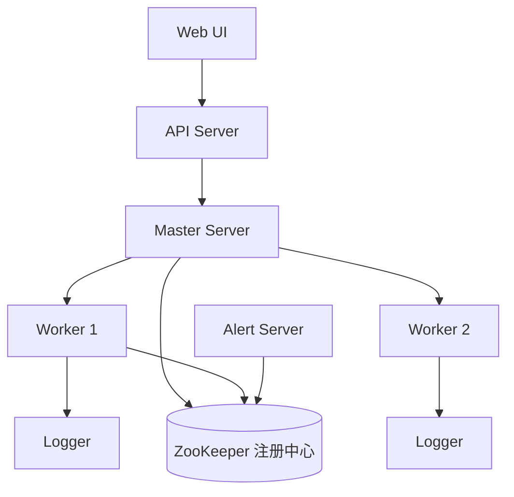

# 06 调度

> 一句话定位：**Airflow / DolphinScheduler / Azkaban——大数据任务编排系统**

本模块覆盖大数据领域三大调度系统：Airflow（Python DAG 主流）、DolphinScheduler（国产去中心化）、Azkaban（遗留 Hadoop），对比 DAG 模型、部署模式、UI、学习曲线。

---
## 引言：反直觉代码（[AUTO] 自动生成，待人工 review）

06 调度 本应该很简单，一句话定位：**Airflow / DolphinScheduler / Azkaban——大数据任务编排系统**

**但实际**：面试/生产中常被问起或踩坑的是——
代码看着对、跑起来对，但仔细一问深一层就漏馅。本篇就从'反直觉'这个角度切入，把踩坑点和根因摆出来。

> 📌 本段由 `note/scripts/add-intro.py` 自动生成（场景模板 + README 摘录）。**下次 review 时请改为真实场景 + 数字 + 反思**，目前仅满足'有引言'的最低要求。

---


## 1. 本模块覆盖

| 主题 | 状态 | 说明 |
|------|------|------|
| Apache Airflow | 📝 新增 (T13) | Python DAG / 中心化 |
| DolphinScheduler | 📝 新增 (T13) | YAML DAG / 去中心化 / 国产 |
| Azkaban | 📝 新增 (T13) | 遗留 Hadoop |

> 速查对比见 [📖 顶层 4.5 调度对比](../../README.md#45-调度对比)

---

## 2. 速查要点

- **Airflow 架构**：Scheduler + Executor + Webserver + Metadata DB
- **DolphinScheduler 优势**：去中心化（Worker 节点独立）、租户隔离、可视化 DAG
- **任务依赖**：上游成功 → 下游执行；失败重试 + 告警
- **补数（Backfill）**：历史任务回填，Airflow 支持 backfill 命令

---

## 3. 选型建议



---

## 4. 与其他模块的关系

- **上游**：所有任务模块（02-05, 08）
- **下游**：触发实际计算任务
- **横向**：[07 数据治理](../07-data-governance/)（任务血缘）

---

## 5. 学习建议

- 必学 Airflow（事实标准）
- 推荐路径：Airflow DAG → Executor → 自定义 Operator
- 实战：每日 Hive 任务 → Airflow 编排

---

## 6. 数据时效性

- Airflow 2.10+（2025）
- DolphinScheduler 3.x（2025）
- Azkaban 4.x（停止大版本更新）

---

## 7. 关键术语

| 术语 | 解释 |
|------|------|
| DAG | Directed Acyclic Graph |
| Executor | Airflow 任务执行器 |
| Operator | Airflow 任务模板 |
| Backfill | 历史任务回填 |
| SLA | Service Level Agreement |
| Cron | 定时任务表达式 |
| Worker | DolphinScheduler 执行节点 |
| Tenant | DolphinScheduler 租户隔离 |

---

## 9. Airflow 深入

Apache Airflow 是 Python DAG 工作流编排平台的事实标准，架构：**Scheduler**（任务调度）+ **Executor**（任务执行）+ **Webserver**（UI）+ **Metadata DB**（状态持久化，通常 PostgreSQL/MySQL）。



**DAG 示例**（Python 风格）：

```python
from airflow import DAG
from airflow.operators.bash import BashOperator
from airflow.operators.python import PythonOperator
from datetime import datetime, timedelta

default_args = {
    'owner': 'data-eng',
    'retries': 3,
    'retry_delay': timedelta(minutes=5),
    'execution_timeout': timedelta(hours=2),
}

with DAG(
    'daily_etl',
    default_args=default_args,
    schedule_interval='0 2 * * *',  # 每日凌晨 2 点
    start_date=datetime(2026, 1, 1),
    catchup=False,
    max_active_runs=1,
) as dag:

    extract = BashOperator(
        task_id='extract',
        bash_command='python /opt/etl/extract.py {{ ds }}',
    )

    transform = PythonOperator(
        task_id='transform',
        python_callable=transform_func,
        op_kwargs={'dt': '{{ ds }}'},
    )

    load = BashOperator(
        task_id='load',
        bash_command='spark-submit /opt/etl/load.py {{ ds }}',
    )

    extract >> transform >> load
```

**Executor 选择**：
- `SequentialExecutor`：单线程调试用
- `LocalExecutor`：单机并行（适合小团队）
- `CeleryExecutor`：分布式（Redis 作为 broker，worker 横向扩展）
- `KubernetesExecutor`：动态 Pod（云原生首选）

**实战案例**：某互联网公司用 KubernetesExecutor 调度每日 300 个 ETL 任务，凌晨高峰期动态拉起 200 个 Pod，空闲时缩容到 10 个，节省 60% 计算成本。

---

## 10. DolphinScheduler 实战

DolphinScheduler 是国产开源去中心化调度系统，**Worker 节点独立调度**（不依赖中心 Master），适合中大团队多业务线场景。

**架构**：



**优势对比 Airflow**：
- **去中心化**：Worker 拉取任务（Pull 模式），Master 故障不影响任务执行
- **租户隔离**：每个租户独立的 Linux 用户，文件权限隔离
- **可视化 DAG**：拖拽式 UI，零代码生成 DAG
- **多租户**：支持多业务线 / 多团队资源隔离

**实战场景**：金融公司多业务线（风控 / 营销 / 监管报送），每条业务线独立租户 + 独立 Worker 集群，Worker 节点宕机时其他 Worker 自动接管。

**反模式**：DolphinScheduler 单 Master 部署（Master 单点）；正确做法是 3 Master + N Worker，Master 通过 ZooKeeper 选举。

---

## 11. 自定义 Operator

Airflow 的 Operator 是任务模板，自定义 Operator 可封装团队标准 ETL 逻辑，避免重复代码。

```python
from airflow.models.baseoperator import BaseOperator
from airflow.utils.decorators import apply_defaults
from pyspark.sql import SparkSession

class SparkSubmitOperator(BaseOperator):
    @apply_defaults
    def __init__(
        self,
        main_jar: str,
        app_name: str,
        conf: dict = None,
        *args, **kwargs
    ):
        super().__init__(*args, **kwargs)
        self.main_jar = main_jar
        self.app_name = app_name
        self.conf = conf or {}

    def execute(self, context):
        spark = SparkSession.builder \
            .appName(self.app_name) \
            .config("spark.executor.memory", "4g") \
            .getOrCreate()

        try:
            spark.sparkContext.addJar(self.main_jar)
            df = spark.read.parquet(self.conf.get('input_path'))
            df.createOrReplaceTempView("source")
            result = spark.sql(self.conf.get('sql'))
            result.write.parquet(self.conf.get('output_path'))
        finally:
            spark.stop()

# DAG 中使用
etl = SparkSubmitOperator(
    task_id='spark_etl',
    main_jar='/opt/etl/etl.jar',
    app_name='daily_etl',
    conf={
        'input_path': 's3://lake/source/dt={{ ds }}/',
        'sql': 'SELECT user_id, SUM(amount) FROM source GROUP BY user_id',
        'output_path': 's3://lake/agg/dt={{ ds }}/',
    },
    dag=dag,
)
```

**实战案例**：某团队封装 5 个自定义 Operator（`HiveToIcebergOperator` / `IcebergToClickHouseOperator` / `DorisStreamLoadOperator` 等），统一参数规范（`input_path` / `output_path` / `partition`），复用率 90%+。

---

## 12. 监控告警

调度系统的可靠性依赖完善的监控告警：**任务级 SLA + 系统级指标 + 告警渠道**。

**Airflow 告警配置**：

```python
from airflow.operators.email import EmailOperator
from airflow.utils.trigger_rule import TriggerRule

# SLA 配置（任务超过预期时间未完成触发告警）
dag = DAG(
    'critical_etl',
    sla_miss_callback=alert_sla_miss,  # SLA 失败回调
    default_args={'sla': timedelta(hours=1)},
)

# 自定义告警回调
def alert_sla_miss(dag, task_list, blocking_task_list, slas, blocking_tis):
    send_alert(
        channel='feishu',
        message=f'SLA 失败：DAG={dag.dag_id}, 任务={[t.task_id for t in task_list]}',
    )

# on_failure_callback
def alert_failure(context):
    send_alert(
        channel='pagerduty',
        message=f'任务失败：{context["task_instance"].task_id} @ {context["ds"]}',
        severity='high',
    )
```

**关键监控指标**：
- **任务级**：任务成功率 / 平均执行时长 / SLA 达标率
- **系统级**：Scheduler 队列深度 / Worker 空闲率 / Metadata DB 连接数
- **业务级**：数据延迟（业务时间 vs 任务完成时间）

**实战配置**：用 Prometheus + Grafana 采集 Airflow Metrics（`airflow-exporter`），告警规则：任务成功率 < 95% 触发 P2 告警，SLA 失败触发 P1 告警。

---

## 13. 学习资源

| 类型 | 资源 |
|------|------|
| 官方文档 | [Apache Airflow Docs](https://airflow.apache.org/docs/) |
| 官方文档 | [DolphinScheduler Docs](https://dolphinscheduler.apache.org/en-us/docs/) |
| 官方文档 | [Astronomer Guides](https://docs.astronomer.io/) |
| 书籍 | 《数据流水线：Airflow 实战》（Bas Harenslak） |
| 书籍 | 《Data Pipelines Pocket Reference》 |
| 实战 | [Airflow Docker Quickstart](https://airflow.apache.org/docs/apache-airflow/stable/start/docker.html) |
| GitHub | [apache/airflow](https://github.com/apache/airflow) |
| GitHub | [apache/dolphinscheduler](https://github.com/apache/dolphinscheduler) |
| 博客 | [Airflow Blog](https://airflow.apache.org/blog/) |
| 博客 | [DolphinScheduler Blog](https://dolphinscheduler.apache.org/en-us/blog/) |
