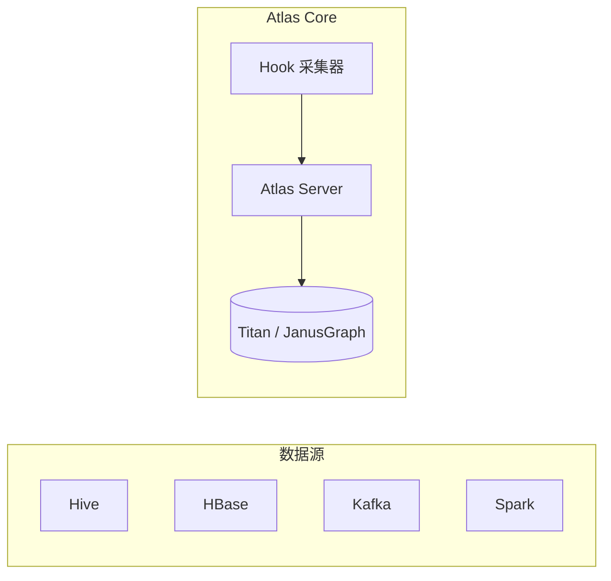

<!--
module:
  parent: big-data
  slug: big-data/data-governance
  type: index
  category: 主模块子文章
  summary: Atlas / DataHub / 数据血缘——元数据、质量、安全三大支柱
-->

# 07 数据治理

> 一句话定位：**Atlas / DataHub / 数据血缘——元数据、质量、安全三大支柱**

本模块覆盖大数据治理三大支柱：元数据管理（Apache Atlas / DataHub）、数据血缘（Column-Level Lineage）、数据质量（Great Expectations / Deequ）、数据安全（脱敏 / 访问控制 / 审计）。

---

## 1. 模块导航

| 主题 | 状态 | 说明 |
|------|------|------|
| Apache Atlas | ✅ Hadoop 生态 | 元数据 / 血缘 |
| DataHub | ✅ LinkedIn 现代 | 字段级血缘 / UI 强 |
| OpenMetadata | ✅ 统一平台 | 元数据 + 质量 + 血缘 |
| 数据血缘 | ✅ 必备能力 | Column-Level Lineage |
| 数据质量 | ✅ 必备能力 | Great Expectations / Deequ |

> 速查对比见 [📖 顶层 4.7 治理对比](../../README.md#47-治理对比)

### 1.1 学习路径

- 新人：从元数据三大类型（技术/业务/操作）入手
- 进阶：掌握字段级血缘采集（SQL 解析 / Hook 拦截）
- 实战：Hive + Atlas 表血缘 + Deequ 数据质量

---

## 2. 知识脉络



---

## 3. 速查要点

- **元数据三大类型**：技术元数据（表结构）/ 业务元数据（业务含义）/ 操作元数据（血缘）
- **血缘分类**：表级血缘（Table-Level）/ 字段级血缘（Column-Level）
- **数据质量维度**：完整性 / 准确性 / 一致性 / 时效性 / 唯一性
- **数据安全**：分类分级（公开/内部/机密/绝密）+ 访问控制（RBAC/ABAC）+ 脱敏

| 工具 | 元数据 | 血缘 | 数据质量 | 部署 |
|------|-------|------|---------|------|
| Apache Atlas | ✓ | ✓ | ✗ | 中心化 |
| DataHub | ✓ | ✓ | ✓ | 去中心化 |
| OpenMetadata | ✓ | ✓ | ✓ | 中心化 |
| Great Expectations | ✗ | ✗ | ✓ | 库集成 |

---

## 4. 核心内容

### 4.1 Atlas Hive Hook 配置

```xml
<!-- atlas-application.properties -->
atlas.hook.hive.synchronous=false
atlas.hook.hive.numRetries=3

<!-- hive-site.xml -->
<property>
  <name>hive.exec.post.hooks</name>
  <value>org.apache.atlas.hive.hook.HiveHook</value>
</property>
```

### 4.2 字段级血缘采集

```python
import sqlglot
from sqlglot.lineage import lineage

sql = """
INSERT INTO dws.user_metric (user_id, total_amount)
SELECT user_id, SUM(amount) AS total_amount
FROM ods.user_orders
WHERE dt = '2026-06-25'
GROUP BY user_id;
"""

result = lineage("user_id", sql)
for node in result:
    print(f"{node.name} <- {node.expression.sql()}")
# user_id <- ods.user_orders.user_id
# total_amount <- SUM(ods.user_orders.amount)
```

### 4.3 数据质量规则（Great Expectations）

| 维度 | 示例规则 |
|------|---------|
| 完整性 | 字段非空率 >= 99% |
| 准确性 | 金额字段 > 0 |
| 一致性 | 主键唯一性 |
| 时效性 | 数据延迟 < 1 小时 |
| 唯一性 | `user_id` 全局唯一 |

```python
batch.expect_column_values_to_not_be_null("order_id")
batch.expect_column_values_to_be_unique("order_id")
batch.expect_column_values_to_be_between("amount", min_value=0, max_value=1000000)
batch.expect_column_values_to_match_regex("user_email", r"^[\w.-]+@[\w.-]+\.\w+$")
```

### 4.4 数据安全合规

**分类分级**：

| 级别 | 示例数据 | 保护要求 |
|------|---------|----------|
| 公开 | 产品介绍 | 无特殊要求 |
| 内部 | 业务运营数据 | 内网访问 |
| 机密 | 客户基本信息 | 加密存储 + 访问审计 |
| 绝密 | 身份证 / 银行卡 / 健康数据 | 加密 + 脱敏 + 严格授权 |

**脱敏示例**：

```sql
CREATE TABLE dwd.user_profile_masked AS
SELECT
    user_id,
    CONCAT(SUBSTR(id_card, 1, 6), '********', SUBSTR(id_card, -4)) AS id_card_masked,
    CONCAT(SUBSTR(phone, 1, 3), '****', SUBSTR(phone, -4)) AS phone_masked,
    age, gender
FROM ods.user_profile;
```

**法规**：GDPR（欧盟，Right to be Forgotten）/ PIPL（中国，个人信息保护法）/ HIPAA（美国医疗，PHI 加密）

---

## 5. 最佳实践

| 实践 | 说明 |
|------|------|
| 元数据选型 | Hadoop 生态 → Atlas；现代 UI → DataHub；统一平台 → OpenMetadata |
| 血缘采集 | 必须字段级（表级无法定位字段错误） |
| 质量规则 | 在 ETL 任务完成后自动触发 + 告警 + 阻断 |
| 数据脱敏 | 静态脱敏（ETL 时）+ 动态脱敏（查询时） |
| 法规合规 | 分类分级 + 自动扫描 + 跨境阻断 |

---

## 6. 常见面试题

| 题目 | 核心考点 |
|------|---------|
| 数据血缘怎么自动采集？ | SQL 解析 / Hook 拦截 / 日志解析 |
| 表级 vs 字段级血缘？ | 字段级才能定位字段计算错误 |
| 元数据三大类型？ | 技术 / 业务 / 操作 |
| 数据质量五大维度？ | 完整性 / 准确性 / 一致性 / 时效性 / 唯一性 |
| GDPR 与 PIPL 区别？ | 欧盟 vs 中国本地化 + 跨境传输 |
| RBAC vs ABAC？ | 基于角色 vs 基于属性 |
| Deequ 做什么？ | Spark 上自动计算质量指标（Row Count / Completeness） |

---

## 7. 与其他模块的关系

- **上游**：所有数据模块（02-06, 08）
- **下游**：被数据分析师 / 合规审计消费
- **横向**：[06 调度](../06-scheduling/)（任务血缘）

---

## 📊 本节统计

| 维度 | 数字 |
|------|------|
| 子 README 数 | 1（本目录为分类顶层） |
| 二级 leaf README 数 | 0 |
| 元数据工具对比 | 4（Atlas / DataHub / OpenMetadata / Great Expectations） |
| 数据质量维度 | 5（完整性 / 准确性 / 一致性 / 时效性 / 唯一性） |
| 分类分级级别 | 4（公开 / 内部 / 机密 / 绝密） |
| 法规类型 | 3（GDPR / PIPL / HIPAA） |
| 实战案例数 | 5（Atlas Hook / 字段血缘 / 质量规则 / 脱敏 / 合规） |
| 最佳实践条数 | 5 |
| 常见面试题数 | 7 |
| frontmatter 覆盖率 | 1 / 1 = 100% |
| 文末回链覆盖 | 1 / 1 = 100% |

---

← [返回大数据总览](../../README.md)