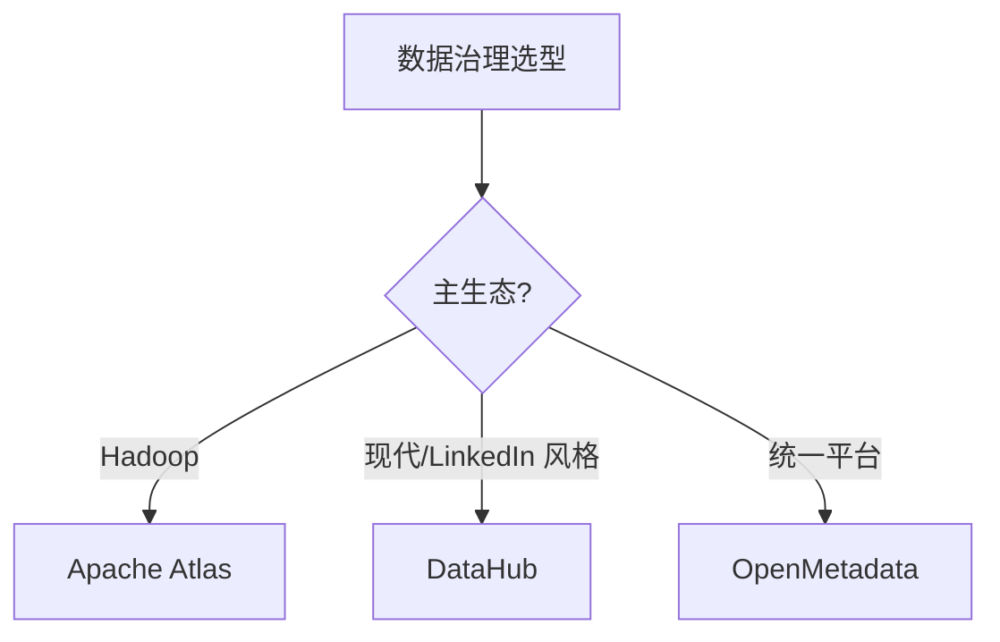
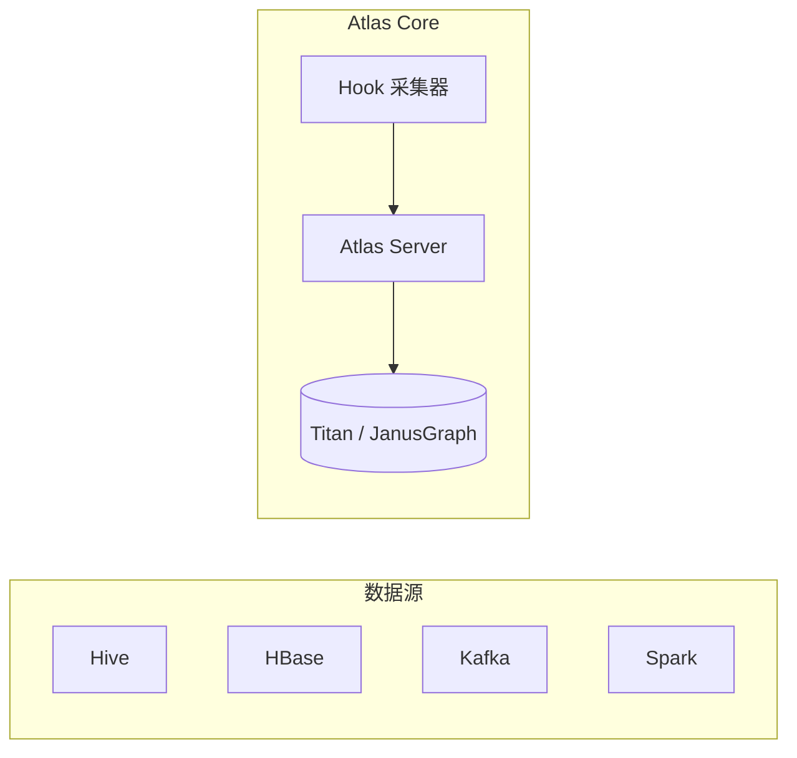

# 07 数据治理

> 一句话定位：**Atlas / DataHub / 数据血缘——元数据、质量、安全三大支柱**

本模块覆盖大数据治理三大支柱：元数据管理（Apache Atlas / DataHub）、数据血缘（Column-Level Lineage）、数据质量（Great Expectations / Deequ）、数据安全（脱敏 / 访问控制 / 审计）。

---

## 1. 本模块覆盖

| 主题 | 状态 | 说明 |
|------|------|------|
| Apache Atlas | 📝 新增 (T13) | 元数据 / 血缘 / Hadoop 集成 |
| DataHub | 📝 新增 (T13) | LinkedIn 开源 / 现代 UI |
| OpenMetadata | 📝 新增 (T13) | 统一元数据 + 质量 |
| 数据血缘 | 📝 新增 (T13) | Column-Level Lineage |
| 数据质量 | 📝 新增 (T13) | Great Expectations / Deequ |

> 速查对比见 [📖 顶层 4.7 治理对比](../../README.md#47-治理对比)

---

## 2. 速查要点

- **元数据三大类型**：技术元数据（表结构）/ 业务元数据（业务含义）/ 操作元数据（血缘）
- **血缘分类**：表级血缘（Table-Level）/ 字段级血缘（Column-Level）
- **数据质量维度**：完整性 / 准确性 / 一致性 / 时效性 / 唯一性
- **数据安全**：分类分级（公开/内部/机密/绝密）+ 访问控制（RBAC/ABAC）+ 脱敏

---

## 3. 选型建议



---

## 4. 与其他模块的关系

- **上游**：所有数据模块（02-06, 08）
- **下游**：被数据分析师 / 合规审计消费
- **横向**：[06 调度](../06-scheduling/)（任务血缘）

---

## 5. 学习建议

- 必学 Atlas 或 DataHub（事实标准之一）
- 推荐路径：元数据建模 → 血缘采集 → 数据质量规则
- 实战：Hive + Atlas 表血缘采集

---

## 6. 数据时效性

- Atlas 2.x（2024 持续维护）
- DataHub 0.x（2025 持续迭代）
- OpenMetadata 1.x（2025 快速演进）

---

## 7. 关键术语

| 术语 | 解释 |
|------|------|
| Atlas | Apache 元数据 + 血缘 |
| DataHub | LinkedIn 现代元数据平台 |
| Lineage | 数据血缘 |
| Column-Level | 字段级血缘 |
| Deequ | Amazon 开源数据质量 |
| RBAC | Role-Based Access Control |
| ABAC | Attribute-Based Access Control |
| GDPR | 欧盟通用数据保护条例 |

---

## 9. Atlas 实战

Apache Atlas 是 Hadoop 生态的元数据 + 血缘管理平台，深度集成 Hive / HBase / Kafka / Spark / Storm。

**架构**：



**Hive Hook 配置**（自动采集元数据）：

```xml
<!-- atlas-application.properties -->
atlas.hook.hive.synchronous=false
atlas.hook.hive.numRetries=3
atlas.hook.hive.qualifiedName=primary

<!-- hive-site.xml -->
<property>
  <name>hive.exec.post.hooks</name>
  <value>org.apache.atlas.hive.hook.HiveHook</value>
</property>
```

**实战案例**：某金融公司部署 Atlas + Hive Hook，自动采集所有 Hive 表的 DDL + DML，生成表级 + 字段级血缘。某次下游报表数据异常，通过 Atlas 血缘 5 分钟内定位到上游 3 张表关联问题（链路：`ods.txn_log` → `dwd.user_event` → `dws.user_metric` → `ads.daily_report`）。

**反模式**：只采表级血缘不做字段级；字段级血缘才能定位"哪个字段计算错误"。

---

## 10. 数据血缘采集

数据血缘分两类：**表级血缘**（table-level，依赖关系）+ **字段级血缘**（column-level，字段映射）。

**表级血缘采集方法**：
- **SQL 解析**：解析 Hive SQL / Spark SQL，提取 `FROM / JOIN / INSERT` 关系
- **Hook 拦截**：Hive Hook / Spark Listener 拦截执行计划
- **日志解析**：从调度系统日志（Airflow / DolphinScheduler）提取依赖

**字段级血缘采集**：

```python
# sqlglot 解析 SQL 提取字段血缘
import sqlglot
from sqlglot.lineage import lineage

sql = """
INSERT INTO dws.user_metric (user_id, total_amount)
SELECT user_id, SUM(amount) AS total_amount
FROM ods.user_orders
WHERE dt = '2026-06-25'
GROUP BY user_id;
"""

result = lineage("user_id", sql)
for node in result:
    print(f"{node.name} <- {node.expression.sql()}")
```

**输出**：

```text
user_id <- ods.user_orders.user_id
total_amount <- SUM(ods.user_orders.amount)
```

**实战案例**：某零售集团用 DataHub（LinkedIn 开源）替代 Atlas，因为 DataHub 支持更细粒度的字段级血缘 + 现代化 UI（React + GraphQL），且支持 Iceberg / Delta Lake 等现代数据源。

---

## 11. 数据质量规则

数据质量是数据治理的核心，主流框架：**Great Expectations**（Python，开源）+ **Deequ**（AWS 开源，Scala）+ **Apache Griffin**（大数据场景）。

**质量维度**：

| 维度 | 示例规则 |
|------|---------|
| 完整性 | 字段非空率 >= 99% |
| 准确性 | 金额字段 > 0 |
| 一致性 | 主键唯一性 |
| 时效性 | 数据延迟 < 1 小时 |
| 唯一性 | `user_id` 全局唯一 |

**Great Expectations 示例**：

```python
import great_expectations as gx

context = gx.get_context()
batch = context.get_batch(
    batch_definition_name="orders_batch",
    data=df,  # Spark DataFrame
)

# 定义规则
batch.expect_column_values_to_not_be_null("order_id")
batch.expect_column_values_to_be_unique("order_id")
batch.expect_column_values_to_be_between("amount", min_value=0, max_value=1000000)
batch.expect_column_values_to_match_regex("user_email", r"^[\w.-]+@[\w.-]+\.\w+$")

# 保存校验点
checkpoint = context.add_checkpoint(
    name="orders_checkpoint",
    validations=[
        {"batch_identifier": "orders_batch", "expectation_suite_name": "orders_suite"},
    ],
)
result = checkpoint.run()
```

**实战案例**：某支付平台用 Deequ 在 Spark 上自动计算数据质量指标（Row Count / Column Completeness / Column Correlation），在 ETL 任务完成后自动触发质量检查，质量异常任务直接告警 + 阻断下游。

---

## 12. 数据安全合规

数据安全合规在金融 / 医疗 / 跨境业务尤为重要，核心维度：**分类分级 + 访问控制 + 脱敏 + 审计 + 法规**。

**分类分级**：

| 级别 | 示例数据 | 保护要求 |
|------|---------|----------|
| 公开 | 产品介绍 | 无特殊要求 |
| 内部 | 业务运营数据 | 内网访问 |
| 机密 | 客户基本信息 | 加密存储 + 访问审计 |
| 绝密 | 身份证 / 银行卡 / 健康数据 | 加密 + 脱敏 + 严格授权 |

**访问控制**：

- **RBAC**（Role-Based Access Control）：基于角色的权限控制，简单易管理
- **ABAC**（Attribute-Based Access Control）：基于属性的权限控制（如"研发只能访问自己负责的业务线数据"）

**脱敏技术**：

```sql
-- 静态脱敏（ETL 时脱敏）
CREATE TABLE dwd.user_profile_masked AS
SELECT
    user_id,
    -- 身份证脱敏：保留前 6 后 4
    CONCAT(SUBSTR(id_card, 1, 6), '********', SUBSTR(id_card, -4)) AS id_card_masked,
    -- 手机号脱敏：保留前 3 后 4
    CONCAT(SUBSTR(phone, 1, 3), '****', SUBSTR(phone, -4)) AS phone_masked,
    age,
    gender
FROM ods.user_profile;
```

**法规合规**：
- **GDPR**（欧盟）：个人数据删除权（Right to be Forgotten）
- **PIPL**（中国个人信息保护法）：个人信息本地化 + 跨境传输评估
- **HIPAA**（美国医疗）：PHI 加密 + 审计

**实战案例**：某跨国支付公司同时满足 GDPR + PIPL 双合规，通过统一的数据目录（OpenMetadata）标记个人数据 + 自动扫描 + 跨境阻断（涉及欧盟用户数据的中国访问请求自动拒绝）。

---

## 13. 学习资源

| 类型 | 资源 |
|------|------|
| 官方文档 | [Apache Atlas Docs](https://atlas.apache.org/) |
| 官方文档 | [DataHub Docs](https://datahubproject.io/docs/) |
| 官方文档 | [OpenMetadata Docs](https://docs.open-metadata.org/) |
| 官方文档 | [Great Expectations Docs](https://docs.greatexpectations.io/) |
| 官方文档 | [Deequ on AWS Labs](https://github.com/awslabs/deequ) |
| 书籍 | 《数据治理：工业企业数字化转型之道》 |
| 实战 | [DataHub Quickstart](https://datahubproject.io/docs/quickstart) |
| GitHub | [apache/atlas](https://github.com/apache/atlas) |
| GitHub | [datahub-project/datahub](https://github.com/datahub-project/datahub) |
| GitHub | [open-metadata/OpenMetadata](https://github.com/open-metadata/OpenMetadata) |
| GitHub | [great-expectations/great_expectations](https://github.com/great-expectations/great_expectations) |
| 博客 | [DataHub Blog](https://datahubproject.io/blog/) |
| 法规 | [GDPR 全文](https://gdpr-info.eu/) |
| 法规 | [PIPL 全文](http://www.npc.gov.cn/npc/c30834/202108/1148c4e90f8d4e8a9e0e8f3e2e3f5e9f.shtml) |
