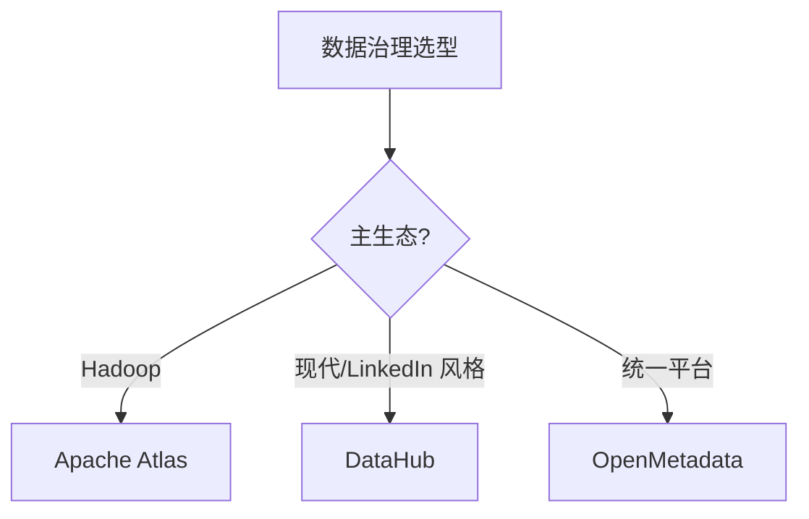

# 07 数据治理

> 一句话定位：**Atlas / DataHub / 数据血缘——元数据、质量、安全三大支柱**

本模块覆盖大数据治理三大支柱：元数据管理（Apache Atlas / DataHub）、数据血缘（Column-Level Lineage）、数据质量（Great Expectations / Deequ）、数据安全（脱敏 / 访问控制 / 审计）。

---

## 1. 本模块覆盖

| 主题 | 状态 | 说明 |
|------|------|------|
| Apache Atlas | 📝 新增 (T13) | 元数据 / 血缘 / Hadoop 集成 |
| DataHub | 📝 新增 (T13) | LinkedIn 开源 / 现代 UI |
| OpenMetadata | 📝 新增 (T13) | 统一元数据 + 质量 |
| 数据血缘 | 📝 新增 (T13) | Column-Level Lineage |
| 数据质量 | 📝 新增 (T13) | Great Expectations / Deequ |

> 速查对比见 [📖 顶层 4.7 治理对比](../../README.md#47-治理对比)

---

## 2. 速查要点

- **元数据三大类型**：技术元数据（表结构）/ 业务元数据（业务含义）/ 操作元数据（血缘）
- **血缘分类**：表级血缘（Table-Level）/ 字段级血缘（Column-Level）
- **数据质量维度**：完整性 / 准确性 / 一致性 / 时效性 / 唯一性
- **数据安全**：分类分级（公开/内部/机密/绝密）+ 访问控制（RBAC/ABAC）+ 脱敏

---

## 3. 选型建议

---

## 4. 与其他模块的关系

- **上游**：所有数据模块（02-06, 08）
- **下游**：被数据分析师 / 合规审计消费
- **横向**：[06 调度](../06-scheduling/)（任务血缘）

---

## 5. 学习建议

- 必学 Atlas 或 DataHub（事实标准之一）
- 推荐路径：元数据建模 → 血缘采集 → 数据质量规则
- 实战：Hive + Atlas 表血缘采集

---

## 6. 数据时效性

- Atlas 2.x（2024 持续维护）
- DataHub 0.x（2025 持续迭代）
- OpenMetadata 1.x（2025 快速演进）

---

## 7. 关键术语

| 术语 | 解释 |
|------|------|
| Atlas | Apache 元数据 + 血缘 |
| DataHub | LinkedIn 现代元数据平台 |
| Lineage | 数据血缘 |
| Column-Level | 字段级血缘 |
| Deequ | Amazon 开源数据质量 |
| RBAC | Role-Based Access Control |
| ABAC | Attribute-Based Access Control |
| GDPR | 欧盟通用数据保护条例 |
