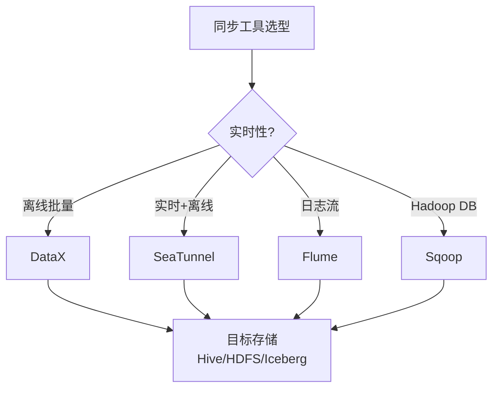

<!--
module:
  parent: big-data
  slug: big-data/sync-tools
  type: index
  category: 主模块子文章
  summary: DataX / SeaTunnel / Sqoop / Flume——异构数据集成与同步
-->

# 08 同步工具

> 一句话定位：**DataX / SeaTunnel / Sqoop / Flume——异构数据集成与同步**

本模块覆盖四大异构数据同步工具：DataX（阿里离线批量）、SeaTunnel（Apache 实时+离线）、Sqoop（DB ↔ Hadoop）、Flume（日志流式采集），对比数据源、实时性、部署模式、适用场景。

---

## 1. 模块导航

| 主题 | 状态 | 说明 |
|------|------|------|
| DataX | ✅ 离线主流 | 阿里开源 / 离线批量 |
| Apache SeaTunnel | ✅ Apache 顶级 | 实时+离线 / Zeta 引擎 |
| Sqoop | ⚠️ EOL 2024 | DB ↔ Hadoop |
| Flume | ⚠️ 停止大版本 | 日志流式采集 |

> 速查对比见 [📖 顶层 4.6 同步对比](../../README.md#46-同步对比)

### 1.1 学习路径

- 新人：从 DataX 入手，掌握 Reader/Writer/Channel/Framework 四件套
- 进阶：SeaTunnel CDC + Zeta 引擎实时同步
- 实战：MySQL → Hive 每日全量 + 增量（DataX + Flink CDC）

---

## 2. 知识脉络



---

## 3. 速查要点

- **DataX 架构**：Reader（数据读取）+ Channel（缓冲）+ Writer（数据写入）+ Framework（调度）
- **SeaTunnel 优势**：Zeta 引擎（自研）+ CDC 支持 + 实时+离线统一
- **Sqoop 适用**：Hadoop 生态内 MySQL/Oracle ↔ HDFS/Hive 批量同步
- **Flume 架构**：Source → Channel → Sink；Agent 多级串联

| 工具 | 数据源 | 实时性 | 部署 | 适用 |
|------|-------|-------|------|------|
| DataX | 异构 DB | 离线批量 | 单机 | TB 级 |
| SeaTunnel | 异构 DB+流 | 实时+离线 | 分布式 | PB 级 |
| Sqoop | DB ↔ Hadoop | 离线批量 | Hadoop 内 | TB 级 |
| Flume | 日志 | 实时流 | 分布式 | 日志采集 |

---

## 4. 核心内容

### 4.1 DataX 实战（MySQL → Hive）

```json
{
  "job": {
    "setting": {
      "speed": {"byte": 1048576, "record": 10000},
      "errorLimit": {"record": 0.02}
    },
    "content": [{
      "reader": {
        "name": "mysqlreader",
        "parameter": {
          "username": "root", "password": "****",
          "connection": [{"jdbcUrl": ["jdbc:mysql://host:3306/source"], "table": ["orders"]}],
          "column": ["id", "user_id", "amount", "dt"],
          "where": "dt >= '${dt}'"
        }
      },
      "writer": {
        "name": "hdfswriter",
        "parameter": {
          "defaultFS": "hdfs://nn:9000",
          "fileType": "orc",
          "path": "/data/hive/ods/orders/dt=${dt}",
          "fileName": "orders",
          "writeMode": "append"
        }
      }
    }]
  }
}
```

### 4.2 SeaTunnel CDC（MySQL → Doris）

```hocon
env {
  execution.parallelism = 8
  job.mode = "STREAMING"
  checkpoint.interval = 10000
}

source {
  MySQL-CDC {
    base-url = "jdbc:mysql://host:3306/source"
    username = "root"
    table-names = ["source.orders", "source.user_profile"]
    startup.mode = "initial"
    debezium = { "snapshot.mode" = "initial" }
  }
}

sink {
  Doris {
    fenodes = "fe1:8030,fe2:8030,fe3:8030"
    username = "root"
    table.identifier = "dwd.orders"
    sink.enable-2pc = true
    sink.label-prefix = "seatunnel_"
  }
}
```

### 4.3 Flume 日志采集

```properties
# Source: TAILDIR 监听日志目录（断点续传）
agent.sources.nginx_source.type = TAILDIR
agent.sources.nginx_source.positionFile = /var/log/flume/taildir_position.json
agent.sources.nginx_source.filegroups.f1 = /var/log/nginx/access.log

# Channel: file channel（持久化）
agent.channels.file_channel.type = file
agent.channels.file_channel.checkpointDir = /var/flume/checkpoint
agent.channels.file_channel.dataDirs = /var/flume/data

# Sink: HDFS 写入
agent.sinks.hdfs_sink.type = hdfs
agent.sinks.hdfs_sink.hdfs.path = hdfs://nn:9000/logs/nginx/dt=%Y-%m-%d/hr=%H
agent.sinks.hdfs_sink.hdfs.rollInterval = 3600
agent.sinks.hdfs_sink.hdfs.rollSize = 134217728
```

### 4.4 Sqoop 实战

```bash
# MySQL → Hive 全量导入
sqoop import \
  --connect jdbc:mysql://host:3306/source \
  --username root --password **** \
  --table orders \
  --hive-import --hive-table ods.orders --hive-overwrite \
  --num-mappers 8 --split-by id

# 增量同步（基于 last-modified）
sqoop import --incremental lastmodified --check-column update_time \
  --last-value "2026-06-25 00:00:00" --merge-key id
```

> 注：Sqoop 已停止大版本更新（2024 EOL），新项目建议 SeaTunnel / DataX。

---

## 5. 最佳实践

| 实践 | 说明 |
|------|------|
| 离线批量 | DataX（MySQL → Hive）+ ORC 压缩 + 并发限速 |
| 实时 CDC | SeaTunnel CDC + Flink CDC（启用 2PC 保证 exactly-once） |
| 日志采集 | Flume TAILDIR Source + File Channel（断点续传） |
| Sqoop | 仅遗留 Hadoop 项目使用；新项目选 SeaTunnel |
| 反模式 | DataX 做实时（最小粒度分钟级）→ 用 Flink CDC / SeaTunnel CDC |

---

## 6. 常见面试题

| 题目 | 核心考点 |
|------|---------|
| DataX 与 Sqoop 区别？ | Reader/Writer 插件 vs MapReduce；单机 vs Hadoop |
| SeaTunnel CDC vs Flink CDC？ | 自研 Zeta vs 计算引擎依赖；运维成本 |
| Flume Source 选什么？ | TAILDIR（断点续传）vs exec tail（无续传） |
| Channel 选 Memory 还是 File？ | Memory（性能高易丢）vs File（持久但慢） |
| CDC 同步如何保证 exactly-once？ | 启用 2PC + Checkpoint + 幂等写入 |
| Sqoop 为何 EOL？ | MapReduce 依赖 + 缺乏 CDC + 社区停滞 |

---

## 7. 与其他模块的关系

- **上游**：所有外部数据源（MySQL/Oracle/Kafka/日志）
- **下游**：被 [01 数仓架构](../01-data-warehouse/) / [04 数据湖](../04-data-lake/) 消费
- **横向**：[06 调度](../06-scheduling/) 触发同步任务

---

## 📊 本节统计

| 维度 | 数字 |
|------|------|
| 子 README 数 | 1（本目录为分类顶层） |
| 二级 leaf README 数 | 0 |
| 四大同步工具 | 4（DataX / SeaTunnel / Sqoop / Flume） |
| 速查对比维度数 | 4（数据源 / 实时性 / 部署 / 适用） |
| 实战配置案例 | 4（DataX MySQL→Hive / SeaTunnel CDC / Flume TAILDIR / Sqoop 增量） |
| 最佳实践条数 | 5 |
| 常见面试题数 | 6 |
| frontmatter 覆盖率 | 1 / 1 = 100% |
| 文末回链覆盖 | 1 / 1 = 100% |

---

← [返回大数据总览](../../README.md)