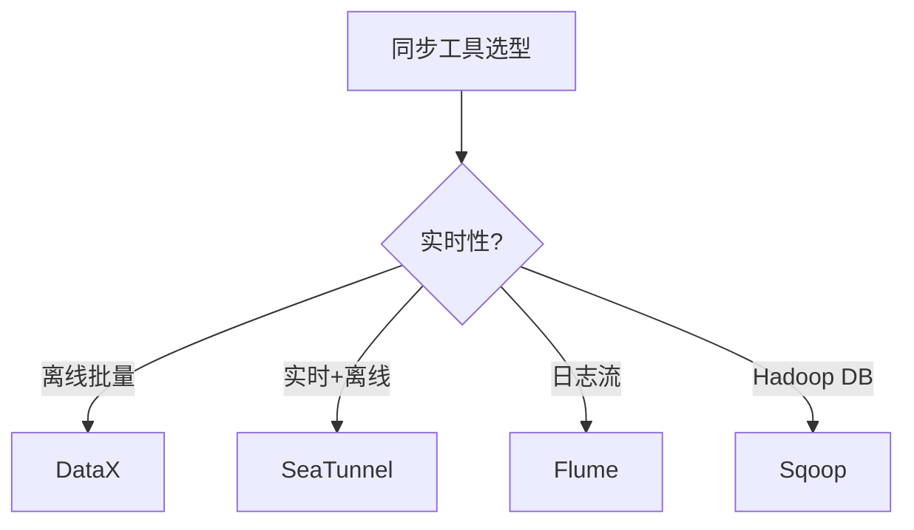
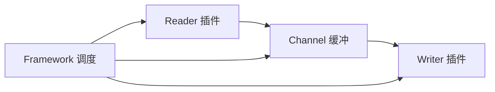
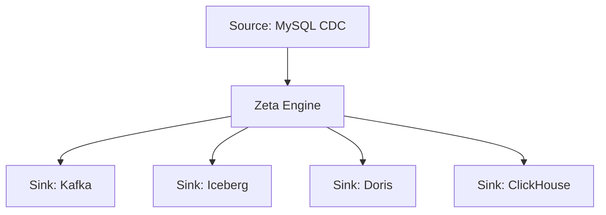
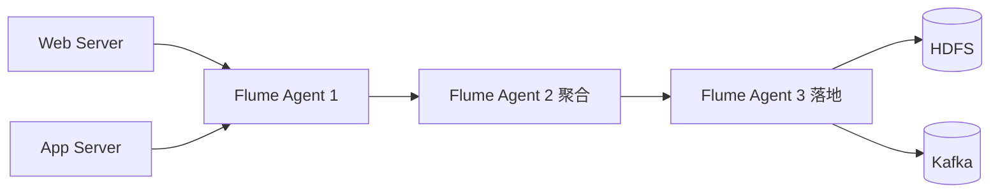

# 08 同步工具

> 一句话定位：**DataX / SeaTunnel / Sqoop / Flume——异构数据集成与同步**

本模块覆盖四大异构数据同步工具：DataX（阿里离线批量）、SeaTunnel（Apache 实时+离线）、Sqoop（DB ↔ Hadoop）、Flume（日志流式采集），对比数据源、实时性、部署模式、适用场景。

---

## 1. 本模块覆盖

| 主题 | 状态 | 说明 |
|------|------|------|
| DataX | 📝 新增 (T13) | 阿里开源 / 离线批量 |
| Apache SeaTunnel | 📝 新增 (T13) | 实时+离线 / 分布式 |
| Sqoop | 📝 新增 (T13) | DB ↔ Hadoop |
| Flume | 📝 新增 (T13) | 日志流式采集 |

> 速查对比见 [📖 顶层 4.6 同步对比](../../README.md#46-同步对比)

---

## 2. 速查要点

- **DataX 架构**：Reader（数据读取）+ Channel（缓冲）+ Writer（数据写入）+ Framework（调度）
- **SeaTunnel 优势**：Zeta 引擎（自研）+ CDC 支持 + 实时+离线统一
- **Sqoop 适用**：Hadoop 生态内 MySQL/Oracle ↔ HDFS/Hive 批量同步
- **Flume 架构**：Source → Channel → Sink；Agent 多级串联

---

## 3. 选型建议



---

## 4. 与其他模块的关系

- **上游**：所有外部数据源（MySQL/Oracle/Kafka/日志）
- **下游**：被 [01 数仓架构](../01-data-warehouse/) / [04 数据湖](../04-data-lake/) 消费
- **横向**：[06 调度](../06-scheduling/) 触发同步任务

---

## 5. 学习建议

- 必学 DataX（离线批量主流）
- 推荐路径：DataX → SeaTunnel → CDC 实时同步
- 实战：MySQL → Hive 每日全量 + 增量

---

## 6. 数据时效性

- DataX 3.x（持续维护）
- SeaTunnel 2.3.x（2025-11）Apache 顶级
- Sqoop 1.4.x（停止大版本更新）
- Flume 1.11.x（停止大版本更新）

---

## 7. 关键术语

| 术语 | 解释 |
|------|------|
| DataX | 阿里开源离线同步框架 |
| SeaTunnel | Apache 实时+离线同步 |
| Sqoop | Apache DB ↔ Hadoop 同步 |
| Flume | Apache 日志流式采集 |
| CDC | Change Data Capture |
| ETL | Extract-Transform-Load |
| Source/Channel/Sink | Flume 三组件 |
| Reader/Writer | DataX 数据读写插件 |

---

## 9. DataX 实战

DataX 是阿里开源的离线数据同步工具，架构：**Reader + Channel（缓冲）+ Writer + Framework（调度）**。插件化设计支持 30+ 数据源。



**MySQL → Hive 全量同步示例**（`job/mysql2hive.json`）：

```json
{
  "job": {
    "setting": {
      "speed": {"byte": 1048576, "record": 10000},
      "errorLimit": {"record": 0.02}
    },
    "content": [{
      "reader": {
        "name": "mysqlreader",
        "parameter": {
          "username": "root", "password": "****",
          "connection": [{"jdbcUrl": ["jdbc:mysql://host:3306/source"], "table": ["orders"]}],
          "column": ["id", "user_id", "amount", "dt"],
          "where": "dt >= '${dt}'"
        }
      },
      "writer": {
        "name": "hdfswriter",
        "parameter": {
          "defaultFS": "hdfs://nn:9000",
          "fileType": "orc",
          "path": "/data/hive/ods/orders/dt=${dt}",
          "fileName": "orders",
          "writeMode": "append"
        }
      }
    }]
  }
}
```

**实战案例**：某电商公司每日凌晨 2 点用 DataX 同步 MySQL 订单库（20 GB）到 Hive ODS 层，配置 32 并发 + ORC 压缩 + 1024 KB 限速，2 小时内完成全量同步。

**反模式**：
- DataX 用于实时同步（离线批量，最小粒度分钟级）—— 正确做法是 Flink CDC / SeaTunnel CDC
- 单 JSON 文件配置过多 Reader/Writer（内存压力）—— 正确做法是拆分多个 job

**性能调优**：`byte` + `record` 限速避免抢占源库 IO；`channel` 数 = `record` / 单 channel 处理能力；启用 ORC/Parquet 列存压缩（Hive 端存储压缩 70%）。

---

## 10. SeaTunnel CDC

Apache SeaTunnel（原 Waterdrop）是国产新一代数据集成平台，**支持实时+离线统一 + CDC + Zeta 引擎**（自研高性能执行引擎）。

**架构**：



**MySQL → Doris 实时 CDC 同步**（`config/v2.batch.conf`）：

```hocon
env {
  execution.parallelism = 8
  job.mode = "STREAMING"
  checkpoint.interval = 10000
}

source {
  MySQL-CDC {
    base-url = "jdbc:mysql://host:3306/source"
    username = "root"
    password = "****"
    table-names = ["source.orders", "source.user_profile"]
    startup.mode = "initial"  # 全量 + 增量
    debezium = {
      "snapshot.mode" = "initial"
    }
  }
}

sink {
  Doris {
    fenodes = "fe1:8030,fe2:8030,fe3:8030"
    username = "root"
    password = "****"
    table.identifier = "dwd.orders"
    sink.enable-2pc = true  # 2PC 事务保证 exactly-once
    sink.label-prefix = "seatunnel_"
  }
}
```

**实战案例**：某零售集团用 SeaTunnel CDC 替代传统 DataX + Sqoop + 自研 binlog 同步工具，单一工具支持 MySQL/PostgreSQL/MongoDB/Kafka/Hive/Iceberg/Doris/ClickHouse 全链路，运维成本下降 50%。

**反模式**：
- SeaTunnel CDC 同步时没启用 2PC（`sink.enable-2pc=false`）—— 故障时可能丢数
- 单一 Zeta job 配过多 source/sink（调度复杂）—— 正确做法是按业务线拆分多个 job

**性能调优**：
- `execution.parallelism=8`（默认 CPU 核数）
- `checkpoint.interval=10000`（10 秒 checkpoint）
- 启用 `sink.enable-2pc=true` 保证 exactly-once

---

## 11. Flume 日志采集

Apache Flume 是 Hadoop 生态的日志流式采集系统，**Source → Channel → Sink** 三段式架构，Agent 多级串联适合大规模日志聚合。



**Flume 配置示例**（`flume-ng.conf`）：

```properties
# Source: TAILDIR 监听日志目录（内置断点续传）
agent.sources.nginx_source.type = TAILDIR
agent.sources.nginx_source.positionFile = /var/log/flume/taildir_position.json
agent.sources.nginx_source.filegroups.f1 = /var/log/nginx/access.log

# Channel: file channel（持久化）
agent.channels.file_channel.type = file
agent.channels.file_channel.checkpointDir = /var/flume/checkpoint
agent.channels.file_channel.dataDirs = /var/flume/data

# Sink: HDFS 写入（按小时滚动）
agent.sinks.hdfs_sink.type = hdfs
agent.sinks.hdfs_sink.hdfs.path = hdfs://nn:9000/logs/nginx/dt=%Y-%m-%d/hr=%H
agent.sinks.hdfs_sink.hdfs.rollInterval = 3600
agent.sinks.hdfs_sink.hdfs.rollSize = 134217728
agent.sinks.hdfs_sink.hdfs.fileType = CompressedStream
agent.sinks.hdfs_sink.hdfs.codeC = gzip
```

**实战案例**：某互联网公司用 3 级 Flume 架构：1000 台 Web 服务器 → 20 台汇聚 Agent → 5 台落地 Agent → HDFS。每天采集 50 TB Nginx 访问日志，每秒峰值 200 万条。

**反模式**：
- Flume Source 用 `exec` + `tail -F`（断点续传靠脚本实现）—— 正确做法是 `TAILDIR` source
- Memory Channel 用于关键日志（内存溢出数据丢失）—— 正确做法是 File Channel 或 Kafka Channel

**性能调优**：`batchSize=1000`（每批处理数）；`channel.transactionCapacity=10000`；File Channel 持久但慢，Memory Channel 性能高但易丢。

---

## 12. Sqoop 实战

Apache Sqoop 是 Hadoop 生态的 **DB ↔ HDFS/Hive/HBase** 批量同步工具，注意 Sqoop 已停止大版本更新（2024 EOL），新项目建议 SeaTunnel / DataX。

```bash
# MySQL → Hive 全量导入
sqoop import \
  --connect jdbc:mysql://host:3306/source \
  --username root --password **** \
  --table orders \
  --hive-import --hive-table ods.orders --hive-overwrite \
  --num-mappers 8 --split-by id

# 增量同步（基于 last-modified）
sqoop import --connect jdbc:mysql://host:3306/source --username root --password **** \
  --table orders --hive-import --hive-table ods.orders \
  --incremental lastmodified --check-column update_time \
  --last-value "2026-06-25 00:00:00" --merge-key id

# Hive → MySQL 导出
sqoop export --connect jdbc:mysql://host:3306/dw --username dw --password **** \
  --table dws_daily_report \
  --export-dir /hive/warehouse/dws.db/daily_report/dt=2026-06-25 \
  --num-mappers 4
```

**实战案例**：某传统金融公司用 Sqoop 完成 MySQL → Hive 的每日全量同步（2 TB 数据，4 小时），`num-mappers=32` 并发提升速度。

**反模式**：
- Sqoop 做实时同步（Sqoop 是离线批量）—— 正确做法是 SeaTunnel CDC / Flink CDC
- 用 Sqoop 同步 MongoDB（无主键 split-by 困难）—— 正确做法是 SeaTunnel MongoDB connector

**性能调优**：`--num-mappers N` 控制并行度；`--split-by` 必须是唯一索引字段（避免数据倾斜）；启用 `--direct`（MySQL 快速模式，跳过 JDBC）。

---

## 13. 学习资源

| 类型 | 资源 |
|------|------|
| 官方文档 | [DataX GitHub Wiki](https://github.com/alibaba/DataX/wiki) |
| 官方文档 | [Apache SeaTunnel Docs](https://seatunnel.apache.org/docs/) |
| 官方文档 | [Apache Flume Docs](https://flume.apache.org/documentation.html) |
| 官方文档 | [Apache Sqoop Docs](https://sqoop.apache.org/docs.html) |
| 书籍 | 《大数据技术体系详解：数据同步》 |
| 实战 | [SeaTunnel Quickstart](https://seatunnel.apache.org/docs/start-v2/locally/quick-start) |
| GitHub | [alibaba/DataX](https://github.com/alibaba/DataX) |
| GitHub | [apache/seatunnel](https://github.com/apache/seatunnel) |
| GitHub | [apache/flume](https://github.com/apache/flume) |
| 博客 | [SeaTunnel Blog](https://seatunnel.apache.org/blog/) |