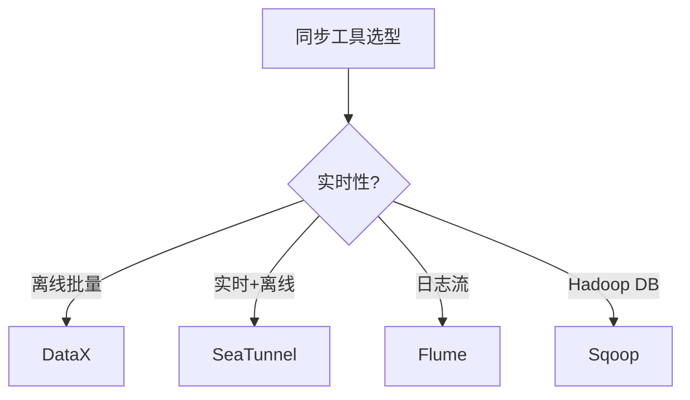

# 08 同步工具

> 一句话定位：**DataX / SeaTunnel / Sqoop / Flume——异构数据集成与同步**

本模块覆盖四大异构数据同步工具：DataX（阿里离线批量）、SeaTunnel（Apache 实时+离线）、Sqoop（DB ↔ Hadoop）、Flume（日志流式采集），对比数据源、实时性、部署模式、适用场景。

---

## 1. 本模块覆盖

| 主题 | 状态 | 说明 |
|------|------|------|
| DataX | 📝 新增 (T13) | 阿里开源 / 离线批量 |
| Apache SeaTunnel | 📝 新增 (T13) | 实时+离线 / 分布式 |
| Sqoop | 📝 新增 (T13) | DB ↔ Hadoop |
| Flume | 📝 新增 (T13) | 日志流式采集 |

> 速查对比见 [📖 顶层 4.6 同步对比](../../README.md#46-同步对比)

---

## 2. 速查要点

- **DataX 架构**：Reader（数据读取）+ Channel（缓冲）+ Writer（数据写入）+ Framework（调度）
- **SeaTunnel 优势**：Zeta 引擎（自研）+ CDC 支持 + 实时+离线统一
- **Sqoop 适用**：Hadoop 生态内 MySQL/Oracle ↔ HDFS/Hive 批量同步
- **Flume 架构**：Source → Channel → Sink；Agent 多级串联

---

## 3. 选型建议

---

## 4. 与其他模块的关系

- **上游**：所有外部数据源（MySQL/Oracle/Kafka/日志）
- **下游**：被 [01 数仓架构](../01-data-warehouse/) / [04 数据湖](../04-data-lake/) 消费
- **横向**：[06 调度](../06-scheduling/) 触发同步任务

---

## 5. 学习建议

- 必学 DataX（离线批量主流）
- 推荐路径：DataX → SeaTunnel → CDC 实时同步
- 实战：MySQL → Hive 每日全量 + 增量

---

## 6. 数据时效性

- DataX 3.x（持续维护）
- SeaTunnel 2.3.x（2025-11）Apache 顶级
- Sqoop 1.4.x（停止大版本更新）
- Flume 1.11.x（停止大版本更新）

---

## 7. 关键术语

| 术语 | 解释 |
|------|------|
| DataX | 阿里开源离线同步框架 |
| SeaTunnel | Apache 实时+离线同步 |
| Sqoop | Apache DB ↔ Hadoop 同步 |
| Flume | Apache 日志流式采集 |
| CDC | Change Data Capture |
| ETL | Extract-Transform-Load |
| Source/Channel/Sink | Flume 三组件 |
| Reader/Writer | DataX 数据读写插件 |