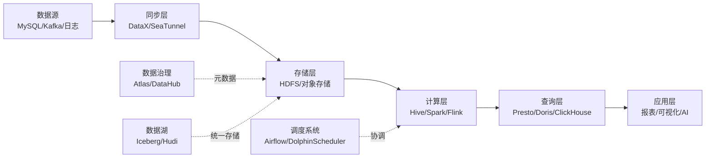

<!--
module:
  parent: note
  slug: big-data
  type: index
  category: 大数据
  summary: 一句话定位：从数仓架构到 OLAP、数据湖、治理——大数据技术栈的完整地图
-->

# 大数据

> 一句话定位：**从数仓架构到 OLAP、数据湖、治理——大数据技术栈的完整地图**
>
> 本章节覆盖大数据领域 8 大主题：数仓架构 / Hadoop 生态 / 实时计算 / 数据湖 / OLAP / 调度 / 数据治理 / 同步工具，是理解现代数据基础设施的全景指南。

---

## 1. 模块导航

| 序号 | 主题 | 核心内容 | 子 README | 学习价值 |
|------|------|---------|-----------|---------|
| 01 | [数仓架构](./01-data-warehouse/) | Lambda / Kappa / 湖仓一体 / 批流融合 | [子入口](./01-data-warehouse/) | 架构选型根因 |
| 02 | [Hadoop 生态](./02-hadoop-ecosystem/) | HDFS / YARN / MapReduce / Hive / Trino | [子入口](./02-hadoop-ecosystem/) | 离线数仓基石 |
| 03 | [实时计算](./03-realtime-compute/) | Flink / Spark Streaming / Storm | [子入口](./03-realtime-compute/) | 毫秒-秒级延迟 |
| 04 | [数据湖](./04-data-lake/) | Apache Iceberg / Hudi / Delta Lake / 存算分离 | [子入口](./04-data-lake/) | 存算分离新范式 |
| 05 | [OLAP](./05-olap/) | Apache Doris / StarRocks / ClickHouse / Trino | [子入口](./05-olap/) | 亚秒级查询 |
| 06 | [调度](./06-scheduling/) | Apache Airflow / DolphinScheduler / Azkaban | [子入口](./06-scheduling/) | 任务编排 |
| 07 | [数据治理](./07-data-governance/) | Apache Atlas / DataHub / 数据血缘 / 数据质量 | [子入口](./07-data-governance/) | 元数据/质量/安全 |
| 08 | [同步工具](./08-sync-tools/) | DataX / Apache SeaTunnel / Sqoop / Flume | [子入口](./08-sync-tools/) | 异构数据集成 |

### 1.1 学习路径

- **新人入门**：01 → 02 → 03 → 06 → 05
- **想做离线数仓**：02 → 01 → 06 → 07
- **想做实时计算**：03 → 01 Kappa → 04 → 05
- **数据架构师**：01 → 02 → 03 → 04 → 05 → 07
- **AI/ML 工程师**：04 → 02 → 07

---

## 2. 知识脉络

---

## 3. 模块覆盖

### 3.1 一级模块分布（8 大主题）

| 主题 | 关键组件 | 适用阶段 |
|------|---------|---------|
| 数仓架构 | Lambda / Kappa / 湖仓一体 | 架构选型 |
| Hadoop 生态 | HDFS / YARN / Hive / Trino | 离线批处理 |
| 实时计算 | Flink / Spark Streaming / Storm | 毫秒-秒级延迟 |
| 数据湖 | Iceberg / Hudi / Delta Lake | 存算分离 |
| OLAP | Doris / StarRocks / ClickHouse | 亚秒级查询 |
| 调度 | Airflow / DolphinScheduler | 任务编排 |
| 数据治理 | Atlas / DataHub / 血缘 / 质量 | 治理合规 |
| 同步工具 | DataX / SeaTunnel / Sqoop | 异构集成 |

### 3.2 选型决策树

| 维度 | 选型 | 推荐 |
|------|------|------|
| 实时性 | T+1 离线 | Lambda / Hive |
| 实时性 | 实时 + 离线并存 | Kappa / Flink |
| 实时性 | 存算分离 / AI | 湖仓一体 / Iceberg |
| 数据规模 | TB 级 | Hive / Spark SQL |
| 数据规模 | PB 级 | Presto / Trino |
| 实时流 | 毫秒级 | Flink |
| 查询模式 | 大宽表 / 明细 | ClickHouse |
| 查询模式 | 多表 JOIN | Doris / StarRocks |
| 查询模式 | 联邦查询 | Trino / Presto |
| 团队规模 | 小团队 | Airflow |
| 团队规模 | 中大团队 | DolphinScheduler |

---

## 4. 速查地图

### 4.1 架构对比

| 架构 | 延迟 | 复杂度 | 成本 | 适用场景 |
|------|------|-------|------|---------|
| Lambda | 秒级 | 高（双链路） | 高 | 实时+离线并存 |
| Kappa | 毫秒级 | 中（单链路） | 中 | 纯实时 |
| 湖仓一体 | 秒级 | 中 | 中 | AI/存算分离 |
| 传统数仓 | T+1 | 低 | 低 | 离线报表 |

### 4.2 计算引擎对比

| 引擎 | 计算模型 | 延迟 | 状态管理 | 适用规模 |
|------|---------|------|---------|---------|
| Flink | 流批一体 | 毫秒 | RocksDB | PB 级流 |
| Spark | 微批 | 秒 | RDD/DataFrame | PB 级批 |
| Storm | 流式 | 毫秒 | 无状态 | 中小流 |
| Hive | 批 | 分钟-小时 | 无 | TB 级批 |

### 4.3 数据湖对比

| 特性 | Iceberg | Hudi | Delta Lake |
|------|---------|------|------------|
| ACID | ✓ | ✓ | ✓ |
| Schema Evolution | ✓ | ✓ | ✓ |
| Time Travel | ✓ | ✓ | ✓ |
| Hidden Partition | ✓ | ✗ | ✗ |
| 主要引擎 | Spark/Flink/Trino | Spark/Flink | Spark |

### 4.4 OLAP 对比

| 引擎 | 架构 | 擅长场景 | JOIN 能力 | 实时写入 |
|------|------|---------|----------|---------|
| Doris | MPP | 大宽表+聚合 | 强 | ✓ |
| StarRocks | CBO MPP | 复杂查询 | 极强 | ✓ |
| ClickHouse | 列存 | 大宽表/明细 | 中 | ✓ |
| Presto/Trino | 协调者 | 联邦查询 | 强 | ✗ |

### 4.5 调度对比

| 系统 | DAG 模型 | 部署 | UI | 学习曲线 |
|------|---------|------|----|---------|
| Airflow 2.x | Python DAG | 中心化 | 强 | 中 |
| DolphinScheduler | YAML DAG | 去中心化 | 强 | 低 |
| Azkaban | 配置文件 | 中心化 | 弱 | 低 |
| Oozie | XML DAG | 中心化 | 弱 | 高 |

### 4.6 同步对比

| 工具 | 数据源 | 实时性 | 部署 | 适用 |
|------|-------|-------|------|------|
| DataX | 异构 DB | 离线批量 | 单机 | TB 级 |
| SeaTunnel | 异构 DB+流 | 实时+离线 | 分布式 | PB 级 |
| Sqoop | DB ↔ Hadoop | 离线批量 | Hadoop 内 | TB 级 |
| Flume | 日志 | 实时流 | 分布式 | 日志采集 |

### 4.7 治理对比

| 工具 | 元数据 | 血缘 | 数据质量 | 部署 |
|------|-------|------|---------|------|
| Apache Atlas | ✓ | ✓ | ✗ | 中心化 |
| DataHub | ✓ | ✓ | ✓ | 去中心化 |
| OpenMetadata | ✓ | ✓ | ✓ | 中心化 |
| Great Expectations | ✗ | ✗ | ✓ | 库集成 |

### 4.8 大数据生态 2026 版本

| 组件 | 最新稳定版 | 发布日期 |
|------|-----------|---------|
| Hadoop | 3.4.x | 2025-12 |
| Spark | 3.5.x / 4.0 | 2025-Q4 |
| Flink | 1.20.x / 2.0-rc | 2025-Q4 |
| Iceberg | 1.5.x | 2025-11 |
| Hudi | 0.15.x | 2025-10 |
| Doris | 2.1.x / 3.0-rc | 2025-Q4 |
| StarRocks | 3.4.x | 2025-12 |
| ClickHouse | 24.x | 2025-Q4 |
| Trino | 0.13.x | 2025-Q4 |
| SeaTunnel | 2.3.x | 2025-11 |

### 4.9 大数据 vs 传统数据库

| 维度 | 传统 OLTP | 大数据 |
|------|---------|--------|
| 数据量 | GB-TB | TB-PB-EB |
| 延迟 | 毫秒 | 秒-分钟 |
| 事务 | ACID | BASE / 最终一致 |
| 查询 | 点查/小范围 | 全表扫描/聚合 |
| 存储 | 行存 | 列存/分区 |

---

## 5. 最佳实践

| 场景 | 实践要点 |
|------|---------|
| **数仓分层** | ODS → DWD → DWS → ADS 四层架构；维度建模（星型/雪花）；SCD Type 1/2/3 |
| **实时计算** | Flink Checkpoint 间隔按业务 SLA 设定；Exactly-Once 需开启 WAL；State Backend 选 RocksDB |
| **数据湖** | Iceberg 优选（ACID + Schema Evolution + Time Travel）；存算分离（S3/OSS + 计算引擎独立扩展） |
| **OLAP 选型** | 高并发点查 → Doris/StarRocks；Ad-hoc 分析 → ClickHouse/Trino；统一分析 → Doris + 物化视图 |
| **数据治理** | Atlas / DataHub 元数据管理；数据血缘自动采集（SQL 解析）；数据质量规则 + 告警 |
| **任务调度** | Airflow Python DAG 灵活但学习曲线高；DolphinScheduler 可视化适合国内团队；关键任务设置 SLA 告警 |

---

## 6. 常见面试题

| 题目 | 核心考点 |
|------|---------|
| Lambda 与 Kappa 的本质区别？ | 双链路 vs 单链路、复杂度、适用场景 |
| Iceberg 隐藏分区原理？ | partition transform 不依赖目录名 |
| Flink Exactly-Once 如何保证？ | Checkpoint + 两阶段提交 + WAL |
| Doris / StarRocks / ClickHouse 怎么选？ | JOIN 复杂度 / 大宽表 / 联邦查询 |
| SeaTunnel CDC 与 Flink CDC 的差异？ | 引擎自研 vs 计算引擎依赖、运维成本 |
| 数据血缘怎么自动采集？ | SQL 解析 / Hook 拦截 / 日志解析 |
| 存算分离的收益与陷阱？ | 弹性伸缩 vs Hive 强耦合 HDFS |

---

## 7. 相关章节

- **上游基础**：[02.computer-basics](../02.computer-basics/README.md)（网络 / Linux / 算法）
- **存储相关**：[03.database](../03.database/README.md)（MySQL / Redis）
- **实时引擎**：与 [06.spring](../06.spring/README.md) 集成（CDC / 实时数仓）
- **应用展示**：[11.ai](../11.ai/README.md)（LLM 训练数据湖 / 实时特征）
- **架构方法**：[04.system-design](../04.system-design/README.md)（分布式 / 高可用）

---

## 8. 开源参考

| 类别 | 项目 |
|------|------|
| 基金会项目 | Apache Hadoop / Spark / Flink / Iceberg / Hudi / Atlas / SeaTunnel |
| Linux 基金会 | Trino（原 PrestoSQL） |
| 独立项目 | ClickHouse / Doris / StarRocks / DataX / Airflow |
| 国内主导 | Doris / StarRocks / SeaTunnel / DataX / DolphinScheduler |
| 数据治理 | DataHub / OpenMetadata / Great Expectations / Deequ |

---

## 📊 本节统计

| 维度 | 数字 |
|------|------|
| 一级模块数 | 8（数仓架构 / Hadoop 生态 / 实时计算 / 数据湖 / OLAP / 调度 / 数据治理 / 同步工具） |
| 二级子 README 数 | 8 |
| 三级 leaf README 数 | 3（flink-vs-spark-streaming / iceberg-vs-delta-vs-hudi / clickhouse-vs-doris-vs-starrocks） |
| 总 README 数 | 12（1 顶层 + 8 分类 + 3 leaf） |
| 速查表数 | 9（4.1 架构 / 4.2 计算 / 4.3 数据湖 / 4.4 OLAP / 4.5 调度 / 4.6 同步 / 4.7 治理 / 4.8 生态版本 / 4.9 大数据 vs OLTP） |
| 学习路径主题数 | 5（新人 / 离线 / 实时 / 架构师 / AI 工程师） |
| 常见面试题数 | 7（顶层）+ 51（8 分类 6/7/7/6/6/6/7/6）= 58 |
| 开源参考项目数 | 5 类（基金会 / Linux / 独立 / 国内主导 / 治理）共 22 条（去重 18 项）|
| frontmatter 覆盖率 | 12 / 12 = 100% |
| 文末回链覆盖 | 12 / 12 = 100% |

---

← [返回笔记目录](../README.md)