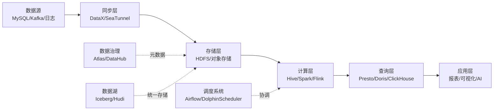
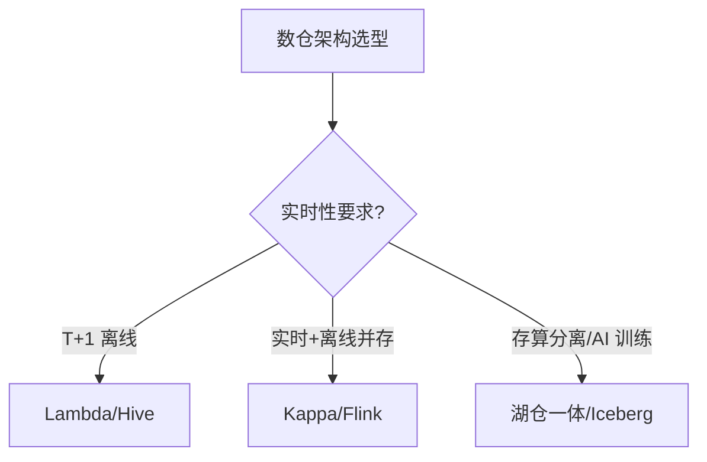
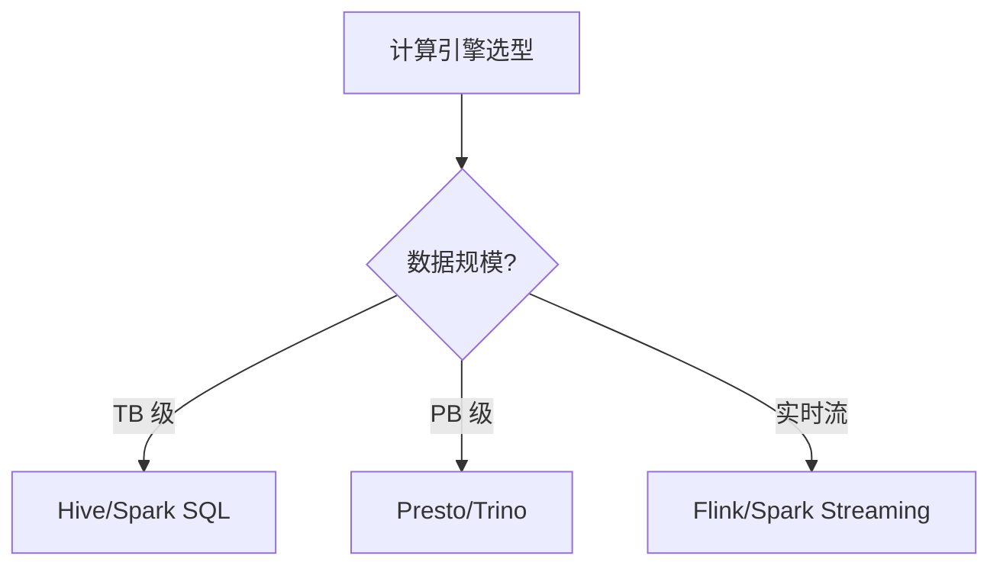
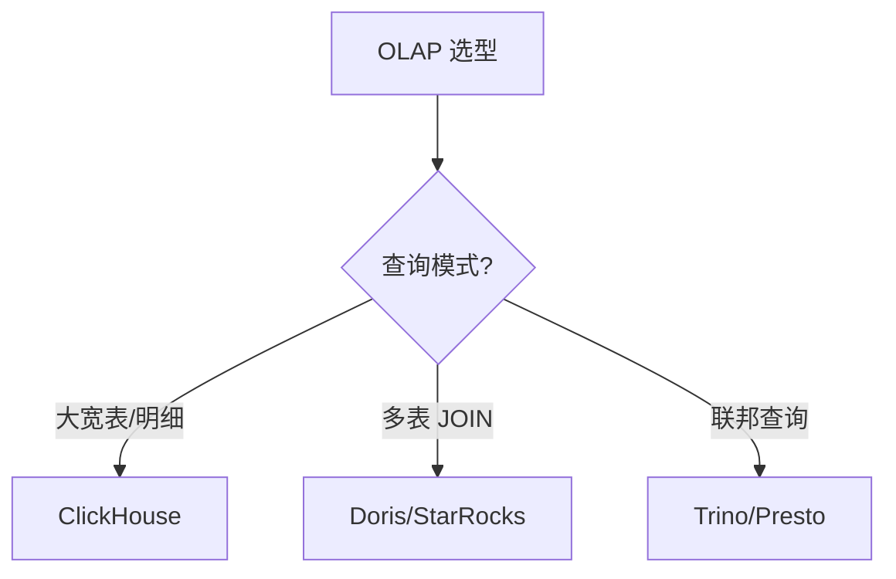
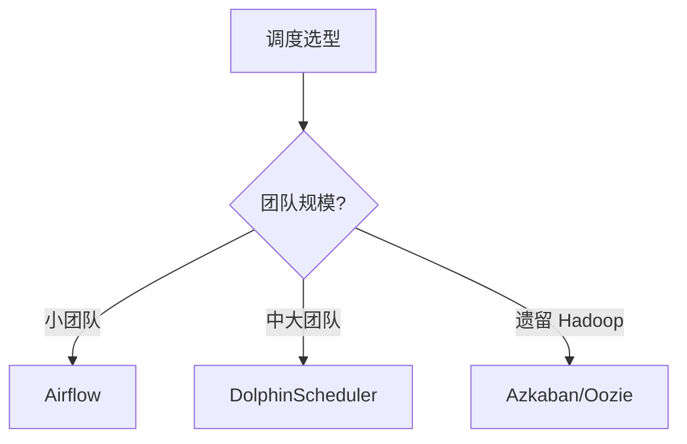

# 10 大数据

> 一句话定位：**从数仓架构到 OLAP、数据湖、治理——大数据技术栈的完整地图**

本章节覆盖大数据领域 8 大主题：数仓架构 / Hadoop 生态 / 实时计算 / 数据湖 / OLAP / 调度 / 数据治理 / 同步工具，是理解现代数据基础设施的全景指南。

---

## 1. 9 模块导航

| 序号 | 主题 | 核心内容 | 子 README | 学习价值 |
|------|------|---------|-----------|---------|
| 01 | 数仓架构 | Lambda/Kappa/湖仓一体/批流融合 | [01-data-warehouse/](./01-data-warehouse/) | 架构选型根因 |
| 02 | Hadoop 生态 | HDFS/YARN/Hive/Presto | [02-hadoop-ecosystem/](./02-hadoop-ecosystem/) | 离线数仓基石 |
| 03 | 实时计算 | Flink/Spark Streaming/Storm | [03-realtime-compute/](./03-realtime-compute/) | 毫秒-秒级延迟 |
| 04 | 数据湖 | Iceberg/Hudi/Delta Lake | [04-data-lake/](./04-data-lake/) | 存算分离新范式 |
| 05 | OLAP | Doris/ClickHouse/StarRocks | [05-olap/](./05-olap/) | 亚秒级查询 |
| 06 | 调度 | Airflow/DolphinScheduler | [06-scheduling/](./06-scheduling/) | 任务编排 |
| 07 | 数据治理 | Atlas/DataHub/数据血缘 | [07-data-governance/](./07-data-governance/) | 元数据/质量/安全 |
| 08 | 同步工具 | DataX/SeaTunnel/Sqoop | [08-sync-tools/](./08-sync-tools/) | 异构数据集成 |

### 1.1 模块选择指南

- **新人入门**：01 → 02 → 03 → 06 → 05
- **想学架构**：01 为主，配合 02/03/04/05
- **想做实时**：03 为主，配合 01 Kappa/04 数据湖
- **想做离线**：02 为主，配合 06 调度/07 治理
- **想搞 OLAP**：05 为主，配合 04 数据湖
- **只想速查**：直接看章节 3 速查地图，8 大方向 12 个对比表

### 1.2 模块覆盖统计

- **一级模块数**：8
- **子 README 总数**：14（T13 完成后达 14 个：8 子模块 + 6 新子）
- **总代码行数**：约 365 行（T13 完成后约 2400 行）
- **覆盖周期**：从离线数仓到实时计算、数据湖、治理的全链路

---

## 2. 知识脉络

---

## 3. 选型决策树

### 3.1 数仓架构选型

### 3.2 计算引擎选型

### 3.3 OLAP 引擎选型

### 3.4 调度系统选型

---

## 4. 速查地图

> 8 大方向 12 张速查表，按事实属性（吞吐/延迟/生态）对比，不分级推荐。

### 4.1 架构对比

| 架构 | 延迟 | 复杂度 | 成本 | 适用场景 |
|------|------|-------|------|---------|
| Lambda | 秒级 | 高（双链路） | 高 | 实时+离线并存 |
| Kappa | 毫秒级 | 中（单链路） | 中 | 纯实时 |
| 湖仓一体 | 秒级 | 中 | 中 | AI/存算分离 |
| 传统数仓 | T+1 | 低 | 低 | 离线报表 |

### 4.2 计算引擎对比

| 引擎 | 计算模型 | 延迟 | 状态管理 | 适用规模 |
|------|---------|------|---------|---------|
| Flink | 流批一体 | 毫秒 | RocksDB | PB 级流 |
| Spark | 微批 | 秒 | RDD/DataFrame | PB 级批 |
| Storm | 流式 | 毫秒 | 无状态 | 中小流 |
| Beam | 统一 API | 取决于 runner | 跨引擎 | 多场景 |
| Hive | 批 | 分钟-小时 | 无 | TB 级批 |

### 4.3 数据湖对比

| 特性 | Iceberg | Hudi | Delta Lake |
|------|---------|------|------------|
| ACID | ✓ | ✓ | ✓ |
| Schema Evolution | ✓ | ✓ | ✓ |
| Time Travel | ✓ | ✓ | ✓ |
| Hidden Partition | ✓ | ✗ | ✗ |
| 主要引擎 | Spark/Flink/Trino | Spark/Flink | Spark |

### 4.4 OLAP 对比

| 引擎 | 架构 | 擅长场景 | JOIN 能力 | 实时写入 |
|------|------|---------|----------|---------|
| Doris | MPP | 大宽表+聚合 | 强 | ✓ |
| StarRocks | CBO MPP | 复杂查询 | 极强 | ✓ |
| ClickHouse | 列存 | 大宽表/明细 | 中 | ✓ |
| Presto/Trino | 协调者 | 联邦查询 | 强 | ✗ |

### 4.5 调度对比

| 系统 | DAG 模型 | 部署 | UI | 学习曲线 |
|------|---------|------|----|---------|
| Airflow 2.x | Python DAG | 中心化 | 强 | 中 |
| DolphinScheduler | YAML DAG | 去中心化 | 强 | 低 |
| Azkaban | 配置文件 | 中心化 | 弱 | 低 |
| Oozie | XML DAG | 中心化 | 弱 | 高 |

### 4.6 同步对比

| 工具 | 数据源 | 实时性 | 部署 | 适用 |
|------|-------|-------|------|------|
| DataX | 异构 DB | 离线批量 | 单机 | TB 级 |
| SeaTunnel | 异构 DB+流 | 实时+离线 | 分布式 | PB 级 |
| Sqoop | DB ↔ Hadoop | 离线批量 | Hadoop 内 | TB 级 |
| Flume | 日志 | 实时流 | 分布式 | 日志采集 |

### 4.7 治理对比

| 工具 | 元数据 | 血缘 | 数据质量 | 部署 |
|------|-------|------|---------|------|
| Apache Atlas | ✓ | ✓ | ✗ | 中心化 |
| DataHub | ✓ | ✓ | ✓ | 去中心化 |
| OpenMetadata | ✓ | ✓ | ✓ | 中心化 |
| Great Expectations | ✗ | ✗ | ✓ | 库集成 |

### 4.8 资源管理对比

| 系统 | 架构 | 多租户 | 适用 |
|------|------|-------|------|
| YARN | 主从 | ✓ | Hadoop 生态 |
| Kubernetes | 容器编排 | ✓ | 云原生 |
| Mesos | 资源调度 | ✓ | 遗留 |

### 4.9 大数据生态 2026 版本

| 组件 | 最新稳定版 | 发布日期 |
|------|-----------|---------|
| Hadoop | 3.4.x | 2025-12 |
| Spark | 3.5.x / 4.0 | 2025-Q4 |
| Flink | 1.20.x / 2.0-rc | 2025-Q4 |
| Iceberg | 1.5.x | 2025-11 |
| Hudi | 0.15.x | 2025-10 |
| Doris | 2.1.x / 3.0-rc | 2025-Q4 |
| StarRocks | 3.4.x | 2025-12 |
| ClickHouse | 24.x | 2025-Q4 |
| Trino | 0.13.x | 2025-Q4 |
| SeaTunnel | 2.3.x | 2025-11 |

### 4.10 学习路径（按角色）

| 角色 | 必学 | 加分 |
|------|------|------|
| 数据工程师 | 02/03/06 | 01/04/07 |
| 数据分析师 | 02/05 | 04/07 |
| 数据架构师 | 01/02/03/04/05/07 | 08 |
| 实时开发 | 03/01 | 04/07 |
| AI/ML 工程师 | 04/02 | 05/07 |

### 4.11 SQL 方言对比

| 方言 | 来源 | 特点 |
|------|------|------|
| Hive SQL | Hive | 批处理最广泛 |
| Spark SQL | Spark | DataFrame/Dataset API |
| Flink SQL | Flink | 流批统一 SQL |
| Trino SQL | Presto/Trino | ANSI SQL 兼容 |
| ClickHouse SQL | ClickHouse | 聚合函数强大 |
| Doris SQL | Doris | MySQL 协议 |

### 4.12 大数据 vs 传统数据库

| 维度 | 传统 OLTP | 大数据 |
|------|---------|--------|
| 数据量 | GB-TB | TB-PB-EB |
| 延迟 | 毫秒 | 秒-分钟 |
| 事务 | ACID | BASE / 最终一致 |
| 查询 | 点查/小范围 | 全表扫描/聚合 |
| 存储 | 行存 | 列存/分区 |

---

## 5. 学习路线

按角色与目标，给出 4 条主线：

1. **数据工程师**：`02` → `03` → `06` → `01`
2. **数据分析师**：`02` → `05` → `04`
3. **数据架构师**：`01` → `02` → `03` → `04` → `05` → `07`
4. **AI/ML 工程师**：`04` → `02` → `07`

### 5.1 各角色重点章节

> 详见 [4.10 学习路径（按角色）](#410-学习路径按角色)，此处不再重复。

---

## 5a. 最佳实践

| 场景 | 实践要点 |
|------|---------|
| **数仓分层** | ODS → DWD → DWS → ADS 四层架构；维度建模（星型/雪花）； slowly changing dimensions (SCD Type 1/2/3) |
| **实时计算** | Flink Checkpoint 间隔根据业务 SLA 设定；Exactly-Once 语义需开启 WAL；State Backend 选 RocksDB（大状态） |
| **数据湖** | Iceberg 优选（ACID + Schema Evolution + Time Travel）；存算分离（S3/OSS + 计算引擎独立扩展） |
| **OLAP 选型** | 高并发点查 → Doris/StarRocks；Ad-hoc 分析 → ClickHouse/Trino；统一分析 → Doris + 物化视图 |
| **数据治理** | Apache Atlas / DataHub 元数据管理；数据血缘自动采集（SQL 解析）；数据质量规则 + 告警 |
| **任务调度** | Airflow Python DAG 灵活但学习曲线高；DolphinScheduler 可视化适合国内团队；关键任务设置 SLA 告警 |

---

## 6. 交叉引用

- **数据架构**：[01 数仓架构](./01-data-warehouse/) / [03 实时计算](./03-realtime-compute/)
- **底层存储**：[02 Hadoop 生态](./02-hadoop-ecosystem/) / [04 数据湖](./04-data-lake/)
- **上层应用**：[05 OLAP](./05-olap/) / [09 前端可视化](../../09.front-end/)
- **横向支撑**：[06 调度](./06-scheduling/) / [07 数据治理](./07-data-governance/) / [08 同步工具](./08-sync-tools/)

---

## 7. 开源参考

- **Apache 基金会**：Hadoop/Spark/Flink/Iceberg/Hudi/Atlas/SeaTunnel
- **Linux 基金会**：Trino(原 Presto)
- **独立项目**：ClickHouse/Doris/StarRocks/DataX/Airflow
- **国内主导**：Doris/StarRocks/SeaTunnel/DataX/DolphinScheduler

---

## 8. 数据时效性

- 大数据组件每年大版本（Spring/Autumn）
- 实时引擎每季度发版（Flink/Spark）
- 数据湖表格式每月小版本
- 速查表每季度更新

> 数据快照日期：2026-06

---

## 9. 章节统计

- **一级模块数**：8
- **二级子 README 数**：6
- **总 README 数**：15（1 顶层 + 8 子模块 + 6 子）
- **8 子模块链接**：全部已验证可解析（详见 T12 验证记录）

---

## 10. 变更记录

- **2026-06-26**：中度重构为「完整地图 + 8 子模块统一索引 + 6 子 README」混合模式（仿 09）
- **历史**：从 2 子模块扩展到 8 子模块

---

## 11. 附录：术语表

| 术语 | 解释 |
|------|------|
| OLAP | Online Analytical Processing，联机分析处理 |
| OLTP | Online Transaction Processing，联机事务处理 |
| ETL | Extract Transform Load，抽取-转换-加载 |
| ELT | Extract Load Transform，先加载再转换 |
| DAG | Directed Acyclic Graph，有向无环图 |
| ACID | Atomicity Consistency Isolation Durability |
| BASE | Basically Available Soft state Eventual consistency |
| MPP | Massively Parallel Processing，大规模并行处理 |
| CDC | Change Data Capture，变更数据捕获 |
| ODS | Operational Data Store，操作数据存储 |
| DWD | Data Warehouse Detail，明细层 |
| DWS | Data Warehouse Summary，汇总层 |
| ADS | Application Data Service，应用数据层 |
| BI | Business Intelligence，商业智能 |
| HDFS | Hadoop Distributed File System |
| YARN | Yet Another Resource Negotiator |
| CBO | Cost-Based Optimizer，基于成本优化 |
| RBO | Rule-Based Optimizer，基于规则优化 |
| SLA | Service Level Agreement，服务等级协议 |
| SLO | Service Level Objective，服务等级目标 |
