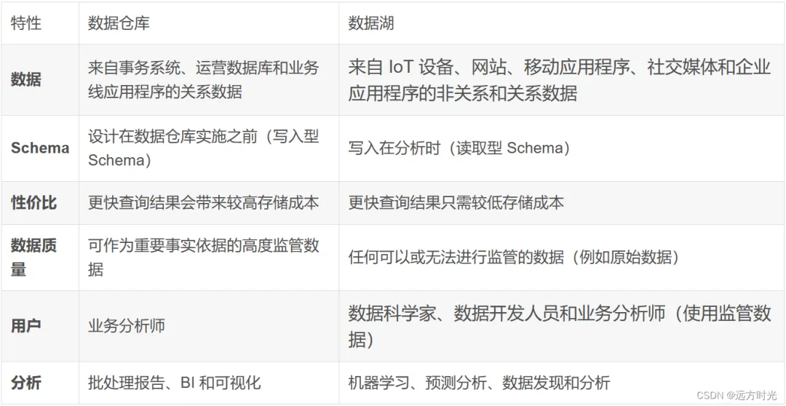

# 数据中台

## 技术发展
### 数据仓库
> 数据仓库是由比尔·恩门在上世纪90年代提出的，他在1991年的书中明确定义了数据仓库的概念。数据仓库是一个面向主题的、集成的、相对稳定的、反映历史变化的数据集合，用于支持管理决策。
### 大数据平台
> 在信息化、新业态的带动下，企业更多、更全的数据被采集和存储，数据量已达到TB、PB甚至EB级规模。 数据量级带来的挑战已不是通过数据仓库模型和传统数据处理技术能解决的了，大数据处理技术应运而生，提供了一套针对海量数据存储、处理和分析的解决方案。
#### [Hadoop](..%2F..%2F09.system-or-design%2F05.hadoop%2FREADME.md)
#### 特点
> - **数据规模巨大**：TB、PB甚至EB级的数据量，远超传统数据仓库的容量限制。
> - **分布式架构**：采用Hadoop生态系统的组件（如HDFS、Hive、Spark、Impala）构建，利用分布式计算和存储能力处理大规模数据。
> - **离线计算和批处理**：大数据平台通过离线计算实现对海量数据的批量处理，适合对数据进行深度分析和长期趋势挖掘。
> - **实时流处理**：随着业务对实时性需求的增加，实时流处理计算方案崛起，以Flink为代表，能够对实时数据进行实时计算和结果响应。
> - **配套技术**：大数据平台还需要与其他技术配合使用，如消息队列（MQ）和Apache Kafka等，用于实时数据的传输和处理。
### 数据中台
> 阿里巴巴在2015年率先提出了“中台”的概念，通过构建“大中台，小前台”的组织和业务体制，让中台能够同时支撑多个业务，并促进业务之间的信息交互和增强。
#### 特点
> - **数据统一和标准化**：数据平台通过数据中台的架构，将不同部门和业务中的数据进行统一管理和标准化，解决了烟囱式数据重复开发、数据标准不统一、业务数据孤岛等问题。数据中台将数据进行抽象、共享和复用，形成全局的管理和规范统一。
> - **数据一体化和整合**：数据平台集成了多个数据源，包括结构化数据、非结构化数据和实时流数据等，通过数据整合和处理，将数据进行加工、清洗和转化，形成质量和准确度较高的数据资产层。这样可以提高数据的利用率和价值，为企业提供高效服务。
> - **数据服务和分析能力**：数据平台不仅提供数据存储和处理能力，还提供数据服务和分析能力。通过数据平台，企业可以快速构建开发数据应用和数据服务，提供给不同业务部门和团队使用。同时，数据平台也提供强大的数据分析和挖掘功能，帮助企业发现数据中的业务价值和洞察。
### 湖仓一体
> 湖仓一体是利用最先进的技术，在数据平台中实现了数据湖和数据仓库的一体化存储。  
> 使用现代格式如Delta Lake、Iceberg、Apache Hudi或Parquet，数据工程师能够高效地存储大量数据集，并支持各种查询、事务和操作。
#### 数据湖和数据仓库的区别

#### 数据湖和湖仓一体的存在的问题
##### 数据湖
> 数据湖是一个，首先能够容纳企业各式各样的，比如结构化、半结构化、非结构化的，未加工的原始数据，这样一个集中式的存储场所。其次数据湖能提供对这些数据进行计算、分析、和结果展示的能力。  
> 这里面最有争议的其实就是它的存储，你要真能满足这些半结构、非结构化数据的「大一统」存储，目前来看，就只有基础的文件系统(比如HDFS、S3这些)。  
> 数据湖技术的软件(Hudi、iceberg、Delta lake、Paimon等)，在使用前需要结构化数据、需要建表  
##### 湖仓一体
> - **湖上建仓**：首选第一个，数据存储跟数据计算，是分开的两个不同软件，数据先存储到这个统一的存储软件里(直接的文件系统、或者上面提到的那些数据湖软件)；然后，利用一些数据库可以配置统一的(区别于本地的磁盘目录)，专门的存储软件的能力(比如HDFS、S3，或者上面提到的那些数据湖软件)，来实现的存储跟计算分离目的。
> - **仓外挂湖**：指的是，原本的数据库它所要的查询的数据，是来自本地磁盘的(就那种正常的，配置本地目录的方式)，但是呢，由于一些数据库支持对外部存储的扩展。所以，这个数据库，它又可以扩展一些对外部存储(比如HDFS、S3，或者上面提到的那些数据湖软件)的计算能力，实现这个存储跟计算分离。
### AI数据中台
> 通过智能化的算法和模型，数据平台能够自动化地运行各种数据处理任务，发现数据中的见解和模式，以及自动优化数据流程和决策过程。

