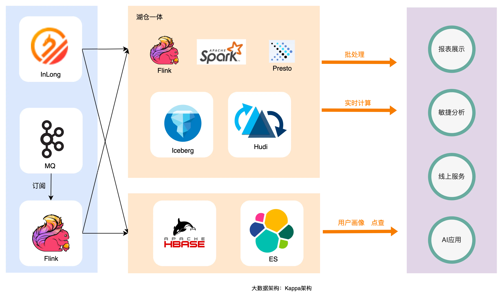

# 离线数仓/实时数仓

## 离线数仓
> 离线数仓是一个用于存储和处理批处理数据的系统，其数据处理和分析是基于批处理作业进行的。离线数仓一般具有以下特点：
> 1. **批处理**：数据在一定时间周期内收集、存储，然后一次性处理。
> 2. **数据时效性**：通常数据的时效性为T+1，即数据在产生后的下一个时间单位（如小时、天）内进行处理。
> 3. **高容量**：设计用于存储大量历史数据。
> 4. **数据存储**：一般将数据存储在如HDFS、Hive等系统中，以支持大规模数据的存储和查询。

## 实时数仓
> 实时数仓是指能够实时地处理和分析数据，确保数据仓库中的数据是最新的、最准确的，并且能够实时响应用户的查询和分析需求的一种数据仓库系统。实时数仓一般具有以下特点：
> 1. **实时性**：能够实时或接近实时地处理数据，通常在秒级或分钟级内完成数据的收集、处理和分析。
> 2. **快速响应**：能够迅速响应用户的查询和分析需求，提供即时的数据支持。
> 3. **高吞吐量**：随着实时技术的发展，实时数仓的数据吞吐量也相对较高。
> 4. **数据存储**：一般将数据存储在如Kafka、HBase、Redis、Clickhouse等系统中，以支持快速的数据读写和查询。

## 对比
|        | 离线数据仓库            | 实时数据仓库         |
|--------|-------------------|----------------|
| 架构     | 离线大数据架构           | Lambda或Kappa架构 |
| 数据模型   | 维度、事实、大宽表、星型、雪花型等 | 宽表、轻度汇总层等      |
| 数据时效性  | T+1               | 实时             |
| 数据处理方式 | 批量处理              | 流式处理           |

## 数仓架构

### 离线大数据架构
> 数据源通过离线的方式导入到离线数据中。下游应用根据业务需求选择直接读取 DM 或加一层数据服务，比如 MySQL 或 Redis。数据仓库从模型层面分为三层：
> 1. **ODS**：操作数据层，保存原始数据；
> 2. **DWD**：数据仓库明细层，根据主题定义好事实与维度表，保存最细粒度的事实数据；
> 3. **DM**：数据集市/轻度汇总层，在 DWD 层的基础之上根据不同的业务需求做轻度汇总；
> 典型的数仓存储是 HDFS/Hive，ETL 可以是 MapReduce 脚本或 HiveSQL。
> 
> 

### Lambda架构
#### Lambda 架构问题

#### 三条路径
> - **批处理层**：负责定期处理全量数据,产生固化的批视图
> - **速率层**：实时处理数据流,提供最新数据增量视图
> - **服务层**：将批处理层和速率层的输出进行合并,对外提供统一的数据访问接口
#### 优势
> 对不同工作负载进行了解耦,使得可以针对不同的处理场景,灵活选择最合适的技术和资源
#### 缺陷
> - **同样的需求需要开发两套一样的代码**：这是 Lambda 架构最大的问题，两套代码不仅仅意味着开发困难（同样的需求，一个在批处理引擎上实现，一个在流处理引擎上实现，还要分别构造数据测试保证两者结果一致），后期维护更加困难，比如需求变更后需要分别更改两套代码，独立测试结果，且两个作业需要同步上线。
> - **资源占用增多**：同样的逻辑计算两次，整体资源占用会增多，多出实时计算这部分。

### Kappa架构
> Lambda 架构虽然满足了实时的需求，但带来了更多的开发与运维工作，其架构背景是流处理引擎还不完善，流处理的结果只作为临时的、近似的值提供参考。后来随着 Flink 等流处理引擎的出现，流处理技术很成熟了，这时为了解决两套代码的问题，LickedIn 的 Jay Kreps 提出了 Kappa 架构。  

> 将所有数据均视为流数据,通过持续不断地重新处理数据流来更新最终的数据视图  
> Kappa 架构可以认为是 Lambda 架构的简化版（只要移除 lambda 架构中的批处理部分即可）。
#### 优点
> 结构简单、易于管理,并且可以确保数据始终保持最新状态
#### 缺陷
> 由于需要持续重新处理全量数据,其对计算资源的需求也相对较高,给基础设施的扩展能力提出了更高要求

## 总结
> 1. 从架构上，实时数仓与离线数仓有比较明显的区别，实时数仓以 Kappa 架构为主，而离线数仓以传统大数据架构为主。Lambda架构可以认为是两者的中间态。
> 2. 从建设方法上，实时数仓和离线数仓基本还是沿用传统的数仓主题建模理论，产出事实宽表。另外实时数仓中实时流数据的join 有隐藏时间语义，在建设中需注意。
> 3. 从数据保障看，实时数仓因为要保证实时性，所以对数据量的变化较为敏感。在大促等场景下需要提前做好压测和主备保障工作,这是与离线数据的一个较为明显的区别。
> 
> 实时数仓主要解决数据时效性问题，结合机器学习框架可以处理实时推荐、实时获取广告投放效果等智能化业务场景。实时数仓的建设应早日提上日程，未来企业对数据时效性的要求会越来越高，实时数仓会很好的解决该问题。

