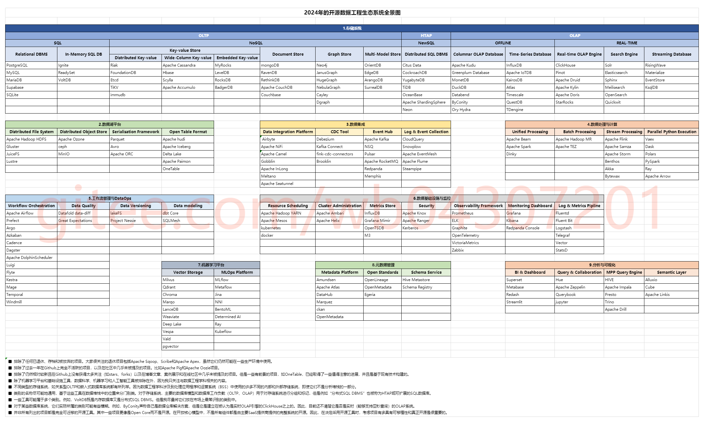
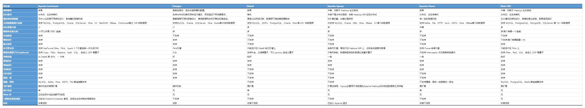
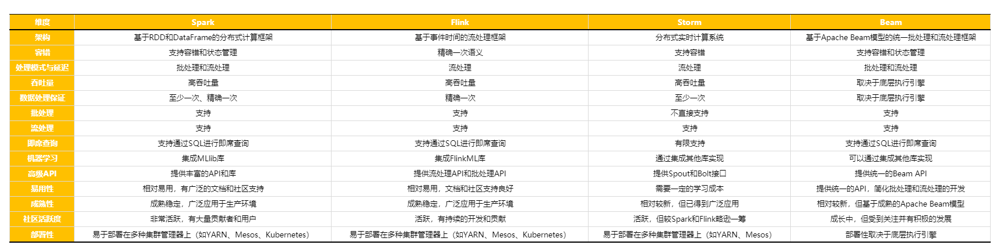

# 2024年的开源数据工程生态系统全景图

## 数据同步

### Apache SeaTunnel
- [ ] 待完善
### Chunju
- [ ] 待完善
### DataX
- [ ] 待完善
### Apache Sqoop
- [ ] 待完善
### Apache Flume
- [ ] 待完善
### FlinkCDC
- [ ] 待完善
### 其他
#### Canal
> Canal是阿里巴巴的一个开源框架，它提供了数据库增量订阅与消费的能力，主要用于解决数据库与缓存、数据库与数据库之间的数据同步问题。
> 基于日志增量订阅和消费的业务包括：
> - 数据库镜像
> - 数据库实时备份
> - 索引构建和实时维护(拆分异构索引、倒排索引等)
> - 业务 cache 刷新
> - 带业务逻辑的增量数据处理
#### Maxwell
> Maxwell伪装成一个MySQL的slave，订阅主库的binlog，然后将变更数据写入到Kafka、RabbitMQ等消息中间件中，实现数据的实时同步。
#### Debezium
> Debezium是一个开源的CDC（Change Data Capture，变更数据捕获）平台，它能够监控数据库中的变化，并将这些变化发布到Kafka等消息队列中。它支持多种数据库，如MySQL、PostgreSQL、MongoDB等。

## 计算框架

### Spark
- [ ] 待完善
#### 机器学习
##### Spark ML
> Spark ML是Spark的机器学习库，旨在使实用的机器学习算法可扩展且易于使用。  
> 它提供了丰富的机器学习算法和工具，可以方便地进行数据处理、模型训练、评估和预测等操作。  
> Spark ML的目标是简化机器学习工作流程，并使得大规模数据的处理和分析变得更为高效。
##### GraphX
> GraphX是Spark面向图计算提供的框架与算法库。  
> 它基于Spark的RDD（弹性分布式数据集）进行了扩展，引入了弹性分布式属性图的概念，并提供了丰富的图计算操作。  
> GraphX允许用户直接利用图计算算法库，也可以根据不同的业务需求开发相应的GraphX应用程序。  
> 图计算模型通常用于对图数据进行分布式存储、并行计算和数据传输，适用于处理具有复杂关联关系的数据。  
### Flink
- [ ] 待完善
### storm
- [ ] 待完善
### Beam
- [ ] 待完善
### 其他
#### Hive
> 基于Hadoop的数据仓库工具，提供SQL接口进行数据查询和分析，适合大规模数据的离线处理。
#### MapReduce
> 用于处理大规模数据集的批处理框架，将数据分成多个部分并行处理，最终合并结果。
#### ClickHouse
> 列式数据库管理系统，提供高速的查询性能，适用于实时数据分析、在线机器学习等场景。
#### Impala
> 基于Hadoop的分布式SQL查询引擎，提供高速的SQL查询性能，适合对大规模数据进行在线分析。
#### Kylin
> 基于Hadoop的开源分布式分析引擎，提供多维分析（OLAP）能力，支持SQL接口和多种可视化工具。

## 存储系统
### 分布式数据库
#### HBase
> 是建立在Hadoop分布式文件系统上的开源列式存储数据库，采用了Google BigTable的稀疏的、面向列的数据库实现方式的理论。
#### Cassandra
> 是一套开源分布式NoSQL数据库系统，最初由Facebook开发，用于储存简单格式数据，具有模式灵活、多数据中心识别、可扩展性强等特点。
#### MongoDB
> 是一个基于分布式文件存储的数据库，由C++语言编写，支持高性能、易部署、存储数据方便、模式自由等特点，并为多种编程语言提供了驱动。
### MPP
#### Doris
##### 介绍及应用场景
> 一个基于 MPP 架构的高性能、实时的分析型数据库，以极速易用的特点被人们所熟知，仅需亚秒级响应时间即可返回海量数据下的查询结果，不仅可以支持高并发的点查询场景，也能支持高吞吐的复杂分析场景  
> Doris的主要应用场景包括大数据实时分析、用户行为分析、日志分析、数据挖掘等，能够帮助企业快速获取业务洞察，做出数据驱动的决策。
##### 优势
> - 与传统的关系型数据库相比，Doris在OLAP场景下有显著的优势。
> - 首先，Doris采用列式存储和向量化执行引擎，能够大大提高查询性能，特别是在处理大规模数据集时。
> - 其次，Doris支持实时数据加载，能够满足业务对实时性的需求。
> - 此外，Doris还具备高并发能力，能够处理大量的并发查询请求。
> - 最后，Doris提供了丰富的数据模型和查询功能，能够满足复杂分析场景的需求。
##### 架构及其关键组件
> - **存储层**：存储层负责数据的持久化存储，采用分布式文件系统来确保数据的高可用性和可扩展性。
> - **计算层**：计算层负责数据的处理和查询执行，采用MPP架构实现并行计算，提高查询性能。
> - **服务层**：服务层则提供了对外服务的接口，包括SQL接口、API接口等，方便用户进行数据查询和管理。
> - **组件**：关键组件包括FE（Frontend，前端节点）负责查询解析和调度，BE（Backend，后端节点）负责数据存储和计算等。
##### 数据的一致性和可靠性
> - **多副本机制**：在存储层，Doris会对数据进行多副本存储，并通过分布式一致性协议（如Raft）来确保副本间数据的一致性。
> - **分布式事务**：在计算层，Doris支持ACID事务，确保在并发操作下数据的正确性。
> - **数据校验**：Doris还会定期对数据进行校验和修复，以防止数据损坏或丢失。
##### 调优
> 通过监控和日志分析定位性能瓶颈所在，可能是存储、计算、网络等方面的问题。
> 根据具体情况进行针对性的调优：
> - 对于存储层，我可以调整数据副本数、分区策略等来优化存储性能。
> - 对于计算层，我可以优化查询语句、调整向量化执行参数等来提升计算性能。
> - 对Doris集群进行扩容或缩容，以适应业务的发展需求。
##### 分片和分发
###### 分片策略
> - 实现数据水平扩展和查询优化的关键手段
> - 数据在写入时，会根据分片键（通常为时间字段）将数据分发到不同的分片中，实现数据的分布式存储。
> - 每个分片可以独立地存储和处理数据，从而提高了整个系统的并发处理能力。
###### 性能影响
> - 合理的分片策略能够确保数据在集群中的均衡分布，避免出现数据倾斜问题，从而提高查询性能。
> - 通过分片，Doris能够支持更细粒度的数据管理和维护操作，如数据的分区删除、备份恢复等，进一步提升了系统的灵活性和可靠性。
> - 分片策略还可以与数据生命周期管理相结合，实现数据的自动归档和清理，降低存储成本。
##### 数据加载
###### 数据导入
> - **批量导入**：批量导入允许用户一次性加载大量数据到Doris中
> - **流式导入**：流式导入则支持持续不断地将新数据追加到系统中
###### 一致性和完整性
> - **导入前**：Doris会对数据进行严格的校验，确保数据格式和内容的正确性。
> - **支持事务性导入**：确保在导入过程中数据的原子性和一致性。
> - **出现错误或中断**：提供回滚机制，将数据恢复到导入前的状态
> - **数据备份和恢复功能**：防止数据丢失或损坏，确保数据的完整性。
##### 扩展性
###### 水平扩展
> - 通过增加更多的节点来扩展集群的计算和存储能力，以满足业务规模增长的需求。
> - 可以通过添加新的BE节点来实现水平扩展，新节点会自动加入到集群中并分担负载。
###### 垂直扩展
> - 通过提升单个节点的性能来增强整个集群的能力。
> - 可以通过升级硬件、优化配置等方式来实现垂直扩展。
##### 数据备份和恢复
###### 备份
> - 定期全量备份
>   - 定期将集群中的所有数据备份到外部存储介质中。
>   - 这种方式可以确保数据的完整性和一致性，但可能会占用较多的存储空间和备份时间。
> - 增量备份
>   - 只备份自上次备份以来发生的数据变更。
>   - 这种方式可以减少备份所需的时间和存储空间，但在恢复时可能需要结合全量备份进行。
###### 恢复
> - 全量备份恢复
>   - 先将集群中的数据清空，然后从备份中恢复所有数据。
> - 增量备份恢复
>   - 将变更数据应用到集群中。
###### 数据校验和修复功能
> - 帮助用户发现并修复数据损坏或丢失的问题。
> - 用户可以定期运行数据校验任务，检查数据的完整性和一致性；
> - 如果发现数据问题，可以使用修复功能进行修复。
##### 发展趋势
> - 进一步提升性能，通过优化算法、改进架构等方式，提高查询速度和处理能力
> - 增强实时分析能力，支持更复杂的实时数据处理和分析场景
> - 加强与其他大数据组件的集成和融合，形成更加完善的大数据解决方案
> - 提高易用性和可维护性，降低用户使用和维护的成本
#### Greenplum
> Greenplum是一个基于PostgreSQL的MPP数据库，它提供了高性能的并行查询能力，支持大规模数据的实时分析和报告。Greenplum的开源版本允许用户进行自定义和扩展，适用于各种大数据场景。
#### ClickHouse
> 虽然ClickHouse主要是列式存储数据库，但它也支持MPP查询处理，适用于实时数据分析场景。ClickHouse以其高性能和简单的查询语言而闻名，适合处理大规模数据。
### 时序
#### InfluxDB
> InfluxDB是一个开源的时序数据库，设计用于处理高度时间相关的数据。它提供了高性能的写入和查询操作，支持灵活的数据模型和标签索引。InfluxDB广泛应用于物联网、监控、应用性能管理等领域。
- [ ] 待完善
#### TimescaleDB
> TimescaleDB是一个构建在关系型数据库PostgreSQL之上的时序数据库扩展。它结合了关系型数据库的功能和时序数据库的性能，提供了强大的时间序列数据处理能力。TimescaleDB支持标准SQL查询，使得数据的访问和分析更加方便。
- [ ] 待完善
#### IoTDB
- [ ] 待完善

## 资源控制
### 任务
#### DolphinScheduler
> DolphinScheduler是一个分布式易扩展的可视化工作流任务调度系统。  
> 它主要用于解决大数据和分布式系统中的任务调度和流程编排问题，支持定时任务、依赖任务、并行任务等多种场景，使得用户可以轻松构建复杂的业务流程。
##### 特性和优势
> - **可视化编排**：提供拖拽式的界面，用户可以直观地设计任务流程。
> - **易扩展性**：支持插件式开发，用户可以根据需要扩展新的任务类型或功能。
> - **高可用性**：采用分布式架构，支持故障转移和负载均衡，确保系统的稳定性和可靠性。
> - **丰富的调度策略**：支持依赖调度、定时调度等多种调度方式，满足不同的业务需求。
> - **强大的监控和告警功能**：可以实时监控任务的执行状态，并在出现异常时及时发出告警。
##### 架构设计和关键组件
> DolphinScheduler的架构设计采用了微服务和分布式的设计理念，主要包括以下几个关键组件：
> - **Master Server**：负责工作流的调度和执行，是系统的核心组件。它接收任务提交的请求，解析工作流定义，并根据调度策略触发任务的执行。
> - **Worker Server**：负责任务的实际执行。它监听Master Server发送的任务执行请求，并根据任务类型调用相应的执行器来执行任务。
> - **API Server**：提供RESTful API接口，供外部系统或用户调用，用于提交任务、查询任务状态等操作。
> - **Registry Center**：用于存储系统的元数据信息和运行时状态，如工作流定义、任务状态、节点状态等。常见的注册中心实现有Zookeeper、Nacos等。
> - **Alert Server**：负责告警通知的发送，可以根据任务执行的状态触发告警，通知相关人员。
##### 高可用性
> - **分布式部署**：通过部署多个Master Server和Worker Server实例，实现系统的水平扩展和容错能力。
> - **故障转移**：当某个Master Server或Worker Server出现故障时，其他节点可以接管其任务，确保任务能够继续执行。
> - **任务重试机制**：对于执行失败的任务，可以设置重试次数和重试间隔，以提高任务的成功率。
> - **监控和告警**：通过监控系统的运行状态和任务执行情况，及时发现并处理潜在的问题，确保系统的稳定运行。
##### 评估性能和稳定性的指标
> - **响应时间**：通过提交大量任务并测量系统的响应时间，可以评估系统处理任务的速度。
> - **吞吐量**：在单位时间内系统能够处理的任务数量，可以反映系统的处理能力。
> - **资源消耗**：监控系统在执行任务过程中的CPU、内存、磁盘等资源使用情况，以评估系统的资源效率。
> - **错误率和故障恢复能力**：通过模拟故障或异常情况，观察系统的错误率和故障恢复速度，以评估系统的稳定性和可靠性。
#### Taier
- [ ] 待完善
#### Tez
- [ ] 待完善
### 硬件
#### k8s
- [ ] 待完善
#### yarn
- [ ] 待完善

## 数据安全
### 隐私保护
#### 数据沙箱
> 构建安全可控的数据环境，实现数据的隔离与隐私保护
> - 与其他技术相比，数据沙箱更注重在数据计算和存储过程中的环境隔离
> - 通过隔离调试环境与运行环境，确保数据的隐私安全
#### 隐私计算
> 在保护数据隐私的前提下实现数据分析计算
> - 隐私计算更侧重于在数据分析和计算过程中保护数据隐私
> - 结合密码学、分布式计算等技术，实现数据的共享和流通
#### 同态加密
> 允许在不解密数据的情况下进行密文计算，得到加密数据的计算结果
> - 同态加密主要关注在加密状态下进行数据处理和分析
> - 广泛应用于金融、电子商务等领域，保护用户数据隐私
#### 差分隐私
> 通过在原始数据中引入随机扰动来保护数据隐私
> - 差分隐私主要关注在数据发布和共享时保护个体隐私
> - 在保护数据隐私的同时，确保数据的准确性和有效性
#### 区块链技术
> 通过去中心化、不可篡改的特性保护数据隐私和安全
> - 区块链技术主要用于构建可信的数据交换和共享平台
> - 广泛应用于数字货币、供应链管理等领域