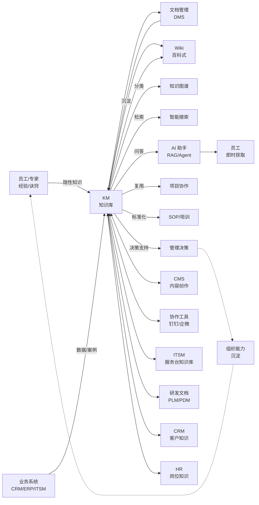
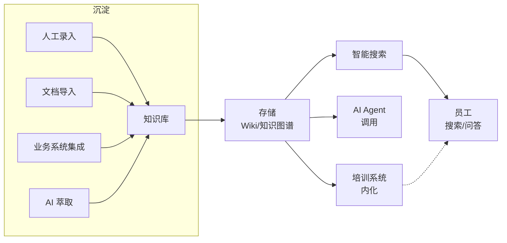
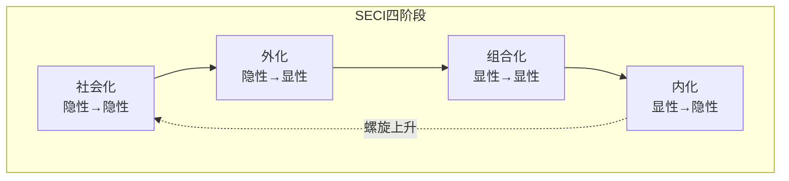
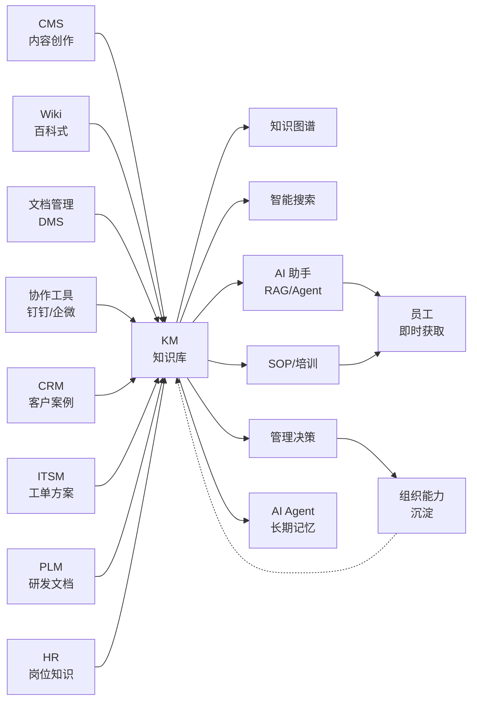

<!--
module:
  parent: application-systems
  slug: application-systems/01-rd-innovation/km
  type: article
  category: 主模块子文章
  summary: KM（Knowledge Management 知识管理）一句话定位：以 Nonaka SECI 模型 + 知识图谱 + 智能搜索 + AI 增强为底座，把企业"显性知识（文档 / 数据 / 流程）+ 隐性知识（经验 / 诀窍 / 客户关系）"沉淀为可搜索 / 可协作 / 可复用 / 可度量 / 可治理的知识资产，是企业从"经验驱动"走向"知识驱动"的操作系统。
  depth: ⭐⭐⭐⭐
-->

# KM（Knowledge Management 知识管理）

> **定位**：KM（Knowledge Management 知识管理）一句话定位：以 Nonaka SECI 模型 + 知识图谱 + 智能搜索 + AI 增强为底座，把企业"显性知识（文档 / 数据 / 流程）+ 隐性知识（经验 / 诀窍 / 客户关系）"沉淀为可搜索 / 可协作 / 可复用 / 可度量 / 可治理的知识资产，是企业从"经验驱动"走向"知识驱动"的操作系统。 的核心原理、实现与最佳实践。

> 一句话定位：以**Nonaka SECI 知识转化模型 + 知识图谱（Knowledge Graph）+ 智能搜索 + AI 增强（RAG / LLM / Agent）**为底座，把企业"**显性知识**（文档 / 数据 / 流程 / 标准）+ **隐性知识**（员工经验 / 客户诀窍 / 最佳实践）"沉淀为**可搜索 / 可协作 / 可复用 / 可度量 / 可治理**的知识资产；是企业从"**经验驱动**（靠老员工）"走向"**知识驱动**（靠系统）"的**操作系统**，解决"**人员流动 = 知识流失 / 同样的问题重复解决 N 次 / 跨部门知识壁垒 / 经验无法规模化**"的根本痛点。

## 📌 全景图

知识管理位于企业 IT 架构中"**知识资产层**"——上游接 CMS（内容创作）/ 文档管理（结构化文档）/ 协作工具（钉钉/企微/飞书）/ 业务系统（CRM/ERP/ITSM）的"知识来源"，横向接 AI 平台（RAG / LLM / Agent）、知识图谱、智能搜索引擎；下游为员工提供"知识获取（搜索 / 问答）"、为项目提供"知识复用（最佳实践 / 模板）"、为决策提供"知识支撑（数据 + 案例 + 专家）"；**本质上是把企业从"人脑记忆"升级为"组织记忆"**。

## 📖 定义

KM（Knowledge Management 知识管理）是企业**有意识地捕获、存储、共享、应用和创新知识资产**的系统化方法与技术体系，包含**显性知识（Explicit Knowledge）**（文档 / 流程 / 数据 / 标准）和**隐性知识（Tacit Knowledge）**（经验 / 诀窍 / 客户关系 / 直觉）的全生命周期管理。

**权威定义参考**：

- **野中郁次郎（Ikujiro Nonaka）SECI 模型（1991 首次提出，1995《创新求胜》The Knowledge-Creating Company 系统化）**：知识在"**社会化（Socialization 隐性→隐性）→ 外化（Externalization 隐性→显性）→ 组合化（Combination 显性→显性）→ 内化（Internalization 显性→隐性）**"四阶段螺旋上升；这是知识管理领域**最权威、最经典**的理论框架
- **APQC（American Productivity & Quality Center 美国生产力与质量中心）**：KM 是"以恰当的成本、在恰当的时间、将恰当的知识传递给恰当的人，使其能做出更有效的决策、采取更有效的行动"——强调"**知识服务化**"
- **Gartner**：KM 是"**企业内容管理（ECM）+ 协作平台 + 知识图谱 + AI 增强**"的综合技术栈，2024 年开始从"传统 Wiki / 文档库"转向"**AI-Native 知识助手**"
- **ISO 30401:2018 知识管理体系**：国际标准化组织发布的**全球首个 KM 体系认证标准**，定义知识管理的"**基础 + 政策 + 战略 + 资源 + 流程 + 绩效 + 改进**"7 大要素
- **中国国家标准 GB/T 34061-2017《知识管理 第 1 部分：框架》**：定义 KM 的**国家术语 + 框架**，与 ISO 30401 兼容
- **Davenport & Prusak《Working Knowledge》（1998）**：知识管理的经典著作，提出"知识 = 经验 + 语境 + 反思"、"知识管理 = 知识获取 + 知识存储 + 知识分发 + 知识应用"

**历史演进**：

- **1991-1995 理论奠基**：野中郁次郎提出 SECI 模型（《哈佛商业评论》1991 年发表《The Knowledge-Creating Company》），奠定知识管理理论基础
- **1995-2000 起步**：美国企业率先成立 CKO（Chief Knowledge Officer 首席知识官）+ KM 部门；Ernst & Young、Arthur Andersen、HP、IBM 等建立 KM 体系；咨询公司主导
- **2000-2005 工具化**：第一代 KM 工具 Lotus Notes / Microsoft SharePoint / Documentum 出现；**重点是"文档存储 + 检索"**（文档管理思维）
- **2005-2010 协作化**：Web 2.0 兴起；**企业 Wiki（MediaWiki / Confluence）** 成为 KM 主入口；Wikipedia 模式被企业采用；中国"知识管理"概念开始流行（华为 / 联想 / 中粮等建立 KM 部门）
- **2010-2015 平台化**：Confluence（Atlassian 2004 创立）/ Notion（2013 创立）/ SharePoint Online 平台化；KM 与**协作 / IM / 社交**深度融合；"知识社区 / 专家网络 / 最佳实践库"概念兴起
- **2015-2020 SaaS 化**：Notion / Confluence Cloud / 语雀（阿里 2016 推出）/ 飞书知识库（字节 2019）/ 腾讯文档 / 钉钉文档等 SaaS 知识库爆发；**中国 KM 市场进入快速成长期**
- **2020-2024 智能化**：AI 增强（NLP 智能搜索 / 自动标签 / 推荐）；**RAG（Retrieval-Augmented Generation 检索增强生成）+ LLM** 让 KM 升级为"**知识助手**"；**Microsoft Copilot / Notion AI / 飞书智能伙伴** 全面集成 AI
- **2025-2026+ Agent 化**：**AI Agent + 知识库** 成为 KM 新形态；Agent 不再"被动搜索"而是"**主动调用**"知识库完成任务；**企业从"知识管理"走向"智能体操作系统（Agent OS）**——KM 是 Agent 的"长期记忆 + 工具集"

**术语边界对比**：

| 系统 / 概念 | 关注点 | 与 KM 的边界 | 典型工具 |
|------|------|---------------|---------|
| **KM（Knowledge Management）** | 显性 + 隐性知识的全生命周期管理 | 本主题 | Confluence / Notion / 语雀 / 飞书知识库 |
| **CMS（Content Management System）** | 内容（文章 / 视频 / 图集）的创作 / 编辑 / 发布 | **业务上游**：CMS 输出"成品内容"给 KM 沉淀；KM 不重复造轮子 | WordPress / Drupal / Strapi |
| **Wiki（百科）** | 百科式协作编辑 + 知识沉淀 | **KM 的核心组件之一**：企业 Wiki 是 KM 的"知识沉淀层"；Confluence / MediaWiki 是 KM 工具 | MediaWiki / Confluence / 语雀 |
| **文档管理（DMS Document Management System）** | 通用文档（合同 / 报告 / 凭证）的存储 + 版本 + 检索 | **业务上游**：DMS 管"通用文档"；KM 管"结构化知识（带分类 / 标签 / 关联）" | SharePoint / Documentum / 致得 E6 |
| **协作工具（Collab Tools）** | IM / 视频会议 / 文档协作 / 团队空间 | **业务上游 / 集成伙伴**：协作工具沉淀"团队记忆"；KM 把协作内容结构化沉淀；二者深度集成 | 钉钉 / 企微 / 飞书 / Slack |
| **ITSM 知识库（Knowledge Base / KEDB）** | IT 服务台知识库（FAQ / SOP / Runbook / KEDB 已知错误库） | **业务下游（IT 域）**：ITSM 的知识库是 KM 在 IT 服务领域的"**垂直应用**"；**KM 通用，ITSM KB 专用** | ServiceNow KB / BMC Remedy / Jira Service Management KB |
| **研发文档（PLM / PDM）** | 产品数据（CAD / BOM / 工程变更） | **业务下游**：研发文档是 KM 在研发领域的"**垂直应用**"；KM 管"通用知识"，PLM 管"产品数据" | Teamcenter / ENOVIA / Windchill |
| **CRM 客户知识** | 客户档案 / 商机 / 沟通记录 / 客户画像 | **业务下游**：客户知识是 KM 在销售领域的"**垂直应用**"；KM 管"组织记忆"，CRM 管"客户记忆" | Salesforce / 纷享销客 / HubSpot |
| **OA / 制度库** | 行政制度 / 流程 / 公告 | **业务上游 / 同级**：制度文档是 KM 的一部分（"显性知识"）；KM 还包括"经验 / 案例 / 专家" | 泛微 / 致远 / 钉钉审批 |
| **培训系统（LMS）** | 课程 / 考试 / 培训计划 / 学习路径 | **业务下游**：LMS 把 KM 沉淀的知识"**转化为培训内容**"；KM 是"知识源"，LMS 是"学习端" | 腾讯课堂 / 网易云课堂 / Cornerstone |
| **知识图谱（Knowledge Graph）** | 实体 / 关系 / 属性的语义网络 | **KM 的核心组件**：知识图谱是 KM 在"AI 时代"的增强；让知识从"文档级"升级到"实体级" | Neo4j / Stardog / 阿里 GraphScope |
| **AI 助手 / RAG** | 基于知识库的问答 / 内容生成 | **KM 的核心组件**：RAG 让 KM 从"被动检索"升级到"主动问答"；是 KM 的"AI 前端" | Microsoft Copilot / Notion AI / 飞书智能伙伴 |

**与各系统的边界详解**（**2025-2026 高频混淆点**）：

- **vs CMS**：CMS 管"**内容生命周期**"（创作 → 编辑 → 审核 → 发布 → 分发 → 数据），强调"对外发布 + 营销转化"；KM 管"**知识生命周期**"（沉淀 → 分类 → 搜索 → 复用 → 创新），强调"对内沉淀 + 协作复用"。**CMS 输出文章给读者，KM 输出知识给员工**。**2025 关键区分**：CMS 的内容往往是"成品（finalized）"，KM 的知识是"持续演化（living）"——知识可以持续更新、评论、引用、重组
- **vs Wiki**：Wiki 是 KM 的"**核心组件**"之一——Wiki 是"百科式协作编辑"的工具形态；KM 是"方法论 + 工具集 + 流程"的体系。**所有 Wiki 都是 KM 工具，但不是所有 KM 都是 Wiki**——KM 还包括知识图谱 / AI 助手 / 专家网络 / 知识社区 / 经验萃取 / 知识运营
- **vs 文档管理（DMS）**：DMS 是"通用文档存储"，强调"**版本 + 权限 + 检索 + 归档**"；KM 是"结构化知识管理"，强调"**分类 + 标签 + 关联 + 场景化推荐 + 隐性知识沉淀**"。**DMS 管"文件"，KM 管"知识"**——一个 PDF 在 DMS 是"文件"，在 KM 是"知识单元（含分类 / 标签 / 关联 / 评论 / 应用记录）"
- **vs 协作工具**：协作工具（钉钉 / 企微 / 飞书）管"实时沟通 + 即时协作"；KM 管"沉淀 + 检索 + 复用"。**协作工具是"沟通工具"，KM 是"记忆工具"**——协作内容（聊天记录 / 文档协作 / 会议纪要）需要"沉淀"到 KM 才能成为组织资产。**2025 趋势**：协作工具与 KM 深度集成（飞书"知识库 + 即时沟通"无缝切换）
- **vs ITSM 知识库**：ITSM 知识库（KB / KEDB）是"**面向 IT 服务台的知识库**"，主要用于"降低重复工单 / 加速问题解决"；KM 是"**企业级知识管理**"。**ITSM KB 是 KM 的一个"垂直领域实例"**；KM 是 ITSM KB 的"母集"——好的 ITSM 知识库需要 KM 方法论支撑
- **vs 研发文档（PLM / PDM）**：PLM / PDM 管"产品数据（CAD / BOM / 工程变更）"，是"**结构化技术资产**"；KM 管"通用知识（文档 / 经验 / 案例 / 制度）"。**PLM/PDM 管"产品数据"，KM 管"组织知识"**——PLM 的图纸 / BOM 可以引用 KM 的"设计规范 / 工艺标准"作为"知识层"
- **vs 培训系统（LMS）**：LMS 是"知识传递"工具（**从知识源到学员**）；KM 是"知识沉淀"工具（**从员工到知识库**）。**LMS 是 KM 的"消费端"**——KM 沉淀的知识可以转化为 LMS 课程；LMS 学员的学习成果又可以沉淀回 KM
- **vs 知识图谱**：知识图谱是 KM 的"**AI 增强组件**"——传统 KM 是"**文档级**"（关键词搜索），知识图谱让 KM 升级到"**实体级**"（关系推理）。**2025 趋势**：知识图谱 + RAG + LLM 形成"**知识中枢**"，是企业 AI 落地的"基础设施"

**KM 不擅长的领域**：通用内容发布（CMS）/ 通用文档存储（DMS）/ 实时沟通（IM）/ 项目管理（PM）/ 客户运营（CRM）/ 产品数据（PLM）/ 财务核算（ERP）/ 代码管理（Git）。

**在企业 IT 架构中的位置**：KM 是企业"**知识资产层**"——上游接 CMS（内容创作）/ 文档管理（结构化文档）/ 协作工具（钉钉 / 企微 / 飞书 / Slack）/ 业务系统（CRM / ERP / ITSM / PLM）的"知识来源"，横向接 AI 平台（RAG / LLM / Agent）、知识图谱、智能搜索引擎；下游为员工提供"知识获取（搜索 / 问答 / 推荐）"、为项目提供"知识复用（最佳实践 / 模板 / 案例）"、为决策提供"知识支撑（数据 + 案例 + 专家）"、为 AI 提供"**长期记忆 + 工具集**"——**KM 是 AI Agent 的"大脑后端"**。Gartner 2024 预测**到 2026 年 60% 的企业 KM 平台集成 AI Agent**，**到 2028 年 KM 平台成为企业 AI 落地的核心基础设施**。

**典型数据量级**：成熟 KM 平台的知识条目数量从**千级（中小企业）到百万级（大型集团）**不等（典型企业 1 万-50 万篇）；活跃用户从百人（基层团队）到万人（集团全员）；KM 平台存储（文档 + 附件 + 历史版本）通常在 **100GB-50TB** 区间。**Notion 全球用户 3000 万+**（2024 年公开数据，覆盖 80%+ 财富 500 强）；**Confluence 全球客户 75000+ 家**（Atlassian 2024 年报）；**语雀服务 200 万+ 用户**（阿里 2024 年公开数据）；**飞书知识库日活 600 万+**（字节 2024 年公开数据）。**2025 行业基准**：头部企业 KM 平台贡献率（知识复用率）≥ 30%（即员工 30% 的工作产出来源于 KM 复用）。

## 🔧 核心能力

**「知识沉淀 + 知识分类 + 知识搜索 + 知识评价 + 知识协作 + 知识安全 + 知识运营 + AI 增强」八大能力**：

- **知识沉淀（Knowledge Capture）**：从多种来源捕获知识——**人工录入（编辑撰写）+ 文档导入（Word/PDF/PPT）+ 业务系统集成（CRM/ITSM 自动同步案例）+ 协作捕获（聊天记录 / 会议纪要 / 邮件）+ AI 萃取（NLP 从非结构化数据提取知识）**
- **知识分类（Knowledge Classification）**：建立知识分类体系（**知识地图** / 主题分类 / 标签 / 业务域 / 知识成熟度 / 知识密级）——常见的分类法：①按业务域（研发 / 生产 / 销售 / HR / 财务 / IT）②按知识类型（流程 / 制度 / 案例 / 模板 / FAQ / 最佳实践 / 经验萃取）③按成熟度（草稿 / 审核 / 发布 / 优秀 / 经典 / 弃用）
- **知识搜索（Knowledge Search）**：基于全文检索 + 语义搜索 + 个性化推荐 + AI 问答（RAG）——搜索引擎质量决定 KM 的"使用率"（搜索命中率 ≥ 40% 是行业基准）
- **知识评价（Knowledge Evaluation）**：评分（点赞 / 点踩 / 5 星）+ 收藏数 + 引用次数 + 应用次数 + 专家评价 + AI 质量评估——形成"知识价值"度量
- **知识协作（Knowledge Collaboration）**：多人协作编辑（实时协同 / 评论 / @提醒 / 版本对比）+ 知识社区（问答 / 讨论 / 专家网络）+ 知识分享会（晨会 / 周会 / 复盘）
- **知识安全（Knowledge Security）**：权限分级（公开 / 部门 / 项目 / 个人）+ 水印 + 下载审计 + 防泄露 + 合规（GDPR / 数据出境 / 行业合规）+ 知识密级（公开 / 内部 / 秘密 / 机密 / 绝密）
- **知识运营（Knowledge Operations）**：知识管理员 / 知识专家 / 知识大使 / 知识积分 / 知识激励 / 知识周报 / 知识度量（命中率 / 贡献数 / 应用率 / 满意度）——**"KM 三分建设，七分运营"**
- **AI 增强（AI Augmentation）**：AI 自动标签 / AI 自动摘要 / AI 自动分类 / AI 问答（RAG）/ AI 推荐 / AI 翻译 / AI 知识图谱构建 / AI Agent 调用——**2025-2026 KM 的最大变革**

**「显性知识 + 隐性知识」双轮管理**（Nonaka SECI 模型）：

KM 不只管"文档"（显性），更重要的是管"**经验**"（隐性）。Nonaka SECI 模型定义了**隐性知识 → 显性知识 → 新隐性知识**的螺旋上升：

**1. 社会化（Socialization 隐性 → 隐性）**：
- **场景**：师徒制 / 经验分享会 / 现场观察 / 咖啡闲聊
- **载体**：师徒带教 / 在岗培训 / 经验萃取工作坊 / 知识咖啡 / 内部专家访谈
- **工具**：视频录制 / 录屏工具 / 知识社区问答
- **难点**：隐性知识**最难捕获**——员工可能"**不知道自己有知识**"或"**知道但说不出来**"；需要"知识萃取师"角色

**2. 外化（Externalization 隐性 → 显性）**：
- **场景**：把员工的"经验 / 诀窍 / 直觉"显性化为"文档 / 流程 / 模板 / 案例"
- **载体**：经验萃取工作坊（结构化访谈 / 复盘 / 反思）/ AI 萃取（NLP 从历史案例提取知识）/ 最佳实践沉淀
- **工具**：知识萃取模板 / 复盘框架 / AI 摘要 / 知识社区
- **难点**：员工**抗拒"分享经验"**（怕"教会徒弟饿死师傅"或"自己不可替代性降低"）；需要激励机制

**3. 组合化（Combination 显性 → 显性）**：
- **场景**：把多个文档 / 案例 / 数据**组合**为新的知识（综合报告 / 知识地图 / 知识图谱）
- **载体**：知识地图 / 知识图谱 / 综合分析报告 / 知识推荐
- **工具**：知识图谱工具 / RAG / 知识可视化
- **难点**：需要"**知识架构师**"角色，把零散知识"**结构化**"

**4. 内化（Internalization 显性 → 隐性）**：
- **场景**：员工**学习**显性知识，转化为自己的隐性能力
- **载体**：培训 / 学习 / 实战演练 / 项目历练
- **工具**：LMS / 培训系统 / AI 学习助手
- **难点**：需要"**学习文化**"支撑，否则"知识进了文档没人看"

**「知识获取 + 知识存储 + 知识分发 + 知识应用 + 知识创新」五阶段生命周期**（APQC 框架）：

**1. 知识获取（Knowledge Acquisition）**：
- 从员工经验萃取 / 业务系统数据 / 外部知识（行业报告 / 最佳实践 / 监管法规）/ 历史文档中**捕获知识**
- 工具：知识萃取工作坊 / 文档导入 / 业务系统集成 / AI 萃取 / RSS 订阅 / 行业知识接入
- 难点：员工**"不愿分享"** + 业务系统数据**"非结构化"** + 外部知识**"无授权"**

**2. 知识存储（Knowledge Storage）**：
- 建立**知识库**——结构化存储 + 分类 + 标签 + 关联 + 版本 + 权限
- 工具：Wiki / 知识库 / 知识图谱 / 数据库 / 文件存储 / 版本管理
- 难点：知识**"分类标准"**难统一（业务域 / 知识类型 / 成熟度三维分类）；**"标签乱用"**（标签爆炸）

**3. 知识分发（Knowledge Distribution）**：
- 把知识**主动推送**给需要的员工——搜索 / 推荐 / 订阅 / 推送 / 知识地图导航
- 工具：智能搜索 / 个性化推荐 / AI 问答（RAG）/ 知识地图 / 知识推送（邮件 / IM / 钉钉企微）
- 难点：搜索命中率低（行业平均 30-40%）/ 推荐不准 / 用户"找不到门"

**4. 知识应用（Knowledge Application）**：
- 员工**实际使用**知识——解决问题 / 做决策 / 创新 / 复盘
- 工具：知识嵌入工作流（CRM/ITSM 推荐知识）/ AI Agent 调用知识 / 项目模板复用
- 难点：知识"**躺在库里没人用**"（应用率 < 20% 是普遍现象）

**5. 知识创新（Knowledge Innovation）**：
- 知识**重组 + 应用 + 反思**产生新知识——创新不是"凭空创造"，而是"**已有知识的重新组合**"
- 工具：知识图谱推理 / AI 知识组合 / 创新工作坊 / 复盘机制
- 难点：需要"**学习型组织**"文化 + "**容忍失败**"环境

**「知识管理员 + 知识专家 + 知识大使」三层组织**（KM 治理结构）：

**1. KM 部门 / KM 委员会（治理层）**：
- **KM 负责人**（CKO 首席知识官 / KM 总监 / 知识管理委员会主席）
- **KM 架构师**：设计知识分类 / 标签 / 关联体系
- **KM 运营经理**：负责 KM 平台运营（活动 / 培训 / 度量）
- **KM 技术经理**：负责 KM 平台技术（搜索 / AI / 集成）
- **规模**：大型企业 KM 部门 5-20 人；中小企业 KM 通常由 IT 或 HR 兼任

**2. 业务领域知识专家（Domain Expert 专家层）**：
- **业务专家**：每个业务域（研发 / 生产 / 销售 / HR / 财务 / IT）指定 1-2 名"知识专家"，负责本业务域知识质量
- **知识审稿人**：知识入库前的"质量把关人"
- **资深员工 / 高级工程师**：作为"知识贡献主力"和"知识权威源"

**3. 知识大使（Knowledge Champion 一线层）**：
- **每个部门 1-2 名**"知识大使"——负责本部门知识沉淀 / 推广 / 培训
- **知识贡献者**：所有员工（每人每年贡献 ≥ N 篇知识）
- **新人 / 实习生**：作为"知识消费者"和"知识反馈者"

**「AI 增强」8 大能力**（2025-2026 KM 最大变革）：

AI 让 KM 从"**被动检索**"升级到"**主动智能**"：

**1. AI 自动标签（Auto Tagging）**：
- **场景**：员工写完文档，AI 自动推荐标签（业务域 / 知识类型 / 主题）
- **能力**：基于 NLP 的文档分类 + 实体识别 + 关键词提取
- **价值**：解决"标签爆炸 / 标签乱用"——员工不用想标签，AI 推荐 3-5 个

**2. AI 自动摘要（Auto Summarization）**：
- **场景**：长文档 AI 自动生成摘要（100-300 字）
- **能力**：基于 LLM 的文档摘要 + 关键信息提取
- **价值**：员工"快速了解文档"——不用读完整篇

**3. AI 自动分类（Auto Classification）**：
- **场景**：文档入库自动归类到知识地图对应位置
- **能力**：基于 NLP 的分类模型（按业务域 / 知识类型 / 成熟度）
- **价值**：解决"知识找不到位置"——AI 推荐分类

**4. AI 问答（RAG Retrieval-Augmented Generation）**：
- **场景**：员工用自然语言提问（"我们公司的差旅政策是什么？"），AI 直接给出答案 + 引用来源
- **能力**：**向量检索 + LLM 生成**——先检索相关文档，再让 LLM 基于检索结果生成答案
- **价值**：从"搜索关键词"升级到"自然语言问答"——降低使用门槛

**5. AI 推荐（Recommendation）**：
- **场景**：员工在 CRM 看到客户档案，AI 自动推荐"相关案例 / 解决方案 / 专家"
- **能力**：基于用户画像 + 场景 + 知识图谱的推荐算法
- **价值**：从"员工主动找"升级到"知识主动找员工"

**6. AI 翻译（Translation）**：
- **场景**：跨国企业 KM 平台自动翻译（中 ↔ 英 ↔ 日 ↔ 韩）
- **能力**：基于 NMT（神经机器翻译）的多语言翻译
- **价值**：跨国企业知识无障碍共享

**7. AI 知识图谱构建（KG Construction）**：
- **场景**：从文档自动抽取实体（人 / 物 / 事件 / 概念）和关系，构建知识图谱
- **能力**：**NER（命名实体识别）+ RE（关系抽取）+ 实体链接**——基于 NLP 的图谱构建
- **价值**：从"文档级 KM"升级到"实体级 KM"——支持推理和发现

**8. AI Agent 调用（Agent Integration）**：
- **场景**：企业 AI Agent（如客服 Agent / 销售 Agent / 研发 Agent）**主动调用 KM 知识库**完成任务
- **能力**：Agent 通过 REST API / MCP（Model Context Protocol）调用 KM
- **价值**：**KM 成为 Agent 的"长期记忆"**——2025-2026 KM 的最大变革，KM 从"工具"升级到"AI 基础设施"

**「知识成熟度分级」**（行业参考框架）：

- **L1 文档化（基础）**：Word/Excel/PPT 散落在共享盘，无统一管理；员工靠"问老员工"找知识
- **L2 知识库化（标准）**：建立 Wiki / 知识库（Confluence / 语雀），有统一分类和搜索；员工开始"主动查知识"
- **L3 结构化（高级）**：建立知识图谱 + 智能搜索 + 个性化推荐；知识与业务系统集成（CRM/ITSM）；员工"知识主动找员工"
- **L4 智能化（卓越）**：AI 全方位增强（RAG / LLM / 自动标签 / 自动摘要 / AI 问答）；知识成为 AI Agent 的"长期记忆"；员工"AI 助手随时回答"
- **L5 生态化（前沿）**：KM 成为企业 AI 基础设施 + 知识生态（跨企业知识共享 / 行业知识图谱）；KM 驱动业务创新

按企业关注度排序，KM 最常被列为「核心采购理由」的前 5 项是：**统一知识沉淀**（告别共享盘散落）、**降低重复劳动**（不让员工重复解决 N 次）、**加速新人培养**（缩短上手周期 30-50%）、**经验萃取**（避免人员流动 = 知识流失）、**AI 基础设施**（为 AI Agent 提供长期记忆）。

## 📊 关键模块详解

### 知识沉淀模块（Knowledge Capture）

知识沉淀是 KM 的"**入口**"——没有沉淀就没有 KM：

- **沉淀来源**：
  - **人工录入**：员工在 KM 平台撰写（Word/富文本/Markdown）
  - **文档导入**：批量导入历史 Word/PDF/PPT/Excel
  - **业务系统集成**：CRM 客户案例 → KM 案例库；ITSM 工单解决方案 → KM FAQ；PLM 工程变更 → KM 设计规范
  - **协作捕获**：钉钉/企微聊天记录 → AI 萃取；会议纪要 → KM 文档；邮件附件 → KM 文档
  - **AI 萃取**：NLP 从非结构化数据自动提取知识（案例 / FAQ / 最佳实践）
  - **外部知识**：行业报告 / 监管法规 / 学术论文（需授权）
- **沉淀方式**：
  - **结构化模板**：每个知识类型有专用模板（案例模板 / FAQ 模板 / SOP 模板 / 经验萃取模板）
  - **AI 辅助写作**：AI 根据标题 / 提纲自动生成文档初稿
  - **协作编辑**：多人实时协同（飞书 / Notion / 语雀 / Confluence）
  - **版本管理**：所有修改留痕（Git-like 版本历史）
- **沉淀激励**：
  - **积分制**：贡献知识获积分，积分换奖励
  - **排名制**：部门 / 个人知识贡献榜
  - **表彰制**：年度"知识之星"评选
  - **应用反馈**：知识被引用 / 应用时给贡献者"应用积分"
- **核心难点**：员工"**不愿写**"（忙 / 不会写 / 怕分享）——需要激励 + 培训 + AI 辅助 + 简化模板
- **2025 趋势**：**AI 自动沉淀**——从聊天记录 / 会议 / 工单 / 邮件 AI 自动萃取知识候选，员工只需"审核 + 完善"

### 知识分类模块（Knowledge Classification）

知识分类是 KM 的"**骨架**"——好的分类让知识"**找得到**"：

- **分类法（Taxonomy）**：
  - **业务域分类**：研发 / 生产 / 销售 / HR / 财务 / IT / 行政 / 法务
  - **知识类型分类**：流程 / 制度 / 案例 / 模板 / FAQ / 最佳实践 / 经验萃取 / 培训资料
  - **主题分类**：具体业务主题（如"差旅政策" / "新员工入职" / "客户投诉处理"）
  - **成熟度分类**：草稿 / 审核中 / 已发布 / 优秀 / 经典 / 弃用
  - **密级分类**：公开 / 内部 / 秘密 / 机密 / 绝密
- **标签（Tag）**：
  - **自动标签**：AI 推荐标签（基于 NLP 文档分析）
  - **手动标签**：员工自选标签
  - **专家标签**：知识专家审核补充标签
  - **标签治理**：标签库管理（去重 / 同义词 / 层级）
- **知识地图（Knowledge Map）**：
  - **概念层**：知识主题分类树（如"研发 → 产品设计 → CAD 使用 → SolidWorks 入门"）
  - **应用层**：知识应用场景地图（"新员工 → 入职第 1 周 → 看哪些知识"）
  - **专家层**：专家 → 知识领域映射（"李工 → 工艺设计"）
- **知识图谱（Knowledge Graph）**：
  - **实体**：人 / 物 / 事件 / 概念 / 文档
  - **关系**：属于 / 引用 / 相关 / 创作 / 应用
  - **属性**：时间 / 标签 / 密级 / 评分
  - **应用**：关系推理 / 智能问答 / 知识发现
- **核心难点**：分类标准难统一（业务 vs 技术 vs 管理 视角不同）；标签爆炸（员工乱打标签）

### 知识搜索模块（Knowledge Search）

知识搜索是 KM 的"**门面**"——搜索体验决定 KM 使用率：

- **搜索能力**：
  - **全文检索**：基于 Elasticsearch / Solr / Meilisearch 的关键词检索
  - **语义搜索**：基于向量检索（Embedding）的语义匹配（"差旅" 搜到"出差" / "公出"）
  - **知识图谱搜索**：基于实体的搜索（搜"李工"返回他写的所有知识 + 涉及的客户 + 应用的项目）
  - **AI 问答**：RAG（检索增强生成）——自然语言提问 → 检索相关文档 → LLM 生成答案 + 引用
- **搜索增强**：
  - **自动补全**：输入时实时推荐关键词
  - **拼写纠错**：自动纠正拼写错误（"差旅" 纠错为"差旅"）
  - **同义词扩展**："差旅" ↔ "出差" / "公出" / "公务出行"
  - **个性化排序**：基于用户画像（部门 / 岗位 / 历史行为）的个性化排序
  - **场景化推荐**：在 CRM / ITSM / 项目管理界面推荐相关知识
- **搜索质量指标**：
  - **召回率（Recall）**：相关文档被搜到的比例（≥ 80% 是行业基准）
  - **准确率（Precision）**：搜到的文档中相关比例（≥ 60% 是行业基准）
  - **NDCG**：排序质量指标
  - **首位命中率**：用户在前 3 条结果中找到答案的比例（≥ 40% 是行业基准）
  - **0 结果率**：搜索"无结果"的比例（< 10% 是行业基准）
- **核心难点**：搜索质量差（搜不到想要的）→ 员工"失去信心" → 回到"问老员工"模式
- **2025 趋势**：**AI 问答（RAG）成为 KM 搜索的"默认入口"**——员工不再"搜索关键词"，而是"提问"

### 知识评价模块（Knowledge Evaluation）

知识评价是 KM 的"**质量保障**"——评价让知识"**优胜劣汰**"：

- **评价维度**：
  - **质量评价**：点赞 / 点踩 / 5 星评分 / 评论
  - **数量度量**：阅读数 / 收藏数 / 引用数 / 下载数
  - **应用度量**：被引用次数 / 被项目应用次数 / 被 AI Agent 调用次数
  - **专家评价**：专家点评 / 专家推荐 / 专家认证
  - **AI 评价**：AI 自动评分（完整性 / 时效性 / 准确性）
- **评价机制**：
  - **用户评价**：所有员工可评分 / 评论
  - **专家评价**：知识专家定期审核 + 评分
  - **AI 评价**：AI 自动评估文档质量（完整性 / 过时检测 / 错别字）
  - **投票**：热门 / 经典 / 推荐知识（基于评价的"排行榜"）
- **评价应用**：
  - **排行榜**：热门知识 TOP 100 / 经典知识榜 / 专家榜
  - **推荐**：基于评价的"猜你喜欢"
  - **淘汰**：低分知识自动标记为"过时" / "需更新" / "待审核"
  - **激励**：高分知识贡献者获积分 / 表彰
- **核心难点**：评价"主观性强"（同一文档有人打 5 星有人打 1 星）；员工"懒得评价"

### 知识协作模块（Knowledge Collaboration）

知识协作是 KM 的"**活力源泉**"——没有协作，KM 变成"**文档坟场**"：

- **协作编辑**：
  - **实时协同**：多人同时编辑同一文档（Notion / 飞书 / 语雀的标志性能力）
  - **评论 / @提醒**：行内评论 / @同事 / 邮件通知
  - **版本管理**：所有修改留痕（类似 Git），可对比 / 回滚 / 合并
  - **分支 / 合并**：基于分支的知识协作（类似 Git flow）
- **知识社区**：
  - **问答**：员工提问 / 回答（类 Stack Overflow / 知乎模式）
  - **专家网络**：每个领域指定"专家"，员工可@专家求教
  - **讨论组**：围绕知识主题的讨论组
  - **排行榜**：贡献榜 / 解答榜 / 采纳榜
- **知识分享会**：
  - **晨会分享**：每日 10 分钟知识分享
  - **周会复盘**：每周复盘 + 知识沉淀
  - **月度分享会**：月度"知识咖啡" / "最佳实践分享"
  - **年度大会**：年度"知识峰会" / "知识之星"颁奖
- **核心难点**：协作"不活跃"（没人提问 / 没人回答 / 没人分享）——需要"种子用户" + 激励机制 + 领导带头

### 知识安全模块（Knowledge Security）

知识安全是 KM 的"**底线**"——泄露 = 核心竞争力外泄：

- **权限管理**：
  - **RBAC（角色权限）**：按角色（管理员 / 专家 / 普通员工 / 外包 / 客户）分配权限
  - **ABAC（属性权限）**：基于属性（部门 / 项目 / 密级）的细粒度权限
  - **数据权限**：按行 / 列 / 字段的权限控制（如"只能看自己部门的客户案例"）
  - **功能权限**：读 / 写 / 删 / 分享 / 下载 / 导出的权限分离
- **密级管理**：
  - **密级定义**：公开 / 内部 / 秘密 / 机密 / 绝密（5 级）
  - **密级标识**：文档密级标签 + 强制水印 + 阅读留痕
  - **密级审批**：高密级文档需审批后发布
  - **密级降级 / 升级**：定期复核密级是否合理
- **防泄露**：
  - **水印**：阅读 / 下载时强制水印（含员工姓名 / 时间 / IP）
  - **防截图**：移动端 / PC 端防截屏 / 防录屏
  - **审计日志**：所有操作留痕（谁 / 何时 / 做了什么）
  - **下载控制**：限制下载次数 / 时效 / 设备
- **合规**：
  - **GDPR（欧盟通用数据保护条例）**：个人数据删除 / 匿名化
  - **数据出境**：跨境数据传输合规（中国《数据出境安全评估办法》/ 欧盟 GDPR）
  - **行业合规**：金融 / 医疗 / 政府 / 军工的行业特殊合规
- **核心难点**：权限"过严"导致"知识不流动"——权限"过松"导致"知识泄露"；需要"**精细化权限**"

### 知识运营模块（Knowledge Operations）

知识运营是 KM 的"**持续动力**"——"**KM 三分建设，七分运营**"：

- **运营组织**：
  - **KM 部门 / KM 委员会**（5-20 人）：负责 KM 战略 + 平台 + 运营
  - **业务知识专家**（每业务域 1-2 名）：负责业务域知识质量
  - **知识大使**（每部门 1-2 名）：负责部门知识推广 + 培训
- **运营活动**：
  - **新人 KM 培训**：新员工入职 KM 平台培训（1-2 小时）
  - **月度知识评选**：月度"最佳知识" / "知识贡献者"评选
  - **季度知识大会**：季度知识分享会 + 复盘
  - **年度知识峰会**：年度"知识之星"颁奖 + 最佳实践分享
  - **运营周报 / 月报**：KM 平台数据周报 / 月报（贡献数 / 应用数 / 满意度）
- **运营激励**：
  - **积分制**：贡献知识 / 评价 / 分享获积分 → 换礼品 / 换培训
  - **排行榜**：个人榜 / 部门榜 / 业务域榜
  - **表彰**：年度"知识之星" / "知识大使" / "知识专家"
  - **晋升关联**：高级岗位晋升与"知识贡献"挂钩（华为 / 阿里实践）
- **运营指标**：
  - **覆盖度**：知识条目数 / 业务覆盖度（≥ 80% 业务有知识）
  - **贡献度**：月均贡献数 / 活跃贡献者比例（≥ 30% 员工月度贡献 ≥ 1 篇）
  - **应用度**：月均引用数 / 月均阅读数 / 命中率（≥ 40%）
  - **满意度**：用户满意度（≥ 4 / 5 分）
  - **AI 度**：AI 问答命中率 / AI 自动标签准确率（≥ 70%）
- **核心难点**：运营"断档"（初期热闹，3-6 个月后冷场）——需要"持续运营" + "领导带头" + "激励机制"

### AI 增强模块（AI Augmentation）

AI 增强是 KM 的"**未来引擎**"——2025-2026 KM 最大变革：

- **AI 自动标签 / 分类 / 摘要**（基础 AI 能力）：
  - **NLP 模型**：BERT / GPT / 国产大模型（通义 / 文心 / 混元 / 智谱）
  - **能力**：文档分类 / 实体识别 / 摘要生成 / 关键词提取
  - **准确率**：80-90%（标准文档）/ 70-85%（专业领域）
- **AI 问答（RAG 检索增强生成）**：
  - **架构**：用户问题 → 向量化 → 向量检索 → 召回 Top-K 文档 → LLM 生成答案 + 引用
  - **工具**：LangChain / LlamaIndex / Haystack / 阿里 DashScope / 百度千帆
  - **挑战**：幻觉（Hallucination）/ 检索不准 / 答案不权威
- **AI 推荐**：
  - **场景化推荐**：CRM 客户档案推荐"相似案例" / ITSM 工单推荐"解决方案" / 项目管理推荐"最佳实践"
  - **算法**：协同过滤 + 内容推荐 + 知识图谱推荐
  - **挑战**：冷启动（无历史行为）/ 长尾知识推荐
- **AI 翻译**：
  - **多语言 KM**：跨国企业 KM 平台多语言支持
  - **工具**：DeepL / Google Translate / 国产翻译模型
- **AI 知识图谱构建**：
  - **自动抽取**：从文档自动抽取实体（人 / 物 / 事件 / 概念）和关系
  - **实体链接**：把抽取的实体链接到知识图谱已有实体
  - **挑战**：实体消歧（同名实体不同含义）/ 关系准确率
- **AI Agent 调用（KM as Agent Backend）**：
  - **架构**：企业 AI Agent → REST API / MCP（Model Context Protocol）→ KM 知识库
  - **能力**：Agent 主动"检索知识" / "提问知识" / "写入知识"
  - **场景**：客服 Agent 查 KM 回答客户问题 / 销售 Agent 查 KM 推荐方案 / 研发 Agent 查 KM 参考设计
  - **2025-2026 趋势**：**KM 成为 Agent 的"长期记忆 + 工具集"**——Gartner 预测 2026 年 60% 企业 KM 集成 Agent

## 🏆 选型决策

### 国际 vs 国内对比

| 厂商 | 总部 | 定位 | 优势 | 劣势 | 适用规模 |
|------|------|------|------|------|---------|
| **Confluence** | 澳大利亚（Atlassian） | 全球企业 Wiki 龙头 | **全球第一**（客户 75000+ 家/Seat 市占率第一）/ 与 Jira 深度集成（研发团队首选）/ 模板丰富 / 插件市场完善（Atlassian Marketplace 5000+ 插件）/ API 完善 | **贵**（人均 50-200 美元/年）/ 移动端弱 / 中文搜索体验一般 / 需要本地化部署（数据中心） | 跨国集团 / 研发团队 / 中大型企业 |
| **Notion** | 美国（旧金山） | 一体化工作空间（Wiki + 数据库 + 项目） | **All-in-One**（Wiki + Database + Project + Doc 一体化）/ 块编辑器体验极佳 / AI 集成领先（Notion AI）/ 全球用户 3000 万+ / 80%+ 财富 500 强使用 | **企业级治理弱**（权限 / 审计 / 合规不够强）/ 国内访问慢 / 跨境合规风险 | 互联网 / 科技公司 / 创业团队 / 中小型企业 |
| **SharePoint** | 美国（微软） | 微软生态 KM | **与 Office 365 深度集成**（Word/Excel/PowerPoint 一键保存）/ 企业级权限 / Microsoft Copilot AI 集成 / 跨国合规强 | **UX 体验传统**（vs Notion 落后一代）/ 配置复杂 / 实施周期长 | 跨国集团 / 已用 Microsoft 365 的企业 / 政府 |
| **语雀** | 中国（阿里） | **国内知识库龙头** | **国内市占率领先**（服务 200 万+ 用户）/ 阿里生态集成（钉钉 / 阿里云）/ 中文搜索体验佳 / 文档质量高 / 团队空间 + 个人空间 / 公开知识库 | 国际化弱 / 企业级治理中等 / 缺少复杂权限 | 国内中大型企业 / 互联网 / 阿里生态 |
| **飞书知识库** | 中国（字节） | 字节系一体化协作 + KM | **飞书一体化**（知识库 + 即时沟通 + 视频会议 + 文档 + 表格无缝切换）/ 字节实践沉淀（10 万+ 员工 KM）/ 智能伙伴 AI / 中文搜索优秀 | 字节生态外集成一般 / 第三方系统集成弱 | 互联网 / 科技公司 / 字节生态 / 创新企业 |
| **腾讯文档 + 知识库** | 中国（腾讯） | 腾讯生态协作 | 微信生态集成（小程序 / 企业微信）/ 多人实时协作 / AI 辅助 | KM 专业度弱（vs 语雀 / Confluence）/ 企业级治理弱 | 中小企业 / 腾讯生态 / 协同场景 |
| **钉钉文档** | 中国（阿里） | 钉钉一体化 | **钉钉深度集成**（审批 / 聊天 / 文档无缝）/ 阿里通义 AI / 中小企业友好 | 专业度弱 / 大型项目不如语雀 / 国际化弱 | 国内中小企业 / 钉钉生态 |
| **WPS 文档 + 企业知识库** | 中国（金山） | 国产 Office 兼容 | **Office 100% 兼容**（Word/Excel/PPT 无损）/ 政府 / 国企 / 教育市场强 / 信创合规 | AI 能力弱 / 协作体验不如飞书 / 知识图谱弱 | 政府 / 国企 / 教育 / 信创行业 |
| **MediaWiki / DokuWiki** | 开源 | 维基百科风格 Wiki | **免费** / 可深度定制 / 数据自主可控 / 私有化部署 | **实施成本高**（需自建 + 维护）/ UI 体验老旧 / 搜索一般 / 无 AI | 预算有限的中小企业 / 私有化强需求 |
| **BookStack** | 开源 | 类 GitBook 风格 | **免费** / 类 GitBook UI 友好 / Markdown 友好 / 易部署 | 协作弱 / 无 AI / 企业级治理弱 | 中小企业 / 文档驱动团队 |
| **语雀 + RAG / 飞书 + AI 智能伙伴 / Notion AI** | / | **AI 增强 KM**（2025 趋势） | **AI 问答** / 自动摘要 / 自动标签 / RAG 集成 / 智能推荐 | 准确率 / 幻觉 / 成本 | 所有规模（2025 起标配） |

### 自研 vs SaaS vs 开源

| 维度 | 自研 KM | SaaS KM | 开源 KM |
|------|---------|---------|---------|
| **适用规模** | 大型集团 / 央国企 / 金融（合规极严） | 多数企业（中小企业 / 中型 / 大型） | 预算有限的中小企业 / 技术团队强 |
| **优势** | 100% 自主可控 / 深度定制 / 国密合规 / 数据本地化 | 快速上线（1-3 个月）/ 成本可控 / 自动升级 / AI 集成成熟 | 免费 / 数据自主 / 深度定制 |
| **劣势** | 投入大（5000 万+）/ 周期长（3-5 年）/ 需自建团队 | 数据在 SaaS 厂商（合规风险）/ 定制受限 / 长期订阅成本 | 实施成本高（人力）/ UI 落后 / 无 AI / 维护难 |
| **典型代表** | 华为 / 阿里 / 字节自研 KM | 语雀 / 飞书 / 钉钉 / Notion / Confluence | MediaWiki / DokuWiki / BookStack |
| **决策阈值** | 万 + 强合规 + 长期投入 → 自研；否则 → SaaS | 通用场景 + 快速上线 → SaaS | 预算紧张 + 技术强 → 开源 |

### 选型决策树（5 层）

1. **先看规模与地域**：跨国 → Confluence / SharePoint / Notion（ESIGN + eIDAS + 国际合规）；纯国内 → 语雀 / 飞书 / 钉钉（中文搜索 + 本土合规）
2. **再看团队性质**：研发团队 → Confluence（与 Jira 深度集成）；业务 / 运营团队 → Notion / 飞书（一体化协作）；行政 / 国企 → WPS / 钉钉（Office 兼容）
3. **再看行业**：互联网 / 科技 → Notion / 飞书 / 语雀；金融 / 制造 → Confluence（合规 + 权限）；政府 / 国企 → 飞书 / WPS（信创合规）；教育 / 医疗 → 语雀（中文 + 协作）
4. **再看 AI 需求**：强 AI 需求 → Notion AI / 飞书智能伙伴 / 语雀 AI（2025 标配）；弱 AI → Confluence（需配 RAG 集成）
5. **最后看部署模式**：数据强敏感（央国企 / 金融 / 军工）→ 私有化（Confluence Data Center / 自研 / 开源）；通用场景 → SaaS（成本低 / 上线快）

### 2025-2026 AI 时代选型（重点关注）

Gartner 2024 预测 **到 2026 年 60% 的企业 KM 平台集成 AI Agent**，**到 2028 年 KM 成为 AI 落地的核心基础设施**。选型时关注：

- **是否原生集成 AI**：Notion AI（内置）/ 飞书智能伙伴（内置）/ Confluence + Rovo（Atlassian AI）/ 语雀 + 通义 / 钉钉 + 通义
- **是否支持 RAG**：是否有向量检索 + LLM 集成能力（LangChain / LlamaIndex / 国产 RAG 框架）
- **是否支持 AI Agent 调用**：是否提供 REST API / MCP（Model Context Protocol）供 Agent 调用
- **是否支持自动标签 / 自动摘要 / 自动分类**：降低 KM 维护成本
- **是否支持 AI 知识图谱构建**：从文档自动抽取实体 + 关系

## 🚨 实施陷阱 / 反模式

### 1. 知识沉淀"不写"陷阱

**现象**：KM 平台上线 1 年，员工贡献数 < 100 篇，知识库"空荡荡"，员工回到"问老员工"模式。

**根因**：员工"**不愿写**"——忙 / 不会写 / 怕分享（怕"教会徒弟饿死师傅"）/ 没激励 / 模板复杂。

**规避**：
- **降低门槛**：提供 AI 辅助写作（AI 根据标题 / 提纲自动生成初稿）+ 简化模板（5-10 个字段即可）
- **激励到位**：积分制 + 排行榜 + 月度表彰 + 晋升挂钩
- **领导带头**：CEO / CTO 每月亲自写 1 篇
- **场景化触发**：把知识沉淀嵌入业务流程（CRM 商机关闭时强制"案例萃取" / ITSM 工单关闭时强制"解决方案沉淀" / 项目结项时强制"最佳实践沉淀"）
- **AI 自动沉淀**：从聊天记录 / 会议 / 工单 / 邮件 AI 自动萃取知识候选，员工只需"审核 + 完善"

### 2. 知识孤岛陷阱

**现象**：企业上了多个 KM 平台（语雀 + 飞书 + 钉钉 + Confluence），知识散落各处，员工"**找不到门**"。

**根因**：业务部门各自选择 KM 工具（飞书团队 vs 钉钉团队 vs 语雀团队）；KM 治理缺位。

**规避**：
- **统一 KM 平台**：全公司统一 1 个主 KM 平台（其他工具集成到主平台）
- **集成而非替换**：飞书 / 钉钉 / 企微文档通过 API 同步到主 KM 平台
- **KM 治理委员会**：决定 KM 平台选型 + 集成标准 + 数据流转
- **统一搜索入口**：不管知识在哪个平台，员工从统一入口搜索（搜索引擎 / AI 助手）

### 3. 搜索不到陷阱

**现象**：员工在 KM 平台搜索"差旅政策"，前 10 条结果都是不相关文档，命中率 < 20%，员工"放弃 KM"。

**根因**：搜索质量差——全文检索不够智能（不支持语义 / 同义词）/ 标签乱用 / 文档质量参差不齐 / 缺乏排序优化。

**规避**：
- **升级到语义搜索**：基于向量检索（Embedding）的语义匹配（"差旅" 搜到"出差" / "公出" / "公务出行"）
- **AI 问答（RAG）**：从"关键词搜索"升级到"自然语言问答"——降低搜索门槛
- **搜索质量度量**：召回率 / 准确率 / NDCG / 首位命中率（≥ 40% 是基准）
- **同义词库**：建立同义词 / 缩写 / 别名词库
- **持续优化**：基于"0 结果搜索词"和"低满意度搜索"持续优化

### 4. 权限过严陷阱

**现象**：KM 平台权限设置"部门 × 项目 × 密级"三维隔离，员工看不到大部分文档（90%+），知识"**不流动**"。

**根因**：安全过度——担心泄露所以"全员最严权限"；忽略"知识价值 = 知识流动"。

**规避**：
- **默认公开 + 主动加密**：默认全员可见，敏感知识单独加密（少数派原则）
- **分级授权**：大部分知识"内部可见"（70%+），少数"部门可见"（20%），极少数"机密"（10%）
- **密级定期复核**：半年一次复核密级是否合理（避免"过度分类"）
- **安全审计 + 阅读留痕**：不通过"限权"防泄露，通过"审计"防泄露（水印 + 阅读留痕 + 下载审计）

### 5. 与 Wiki 边界混乱陷阱

**现象**：企业认为"KM = Wiki"，只上了一个 Confluence，忽略了知识图谱 / AI 助手 / 知识社区 / 知识运营，3 年后 KM 沦为"文档存储"。

**根因**：把 KM 简单等同于"Wiki 工具"，忽略 KM 的"方法论 + 治理 + AI + 运营"。

**规避**：
- **KM 是体系不是工具**：KM = 知识沉淀 + 知识分类 + 知识搜索 + 知识评价 + 知识协作 + 知识安全 + 知识运营 + AI 增强（8 大能力）
- **Wiki 是 KM 的"组件之一"**：Wiki 是"知识沉淀 + 协作"工具；KM 还包括 AI / 知识图谱 / 知识社区 / 知识运营
- **KM 部门 / 委员会**：5-20 人 KM 治理团队（非纯工具部署）
- **KM 方法论**：建立知识分类 / 标签 / 成熟度 / 密级标准 + 知识贡献激励 + 知识评价机制

### 6. AI 幻觉陷阱

**现象**：企业上线 AI 问答（RAG），员工问"差旅政策"，AI 给出了"标准答案"但实际政策已更新；AI "**幻觉**"（一本正经地说错话）。

**根因**：RAG 检索到过时 / 错误知识；LLM 基于过时知识生成答案；缺乏答案溯源 + 时效校验。

**规避**：
- **RAG + 引用溯源**：AI 答案必须带"引用来源"（可点击到原文），员工可验证
- **知识时效管理**：文档标注"最后更新日期" / "过期日期"；过期文档 AI 不再推荐
- **知识质量分级**：AI 优先推荐"高质量 + 高评分 + 专家认证"的知识
- **人机协作**：AI 给"参考答案 + 引用"，员工"二次确认"再行动（不"全信 AI"）
- **持续反馈**：员工对 AI 答案"点赞 / 点踩"，基于反馈优化 RAG

### 7. 一次性建设陷阱

**现象**：企业一次性投入 1000 万建设 KM 平台（功能齐全 / 内容丰富），3 个月后活跃用户 < 10%，1 年后 KM "**半死不活**"。

**根因**：把 KM 当"IT 项目"而非"运营项目"——"三分建设，七分运营"被忽略。

**规避**：
- **KM 是运营项目**：不是"上线就完事"，是"持续运营 3-5 年"
- **KM 部门常设**：5-20 人 KM 团队常设（不是临时项目组）
- **运营指标考核**：把 KM 指标（贡献数 / 应用率 / 满意度）纳入部门 KPI
- **持续运营活动**：月度评选 / 季度大会 / 年度峰会 + 周报月报
- **种子用户 + 领导带头**：找 10-20 名"种子用户"深度使用 + CEO/CTO 亲自写知识

### 8. 知识图谱构建失败陷阱

**现象**：企业投入 500 万建设知识图谱，2 年后知识图谱"质量差 / 关系少 / 用不起来"，员工"用不上"。

**根因**：知识图谱构建"重技术轻业务"——图谱技术先进但"业务不关心"；缺乏"业务专家深度参与"。

**规避**：
- **业务专家主导**：图谱本体设计（实体 / 关系）由业务专家主导，技术人员辅助
- **从高频场景切入**：从 3-5 个高频业务场景（如"找专家" / "查案例" / "故障定位"）切入，逐步扩展
- **AI 自动构建 + 人工审核**：AI 自动抽取实体关系，人工审核质量
- **图谱质量度量**：实体覆盖率 / 关系准确率 / 应用场景数
- **与 KM 融合**：图谱不是独立系统，是 KM 的"AI 增强组件"

### 9. 知识评价缺失陷阱

**现象**：KM 平台无评分 / 评论机制，员工不知道哪些知识"好" / "可用" / "过时"，知识库"**良莠不齐**"。

**根因**：只关注"贡献数"不关注"知识质量"；评价机制缺位。

**规避**：
- **多维度评价**：评分（点赞 / 5 星）+ 评论 + 收藏 + 引用次数 + 应用次数 + 专家认证
- **AI 评价**：AI 自动评估文档质量（完整性 / 时效性 / 准确性 / 错别字）
- **排行榜 + 推荐**：基于评价的"热门 / 经典"排行榜 + 推荐
- **质量淘汰**：低分 / 长期无引用知识自动标记为"过时" / "需更新" / "待审核"
- **质量激励**：高质量知识贡献者获积分 + 表彰

### 10. 与协作工具割裂陷阱

**现象**：员工在钉钉 / 企微 / 飞书协作，但 KM 在独立平台（Confluence / 语雀），协作内容（聊天记录 / 文档协作 / 会议纪要）无法沉淀到 KM，知识"**流失**"。

**根因**：KM 与协作工具"集成弱"或"无集成"。

**规避**：
- **深度集成**：KM 与钉钉 / 企微 / 飞书深度集成（一键沉淀 / 双向同步 / AI 萃取）
- **协作即沉淀**：协作过程中"一键沉淀到 KM"（飞书文档一键保存到语雀）
- **AI 自动沉淀**：AI 从聊天记录 / 会议纪要 / 工单自动萃取知识候选
- **统一入口**：员工从协作工具直接访问 KM（无需切换平台）
- **协作工具选 KM 集成**：选 KM 时优先选"与协作工具深度集成"的（如飞书 KM 与飞书 IM / 语雀与钉钉 / Confluence 与 Slack）

### 陷阱共性规律

行业研究统计 KM 项目失败/未达预期率约 **50-70%**（远高于 IT 系统平均 30-40%），失败原因中：
- 约 **25%** 源自「沉淀不足 + 激励缺失」（贡献陷阱）
- 约 **20%** 源自「搜索不到 + 知识孤岛」（检索陷阱）
- 约 **15%** 源自「权限过严 + 安全过度」（权限陷阱）
- 约 **15%** 源自「一次性建设 + 运营断档」（运营陷阱）
- 约 **10%** 源自「AI 失败 + 知识图谱废弃」（技术陷阱）
- 约 **10%** 源自「与协作割裂 + 业务无感」（集成陷阱）
- 约 **5%** 源自「边界混乱 + 工具替换」（认知陷阱）

规避核心：「**沉淀激励 + 搜索质量 + 权限合理 + 持续运营 + AI 实用 + 协作集成 + KM 体系认知**」是 KM 成功的 **7 大前置条件**。

## 🛤️ 学习路线

### 入门（0-3 个月，建立基础认知）

1. **第 1 周**：阅读野中郁次郎《创新求胜》（The Knowledge-Creating Company），理解 SECI 模型 + 显性 / 隐性知识
2. **第 2-3 周**：阅读 APQC 知识管理框架（5 阶段 + 7 要素）；阅读 ISO 30401:2018 知识管理体系
3. **第 4-6 周**：阅读 Davenport & Prusak《Working Knowledge》；阅读中国 GB/T 34061-2017《知识管理 第 1 部分：框架》
4. **第 7-9 周**：试用 2-3 个 KM 平台（Notion 免费版 / 语雀个人版 / 飞书知识库），亲自写 5-10 篇知识
5. **第 10-12 周**：研究 1-2 个真实案例（如华为 KM / 字节飞书 KM / 阿里语雀）

### 进阶（3-12 个月，深度技能）

1. **3-6 个月**：选择一个细分模块（知识图谱 / AI 增强 / 知识运营 / 知识萃取）做深度研究——文献 + 工具 + POC
2. **6-9 个月**：参与 1 个 KM 实施项目，从需求调研 → 选型 → 部署 → 运营全流程
3. **9-12 个月**：学习 RAG / LLM / Agent 集成（LangChain / LlamaIndex / MCP 协议），了解 KM 在 AI 时代的演进

### 精通（12 个月以上，专家级）

1. **12-24 个月**：主导 1 个企业级 KM 实施（≥ 10000 用户 / 100 万+ 知识条目），覆盖 KM 战略 + 平台 + 运营 + AI 增强
2. **24-36 个月**：建立 KM 治理体系（知识分类 / 标签 / 成熟度 / 密级标准 + 知识贡献激励 + 知识评价机制 + 知识度量），成为公司 KM 专家
3. **36 个月+**：横向扩展到"**知识驱动的 AI 转型**"——KM + AI Agent + 知识图谱 + RAG + Agent OS，主导企业"知识中台 / AI 中台"战略

### 学习资源

- **经典著作**：野中郁次郎《创新求胜》（The Knowledge-Creating Company）/ Davenport & Prusak《Working Knowledge》/ Wiig《Knowledge Management Foundations》
- **标准**：ISO 30401:2018 知识管理体系 / 中国 GB/T 34061-2017 知识管理框架
- **报告**：Gartner Hype Cycle for Knowledge Management 2024 / Forrester Wave for Knowledge Management 2024 / APQC KM Framework
- **工具**：Notion Academy / Confluence University / 语雀帮助中心 / 飞书知识库文档
- **社区**：APQC 社区 / 中国知识管理联盟 / Atassian Community / Notion 中文社区
- **认证**：APQC Certified Knowledge Manager（CKM）/ ISO 30401 内审员 / 阿里云企业知识管理认证 / 企业知识管理师（工信部 + 中国知识管理联盟）

## 🔗 上下游关系

- **上游**：CMS（内容创作 / 文章）/ Wiki（百科式协作）/ 文档管理（结构化文档）/ 协作工具（钉钉 / 企微 / 飞书 / Slack 聊天 / 会议纪要）/ 业务系统（CRM 客户案例 / ITSM 工单方案 / PLM 研发文档 / HR 岗位知识）
- **横向**：AI 平台（RAG / LLM / Agent）/ 知识图谱（Neo4j / Stardog）/ 智能搜索引擎（Elasticsearch / Meilisearch）
- **下游**：员工（搜索 / 问答 / 推荐 / 学习）/ 项目协作（最佳实践 / 模板）/ 培训系统（课程 / 考试）/ 管理决策（数据 + 案例 + 专家）/ AI Agent（长期记忆 + 工具集）

**集成要点**：

- **KM ↔ CMS**：CMS 输出"成品内容"给 KM 沉淀；KM 提供"知识来源"给 CMS（文章引用 KM）
- **KM ↔ Wiki**：Wiki 是 KM 的"核心组件"——所有 Wiki 都是 KM 工具；KM 提供"知识管理框架 + AI + 运营"支撑 Wiki
- **KM ↔ 文档管理（DMS）**：DMS 管"通用文档"；KM 管"结构化知识"；DMS 文档可"提升"为 KM 知识（增加分类 / 标签 / 关联）
- **KM ↔ 协作工具**：协作内容（聊天 / 文档 / 会议）通过 AI 萃取 + 一键沉淀到 KM；KM 与协作工具统一入口
- **KM ↔ CRM**：CRM 客户案例自动同步到 KM（成功案例 / 失败案例 / 解决方案）；KM 案例推荐到 CRM 销售场景
- **KM ↔ ITSM**：ITSM 工单解决方案沉淀到 KM（FAQ / SOP / Runbook）；KM 推荐到 ITSM 工单处理
- **KM ↔ PLM**：PLM 研发文档可引用 KM"设计规范 / 工艺标准"；KM 推荐"相似设计 / 案例"到 PLM
- **KM ↔ AI Agent**：AI Agent 通过 REST API / MCP 调用 KM 知识（检索 / 问答 / 写入）；KM 是 Agent 的"长期记忆"

**集成模式选择**：

- **API 集成（同步）**：业务系统调用 KM REST API（知识沉淀 / 检索 / 推荐）；适合实时性要求高场景
- **消息队列集成（异步）**：业务系统通过 Kafka / RabbitMQ 推送"知识沉淀事件"；适合高并发、解耦场景
- **Webhook 回调**：KM 主动回调业务系统（如"新案例发布"通知 CRM 销售）
- **嵌入式组件**：业务系统嵌入 KM 搜索 / 推荐 / AI 问答组件；适合"内嵌知识"场景
- **AI 萃取（NLP）**：AI 从业务系统数据自动萃取知识候选；适合"非结构化数据"沉淀

## ⚖️ 关键考量

- **KM 是体系不是工具**：KM = 知识沉淀 + 知识分类 + 知识搜索 + 知识评价 + 知识协作 + 知识安全 + 知识运营 + AI 增强（8 大能力）；不是"上一个 Confluence 就完事"
- **知识沉淀是 KM 的"地基"**：员工"不愿写" → KM 失败；需要激励 + AI 辅助 + 场景化触发 + 领导带头
- **搜索质量决定使用率**：搜索命中率 < 40% → 员工"放弃 KM" → KM 失败；需要升级到语义搜索 / AI 问答（RAG）
- **知识运营是 KM 的"长期动力"**："三分建设，七分运营"——KM 部门常设 + 持续运营活动 + 度量考核
- **AI 是 KM 的"未来引擎"**：2025-2026 KM 最大变革是 AI 增强（RAG / LLM / Agent）；选型时优先 AI 能力强的
- **KM 与 AI Agent 是"天然一对"**：KM 提供"长期记忆 + 工具集"，Agent 提供"主动调用 + 推理决策"——2025-2026 必组合
- **知识安全与流动平衡**：权限"过严" → 知识不流动；权限"过松" → 知识泄露；建议"默认公开 + 主动加密"
- **KM 治理委员会必不可少**：5-20 人 KM 治理团队 + 业务知识专家 + 知识大使三层组织
- **非结构化数据 AI 萃取是趋势**：从聊天 / 邮件 / 工单 / 会议 AI 自动萃取知识候选——2025 起 KM 的标配能力
- **业务域知识专精**：通用 KM + 业务域 KM（研发 / 销售 / IT / HR / 财务）双层结构；通用 KM 管"跨业务知识"，业务域 KM 管"专业知识"

## 🎯 选型指南

| 企业类型 | 推荐 | 理由 |
|---------|------|------|
| 跨国集团（万人+） | Confluence + SharePoint 双部署 | Confluence（研发 / 项目）+ SharePoint（跨国合规 / Office 集成） |
| 国内大型集团 | 语雀 + 飞书 / Confluence | 语雀（主 KM）+ 飞书（协作）或 Confluence（研发） |
| 国内中型企业 | 语雀 / 飞书知识库 / 钉钉文档 | 性价比 + 本土化 + 中文搜索 + AI 集成 |
| 国内中小企业 | 钉钉文档 / 飞书知识库 / 语雀 | 快速上线 + 协作一体化 + 成本低 |
| 研发团队 | Confluence + Jira | Confluence 与 Jira 深度集成（Atlassian 生态） |
| 互联网 / 科技公司 | Notion / 飞书知识库 | AI 集成领先 + 协作体验佳 + 一体化工作空间 |
| 阿里生态 | 语雀 + 钉钉 | 阿里生态深度集成 |
| 字节生态 | 飞书知识库 + 智能伙伴 | 字节生态深度集成 + AI 智能伙伴 |
| 腾讯生态 | 腾讯文档 + 企业微信 | 腾讯生态深度集成 |
| 金融 / 保险 / 央国企 | Confluence（私有化）/ 自研 + 语雀 | 合规强 + 数据本地化 + 国密合规 |
| 政府 / 国企 | 飞书 / WPS / 自研 | 信创合规 + 数据本地化 |
| 教育 / 医疗 | 语雀 + 钉钉 | 中文搜索 + 协作 + 行业适配 |

**自检维度**：
1. 是否覆盖"知识沉淀 + 分类 + 搜索 + 评价 + 协作 + 安全 + 运营 + AI 增强"8 大能力？
2. 是否支持结构化模板 + AI 辅助写作 + 协作编辑 + 版本管理？
3. 搜索是否支持语义检索 + AI 问答（RAG）+ 个性化推荐？
4. 是否支持知识图谱（实体 / 关系 / 推理）？
5. 是否支持 AI Agent 调用（REST API / MCP / Agent Integration）？
6. 是否支持多端（PC / 移动 / 小程序）+ 协作工具集成（钉钉 / 企微 / 飞书）？
7. 权限是否支持 RBAC + ABAC + 细粒度数据权限 + 密级管理？
8. 是否有知识运营功能（积分 / 排行 / 表彰 / 度量）？
9. 是否有 AI 增强（自动标签 / 自动摘要 / 自动分类 / AI 问答）？
10. 是否有开放 API + 业务系统集成（CRM / ITSM / PLM / HR）？

**红线**：
- 无知识运营机制（积分 / 表彰 / 度量）= KM 必败
- 搜索质量差（命中率 < 30%）= KM 必败
- 权限过严（90%+ 员工看不到 80% 知识）= KM 必败
- 无 AI 增强能力（2025 起落后）= KM 落后一代
- 无业务系统集成（孤立于 CRM/ITSM/PLM）= KM 价值打折
- 一次性建设（无持续运营）= KM 必败
- 与协作工具割裂（钉钉 / 飞书 / 企微无集成）= KM 必败

**RFP 模板要点**：建议 RFP 覆盖 **6 大类 35+ 评分项**：
- **功能类（25%）**：知识沉淀 / 分类 / 搜索 / 评价 / 协作 / 安全 / 运营 / AI 增强
- **AI 类（20%）**：自动标签 / 自动摘要 / 自动分类 / AI 问答（RAG）/ AI 推荐 / AI 翻译 / 知识图谱 / Agent 集成
- **集成类（20%）**：CMS / Wiki / DMS / 协作工具 / CRM / ITSM / PLM / HR / API / MCP
- **性能类（10%）**：搜索响应时间（< 500ms）/ 并发用户数 / 知识条目容量 / 移动端体验
- **安全合规类（15%）**：RBAC / ABAC / 密级管理 / 水印 / 审计日志 / GDPR / 数据出境 / 行业合规
- **服务类（10%）**：行业最佳实践 / 客户案例数 / 升级策略 / SLA 承诺 / 培训认证

**TCO 估算要点**（1000 人企业 5 年 TCO）：
- **Confluence（云）**：300-800 万（Seat 50% + 实施 20% + 集成 20% + 运维 10%）
- **Confluence（私有化）**：500-1500 万一次性 + 100-300 万/年运维
- **Notion**：200-600 万
- **SharePoint**：800-2000 万（与 Office 365 捆绑）
- **语雀（企业版）**：100-400 万
- **飞书知识库**：100-500 万（与飞书捆绑）
- **钉钉文档**：100-300 万（与钉钉捆绑）
- **WPS 企业版**：50-200 万
- **MediaWiki / 开源**：50-200 万（实施成本）+ 30-100 万/年运维
- **自研 KM**：3000 万-8000 万 + 500-1500 万/年级运维

## ⚠️ 常见陷阱

- **「KM = Wiki」**：KM ≠ Wiki——Wiki 是 KM 的"组件之一"；KM = 知识沉淀 + 分类 + 搜索 + 评价 + 协作 + 安全 + 运营 + AI 增强（8 大能力）
- **「KM = CMS」**：KM ≠ CMS——CMS 管"内容创作 + 对外发布"，KM 管"知识沉淀 + 对内复用"
- **「KM = 文档管理」**：KM ≠ 文档管理——DMS 管"通用文档"，KM 管"结构化知识（含分类 / 标签 / 关联 / 场景化推荐）"
- **「KM = 文档库」**：KM ≠ 文档库——文档库是"文件集合"，KM 是"知识体系（含方法论 / 治理 / AI / 运营）"
- **「知识 = 信息」**：知识 ≠ 信息——信息是"原始数据"，知识是"经过加工 + 验证 + 上下文 + 应用经验的信息"
- **「显性知识 = 全部」**：KM 不只管"显性"——更重要的"**隐性知识**"（经验 / 诀窍 / 直觉）才是 KM 的核心难点
- **「一次建设就完事」**：KM 不是"IT 项目"——是"运营项目"——"三分建设，七分运营"
- **「员工不愿写就强制」**：硬性摊派 → 员工"凑数写" → 知识质量差 → KM 失败——需要激励 + AI 辅助 + 场景化触发
- **「权限越严越安全」**：权限过严 → 知识不流动 → KM 失败——建议"默认公开 + 主动加密"
- **「上了 AI 就能躺平」**：AI（RAG / LLM）有"幻觉"——必须"答案溯源 + 时效校验 + 人机协作"
- **「KM = Confluence/Notion 选型」**：选型只是 KM 的"第一步"——更重要的是"知识运营 + AI 集成 + 业务融合"
- **「知识图谱 = 全自动」**：知识图谱构建需要"业务专家深度参与"——AI 自动 + 人工审核是最佳模式
- **「KM 不需要度量」**：KM 必须度量——覆盖率 / 贡献度 / 应用度 / 满意度 / AI 度（5 大维度）
- **「KM 是 IT 的事」**：KM 是"业务 + IT 联合治理"——业务缺位 = KM 失败

## 📚 参考来源

- **野中郁次郎《创新求胜》（The Knowledge-Creating Company, 1995）**：野中郁次郎 + 竹内弘高合著，知识管理领域最经典著作，提出 SECI 模型（社会化 / 外化 / 组合化 / 内化），是 KM 理论奠基（https://www.amazon.com/Knowledge-Creating-Company-Ikujiro-Nonaka/dp/0195092694）
- **Davenport & Prusak《Working Knowledge》（1998）**：知识管理经典著作，提出"知识 = 经验 + 语境 + 反思"，定义知识获取 / 存储 / 分发 / 应用全流程
- **APQC Knowledge Management Framework**：APQC（美国生产力与质量中心）知识管理框架，5 阶段（获取 / 存储 / 分发 / 应用 / 创新）+ 7 要素（基础 / 政策 / 战略 / 资源 / 流程 / 绩效 / 改进），全球 KM 事实标准（https://www.apqc.org/knowledge-management）
- **ISO 30401:2018 Knowledge management systems — Requirements**：国际标准化组织发布的**全球首个 KM 体系认证标准**，定义 KM 7 大要素（https://www.iso.org/standard/68783.html）
- **中国国家标准 GB/T 34061-2017《知识管理 第 1 部分：框架》**：定义 KM 国家术语 + 框架，与 ISO 30401 兼容
- **Gartner Hype Cycle for Knowledge Management 2024**：Gartner 2024 知识管理技术成熟度曲线，AI Agent + RAG + 知识图谱处于"**期望膨胀期**"，KM 整体处于"**主流采纳**"（https://www.gartner.com）
- **Gartner Top 10 Strategic Technology Trends 2024 - AI Agents**：Gartner 2024 战略科技趋势，AI Agent 列为首要趋势，KM 是 Agent 的"长期记忆"
- **Forrester Wave™ for Knowledge Management 2024**：Forrester 2024 KM 厂商评估，从战略 / 当前产品 / 市场表现等维度评估（https://www.forrester.com）
- **Confluence 官方文档**：Atlassian Confluence 官方文档，REST API + 模板 + 插件市场（https://www.atlassian.com/software/confluence）
- **Notion AI 官方文档**：Notion 官方文档，AI 集成 + 一体化工作空间（https://www.notion.so/product/ai）
- **语雀官方文档**：阿里语雀官方文档，企业知识库 + 团队空间（https://www.yuque.com）
- **飞书智能伙伴**：字节飞书 AI 智能伙伴，KM + IM + AI 一体化（https://www.feishu.cn/product/ai_companion）
- **《知识管理：原理与实践》**：国内 KM 经典教材，覆盖 KM 理论 + 方法 + 工具 + 案例
- **HBR《The Knowledge-Creating Company》（1991）**：野中郁次郎 SECI 模型原始论文，《哈佛商业评论》1991 年发表（https://hbr.org/1991/11/the-knowledge-creating-company）

---

← [返回: 业务应用系统](../../README.md)

## 📊 本节统计

- **核心能力**：8 大模块（知识沉淀 / 知识分类 / 知识搜索 / 知识评价 / 知识协作 / 知识安全 / 知识运营 / AI 增强）
- **Nonaka SECI 模型**：4 阶段（社会化 / 外化 / 组合化 / 内化）
- **APQC 知识生命周期**：5 阶段（获取 / 存储 / 分发 / 应用 / 创新）
- **KM 治理结构**：3 层（CKO/KM 委员会 / 业务领域专家 / 知识大使）
- **AI 增强能力**：8 类（自动标签 / 自动摘要 / 自动分类 / RAG 问答 / AI 推荐 / AI 翻译 / 知识图谱构建 / Agent 调用）
- **KM 成熟度分级**：5 级（L1 文档化 / L2 知识库化 / L3 结构化 / L4 智能化 / L5 生态化）
- **国际三大 KM 厂商**：Confluence / Notion / SharePoint
- **国内六大 KM 平台**：语雀 / 飞书知识库 / 腾讯文档 / 钉钉文档 / WPS / 开源（MediaWiki / BookStack）
- **术语边界**：12 类系统（KM vs CMS vs Wiki vs DMS vs 协作工具 vs ITSM KB vs PLM/PDM vs CRM 知识 vs LMS vs 知识图谱 vs AI/RAG vs OA）
- **典型场景**：11 类（跨国 / 国内大 / 国内中 / 国内小 / 研发 / 互联网 / 阿里 / 字节 / 腾讯 / 金融 / 政府）
- **集成架构**：7 上下游（CMS / Wiki / DMS / 协作工具 / CRM / ITSM / PLM/PDM）+ 横向 AI / 知识图谱 / 智能搜索 + 下游 Agent
- **关键考量**：10 维度（KM 是体系 / 沉淀是地基 / 搜索质量 / 运营是动力 / AI 是引擎 / Agent 是搭档 / 安全与流动 / 治理委员会 / 非结构化 AI 萃取 / 业务域专精）
- **选型自检维度**：10 项（8 大能力 / 结构化模板 / 语义搜索 / 知识图谱 / Agent 集成 / 多端 / 权限 / 运营 / AI / 开放 API）
- **RFP 评分项**：6 大类 35+ 项（功能 25% / AI 20% / 集成 20% / 性能 10% / 安全合规 15% / 服务 10%）
- **TCO 估算**（1000 人 5 年）：Confluence 云 300-800 万 / 私有化 500-1500 万 / Notion 200-600 万 / 语雀 100-400 万 / 飞书 100-500 万 / 自研 3000-8000 万
- **常见陷阱**：14 类（KM=Wiki / KM=CMS / KM=DMS / KM=文档库 / 知识=信息 / 显性=全部 / 一次建设 / 强制写 / 权限过严 / AI 幻觉 / 选型决定 / 知识图谱全自动 / 不度量 / KM 是 IT 的事）
- **陷阱统计**：KM 项目失败率 50-70%（25% 沉淀 / 20% 检索 / 15% 权限 / 15% 运营 / 10% 技术 / 10% 集成 / 5% 认知）
- **所属价值链**：01 研发创新
- 关联系统：[PLM 深读](../plm/README.md) / [PDM 深读](../pdm/README.md) / [CMS 深读](../cms/README.md) / [ITSM 深读](../../06-specialized/itsm/README.md) / [CRM 深读](../../04-sales-service/crm/README.md) / [OA 深读](../../05-operations/oa/README.md) / [RPA 深读](../../05-operations/rpa/README.md)
