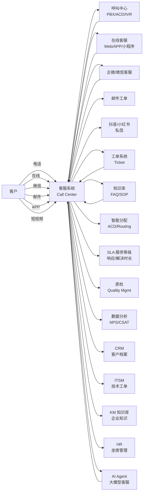
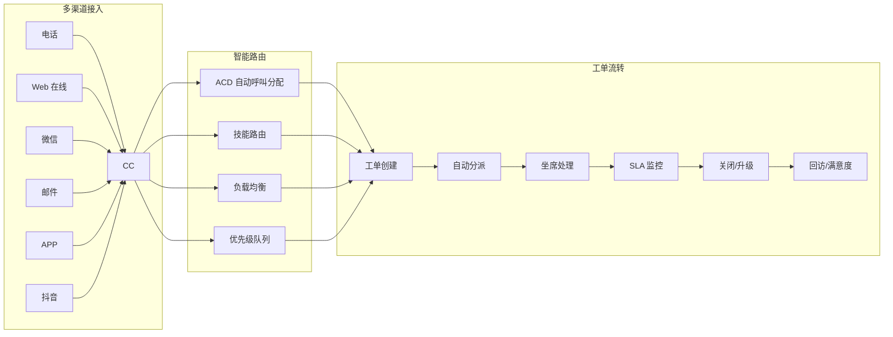
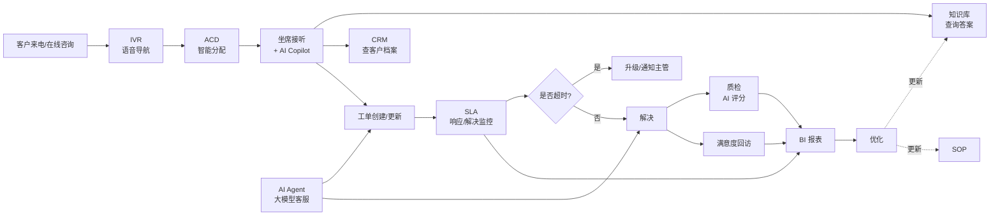
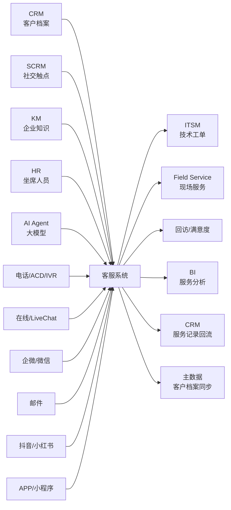

<!--
module:
  parent: application-systems
  slug: application-systems/04-sales-service/call-center
  type: article
  category: 主模块子文章
  summary: 客服系统 / Call Center（Customer Service Center 客户服务中心） 一句话定位：以多渠道接入 + 工单流转 + 知识库 + 智能分配 + SLA + 质检为底座，把"电话 / 在线 / 邮件 / 微信 / 短视频"等所有客户触点系统化的客户服务中心，是企业"服务交付 + 客户体验 + 客户挽回"的统一入口。
-->

# 客服系统 / Call Center（Customer Service Center 客户服务中心）

> 一句话定位：以**多渠道接入（电话 / 在线 / 邮件 / 微信 / 抖音 / APP） + 工单流转 + 知识库 + 智能分配 + SLA 服务等级 + 质检 + 数据分析**为底座，把企业客户服务环节（咨询 / 投诉 / 建议 / 报修 / 回访）系统化的客户服务中心；是**企业服务交付的统一入口 + 客户体验管理中枢**，解决"渠道割裂 / 工单黑洞 / 重复沟通 / 服务无标准 / 质检无依据"的根本痛点。

## 📌 全景图

**客服系统在企业 IT 架构中的位置**：客服系统位于"**客户触点全渠道汇聚层 + 服务交付中枢**"——上游接 CRM（客户档案 + 历史交易）/ KM（企业知识库）/ HR（坐席人员）/ AI（大模型客服），横向接电话交换（PBX/ACD/IVR）/ IM（即时通讯）/ 邮件 / 微信 / 抖音等多渠道触点，下游接 ITSM（技术工单）/ 现场服务（Field Service）/ 客户回访（Survey）/ BI（服务分析）；本质上是把"传统呼叫中心 + 在线客服 + 社交客服 + 工单系统 + AI 客服"五大场景统一化、标准化、可度量化的客户服务中心。

## 📖 定义

客服系统（Call Center / Customer Service Center / Contact Center）是以**多渠道接入 + 工单流转 + 知识库 + 智能分配 + SLA 服务等级 + 质检**为核心能力，把企业客户服务环节（咨询 / 投诉 / 建议 / 报修 / 回访 / 营销外呼）系统化、流程化、可度量化的客户服务中心平台。其核心目标是**让客户在任意渠道、用任意方式、在任意时间获得一致、标准、可追溯的服务体验**。

**权威定义参考**：

- **Gartner**：客服系统是"**客户互动基础设施（Customer Engagement Infrastructure）**"的核心组件，覆盖 **CCaaS（Contact Center as a Service 联络中心即服务）/ UCaaS（Unified Communications as a Service 统一通信即服务）/ CRM 客服模块 / 工单系统 / 知识库 / 质检**六大能力；2024 年 CCaaS 全球市场规模约 **220 亿美元**，预计 2028 年达 **470 亿美元**（CAGR 16%）
- **Forrester**：客服系统是"**客户体验（CX Customer Experience）的运营底座**"，覆盖咨询响应率 / 一次性解决率（FCR First Call Resolution）/ 客户满意度（CSAT）/ 净推荐值（NPS Net Promoter Score）四大体验指标；领先企业 FCR ≥ 75%，CSAT ≥ 85%，NPS ≥ 40
- **ICMI（International Customer Management Institute 国际客户管理协会）**：Call Center 是"**通过电话 / 在线 / 邮件 / 社交等渠道处理客户互动的组织 + 技术 + 流程**"，关键 KPI 包括平均处理时长（AHT Average Handle Time）/ 一次解决率（FCR）/ 服务水平（Service Level）/ 客户满意度（CSAT）
- **CCM（Contact Center Management）行业标准**：客服系统必须满足"**5 个 9 可用性（99.999%）+ 多渠道融合 + 智能分配 + SLA 实时监控 + 质检全覆盖**"五大能力
- **国内行业标准（YD/T 1313 / GB/T 36618）**：对客服系统的呼叫接入 / 工单处理 / 服务等级 / 质检要求做出规范，要求 24×7 多渠道接入 + 工单可追溯 + SLA 可度量

**历史演进**：

- **1960s-1980s 起步**：第一代呼叫中心在美国航空、银行、电信行业起步；以"电话交换机 + 人工坐席 + ACD（Automatic Call Distribution 自动呼叫分配）"为核心；**ACDs 路由 + 录音 + 班长席**成为标配
- **1990s-2000s 互联网化**：互联网泡沫期，客服系统增加"**电子邮件工单 + 知识库 + IVR（Interactive Voice Response 交互式语音应答）**"；CRM 客服模块与呼叫中心开始融合（**CTI Computer Telephony Integration 计算机电话集成**）
- **2000s-2010s 多渠道化**：**Web 在线客服（LiveChat）** 兴起；社交媒体（Twitter/Facebook）客服出现；多渠道融合的"**联络中心（Contact Center）**"取代传统"呼叫中心（Call Center）"
- **2010s 云计算化**：**Zendesk / Freshdesk / Salesforce Service Cloud** 等 SaaS 客服崛起；**CCaaS**（联络中心即服务）成为新形态；中小企首次可以"开箱即用"客服系统
- **2015-2019 中国 SaaS 化**：**Udesk / 智齿 / 网易七鱼 / 容联七陌 / 环信 / 美洽**等国内 SaaS 客服厂商崛起；多渠道融合（电话 + 在线 + 微信 + 邮件 + APP）+ 工单系统成为标配；**微信客服**成为最大差异化（公众号 / 小程序 / 企微客服）
- **2020-2022 智能客服起步**：AI 客服起步（智能问答 / 智能分配 / 智能质检 / 语音机器人 ASR/TTS）；疫情成为客服系统"在线化"催化剂；**Udesk / 智齿 / 网易七鱼**等国内厂商年度营收突破 5 亿
- **2023-2025 大模型客服**：**ChatGPT / Claude / 通义千问 / 文心一言**等大模型客服爆发（**大模型取代传统 FAQ 匹配**）；**AI Agent**（智能体）开始接管客服"判断环节"；**Copilot + Agent 双模式**（AI 辅助人工 + AI 自动处理）；**Amazon Connect / Genesys Cloud / NICE CXone** 等国际大厂发布大模型客服方案
- **2026+ Agentic 客服**：AI Agent 全流程自主处理客户问题（识别意图 → 调用工具 → 解决问题 → 反馈客户），人类坐席只处理"AI 处理不了的 5-10% 复杂场景"；**Gartner 预测 2027 年 25% 的客服交互由 AI Agent 完全处理**

**术语边界对比**：

| 系统 / 概念 | 关注点 | 与客服系统的边界 | 典型工具 |
|------|------|----------------|---------|
| **客服系统（Call Center）** | 全渠道客户互动 + 工单 + 质检 + 知识库 | 本主题 | Zendesk / Salesforce Service Cloud / Udesk |
| **呼叫中心（Contact Center）** | 强调"电话"为主渠道 | **客服系统的子集**：传统电话渠道；现代客服系统已涵盖电话 | Avaya / Genesys / 华为联络中心 |
| **在线客服（LiveChat）** | Web/APP 内嵌实时聊天 | **客服系统的子集**：在线文字渠道 | 美洽 / 智齿 / Intercom |
| **工单系统（Ticketing System）** | 工单创建 / 流转 / 解决 | **客服系统的子集**：工单流转环节 | Jira Service Management / ServiceNow |
| **CRM（客户关系管理）** | 客户全生命周期 + 销售流程 | **业务上游**：客服系统调用 CRM 客户档案；部分 CRM 含客服模块（Salesforce Service Cloud） | Salesforce / 销售易 / 纷享销客 |
| **SCRM（社交化 CRM）** | 微信 / 抖音 / 小红书社交触点 | **集成伙伴**：社交渠道工单流入客服系统 | 微伴 / 尘锋 / 微盛 |
| **ITSM（IT 服务管理）** | IT 部门工单 + SLA + ITIL | **集成伙伴**：客服系统对外客户的工单 → ITSM 内部工单（升级） | ServiceNow / Jira SM / 蓝凌 |
| **KM（知识库 / Knowledge Management）** | 企业知识沉淀 + 搜索 + 协同 | **横向**：客服系统调用 KM 知识库 / FAQ 回答客户 | Confluence / 语雀 / Baklib |
| **在线客服 SaaS（LiveChat SaaS）** | 轻量在线客服（纯聊天） | **客服系统的子集**：只覆盖"在线聊天"渠道 | 美洽 / 智齿 / Intercom |
| **AI 客服（AI Customer Service）** | 大模型 + ASR + TTS 智能问答 | **增强能力**：客服系统的"AI 增强模块" | ChatGPT / Claude / 阿里通义 / 百度文心 |
| **AI Agent（智能体）** | 自主决策 + 工具调用 + 流程编排 | **演进方向**：客服系统的"下一代形态"，从"AI 辅助"到"AI 自主" | Manus / AutoGPT / Claude Agent |
| **大模型客服（LLM CS）** | LLM 替代人工回答客户 | **能力补强**：替代部分人工坐席（2025 热点） | ChatGPT Enterprise / 智谱清言 / 商汤日日新 |
| **电销系统（Outbound Call Center）** | 外呼营销 / 催收 / 回访 | **客服系统的子集**：外呼场景 | 容联七陌 / 合力 / 中通天鸿 |

**与各系统的边界详解**（**2025-2026 高频混淆点**）：

- **vs CRM**：CRM 管"**客户关系全生命周期**"（线索 → 商机 → 客户 → 续费/流失），客服系统管"**客户服务交付**"（咨询 → 投诉 → 报修 → 建议）；CRM 的客服模块（如 Salesforce Service Cloud / Salesforces Service Cloud）是 CRM 与客服系统的融合点。**中小企常"客服系统作为 CRM 的子模块"，大型企业常"客服系统独立 + CRM 集成"**；现代 CRM 头部厂商（Salesforce / HubSpot）的 Service Cloud 已是"客服系统的功能全集"
- **vs SCRM**：SCRM 管"**社交触点行为数据**"（公众号 / 企微 / 抖音 / 小红书互动），客服系统管"**服务交付**"；**SCRM 是客服系统"社交渠道"的数据来源**，但 SCRM 不管工单流转、质检、SLA。**2025 趋势**：SCRM 与客服系统深度融合，社交触点的客户消息直接转入客服工单
- **vs 工单系统（Ticketing）**：工单系统管"**工单流转**"（创建 → 分派 → 处理 → 关闭），客服系统是工单系统的"**上层应用**"——客服系统管"工单从哪里来（多渠道）+ 谁处理（坐席）+ 如何处理（知识库/AI）+ 服务质量如何（质检/SLA）"。**工单系统 = 客服系统的工单流转模块**；ITSM 工单（ServiceNow/Jira SM）与客服工单（Zendesk）有 70% 重叠，差异在"是否含 ITIL 4 流程"
- **vs ITSM**：ITSM 管"**IT 部门内部工单**"（含 ITIL 4 的事件/问题/变更/服务请求），客服系统管"**外部客户工单**"。**客服工单 → 升级为 ITSM 工单**是最常见模式（如客户报修 IT 系统 → 客服创建工单 → 转 IT 部门 ITSM 处理）；B2B SaaS / 互联网企业的"技术支持"常"ITSM 替代客服系统的技术支持模块"
- **vs 在线客服（LiveChat）**：在线客服管"**Web/APP 内嵌实时聊天**"，客服系统是"全渠道"（含电话 / 在线 / 微信 / 邮件 / APP）；**在线客服 = 客服系统的"在线文字渠道"**。中小企业常"在线客服 SaaS（美洽 / 智齿）作为客服系统的入门"
- **vs KM 知识库**：KM 管"**企业知识沉淀与协同**"（文档 / 手册 / FAQ），客服系统管"**服务交付**"；**客服系统调用 KM 知识库**回答客户——**客服知识库 = KM 的"客户服务"子集**。**Zendesk Guide / Salesforce Knowledge / Help Center** 是客服系统内置的 FAQ 知识库
- **vs AI 客服**：AI 客服是"**AI 能力**"（大模型 + ASR + TTS），客服系统是"**系统平台**"；**AI 客服 = 客服系统的"AI 增强模块"**。2025 大模型客服爆发后，**AI 客服已成为客服系统的标配**（不是"独立系统"）
- **vs AI Agent**：AI Agent 是"**自主决策 + 工具调用**"的智能体；客服系统是"**客户服务交付平台**"。**2025-2026 趋势**：**AI Agent 将成为客服系统的"下一代形态"**——AI Agent 不只回答问题，还能"调用订单系统查订单 / 调用支付系统退款 / 调用 CRM 查客户档案"，从"知识问答"升级到"业务办理"
- **vs 电销系统**：电销系统管"**外呼营销 / 催收 / 回访**"（主动呼出），客服系统管"**被动接入 + 工单流转**"（客户呼入）。**电销系统 = 客服系统的"外呼"子集**；**外呼合规**（防骚扰 / 时段限制 / 客户授权）是电销的特殊要求

**客服系统不擅长的领域**：营销获客（MA / SCRM）、销售转化（CRM SFA）、客户主数据治理（MDM）、IT 内部工单（ITSM）、员工管理（HR）、财务结算（ERP/财务）、产品研发（PLM/PDM）。

**在企业 IT 架构中的位置**：客服系统是企业"**客户互动的统一入口 + 服务交付中枢**"——上游接 CRM（客户档案 + 历史交易）/ KM（企业知识）/ HR（坐席人员）/ AI（大模型客服），横向接电话交换（PBX/ACD/IVR）/ IM（即时通讯）/ 邮件 / 微信 / 抖音等多渠道触点，下游接 ITSM（技术工单）/ 现场服务（Field Service）/ 客户回访（Survey）/ BI（服务分析）。Gartner 将客服系统归为"**客户互动基础设施（Customer Engagement Infrastructure）**"，与 CRM（客户关系）/ SCRM（社交触点）/ CDP（用户画像）/ MA（营销自动化）共同构成"**客户运营五件套**"。

**典型数据量级**：成熟客服系统的数据量通常在 **100GB-10TB** 区间（量级参考，取决于客户规模与服务量）。工单主数据、通话录音、聊天记录、知识库文章、质检结果是主要占用项；活跃坐席从十人（小型客服团队）到上万人（大型电商 / 银行 / 电信呼叫中心）；日均工单量在 1000-100000+ 张，年度工单量在数万到千万级。**Zendesk 全球 17 万+ 客户**（2024 年报，覆盖 160+ 国家）；**Salesforce Service Cloud** 全球客户 15 万+；**Udesk / 智齿**等国内头部客服系统服务 5000+ 中大型企业客户。

## 🔧 核心能力

客服系统的能力围绕"**多渠道接入 + 工单管理 + 知识库 + 智能分配 + SLA + 质检 + 数据分析 + AI 客服**"八大模块展开：

- **多渠道接入（Omnichannel）**：电话（PBX/ACD/IVR）、在线（Web/APP/小程序）、微信（公众号/小程序/企微客服）、邮件、短信、抖音/小红书私信、API/SDK、自助门户（Help Center）——**全渠道统一接入，统一路由，统一视图**
- **工单管理（Ticketing）**：工单创建 / 自动分派 / 流转 / 升级 / 合并 / 拆分 / 关闭 / 回访；工单字段自定义 / 模板 / 自动化规则；**工单是客服系统的"中心对象"**
- **知识库（Knowledge Base / KB）**：FAQ（常见问题）/ SOP（标准操作流程）/ Runbook（技术手册）/ 文章（解决方案）；**AI 智能推荐**（坐席输入问题 → 自动推荐答案）；**客户自助**（Help Center 客户自助查询）
- **智能分配（ACD / Skill-Based Routing）**：基于坐席技能（语种 / 产品线 / 客户类型）+ 当前负载 + SLA 优先级 + 历史匹配度，**自动路由工单/通话到最合适的坐席**
- **SLA 服务等级（Service Level Agreement）**：响应时长 / 解决时长 / 等待时长 / 一次性解决率（FCR）——**SLA 是客服系统"服务承诺"的核心**
- **质检（Quality Management / QM）**：通话录音质检（ASR 转写 + NLP 评分）/ 在线会话质检 / 工单合规检查 / 服务态度评估；**AI 智能质检**（自动识别违规 / 服务态度 / 信息准确性）
- **数据分析（Analytics / BI）**：KPI 看板（AHT / FCR / CSAT / SLA 达成率）/ 坐席绩效 / 客户画像 / 工单分析 / 趋势预测；**实时大屏 + 离线分析**
- **AI 客服（AI Customer Service）**：智能问答（FAQ 匹配 + 大模型问答）/ 语音机器人（ASR + TTS + 对话管理）/ 智能分配（AI 推荐坐席）/ 智能质检（AI 自动评分）/ 大模型 Copilot（坐席辅助）

**「多渠道接入 + 智能路由 + 工单流转」三大接入能力**：

客服系统的"客户触达能力"决定企业服务的"覆盖面"——**80% 客户期待"任意渠道都能解决问题"**，但实际只有 30% 企业能做到"全渠道一致体验"。

**1. 多渠道接入（Omnichannel）**：

- **电话渠道**：PBX（电话交换机）+ ACD（自动呼叫分配）+ IVR（交互式语音应答）；**云呼叫中心**（CCaaS）模式普及——**Twilio Voice / Amazon Connect / Genesys Cloud / 容联七陌**等云电话平台；支持 SIP / WebRTC / 软电话
- **在线文字渠道**：Web 嵌入（JS SDK）/ APP（iOS/Android SDK）/ 小程序（微信/支付宝/抖音小程序 SDK）；**LiveChat**（实时聊天）+ 离线留言（自动转工单）
- **微信渠道**：公众号（48 小时互动 + 客服消息）/ 小程序客服 / **企业微信客服**（B2C 主流，2025 占微信生态客服 80%+）；微信开放接口 + 第三方服务商
- **邮件渠道**：IMAP/POP3 接收 / SMTP 发送；**邮件自动转工单**（按发件人/主题/标签自动创建工单）；邮件模板（自动签名/变量填充）
- **短信渠道**：短信上行（客户回复短信自动建工单）/ 短信下行（通知/确认/营销）
- **短视频 / 社交渠道**：抖音 / 小红书 / 视频号私信接入；**2025 短视频客服**增长迅猛（抖音客服接入率达 60%+）
- **API/SDK**：第三方系统接入（如电商订单查询 / 物流查询 / 银行账户查询通过 API 集成进客服系统）
- **客户自助门户（Help Center）**：客户可自助查询 FAQ / 提交工单 / 查看工单状态 / 下载资料；**降低 30-50% 人工坐席工作量**

**2. 智能分配（Skill-Based Routing / ACD）**：

- **ACD（Automatic Call Distribution 自动呼叫分配）**：电话路由核心算法——**最长空闲时间优先 / 技能匹配优先 / 负载均衡 / 优先级队列 / VIP 优先**
- **技能路由（Skill-Based Routing）**：按坐席技能（语种 / 产品线 / 客户类型 / 客户等级）路由；**银行 VIP 客户 → 高级坐席 / 英语客户 → 英语坐席 / 信用卡投诉 → 信用卡专家坐席**
- **智能负载均衡**：实时监控坐席负载（在线数 / 等待数 / 通话中数 / 空闲时长），动态调整路由策略
- **AI 推荐路由**：基于历史匹配数据 + 客户画像，**AI 推荐最合适的坐席**（如"该客户上次由坐席 A 处理，反馈 5 星，本次优先分配坐席 A"）
- **溢出路由（Overflow）**：某技能组坐席全忙 → 自动溢出到备份技能组；全忙 → 排队等待 + 排队音乐 + 预计等待时长播报
- **VIP 优先**：高价值客户优先接入（如银行钻石卡客户优先）；**银行 / 保险 / 高端制造** 必备

**3. 工单流转（Ticketing Workflow）**：

- **工单创建**：客户从任意渠道发起 → 自动创建工单（带渠道/客户/历史记录标签）；**客服手动创建**（电话接入后手动建单）
- **自动分派**：按技能/负载/优先级/SLA 自动分配到坐席或技能组；**AI 智能分派**（基于历史匹配 + 客户画像）
- **工单流转**：状态机（新建 → 处理中 → 等待客户 → 升级 → 已解决 → 已关闭）+ 自定义字段 + SLA 计时
- **工单合并 / 拆分**：同一客户多个问题 → 合并为一个工单；**客户多次重复进线**自动合并历史工单
- **升级机制**：SLA 超时 → 自动升级到主管；**客户投诉 → 升级到客户成功团队**；**技术问题 → 升级到产品/研发团队**
- **回访与满意度**：工单关闭后自动触发满意度调查（CSAT 1-5 星 / NPS 0-10 分）；**低满意度自动回呼 / 升级**
- **工单模板**：常见问题预设模板（投诉模板 / 报修模板 / 建议模板），坐席一键填充

**「知识库 + SLA + 质检」三大保障能力**：

客服系统的"服务质量"由"**知识库（提供标准答案）+ SLA（保障响应速度）+ 质检（监督服务质量）**"三大保障能力决定：

**1. 知识库（Knowledge Base / KB）**：

- **FAQ（常见问题）**：客户高频问题 + 标准答案；**AI 智能匹配**（客户问题 → 最匹配的 FAQ）；客户自助查询占比 30-50%
- **SOP（标准操作流程）**：坐席处理流程指南；**坐席输入问题 → AI 推荐 SOP**；坐席培训材料
- **解决方案文章**：复杂问题的解决步骤（带截图/视频）；**内部知识共享**
- **客户自助门户（Help Center）**：面向客户的 FAQ + 文章检索；**自助解决率 30-50%**
- **AI 知识库**：大模型从历史工单/聊天记录自动提取 FAQ；**自动更新知识库**（2025-2026 趋势）
- **知识库运营**：文章版本管理 + 审批流 + 权限管理 + 效果分析（哪条 FAQ 最常被用 / 解决率最高）

**2. SLA 服务等级（Service Level Agreement）**：

- **响应时长**：客户发起工单到第一次响应的时间；**P1 工单 5 分钟响应 / P2 工单 30 分钟响应 / P3 工单 4 小时响应**
- **解决时长**：工单创建到完全解决的时间；**P1 24 小时解决 / P2 72 小时解决 / P3 7 天解决**
- **等待时长**：电话排队等待时长；**80% 电话 20 秒内接通（行业基准 Service Level 80/20）**
- **一次性解决率（FCR First Call Resolution）**：**FCR ≥ 75%**（行业领先水平 80%+）；**FCR 与 CSAT 强正相关**
- **客户满意度（CSAT）**：工单关闭后客户评价；**CSAT ≥ 85%** 为行业领先
- **净推荐值（NPS Net Promoter Score）**：客户愿不愿意推荐；**NPS ≥ 40** 为行业领先
- **SLA 违约处理**：超时自动升级 / 自动通知主管 / 自动发送道歉短信 / SLA 违约率报表

**3. 质检（Quality Management / QM）**：

- **全量 vs 抽样**：传统质检只能抽检 2-5% 录音；**AI 智能质检可 100% 全量质检**（2025 标配）
- **质检维度**：服务态度 / 信息准确性 / 合规性 / 流程规范性 / 客户体验 / 风险识别
- **AI 智能质检**：ASR 转写 → NLP 分析（情绪识别 / 关键词识别 / 风险识别）→ 自动评分；**识别坐席违规（辱骂 / 推诿 / 信息错误）**
- **质检评分卡**：自定义评分维度与权重；**不同部门不同评分卡**（销售侧重促成 / 客服侧重满意度）
- **质检结果应用**：质检结果 → 坐席绩效 / 培训需求 / 流程优化；**质检发现问题 → 知识库更新 / SOP 优化**

**「数据分析 + AI 客服 + 大模型客服」三大增强能力**（**2025-2026 热点**）：

**1. 数据分析（Analytics / BI）**：

- **实时大屏**：实时显示通话量 / 在线坐席 / 工单量 / SLA 达成率 / 等待队列；**客服管理者监控中心**
- **KPI 看板**：AHT（平均处理时长）/ ACW（事后处理时长）/ FCR（一次性解决率）/ CSAT（满意度）/ SLA 达成率 / 坐席利用率
- **坐席绩效**：通话量 / 处理量 / 满意度 / 质检得分 / 工单关闭率；**坐席排行 / 末位淘汰**
- **客户分析**：高频问题 TOP10 / 客户问题趋势 / 客户画像 / 客户流失预警
- **预测分析**：**基于历史数据预测来电量**（按日 / 按周 / 按月 / 按节假日）；**坐席排班预测**

**2. AI 客服（AI Customer Service）**：

- **智能问答（Chatbot）**：基于 FAQ 匹配的机器人；**意图识别 + FAQ 匹配**（传统方案）；准确率 70-85%
- **大模型问答（LLM Chatbot）**：基于大模型的开放问答；**ChatGPT / Claude / 通义千问 / 文心一言** API 接入；准确率 85-95%（**2025-2026 主流**）
- **语音机器人（Voice Bot）**：ASR（语音转文字）+ TTS（文字转语音）+ 对话管理；**外呼营销 / 催收 / 简单咨询**；**替代 30-50% 简单人工坐席**
- **智能分配 AI**：基于历史匹配 + 客户画像，AI 推荐最合适的坐席
- **智能质检 AI**：100% 全量质检，自动识别违规 / 服务态度 / 风险
- **坐席辅助 AI（Agent Assist / Copilot）**：坐席通话时，AI 实时转写 + 推荐答案 + 提示下一步动作；**坐席效率提升 20-40%**

**3. 大模型客服（LLM Customer Service）**（**2025-2026 热点**）：

- **大模型问答**：基于 LLM 的开放问答（不依赖 FAQ 库）；**ChatGPT / Claude / GPT-4o / Claude 3.5 Sonnet** 等
- **大模型 Copilot**：坐席辅助（实时推荐答案 + 自动生成工单小结 + 自动生成回复话术）
- **大模型 Agent**：**AI Agent 自主处理客户问题**（识别意图 → 调用工具 → 解决问题 → 反馈客户）；**Manus / AutoGPT / Claude Agent / 智谱清言 GLM-Z1**
- **多模态大模型**：图像理解（客户发图片报修）+ 语音理解（ASR）+ 文档理解（合同/订单）
- **大模型私有化**：金融/政府/央国企用私有化大模型（数据不出域）；**DeepSeek / Qwen / 文心 / 智谱 GLM 私有化部署**
- **2025 行业基准**：大模型客服已能处理 **60-80% 的客户问题**（简单咨询 / 订单查询 / 退换货 / 投诉处理），**仅 20-40% 复杂问题升级人工**

**「IVR + 呼叫中心 + 工单 + 知识库 + 智能分配 + SLA + 质检 + AI 客服」业务闭环**：

客服系统的"业务功能"围绕"**客户互动闭环**"展开，**全流程闭环**：

**1. 客户接入**：
- **电话接入**：客户拨打电话 → PBX 接入 → IVR 语音导航（"信用卡业务请按 1 / 贷款业务请按 2"）→ ACD 分配到坐席
- **在线接入**：客户点击 Web/APP 内嵌客服按钮 → 弹出聊天窗口 → 排队 → 分配到坐席
- **微信接入**：客户在公众号/小程序/企微发起咨询 → 客服系统收到消息 → 自动回复或分配到坐席

**2. 智能分配**：
- **ACD 自动分配**：按技能 / 负载 / 优先级 / 历史匹配分配
- **VIP 优先**：高价值客户优先接入
- **溢出路由**：技能组全忙 → 溢出到备份技能组
- **排队等待**：全忙 → 排队 + 音乐 + 等待时长播报

**3. 坐席处理**：
- **坐席接听**：看到客户档案（来自 CRM）+ 历史工单 + 历史交互
- **AI Copilot**：通话时 AI 实时转写 + 推荐答案 + 提示下一步
- **查询知识库**：坐席在 KB 中搜索问题答案
- **创建/更新工单**：记录客户问题 + 处理过程
- **解决工单**：回答客户 + 关闭工单
- **升级**：处理不了 → 升级到主管 / 技术团队 / 产品团队

**4. SLA 监控**：
- **响应计时**：工单创建开始计时
- **解决计时**：工单未解决继续计时
- **超时升级**：SLA 超时自动升级 + 通知主管
- **SLA 报表**：响应率 / 解决率 / 平均响应时长 / 平均解决时长

**5. 质检**：
- **通话录音**：100% 录音 + ASR 转写
- **AI 智能质检**：自动识别违规 / 服务态度 / 信息准确性
- **人工抽检**：质检员对 AI 标记的疑似问题进行复核
- **质检评分**：按评分卡打分 → 坐席绩效

**6. 满意度回访**：
- **CSAT 调查**：工单关闭后短信 / 微信推送满意度调查
- **NPS 调研**：定期 NPS 调研（季度 / 年度）
- **差评升级**：差评工单自动升级到主管处理
- **VOC（Voice of Customer 客户之声）**：客户反馈分析 → 产品 / 服务优化

**7. 数据分析与优化**：
- **实时大屏**：管理者监控坐席状态 / 工单量 / SLA
- **KPI 看板**：AHT / FCR / CSAT / SLA 达成率
- **趋势分析**：来电量趋势 / 工单类型分布 / 客户问题 TOP10
- **预测分析**：预测未来来电量 → 坐席排班
- **优化建议**：基于数据分析提出知识库更新 / SOP 优化 / 流程改进建议

**按客服系统成熟度分级的功能深度**（行业参考框架）：

- **L1 基础**：电话接入 + 简单工单 + 基础知识库（解决 30% 服务场景）
- **L2 标准**：+ 多渠道接入 + 智能分配 + SLA + 基础质检（解决 60% 服务场景）
- **L3 高级**：+ AI 智能问答 + AI 智能质检 + 客户自助 + 实时大屏（解决 80% 服务场景）
- **L4 卓越**：+ 大模型客服 + 大模型 Copilot + 移动坐席 + 跨系统集成（解决 90% 服务场景）
- **L5 Agentic**：+ AI Agent 全自主 + 语音 Agent + 多模态 Agent + 自学习（解决 95% 服务场景）

按企业关注度排序，客服系统最常被列为「核心采购理由」的前 5 项是：**多渠道统一接入**（电话/在线/微信/邮件）、**工单流转能力**（自动分派/升级/合并）、**AI 客服能力**（大模型问答/智能质检）、**SLA 服务等级**（响应/解决时长）、**集成能力**（与 CRM/ITSM/KM 集成）。

## 📊 关键模块详解

### 呼叫中心模块（Call Center / Telephony）

呼叫中心是客服系统"电话渠道"的核心能力——传统客服系统的代名词：

- **PBX（电话交换机）**：传统硬件 PBX（Avaya / Cisco / 华为）/ 云 PBX（Twilio / Amazon Connect / 容联七陌）；**云 PBX 是 2025 主流**（免硬件 / 按需付费 / 全球覆盖）
- **ACD（自动呼叫分配）**：分配策略（最长空闲 / 技能匹配 / 负载均衡 / 优先级 / 历史匹配）；**ACD 算法直接决定 SLA 达成率**
- **IVR（交互式语音应答）**：语音导航（"信用卡业务请按 1"）+ 语音识别（"请说出您要咨询的业务"）+ TTS 播报；**IVR 是"客户体验的第一关"**
- **CTI（计算机电话集成）**：电话与 CRM / 客服系统集成；**来电弹屏**（客户来电 → 坐席屏幕自动弹出客户档案 + 历史工单）
- **通话录音**：100% 通话录音（合规 + 质检）；**AI 转写**（ASR）+ 智能分析
- **外呼能力**：外呼营销 / 催收 / 客户回访；**外呼合规**（防骚扰 / 时段限制 / 客户授权 / 通话录音）
- **预测式外呼（Predictive Dialer）**：自动拨号（一次拨号 N 个，接通率 30-40%，自动分配给空闲坐席）；**催收 / 营销标配**
- **SIP / WebRTC**：VoIP 协议支持；**WebRTC** 让浏览器可直接打电话（**Amazon Connect / Genesys Cloud** 标配）

### 在线客服模块（LiveChat / Web Chat）

在线客服是客服系统"在线文字渠道"的核心能力——**B2C 电商 / SaaS / 互联网标配**：

- **Web 嵌入**：JS SDK 嵌入网站；**右下角悬浮按钮 + 弹出聊天窗口**
- **APP 嵌入**：iOS / Android SDK 嵌入 APP；**内置客服入口**
- **小程序嵌入**：微信 / 支付宝 / 抖音 / 百度小程序 SDK；**电商 / 服务行业标配**
- **实时聊天**：WebSocket 双向实时通信；**消息送达 + 已读 + 输入状态**
- **富文本消息**：文字 + 图片 + 表情 + 文件 + 语音 + 视频 + 名片 + 位置；**2025 富媒体消息占比 60%+**
- **预设回复**：坐席预设常用回复（一键发送）；**节省 30-50% 输入时间**
- **会话转接**：坐席转接会话到其他坐席 / 主管 / 技能组
- **会话历史**：聊天记录永久保存 + 检索
- **客户信息**：会话时显示客户档案（来自 CRM）+ 浏览轨迹（来自 CDP）+ 历史会话
- **访客监控**：实时显示正在浏览网站的访客 + 主动发起对话（**Proactive Chat**）；**电商提升转化率 10-30%**

### 微信客服模块（WeCom / Official Account / Mini Program）

微信客服是中国客服系统的"差异化特色"——**微信生态客服占国内客服 70%+**：

- **公众号客服**：48 小时互动消息 + 客服消息接口；**微信开放接口**
- **小程序客服**：微信小程序客服组件；**电商 / 服务行业标配**
- **企业微信客服（WeCom Customer Service）**：B2C 客服主流（**2025 占微信生态客服 80%+**）；**加好友 + 客户群 + 客户标签 + 客户画像**
- **微信客服 vs 公众号**：公众号偏"营销 + 通知"，企业微信客服偏"服务 + 私域"；**2025 趋势：客服场景向企业微信迁移**
- **客户群**：客服创建客户群（如 VIP 群 / 售后群）；**群内客户标签 + 群发消息 + 客户管理**
- **客户标签**：基于客户行为 / 来源 / 消费等打标签；**精细化客户运营**
- **欢迎语 + 自动回复**：客户首次进入 / 关键词触发自动回复
- **素材库**：客服常用素材（图片 / 链接 / 小程序卡片）；**提升服务效率**

### 工单系统模块（Ticketing System）

工单系统是客服系统的"**核心数据模型**"——所有客户互动最终落到工单：

- **工单字段**：自定义字段（客户名 / 问题类型 / 优先级 / 描述 / 处理人 / 状态 / 关闭原因）；**工单字段模板**
- **工单状态**：新建 / 处理中 / 等待客户 / 等待第三方 / 升级中 / 已解决 / 已关闭 / 已重开；**自定义状态机**
- **工单优先级**：P1（紧急，5 分钟响应）/ P2（高，30 分钟响应）/ P3（中，4 小时响应）/ P4（低，24 小时响应）；**优先级自动判定**（基于关键词 / 客户等级）
- **工单分派**：自动分派（按技能 / 负载 / 区域 / 历史匹配）+ 手动分派 + 抢单模式
- **SLA 策略**：不同优先级不同 SLA；**工作时间 / 非工作时间 SLA 区分**
- **工单合并 / 拆分**：同一客户多个问题合并 / 拆分
- **工单升级**：SLA 超时升级 + 客户请求升级 + 主管手动升级
- **工单模板**：常见问题模板（投诉模板 / 报修模板 / 退换货模板），一键填充
- **工单自动化**：触发器（状态变更触发动作）+ 宏（一键执行多步操作）+ 定时任务
- **工单 API**：开放 API / Webhook（与 CRM / ITSM / ERP 集成）

### 知识库模块（Knowledge Base / KB）

知识库是客服系统"**标准答案**"的来源——决定坐席效率与一致性：

- **FAQ 库**：常见问题 + 标准答案；**结构化（问题 + 答案 + 标签 + 分类）**
- **SOP 库**：标准操作流程（坐席处理流程）；**步骤化 + 截图 + 视频**
- **解决方案文章**：复杂问题解决指南；**长文章 + 富媒体**
- **客户自助门户（Help Center）**：面向客户的 FAQ + 文章检索；**SEO 优化 + 自助解决率 30-50%**
- **AI 智能推荐**：坐席输入问题 → AI 自动推荐相关 FAQ / SOP / 文章
- **AI 自动生成**：大模型从历史工单 / 聊天记录自动提取 FAQ；**知识库自动更新**
- **知识库运营**：文章版本管理 + 审批流 + 权限管理 + 效果分析
- **多语言支持**：FAQ 多语言版本（中文 / 英文 / 日文 / 韩文）

### 智能分配模块（ACD / Skill-Based Routing）

智能分配是客服系统"**资源调度**"的核心——决定 SLA 与坐席利用率：

- **ACD 算法**：最长空闲时间优先 / 技能匹配 / 负载均衡 / 优先级队列 / VIP 优先
- **技能管理**：坐席技能标签（语种 / 产品线 / 客户类型 / 客户等级）；**多技能坐席**
- **技能组**：技能组（信用卡技能组 / 贷款技能组 / VIP 技能组）；**多技能组支持**
- **排队管理**：排队队列 + 排队音乐 + 等待时长播报 + 队列溢出
- **VIP 优先**：高价值客户优先接入；**银行 / 保险 / 高端制造 必备**
- **AI 推荐路由**：基于历史匹配 + 客户画像 + 工单内容，AI 推荐最合适的坐席
- **轮班 / 排班**：坐席排班（早班 / 中班 / 晚班 / 夜班）；**预测式排班**（基于历史来电量预测）

### SLA 服务等级模块（SLA Management）

SLA 是客服系统"**服务承诺**"的核心——决定客户体验与企业信誉：

- **响应 SLA**：客户发起工单到第一次响应的时间；**P1 5 分钟 / P2 30 分钟 / P3 4 小时**
- **解决 SLA**：工单创建到完全解决的时间；**P1 24 小时 / P2 72 小时 / P3 7 天**
- **等待 SLA**：电话排队等待时长；**80/20 规则（80% 电话 20 秒内接通）**
- **FCR（一次性解决率）**：FCR ≥ 75% 为行业领先；**FCR 与 CSAT 强正相关**
- **CSAT（满意度）**：CSAT ≥ 85% 为行业领先
- **NPS（净推荐值）**：NPS ≥ 40 为行业领先
- **SLA 违约处理**：超时自动升级 / 自动通知主管 / 自动发送道歉短信 / SLA 违约率报表
- **多级 SLA**：不同客户等级不同 SLA（VIP 客户 SLA 更严）
- **工作时间 SLA**：工作时间 vs 非工作时间 SLA 区分

### 质检模块（Quality Management / QM）

质检是客服系统"**服务质量监督**"的核心——传统抽检 2-5%，AI 全量 100%：

- **全量 vs 抽样**：传统人工抽检 2-5% 录音；**AI 智能质检 100% 全量**
- **质检维度**：服务态度 / 信息准确性 / 合规性 / 流程规范性 / 客户体验 / 风险识别
- **AI 智能质检**：ASR 转写 → NLP 分析（情绪识别 / 关键词识别 / 风险识别）→ 自动评分
- **质检评分卡**：自定义评分维度与权重；**不同部门不同评分卡**
- **人工复核**：质检员对 AI 标记的疑似问题进行复核
- **质检结果应用**：质检结果 → 坐席绩效 / 培训需求 / 流程优化
- **质检报表**：坐席质检得分 / 违规类型分布 / 改进趋势

### 数据分析模块（Analytics / BI）

数据分析是客服系统"**决策支持**"的核心——从数据中找改进机会：

- **实时大屏**：实时显示通话量 / 在线坐席 / 工单量 / SLA 达成率 / 等待队列
- **KPI 看板**：AHT / ACW / FCR / CSAT / SLA 达成率 / 坐席利用率
- **坐席绩效**：通话量 / 处理量 / 满意度 / 质检得分 / 工单关闭率
- **客户分析**：高频问题 TOP10 / 客户问题趋势 / 客户画像 / 客户流失预警
- **趋势分析**：来电量趋势 / 工单类型分布 / 客户满意度趋势
- **预测分析**：预测未来来电量 → 坐席排班
- **VOC（Voice of Customer 客户之声）**：客户反馈分析 → 产品 / 服务优化
- **BI 集成**：与 Power BI / Tableau / 帆软 BI 集成；**深度分析报表**

### AI 客服模块（AI Customer Service）

AI 客服是客服系统"**智能化**"的核心——2025-2026 标配：

- **智能问答（Chatbot）**：基于 FAQ 匹配的机器人；**意图识别 + FAQ 匹配**；准确率 70-85%
- **大模型问答（LLM Chatbot）**：基于 LLM 的开放问答；**ChatGPT / Claude / 通义 / 文心 / 智谱** API；准确率 85-95%
- **语音机器人（Voice Bot）**：ASR + TTS + 对话管理；**外呼营销 / 催收 / 简单咨询**
- **智能分配 AI**：基于历史匹配 + 客户画像，AI 推荐坐席
- **智能质检 AI**：100% 全量质检，自动识别违规 / 服务态度 / 风险
- **坐席辅助 AI（Agent Assist / Copilot）**：坐席通话时 AI 实时转写 + 推荐答案 + 提示下一步
- **多模态 AI**：图像理解（客户发图片报修）+ 语音理解 + 文档理解

### 大模型客服模块（LLM Customer Service）

大模型客服是客服系统"**AI 升级**"的 2025-2026 热点：

- **大模型问答**：基于 LLM 的开放问答（不依赖 FAQ 库）；**准确率 85-95%**
- **大模型 Copilot**：坐席辅助（实时推荐答案 + 自动生成工单小结 + 自动生成回复话术）
- **大模型 Agent**：**AI Agent 自主处理客户问题**（识别意图 → 调用工具 → 解决问题 → 反馈客户）
- **多模态大模型**：图像 + 语音 + 文档理解
- **大模型私有化**：金融 / 政府 / 央国企用私有化大模型（**DeepSeek / Qwen / 文心 / 智谱 GLM** 私有化部署）
- **RAG（检索增强生成）**：大模型 + 知识库检索；**解决大模型幻觉问题**
- **2025 行业基准**：大模型客服处理 **60-80% 客户问题**；**仅 20-40% 复杂问题升级人工**

## 🏆 选型决策

### 国际三大 CCaaS 平台 vs 国内五虎客服厂商

| 厂商 | 总部 | 定位 | 优势 | 劣势 | 适用规模 |
|------|------|------|------|------|---------|
| **Zendesk** | 美国（旧金山） | 全球客服系统龙头 | **全球第一 SaaS 客服**（客户 17 万+/160+ 国家）/ 易用性最佳 / Help Center 自助门户强 / Marketplace 1000+ 集成 | 中国本地化弱（无企微/无微信生态）/ 中国合规弱（数据出境） | 跨国企业 / SaaS 公司 / 中小企业 |
| **Salesforce Service Cloud** | 美国（旧金山） | CRM 一体化客服 | **与 Salesforce CRM 深度集成** / Einstein AI 强 / Field Service / 大型客户首选 | 贵（人均 150-300 美元/月）/ 中国本地化弱 / 复杂 | 大型集团 / 跨国企业 / 已用 Salesforce |
| **Genesys Cloud CX** | 美国（旧金山） | 企业级 CCaaS 龙头 | **全球 CCaaS 头部** / 路由算法最强 / 多渠道融合最佳 / 大型客户首选 | 贵 / 中国本地化弱 / 实施复杂 | 大型集团 / 呼叫中心 / 金融 |
| **Microsoft Dynamics 365 Customer Service** | 美国（雷德蒙德） | Microsoft 生态客服 | **与 Microsoft 365 / Teams 集成** / Copilot AI / 全球合规 | 中国本地化弱 / 生态弱于 Salesforce | 跨国企业 / Microsoft 生态 |
| **Freshdesk** | 印度（钦奈） | 中小企业友好客服 | **性价比高**（人均 15-80 美元/月）/ 易用性好 / Freddy AI | 企业级弱 / 中国本地化无 | 中小企业 / SaaS / 互联网 |
| **Intercom** | 美国（旧金山） | B2B SaaS 客服代表 | **产品体验最佳**（业内公认 UI / UX 第一）/ Fin AI 强大 / B2B SaaS 标配 | 贵 / 中国本地化无 / 复杂工单弱 | B2B SaaS / 互联网 / 中型企业 |
| **Udesk（沃丰科技）** | 中国（北京） | 国内客服龙头 | **国内市场份额领先**（服务 5000+ 中大型企业）/ 全渠道接入（电话 + 在线 + 微信 + 邮件）/ AI 智能客服强 / 行业方案深（金融 / 零售 / 制造） | 国际化弱 / 大型集团项目略弱于 Salesforce | 国内中大型企业 / 金融 / 零售 / 制造 |
| **智齿科技** | 中国（北京） | 国内客服第二 | **SCRM + 客服一体化** / 在线客服强（LiveChat 龙头）/ 性价比高 / 微信生态深 | 电话能力略弱 / 国际化弱 | 国内中小企业 / 互联网 / 在线服务 |
| **网易七鱼** | 中国（杭州） | 网易系客服 | **在线客服 + AI 强** / 互联网基因 / 网易生态集成 / 大模型客服领先 | 行业方案深度略弱 / 国际化弱 | 国内中小企业 / 互联网 / 电商 |
| **容联七陌** | 中国（北京） | 呼叫中心 + 客服 | **呼叫中心强**（云电话能力强）/ 金融行业深 / 外呼合规 | 在线客服略弱 / AI 略弱 | 国内金融 / 催收 / 外呼场景 |
| **环信** | 中国（北京） | IM + 客服 | **IM SDK 强**（APP 内嵌客服 SDK 头部）/ 互联网客户多 | AI 客服略弱 / 行业方案深度不足 | 国内互联网 / APP 内嵌客服 |
| **美洽** | 中国（成都） | 中小企业在线客服 | **在线客服头部**（中小企业首选）/ 性价比高 / 微信生态强 | 大型企业项目弱 / AI 弱 | 国内中小企业 / 电商 / 在线服务 |

### 自研 vs 商用 vs SaaS

| 维度 | 自研客服系统 | 商用客服系统（私有化） | SaaS 客服系统 |
|------|------------|------------------|-------------|
| 适用规模 | 大型集团（央国企 / 银行 / 互联网巨头） | 中大型企业（数据本地化要求） | 中小企业 / 通用场景 |
| 优势 | 100% 自主可控 / 深度定制 / 大型集团定制 | 数据本地化 / 行业方案成熟 / 合规保障 | 快速上线 / 成本低 / 免运维 / 持续迭代 |
| 劣势 | 投入大（5000 万+）/ 周期长（3-5 年）/ 需自建多渠道 | 投入中等（500-2000 万）/ 运维成本高 | 数据在 SaaS 厂商 / 定制受限 |
| 典型代表 | 阿里 / 京东 / 美团自研 / 银行自研 | Udesk 私有化 / 容联七陌私有化 / 华为联络中心 | Zendesk / Salesforce / Udesk SaaS / 智齿 SaaS |
| 决策阈值 | 万人+ 特殊合规 + 长期投入 → 自研；否则 → 商用/SaaS | 数据本地化 + 中等规模 → 私有化 | 通用场景 + 快速上线 → SaaS |

### 选型决策树（5 层）

1. **先看部署模式**：跨国业务 / 全球合规 → Zendesk / Salesforce / Genesys Cloud；纯国内 → Udesk / 智齿 / 网易七鱼；央国企 / 金融（数据本地化）→ 自研 / 私有化（Udesk 私有化 / 华为联络中心）
2. **再看主渠道**：电话为主 → Genesys Cloud / 容联七陌；在线为主 → Intercom / 智齿 / 美洽；微信生态为主 → 智齿 / Udesk / 网易七鱼；多渠道融合 → Udesk / Zendesk / Salesforce
3. **再看 AI 能力**：需要大模型客服 → Salesforce Einstein / Intercom Fin / Udesk AI / 网易七鱼大模型；需要 AI Agent → Salesforce Agentforce / Intercom Fin Agent / Manus / Claude Agent
4. **再看行业**：金融 / 银行 → Udesk / 容联七陌 / 华为；零售 / 电商 → 智齿 / 美洽 / 网易七鱼；SaaS / 互联网 → Intercom / Zendesk / 智齿；制造 / 政府 → Udesk / 华为
5. **最后看集成生态**：与 Salesforce CRM 集成 → Salesforce Service Cloud；与钉钉 / 企微集成 → Udesk / 智齿；与 SAP / Oracle 集成 → Genesys Cloud；自研业务系统 → 评估 API 完善度

### 大模型客服 / AI Agent 选型（2025-2026 趋势）

- **闭源大模型（高质量）**：OpenAI GPT-4o / Anthropic Claude 3.5 Sonnet / Google Gemini 1.5 Pro；**国际化企业首选**
- **国产大模型（合规 + 中文）**：阿里通义千问 Qwen-Max / 百度文心一言 4.0 / 智谱 GLM-4 / 月之暗面 Kimi / DeepSeek V3；**国内企业首选 + 中文场景**
- **私有化大模型（数据不出域）**：DeepSeek / Qwen / 文心 / 智谱 GLM 私有化部署；**金融 / 政府 / 央国企 首选**
- **垂直客服大模型**：Udesk AI / 智齿 AI / 网易七鱼大模型 / Salesforce Einstein / Zendesk AI；**客服场景优化**
- **AI Agent 平台**：Salesforce Agentforce / Intercom Fin Agent / Manus / AutoGPT / Claude Agent SDK；**自主处理客户问题**
- **RAG 框架**：LangChain / LlamaIndex / Dify / FastGPT；**大模型 + 知识库检索**

## 🚨 实施陷阱 / 反模式

### 1. 多渠道割裂陷阱

**现象**：客服系统上线后，电话、在线、微信、邮件仍是"独立运作"——客户在微信公众号咨询过的问题，电话再打进来坐席不知道；客户从在线聊天切换到电话，要重新描述问题。
**根因**：客服系统只是"电话 + 在线"的简单集成，没有真正的"全渠道统一视图"；**多渠道 = 多系统**而非"多渠道 = 一个系统"。
**规避**：**全渠道统一工单模型**——所有渠道客户互动都落到"统一工单"；客户跨渠道咨询时坐席看到"完整历史"；参考 Zendesk / Salesforce / Udesk 全渠道方案；不要选"电话一套 + 在线一套 + 微信一套"的分散式客服系统。

### 2. 工单黑洞陷阱

**现象**：客服系统运行半年，工单表里有 50 万张工单，30% 处于"处理中"状态无人认领；客户打电话来问"上次的问题处理得怎么样"，坐席找不到工单；工单堆积如山没人处理。
**根因**：工单分派机制有问题——**自动分派规则配置错误 / 坐席全忙时工单无人接收 / 工单优先级混乱 / 没有升级机制**。
**规避**：**工单分派三件套**——①自动分派规则（按技能 + 负载 + 优先级 + 历史匹配）；②溢出路由（技能组全忙 → 溢出到备份技能组；全忙 → 排队）；③升级机制（SLA 超时 → 自动升级到主管；客户重复进线 → 自动合并工单）。**每周看"未处理工单 TOP 10 坐席"**。

### 3. 知识库不更新陷阱

**现象**：客服系统上线一年，知识库还是"上线时的样子"——新产品上线 / 新政策出台 / 新流程变更，知识库没更新；坐席说"知识库没用，都是过时的"；客户得到的答案经常错误。
**根因**：**知识库运营机制缺失**——没有专人维护 / 没有更新流程 / 没有效果分析；**知识库 = "死文档"**。
**规避**：**知识库运营三件套**——①专人维护（1-2 名知识库运营 + 各部门贡献者）；②更新流程（新政策 / 新产品 / 新流程 → 24 小时内更新知识库）；③效果分析（哪条 FAQ 最常被用 / 哪条 FAQ 解决率最低 / 坐席反馈）。**2025 趋势**：**大模型自动从历史工单 / 聊天记录提取 FAQ**，自动更新知识库。

### 4. SLA 过度承诺陷阱

**现象**：客服系统上线时承诺"5 分钟响应 / 24 小时解决"，但实际 SLA 达成率只有 60%——客户投诉 SLA 不达标；坐席被 SLA 压得喘不过气；最终放弃 SLA 承诺。
**根因**：**SLA 承诺脱离实际**——没有根据坐席人数 / 业务量级 / 问题复杂度做合理测算；**销售过度承诺**（"我们 SLA 是行业领先"）。
**规避**：**SLA 测算四步法**——①统计历史工单量 / 响应时长 / 解决时长；②根据坐席人数 + 工作时间计算最大处理能力；③根据问题复杂度分级（SLA 一级 30 分钟 / 二级 4 小时 / 三级 24 小时）；④承诺 SLA 时预留 20% 缓冲。**SLA 达成率目标 ≥ 85%**（不要承诺 99%——做不到）。

### 5. 质检形式化陷阱

**现象**：客服系统上线质检模块，但质检员只抽检 2-5% 录音，且质检流于形式（"客服态度好 / 信息准确"——没具体问题）；坐席知道"反正抽不到我"，违规现象屡禁不止。
**根因**：**传统人工抽检覆盖率低 + 质检评分卡设计粗放**——2-5% 覆盖率意味着 95% 录音没人听；评分卡"无量化"等于"不质检"。
**规避**：**AI 智能质检 100% 全量**——ASR 转写 + NLP 情绪识别 + 关键词识别 + 风险识别 + 自动评分；**评分卡量化**（每个维度 1-5 分，违规一次扣 10 分）；**质检结果与绩效挂钩**（质检得分 < 80 分扣减绩效 10%）。**2025 行业基准**：AI 智能质检覆盖率 100%，违规识别准确率 ≥ 90%。

### 6. AI 客服幻觉陷阱

**现象**：客服系统接入大模型客服后，AI 回答客户问题时"一本正经地胡说八道"——编造产品参数 / 编造退款政策 / 编造订单状态；客户被误导，投诉激增。
**根因**：**大模型幻觉问题**——大模型基于概率生成文本，可能生成"看似合理但实际错误"的内容；**RAG 检索未启用 / 知识库过时 / 提示词工程粗糙**。
**规避**：**RAG（检索增强生成）+ 严格知识库**——①大模型 + 知识库检索（生成答案前先检索相关 FAQ / 文档）；②定期评估大模型准确率（每月抽检 100 条 AI 回复，人工评分）；③设置"低置信度转人工"（AI 不确定时自动转人工）；④明确标识"AI 回复"（让客户知道这是 AI 回答）。**2025 行业基准**：大模型客服准确率 ≥ 85%，转人工率 ≤ 30%。

### 7. 与 CRM 客户数据冲突陷阱

**现象**：客服系统与 CRM 集成后，客户档案"两边数据不一致"——CRM 显示客户手机号 138xxxx，客服系统显示 139xxxx；客服更新了客户信息但 CRM 没同步；CRM 显示客户是 VIP，客服系统显示普通客户。
**根因**：**没有统一的主数据源**——CRM 与客服系统都是"客户主数据"，但两边各自维护；**没有明确"谁是单一事实源"**。
**规避**：**CRM 是客户主数据单一事实源**——客服系统从 CRM 读取客户档案，**只能看不能改**；客户档案变更在 CRM 维护，**单向同步**到客服系统；VIP 等级 / 客户标签由 CRM 统一管理。**客服系统 = "客户档案的消费者"**，不是"客户档案的维护者"。

### 8. 客户数据出境合规陷阱

**现象**：客服系统选用了国际 SaaS 客服（Zendesk / Salesforce / Intercom），但客户数据（含个人信息）出境到海外服务器；《个人信息保护法》（PIPL）/《数据安全法》合规检查不通过。
**根因**：**PIPL / 数据安全法 / 等保三级**对客户数据出境有严格要求——金融 / 医疗 / 政府客户数据**必须境内存储**；**国际 SaaS 客服默认数据出境**。
**规避**：**数据敏感行业（金融 / 医疗 / 政府）→ 国产客服系统**（Udesk / 智齿 / 网易七鱼 / 容联七陌）或**国际厂商中国版**（Salesforce 中国版 / Microsoft 365 中国版）；**评估厂商 PIPL 合规能力**（数据境内存储 / 数据加密 / 访问审计）；**签 PIPL 合规协议**。

### 9. 外呼合规陷阱

**现象**：客服系统用于外呼营销 / 催收，但客户投诉"频繁骚扰电话"；工信部 / 消协投诉；外呼被运营商封号。
**根因**：**外呼合规缺失**——未获客户授权外呼 / 外呼时段不合理（晚 21 点-早 8 点）/ 外呼频次过高 / 未提供"拒接"选项。
**规避**：**外呼合规五件套**——①客户授权（明确同意接收营销 / 催收电话）；②时段限制（8:00-21:00，节假日限制）；③频次限制（同客户 7 天不超过 3 次）；④拒接选项（客户要求拒接立即加入黑名单）；⑤通话录音（合规留痕）。**金融 / 催收行业**受监管更严（**银保监会 / 央行**有明确规定）。

### 10. 坐席培训不足陷阱

**现象**：客服系统上线后坐席"不会用"——工单处理效率低 / 知识库不会查 / AI 工具不会用 / SLA 经常超时；客服体验差，客户满意度低。
**根因**：**坐席培训不足**——客服系统功能多，坐席没经过系统培训就上岗；**培训"一次性"而非持续性**。
**规避**：**坐席培训三阶段**——①上线前培训（1-2 周系统操作 + 知识库使用 + SLA 要求 + AI 工具）；②上线后陪跑（资深坐席带新坐席 1 个月）；③持续培训（每月一次新功能培训 + 每周一次案例复盘）。**建立坐席认证机制**（坐席必须通过认证才能上岗）。

### 陷阱共性规律

行业研究统计客服系统项目失败率约 **25-40%**（Forrester 2024），失败原因中：

- 约 **25%** 源自「多渠道割裂 + 工单黑洞」（集成陷阱）
- 约 **20%** 源自「SLA 过度承诺 + 质检形式化」（运营陷阱）
- 约 **15%** 源自「AI 客服幻觉 + 知识库不更新」（AI 陷阱）
- 约 **15%** 源自「与 CRM 数据冲突 + 客户数据出境」（数据陷阱）
- 约 **15%** 源自「外呼合规 + 坐席培训不足」（合规陷阱）
- 约 **10%** 源自「厂商选型错误」（选型陷阱）

规避核心：「**全渠道统一接入 + 工单自动分派三件套 + 知识库运营三件套 + AI 智能质检 100% + 大模型 RAG + CRM 单向同步 + 坐席培训三阶段**」是客服系统成功的 **8 大前置条件**。

## 🛤️ 学习路线

### 入门（0-3 个月，建立基础认知）

1. **第 1 周**：阅读 Gartner CCaaS 魔力象限 2024 + Forrester Wave for Customer Service 2024 报告，了解 Zendesk / Salesforce / Genesys / Udesk 在客服领域的市场地位
2. **第 2-3 周**：阅读《客服中心管理》《呼叫中心运营管理》《客户体验管理》入门书，建立客服系统全局认知
3. **第 4-6 周**：试用 1 个 SaaS 客服系统（Zendesk 免费版 / Udesk 免费版 / 智齿免费版），亲自创建工单 + 处理工单 + 配置 SLA
4. **第 7-9 周**：研究 1-2 家头部企业案例（如某银行客服中心升级、某电商大促客服保障）
5. **第 10-12 周**：参加 1 次行业会议（如 CCEC 中国客户中心大会 / Genesys Xperience），了解最新趋势

### 进阶（3-12 个月，深度技能）

1. **3-6 个月**：选择一个细分模块（呼叫中心 / 在线客服 / 智能分配 / SLA / 质检 / AI 客服）做深度研究——产品手册 + 官方认证课程 + 实战项目
2. **6-9 个月**：参与 1 个客服系统实施项目，从需求调研 → 选型 → 集成 → 培训 → 上线全流程
3. **9-12 个月**：学习 **大模型客服 / AI Agent**（ChatGPT / Claude / 智谱 / DeepSeek）+ RAG（LangChain / LlamaIndex / Dify），了解客服前沿趋势

### 精通（12 个月以上，专家级）

1. **12-24 个月**：主导 1 个企业级客服系统实施（≥ 1000 坐席/月处理 10 万+ 工单/10+ 渠道集成），覆盖多渠道接入 / 智能分配 / SLA / 质检 / AI 客服
2. **24-36 个月**：建立客服系统选型方法论（决策树 / RFP 模板 / POC 脚本 / SLA 测算模型），成为公司客服系统选型的"内部顾问"
3. **36 个月+**：横向扩展到"**客户体验管理（CXM）**"——客服系统 + 客户旅程编排 + NPS / VOC + 体验优化；主导企业"客户体验"战略

### 学习资源

- **行业报告**：Gartner CCaaS MQ 2024 / Forrester Wave for Customer Service 2024 / IDC 中国客服系统市场报告 2024
- **书籍**：《客服中心管理》《呼叫中心运营管理》《客户体验管理》《Designing Contact Center Self-Service》《CCM 客户中心管理》
- **认证**：**呼叫中心管理师**（人社部 + 行业协会认证，国内客服行业权威认证）/ Zendesk Administrator / Salesforce Service Cloud Consultant / Genesys Certified Professional / Udesk 认证工程师 / ICMI Certified Call Center Manager
- **会议**：CCEC 中国客户中心大会 / Genesys Xperience / Customer Contact Week / ICMI Contact Center Expo
- **社区**：客户中心能力成熟度模型（CC-CMM）/ Zendesk Community / Salesforce Trailblazer Community / Udesk 开发者社区

## 🔗 上下游关系

- **上游业务系统**：CRM（客户档案 + 历史交易）/ SCRM（社交触点线索）/ KM（企业知识库）/ HR（坐席人员）/ AI（大模型客服）
- **横向多渠道触点**：电话（PBX/ACD/IVR）/ 在线（Web/APP/小程序）/ 微信（公众号/小程序/企微）/ 邮件 / 短信 / 短视频（抖音/小红书）/ 自助门户（Help Center）
- **下游业务回流**：ITSM（技术工单升级）/ Field Service（现场服务调度）/ Survey（满意度调查）/ BI（服务分析）/ CRM（服务记录回流）
- **横向合规 / 治理**：质检（QM）/ SLA 服务等级 / 客户数据合规（PIPL / GDPR）

**集成要点**：

- **客服系统 ↔ CRM**：CRM 是客户主数据单一事实源；客服系统从 CRM 读取客户档案 + 历史交易 + 历史服务记录；**单向同步 + 坐席只读**；客服创建工单后回写 CRM（服务历史）
- **客服系统 ↔ SCRM**：SCRM 的社交触点消息（公众号 / 企微 / 抖音私信）→ 自动创建客服工单；**SCRM 是客服系统的"社交渠道"**
- **客服系统 ↔ KM**：客服系统调用 KM 知识库回答客户；**KM 是客服系统的"知识源"**；客服知识库 = KM 的"客户服务"子集
- **客服系统 ↔ HR**：HR 管理坐席人员（入职 / 转岗 / 离职 / 培训）；**坐席认证 + 排班 + 绩效**与 HR 集成
- **客服系统 ↔ AI**：大模型客服（ChatGPT / Claude / 通义 / 文心 / DeepSeek）作为客服系统的"AI 增强"；**AI Agent 自主处理客户问题**；**RAG 检索客服知识库**
- **客服系统 ↔ ITSM**：客服工单升级为 ITSM 工单（技术支持工单）；**ITSM 管内部 IT 工单，客服系统管外部客户工单**
- **客服系统 ↔ Field Service**：客服工单升级为现场服务（家电报修 / 网络报修需要上门）；**Field Service 管现场服务调度**
- **客服系统 ↔ BI**：客服系统输出 KPI 数据（AHT / FCR / CSAT / SLA）到 BI 做深度分析
- **客服系统 ↔ 电话交换（PBX/ACD/IVR）**：CTI 集成（电话 + CRM / 客服系统）；**来电弹屏 + 智能分配**

**集成模式选择**：

- **API 集成（同步）**：业务系统调用客服系统 REST API（创建工单 / 查询状态）；适合实时性要求高的场景
- **消息队列集成（异步）**：业务系统通过 Kafka / RabbitMQ 推送"工单创建事件"；适合高并发、解耦场景
- **事件驱动（Webhook）**：客服系统工单状态变更 → 主动回调业务系统；适合状态同步场景
- **SDK 嵌入**：业务系统嵌入客服 SDK（Web / iOS / Android / 小程序）；适合"内嵌客服"场景
- **中间表集成（数据库同步）**：客服系统与 CRM 通过中间表同步客户档案；适合数据量大、实时性要求中等的场景

## ⚖️ 关键考量

- **多渠道统一是基础**：全渠道统一接入是客服系统的"第一性原则"——做不到多渠道统一 = 客服系统失败一半
- **工单是核心数据模型**：所有客户互动最终落到工单；工单流转能力（自动分派 / 升级 / 合并）决定服务质量
- **AI 能力决定未来**：2025-2026 大模型客服 / AI Agent 已成为客服系统标配；选型必须看 AI 能力（智能问答 / 智能质检 / 坐席辅助）
- **SLA 是服务承诺**：SLA 不能过度承诺；根据坐席人数 + 业务量级 + 问题复杂度合理测算
- **知识库是服务一致性保障**：知识库不更新 = 客服系统失能；必须建立知识库运营机制 + AI 自动更新
- **质检 AI 化是趋势**：传统人工抽检 2-5% → AI 智能质检 100% 全量；选型必须看 AI 质检能力
- **与 CRM 数据边界**：CRM 是客户主数据单一事实源；客服系统只能读不能改；避免数据冲突
- **客户数据合规（PIPL / GDPR）**：金融 / 医疗 / 政府客户数据必须境内存储；优先国产客服系统
- **坐席培训决定使用率**：客服系统功能多，坐席必须经过系统培训；建立坐席认证机制
- **大模型 + AI Agent 是未来**：2025 大模型客服标配；2026-2027 AI Agent 自主处理客户问题；选型关注厂商 AI 演进路线

## 🎯 选型指南

| 企业类型 | 推荐 | 理由 |
|---------|------|------|
| 跨国集团（万人+） | Salesforce Service Cloud / Genesys Cloud + Udesk（双部署） | Salesforce 跨境合规 + Udesk 中国合规 |
| 大型集团（5000+） | Udesk / 容联七陌（私有化） | 数据本地化 + 中国合规 + 私有化部署 |
| 中型企业（500-5000） | Udesk / 智齿 / 网易七鱼（SaaS） | 快速上线 + 成本低 + 中国合规 |
| 小型企业（< 500） | 智齿 / 美洽 / 网易七鱼（SaaS） | 性价比 + 微信生态 + 上手快 |
| 金融 / 银行 / 保险 | Udesk / 容联七陌 / 华为联络中心（私有化） | 金融合规 + 数据本地化 + PIPL 合规 |
| 政府 / 央国企 | Udesk / 华为 / 自研 | 数据本地化 + 国密合规 + 等保三级 |
| 制造业 | Udesk / 容联七陌 | 行业方案深 + 多渠道接入 |
| 跨境电商 | Zendesk / Intercom / Salesforce | 国际化 + 多语言 + 全球合规 |
| 互联网 / SaaS | Intercom / Zendesk / 智齿 | 产品体验 + 集成生态 + 开发者友好 |
| 电商 / 零售 | 智齿 / 美洽 / 网易七鱼 | 微信生态 + 电商场景深 + 大促保障 |
| 在线教育 | 智齿 / 网易七鱼 / Udesk | 在线场景深 + 大模型客服 |
| 医疗 / 医药 | Udesk / 智齿（私有化） | 医疗合规 + 数据本地化 + PIPL 合规 |

**自检维度**：

1. 是否支持全渠道统一接入（电话 + 在线 + 微信 + 邮件 + APP + 短视频）？
2. 工单流转能力（自动分派 / 升级 / 合并 / SLA 监控）是否达标？
3. 知识库运营能力（FAQ / SOP / Help Center / AI 自动更新）是否成熟？
4. AI 能力是否覆盖（智能问答 / 智能质检 / 坐席辅助 / 大模型 Copilot）？
5. 是否支持 SLA 服务等级（响应 / 解决 / 等待时长可配置）？
6. 与 CRM / ITSM / KM 的集成能力？
7. 多语言支持（中文 / 英文 / 小语种）？
8. 数据合规（PIPL / GDPR / 等保三级）？
9. 行业案例与实施伙伴能力（金融 / 零售 / 制造 / 政府 ≥ 5 个案例）？
10. 大模型客服 / AI Agent 演进路线？

**红线**：

- 多渠道割裂（电话一套 + 在线一套 + 微信一套）= 必弃
- 无工单自动分派 = 必弃
- 知识库不更新 = 落后一代
- SLA 过度承诺 = 必败
- 质检仅抽检 2-5% = 落后一代（2025 标配 AI 全量质检）
- 大模型客服无 RAG = 高风险（幻觉问题）
- CRM 数据双向同步 = 必弃（单向同步）
- 客户数据出境无 PIPL 合规 = 必弃（金融/医疗/政府）
- 外呼无合规（授权 / 时段 / 频次 / 拒接）= 必弃
- 坐席无培训无认证 = 必败

**RFP 模板要点**：建议 RFP 覆盖 **6 大类 35+ 评分项**：

- **功能类（25%）**：多渠道接入 / 工单管理 / 知识库 / 智能分配 / SLA / 质检 / 数据分析 / AI 客服 / 大模型客服
- **性能类（10%）**：并发通话能力 / 工单处理能力 / AI 准确率 / 移动端响应时间（< 2 秒）
- **集成类（20%）**：CRM / SCRM / ITSM / KM / HR / PBX / 企微 / 钉钉 / 飞书 / 微信 / 抖音 标准连接器 / REST API / Webhook / SDK 多语言
- **AI 类（15%）**：智能问答（FAQ + LLM）/ 语音机器人（ASR + TTS）/ 智能质检（NLP）/ 坐席辅助（Copilot）/ AI Agent / RAG 检索
- **合规类（15%）**：PIPL / GDPR / 等保三级 / 国密 SM2/SM3 / ISO 27001 / SOC 2 / 客户数据境内存储
- **服务类（15%）**：行业最佳实践 / 客户案例数（金融 / 政府 / 制造 / 互联网）/ 升级策略 / SLA 承诺 / 实施伙伴能力

**TCO 估算要点**（100 坐席 5 年 TCO）：

- **Zendesk**：100-300 万（人均 15-50 美元/月 × 5 年 + 实施）
- **Salesforce Service Cloud**：300-800 万（人均 150-300 美元/月 × 5 年 + 实施）
- **Genesys Cloud**：500-1500 万（按坐席 + 通话分钟数）
- **Udesk SaaS**：50-150 万（人均 50-150 元/月 × 5 年）
- **Udesk 私有化**：300-800 万一次性 + 50-100 万/年运维
- **智齿 SaaS**：30-100 万（人均 30-100 元/月 × 5 年）
- **容联七陌 SaaS**：50-200 万（按坐席 + 通话分钟数）
- **自研客服系统**：3000 万-1 亿 + 500 万/年级运维

## ⚠️ 常见陷阱

- **「客服系统 = 电话交换」**：错——客服系统是多渠道融合平台（电话 + 在线 + 微信 + 邮件 + APP + 短视频），电话只是其中一个渠道；现代客服系统 = 联络中心 + 工单 + 知识库 + AI
- **「客服系统 = 工单系统」**：错——工单系统只是客服系统的"工单流转模块"；客服系统还包含多渠道接入 / 知识库 / 智能分配 / SLA / 质检 / AI
- **「客服系统 = AI 客服」**：错——AI 客服是客服系统的"AI 增强模块"；客服系统 = 平台，AI 客服 = 能力
- **「客服系统 = CRM」**：错——CRM 管客户全生命周期（线索 / 商机 / 客户 / 续费），客服系统管服务交付（咨询 / 投诉 / 报修）；CRM 的客服模块（Salesforce Service Cloud）才是两者融合
- **「客服系统 = ITSM」**：错——ITSM 管 IT 部门内部工单（含 ITIL 4 流程），客服系统管外部客户工单；客服工单 → 升级为 ITSM 工单（技术支持）
- **「客服系统 = SCRM」**：错——SCRM 管社交触点行为（公众号 / 企微 / 抖音），客服系统管服务交付；SCRM 是客服系统的"社交渠道"
- **「大模型客服 = 替代人工」**：错——大模型客服处理 60-80% 简单问题，仍有 20-40% 复杂问题需要人工；大模型是"增强人工"而非"替代人工"
- **「客服系统上线就能用」**：错——客服系统需要持续运营（知识库更新 / 坐席培训 / 质检改进 / AI 调优）；上线只是开始
- **「客服系统 SaaS = 不安全」**：错——主流 SaaS 客服厂商（Zendesk / Salesforce / Udesk）安全等级 ≥ 等保三级 / ISO 27001 / SOC 2；与私有化等价安全
- **「客服系统越贵越好」**：错——客服系统选型看需求匹配；中小企业用 Zendesk / 智齿 / 美洽即可；大型企业才需要 Salesforce / Genesys Cloud
- **「客服系统 = 在线客服」**：错——在线客服只是客服系统的"在线文字渠道"；客服系统 = 全渠道（含电话）
- **「客服系统 = 呼叫中心」**：错——呼叫中心 = 客服系统的"电话渠道"；客服系统 = 全渠道融合

## 📚 参考来源

- **Gartner Magic Quadrant for Contact Center as a Service 2024**：Gartner, "Magic Quadrant for Contact Center as a Service 2024"，CCaaS 市场格局权威参考，Salesforce / Genesys / Microsoft / NICE / Five9 头部厂商（https://www.gartner.com）
- **Forrester Wave™ for Customer Service Solutions 2024**：Forrester, "The Forrester Wave™ for Customer Service Solutions, Q3 2024"，从战略 / 当前产品 / 市场表现等维度评估客服系统厂商（https://www.forrester.com）
- **Zendesk 2024 Annual Report**：Zendesk 公司年报，全球客户 17 万+/160+ 国家覆盖、客户满意度行业领先（https://www.zendesk.com）
- **Salesforce Service Cloud 官方文档**：Salesforce Service Cloud 官方文档，REST API + Einstein AI + Field Service（https://developer.salesforce.com）
- **Genesys Cloud CX 官方文档**：Genesys Cloud CX 开发者文档，ACD + IVR + Omnichannel Routing（https://developer.genesys.com）
- **ICMI（International Customer Management Institute）**：ICMI 行业标准与认证，包括呼叫中心运营 KPI / FCR / CSAT / AHT / Service Level（https://www.icmi.com）
- **CC-CMM（客户中心能力成熟度模型）**：中国客户中心能力成熟度模型，国内客服中心行业标准（CC-CMM I5 / I6 认证）
- **CCEC 中国客户中心大会**：CCEC 中国客户中心年度大会，国内客服行业顶级会议
- **Udesk 官方文档**：Udesk（沃丰科技）开放平台文档，REST API + SDK + 集成指南（https://www.udesk.cn）
- **智齿科技官方文档**：智齿科技开放平台文档，SCRM + 在线客服一体化（https://www.sobot.com）
- **网易七鱼官方文档**：网易七鱼开放平台文档，AI 智能客服 + 大模型客服（https://qiyukf.com）
- **Salesforce State of the AI Connected Customer 2024**：Salesforce 关于 AI 客服 / AI Agent 行业报告
- **国家《个人信息保护法》（PIPL）**：中华人民共和国《个人信息保护法》（2021 颁布），客户数据合规依据（http://www.npc.gov.cn）
- **GB/T 36618《信息技术 客户服务系统》**：国家标准，客服系统技术规范

---

← [返回: 业务应用系统](../../README.md)

## 📊 本节统计

- **核心能力**：8 大模块（多渠道接入 / 工单管理 / 知识库 / 智能分配 / SLA / 质检 / 数据分析 / AI 客服）
- **三大接入能力**：多渠道接入 + 智能路由 + 工单流转
- **三大保障能力**：知识库 + SLA + 质检
- **三大增强能力**：数据分析 + AI 客服 + 大模型客服
- **业务闭环**：客户接入 → 智能分配 → 坐席处理 → SLA 监控 → 质检 → 满意度回访 → 数据分析 → 优化
- **客服系统成熟度分级**：5 级（L1 基础 / L2 标准 / L3 高级 / L4 卓越 / L5 Agentic）
- **国际三大 CCaaS**：Salesforce Service Cloud / Zendesk / Genesys Cloud
- **国际 SaaS 客服**：Intercom / Freshdesk / Microsoft Dynamics 365 Customer Service
- **国内五虎客服**：Udesk / 智齿 / 网易七鱼 / 容联七陌 / 美洽
- **国内 IM SDK**：环信
- **典型场景**：12 类（金融 / 银行 / 政府 / 制造 / 跨境 / 互联网 / SaaS / 电商 / 教育 / 医疗 / 中小 / 跨国）
- **集成架构**：5 上游（CRM / SCRM / KM / HR / AI）+ 7 渠道（电话 / 在线 / 微信 / 邮件 / 短信 / 短视频 / APP）+ 4 下游（ITSM / FS / Survey / BI）
- **集成模式**：5 类（API / 消息队列 / 事件驱动 / SDK 嵌入 / 中间表）
- **关键考量**：10 维度（多渠道统一 / 工单核心 / AI 能力 / SLA 承诺 / 知识库运营 / 质检 AI 化 / CRM 数据边界 / PIPL 合规 / 坐席培训 / 大模型演进）
- **选型自检维度**：10 项（全渠道 / 工单 / 知识库 / AI / SLA / 集成 / 多语言 / 合规 / 案例 / 大模型）
- **RFP 评分项**：6 大类 35+ 项（功能 25% / 性能 10% / 集成 20% / AI 15% / 合规 15% / 服务 15%）
- **TCO 估算**（100 坐席 5 年）：Zendesk 100-300 万 / Salesforce 300-800 万 / Genesys 500-1500 万 / Udesk SaaS 50-150 万 / 智齿 SaaS 30-100 万 / 自研 3000 万-1 亿
- **常见陷阱**：12 类（客服系统 = 电话 / 客服系统 = 工单 / 客服系统 = AI / 客服系统 = CRM / 客服系统 = ITSM / 客服系统 = SCRM / 大模型替代人工 / 上线就能用 / SaaS 不安全 / 越贵越好 / 客服系统 = 在线客服 / 客服系统 = 呼叫中心）
- **陷阱统计**：客服系统项目失败率 25-40%（25% 集成 / 20% 运营 / 15% AI / 15% 数据 / 15% 合规 / 10% 选型）
- **行业基准**：FCR ≥ 75% / CSAT ≥ 85% / NPS ≥ 40 / AHT ≤ 6 分钟 / Service Level 80/20
- **所属价值链**：04 销售服务
- 关联系统：[CRM 深读](../crm/README.md) / [SCRM 深读](../scrm/README.md) / [OMS 深读](../oms/README.md) / [ITSM 深读](../../06-specialized/itsm/README.md) / [OA 深读](../../05-operations/oa/README.md) / [HR 深读](../../05-operations/hr/README.md) / [BI 深读](../../05-operations/bi/README.md) / [电子签深读](../../05-operations/e-signature/README.md) / [RPA 深读](../../05-operations/rpa/README.md)
