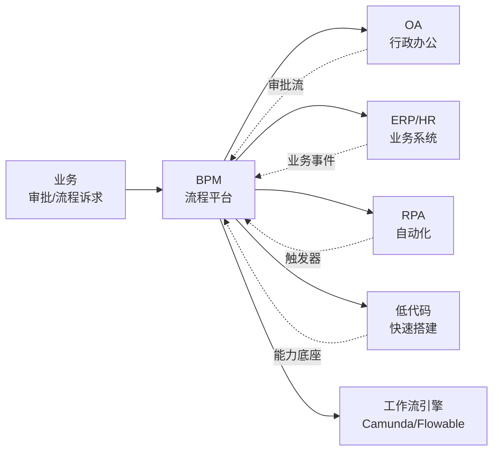
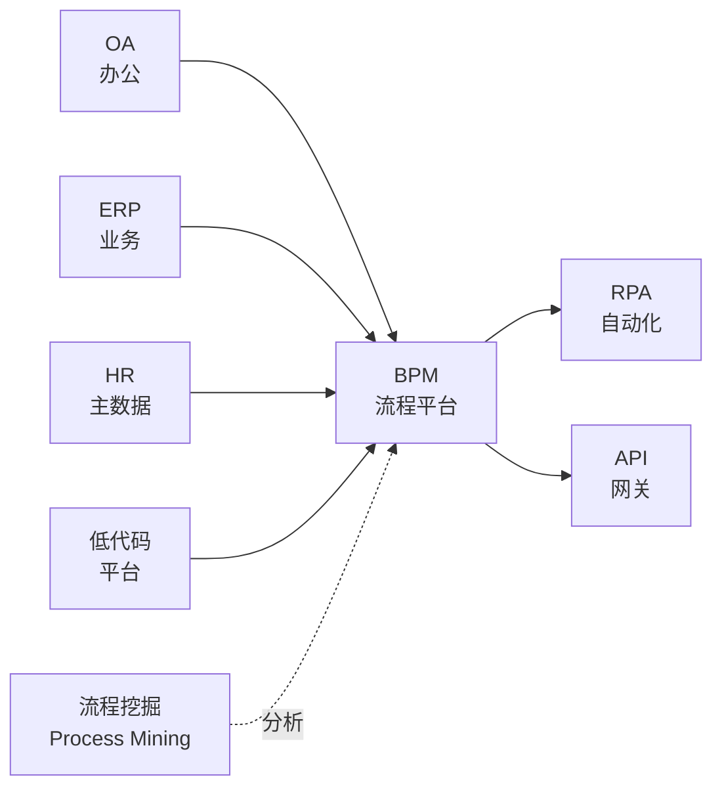

<!--
module:
  parent: application-systems
  slug: application-systems/05-operations/bpm
  type: article
  category: 主模块子文章
  summary: BPM（Business Process Management 业务流程管理） 一句话定位：通过可视化流程设计器 + 规则引擎 + 表单引擎 + 集成能力，把企业"跨系统、跨部门、跨角色"的业务流程（审批/业务流/编排）从纸面/邮件/Excel 升级为可建模、可监控、可优化的运行中资产。
  depth: ⭐⭐⭐⭐⭐
-->

# BPM（Business Process Management 业务流程管理）

> 一句话定位：通过**可视化流程设计器 + 规则引擎 + 表单引擎 + 集成能力**，把企业「跨系统、跨部门、跨角色」的业务流程（审批 / 业务流 / 编排）从纸面/邮件/Excel 升级为**可建模、可监控、可优化**的"运行中资产"，是企业流程从"管结果"走向"管过程"的核心平台。

## 📌 全景图

BPM 在企业 IT 架构中扮演「流程总线 + 编排中枢」角色——既向上承接业务审批诉求，也向下与 OA/ERP/HR/RPA/低代码 协同，把零散的审批、规则、自动化串成可治理的"流程资产"。

## 📖 定义

BPM（Business Process Management 业务流程管理）是以**流程建模（Model）+ 流程自动化（Automate）+ 流程监控（Monitor）+ 流程优化（Optimize）** 为主线的企业级平台，核心目标是让"流程"从隐性经验转为显性资产。

**BPM 与 BPMN 的区分**：
- **BPMN（Business Process Model and Notation 业务流程建模标记）**：OMG（Object Management Group）于 2004 年发布的国际标准建模符号（2011 年发布 BPMN 2.0）。BPMN 是"语言"，用于画图建模（流程图）
- **BPM（业务流程管理）**：业务管理学科 + 软件平台的统称，强调"建模 + 自动化 + 监控 + 优化"全闭环
- **Workflow Engine（工作流引擎）**：BPM 的"执行核心"，负责按 BPMN 定义运行流程实例（开源代表：Camunda Zeebe/Flowable/Activiti/jBPM）

**历史演进**：
- **1970s-1990s**：流程管理以"纸质表单 + 邮件流转"为主，IT 系统只做记录（ERP/CRM 内嵌审批流）
- **2000s**：BPM 概念兴起，BPMN 1.0（2004）/BPMN 2.0（2011）标准化；早期厂商： Lombardi（被 IBM 收购）、Pega、Appian
- **2010s**：BPM 平台化（开源：Activiti/jBPM），与 SOA/微服务集成；BPM 与 OA、Case Management（案例管理）融合
- **2020s**：低代码时代——BPM 与低代码平台融合（钉钉宜搭/简道云/OutSystems/Mendix）；云原生 BPM 引擎（Camunda 8 Zeebe / Go 重写）；BPM + AI（智能审批/智能流程挖掘 process mining）

**术语边界对比**：

| 系统 | 关注点 | 典型工具 |
|------|--------|---------|
| **OA** | 通用办公（流程 + 文档 + IM 一体化） | 泛微 e-cology / 致远 A8 / 钉钉审批 |
| **BPM** | 业务流程建模 + 跨系统编排（专业流程平台） | Camunda / Flowable / Pega / Appian |
| **Workflow Engine** | 流程执行引擎（BPM 的"底层执行核心"） | Camunda Zeebe / Flowable / Activiti / jBPM |
| **RPA** | 重复性操作自动化（机器人模拟点击） | UiPath / Automation Anywhere / 影刀 |
| **低代码** | 应用快速搭建（表单 + 流程 + 报表） | 钉钉宜搭 / 简道云 / 明道云 / OutSystems |

**与各系统的边界详解**：
- **vs OA**：OA 是"全员通用办公"（含流程审批 + 文档 + IM），BPM 是"专业流程平台"（更深的建模 + 集成 + 监控）。OA 内置轻量 BPM 引擎，深度业务流需要专业 BPM
- **vs Workflow Engine**：Workflow Engine 是 BPM 的"执行核心"——Camunda/Flowable 提供 BPMN 执行能力，BPM 平台还包含流程设计器、监控、运营治理等"管理层"
- **vs RPA**：BPM 编排"系统调用 + 业务规则 + 人机协作"，RPA 模拟"人工操作 UI"。BPM + RPA 互补：BPM 处理结构化业务流，RPA 处理非结构化操作
- **vs 低代码**：低代码是"应用搭建平台"（含表单 + 流程 + 报表），低代码内置轻量 BPM 引擎。专业 BPM 平台（如 Pega/ Appian）通常也提供低代码能力

**BPM 不擅长的领域**：纯行政办公（OA）、人力资源专业流程（HR）、客户运营（CRM）、车间执行（MES）、财务核算（ERP）。

**在企业 IT 架构中的位置**：BPM 是企业"流程总线 + 编排中枢"——向上承接 OA 行政流程、ERP 业务事件、HR 入离职流程，向下与 RPA 协作、与低代码融合、与 API 网关集成。Gartner 将 BPM 平台与 LCAP（Low-Code Application Platform 低代码应用平台）合并为统一魔力象限，强调"流程 + 应用"一体化趋势。BPM 的"流程数据 + 审批主数据"是仅次于客户/物料的第三大流程主数据。

**典型数据量级**：成熟 BPM 平台的数据量通常在 **100GB-5TB** 区间（量级参考，取决于流程规模与历史积累）。流程定义、流程实例历史、审批记录、SLA 数据是主要占用项；活跃用户从百人到上万人（典型中小企业 500-3000，大型集团 10000-50000）。日均流程实例量在万-百万级，年度历史实例在千万到亿级。

## 🔧 核心能力

- **流程设计器（Process Designer）**：BPMN 2.0 可视化建模（拖拽式）、版本管理、模拟测试
- **规则引擎（Rule Engine / DMN）**：DMN（Decision Model and Notation 决策建模标记）业务规则可视化、与流程解耦
- **表单引擎（Form Engine）**：可视化表单设计、自适应 PC/移动端、字段权限、数据回填
- **集成能力（Integration）**：REST/SOAP/Web Service、消息队列（Kafka/RabbitMQ）、连接器（SAP/Oracle/Salesforce/钉钉宜搭）
- **用户与组织（Identity）**：单点登录（SSO）、组织架构同步、角色权限模型、委派代理
- **流程监控（Monitoring）**：实时仪表盘、SLA 监控、超时预警、流程瓶颈分析
- **流程挖掘（Process Mining）**：从历史数据回溯流程实际执行路径，发现偏差与优化点
- **案例管理（Case Management / CMMN）**：CMMN（Case Management Model and Notation 案例管理建模）处理非结构化、知识密集型流程
- **版本管理（Versioning）**：流程定义版本化、灰度发布、回滚能力
- **API 与开放（API & Extensibility）**：REST API、嵌入 SDK、自定义节点、Webhook
- **AI 增强（AI）**：智能审批（OCR/NLP）、流程挖掘（process mining）、智能问答、AI 节点

**「流程设计器 + 规则引擎 + 表单引擎 + 集成」四大金刚**：BPM 平台最核心的四大组件，所有功能都建立在此之上：

**1. 流程设计器（Process Designer）**：
- **BPMN 2.0 标准建模**：User Task（用户任务）/Service Task（服务任务）/Gateway（网关：排他/并行/包容）/Event（事件：开始/结束/中间/定时/错误）
- **可视化拖拽**：业务人员可拖拽节点、画泳道（Swimlane）、定义分支与合并
- **流程模拟（Simulation）**：设计阶段模拟流程耗时、资源占用、瓶颈分析
- **版本管理**：流程定义支持多版本，灰度发布与回滚
- **协作建模**：多人协同设计同一流程、版本对比、变更审计

**2. 规则引擎（Rule Engine / DMN）**：
- **业务规则与流程解耦**：规则变更不需要改流程（如"金额>10 万需 CFO 审批"规则可独立维护）
- **DMN 标准建模**：决策表（Decision Table）/决策树/表达式求值
- **规则热更新**：规则上线不影响在途流程实例
- **规则审计**：规则变更留痕、规则命中率统计
- **典型引擎**：Drools（KIE）/ Camunda DMN / OpenL Tablets / Easy Rules

**3. 表单引擎（Form Engine）**：
- **可视化表单设计**：拖拽字段、字段联动、校验规则、权限控制
- **多端适配**：PC/移动端/小程序自适应，PC 与移动端共用一份表单定义
- **数据回填**：表单字段可从业务系统自动回填（如"申请人姓名/部门/工号"自动取 HR 主数据）
- **电子签名 / 电子签章**：合规要求（电子签名法 / eIDAS）
- **表单数据回写**：表单数据写入业务系统（通过 API 或连接器）

**4. 集成能力（Integration）**：
- **REST/SOAP/Web Service**：调用业务系统 API（ERP/HR/CRM/SAP）
- **连接器（Connector）**：预置 SAP/Oracle/Salesforce/钉钉/企业微信连接器
- **消息队列集成**：Kafka/RabbitMQ 异步事件驱动
- **事件触发**：定时器（Timer）/ 消息事件（Message Event）/ 信号事件（Signal Event）/ 错误事件（Error Event）
- **嵌入式 vs 独立部署**：嵌入式（BPM 与应用共部署）/ 独立部署（BPM 作为独立服务，REST API 调用）

**「流程监控 + 流程挖掘」双轮驱动**：现代 BPM 不只是"运行流程"，还要"看清流程运行"，监控与挖掘是 BPM 闭环的关键：

**1. 流程监控（Monitoring）**：
- **实时仪表盘**：在途流程数、平均耗时、积压节点、SLA 达成率
- **SLA 监控**：超时预警（即将超时 / 已超时）、升级路径配置
- **瓶颈分析**：哪个节点停留最久、哪个审批人最慢
- **多维度钻取**：按部门/流程类型/申请人/审批人/时间段下钻
- **主动通知**：短信/邮件/钉钉/企微推送超时告警

**2. 流程挖掘（Process Mining）**：
- **从历史日志反推实际路径**：基于事件日志（event log）回溯"流程实际怎么跑的"
- **路径偏差发现**：识别"未按标准路径执行"的案例（如跳过审批节点）
- **合规审计**：审计流程遵循度（SOX / 银保监合规）
- **自动化发现**：基于事件日志自动构建流程图（discover）
- **代表性工具**：Celonis / Minit / Disco / ProM / UiPath Process Mining / Apache Kafka + 自研

**「案例管理（CMMN）」的非结构化补充**：BPMN 适合"可预测流程"，CMMN 适合"知识密集型非结构化流程"（如理赔、客服工单、信贷审批）：
- **CMMN（Case Management Model and Notation）**：OMG 2014 年发布的案例管理标准
- **典型场景**：保险公司理赔（不可预测路径，每个案件不同）、银行信贷审批、医院诊疗流程
- **核心能力**：动态任务规划、文档驱动、规则触发、人工协作
- **代表平台**：Pega / Appian / Flowable（同时支持 BPMN + CMMN + DMN）

**「低代码 + BPM」融合趋势**：2020 年代以来，BPM 与低代码平台（LCAP）边界模糊——低代码平台内置 BPM 引擎（表单 + 流程 + 审批）作为基础能力，专业 BPM 厂商也推低代码能力：
- **低代码内置 BPM**：钉钉宜搭 / 飞书多维表格 / 简道云 / 明道云 / 轻流
- **BPM 厂商低代码化**：Appian / Pega / 微软 Power Apps（含 BPMN）
- **决策**：纯表单审批需求（请假/报销）→ 低代码；深度业务编排（跨系统集成）→ 专业 BPM

**按 BPM 成熟度分级的功能深度**（行业参考框架）：
- **L1 基础**：简单审批流（请假/报销/用印，固定路径）
- **L2 标准**：动态分支 + 规则引擎 + 表单设计（业务规则可视化）
- **L3 高级**：跨系统集成 + 监控分析 + 版本管理（中等复杂度业务流）
- **L4 卓越**：CMMN + Process Mining + 嵌入式流程（知识密集型行业）
- **L5 智能化**：AI 智能审批 + 自然语言流程 + 数字流程孪生

按企业关注度排序，BPM 最常被列为「核心采购理由」的前 5 项是：流程标准化、跨系统打通、SLA 监控可视化、移动端体验、与 OA/RPA 集成。

## 📊 关键模块详解

### 流程设计器（Process Designer）

流程设计器是 BPM 的"入口"，决定建模效率与上手成本：
- **BPMN 2.0 合规**：标准符号（开始/结束/任务/网关/事件）+ XML 序列化
- **拖拽式建模**：业务人员（非程序员）即可上手画流程
- **泳道（Swimlane）**：按角色/部门划分泳道，明确"谁负责什么"
- **子流程（Sub-Process）**：嵌套子流程复用，支持多级嵌套
- **流程模拟**：设计阶段模拟运行，预测耗时与资源占用
- **版本对比**：可视化对比新旧版本差异
- **导入导出**：BPMN 2.0 XML 互导（Camunda Modeler / bpmn.io / Yaoqiang BPMN Editor）
- **核心难点**：复杂分支（嵌套网关）、异步等待、长流程实例（持续数月）、循环与补偿

### 规则引擎（Rule Engine / DMN）

规则引擎让"业务规则变更"不依赖"流程改造"，是 BPM 灵活性的关键：
- **DMN 1.1/1.2/1.3 标准**：决策表 / 决策树 / 表达式求值（FEEL 表达式）
- **规则可视化**：表格化编辑规则（条件列 + 结果列），业务人员可读
- **规则版本管理**：规则支持多版本，热加载不影响在途实例
- **规则集（RuleSet）**：规则可分组、按场景激活
- **复杂事件处理（CEP）**：基于事件流实时触发规则（如"连续 3 次失败触发告警"）
- **规则审计**：规则变更留痕、规则执行命中率/失败率统计
- **典型场景**：信贷审批（按金额/客户评级自动判定审批路径）、保险理赔（按损失类型计算赔付比例）、合规审查（按地区法规自动判定）

### 表单引擎（Form Engine）

表单引擎是 BPM 的"交互层"，决定用户体验与数据准确性：
- **可视化设计**：拖拽字段、布局、校验、权限
- **字段类型**：文本/数字/日期/下拉/附件/富文本/手写签名/OCR
- **字段联动**：字段 A 选值决定字段 B 显示/隐藏/必填
- **数据回填**：从业务系统拉取数据（HR 工号/客户名称/物料编码）
- **多端适配**：PC/移动端/小程序共用一份表单
- **电子签章**：合规电子签名（电子签名法 / eIDAS / FDA 21 CFR Part 11）
- **业务数据回写**：表单提交后把数据写入业务系统（API/数据库/消息队列）

### 集成能力（Integration）

集成能力决定 BPM 与企业 IT 生态的"连接深度"：
- **REST/SOAP/Web Service**：现代系统主流通用接口
- **连接器（Connector）**：预置业务系统连接器（SAP/Oracle/Salesforce/钉钉/企业微信）
- **消息队列集成**：Kafka/RabbitMQ 异步事件，支撑高并发与解耦
- **事件驱动架构**：外部事件触发流程实例（"销售订单创建 → 自动启动合同审批流程"）
- **嵌入式调用**：把流程引擎嵌入到应用中（Spring/Java/.NET SDK），应用直接驱动流程
- **API 网关**：BPM 作为 API 编排者（编排多个微服务 API 为一个业务流程）
- **主数据集成**：与 HR/ERP 集成组织/用户/角色主数据

### 流程监控与挖掘（Monitoring & Mining）

监控与挖掘是 BPM 闭环的"反馈层"：
- **实时仪表盘**：在途流程数、平均耗时、SLA 达成率、积压节点
- **SLA 管理**：超时阈值配置、升级路径、主动通知（短信/IM）
- **多维度分析**：按部门/流程类型/申请人/审批人/时间段下钻
- **瓶颈识别**：识别流程中"卡点"（最慢节点、最高积压节点）
- **流程挖掘（Process Mining）**：从历史日志反推实际路径，识别偏差与优化点
- **合规审计**：审计流程遵循度（SOX 法案 / 银保监合规 / 等保要求）
- **典型平台**：Celonis（领导厂商）/ Minit / Disco / UiPath Process Mining

### 案例管理（Case Management / CMMN）

CMMN 处理"非结构化、知识密集型"流程，与 BPMN 互补：
- **CMMN 标准**：2014 年 OMG 发布，与 BPMN 互补
- **核心场景**：保险理赔（每个案件不同路径）、银行信贷审批、医院诊疗、客服工单
- **动态任务**：任务由规则/事件/人工触发，路径不可预测
- **文档驱动**：流程推进基于文档内容（如"看到损失照片触发定损任务"）
- **协作中心**：多角色协作（理赔员/审核员/外部专家）、委派/会签
- **代表平台**：Pega / Appian / Flowable（同时支持 BPMN + CMMN + DMN）

### 用户与权限（Identity & Access）

身份与权限是 BPM "谁能看/谁能批"的基础：
- **组织架构同步**：与 HR / OA 同步组织/用户/角色（事件驱动 / 定时批处理）
- **单点登录（SSO）**：OAuth2 / SAML / LDAP / 钉钉/企微扫码登录
- **角色权限模型**：RBAC（基于角色）/ ABAC（基于属性）/ 数据级权限（字段级/记录级）
- **委派代理**：审批人出差/请假时委派给他人（避免流程卡死）
- **会签 / 加签**：多人审批（全部通过 / 任一通过 / 比例通过）
- **越级审批 / 流程跳转**：特殊场景下绕过标准路径（需审计留痕）

### 版本管理与运营（Versioning & Operation）

版本管理是 BPM "安全变更"的关键：
- **流程定义版本**：每次发布生成新版本，不影响运行中实例
- **灰度发布**：新旧版本并行，按比例切换流量
- **回滚**：异常时一键回滚到历史版本
- **环境隔离**：开发 → 测试 → UAT → 生产，多环境部署
- **变更审计**：所有流程定义变更留痕（谁/何时/改了什么）
- **部署自动化**：CI/CD 集成（Git 仓库 + Jenkins/GitLab CI 部署流程定义）

## 🏆 选型决策

### 自研 vs 商用 vs 开源

| 维度 | 自研 BPM | 商用 BPM | 开源 BPM（Camunda/Flowable 等） |
|------|---------|---------|-------------------------------|
| 适用规模 | 大型集团（万人以上）有定制深度需求 | 中大型企业（百-千人），快速上线 | 中型以上企业，有自研团队 |
| 优势 | 100% 定制化、深度业务绑定 | 产品成熟、行业最佳实践、运维保障 | 成本可控（License 免费）、代码可见可改、生态丰富 |
| 劣势 | 投入大（千万级+）、周期长（2-3 年+）、合规风险 | 贵（年订阅人均几百到几千）、定制受限（10-15%） | 需自建实施/运维能力、二次开发成本不可控 |
| 典型代表 | 阿里/字节/华为自研 BPM | Pega / Appian / Oracle BPM / IBM BPM | Camunda 8 / Flowable / Activiti / jBPM / 钉钉宜搭 |
| 决策阈值 | 万人 + 特殊行业流程 + 10 年+ 自研投入 → 自研；否则 → 商用/开源 | - | 有 Java/集成能力 + 中等复杂度 → 开源主流选择 |

### 主流平台对比

| 平台 | 定位 | 优势 | 劣势 | 适用规模 |
|------|------|------|------|---------|
| **Camunda 8**（Zeebe） | 云原生 BPMN 引擎 + 平台 | 云原生（Go 重写）、高并发、Kubernetes 原生、微服务编排、生态最丰富 | 学习曲线陡、中文文档较少、商业版按实例计费 | 大型互联网/云原生企业 |
| **Camunda 7**（Platform） | Java 嵌入式 BPMN 引擎 | Java 生态最成熟、社区活跃、与 Spring Boot 集成友好 | 偏传统企业、云原生适配弱于 Zeebe | 中大型 Java 企业 |
| **Flowable** | BPMN + CMMN + DMN 三合一 | 同时支持三种标准、开源、文档好、与 Alfresco 集成 | 社区热度弱于 Camunda、商业化弱 | 需要 CMMN 的复杂场景 |
| **Activiti** | jBPM 演进、轻量 BPMN | 与 Spring 集成好、阿里/中间件企业常用 | 维护节奏放缓、社区降温 | 遗留系统/轻量 BPM 需求 |
| **jBPM（Red Hat）** | 知识型 BPM + Drools 规则引擎 | 与 Drools/KIE 集成强、企业级稳定 | UI 偏传统、上手成本高 | 大型金融/制造企业 |
| **Pega** | 全球 BPM 平台领导者（CRM + BPM） | 行业最佳实践深、低代码强、AI 强 | 极贵（人均数千美元/年）、学习曲线陡 | 跨国集团/大型企业 |
| **Appian** | 低代码 + BPM + RPA 一体化 | 一站式（流程 + 应用 + 自动化）、合规强 | 贵、中国本地化弱 | 中大型/合规要求高的行业 |
| **Oracle BPM** | Oracle 生态 BPM | 与 Oracle ERP/DB 集成、跨国合规 | 实施贵、生态封闭 | Oracle 客户/大型集团 |
| **IBM BPM / BAW** | 传统 BPM 巨头 | 行业沉淀深、与传统系统集成 | UI 偏传统、上手难 | 金融/大型集团 |
| **钉钉宜搭 / 飞书多维** | 低代码 + 审批（中国 SaaS） | 钉钉/飞书生态原生、移动端好、价格低 | 深度集成弱、专业建模能力弱 | 中小企业 / 钉钉飞书深度用户 |
| **泛微 e-cology** | 国内 OA + BPM 龙头 | 与 OA 深度集成、行业案例多、本地化 | BPM 专业性弱于国际厂商 | 大型集团 / 国企 |
| **致远互联 A8** | 国内 OA + BPM | 与 OA 集成、政府市场强 | BPM 专业性弱于国际厂商 | 中大型集团 / 政府 |
| **简道云 / 明道云 / 轻流** | 国内低代码 + 轻 BPM | 平民化、价格低、上手快 | 复杂流程建模能力弱 | 中小企业 / 业务部门自建 |

### 选型决策树（5 层）

1. **先看场景复杂度**：简单审批（请假/报销/用印）→ OA / 低代码（钉钉宜搭/简道云/泛微）；中等业务流（销售合同/采购审批/信贷审批）→ 开源 BPM（Camunda/Flowable）或 SaaS BPM；知识密集型（理赔/诊疗）→ 专业 BPM（Pega/Appian/Flowable）
2. **再看集成深度**：纯内部流程 + 少量外部系统 → 开源 BPM 自集成；需与 SAP/Oracle/Salesforce 深度集成 → 商用 BPM + 预置连接器
3. **再看组织能力**：有 Java 团队 + 愿意自建 → Camunda/Flowable（开源生态）；无技术团队 → SaaS（Pega/ Appian/钉钉宜搭）
4. **再看预算与 TCO**：5 年 TCO 在 100 万以下 → 开源或国内 SaaS；100-500 万 → 国际 SaaS 或国内商用；500 万+ → Pega / 自研
5. **最后看合规与行业**：金融/医疗/制药 → Pega / Appian / 行业专用 BPM；互联网/制造业 → Camunda / 国内商用；跨国合规 → Pega / Appian

## 🚨 实施陷阱 / 反模式

### 1. 流程蔓延（Process Sprawl）陷阱

**现象**：BPM 上线 2-3 年后，流程数量爆炸——500+ 流程定义、90% 流程没人维护、版本混乱、相似流程到处复制，新员工找不到"正确路径"。
**根因**：没有"流程生命周期管理"——任何人都能画流程、没人负责下线老流程、流程命名混乱。
**规避**：建立"流程 Owner 制度"——每个流程必须有 Owner（业务部门 + IT 共担），Owner 负责流程的"出生 / 变更 / 下线"全生命周期；定期清理（每季度）"僵尸流程"（90 天无实例）；流程命名规范（`domain.process-name`，如 `finance.expense-claim`）；流程中心 / 流程门户（员工能搜到流程定义）。

### 2. 版本管理失控陷阱

**现象**：BPM 上线后，流程"改了无数次"，老流程实例还在跑老逻辑，审计发现"同一审批单走两套规则"；版本 100+ 个，找不到稳定版本。
**根因**：版本管理缺失——每次修改直接覆盖，没有版本号、没有灰度、回滚难。
**规避**：每次发布都生成新版本（语义化版本 `v1.0.0`）；运行中实例仍跑创建时的版本，新实例走新版本；灰度发布（按部门/比例切换）；保留 ≥3 历史版本可回滚；流程定义 Git 化（YAML / XML 进 Git），用 CI/CD 部署。

### 3. 性能瓶颈陷阱

**现象**：BPM 上线 1 年后，遇到大促/月底，流程实例数量从 1 万涨到 50 万，引擎卡顿、SLA 监控失真、审批人抱怨"卡死了"。
**根因**：BPM 引擎是基于"事件溯源（Event Sourcing）"架构（特别是 Camunda Zeebe），历史实例逐步累积；没有历史归档策略；高并发场景（如全员月度报销）未做性能测试。
**规避**：分级历史归档（运行中 / 已完成 / 归档），完成后 90 天归档到数仓；大促前做容量评估（实例/天 → 引擎节点数）；异步优先（不阻塞主流程）；慢节点监控 + 预警；定期清理测试实例。

### 4. 与 OA / RPA 边界混乱陷阱

**现象**：BPM 上线后，OA 和 BPM 都做"流程审批"，OA 流程和 BPM 流程重复（同一个报销申请，可能走 OA 也可能走 BPM）；BPM 试图替代 OA 做所有事，结果"OA 审批"和"业务审批"都做不好。
**根因**：BPM / OA / RPA 边界不清——三者都能"做流程"，但定位不同。
**规避**：明确边界——OA 管"行政办公"（请假/报销/用印/印章/公文/会议），BPM 管"跨系统业务流"（销售订单 → 合同审批 → 财务开票 → 发货），RPA 管"重复 UI 操作"（跨系统数据搬运 / 报表生成 / 跨网站抓取）；OA 与 BPM 通过 API 集成（OA 发起 → 调 BPM 流程 / BPM 完成 → 通知 OA）。

### 5. 流程过度形式化陷阱

**现象**：BPM 上线后，业务部门为"上系统"强行画流程，结果"流程上线，业务不变"——员工照旧绕过系统走邮件/微信；流程审批流于形式。
**根因**：流程建模是"上系统"而非"优化流程"——把线下流程原样搬到线上，没解决实际痛点。
**规避**：流程建模前先做"流程梳理（L1-L4 流程架构）"——识别"问题流程"（耗时/出错/重复），对问题流程做"流程再造（BPR Business Process Reengineering）"；优先沉淀"问题流程"而非"全流程覆盖"；流程上线后做"流程评审"（线上 vs 实际预期）。

### 6. 跨组织数据不同步陷阱

**现象**：BPM 中"审批人"显示的是 3 个月前的组织架构，员工调岗后仍在 BPM 审批老部门单据；权限混乱，审计时找不到"为什么他能审批"。
**根因**：BPM 没有组织主数据，或组织数据同步滞后。
**规避**：BPM 不维护组织主数据——从 HR / OA 实时同步组织/用户/角色（事件驱动，分钟级同步）；BPM 只存"流程主数据"（流程定义 + 实例 + 历史）；定期校验（每月底对比 HR vs BPM 用户数）。

### 7. 缺乏 SLA 与超时监控陷阱

**现象**：BPM 上线后，流程积压无人感知——50% 流程超时，审批人无感知；CEO 投诉"流程慢"，但系统没有任何超时预警。
**根因**：BPM 配置只关注"流程跑得通"，没配置 SLA；超时无主动通知。
**规避**：每个流程必须配置 SLA（节点 SLA + 流程总 SLA）；超时主动通知（即将超时 / 已超时，多通道：IM/短信/邮件）；超时升级路径（一级超时 → 通知审批人；二级超时 → 通知审批人领导）；SLA 达成率纳入 KPI（业务部门领导审批及时率）。

### 8. 与低代码重复建设陷阱

**现象**：公司同时上了钉钉宜搭（低代码）和 Camunda（BPM），80% 流程两个平台都能做，IT 维护双份、员工困惑"我到底该用哪个"。
**根因**：BPM 与低代码重复采购，业务部门各自为政。
**规避**：明确分工——简单表单审批 → 低代码（钉钉宜搭 / 飞书 / 简道云），跨系统业务流 → BPM（Camunda / Flowable），复杂业务规则 / 高合规 / 微服务编排 → BPM + 规则引擎（DMN/Drools）；整合而非双轨（统一流程门户，员工一个入口访问）。

### 9. 流程挖掘缺失陷阱

**现象**：BPM 上线 3 年，运维只关注"流程不挂"，不关注"流程跑得好不好"——没人知道哪些流程是"走过场"（领导直接秒批）、哪些流程"用户绕路"（员工走非标准路径）、哪些流程"积压"。
**根因**：监控只看"系统指标"（CPU/内存/实例数），不看"业务指标"（实际耗时/通过率/瓶颈）。
**规避**：BPM 必须配置"业务监控"——流程平均耗时 / 通过率 / 超时率 / 积压节点 TOP10；引入 Process Mining（Celonis / 开源 Apromore），定期输出"流程健康报告"；流程健康度纳入 IT/业务部门 KPI。

### 10. 自研 BPM 烂尾陷阱

**现象**：某大型集团投资 8000 万自研 BPM，3 年后只完成审批流引擎，规则引擎/表单引擎/挖掘全部"烂尾"；被迫转向 Camunda/钉钉宜搭。
**根因**：BPM 是"行业沉淀 + 长期迭代"的产物——Camunda 沉淀了 15+ 年 BPMN 标准，Pega 沉淀了 30+ 年行业经验；自研 BPM 在"国际标准合规 + 生态集成"上难以匹敌。
**规避**：除非企业有"特殊行业流程"（如金融监管/军工制造）+ "长期投入承诺"（10 年 + 5 亿+），否则不推荐自研；深度业务流用"开源 BPM 二次开发（Camunda/Flowable）"，轻量化流用"低代码平台（钉钉宜搭/简道云）"。

### 陷阱共性规律

行业研究统计 BPM 项目失败/未达预期率约 **30-50%**（接近 ERP 与 HR），失败原因中：
- 约 **25%** 源自「流程蔓延 + 版本管理失控」（治理陷阱）
- 约 **20%** 源自「性能瓶颈 + 历史数据膨胀」（架构陷阱）
- 约 **15%** 源自「与 OA/RPA/低代码边界混乱」（定位陷阱）
- 约 **15%** 源自「流程过度形式化 + 业务不配合」（推广陷阱）
- 约 **10%** 源自「组织主数据不同步」（集成陷阱）
- 约 **10%** 源自「缺乏 SLA 监控 + 流程挖掘」（运营陷阱）
- 约 **5%** 源自「自研烂尾」（决策陷阱）

规避核心：「流程生命周期治理 + 版本管理与灰度 + 与 OA/RPA/低代码边界 + 流程梳理先行 + 组织主数据实时同步 + SLA 监控 + 不要轻自研」是 BPM 成功的 7 大前置条件。

## 🛤️ 学习路线

### 入门（0-3 个月，建立基础认知）

1. **第 1 周**：阅读 BPMN 2.0 标准 + OMG 规范（bpmn.io 入门文档），理解"流程图怎么画"
2. **第 2-3 周**：学习主流开源 BPM 引擎（Camunda Modeler 试用），画 3-5 个简单流程（请假/报销）
3. **第 4-6 周**：了解 DMN 标准（决策建模）+ CMMN 标准（案例管理），建立"流程 + 规则 + 案例"的全局认知
4. **第 7-9 周**：试用 1 个国内 SaaS BPM（钉钉宜搭 / 简道云）和 1 个开源 BPM（Camunda），对比"低代码 vs 专业 BPM"差异
5. **第 10-12 周**：研究 1-2 个真实企业 BPM 案例（如某保险理赔 BPM、某银行信贷审批 BPM）

### 进阶（3-12 个月，深度技能）

1. **3-6 个月**：选择一个开源 BPM（Camunda 8 / Flowable）做深度研究——REST API + Spring Boot 集成 + 嵌入式调用 + DMN 规则
2. **6-9 个月**：参与 1 个 BPM 实施项目，从流程梳理 → 流程建模 → 集成开发 → 测试上线全流程
3. **9-12 个月**：学习流程挖掘（Process Mining）基础，能用 Celonis / Apromore / 自研工具产出"流程健康报告"

### 精通（12 个月以上，专家级）

1. **12-24 个月**：主导 1 个企业级 BPM 实施（≥ 100 流程 / 10+ 业务系统集成），覆盖流程治理、版本管理、性能调优、SLA 监控
2. **24-36 个月**：建立 BPM 选型方法论（决策树 / RFP 模板 / POC 脚本），成为公司 BPM 选型的"内部顾问"
3. **36 个月+**：横向扩展到"流程智能化"——BPM + AI（智能审批/OCR/NLP）、BPM + Process Mining、BPM + RPA（编排自动化）、BPM + 低代码平台（流程应用一体化）

### 学习资源

- **标准规范**：BPMN 2.0 / DMN 1.3 / CMMN 1.1（OMG 官网）
- **书籍**：《BPMN Method & Style》《Workflow Patterns》《BPM 行业实践》《Process Mining》
- **平台**：Camunda 官方文档 / Flowable 官方文档 / Pega Academy / Appian Learning
- **社区**：Camunda Forum / bpmn.io 社区 / 钉钉宜搭开发者社区 / 中国 BPM 联盟
- **认证**：OCEB（OMG Certified Expert in BPM）/ Camunda Certified Developer / Pega Certified System Architect / Appian Certified Developer

## 🔗 上下游关系

- **上游**：OA（行政办公审批）、ERP/HR（业务事件触发）、外部系统（通过 API/消息队列发起流程）
- **下游**：RPA（自动化执行环节）、业务系统（流程完成后数据回写）、API 网关（流程作为 API 编排者对外暴露）
- **横向**：低代码平台（应用 + 流程一体化）、流程挖掘（流程健康分析）、规则引擎（独立 DMN 服务）

**集成要点**：

- **BPM ↔ OA**：OA 发起行政类流程（请假/报销），BPM 处理跨部门业务流（合同审批/项目立项）；OA 通过 API 调用 BPM，BPM 完成回写 OA 状态
- **BPM ↔ ERP/HR**：ERP/HR 是"业务事件源"（订单创建/员工入职），事件触发 BPM 启动流程；BPM 完成审批后回写业务结果到 ERP/HR（如合同审批完成 → ERP 创建销售订单）
- **BPM ↔ RPA**：BPM 编排"系统可调用"的部分，RPA 处理"系统无法 API 调用"的部分（老系统 UI 自动化）；BPM 节点可调用 RPA Bot（Bot 完成后回调 BPM）
- **BPM ↔ 流程挖掘**：流程挖掘从 BPM 历史日志中分析实际执行路径，识别偏差与瓶颈；挖掘结果反馈给 BPM 设计师做优化
- **BPM ↔ 规则引擎（独立 DMN）**：DMN 规则独立部署为微服务，BPM 流程节点通过 REST 调用；规则变更不影响流程
- **BPM ↔ API 网关**：BPM 编排多个微服务 API 为一个端到端业务流程；流程作为 API 编排者，对外暴露"BPM API"

**集成模式选择**：
- **同步调用（REST）**：BPM 流程节点直接调用业务系统 API（适合低延迟、强一致性场景）
- **异步消息（Kafka）**：BPM 通过消息队列异步触发/接收事件（适合高并发、解耦场景）
- **事件驱动**：业务系统发布事件 → BPM 订阅事件启动流程（适合事件源架构 EDA）
- **嵌入式调用**：BPM 引擎嵌入到应用中，应用直接驱动流程实例（适合单体应用）
- **API 编排**：BPM 引擎作为 API 编排者（API Orchestration），串联多个微服务为端到端流程

## ⚖️ 关键考量

- **场景复杂度决定一切**：简单审批用 OA/低代码，深度业务流用专业 BPM；选错平台 = 50% 投资浪费
- **BPMN 标准合规**：选用支持 BPMN 2.0 的引擎（Camunda/Flowable），避免被厂商私有符号锁定
- **流程治理先于技术**：没有"流程 Owner 制度"和"流程生命周期管理"，BPM 必然走向"流程蔓延"
- **组织主数据必实时同步**：BPM 是审批引擎，组织架构必须从 HR/OA 实时同步，不能维护独立组织数据
- **SLA 与超时监控是底线**：没有 SLA 监控 = 流程积压无人感知；SLA 配置应该像"表单"一样必填
- **跨系统集成是分水岭**：能跨多少系统（SAP/Oracle/Salesforce/钉钉/企微）决定 BPM 价值
- **不要忽视流程挖掘**：监控只是"当下"，挖掘才是"全局"——挖掘才能发现"走过场"和"积压"
- **自研 BPM 慎之又慎**：除非万人 + 特殊行业流程 + 长期投入，否则不推荐自研
- **与低代码互补不互斥**：低代码做"应用搭建"，BPM 做"流程编排"，两者通过统一流程门户集成

## 🎯 选型指南

| 企业类型 | 推荐 | 理由 |
|---------|------|------|
| 跨国集团（万人+） | Pega / Appian / Camunda 8（Zeebe） | 全球合规、微服务编排、行业沉淀 |
| 大型集团（5000+） | Camunda 7/8 / Flowable / 国内头部商用（泛微/致远） | Java 生态、复杂度适配 |
| 中型企业（500-5000） | Camunda / Flowable（开源）/ 钉钉宜搭 / 简道云 | 性价比、可控 |
| 小型企业（< 500） | 钉钉宜搭 / 飞书多维 / 简道云 / 明道云 | 快速上线、成本低、移动原生 |
| 金融/保险/医疗（合规要求高） | Pega / Appian / IBM BPM | 合规强、案例多、流程可审计 |
| 互联网/科技公司 | Camunda 8（Zeebe） / Flowable | 云原生、高并发、生态活跃 |
| 国企/政府 | 泛微 e-cology / 致远互联 A8 / 用友 NC BPM | 本地化、案例多、国产化 |
| 制造业 / 项目管理 | Flowable / Camunda / 钉钉宜搭 | 流程透明、版本治理 |

**自检维度**：
1. 是否支持 BPMN 2.0 / DMN / CMMN 国际标准？
2. 集成能力（SAP/Oracle/Salesforce/钉钉/企微连接器数）？
3. 组织主数据同步方案（HR/OA 集成 + 频率）？
4. SLA 配置与监控报警能力？
5. 版本管理与灰度发布能力？
6. 流程挖掘（Process Mining）能力或生态对接？
7. 行业案例与生态规模（Camunda/Flowable 全球案例 10000+ vs 商用厂商按行业对比）？

**红线**：
- 私有符号 / 不支持 BPMN 2.0 = 慎选（被厂商锁定）
- 无 SLA 监控 / 无超时预警 = 慎选
- 无流程挖掘能力或生态对接 = 落后一代
- 无主流业务系统连接器（SAP/Oracle/Salesforce） = 慎选
- 实施商无同行业案例 = 慎选

**RFP 模板要点**：建议 RFP 覆盖 **6 大类 35+ 评分项**：
- **功能类（25%）**：BPMN 2.0 合规、DMN 规则、CMMN、表单设计、规则引擎、API 网关/编排、流程挖掘、移动端
- **性能类（15%）**：并发流程实例数（万级到百万级）、单实例启动时间（<2 秒）、流程平均响应（< 1 秒）、历史归档能力
- **集成类（25%）**：SAP/Oracle/Salesforce/钉钉/企微 标准连接器、REST/SOAP/Kafka、嵌入式 SDK、自定义连接器开发能力
- **合规类（10%）**：电子签名法 / GDPR / SOX / 银保监 / 等保三级、审计日志、流程不可篡改
- **AI 类（10%）**：智能审批 / 流程挖掘 / 自然语言流程建模 / OCR / NLP
- **服务类（15%）**：行业最佳实践参考、客户案例数、社区活跃度、升级策略、SLA 承诺、实施伙伴能力

**TCO 估算要点**（1000 人企业 5 年 TCO）：
- **国际商用 BPM（Pega / Appian）**：800-3000 万（License 55% + 实施 30% + 集成 10% + 运维 5%）
- **国内商用 BPM（泛微/致远 + BPM 模块）**：300-800 万
- **开源 BPM（Camunda + 自建）**：100-300 万（实施占 50% + 集成占 40%）
- **低代码 BPM（钉钉宜搭 / 飞书）**：50-200 万
- **自研 BPM**：5000 万-1 亿 + 1000 万/年级运维

## ⚠️ 常见陷阱

- **「BPM = 流程审批」**：BPM ≠ 审批，BPM 是"流程编排 + 规则引擎 + 表单 + 集成"的复合平台。只做审批用 OA/低代码
- **「流程画完就完事了」**：画流程是起点，版本治理 / SLA 监控 / 流程挖掘 / 业务优化才是 BPM 的 70% 工作
- **「BPM 替代 OA」**：BPM 与 OA 各有所长——OA 强在通用行政办公，BPM 强在跨系统业务流，两者通过 API 互补不替代
- **「BPM 替代 RPA」**：BPM 编排可 API 调用的流程，RPA 处理系统无 API 的场景。BPM + RPA = 超自动化（Hyperautomation）
- **「Camunda 等于 BPM」**：Camunda 是工作流引擎之一（执行核心），BPM 平台还包括流程设计器、监控、运营治理等"管理层"
- **「自研 BPM 比开源好」**：自研 BPM 是"重复造轮子"——BPMN 2.0 标准 15+ 年沉淀，开源 Camunda/Flowable 已成熟。除非特殊行业，否则慎自研
- **「BPM 越复杂越专业」**：能用简单流程解决的不上复杂平台——能用 OA/低代码解决的，用 BPM 是过度设计
- **「流程越多越好」**：流程爆炸 = 治理失控；流程治理先于技术，建立"流程 Owner + 生命周期管理"才能避免蔓延

## 📚 参考来源

- **BPMN 2.0 标准**：OMG（Object Management Group），"Business Process Model and Notation (BPMN) Version 2.0"，2011 年发布的国际流程建模标准（https://www.omg.org/spec/BPMN/2.0/）
- **Gartner Intelligent Automation 魔力象限 2024**：Gartner, "Magic Quadrant for Intelligent Automation / LCAP / iBPMS"，Pega/Appian/Camunda/Mendix/OutSystems 等领导厂商权威参考（https://www.gartner.com）
- **Camunda 官方文档**：Camunda, "Camunda 8 Documentation"，云原生 BPMN 引擎（Zeebe + Operate + Tasklist + Optimize）权威参考（https://camunda.com/）
- **Flowable 官方文档**：Flowable, "Flowable BPMN / CMMN / DMN Engine"，同时支持三种 OMG 标准的开源引擎（https://www.flowable.com/）
- **Process Mining 领跑研究**：Wil van der Aalst 教授，"Process Mining: Data Science in Action"，流程挖掘领域开山之作，BPM 智能化的理论基础
- **《BPMN Method & Style》**：Bruce Silver，"BPMN Method and Style"，BPMN 建模经典实战指南
- **中国信通院《数字化转型业务流程管理白皮书》**：中国信通院，国内 BPM 行业实践与选型参考（2024）

---

← [返回: 业务应用系统](../../README.md)

## 📊 本节统计

- **核心能力**：11 大模块（流程设计器 / 规则引擎 / 表单引擎 / 集成 / 用户权限 / 监控 / 流程挖掘 / 案例管理 / 版本管理 / API / AI 增强）
- **四大金刚**：流程设计器 / 规则引擎 / 表单引擎 / 集成能力
- **双轮驱动**：流程监控 + 流程挖掘
- **CMMN 补充**：BPMN（结构化）+ CMMN（知识密集型）互补
- **BPM 成熟度分级**：5 级（L1 基础 / L2 标准 / L3 高级 / L4 卓越 / L5 智能化）
- **国际标准**：BPMN 2.0 / DMN 1.3 / CMMN 1.1（OMG）
- **典型场景**：8 类（跨国集团 / 大型集团 / 中型 / 小型 / 金融保险 / 互联网 / 国企政府 / 制造）
- **集成架构**：6 上下游（OA / ERP / HR / RPA / 低代码 / API 网关）+ 横向（流程挖掘 / 规则引擎）
- **集成模式**：5 类（同步 REST / 异步消息 / 事件驱动 / 嵌入式 / API 编排）
- **关键考量**：9 维度（场景复杂度 / BPMN 合规 / 流程治理 / 主数据 / SLA / 集成深度 / 流程挖掘 / 自研慎选 / 低代码互补）
- **选型自检维度**：7 项（BPMN/DMN/CMMN / 集成连接器 / 主数据 / SLA / 版本管理 / 流程挖掘 / 案例）
- **RFP 评分项**：6 大类 35+ 项（功能 25% / 性能 15% / 集成 25% / 合规 10% / AI 10% / 服务 15%）
- **TCO 估算**（1000 人）：国际商用 800-3000 万 / 国内商用 300-800 万 / 开源 100-300 万 / 低代码 50-200 万 / 自研 5000 万-1 亿
- **常见陷阱**：8 类（BPM ≠ 审批 / 治理先于技术 / 边界混乱 / 自研烂尾 / 过度设计 / 流程爆炸 / OCR/AI 噱头 / 私有符号锁定）
- **陷阱统计**：BPM 项目失败率 30-50%（25% 治理 / 20% 架构 / 15% 定位 / 15% 推广 / 10% 集成 / 10% 运营 / 5% 决策）
- **所属价值链**：05 运营管理
- 关联系统：OA（[OA 深读](../oa/README.md)）/ HR（[HR 深读](../hr/README.md)）/ ERP（[ERP 深读](../erp/README.md)）/ BI（[BI 深读](../bi/README.md)）/ MES（[MES 深读](../../02-production/mes/README.md)）/ CRM（[CRM 深读](../../04-sales-service/crm/README.md)）

