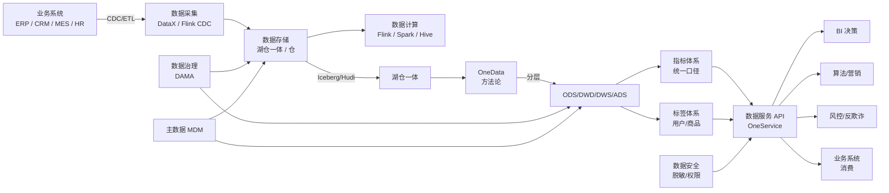
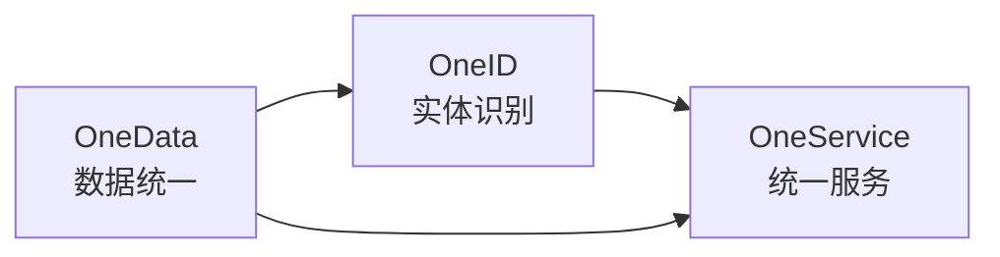
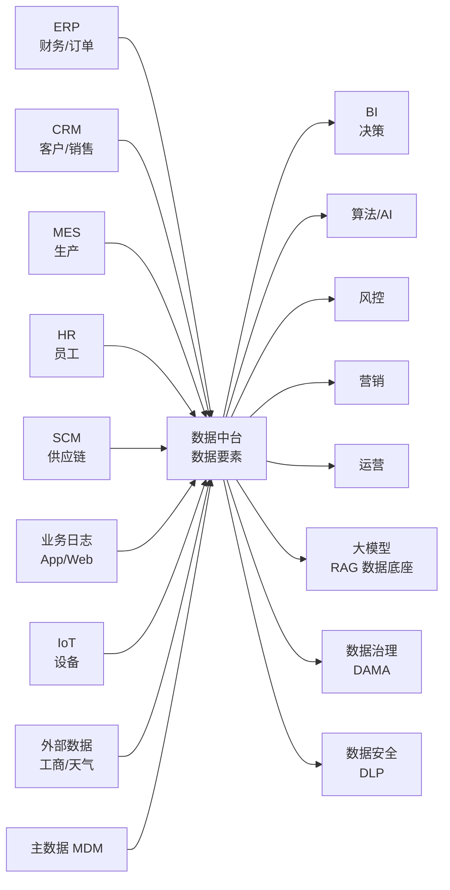

<!--
module:
  parent: application-systems
  slug: application-systems/05-operations/data-mesh
  type: article
  category: 主模块子文章
  summary: 数据中台（Data Middle Platform / Data Mesh / OneData） 一句话定位：把企业分散在 ERP / CRM / MES / 业务系统中的"数据资产"沉淀为可复用、可治理、可服务化的中台能力，让"同口径、同指标、同标签"的数据可被 BI / 营销 / 风控 / 算法等多种业务复用，是企业从"数据烟囱"走向"数据要素资产化"的核心基础设施。
  depth: ⭐⭐⭐⭐⭐
-->

# 数据中台（Data Middle Platform 数据中台 / Data Mesh / OneData）

> 一句话定位：把企业分散在 ERP / CRM / MES / 业务系统中的"**数据资产**"沉淀为**可复用、可治理、可服务化**的中台能力，让"同口径、同指标、同标签"的数据可被 BI / 营销 / 风控 / 算法等多种业务复用，是企业从"**数据烟囱**"走向"**数据要素资产化**"的核心基础设施，也是中国 2018-2026 年企业数字化转型的"明星赛道"。

## 📌 全景图

**数据中台在企业 IT 架构中的位置**：数据中台是"**数据要素的资产化层**"——上游接 ERP / CRM / MES / SCM 等业务系统（System of Record），通过 CDC/ETL 把数据"汇"到数据湖仓；中游通过 OneData 方法论对数据做"分层（ODS/DWD/DWS/ADS）+ 指标统一 + 标签建设"，让数据具备"可复用资产"形态；下游通过"**数据服务 API（OneService）**"把数据能力"暴露"给 BI、算法、风控、营销、运营等场景。数据中台不是"另一种 BI / 另一种数据仓库"——它是"**数据要素的资产化 + 服务化平台**"，与数据仓库（重在历史查询）/ 数据湖（重在原始数据存储）/ BI（重在可视化）/ MDM（重在主数据治理）共同构成企业数据栈的"四象限"。

## 📖 定义

数据中台（Data Middle Platform / Data Platform / OneData）是企业级"**数据要素资产化**"的工程方法论与平台体系——通过统一的数据采集、存储、计算、治理、服务化能力，把分散在 100+ 业务系统中的数据，沉淀为"**统一指标 / 统一标签 / 统一服务**"的可复用资产，让数据从"业务系统的副产品"升级为"**企业核心生产要素**"。

**数据中台 vs 中台战略**：中台战略（Middle Platform Strategy）由阿里 2015 年提出（含业务中台 + 数据中台 + 技术中台 + 组织中台），强调"**企业级能力复用**"——把通用的业务能力（会员、订单、支付、商品）和数据能力（指标、标签、画像）从"各业务线重复建设"升级为"集团统一中台"。数据中台是中台战略的"**数据切片**"，专管数据资产；业务中台专管业务能力复用。**中台 ≠ 数据中台**——中台包含业务中台 + 数据中台 + 技术中台 + 组织中台 4 大块。

**权威定义参考**：

- **阿里"中台战略"（2015-2026）**：2015 年阿里"中台战略"项目启动，把淘宝 / 天猫 / 1688 等 BU 的"会员 / 商品 / 交易 / 支付"等通用能力抽离为"**业务中台**"，把"数据采集 / 加工 / 服务"抽离为"**数据中台**"（即 OneData），覆盖 100+ 业务场景。阿里数据中台 v1（2015-2018）以"数据仓库 + 指标体系"为核心，v2（2018-2021）以"实时数据 + 标签 + 资产化"为核心，v3（2022-2026）以"**湖仓一体 + OneService + 大模型数据底座**"为核心
- **DAMA 数据管理知识体系（DMBOK）**：DAMA International，"Data Management Body of Knowledge (DMBOK)"，数据管理的国际权威框架；数据中台是 DMBOK 中"数据架构 + 数据治理 + 数据建模 + 元数据 + 主数据 + 数据安全 + 数据质量"等 11 大知识领域的"**工程化落地**"
- **《Data Mesh》（Zhamak Dehghani 2019 论文）**：ThoughtWorks 顾问 Zhamak Dehghani 在 2019 年提出"Data Mesh"概念，强调"**联邦式数据架构**"——打破中央数据团队"大一统中台"，把数据所有权归还"业务域（Domain）"，每个域自己拥有并发布"数据产品（Data Product）"。**Data Mesh 是对中央式数据中台的反思**，并非替代品，企业可"**双轨制**"（中央中台 + 域数据产品）
- **华为"数据中台"定义**：华为将数据中台定义为"**DataArts**"——基于"数据底座 + 数据治理 + 数据服务"的三层架构，覆盖 200+ 业务场景，是华为数字化转型的核心底座之一

**为什么需要数据中台**（行业痛点）：
- **数据烟囱**：企业每上一个新业务都建一套数据系统——A 业务有自己的数据仓库 / B 业务有自己的数据团队 / C 业务有自己的 BI 看板；**重复建设 + 数据不通 + 口径混乱**，**60%+ 数据团队工作时间花在"找数据 + 对口径"**（Forrester 调研：数据工程师 60% 时间做"数据搬运 + 口径对齐"，仅 40% 时间做"业务分析 + 价值产出"）
- **指标口径不一致**：同一个"GMV"指标，财务部门按"已发货"算、运营部门按"已下单"算、产品部门按"已支付"算；**指标口径不一致 = 决策混乱**，CEO 看 3 个"GMV"报表数据都不一样
- **数据服务能力薄弱**：业务部门要数据，找"数据团队"排期，2-3 个月才能拿到；**数据从"成本中心"沦为"瓶颈中心"**
- **数据资产无沉淀**：数据用完即弃，**复购率 < 10%**（同一份数据被 2 个团队加工 3 遍）；缺乏"数据资产化"机制

**数据中台解决方案**：通过"**OneData（统一数据）+ OneService（统一服务）+ OneID（统一实体识别）+ 数据治理 + 资产化运营**"5 大工程方法，把"数据烟囱"升级为"可复用数据资产平台"——**1 次采集 + N 次复用**、**统一指标 + 多业务消费**、**标签沉淀 + 多场景应用**。

**历史演进**：
- **2008-2015 数据仓库阶段**：Teradata / Oracle Exadata / IBM Netezza 大型机数据仓库；国内市场主要是"ERP 自带 BI 报表"，无"数据中台"概念
- **2015-2018 阿里中台战略**：2015 年阿里启动中台战略，把淘宝 / 天猫 / 1688 / 飞猪的"会员 / 商品 / 交易"等通用能力抽离为业务中台，把"数据仓库 + 指标 + 标签 + 服务"抽离为数据中台（OneData 体系）；2016 年阿里数据中台正式上线，覆盖 100+ 业务场景；2017 年开始对外商业化（阿里云 DataWorks）
- **2018-2021 数据中台爆发期**：2018 年阿里提出"**大中台、小前台**"战略；2019-2020 年国内"数据中台热"爆发——网易严选 / 华为 / 美的 / 海尔 / 招商银行 / 中国平安 / 字节跳动 / 美团 / 京东 / 拼多多 / 唯品会 / 小米等大型企业纷纷上数据中台，国内"数据中台厂商"超 50 家（阿里 DataWorks / 网易数据中台 / 滴普 / 数澜 / 微众 / 神策 / 袋鼠云 / 思迈特 / 永洪等）
- **2021-2023 估值泡沫与去泡沫**：2021 年国内"数据中台"赛道融资额超 100 亿；同年阿里"组织调整"导致 OneData 团队大动荡（"中台不香了"言论四起），市场对中台价值的怀疑上升；但**实际大型企业仍在持续投入**——美的、海尔、招行的数据中台建设从未停止
- **2024-2026 落地与理性回归**："数据中台"概念从"万能药"回归"基础设施"——头部企业（中台建设成熟）从"建设中台"转向"**用好中台**"（资产化运营 + 实时数据 + 湖仓一体 + OneService），中小企从"上中台"转向"**按需购买**"（数据采集服务 / 指标服务 / 标签服务）；同期 **Data Mesh（数据网格）** 概念兴起（更强调"去中心化 + 业务域自治"），与中央式数据中台并行；**2025-2026 主流**：**"中央中台 + 域数据产品"双轨制**成为大型企业的现实选择

**与各系统的边界**：

- **vs 数据仓库（Data Warehouse）**：**数据仓库是"中心化的历史存储"**（以"宽表"形式存储历史数据，用于长期分析与报表），强调"集中存储 + 历史分析"；**数据中台是"基于数据仓库的'能力复用平台'"**（含采集、加工、建模、服务化、资产化运营），强 调"1 次加工 + N 次复用"。**数据仓库是数据中台的"组件之一"**——数据中台通常基于湖仓一体（含数据仓库）构建；数据仓库"被动查询"，数据中台"主动服务"
- **vs 数据湖（Data Lake）**：**数据湖是"原始数据的低成本存储"**（HDFS / S3 / OSS + Parquet / ORC 存原始数据），强调"存得下 + 存得便宜"；**数据中台是"基于数据湖的'加工与服务'**"，强调"加工得动 + 服务得好"。**数据湖是数据中台的"存储底盘之一"**——数据中台常基于"湖仓一体"（含数据湖 + 数据仓库）构建
- **vs 湖仓一体（Lakehouse）**：**湖仓一体是"存算架构形态"**（把数据湖的廉价存储 + 数据仓库的强 ACID 事务合并），典型实现如 Apache Iceberg / Apache Hudi / Databricks Delta Lake；**数据中台是"数据能力平台"**（含采集 + 湖仓 + 计算 + 治理 + 服务 + 资产）。**湖仓一体是数据中台的"存储层"**——数据中台 2024-2026 主流存储架构
- **vs BI（商业智能）**：**BI 是"数据可视化 + 报表"工具**（Tableau / Power BI / FineBI），强调"看"——把数据"展示给管理者"；**数据中台是"数据资产的生产 + 服务"** 平台，强调"供"——把数据"服务化"给 BI、算法、营销、风控。**BI 是数据中台的下游消费者之一**——数据中台的指标 API / 标签 API 是 BI 的"数据源"
- **vs MDM（Master Data Management 主数据管理）**：**MDM 是"主数据治理"**（统一客户 / 商品 / 供应商 / 员工的主数据），典型如 SAP MDG / Informatica / 国内主数据治理平台，强调"主数据的唯一性 + 一致性"；**数据中台是"全量数据资产平台"**（含主数据 + 业务数据 + 日志数据 + 外部数据）。**MDM 是数据中台的"主数据治理组件"**——主数据治理好才能让数据中台"指标统一"
- **vs Data Mesh（数据网格）**：**Data Mesh 是"去中心化数据架构"**（Zhamak Dehghani 2019 提出），强调"业务域自治 + 数据产品化 + 联邦治理"；**数据中台（中央式）是"中心化数据架构"**，强调"统一建设 + 统一服务"。**Data Mesh 是数据中台的"反思与演进"**——2025-2026 越来越多大型企业采用"中央中台 + 域数据产品"双轨制

**典型数据量级**：成熟数据中台的数据量通常在 **10TB-10PB** 区间（小型企业 10-100TB，大型企业 1-10PB）。日均处理数据量在 GB-TB 级，年增量数十 TB 到数 PB；活跃用户从**数十人**（中央数据团队 + 业务分析师）到**上千人**（全集团业务 + 算法 + 风控）。指标数量从**数百到上万**（小型中台 500-2000 指标，大型中台 5000-20000 指标），标签数量从**数千到 10 万+**（用户标签 1000-10000，商品 / 内容 / 风控标签 10000+），数据服务 API 从**数十到上千个**（头部中台日均 API 调用 10 亿+）。

**为什么 2026 年数据中台仍是必备投资**（客户常问"AI / 湖仓一体来了数据中台是不是过时了"）：
1. **数据中台是 AI 模型的"燃料"**：大模型微调 / RAG / 智能体的"私有知识"都需要结构化数据资产，数据中台沉淀的"指标 + 标签 + 知识图谱"是 LLM 微调的关键原料；**没有数据中台，AI 模型只能用"原始文档 + 通用数据"**，无法做到"企业专属"
2. **数据中台是数据要素资产化的"基础设施"**：2024 年财政部 / 国家数据局发布"**数据要素 × 三年行动计划**"，明确"数据资产入表 / 数据交易 / 数据资产化"是国家战略；企业落地数据要素，**必须先有数据中台**（资产化 + 治理 + 服务）
3. **数据中台是"反数据烟囱"的唯一路径**：业务系统还在产生新数据（每年 20-30% 增长），不沉淀就永远"烟囱"；**数据中台是"长期资产积累 + 持续复用"**的过程
4. **数据中台与 Data Mesh 不是替代关系**：中央中台管"通用数据资产"（指标 / 标签 / 客户主数据），Data Mesh 管"域数据产品"（BU 专属）；二者**双轨制**而非互斥
5. **5-10 年数据中台仍是企业"数据底座"**：Gartner 2024 预测到 2028 年 **75% 大型企业将运行某种形态的数据中台 / Data Mesh / 域数据产品**——形态会演进，但"数据要素资产化"的方向不变

## 🔧 核心能力

**「采集 → 存储 → 计算 → 服务 → 治理 → 安全 → 资产 → 运营」八大能力模块**（阿里 OneData 体系）：

### 数据采集（Data Ingestion）

企业数据中台的"入口"，负责把 100+ 业务系统的数据"搬进"数据中台：

- **批量采集（Batch ETL）**：T+1 批量同步（DataX / Sqoop / Kettle），适合"历史数据 + 不紧急的业务数据"
- **实时采集（CDC Change Data Capture）**：基于 Binlog / Redo Log 的实时变更捕获（Flink CDC / Debezium / Canal / Maxwell），延迟从小时级降到秒级；**2025-2026 主流**：**实时数据采集占比从 20% 提升到 60%+**
- **日志采集（Log Collection）**：Flume / Logstash / Filebeat 采集应用日志
- **消息队列采集（MQ Ingestion）**：Kafka / RocketMQ / Pulsar 异步消息接入
- **API 采集（API Scraping）**：调用第三方 API 拉数据（天气 / 工商 / 司法 / 招投标）
- **文件采集（File Transfer）**：FTP / SFTP / 对象存储（OSS / S3）拉文件
- **爬虫采集（Web Crawler）**：爬取公开网页（招投标 / 竞品 / 舆情）
- **IoT 采集（IoT Ingestion）**：MQTT / CoAP 接入物联网设备数据

### 数据存储（Data Storage）

数据中台的"底盘"，决定数据存得下 / 存得便宜 / 查得快：

- **数据仓库（Data Warehouse）**：Hive / Doris / StarRocks / ClickHouse / Snowflake / Redshift（强 Schema + 强 ACID + 高查询性能）
- **数据湖（Data Lake）**：HDFS / OSS / S3 + Parquet / ORC（低成本 + 灵活 Schema + 海量存储）
- **湖仓一体（Lakehouse）**：Apache Iceberg / Apache Hudi / Databricks Delta Lake（湖的存储 + 仓的事务 / 仓的性能，**2024-2026 主流**）
- **实时数据存储（Real-Time Storage）**：Kafka / Pulsar / Flink State + HBase / TiDB（毫秒级延迟）
- **时序数据（Time Series）**：InfluxDB / TDengine / Prometheus（IoT / 监控场景）
- **图数据（Graph）**：Neo4j / NebulaGraph / JanusGraph（关系网络场景）
- **向量数据（Vector）**：Milvus / Pinecone / Qdrant（AI / RAG / 相似度检索场景）
- **冷热分层存储（Hot-Warm-Cold）**：Hot（Redis / HBase）/ Warm（Hive / Doris）/ Cold（OSS / 冰山归档），成本降低 50%+

### 数据计算（Data Processing）

数据中台的"引擎"，决定数据算得快 / 算得便宜：

- **离线计算（Batch Processing）**：Hive on MR / Hive on Tez / Spark SQL / Presto / Trino（小时 / 天级延迟）
- **实时计算（Stream Processing）**：Apache Flink / Apache Spark Streaming / Apache Beam（秒 / 毫秒级延迟）
- **交互式分析（OLAP）**：Doris / StarRocks / ClickHouse / Apache Druid（亚秒级响应，**应用最广**）
- **数据挖掘（Data Mining）**：Spark MLlib / Python scikit-learn / XGBoost
- **AI / 大模型计算**：PyTorch / TensorFlow / Hugging Face + GPU 集群
- **向量检索**：Milvus / Elasticsearch dense_vector / Pinecone（AI RAG 场景）
- **机器学习平台**：Alink / MLflow / Kubeflow / TFX
- **查询加速（Query Acceleration）**：ClickHouse / Doris / Apache Druid / StarRocks + 物化视图 + 索引

### 数据服务（Data Service / OneService）

数据中台的"出口"，把数据能力"暴露"给业务系统：

- **数据 API（Data API）**：REST API / GraphQL / gRPC，把数据"原子化"暴露
- **流式数据服务（Streaming Service）**：Kafka Topic / WebSocket / SSE，实时推送数据
- **数据集服务（Dataset Service）**：导出 CSV / Parquet / ORC 文件给业务系统
- **数据可视化服务（Chart Service）**：预渲染图表（PNG / SVG / Canvas）给前端
- **指标服务（Metric Service）**：指标统一口径 + 实时计算 + 下钻分析
- **标签服务（Tag Service）**：用户 / 商品 / 内容标签查询与人群圈选
- **OneService 统一网关**：阿里 OneService 模式——统一 API 网关 + 统一鉴权 + 统一限流 + 统一监控
- **订阅与推送**：业务系统订阅指标 / 标签变更（WebSocket / 消息队列）

### 数据治理（Data Governance）

数据中台的"宪法"，决定数据"管得好 / 信得过"：

- **元数据管理（Metadata Management）**：技术元数据 + 业务元数据 + 管理元数据，Atlas / DataHub / LinkedIn DataHub / Apache Gravitino
- **数据血缘（Data Lineage）**：自动追踪表 / 字段的"上下游"，影响分析 + 根因定位
- **数据质量（Data Quality）**：规则校验（完整性 / 一致性 / 准确性 / 及时性 / 唯一性），2025 主流是"**全链路数据质量监控 + 自动告警**"
- **数据标准（Data Standards）**：命名规范 / 字段定义 / 码值规范 / 编码规范
- **主数据管理（MDM / Master Data）**：客户 / 商品 / 供应商 / 员工主数据统一治理
- **数据模型管理（Data Modeling）**：ER 模型 / 维度模型 / Data Vault / Anchor Modeling / OBT
- **数据生命周期（Data Lifecycle）**：Hot/Warm/Cold/Archive 全生命周期管理，合规销毁
- **数据资产管理（Data Asset Management）**：把数据当"资产"管理——资产目录 / 资产定价 / 资产价值评估

### 数据安全（Data Security）

数据中台的"红线"，决定数据"不泄露 / 不滥用"：

- **数据脱敏（Data Masking）**：静态脱敏 + 动态脱敏，敏感字段加密 / 替换 / 屏蔽
- **数据加密（Encryption）**：传输加密（TLS）+ 存储加密（透明加密 TDE）+ 字段加密
- **访问控制（Access Control）**：RBAC（基于角色）+ ABAC（基于属性）+ 数据级权限（行级 / 列级）
- **审计日志（Audit Log）**：所有数据访问留痕（谁 / 何时 / 看了什么）
- **数据分类分级（Data Classification）**：按敏感度分级（公开 / 内部 / 机密 / 高敏感）
- **隐私计算（Privacy Computing）**：联邦学习 / 安全多方计算 / 可信执行环境（TEE）
- **数据水印（Data Watermarking）**：嵌入追溯标记，防止"截图泄露追溯"
- **合规框架**：GDPR / 中国《数据安全法》/ 《个人信息保护法》（PIPL）/ 等保 / SOC2

### 数据资产（Data Asset）

数据中台的"产品形态"，把数据"做成可消费的资产"：

- **指标体系（Metric System）**：原子指标 + 派生指标 + 复合指标，统一口径；阿里 OneData 指标体系覆盖 5000-20000 指标
- **标签体系（Tag System）**：用户标签 + 商品标签 + 内容标签 + 风控标签；阿里"用户标签"覆盖 10000+ 标签、4 级分类
- **数据产品（Data Product）**：人群圈选（Lookalike / 兴趣人群）/ 客户画像（OneProfile）/ 商品画像 / 风险分
- **数据地图（Data Map）**：可视化"全集团数据资产"——指标 / 标签 / 表 / 任务的可检索目录
- **数据接口（Data API）**：把数据资产封装为标准 API 供业务系统调用
- **数据报告（Data Report）**：自动生成日报 / 周报 / 月报 / 专题分析报告
- **数据应用（Data Application）**：BI / 营销 / 风控 / 运营 / 推荐等场景化数据应用

### 资产运营（Data Asset Operation）

数据中台的"运营机制"，让数据资产"活起来 / 用起来 / 流转起来"：

- **数据资产目录（Catalog）**：全集团数据资产一站式检索（指标 / 标签 / 表 / API）
- **数据资产评分（Asset Score）**：基于使用次数 / 用户数 / 业务价值等维度为每个数据资产打分
- **数据资产认责（Asset Ownership）**：每个数据资产必须有 Owner（生产方 / 治理方 / 消费方）
- **数据资产交易（Asset Trading）**：数据资产可在部门间 / 集团内"按需交易"（阿里内部"数据银行"）
- **数据资产入表（Asset Recognition）**：2024 中国财政部数据资产入表政策——将合规数据资产计入企业资产负债表（**新机遇**）
- **数据社区（Data Community）**：内部"数据开发者社区"（分享数据资产 / 最佳实践 / 教学）
- **数据文化（Data Culture）**：高管数据驱动决策 + 一线员工主动用数据 + 数据素养培训

**「OneData + OneID + OneService」三大中台方法论**（阿里 2018 提出，2026 仍是事实标准）：

- **OneData**：统一数据标准 + 统一指标口径 + 统一数据建模——解决"同名不同义、同义不同名"的问题；阿里 OneData 核心是"**指标体系 + 分层模型 + 命名规范**"
- **OneID**：跨业务域统一"实体识别"——同一个客户在不同业务系统的 ID 不同（淘宝 ID / 天猫 ID / 1688 ID / 支付宝 ID），OneID 把这些 ID 打通为"**统一客户 ID**"；阿里 OneID 解决"**10 亿用户、100 亿账号、1000 亿关系**"的实体统一
- **OneService**：统一数据服务——指标服务 + 标签服务 + 画像服务 + 客户旅程服务，全部通过 OneService 网关统一对外；阿里 OneService 解决"**重复造轮子 + 服务质量不统一**"的问题

**「数据中台成熟度分级」（行业参考框架）**：

- **L1 数据接入期**：完成 ERP/CRM/订单等核心业务系统接入；指标 100-500；日均数据 100GB-TB；1-3 人数据团队
- **L2 指标统一期**：完成核心指标统一 + 基础标签建设；指标 500-2000；标签 100-1000；开始服务业务（BI / 运营）；5-15 人数据团队
- **L3 资产运营期**：完整指标 + 标签体系 + 数据地图 + 资产认责；指标 2000-5000；标签 1000-5000；服务 BI + 算法 + 风控 + 营销；20-50 人数据团队
- **L4 智能化运营期**：实时数据中台 + AI 增强 + 自动化资产运营；指标 5000-20000；标签 5000+；日均数据 PB 级；50-150 人数据团队
- **L5 数据要素化期**：数据资产化 + 数据交易 + 数据要素入表 + 数据开放生态；**1000+ 指标 + 10000+ 标签 + 上线数据资产入表**；100+ 人数据团队 + 数据治理委员会

按行业研究测算，2024 年国内大型企业数据中台成熟度分布大致是：**L1 占 40%**、**L2 占 35%**、**L3 占 15%**、**L4-L5 占 10%**——多数企业仍在"L1 → L2"建设期。

## 📊 关键模块详解

### 数据采集层（CDC + ETL + 日志）

数据中台"源头"，决定数据"汇得进来 + 汇得及时"：

- **Flink CDC（实时采集龙头）**：基于 Binlog / Redo Log 的实时变更捕获，**国内大型企业实时采集 70%+ 用 Flink CDC**
- **DataX（离线采集龙头）**：阿里开源的离线 ETL 工具，**国内市场份额 50%+**
- **Sqoop（传统离线）**：Hadoop 时代离线同步工具，仍在遗留系统使用
- **Canal / Debezium（Binlog 订阅）**：MySQL Binlog 订阅工具，实时采集
- **DataWorks（阿里云）**：云上"采 + 算 + 仓"一体化平台
- **Apache SeaTunnel（2024 新星）**：原名 Waterdrop，海量数据同步工具，社区活跃
- **典型场景**：ERP 订单实时同步、CRM 客户实时同步、日志实时采集、第三方 API 拉取

### 数据存储层（湖仓一体 + 多模存储）

数据中台"底盘"，决定数据"存得下 + 存得便宜 + 查得快"：

- **湖仓一体（Lakehouse，2024-2026 主流）**：
  - **Apache Iceberg**：Netflix 开源，2024-2026 国内增长最快
  - **Apache Hudi**：Uber 开源，国内 Uber / 字节 / 美团使用
  - **Databricks Delta Lake**：商业化最强，海外大型企业主流
- **OLAP 引擎（实时查询）**：
  - **Apache Doris / StarRocks**：百度 / 小米 / 美团主导的开源 MPP，2024 国内增长最快
  - **ClickHouse**：俄罗斯 Yandex 开源，国内 50+ 大厂使用
  - **Trino / Presto**：原 Facebook Presto，联邦查询能力强
  - **Apache Druid**：实时 OLAP，监控 / 用户行为场景
- **数据仓库**：
  - **Hive**：老牌离线数仓，仍在遗留系统大量使用
  - **MaxCompute（阿里云）**：阿里云原生数仓，国内中大型企业云首选
  - **Snowflake / Redshift / BigQuery**：海外云数仓，国内主要用 MaxCompute
- **典型场景**：离线数仓 + 实时数仓 + 湖仓一体 + 向量库 + 图库多模存储

### 数据计算层（Flink + Spark + OLAP）

数据中台"引擎"，决定数据"算得快 + 算得便宜"：

- **Flink（实时计算龙头）**：阿里主导，国内实时计算 80%+ 用 Flink；2024 国内 Flink 工程师超 10 万人
- **Spark（离线计算龙头）**：批处理 + 流处理 + MLlib 一体化
- **Hive（离线 SQL 引擎）**：Hadoop 时代标配，仍广泛使用
- **Trino / Presto**：交互式查询，**数据中台"临时查询"主流引擎**
- **Doris / StarRocks（实时 OLAP）**：**国内 2024-2026 增速最快的 OLAP**
- **典型场景**：实时大屏（Kafka → Flink → Doris，延迟 < 1 秒）、离线数仓（Spark / Hive）、交互分析（Presto / Trino）、AI 训练（Spark MLlib / PyTorch）

### 数据建模层（分层模型 + 维度建模）

数据中台"骨架"，决定数据"建得好 + 用得好"：

- **分层模型（ODS / DWD / DWS / ADS）**：
  - **ODS（Operational Data Store 操作数据层）**：原始数据层，与源系统同构
  - **DWD（Data Warehouse Detail 明细层）**：清洗后明细数据，去脏 + 标准化
  - **DWS（Data Warehouse Summary 汇总层）**：主题汇总数据（按主题聚合）
  - **ADS（Application Data Service 应用层）**：面向应用的数据服务（指标 / 标签 / 报表）
  - **DIM（Dimension 维度层）**：公共维度（客户维度 / 商品维度 / 时间维度）
- **维度建模（Kimball）**：事实表 + 维度表，BI 友好，**国内中台主流**
- **Data Vault 建模**：Hub + Link + Satellite，敏捷建模，**适合大型企业长期演进**
- **OBT（One Big Table 大宽表）**：阿里 / 网易常用的高查询性能表，**反规范化**
- **Anchor Modeling**：高度可扩展，**适合数据中台持续演进**

### 指标体系（Metric System）

数据中台"统一语言"，决定指标"同义 + 同源 + 同口径"：

- **原子指标（Atomic Metric）**：不可再分的基础指标（如"订单数"），绑定业务过程 + 度量值
- **派生指标（Derived Metric）**：原子指标 + 修饰词（时间 / 渠道 / 维度），如"近 7 天订单数"
- **复合指标（Composite Metric）**：多个原子 / 派生指标的运算，如"客单价 = 订单金额 / 订单数"
- **指标命名规范**：`业务过程_度量值_[修饰词...]_时间`，如 `trade_order_cnt_d_7d`
- **指标管理系统**：阿里`OneMetric` / 网易`有数指标` / 神策`指标平台` / Apache Doris Metrics
- **典型挑战**：跨部门指标口径不一致（财务"成交" vs 运营"下单" vs 产品"支付"）、指标重复定义（"GMV"3 个版本）

### 标签体系（Tag System）

数据中台"用户 / 商品认知"，决定业务"圈人 + 选品 + 决策"：

- **事实标签（Fact Tag）**：基于用户行为直接打标（如"近 30 天活跃用户"）
- **模型标签（Model Tag）**：基于 ML 模型预测（如"高潜用户" / "流失风险用户"）
- **预测标签（Predictive Tag）**：基于预测模型（如"未来 7 天转化概率 0.8"）
- **标签分类**：
  - **人口属性**：性别 / 年龄 / 城市 / 学历
  - **行为标签**：浏览 / 加购 / 购买 / 收藏
  - **偏好标签**：品类偏好 / 价格偏好 / 品牌偏好
  - **风控标签**：黑产 / 羊毛党 / 套现
  - **营销标签**：高响应 / 低响应 / 活动敏感
- **标签生产**：Flink 实时生产 + Spark 离线生产 + Python 模型训练
- **标签服务**：圈人 API / 标签查询 API / 人群预估
- **典型挑战**：标签命名混乱、标签定义不清、标签重复建设、标签使用率低

### 数据服务层（OneService）

数据中台"最后一公里"，决定数据"用得起来"：

- **OneService 网关**：阿里模式——所有数据 API 通过统一网关对外
- **指标服务（Metric Service）**：实时指标查询（QPS 10000+，延迟 < 100ms）
- **标签服务（Tag Service）**：用户标签查询 + 人群圈选
- **客户旅程服务（Customer Journey）**：阿里"客户数据平台（CDP）"——客户全生命周期事件流
- **画像服务（Profile Service）**：OneProfile / 神策 / 个推——客户 / 商品 / 内容画像 API
- **流式数据服务（Streaming Service）**：WebSocket / Kafka Topic / SSE，实时推送
- **典型挑战**：服务治理（限流 / 降级 / 熔断）、服务监控（QPS / 延迟 / 错误率）、服务 SLA

### 数据治理（治理 = 让数据"管得住"）

数据中台"宪法层"，决定数据"信得过 + 找得到 + 用得好"：

- **元数据管理（Metadata）**：技术元数据（表结构 / 字段类型）+ 业务元数据（业务含义）+ 管理元数据（Owner / SLA）
- **数据血缘（Data Lineage）**：表 / 字段级血缘，影响分析 + 根因定位
- **数据质量（Data Quality）**：5 维度（完整性 / 一致性 / 准确性 / 及时性 / 唯一性）+ 自动监控 + 自动告警
- **数据标准（Data Standards）**：命名 / 字段 / 码值 / 编码 / 字典规范
- **主数据治理（MDM）**：客户 / 商品 / 供应商 / 员工主数据统一
- **典型工具**：Apache Atlas / DataHub / LinkedIn DataHub / Apache Gravitino（2024 新星）/ Aliyun DQC / 阿里 DataWorks 数据治理

## 🏆 选型决策

### 自建中台 vs 商用中台 vs Data Mesh

| 维度 | 自建中台 | 商用数据中台（云厂商 / 独立厂商） | Data Mesh（域自治） |
|------|---------|--------------------------------|---------------------|
| 适用规模 | 大型集团（万人以上）有定制深度需求 | 中大型企业（千-万级），快速上线 | 互联网 / 多 BU 协同企业（业务域成熟） |
| 优势 | 100% 定制化、深度业务绑定 | 产品成熟、行业最佳实践、上线快 | 去中心化 / 业务域自治 / 避免"中央瓶颈" |
| 劣势 | 投入大（数千万到亿级）、周期长（2-3 年+）、需建团队 | 贵（按数据量 / 节点计费）、定制受限（10-20%） | 需要成熟数据团队 + 域协作文化、企业级数据资产沉淀难 |
| 典型代表 | 阿里 / 字节 / 美团 / 京东自建；招行 / 华为自建 | 阿里云 DataWorks / 华为 DataArts / 网易数帆 / 滴普 / 数澜 | 字节 DataBus / 网易"域数据产品" / 海外 ThoughtWorks 案例 |
| 决策阈值 | 万人 + 多年数据沉淀 + 长期投入 → 自建；否则 → 商用 / 域自治 | 中大型企业快速上线首选 | 互联网 / 多 BU 且不愿"中央中台" |

### 国内外主流数据中台厂商对比

| 厂商 | 总部 | 定位 | 优势 | 劣势 | 适用规模 |
|------|------|------|------|------|---------|
| **阿里云 DataWorks + MaxCompute** | 中国 | 国内数据中台龙头 | 国内市场份额第一、生态最全（含 OneData / OneID / OneService）、MaxCompute 引擎成熟 | 私有化部署弱、云原生绑定强 | 中大型企业 / 阿里云客户 |
| **华为云 DataArts（原 DAYU）** | 中国 | 政企数据中台 | 政企 / 国企案例多、IoT 数据强、信创合规、AI 集成 | 互联网场景弱、上手成本高 | 大型集团 / 国企 / 政府 |
| **网易数帆（网易杭州研究院）** | 中国 | 互联网中台 | 互联网基因强（网易严选 / 云音乐）、敏捷迭代、定价灵活 | 政企案例少 | 互联网 / 消费 / 文娱 |
| **滴普科技 Deepexi** | 中国 | 数据中台 + AI 双引擎 | 数据库 + 中台 + AI 一体化、湖仓一体快 | 品牌相对弱 | 中大型企业 / AI 创新 |
| **数澜科技** | 中国 | 数据中台服务化 | 服务化中台、指标 + 标签 + API 强 | 自研工具弱 | 中型企业 |
| **神策数据 Sensors** | 中国 | 用户行为分析 + 中台 | CDP + 数据中台、互联网用户行为深 | 大型业务场景弱 | 互联网 / 消费 / 金融 |
| **袋鼠云（袋鼠）** | 中国 | 数据中台一站式 | 金融 / 零售案例多、可视化好 | 大型集团案例弱 | 中型企业 / 零售金融 |
| **思迈特 Smartbi** | 中国 | BI + 数据中台 | BI 起家 + 中台、自然语言分析 | 中台深度弱于头部 | 已有 BI 客户 |
| **永洪科技** | 中国 | BI + 一站式数据中台 | 高性能 BI + 中台、制造业案例 | 中台深度弱于头部 | 制造业 / 大型集团 |
| **腾讯云 WeData** | 中国 | 腾讯云数据中台 | 与微信生态打通、游戏 / 视频场景强 | 政企弱 | 腾讯云客户 / 互联网 |
| **字节 DataBus**（自建 + 内部） | 中国 | 字节跳动自研 | 高并发 + 实时 + 互联网基因强 | 不对外 | 字节内部 |
| **Cloudera** | 美国 | 海外大数据套件 | Hadoop 时代龙头、海外大型企业 | 国内弱、增长慢 | 海外 / 跨国集团 |
| **Databricks**（Lakehouse Platform） | 美国 | 海外湖仓一体龙头 | Lakehouse 概念提出者、AI 集成强 | 国内生态弱 | 海外 / AI 场景 |
| **Snowflake** | 美国 | 海外云数仓 | 弹性 + 易用 + 性能 | 国内无服务、贵 | 海外 / 北美企业 |
| **Palantir Foundry** | 美国 | 美国国防 + 大企业数据中台 | 数据集成 + 决策支持 | 极贵、不通用 | 国防 / 大型跨国 |

### 选型决策树（5 层）

1. **先看规模与行业**：万人集团 + 政企 → 华为 DataArts / 阿里 DataWorks 私有化；千-万人大型集团 → 阿里云 DataWorks / 网易数帆；中型企业（1000-5000）→ 滴普 / 数澜 / 神策；中小企业 → 阿里云 / 华为云订阅式
2. **再看实时性需求**：实时强（毫秒级）→ Flink 实时 + 湖仓一体 + Doris / StarRocks；T+1 离线 → Hive / Spark；混合 → 湖仓一体 + 流批一体
3. **再看 AI 与数据要素**：需要 RAG / 智能体数据底座 → 必须包含向量库（Milvus / Pinecone）+ 实时数据；需要数据资产入表 → 必须有数据资产目录 + 数据价值评估
4. **再看业务域成熟度**：单 BU 单业务 → 中央中台；多 BU 多业务 → 中央中台 + Data Mesh 域数据产品双轨
5. **最后看预算与 TCO**：5 年 TCO 在 500 万以下 → SaaS 订阅 + 开源组件；500-2000 万 → 国内商用中台；2000 万+ → 自建 + 阿里云 / 华为云底座

### 数据中台 + 大模型时代选型（2025+）

Gartner 2024 预测 **2026 年 75% 大型企业数据中台会增加大模型 / AI 集成能力**，数据中台选型注意：

- **是否能作为 LLM 底座**：是否提供 RAG 检索能力 / 向量库 / 文档解析 / Prompt 管理
- **是否有 Agent 数据接口**：是否能给 AI Agent 提供实时数据 API / 业务系统事件流
- **是否能"数据 + AI"一体化**：是否支持 AutoML / 机器学习平台 / 大模型微调
- **是否能反哺数据中台**：是否能用 LLM 做"自然语言查询数据" / "智能指标问答" / "自动化数据分析报告"

## 🚨 实施陷阱 / 反模式

### 1. 中台过度设计陷阱

**现象**：上了 12 个月数据中台，建了 1000+ 指标 / 5000+ 标签 / 200+ API，但**业务部门根本不用**——业务方仍用 Excel + 找数据团队排期，数据中台沦为"花架子"。

**根因**：建设方向错误——把"技术先进"当目标，建"大而全中台"，而非"业务可用中台"；不与业务对齐，闭门造车。

**规避**：**业务驱动 + 价值闭环**——从"3 个高频业务场景"切入（如"营销圈人 / 风控打分 / 经营分析"），验证 ROI 后再扩展；每个指标 / 标签 / API 必须有"业务 Owner + 业务价值"；**KPI 不是"指标数量 / 标签数量"，是"活跃使用率 / 业务价值"**；建设节奏遵循"L1 → L2 → L3 → L4 → L5"成熟度分级。

### 2. 数据烟囱重建陷阱

**现象**：上了数据中台，**数据烟囱从"业务系统层"转移到"中台内部"**——同一个客户指标在 A 团队加工一次、B 团队又加工一次、C 团队再加工一次，"中台内部"数据烟囱仍存在。

**根因**：缺乏"**OneData 统一标准**"——指标口径、标签定义、数据模型仍由各团队自行定义；指标平台 / 标签平台未建立；缺乏"**数据资产认责**"。

**规避**：**强制所有指标 / 标签 / 数据模型走"统一指标平台 + 统一标签平台 + 统一数据建模"**——任何业务团队要做"客户活跃指标"，必须复用 OneData 平台已定义的"客户活跃"指标，不允许重复定义；建立"指标 Owner / 标签 Owner / 表 Owner"机制；**指标注册中心强制录入**；重复定义需"走审批"。

### 3. 业务不接陷阱

**现象**：数据中台上线 6 个月，**指标 API 仅 10 个业务系统接入 / 日均 API 调用 < 100 万**——中台变成"数据团队的自嗨工具"。

**根因**：数据中台"**只管供给，不管需求**"——指标做了 5000 但没人知道 / 标签圈了 10000 但没人用 / API 写了 200 但访问受限；业务部门有数据需求时找不到、不敢用、不会用。

**规避**：**需求驱动 + 产品化运营**——建立"**数据产品经理**"团队（业务分析师 + 数据分析师 + 产品经理），主动对接业务需求；建立"**数据资产目录 + 数据应用市场**"，业务方主动"看得到 / 用得到"；**KPI 包含"业务方接入数 / 日均 API 调用次数 / 业务部门评分"**；每月做"数据中台走进业务"主题沟通。

### 4. 治理与建设失衡陷阱

**现象**：数据中台建了 1 年，**建设大跃进（指标冲到 5000 / 标签冲到 10000），治理一穷二白（数据质量无监控 / 数据血缘无追踪 / 数据安全无审计）**——出问题"找不到责任人 / 查不到上下游 / 看不到访问记录"，**董事长专报数据泄露事件**。

**根因**：重"建设"轻"治理"——指标 / 标签建设看得见、容易报功；治理"看不见、不出活"；团队精力全在建设。

**规避**：**治理先行**——数据中台建设前先建"数据治理委员会 + 元数据平台 + 数据质量监控 + 数据血缘 + 数据安全审计"，**没有治理地基不要建指标**；**数据质量必须自动监控 + 自动告警**（5 维度：完整性 / 一致性 / 准确性 / 及时性 / 唯一性）；**所有数据资产必须有 Owner**（生产 + 治理 + 消费三方共担）；KPI 中"治理指标（数据质量合格率 / 血缘覆盖率 / 安全审计完整率）"占比 ≥ 30%。

### 5. 与湖仓一体边界混乱陷阱

**现象**：数据中台建设 2 年，**湖仓边界混乱**——数仓团队建"实时数仓"（Flink + Kafka + HBase）、数湖团队建"数据湖"（OSS + Iceberg）、数仓数据导到数湖、数湖数据导回数仓，**3 套存储 + 3 套计算引擎 + 3 套运维**，成本爆炸 + 数据一致性难保证。

**根因**：湖仓规划不清——把"数仓"和"数湖"当两个独立平台建设；没用"**湖仓一体（Lakehouse）**"统一存储 + 计算。

**规避**：**2024-2026 主流架构：湖仓一体（Lakehouse）**——选 Apache Iceberg / Apache Hudi / Databricks Delta Lake 之一作为统一存储底座；Flink + Spark + Trino 一套计算引擎多场景复用；**避免"数据仓库 vs 数据湖"双平台**；冷热分层存储（Hot：ClickHouse / Doris；Warm：Iceberg；Cold：OSS），成本可降 30-50%。

### 6. 投错人陷阱

**现象**：数据中台项目是"**IT 部门主导**"——招了 50 个数据工程师 + 5 个数据科学家，埋头建了 1 年，**业务部门完全无感**——业务方"不知道中台能为我做什么 / 不知道找谁 / 不知道在哪里"。

**根因**：**数据中台是"业务 + 技术"双轮驱动工程**——单 IT 主导，必然技术驱动；缺业务 Owner，必然没人用。

**规避**：**业务 Owner + 数据产品经理双轴**——每个业务域指定"数据 Owner"（业务副总裁级）+ "数据产品经理"（业务 + 技术混合）；中央数据团队（架构师 + 数据工程师 + 数据治理工程师）做平台；业务团队（数据分析师 + 数据科学家）做应用；**业务方投入 ≥ 30% 项目成员**；KPI 与业务价值挂钩，不与"指标数量"挂钩。

### 7. 数据安全失控陷阱

**现象**：数据中台上线后**数据泄露事件频发**——某员工看到 CEO / 客户身份证号 / 财务明细；某业务部门"误操作"导出 100 万条客户隐私数据；**被监管罚款 1000 万 + 客户信任崩溃**。

**根因**：数据安全治理缺位——**敏感字段未识别 / 未脱敏 / 未加密 / 未审计**；权限模型粗放（业务主管能看所有客户）；数据访问"无审计 / 无水印 / 无追溯"。

**规避**：**安全先行 + 零信任架构**——①**数据分类分级**（公开 / 内部 / 机密 / 高敏感），所有字段标；②**敏感字段强制脱敏**（身份证 / 手机号 / 银行卡 / 地址）；③**字段级权限**（行级 + 列级 RBAC + ABAC），关键数据"只给到业务需要的最小集"；④**数据访问全审计**（谁 / 何时 / 看了什么），**存 5 年以上**；⑤**数据水印**（截图可追溯）；⑥**敏感数据访问"二次审批 + 动态脱敏"**；⑦**定期渗透测试 + 红蓝对抗**。

### 8. 实时数据中台盲目上马陷阱

**现象**：业务部门看大厂都用"实时大屏"，要求"所有指标实时化"，**实时数据中台预算 2000 万，建了 1 年 80% 场景是 T+1**，项目被审计为"过度建设"。

**根因**：把"实时"当万能解药——**80% 业务场景其实 T+1 够用**（日报 / 周报 / 月报 / 经营分析）；盲目上"实时"导致成本 + 复杂度双倍。

**规避**：**场景分层 + 批流一体**——把业务场景按实时性需求分层：①**T+1 离线**（80% 场景）：经营分析 / 月度报告 / BI 报表，**用离线即可**；②**准实时（分钟级）**（15% 场景）：实时大屏 / 风险监控 / SLA 监控，用"**Flink + Doris**"分钟级；③**强实时（秒级 / 毫秒级）**（5% 场景）：反欺诈 / 实时推荐 / 实时广告，用"**Flink + Kafka + HBase**"。**批流一体**架构（如 Apache Flink 流批一体 + 湖仓一体）允许同一份代码复用，避免"实时数据一套、离线数据一套"的双倍运维成本。

### 9. 数据中台 vs Data Mesh 选型错位陷阱

**现象**：某 100+ BU 的大型互联网企业强上"中央数据中台"，**5 年投入 5 亿元，BU 抱怨"中央中台不懂业务 / 数据不准确 / 改不动"**，最终"中央中台"烂尾，转向 Data Mesh 域自治。

**根因**：业务域高度异质，**中央中台"大一统模式"无法适配**——每个 BU 数据特征 / 业务逻辑 / 实时需求都不同，中央团队响应慢。

**规避**：**中央中台 + Data Mesh 双轨制**——**中央中台管"通用能力"**（指标平台 / 标签平台 / 数据地图 / 数据治理 / 数据安全 / 主数据）；**Data Mesh 域数据产品管"业务域数据"**（BU 自己拥有自己的"客户域数据产品 / 交易域数据产品"）；**联邦治理**通过"数据产品契约 + 通用治理标准"达成；2024-2026 大型企业"双轨制"成为现实选择。

### 10. 一把手未到位陷阱

**现象**：数据中台项目"信息化建设委员会"挂名，**CTO / CIO 主导，CxO 不参与**——1 年后业务部门不愿配合，CEO 抱怨"中台建了一堆指标没人用"，项目降级为"普通 IT 项目"。

**根因**：数据中台是"**业务转型工程**"而非"IT 项目"——没有 CEO / COO / CMO / CFO 主导，必然沦为 IT 工程，没有业务牵引。

**规避**：**数据中台必须有"一把手工程"**——CEO 亲自挂帅 + 业务 VP 担任 Owner + 定期向董事会汇报；设立"数据治理委员会"（业务 + IT 联合），业务方担任关键岗位（如指标 Owner、标签 Owner、业务数据官 CDO）；**预算和 KPI 与"业务价值"挂钩，不是"指标数量"**。

### 陷阱共性规律

行业研究统计数据中台项目**未达预期 / 烂尾**率约 **40-60%**（远高于 RPA / BPM），失败原因中：
- 约 **30%** 源自「业务不接 + 投错人」（定位陷阱）
- 约 **20%** 源自「过度设计 + 实时盲目」（建设陷阱）
- 约 **20%** 源自「治理与建设失衡 + 数据安全失控」（治理陷阱）
- 约 **15%** 源自「中台 vs Data Mesh 选型错位」（架构陷阱）
- 约 **15%** 源自「数据烟囱重建 + 一把手不到位」（战略陷阱）

规避核心：「**业务驱动 + 治理先行 + 中央中台 + 域数据产品双轨 + 批流一体 + 一把手工程 + 数据安全零容忍**」是数据中台成功的 7 大前置条件。

## 🛤️ 学习路线

### 入门（0-3 个月，建立基础认知）

1. **第 1 周**：阅读 DAMA-DMBOK 框架，理解数据管理的 11 大知识领域（数据架构 / 数据治理 / 数据建模 / 元数据 / 主数据 / 数据质量 / 数据安全等）
2. **第 2-3 周**：阅读阿里《大数据之路：阿里巴巴大数据实践》（2017 神书），理解阿里巴巴数据中台"OneData / OneID / OneService"的核心方法论
3. **第 4-6 周**：研究 1-2 个国际开源项目（Apache Iceberg + Flink + Doris / ClickHouse 组合），搭建本地"迷你数据中台"环境
4. **第 7-9 周**：阅读 DAMA《数据治理》中文版，了解数据治理全貌
5. **第 10-12 周**：研究 1-2 个数据中台真实案例（阿里 / 招商银行 / 海尔 / 美的）

### 进阶（3-12 个月，深度技能）

1. **3-6 个月**：选择一个**细分模块**深入——如指标体系（阿里 OneMetric）/ 标签体系（用户画像）/ 实时数据（Flink + 湖仓一体）/ 数据治理（Apache Atlas + DataHub）
2. **6-9 个月**：参与 1 个企业级数据中台实施项目，从"采集 → 存储 → 计算 → 服务 → 治理"全链路
3. **9-12 个月**：选择一个**行业方向**深耕——如金融实时风控中台 / 零售用户画像中台 / 制造 IoT 数据中台 / 政府政务数据中台

### 精通（12 个月以上，专家级）

1. **12-24 个月**：主导 1 个完整数据中台项目（≥ 3 个业务域接入、≥ 1000 个指标 / 5000 个标签、≥ 200 个 API），覆盖"治理 + 建设 + 服务 + 运营"全周期
2. **24-36 个月**：成为企业 **CDO（Chief Data Officer）** 候选——精通数据治理 + 业务中台 + 数据要素资产化 + 数据战略
3. **36 个月+**：横向扩展到 **Data Mesh + 数据要素 + AI 数据底座**——主导企业"数据 + AI"一体化战略，**包括 RAG 数据底座 + Agent 数据接口 + 大模型微调数据治理**

### 学习资源

- **书籍**：《大数据之路：阿里巴巴大数据实践》《数据中台：让数据用起来》《DAMA 数据管理知识体系》《Data Mesh：Delivering Data-Driven Value》《Designing Data-Intensive Applications》（数据密集型应用系统设计）
- **报告**：阿里《数据中白皮书》/ 信通院《数据中台能力成熟度模型》/ Gartner Magic Quadrant for Data & Analytics / IDC 中国数据中台市场报告
- **开源项目**：Apache Iceberg / Apache Hudi / Apache Flink / Apache Doris / StarRocks / ClickHouse / Apache Atlas / DataHub / Apache Gravitino（2024 新星）
- **商业中台**：阿里云 DataWorks / 华为云 DataArts / 网易数帆 / Databricks Lakehouse / Snowflake
- **认证**：阿里云大数据认证 / CDMP（Certified Data Management Professional） / AWS Data Analytics Specialty / Databricks Lakehouse Certification
- **社区**：阿里 DataWorks 社区 / Apache 基金会项目邮件列表 / 网易数帆社区 / 数据中台行业大会（DAMS / DTCC / ArchSummit）

## 🔗 上下游关系

- **上游**：ERP（财务 / 订单）、CRM（客户 / 销售）、MES（生产）、HR（员工）、SCM（供应链）、业务日志（App / Web）、IoT（设备）、外部数据（工商 / 天气 / 招投标）、MDM（主数据）
- **下游**：BI（报表 / 看板）、算法（推荐 / 预测）、风控（反欺诈 / 信用）、营销（圈人 / 触达）、运营（监控 / 调度）、大模型（RAG 知识库 / Agent 数据接口）、数据治理（DAMA 框架）、数据安全（DLP / 脱敏）
- **横向**：MDM（主数据治理）、湖仓一体（存储）、AI 平台（AutoML / 机器学习）

**集成要点**：

- **数据中台 ↔ ERP**：ERP 是企业数据"主源"（订单 / 财务 / 库存），通过 **Flink CDC / DataX** 实时 + 批量采集
- **数据中台 ↔ BI**：BI 是数据中台"下游消费者"——BI 通过指标 API 查询数据中台聚合好的"指标 / 标签 / 宽表"
- **数据中台 ↔ 算法 / AI**：算法团队通过特征服务（Feature Store）查询数据中台加工好的"用户 / 商品特征 / 训练集"
- **数据中台 ↔ 风控**：风控实时调用数据中台的"反欺诈标签 / 信用分 / 黑名单"API
- **数据中台 ↔ 营销**：营销通过人群圈选 API 在数据中台圈"高响应人群 / 兴趣人群"
- **数据中台 ↔ 大模型**：RAG 智能体从数据中台检索私有知识（向量检索 + 结构化查询），Agent 调用数据中台 API 做出业务决策
- **数据中台 ↔ MDM**：MDM 提供"主数据唯一 ID（OneID）"，数据中台用 OneID 打通跨业务域客户 / 商品 / 供应商
- **数据中台 ↔ 数据治理**：数据治理委员会管理数据中台的"标准 + 质量 + 血缘 + 安全"

**集成模式选择**：
- **批量 ETL**：T+1 同步历史数据（DataX / Sqoop）
- **实时 CDC**：秒级同步 Binlog（Flink CDC / Debezium）
- **消息队列**：Kafka / Pulsar 异步接入
- **API 查询**：REST API / GraphQL 按需查询指标 / 标签
- **文件导出**：CSV / Parquet / ORC 文件导出给业务系统
- **向量检索**：Milvus / Qdrant 给大模型 RAG 用

## ⚖️ 关键考量

- **业务驱动 + 一把手工程**：数据中台是业务转型不是 IT 项目；CEO / 业务 VP 必须参与；ROI 与业务价值挂钩
- **OneData 指标统一先行**：跨部门同义不同名 / 同名不同义是数据中台最大痛点；指标平台 + 标签平台必须先建
- **湖仓一体是 2024-2026 主流**：避免"数仓 + 数湖"双平台；选 Iceberg / Hudi 作为统一存储底座
- **批流一体替代"实时 + 离线"双架构**：Apache Flink 流批一体 + Apache Iceberg，让一份代码多场景复用
- **数据治理与建设同步**：治理地基（元数据 + 质量 + 血缘 + 安全 + 标准）先建；KPI 中"治理指标"占比 ≥ 30%
- **OneID 实体识别是基础**：跨业务域打通（10 亿用户 / 100 亿账号 / 1000 亿关系）的唯一方案；阿里 OneID 是 8+ 年沉淀
- **数据资产化 = 数据中台 2.0**：2024 数据要素政策出台后，数据资产入表 / 数据交易 / 数据价值评估成为新机遇
- **Data Mesh 是补充不是替代**：中央中台 + 域数据产品双轨制成为 2025-2026 主流；不是"二选一"
- **大模型是数据中台的新战场**：RAG 数据底座 + Agent 数据接口 + LLM 微调数据治理——数据中台是"AI 燃料"基础设施
- **数据安全零容忍**：敏感字段强制脱敏；字段级权限；数据访问全审计；定期渗透测试；法规遵循 GDPR / PIPL / 数据安全法

## 🎯 选型指南

| 企业类型 | 推荐中台 | 理由 |
|---------|---------|------|
| 大型集团（万人+）政企 | 华为 DataArts / 阿里 DataWorks 私有化 | 政企 / 国企案例多、信创合规、本地化 |
| 大型集团（万人+）商业 | 阿里云 DataWorks + MaxCompute / 网易数帆 | 国内市场份额第一、生态全、案例多 |
| 互联网 / 消费 / 文娱 | 网易数帆 / 滴普 / 滴普 + Flink | 互联网基因、实时能力强、敏捷迭代 |
| 金融 / 银行 / 保险 | 华为 DataArts / 阿里 DataWorks / 神策 | 合规强、金融案例多、信创 + 等保三级 |
| 制造 / 工业 / IoT | 华为 DataArts / 数澜 / 西门子 MindSphere | IoT 数据强、工业 know-how |
| 跨国集团（海外业务多） | Databricks Lakehouse / Snowflake / Cloudera | 海外合规、海外生态、AI 集成强 |
| 中型企业（500-5000） | 滴普 / 数澜 / 思迈特 / 永洪 | 性价比、可控、本土化 |
| 小型企业（< 500） | 阿里云订阅式 / 腾讯云 WeData SaaS | 快速上线、低成本、生态对接 |
| AI 创新企业 | Databricks Lakehouse / 阿里云 + Milvus | AI 集成强、大模型 RAG 友好、向量库原生 |

**选型自检维度**：

1. **湖仓一体支持**：是否支持 Iceberg / Hudi / Delta Lake？避免"数仓 + 数湖"双平台
2. **流批一体能力**：是否基于 Apache Flink 流批一体？一份代码离线 + 实时复用
3. **指标 + 标签 + OneID 平台**：是否有完整的指标平台 + 标签平台 + 实体识别（OneID）？
4. **数据地图 + 数据血缘**：是否提供"数据资产目录" + 表 / 字段级血缘？
5. **数据质量监控**：是否支持 5 维度（完整性 / 一致性 / 准确性 / 及时性 / 唯一性）自动监控？
6. **数据安全合规**：是否提供分类分级 + 脱敏 + 加密 + 权限 + 审计 + 数据水印？GDPR / PIPL 合规？
7. **AI / 大模型集成**：是否提供 RAG 数据接口 + 向量库 + AutoML + 大模型微调数据治理？
8. **多模存储支持**：是否支持关系 + 文档 + 图 + 时序 + 向量多模存储？
9. **服务 SLA**：API 性能、稳定性、并发能力、容灾能力
10. **厂商长期能力**：行业案例 / 实施伙伴 / 社区活跃度 / 持续迭代

**红线**：
- 无 OneData 指标统一 = 数据中台必然失败
- 无 OneID 实体识别 = 跨域数据打通必败
- 无数据治理地基 = 数据质量 + 安全必失控
- 无实时能力（2025+） = 不能满足业务需求
- 无 AI / 大模型集成 = 不能服务于 LLM / Agent
- 业务方不参与 = IT 闭门造车必败

**RFP 模板要点**：建议 RFP 覆盖 **6 大类 40+ 评分项**：
- **平台类（25%）**：湖仓一体（Iceberg / Hudi / Delta）+ 离线计算（Spark / Hive）+ 实时计算（Flink）+ OLAP（Doris / StarRocks / ClickHouse）+ 流批一体
- **业务能力（25%）**：OneData 指标 + OneID 实体识别 + OneService 数据服务 + 标签平台 + 数据地图 + 客户画像
- **治理类（15%）**：元数据 + 数据血缘 + 数据质量 + 数据标准 + 数据安全 + 分类分级 + 主数据
- **集成类（10%）**：ERP / CRM / MES / HR / SCM 连接器 + 第三方数据接入 + API 网关
- **AI / 数据要素（10%）**：向量库 + RAG 接口 + AutoML + 大模型微调 + 数据资产入表 + 数据目录
- **服务类（15%）**：行业案例数 + 实施伙伴能力 + SLA 承诺 + 培训认证 + 持续迭代

**TCO 估算要点**（1000 人企业 5 年 TCO）：
- **阿里云 DataWorks + MaxCompute**：1500-3500 万（云资源 50% + 服务 25% + 实施 15% + 治理 10%）
- **华为 DataArts（私有化）**：2000-4500 万
- **网易数帆**：800-2000 万
- **滴普 / 数澜**：500-1500 万
- **神策（互联网优先）**：300-1000 万
- **自建（含团队 5 年人力）**：3000 万-1 亿
- **Snowflake / Databricks（海外）**：USD 200-500 万 / 年

## ⚠️ 常见陷阱

- **「数据中台 = 另一种 BI」**：数据中台 ≠ BI；BI 是"看数据"，数据中台是"生产 + 服务 + 复用数据资产"
- **「数据中台 = 数据仓库」**：数据仓库是数据中台"组件之一"；数据中台包含"仓库 + 湖 + 计算 + 服务 + 治理 + 资产运营"
- **「数据中台 = 数据湖」**：数据湖是数据中台"存储底盘之一"；数据中台包含"湖 + 仓 + 计算 + 服务 + 治理"
- **「指标数量越多越好」**：指标 != 资产——要看"使用率"而非"数量"；KPI 是"指标活跃度 / 业务响应率"
- **「实时数据中台覆盖一切场景」**：80% 场景 T+1 够用，盲目上"实时"成本翻倍；批流一体 + 场景分层是关键
- **「数据中台不需数据安全」**：数据安全是底座，不是"附加功能"；不重视安全 → 监管罚款 + 客户信任崩溃
- **「数据中台 = 大模型就用不上原始数据」**：数据中台是"AI 模型的燃料"——指标 + 标签 + 知识图谱 + RAG 文档是大模型微调的关键原料
- **「数据中台 = 数据要素就稳了」**：数据要素需要"资产化 + 治理 + 服务"全链路；数据中台只是基础设施，不是"自动合规"
- **「Data Mesh 替代数据中台」**：Data Mesh 是"数据中台的演进"而非"替代"；双轨制（中央 + 域数据产品）才是 2025+ 主流
- **「数据中台 = 项目」**：数据中台是"持续运营的工程"——指标 / 标签 / API 持续生产 + 持续治理 + 持续运营；**没有"建成"那一天**

## 📚 参考来源

- **《大数据之路：阿里巴巴大数据实践》**：阿里巴巴数据技术及产品部著，机械工业出版社 2017 年；阿里 OneData / OneID / OneService 数据中台方法论的权威神书，国内数据团队人手一本（https://www.alibabagroup.com）
- **《Data Mesh: Delivering Data-Driven Value》**：Zhamak Dehghani 著，2021 年 O'Reilly 出版；Data Mesh 概念提出者的权威著作，阐述"去中心化数据架构"（https://www.oreilly.com）
- **DAMA-DMBOK Data Management Body of Knowledge**：DAMA International，2024 年第二版；数据管理的国际权威框架，11 大知识领域（数据架构 / 数据治理 / 数据建模 / 元数据 / 主数据 / 数据质量 / 数据安全）（https://www.dama.org）
- **《数据中台：让数据用起来》**：付登坡 / 江敏 / 任寅松 / 孙少伟 等著，机械工业出版社 2020 年；国内第一本系统讲解数据中台方法论的著作，阿里数据中台团队出品
- **Gartner Magic Quadrant for Data & Analytics 2024**：Gartner, "Magic Quadrant for Data and Analytics Magic Quadrant"，2024 数据分析平台魔力象限，含 Microsoft / Google / AWS / Databricks / Oracle / Alibaba / Cloudera / Snowflake 等权威厂商对比（https://www.gartner.com）
- **中国信通院《数据中台能力成熟度模型》**：中国信息通信研究院，2023 年发布，数据中台能力的国家标准参考框架，5 级成熟度模型（L1-L5）
- **Apache Iceberg 官方文档**：Apache Iceberg，开源湖仓一体表格式，Netflix 主导，2024-2026 国内增长最快的湖仓一体方案（https://iceberg.apache.org）
- **Apache Flink 中文社区**：Apache Flink，国内实时计算 80%+ 用 Flink，2024 国内 Flink 工程师超 10 万人（https://flink.apache.org/zh）
- **国家数据局《数据要素 × 三年行动计划》**：国家数据局，2024 年发布，"数据要素"国家战略落地的核心文件，明确数据资产入表 / 数据交易 / 数据价值释放路径（https://www.nda.gov.cn）
- **StarRocks / Apache Doris 社区**：实时 OLAP 领域国内增长最快的开源项目，Apache Doris 是百度主导，StarRocks 是小米主导，2024 国内大型企业实时查询首选（https://doris.apache.org / https://www.starrocks.io）

---

← [返回: 业务应用系统](../../README.md)

## 📊 本节统计

- **核心能力**：8 大模块（采集 / 存储 / 计算 / 服务 / 治理 / 安全 / 资产 / 资产运营）
- **中台三大方法论**：OneData（数据统一）+ OneID（实体识别）+ OneService（统一服务）
- **数据分层**：5 层（ODS / DWD / DWS / ADS / DIM）
- **指标体系**：3 类（原子指标 / 派生指标 / 复合指标）
- **标签体系**：4 类（事实标签 / 模型标签 / 预测标签 / 业务标签）
- **服务 API**：6 类（指标服务 / 标签服务 / 客户旅程 / 画像服务 / 流式数据 / 数据可视化）
- **数据治理**：8 模块（元数据 / 血缘 / 质量 / 标准 / 主数据 / 模型 / 生命周期 / 资产管理）
- **数据安全**：8 模块（脱敏 / 加密 / 权限 / 审计 / 分类 / 隐私计算 / 水印 / 合规）
- **成熟度分级**：5 级（L1 数据接入期 / L2 指标统一期 / L3 资产运营期 / L4 智能化运营期 / L5 数据要素化期）
- **国内主流厂商**：阿里 DataWorks / 华为 DataArts / 网易数帆 / 滴普 / 数澜 / 神策 / 袋鼠 / 思迈特 / 永洪 / 腾讯 WeData
- **国际主流厂商**：Databricks / Snowflake / Cloudera / Palantir
- **典型场景**：9 类（大型集团政企 / 大型集团商业 / 互联网 / 金融 / 制造 / 跨国 / 中型 / 小型 / AI 创新）
- **集成架构**：8 上下游（ERP / CRM / MES / HR / SCM / 日志 / IoT / 外部数据）+ 横向（MDM / 湖仓一体 / AI 平台 / 大模型）+ 下游（BI / 算法 / 风控 / 营销 / 运营）
- **集成模式**：6 类（批量 ETL / 实时 CDC / 消息队列 / API 查询 / 文件导出 / 向量检索）
- **关键考量**：10 维度（业务驱动 / OneData / 湖仓一体 / 批流一体 / 数据治理 / OneID / 数据要素 / Data Mesh / 大模型 / 数据安全）
- **选型自检维度**：10 项（湖仓一体 / 流批一体 / 指标标签 / 数据地图 / 数据质量 / 数据安全 / AI 集成 / 多模存储 / 服务 SLA / 厂商能力）
- **RFP 评分项**：6 大类 40+ 项（平台 25% / 业务 25% / 治理 15% / 集成 10% / AI 10% / 服务 15%）
- **TCO 估算**（1000 人 5 年）：阿里云 1500-3500 万 / 华为 2000-4500 万 / 网易 800-2000 万 / 滴普数澜 500-1500 万 / 自建 3000 万-1 亿
- **常见陷阱**：10 类（业务不接 / 过度设计 / 数据烟囱 / 治理失衡 / 实时盲目 / Mesh 错位 / 数据安全 / 投错人 / 指标迷信 / 一把手缺位）
- **陷阱统计**：数据中台未达预期 / 烂尾率 40-60%（30% 定位 / 20% 建设 / 20% 治理 / 15% 架构 / 15% 战略）
- **所属价值链**：05 运营管理
- 关联系统：[BI 深读](../bi/README.md) / [BPM 深读](../bpm/README.md) / [ERP 深读](../erp/README.md) / [HR 深读](../hr/README.md) / [OA 深读](../oa/README.md) / [RPA 深读](../rpa/README.md) / [MDM 深读](../mdm/README.md)

