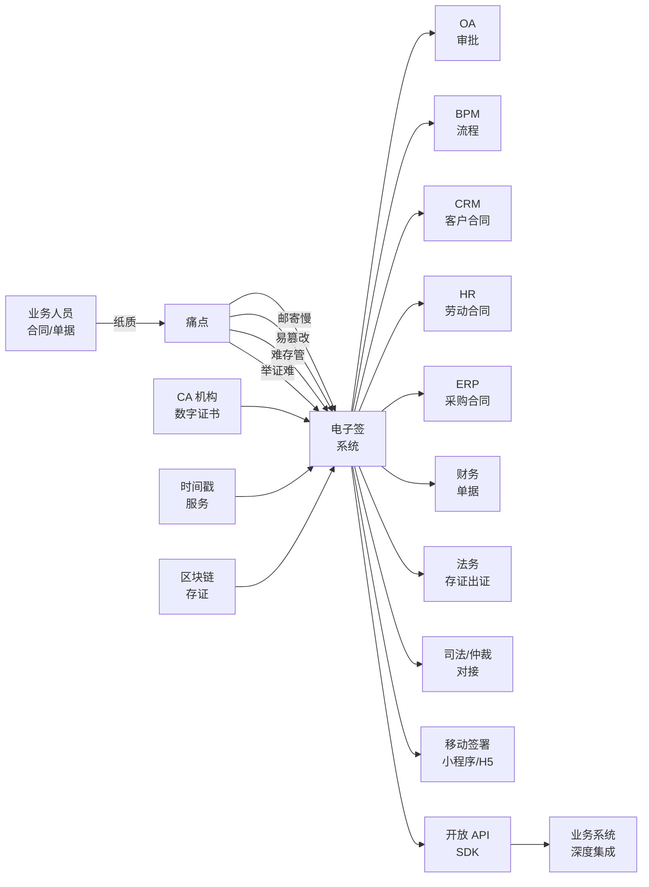
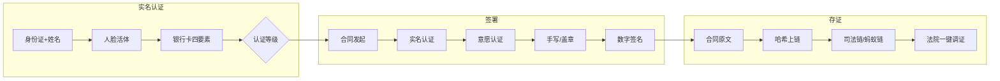
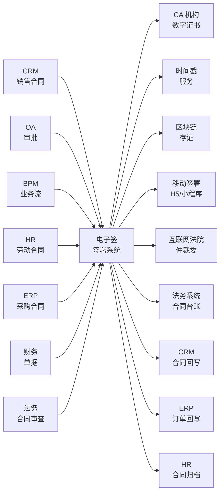

<!--
module:
  parent: application-systems
  slug: application-systems/05-operations/e-signature
  type: article
  category: 主模块子文章
  summary: 电子签 / E-Signature（Electronic Signature 电子签名） 一句话定位：以《电子签名法》+ PKI/CA 数字证书 + 时间戳 + 区块链存证为底座，把"合同 / 单据 / 凭证"在数字世界实现法律效力的签署系统，是企业"无纸化、合规化、可证据化"的最后一公里。
-->

# 电子签 / E-Signature（Electronic Signature 电子签名）

> 一句话定位：以**《电子签名法》/ eIDAS / ESIGN Act + PKI/CA 数字证书 + 时间戳 + 区块链存证**为底座，把"合同 / 单据 / 凭证 / 公文"在数字世界实现**法律效力**的签署系统；是企业"无纸化、合规化、可证据化"的**最后一公里**，解决"纸质合同寄送慢、易篡改、难存管、纠纷举证难"的根本痛点。

## 📌 全景图

电子签位于企业 IT 架构中"**合同 / 单据 / 公文 / 凭证**"的"**签署层**"——上游接 OA/BPM/CRM/HR/ERP 等业务系统的"待签文件流"，横向接 CA 认证 / 时间戳 / 区块链存证 / 司法鉴定，下游对接司法 / 仲裁机构；本质上是把"传统纸质签署的 6 个动作（拟稿 / 复核 / 用印 / 寄送 / 签署 / 归档）"全部线上化、合法化、可证据化。

## 📖 定义

电子签（Electronic Signature / E-Signature）是指**以电子方式表示的、用于识别签名人身份并表明签名人认可其中内容的数据**（《电子签名法》第二条定义）。电子签通过 PKI（Public Key Infrastructure 公钥基础设施）+ CA（Certificate Authority 证书颁发机构）+ 数字签名（基于非对称加密的哈希签名）+ 时间戳 + 区块链存证等组合技术，确保签署行为满足"**真实身份 + 真实意愿 + 原文未改**"三大法律要件，从而具备与纸质签名/盖章同等的法律效力。

**权威定义参考**：

- **中国《电子签名法》（2005 年颁布，2015 年修正，2019 年再次修正）**：第十三条规定"**可靠的电子签名与手写签名或者盖章具有同等的法律效力**"；第十四条规定构成"可靠的电子签名"必须同时满足 4 个条件：①电子签名制作数据用于电子签名时，**属于电子签名人专有**；②签署时电子签名制作数据**仅由电子签名人控制**；③签署后对电子签名的**任何改动能够被发现**；④签署后对数据电文内容和形式的**任何改动能够被发现**。
- **欧盟 eIDAS（Electronic Identification, Authentication and Trust Services 2014 年颁布，Regulation (EU) No 910/2014）**：定义三大类电子签名——**简单电子签名（Simple Electronic Signature, SES）** / **高级电子签名（Advanced Electronic Signature, AES）** / **合格电子签名（Qualified Electronic Signature, QES）**，其中 QES 与手写签名具有同等法律效力，等同于中国《电子签名法》定义的"可靠电子签名"。
- **美国 ESIGN Act（Electronic Signatures in Global and National Commerce Act 2000 年颁布）**：联邦层面承认电子签名/电子合同的**法律效力**，但部分州法律（如纽约州 ESRA）对房地产/遗嘱/家庭法等有例外。
- **联合国国际贸易法委员会《电子商务示范法》（UNCITRAL Model Law on Electronic Commerce 1996）** 与 **《电子签名示范法》（UNCITRAL Model Law on Electronic Signatures 2001）**：国际电子商务与电子签名立法的基石文件，中国/欧盟/美国立法均受其影响。
- **Gartner**：电子签是"**数字商业合同生命周期管理（CLM, Contract Lifecycle Management）的签署执行层**"，与 CLM 系统一起构成"合同全生命周期"管理。

**历史演进**：

- **1990s 起步**：联合国《电子商务示范法》（1996）+《电子签名示范法》（2001），国际立法框架形成
- **2000 年**：美国 ESIGN Act 颁布，联邦层面承认电子签名/合同的法律效力
- **2004-2005**：欧盟《电子签名指令》（1999/93/EC）执行；中国《电子签名法》2004 年 8 月通过、**2005 年 4 月 1 日正式施行**——中国电子签行业发展的法律起点
- **2010-2014**：电子签 SaaS 模式兴起（DocuSign 2003 创立、Adobe EchoSign 2005 创立），云签署模式逐步成熟
- **2014-2016**：欧盟 **eIDAS 法规**（910/2014）取代旧指令，统一欧盟电子签名/信任服务市场；中国电子签头部厂商（**e签宝 2002、法大大 2014、上上签 2014、契约锁 2014**）开始 SaaS 化
- **2017-2019**：中国电子签渗透率快速提升，**互联网金融（互金合同强制电子签）** + **B2B 供应链合同电子化** + **电子政务（电子公文）** 三大场景爆发；e签宝、法大大先后拿到 C 轮/上市/融资
- **2020-2022**：疫情成为电子签催化剂——远程办公、在线签约需求爆发；电子签厂商 1-2 年内实现"5-10 倍"增长；**移动签署（小程序/H5）**成为标配；电子签与 OA/BPM/CRM/HR 深度集成
- **2023-2025**：电子签 + AI（OCR 识别 + NLP 合同审查 + 风险识别）成为新方向；电子签 + 区块链（司法链/天平链）存证出证；电子签出海（e签宝出海东南亚、DocuSign 进入中国市场）
- **2026+**：AI Agent + 电子签（AI 起草合同 + 自动审查条款 + 自动签署触发）；Web3 智能合约签署（区块链原生签署）；跨境电子签互认（RCEP 区域电子签名互认）

**术语边界对比**：

| 系统 / 概念 | 关注点 | 与电子签的边界 | 典型工具 |
|------|------|---------------|---------|
| **电子签（E-Signature）** | 签署行为本身的法律效力 | 本主题 | e签宝 / 法大大 / DocuSign |
| **数字证书（Digital Certificate）** | 身份认证的载体（PKI 基础设施） | **上游**：电子签需基于数字证书做实名认证 | CFCA / 中国金融认证中心 / GlobalSign |
| **CA（Certificate Authority）** | 颁发数字证书的第三方机构 | **上游**：CA 给签署人颁发证书 | CFCA / 北京 CA / 上海 CA / GlobalSign |
| **数字签名（Digital Signature）** | 非对称加密 + 哈希的密码学操作 | **底层技术**：电子签的核心密码学实现 | RSA / SM2 / ECDSA 算法 |
| **时间戳（Timestamp）** | 给数据加上权威时间证明 | **配套服务**：电子签必备（证明签署时间） | 国家授时中心 / 中科院时间戳 / RFC 3161 |
| **区块链存证** | 数据上链不可篡改 | **配套服务**：电子签的存证方式之一 | 蚂蚁链 / 腾讯至信链 / 司法链 |
| **OA（办公自动化）** | 行政办公流程 | **业务上游**：审批通过后触发电子签 | 泛微 / 致远 / 钉钉 / 企微 |
| **BPM（业务流程管理）** | 跨系统业务流程编排 | **业务上游**：BPM 流程节点触发电子签 | Camunda / Flowable |
| **CRM（客户关系管理）** | 客户全生命周期 | **业务上游**：销售合同触发电子签 | Salesforce / 纷享销客 |
| **HR / HCM** | 员工全生命周期 | **业务上游**：劳动合同 / 入离职文件触发电子签 | Workday / 北森 |
| **ERP（企业资源计划）** | 核心业务（财务/采购/销售） | **业务上游**：采购订单 / 销售合同触发电子签 | SAP / 用友 / 金蝶 |
| **法务系统（Legal Management）** | 合同全生命周期 | **业务下游**：电子签完成后数据回流法务 | ContractWorks / ELOQUA / 通义法睿 |
| **司法 / 仲裁机构** | 纠纷解决 | **业务下游**：发生纠纷时调取电子签存证 | 互联网法院 / 仲裁委 / 司法鉴定中心 |
| **RPA** | 跨系统自动化 | **集成伙伴**：RPA 把数据搬运到电子签触发签署 | UiPath / 来也 / 影刀 |

**与各系统的边界详解**（**2025-2026 高频混淆点**）：

- **vs OA**：OA 是"全员通用办公"（流程 + 文档 + IM 一体化），电子签是"签署层"——OA 流程审批通过后调用电子签 API 完成签署；OA 管"**谁来批**"，电子签管"**怎么签才合法**"。**OA 自带"电子签章" ≠ 真正合规的电子签**（OA 的电子签章通常不满足《电子签名法》第十三条的 4 个条件，无法律效力）
- **vs CRM**：CRM 管"客户关系"（线索/商机/客户/合同台账），电子签管"合同签署"——CRM 中的"合同模块"通常只是合同台账（合同信息/金额/到期日），**真正的合同签署（带法律效力的电子签名/盖章）由电子签系统完成**。CRM 与电子签通过 API 集成（CRM 创建合同 → 触发电子签 → 签署完成回写 CRM）
- **vs 法务系统**：法务系统管"合同全生命周期"（起草/审查/签署/履行/归档/纠纷），电子签只覆盖"签署环节"（起草/审查由法务系统或 Word + 人工审查完成）。**电子签 = 法务系统的"签署模块"**；中小企业可能"电子签替代法务系统的签署模块"，但大型企业通常"法务系统 + 电子签"双系统并存
- **vs 区块链**：区块链是"去中心化分布式账本"（数据上链不可篡改），电子签的"存证环节"可能使用区块链作为底层技术之一（蚂蚁链 / 司法链）。**区块链 ≠ 电子签**——区块链只是"电子签存证的可选技术方案"，电子签还需 CA 认证 / 数字签名 / 时间戳 / 实名认证等组合。**2025 高频误解**："上链 = 合法"——单纯把哈希值上链并不能保证电子签合法，还需满足《电子签名法》第十三条的 4 个条件
- **vs 数字认证**：数字认证（Digital Authentication）是"**身份认证**"的技术（如网银 U 盾 / 短信验证码 / 人脸识别），电子签是"**签署行为**"——电子签可以**借助**数字认证确认签署人身份，但二者是不同层次的概念。**手机短信验证码签署 ≠ 可靠电子签名**——短信验证码可被劫持/补卡/伪基站攻击，不能作为"可靠的电子签名"（仅满足 SES 简单电子签名等级）
- **vs 公文系统**：公文系统管"党政机关公文流转"（收文/发文/签发），电子签用于"公文用印"（电子印章替代纸质公章）。**党政机关公文电子化 = 公文系统 + 电子签 + 电子印章**；电子印章需向"国家政务服务管理局"备案

**电子签不擅长的领域**：合同起草与条款审查（法务/AI）、合同履行跟踪（法务/CRM）、合同付款/收款（ERP/财务）、纠纷调解（律师/仲裁机构）、纯行政流程（OA）、客户运营（CRM）。

**在企业 IT 架构中的位置**：电子签是企业"**签署层**"——上游接 OA/BPM/CRM/HR/ERP 等业务系统的"待签文件流"，横向接 CA 认证 / 时间戳 / 区块链存证 / 司法鉴定，下游对接司法 / 仲裁机构。电子签是"**业务系统的最后一公里 + 合规闭环**"——业务系统把"待签文件"抛给电子签，电子签完成签署后把"签署证据链（合同 + 签名 + 时间戳 + 存证证明）"返回给业务系统归档。Gartner 将电子签纳入"**Contract Lifecycle Management (CLM 合同生命周期管理)**"市场，CLM 头部厂商包括 Icertis / Agiloft / ContractWorks，电子签头部厂商 DocuSign / Adobe Sign 与 CLM 厂商深度集成。

**典型数据量级**：成熟电子签平台的数据量通常在 **50GB-5TB** 区间（量级参考，取决于签署规模与历史积累）。**e签宝累计签署量突破 1000 亿次**（2024 年公开数据，覆盖 600+ 万家企业用户）；**法大大累计签署超 80 亿份合同**（2023 年公开数据）；**DocuSign 全球客户 100 万+ 家、年签署量超 10 亿份**（2024 年报）。单企业部署电子签的活跃签署量从月签百份（中小企业）到月签 100 万份（大型集团/银行）不等。

## 🔧 核心能力

- **CA 数字证书（CA Certificate）**：基于 PKI 的数字身份证书（含 SM2/RSA 算法 + 证书颁发机构签名 + 有效期 + 持有人信息）；CA 给签署人颁发证书，电子签用证书验证签署人身份
- **数字签名（Digital Signature）**：基于非对称加密（私钥签名 + 公钥验证）+ 哈希算法（SHA-256/SM3）的密码学操作；对原文做哈希 → 用私钥加密哈希值 → 接收方用公钥解密 → 比对哈希值；保证"**原文未改 + 签署人唯一**"
- **实名认证（Real-Name Authentication / KYC）**：签署前必须做"四要素认证"（姓名 + 身份证号 + 手机号 + 银行卡号）或"人脸识别"或"银联认证"；企业签署需"企业对公账户打款认证（小额打款验证）"
- **时间戳（Timestamp）**：由权威时间戳服务机构（TSA Time Stamp Authority，如国家授时中心 / 中科院时间戳 / VeriSign）签发的"时间证明"——证明数据在某个时间点已存在；电子签必须配时间戳（防"事后倒签"）
- **防篡改（Tamper-Evident）**：签署后对电子签名的任何改动能被发现，对数据电文内容和形式的任何改动能被发现（《电子签名法》第十三条）；实现方式：数字签名 + 哈希校验 + 区块链存证 + 原文固化
- **合同模板（Contract Template）**：可复用的合同模板（Word/PDF 模板 + 变量填充 + 强制条款 + 风险条款）；模板管控（模板版本/审批/发布/废止）
- **存证服务（Evidence Storage）**：签署证据链（合同原文 + 数字签名 + 时间戳 + CA 证书 + 签署日志 + IP/设备指纹）的持久化存储；存证方式：自有存储 / 第三方存证（公证处/司法链/天平链）
- **出证服务（Evidence Issuance）**：发生纠纷时，电子签平台出具"**电子签证据报告**"（含签署人实名信息/CA 证书/时间戳/原文哈希/签署日志/区块链存证 ID），作为司法举证材料
- **司法对接（Judicial Integration）**：与互联网法院（杭州/广州/北京互联网法院）/ 仲裁委（广州仲裁委/珠海仲裁委）/ 司法鉴定中心（国家信息中心/各地公证处）的系统对接；证据直接推送法院/仲裁委（"一键诉讼"）
- **移动签署（Mobile Signing）**：H5 / 小程序 / 微信/钉钉/企微签署入口；短信链接签署；扫码签署；人脸识别签署；**移动签署是中国电子签的"特色场景"**（DocuSign 在海外仍以 PC + 邮件签署为主）
- **批量签署（Batch Signing）**：HR 入职批量签劳动合同、销售批量发合同、政府批量发通知；1 次发起 N 份签署
- **签署控件（Signing Widget）**：嵌入到业务系统（OA/BPM/CRM/HR/ERP）的签署控件（Web SDK / iOS / Android / 小程序）；用户无需跳转电子签平台
- **API 与开放（API & Extensibility）**：REST API（合同创建/发起签署/查询状态/下载合同）+ 事件回调（签署完成/拒签/超时）+ Webhook；SDK 多语言（Java/Python/Node.js/PHP）
- **电子签章（Electronic Seal / Digital Seal）**：企业电子公章/电子合同章/电子法人章/电子财务章；电子签章需"向公安部备案"或"向国家政务服务管理局备案"（党政机关）；企业电子签章由 CA 颁发（含企业营业执照/法人信息）
- **合同审查（Contract Review）**：AI/NLP 合同条款审查（风险条款识别/合规检查/标准条款比对）；电子签平台 + AI 审查一体化（**2025-2026 趋势**）
- **合同台账（Contract Repository）**：签署后的合同归档、检索、台账、到期提醒；与 CRM/法务系统集成

**「CA 认证 + 数字签名 + 时间戳 + 区块链存证」四要素合规闭环**（《电子签名法》第十三条解读）：

电子签的"法律效力"由四大要素共同保证，缺一不可：

**1. CA 认证（Certificate Authority 证书颁发机构）**：
- **作用**：给签署人颁发数字证书（证明"你是你"）
- **国内主流 CA**：CFCA（中国金融认证中心）/ 北京 CA / 上海 CA / 广东 CA / 深圳 CA / 西部 CA / 国富安 CA / 沃通 CA
- **证书类型**：个人证书（公民身份证）/ 企业证书（营业执照 + 对公账户）/ 服务器证书（SSL/TLS）/ 邮件证书
- **证书算法**：国际 RSA / 国密 SM2（GB/T 32918）；中国《电子签名法》鼓励国密 SM2 算法
- **证书生命周期**：申请 → 审核 → 颁发 → 使用 → 更新 → 吊销（CRL 证书吊销列表 / OCSP 在线证书状态协议）
- **关键要求**：CA 必须有"电子认证服务许可证"（工信部 + 国家密码管理局联合颁发）；证书需"第三方 CA"（不能自己给自己颁）

**2. 数字签名（Digital Signature）**：
- **作用**：证明"签署人认可合同内容 + 原文未改"（密码学保证）
- **流程**：原文 → 哈希算法（SHA-256 / SM3）→ 哈希值 → 私钥加密 → 数字签名；接收方用公钥解密 + 比对哈希
- **算法**：RSA-2048（国际主流）/ SM2（国密算法，中国合规优先）/ ECDSA（椭圆曲线，效率更高）
- **私钥保护**：私钥必须"专有 + 唯一控制"（《电子签名法》第十三条第①项）；存储方式：U 盾 / 智能密码钥匙 / 手机安全芯片（SE）/ 云端 HSM（Hardware Security Module 硬件安全模块）
- **关键要求**：私钥不能泄露（一旦泄露，签名可被伪造）；CA 颁发的证书包含"公钥 + 持有人信息 + CA 签名"

**3. 时间戳（Timestamp）**：
- **作用**：证明"签署时间"（防"事后倒签"，即"补签"）
- **标准**：RFC 3161（国际标准）/ GB/T 20520（国密时间戳标准）
- **服务**：国家授时中心（NTSS 国家时间戳服务）/ 中科院国家授时中心 / VeriSign / DigiCert / GlobalSign
- **关键要求**：时间戳必须由"权威第三方 TSA"签发（不能自己给自己签时间）；时间戳证书通常绑定"国家授时中心"或"中科院"
- **典型场景**：电子合同签署后立即获取时间戳（毫秒级精度）；证明"这份合同在 2026-07-25 14:32:18.123 已签署"

**4. 区块链存证（Blockchain Evidence）**：
- **作用**：证明"签署证据链不可篡改"（防"事后改签"）
- **存证内容**：合同哈希值 + 签署人证书哈希 + 时间戳哈希 + 签署日志哈希（**只存哈希，不存原文**——保护商业秘密）
- **国内司法链**：蚂蚁链（蚂蚁集团）/ 司法链（最高人民法院）/ 天平链（北京互联网法院）/ 百度图腾 / 腾讯至信链
- **国际链**：以太坊（Ethereum）/ 比特币（Bitcoin，仅存哈希）/ Hyperledger Fabric（联盟链）
- **关键要求**：存证需"上链后不可篡改"（区块链特性）；存证 ID 作为"电子证据"在法院/仲裁委可直接调取
- **2025 趋势**：杭州/广州/北京互联网法院已支持"**一键调取电子签证据**"——原告在互联网法院起诉时，可直接调取"蚂蚁链/天平链"上的电子签存证数据作为证据

**「合同模板 + 在线签署 + 流程审批 + 出证服务」业务闭环**：

电子签平台的"业务功能"围绕"合同生命周期"展开，**全流程闭环**：

**1. 合同模板（Template）**：
- **模板类型**：Word 模板 / PDF 模板 / HTML 富文本模板
- **模板管控**：模板创建 → 法务审核 → 发布 → 使用 → 废止；模板版本管理
- **变量填充**：从业务系统自动填充（甲方/乙方/金额/日期/编号）
- **条款库**：标准条款库（付款/交付/违约/争议解决）+ 风险条款预警（与公司红线条款比对）

**2. 在线签署（Online Signing）**：
- **发起签署**：选择模板/上传文件 → 填写签署方信息 → 设置签署位置 → 发起签署
- **签署方式**：短信链接签署 / 邮箱链接签署 / 二维码扫码签署 / 嵌入业务系统签署（SDK）
- **签署控件**：电子签名（手写签名 / 印章 / 法人章 / 财务章）/ 签日期 / 填字段 / 选选项
- **签署流程**：单人签署 / 多方顺序签署（甲→乙→丙顺序签）/ 多方并行签署（甲乙丙同时签）/ 会签（甲乙丙任一签即可）
- **签署认证**：签署前强制实名认证（四要素/人脸/银联/对公账户小额打款）；签署时强制意愿认证（短信验证码/手势密码/活体检测）

**3. 流程审批（Workflow）**：
- **审批流**：合同发起 → 业务部门审批 → 法务审查 → 财务审批（金额 > 阈值）→ 高管审批 → 发起签署
- **审批规则**：金额阈值（< 10 万直接签，10-100 万总监审批，> 100 万 CEO 审批）
- **审批集成**：与 OA/BPM 集成（电子签的审批流由 OA/BPM 处理，电子签只管签署）

**4. 存证与出证（Evidence & Issuance）**：
- **存证**：签署完成后，证据链（合同+签名+时间戳+证书+日志）上链（蚂蚁链/司法链）+ 本地存储
- **出证**：用户/企业/法院/仲裁委可在线申请"电子证据报告"（PDF 格式，含签署人实名信息/CA 证书/时间戳/区块链存证 ID/签署日志）
- **司法对接**：杭州/广州/北京互联网法院 + 主要仲裁委支持"在线调取电子签证据"

**「实名认证 + 防篡改 + 移动签署」三大体验能力**：

电子签的"用户体验"决定使用率（**企业用户 70% 操作在手机上完成**）：

**1. 实名认证（KYC）**：
- **个人实名**：四要素认证（姓名+身份证号+手机号+银行卡号）+ 人脸识别（活体检测）+ 公安部身份证库比对
- **企业实名**：营业执照 OCR 识别 + 对公账户小额打款验证（随机 0.01-0.99 元，验证企业对公账户）+ 法人/经办人身份验证
- **认证强度**：初级认证（仅四要素）/ 中级认证（四要素+人脸）/ 高级认证（四要素+人脸+银行卡/对公账户）；**等级越高，法律效力越强**
- **认证机构**：公安部一所（公民身份信息核验）/ 银联（银行卡四要素）/ 工商总局（企业工商信息）/ 各 CA 机构

**2. 防篡改（Tamper-Evident）**：
- **技术手段**：数字签名 + 哈希校验 + 区块链存证 + 原文固化（PDF 不可二次编辑）
- **验证方式**：用户下载签署后的合同 PDF → 电子签平台提供"**合同验真**"工具 → 上传 PDF → 系统验证签名/时间戳/区块链存证是否有效
- **法律效力**：**可靠的电子签名 + 验证未改 = 不可推翻**（《电子签名法》第十三条精神）

**3. 移动签署（Mobile Signing）**：
- **入口**：H5 页面 / 微信小程序 / 支付宝小程序 / 钉钉审批 / 企微审批 / 短信链接 / 二维码
- **签署流程**：短信链接 → 打开 H5 → 人脸认证 → 查阅合同 → 手写签名 / 选择印章 → 完成签署
- **移动签署优势**：随时随地签署（远程办公/出差/疫情）；**中国电子签的"差异化"能力**（DocuSign 海外仍以 PC + 邮件为主）
- **移动签署合规**：移动签署必须满足《电子签名法》第十三条 + 《移动互联网应用程序信息服务管理规定》

**按电子签成熟度分级的功能深度**（行业参考框架）：
- **L1 基础**：电子合同模板 + 实名认证 + 数字签名 + 时间戳（解决 60% 签署场景）
- **L2 标准**：+ 区块链存证 + 司法对接 + 出证服务（解决 80% 合规场景）
- **L3 高级**：+ AI 合同审查 + 合同台账 + 到期提醒 + 风险预警（解决 90% 法务场景）
- **L4 卓越**：+ 移动签署 + 跨境签署 + RCEP 互认 + 多语言（解决 95% 跨国场景）
- **L5 智能化**：+ AI Agent 自动起草合同 + 自动审查条款 + 自动触发签署 + Web3 智能合约签署（前沿探索）

按企业关注度排序，电子签最常被列为「核心采购理由」的前 5 项是：**法律效力合规**（《电子签名法》第十三条满足）、**司法举证能力**（区块链存证 + 互联网法院对接）、**集成便捷度**（与 OA/CRM/HR/ERP 集成）、**签署效率**（移动签署 + 批量签署）、**成本节约**（纸质合同邮寄/打印/存储成本）。

## 📊 关键模块详解

### CA 认证模块（CA Certification）

CA 认证是电子签的"**身份基石**"——没有 CA 认证，就没有"可靠的电子签名"：

- **CA 机构选型**：CFCA（金融首选）/ 北京 CA（政府首选）/ 上海 CA（华东首选）/ 广东 CA（华南首选）/ 国富安 CA；选型需考虑"业务覆盖（金融/政府/医疗/教育）+ 行业认可度 + 兼容性（与电子签厂商集成）"
- **证书类型**：个人证书（身份证+手机号）/ 企业证书（营业执照+对公账户）/ 法人证书（个人证书+企业授权）/ 员工证书（个人证书+企业代申请）
- **证书申请**：在线申请（CA 网站/电子签平台）→ 实名认证 → CA 审核 → 颁发证书（数字文件/U 盾/密码）
- **证书存储**：客户端证书（U 盾/智能密码钥匙/手机 SE 安全芯片）/ 服务端证书（HSM 硬件安全模块/云端加密）
- **证书生命周期**：申请 → 颁发 → 使用 → 更新（到期前 30 天）→ 吊销（离职/丢失/违规）
- **证书验证**：CRL（Certificate Revocation List 证书吊销列表）/ OCSP（Online Certificate Status Protocol 在线证书状态协议）；电子签平台签署时需"在线验证证书有效性"
- **国密合规**：SM2 算法（GB/T 32918）/ SM3 哈希（GB/T 32905）/ SM4 对称加密（GB/T 32907）；政府/金融/央企**必须支持国密算法**（等保三级要求）
- **核心难点**：CA 机构数量众多（30+ 家）且互不信任（不同 CA 颁发的证书可能无法互验）；需要"证书链"或"交叉认证"解决

### 实名认证模块（Real-Name Authentication / KYC）

实名认证是电子签的"**意愿保障**"——保证"签署人就是本人，本人愿意签"：

- **个人四要素**：姓名 + 身份证号 + 手机号 + 银行卡号（通过银联验证）
- **人脸识别**：活体检测（点头/眨眼/读数字）+ 公安部身份证库比对（确认"人证合一"）
- **企业认证**：营业执照 OCR + 工商总局比对 + 对公账户小额打款（随机金额）+ 法人/经办人身份认证
- **认证强度等级**：
  - **初级**：仅四要素（适用低风险场景，如内部通知）
  - **中级**：四要素 + 人脸（适用一般合同，如销售合同）
  - **高级**：四要素 + 人脸 + 银行卡/对公账户（适用重大合同，如融资合同、不动产合同）
- **认证机构**：公安部一所（公民身份）/ 银联（银行卡四要素）/ 工商总局（企业工商）/ 三大电信运营商（手机三要素）/ 央行（个人征信）
- **认证体验**：用户无感（系统后台完成认证）/ 用户主动（签署前弹出认证页面，要求人脸识别）
- **2025 趋势**："**静默实名**"——基于历史认证 + 设备指纹 + 行为分析的"零打扰"实名（用户无需再次输入身份证/银行卡）
- **核心难点**：实名认证成功率（活体识别失败率 5-10%）；多渠道认证整合（不同 CA 机构的认证接口不同）

### 合同模板模块（Contract Template）

合同模板是电子签的"**效率起点**"——模板决定起草效率与合规底线：

- **模板类型**：Word 模板（.docx + 变量占位符）/ PDF 模板（.pdf + 文本域）/ HTML 富文本模板
- **模板创建**：可视化编辑器（拖拽字段/设置变量/配置条款）/ 导入现有合同（OCR 识别 + 智能解析）
- **模板变量**：从业务系统自动填充（甲方/乙方/金额/日期/编号）；变量类型（文本/数字/日期/下拉/附件）
- **模板管控**：模板创建 → 法务审核 → 模板发布 → 模板版本管理 → 模板废止
- **条款库**：标准条款库（付款/交付/违约/争议解决）+ 风险条款库（公司红线条款）+ 行业条款库（金融/医疗/教育/制造）
- **AI 模板**：AI 起草合同（输入关键信息 → AI 自动生成合同草案）+ AI 条款审查（NLP 识别风险条款）
- **核心难点**：模板与业务系统变量映射（CRM 客户字段 → 合同变量）；模板版本管理（同一合同不同版本的兼容）

### 在线签署模块（Online Signing）

在线签署是电子签的"**核心交付**"——决定用户体验与签署效率：

- **签署方式**：
  - **短信链接签署**：签署人收到短信 → 点击链接 → H5 页面 → 实名 → 签署（**最常用，中国特色**）
  - **邮箱链接签署**：签署人收到邮件 → 点击链接 → 签署（**DocuSign 主流方式**）
  - **二维码扫码签署**：发起方生成二维码 → 签署人扫码 → 签署（**线下场景适用**）
  - **嵌入签署（SDK）**：在业务系统（OA/CRM/HR/ERP）中嵌入签署控件（Web SDK/iOS/Android/小程序）
- **签署控件**：
  - **手写签名**：手指/鼠标手写（采集笔迹 + 笔压 + 时间戳）
  - **电子印章**：企业公章/合同章/财务章/法人章（CA 颁发 + 公安部备案）
  - **电子签名（无章）**：纯个人电子签名（无印章，仅签名）
  - **日期/编号控件**：自动填充签署日期 + 合同编号
- **签署流程**：
  - **单人签署**：仅 1 个签署人（最简单）
  - **多方顺序签署**：A → B → C 顺序签署（需前一人签完后一人才能签）
  - **多方并行签署**：A、B、C 同时签署（互不依赖）
  - **会签**：A、B、C 任一签即可（"或签"）
  - **分支签署**：根据条件走不同分支（如"金额 > 100 万需 CEO 审批"）
- **签署前必做**：实名认证（KYC）+ 意愿认证（短信验证码/手势密码/活体检测）+ 合同查阅（强制阅读 + 阅读时长）
- **签署后必做**：数字签名 + 时间戳 + 区块链存证 + 原文固化 + 签署日志记录
- **核心难点**：移动端体验（手机型号/屏幕/网络差异大）；签署控件兼容性（不同业务系统的嵌入难度）

### 流程审批模块（Workflow Approval）

流程审批是电子签的"**业务集成点**"——决定电子签与业务系统的协同效率：

- **审批触发**：合同发起 → 业务部门审批 → 法务审查 → 财务审批（金额阈值）→ 高管审批 → 发起签署
- **审批方式**：电子签内置审批流（简单场景）/ 与 OA/BPM 集成（复杂场景，OA/BPM 处理审批，电子签只管签署）
- **审批规则**：
  - **金额阈值**：< 10 万自动签、10-100 万总监审批、> 100 万 CEO 审批
  - **合同类型**：销售合同/采购合同/劳动合同/保密协议/股权激励等
  - **签署方**：B 端合同需法务/财务审批；G 端合同（政府）需特殊审批
- **审批集成**：
  - **OA 集成**：钉钉/企微/泛微/致远审批通过后 → 触发电子签签署
  - **BPM 集成**：Camunda/Flowable 流程节点完成 → 触发电子签签署
  - **CRM 集成**：Salesforce/纷享销客商机签订 → 触发电子签签署销售合同
  - **HR 集成**：北森/Workday 入职审批 → 触发电子签签署劳动合同
- **核心难点**：审批与签署的"边界划分"——哪些由电子签做，哪些由 OA/BPM 做？**最佳实践：电子签只管"签署"，审批由 OA/BPM 负责**

### 存证服务模块（Evidence Storage）

存证是电子签的"**证据保障**"——决定司法举证的成败：

- **存证内容**：
  - **合同原文**：PDF/Word（电子签平台存储）
  - **数字签名**：签名值 + 签名证书 + 签名算法
  - **时间戳**：时间戳值 + 时间戳证书
  - **CA 证书**：签署人证书（含公钥 + 持有人信息）
  - **签署日志**：签署人 IP/设备/时间/操作（防抵赖）
  - **实名认证记录**：认证时间/认证方式/认证结果
  - **区块链存证 ID**：上链后的交易 ID（哈希指针）
- **存证方式**：
  - **本地存储**：电子签平台自建存储（数据库 + 文件存储 + 备份）
  - **第三方存证**：公证处（公证云）/ 司法鉴定中心 / 区块链（蚂蚁链/司法链/天平链）
  - **混合存证**：本地 + 区块链（双重保险）
- **存证原则**：
  - **完整性**：所有证据环节完整存储（缺一不可）
  - **不可篡改**：区块链上链 + 数字签名保护
  - **可追溯**：所有操作留痕（谁/何时/做了什么）
  - **可调取**：法院/仲裁委可直接调取
- **存证成本**：本地存储成本低但法律效力弱；区块链存证成本高（一次上链约 0.5-5 元）但法律效力强；**重大合同必须区块链存证**
- **2025 现状**：e签宝累计上链存证超 50 亿次（蚂蚁链）；法大大累计上链存证超 30 亿次（司法链）

### 出证服务模块（Evidence Issuance）

出证是电子签的"**司法交付**"——决定纠纷解决效率：

- **电子证据报告**：PDF 格式，含签署人实名信息 + CA 证书 + 时间戳 + 区块链存证 ID + 签署日志 + 合同原文哈希
- **出证类型**：
  - **用户自助出证**：用户在电子签平台自助申请（30 秒内出证）
  - **企业批量出证**：法务部门批量申请（如劳动仲裁批量出证）
  - **司法一键出证**：法院/仲裁委通过系统对接直接调取（**杭州/广州/北京互联网法院已支持**）
- **出证用途**：
  - **诉讼证据**：合同纠纷起诉时作为证据提交
  - **仲裁证据**：劳动仲裁/商事仲裁时作为证据提交
  - **公证证据**：公证处办理公证时作为证据
  - **审计证据**：内部审计/外部审计时作为合规证据
- **出证格式**：PDF（标准格式）/ 司法专用格式（与法院/仲裁委系统对接）/ 公证专用格式（与公证处系统对接）
- **2025 现状**：杭州互联网法院 2018 年首例"**区块链存证电子合同判决**"——司法确认区块链电子证据的法律效力；目前全国互联网法院均支持电子签证据

### 司法对接模块（Judicial Integration）

司法对接是电子签的"**司法闭环**"——决定电子签证据能否被法院采信：

- **互联网法院对接**：杭州互联网法院（2017 设立，首个互联网法院）/ 广州互联网法院（2018 设立）/ 北京互联网法院（2018 设立）
- **仲裁委对接**：广州仲裁委（率先支持电子签证据）/ 珠海仲裁委 / 上海国际仲裁中心
- **司法鉴定对接**：国家信息中心司法鉴定中心 / 各地公证处（公证云）/ 司法鉴定科研院所
- **对接方式**：
  - **系统对接**：法院/仲裁委系统与电子签平台直接对接（API/专线）
  - **证据推送**：原告起诉时一键推送电子签证据（无需额外举证）
  - **证据调取**：法院主动调取电子签证据（核实真实性）
- **对接优势**：
  - **效率提升**：从"邮寄纸质合同 + 公证"（7-15 天）到"一键调取电子证据"（秒级）
  - **成本降低**：单次出证成本从 500-2000 元（公证）降至 0-50 元（电子签出证）
  - **证据真实性**：区块链存证 + CA 认证 + 时间戳三重保障，法院采信率高
- **2025 现状**：**全国互联网法院 100% 支持电子签证据**；**主要仲裁委 80%+ 支持电子签证据**；**传统法院（线下）接受度约 60%**（需配合纸质证据）

### 移动签署模块（Mobile Signing）

移动签署是电子签的"**中国特色**"——区别于 DocuSign 的"PC + 邮件"模式：

- **移动入口**：H5 页面 / 微信小程序 / 支付宝小程序 / 钉钉审批 / 企微审批 / 短信链接 / 二维码
- **移动签署流程**：短信链接 → 打开 H5 → 实名认证（人脸）→ 查阅合同（强制阅读 30 秒）→ 手写签名 / 选择印章 → 完成签署（全程 1-2 分钟）
- **移动签署优势**：
  - **随时随地**：出差/远程办公/疫情均可签署
  - **零门槛**：签署人无需注册电子签账号（短信链接即可）
  - **高效率**：1-2 分钟完成签署（PC 邮件签署需 5-10 分钟）
- **移动签署合规**：人脸识别 + 活体检测 + 设备指纹 + IP 地址 + GPS 定位（多重防伪）
- **移动签署占比**：**中国电子签签署量的 70%+ 来自移动端**（e签宝/法大大 2024 数据）；海外 DocuSign 移动端占比仅 20-30%
- **核心难点**：移动端兼容性（iOS/Android/各种浏览器）；移动端安全（截屏/录屏/伪基站）

## 🏆 选型决策

### 国际三巨头 vs 国内五虎

| 厂商 | 总部 | 定位 | 优势 | 劣势 | 适用规模 |
|------|------|------|------|------|---------|
| **DocuSign** | 美国（旧金山） | 全球电子签龙头 | **全球第一**（市值峰值 600 亿美元/客户 100 万+/年签 10 亿份）/ 与 Salesforce/Adobe/Microsoft 深度集成 / 国际化合规（ESIGN/eIDAS） | **贵**（人均 200-500 美元/年）/ 中国本地化弱（无国密 SM2/无中国司法链对接）/ 仅支持 PC + 邮件签署（移动端弱） | 跨国集团 / 大型企业 / 出海企业 |
| **Adobe Sign** | 美国（圣何塞） | Adobe Document Cloud 电子签 | **与 Adobe PDF 深度集成**（PDF 签署体验最佳）/ 企业级安全 / 跨国合规 | 贵 / 中国本地化弱 / 生态弱于 DocuSign | 跨国集团 / 已用 Adobe 生态的企业 |
| **HelloSign / Dropbox Sign** | 美国（旧金山） | 中小企业友好电子签 | **性价比高**（人均 50-150 美元/年）/ API 友好 / Dropbox 集成 | 合规等级低于 DocuSign / 中国本地化无 | 中小企业 / 海外公司 |
| **e签宝** | 中国（杭州） | **中国电子签龙头** | **中国市场份额第一**（累计签署 1000 亿次+/600 万+ 企业用户）/ 国密 SM2 + 蚂蚁链 + 司法链对接 / SaaS + 私有化 / 钉钉/企微/微信集成 | 国际化弱 / 复杂企业级场景略弱于 DocuSign | 国内中大型企业 / 政府 / 金融 / 央国企 |
| **法大大** | 中国（深圳） | 国内电子签第二 | **金融级合规强**（累计签署 80 亿份+/互金合规首选）/ 国密 + 司法链 + 多 CA 机构 / 行业方案深 | 移动端体验略弱于 e签宝 / 国际化弱 | 国内中大型企业 / 金融 / 互金 / 制造 |
| **上上签** | 中国（杭州） | 国内电子签第三 | **企业级稳定性强**（B 端客户多）/ 国密 + 区块链存证 / 标准化交付 | 品牌略弱于 e签宝/法大大 / 移动端略弱 | 国内中大型企业 / 制造业 / 物流 |
| **契约锁** | 中国（上海） | 国内电子签 + 印控 | **电子签 + 印控一体化**（物理印章管控 + 电子签章）/ 大型集团客户多 | SaaS 化进度慢 / 移动端弱 | 国内大型集团 / 央国企 / 政府 |
| **君子签** | 中国（重庆） | 国内电子签（细分） | **司法存证深**（与重庆/贵州/广州仲裁委对接）/ 公证处对接 | 品牌知名度较弱 / 移动端弱 | 西南地区企业 / 司法存证场景 |

### 自研 vs 商用 vs SaaS

| 维度 | 自研电子签 | 商用电子签（私有化） | SaaS 电子签 |
|------|----------|------------------|------------|
| 适用规模 | 央国企/军工/金融（合规极严） | 中大型企业（数据本地化要求） | 中小企业 / 通用场景 |
| 优势 | 100% 自主可控 / 深度定制 / 国密合规 | 数据本地化 / 行业方案成熟 / 合规保障 | 快速上线 / 成本低 / 免运维 |
| 劣势 | 投入大（5000 万+）/ 周期长（3-5 年）/ 需对接 CA + 时间戳 + 区块链 | 投入中等（500-2000 万）/ 运维成本高 | 数据在 SaaS 厂商 / 定制受限 |
| 典型代表 | 央企/银行/军工自研 | e签宝私有化 / 法大大私有化 / 契约锁 | e签宝 SaaS / 法大大 SaaS / DocuSign |
| 决策阈值 | 特殊合规 + 长期投入 + 数据强敏感 → 自研；否则 → 商用/SaaS | 数据本地化 + 中等规模 → 私有化 | 通用场景 + 快速上线 → SaaS |

### 选型决策树（5 层）

1. **先看法律效力等级**：需"可靠电子签名"（中国《电子签名法》第十三条）→ 选合规电子签厂商（必须 CA + 时间戳 + 区块链存证）；仅需"简单电子签名"（如内部通知）→ 选轻量电子签平台
2. **再看地域**：跨国业务 → DocuSign/Adobe Sign（ESIGN + eIDAS 互认）；纯国内 → e签宝/法大大/上上签（国密 SM2 + 中国司法链对接）
3. **再看行业**：金融/互金 → 法大大（金融合规首选）；政府/央国企 → 契约锁（印控 + 电子签）/ e签宝（政府案例深）；制造业 → e签宝/上上签（供应链合同）；跨境电商 → DocuSign（国际合规）
4. **再看部署模式**：数据强敏感（央国企/金融）→ 私有化部署（e签宝私有化 / 法大大私有化）；通用场景 → SaaS（成本低/上线快）
5. **最后看集成生态**：与钉钉/企微深度集成 → e签宝；与 SAP/Oracle 集成 → DocuSign（Marketplace 预制流程）；与 Salesforce 集成 → DocuSign（原生集成）；自研业务系统 → 评估 API 完善度

### 移动签署能力选型（2025 中国特色）

- **短信链接签署**（**e签宝最强**）：短信链接 → H5 → 人脸 → 签署；中国电子签"标配"功能
- **微信小程序签署**（e签宝/法大大支持）：扫码进入小程序签署；微信生态适配
- **钉钉/企微审批集成**（e签宝深度集成）：钉钉审批通过后 → 直接触发电子签签署；企业微信审批流同样支持
- **H5 嵌入签署**（所有主流厂商支持）：业务系统嵌入 H5 签署控件；无需跳转

## 🚨 实施陷阱 / 反模式

### 1. CA 选择不当陷阱

**现象**：电子签上线后发现"签署的合同在法院不被采信"，原因是 CA 机构不被法院认可。
**根因**：中国 CA 机构有 30+ 家，但**只有具备"电子认证服务许可证"的 CA 机构（CFCA/北京 CA/上海 CA/广东 CA 等约 12 家）** 颁发的证书才被法院普遍认可；非授权 CA 机构（如某些二级 CA）的证书法律效力存疑。
**规避**：选型时优先"具备电子认证服务许可证 + 工信部 + 国家密码管理局联合颁发"的 CA 机构；CFCA 金融首选 / 北京 CA 政府首选 / 上海 CA 华东首选 / 广东 CA 华南首选；不要选未授权的小 CA 机构。

### 2. 实名认证不到位陷阱

**现象**：电子签平台上线后，签署的合同被伪造——有人用"虚假身份证号"签署，签署人否认签署。
**根因**：实名认证仅做"身份证号校验"，未做"人脸识别 + 活体检测"；身份证号可被冒用。
**规避**：**强制"四要素 + 人脸识别"**（姓名+身份证+手机+银行卡+人脸活体）；重大合同（金额 > 10 万/不动产/股权）必须"四要素+人脸+对公账户打款"三重认证；参考 e签宝/法大大认证方案。

### 3. 时间戳缺失陷阱

**现象**：电子签签署的合同，发生纠纷时签署人称"事后倒签"——声称"合同是 2026 年 7 月倒签的，不是 2025 年 3 月签的"，因电子签未加时间戳，举证失败。
**根因**：电子签未接时间戳服务（TSA），无法证明签署时间。
**规避**：**必须接时间戳服务**（国家授时中心 / 中科院时间戳 / 合规 TSA）；签署时立即获取时间戳（毫秒级精度）；时间戳证书需"第三方权威 TSA"颁发。

### 4. 法律效力不足陷阱

**现象**：电子签签署的合同，发生纠纷时不被法院采信——法院认定"电子签名不满足《电子签名法》第十三条的 4 个条件"。
**根因**：电子签未满足"可靠的电子签名"四大条件——①私钥不专有 ②签署时私钥不由签署人控制 ③签署后改动不能被发现 ④签署后内容改动不能被发现。常见错误：私钥存 SaaS 平台（不专有）、签署后合同可编辑（不可发现改动）。
**规避**：**四要素必查**——①私钥专有（U 盾/手机 SE 安全芯片/HSM）②签署时专控（签署时实时验证）③签名不可改（数字签名+区块链存证）④原文不可改（PDF 固化 + 哈希校验）；不要选"私钥存平台"的电子签厂商；签署后合同必须 PDF 固化（不可二次编辑）。

### 5. 与 ERP 集成黑洞陷阱

**现象**：电子签与 ERP（SAP/用友/金蝶）集成后，业务流程断裂——ERP 创建采购订单后，电子签不自动触发签署；财务人员手动上传合同到电子签平台，效率反而下降。
**根因**：电子签与 ERP 集成"只做表面"——没有业务事件触发器，没有签署完成回写 ERP，没有签署状态同步。
**规避**：**深度集成 = 事件驱动 + 双向同步**——①ERP 业务事件（采购订单创建）→ Kafka/RabbitMQ 推送 → 电子签自动发起签署；②电子签签署完成 → 回调 ERP API → ERP 更新订单状态为"已签约"；③合同 PDF + 签署证据自动归档到 ERP；参考 e签宝/法大大 ERP 集成方案。

### 6. 司法管辖权问题陷阱

**现象**：电子签签署的合同，发生纠纷时管辖权争议——签署人 A 在北京、签署人 B 在上海、电子签平台服务器在广州，发生纠纷时去哪个法院起诉？
**根因**：电子签签署的合同未约定管辖法院；不同地区法院对电子签证据采信度差异（互联网法院 100% 采信 vs 传统法院 60% 采信）。
**规避**：**合同必须约定管辖法院**——电子签平台在合同模板中预设管辖条款（如"由被告所在地法院管辖"或"由本合同签订地法院管辖"）；**优先选择互联网法院**（杭州/广州/北京/成都）起诉——电子签证据采信率高、审理效率高。

### 7. 区块链存证缺失陷阱

**现象**：电子签签署的合同，发生纠纷时法院要求"提供电子签证据的真实性证明"，电子签平台只能提供"本地存储的合同 + 数字签名"，无法证明"未被篡改"。
**根因**：电子签未做区块链存证——只在本地存储，未上链；本地存储可能被质疑"内部修改"。
**规避**：**重大合同必须区块链存证**——电子签平台自动调用蚂蚁链/司法链/天平链上链（一次上链 0.5-5 元）；存证 ID 记录在合同中；发生纠纷时直接调取链上证据。

### 8. 电子签章未备案陷阱

**现象**：企业使用电子签章签署的合同，发生纠纷时法院认为"电子签章无效"——原因是电子签章未在公安部备案。
**根因**：电子签章需"向公安部备案"（企业）/ "向国家政务服务管理局备案"（党政机关）；未备案的电子签章法律效力存疑。
**规避**：选电子签厂商时确认"电子签章是否支持备案"——e签宝/法大大/契约锁均支持企业电子签章备案；自建电子签需自行向公安部备案。

### 9. 移动签署安全陷阱

**现象**：电子签移动签署的合同，发生纠纷时签署人称"非本人操作"——他人用偷来的手机 + 短信验证码签署。
**根因**：移动签署仅"短信验证码"验证，未做"人脸识别 + 活体检测"；手机+短信可被冒用。
**规避**：**移动签署必须"人脸识别 + 活体检测 + 设备指纹 + GPS 定位"** 四重验证；不要用纯短信验证码签署（不符合《电子签名法》第十三条第①项"私钥专有"）。

### 10. 国际电子签互认陷阱

**现象**：中国电子签签署的合同，到海外不被认可；海外电子签（DocuSign）签署的合同，到中国不被采信。
**根因**：跨境电子签互认机制未完全建立——中国《电子签名法》、欧盟 eIDAS、美国 ESIGN Act 互不承认；RCEP 区域电子签名互认 2024 年才达成协议（实施细节未完全落地）。
**规避**：**跨境合同优先 DocuSign**（ESIGN + eIDAS 双合规）；中国电子签签署的合同到海外使用前需做"公证 + 海牙认证"（Apostille）；**关注 RCEP 电子签名互认进展**（2024+ 实施中）。

### 陷阱共性规律

行业研究统计电子签项目失败/未达预期率约 **20-35%**（低于 BPM/HR/RPA，因电子签技术门槛相对较低 + 法律框架明确），失败原因中：
- 约 **25%** 源自「CA 选择不当 + 实名认证不到位」（合规陷阱）
- 约 **20%** 源自「时间戳缺失 + 法律效力不足」（技术陷阱）
- 约 **20%** 源自「区块链存证缺失 + 司法举证失败」（存证陷阱）
- 约 **15%** 源自「与 ERP/OA/CRM 集成黑洞」（集成陷阱）
- 约 **10%** 源自「司法管辖权问题 + 国际互认」（法律陷阱）
- 约 **10%** 源自「电子签章未备案 + 移动签署安全」（备案陷阱）

规避核心：「**CA 选型合规 + 实名认证三重 + 时间戳必接 + 区块链必存 + ERP 深度集成 + 管辖法院必约 + 电子签章必备案 + 移动签署四重验证**」是电子签成功的 **8 大前置条件**。

## 🛤️ 学习路线

### 入门（0-3 个月，建立基础认知）

1. **第 1 周**：阅读中国《电子签名法》（2005 颁布 + 2015/2019 修正）+ 第十三条 + 第十四条；理解"可靠电子签名"4 条件
2. **第 2-3 周**：阅读欧盟 eIDAS + 美国 ESIGN Act + 联合国《电子商务示范法》；建立全球电子签法律框架认知
3. **第 4-6 周**：阅读 CA 认证 / 数字签名 / 时间戳 / 区块链存证的密码学原理（PKI / RSA / SM2 / SHA-256 / SM3）
4. **第 7-9 周**：试用 1 个国内电子签平台（e签宝免费版 / 法大大免费版）+ 1 个国际电子签平台（DocuSign 免费试用），亲自发起 1-2 份签署
5. **第 10-12 周**：研究 1-2 个真实案例（如某银行电子合同签署项目、某互联网法院电子证据判决）

### 进阶（3-12 个月，深度技能）

1. **3-6 个月**：选择一个细分模块（CA 认证 / 实名认证 / 司法对接 / 区块链存证）做深度研究——密码学 + 法规 + 厂商方案 + POC
2. **6-9 个月**：参与 1 个电子签实施项目，从需求调研 → 选型 → 集成 → 培训 → 上线全流程
3. **9-12 个月**：学习 AI 合同审查（NLP 风险条款识别）+ 区块链智能合约（Solidity/Chaincode），了解电子签前沿趋势

### 精通（12 个月以上，专家级）

1. **12-24 个月**：主导 1 个企业级电子签实施（≥ 10000 份签署/月/10+ 业务系统集成），覆盖 CA 选型 / 实名认证 / 司法对接 / 合规闭环
2. **24-36 个月**：建立电子签选型方法论（决策树 / RFP 模板 / POC 脚本 / 合规自检清单），成为公司电子签选型的"内部顾问"
3. **36 个月+**：横向扩展到"**合同生命周期管理（CLM）**"——电子签 + 法务系统 + 合同起草 + 合同审查 + 合同履行 + 合同归档；主导企业"合同数字化"战略

### 学习资源

- **法规标准**：中国《电子签名法》（2005 颁布 + 2015/2019 修正）/ 欧盟 eIDAS（Regulation (EU) No 910/2014）/ 美国 ESIGN Act（2000）/ 联合国《电子商务示范法》（1996）/《电子签名示范法》（2001）
- **密码学**：PKI / RSA / SM2 / SHA-256 / SM3（《商用密码管理条例》+ GM/T 系列标准）
- **认证**：**电子认证服务许可证**（工信部 + 国家密码管理局联合颁发）
- **书籍**：《电子签名法解读》《电子商务法》《密码学与网络安全》《区块链技术指南》
- **平台**：e签宝 Academy / 法大大 University / DocuSign University / Adobe Sign 文档
- **社区**：中国电子签行业联盟 / e签宝开发者社区 / 法大大开发者社区 / 蚂蚁链开发者社区
- **认证**：**国家密码管理局商用密码认证**（电子签合规必备）/ 中国信息安全测评中心 CISP / DocuSign Certified eSignature Specialist / Adobe Sign 认证

## 🔗 上下游关系

- **上游业务系统**：CRM（销售合同/客户合同）、OA（行政审批/用印申请）、BPM（业务流节点）、HR（劳动合同/保密协议）、ERP（采购订单/销售订单）、财务（付款单/收据）、法务（合同起草/合同审查）
- **横向合规基础设施**：CA 机构（数字证书）/ 时间戳服务（TSA）/ 区块链（蚂蚁链/司法链/天平链）/ 实名认证（公安部/银联/工商）
- **下游业务回流**：CRM（合同状态/合同 PDF）/ ERP（订单状态/合同归档）/ HR（员工合同归档）/ 法务系统（合同台账）/ 档案系统（长期保存）
- **司法机构**：互联网法院（杭州/广州/北京/成都）/ 主要仲裁委（广州/珠海/上海）/ 司法鉴定中心（国家信息中心）/ 公证处（公证云）

**集成要点**：

- **电子签 ↔ CRM**：CRM 创建商机/合同 → 触发电子签发起签署；签署完成 → 回调 CRM 更新合同状态 + 归档合同 PDF；**深度集成点**：CRM 客户字段 → 合同变量（甲方/乙方/金额/日期）
- **电子签 ↔ OA**：OA 审批通过（用印申请）→ 触发电子签签署；签署完成 → 回调 OA 更新审批状态 + 推送签署结果；**深度集成点**：钉钉/企微审批 + 电子签一体化
- **电子签 ↔ BPM**：BPM 流程节点完成（合同审批流）→ 触发电子签签署；签署完成 → 继续 BPM 下游节点（财务付款/法务归档）；**深度集成点**：BPM 流程节点作为"签署触发器"
- **电子签 ↔ HR**：员工入职审批完成 → 触发电子签签署劳动合同/保密协议；签署完成 → 归档到 HR 员工档案；**深度集成点**：HR 员工字段 → 合同变量（姓名/工号/部门）
- **电子签 ↔ ERP**：采购订单/销售订单创建 → 触发电子签签署采购合同/销售合同；签署完成 → 回写 ERP 订单状态（已签约）+ 归档合同 PDF；**深度集成点**：ERP 业务事件作为"签署触发器"
- **电子签 ↔ CA/时间戳/区块链**：签署时实时调用 CA 验签 + 时间戳 + 区块链存证；CA/时间戳/区块链是"合规基础设施"，电子签是"业务交付"
- **电子签 ↔ 互联网法院**：发生纠纷时直接调取电子签证据（区块链存证 + CA 证书 + 时间戳 + 签署日志）；**2025 全国互联网法院 100% 支持电子签证据**

**集成模式选择**：

- **API 集成（同步）**：业务系统调用电子签 REST API（创建合同/发起签署/查询状态）；适合实时性要求高的场景
- **消息队列集成（异步）**：业务系统通过 Kafka/RabbitMQ 推送"签署触发事件"；适合高并发、解耦场景
- **事件驱动（Webhook）**：电子签签署完成 → 主动回调业务系统（推送签署结果）；适合状态同步场景
- **SDK 嵌入**：业务系统嵌入电子签 SDK（Web/iOS/Android/小程序）；适合"内嵌签署"场景（用户在业务系统页面直接签署）
- **嵌入式流程（BPM 节点）**：电子签作为 BPM 流程节点（签署是流程一步）；适合复杂业务流场景

## ⚖️ 关键考量

- **法律效力是底线**：电子签的"价值"在于法律效力；不满足《电子签名法》第十三条 = 形同废纸；选型时**合规优先于功能**
- **CA 选型决定合规上限**：CA 机构决定证书法律效力；选未授权 CA = 证书无效 = 合同无效
- **实名认证是意愿保障**：四要素+人脸+银行卡/对公账户三重认证；纯短信验证码签署 = 不可靠电子签名
- **时间戳是时间保障**：签署时间必须由权威 TSA 证明；无时间戳 = "事后倒签"无法证明
- **区块链存证是证据保障**：重大合同必上链；本地存储在法院可能不被采信
- **与业务系统深度集成决定价值**：电子签孤立使用 = 仅"签署工具"；深度集成 OA/CRM/HR/ERP = "业务流程最后一公里"
- **司法管辖权必约定**：合同必约定管辖法院；优先互联网法院（电子签证据采信率高）
- **移动签署是中国特色优势**：e签宝/法大大移动端体验远超 DocuSign；中国企业选国内厂商占优
- **跨境签署用 DocuSign**：跨境合同用 DocuSign（ESIGN + eIDAS 双合规）；国内厂商跨境能力弱
- **AI + 电子签是 2025 趋势**：AI 起草合同 + AI 审查条款 + AI 触发签署；选型时关注厂商 AI 能力

## 🎯 选型指南

| 企业类型 | 推荐 | 理由 |
|---------|------|------|
| 跨国集团（万人+） | DocuSign + e签宝/法大大（双部署） | DocuSign 跨境合规 + e签宝/法大大中国合规 |
| 大型集团（5000+） | e签宝/法大大（私有化） | 数据本地化 + 国密合规 + 私有化部署 |
| 中型企业（500-5000） | e签宝/法大大（SaaS） | 快速上线 + 成本低 + 合规保障 |
| 小型企业（< 500） | e签宝 SaaS / 钉钉智能合同 | 性价比 + 移动签署 |
| 金融/银行/互金 | 法大大（金融首选） | 金融合规 + 国密 + 互金案例深 |
| 政府/央国企 | 契约锁 / e签宝 | 电子签章备案 + 政府案例深 + 国密 |
| 制造业 | e签宝/上上签 | 供应链合同 + ERP 集成 |
| 跨境电商 | DocuSign | ESIGN + eIDAS 双合规 |
| 互联网/科技公司 | e签宝 SaaS | 性价比 + 移动签署 + 钉钉/企微集成 |

**自检维度**：
1. 是否具备"电子认证服务许可证"的 CA 机构？
2. 实名认证是否支持"四要素 + 人脸 + 银行卡/对公账户"三重认证？
3. 是否支持国密 SM2/SM3 算法（等保三级要求）？
4. 是否接时间戳服务（国家授时中心 / 中科院）？
5. 是否接区块链存证（蚂蚁链/司法链/天平链）？
6. 是否与互联网法院/仲裁委对接（一键调证）？
7. 移动签署是否支持"人脸识别 + 活体检测 + 设备指纹 + GPS"四重验证？
8. 是否支持电子签章备案（公安部/国家政务服务管理局）？
9. 集成能力（OA/CRM/HR/ERP 标准连接器数 + API 完善度）？
10. 行业案例与实施商能力（金融/政府/制造/互联网 ≥ 5 个案例）？

**红线**：
- CA 机构无"电子认证服务许可证" = 慎选（证书无效）
- 实名认证仅四要素（无银行卡/人脸）= 慎选（不符合可靠电子签名）
- 无时间戳服务 = 慎选（无法证明签署时间）
- 无区块链存证 = 慎选（重大合同存证风险）
- 无移动签署能力 = 落后一代（中国市场 70%+ 移动签署）
- 私钥存 SaaS 平台（不专有）= 必弃（不符合《电子签名法》第十三条第①项）
- 签署后合同可二次编辑（PDF 未固化）= 必弃（不符合《电子签名法》第十三条第③④项）
- 实施商无金融/政府/央国企案例 = 慎选（合规经验不足）

**RFP 模板要点**：建议 RFP 覆盖 **6 大类 35+ 评分项**：
- **功能类（25%）**：CA 认证 / 实名认证 / 数字签名 / 时间戳 / 区块链存证 / 司法对接 / 出证服务 / 合同模板 / 在线签署 / 流程审批 / 移动签署 / API & SDK
- **合规类（25%）**：电子签名法 / eIDAS / ESIGN Act / 国密 SM2/SM3 / 等保三级 / 商用密码认证 / 电子签章备案 / GDPR / 跨境合规
- **性能类（10%）**：单平台签署量（亿级）/ 并发签署能力 / 移动端响应时间（< 2 秒）/ 历史证据查询时间（< 5 秒）
- **集成类（20%）**：OA/CRM/HR/ERP/SAP/Oracle/Salesforce/钉钉/企微/微信 标准连接器 / REST API / Webhook / SDK 多语言
- **司法类（10%）**：互联网法院对接数 / 仲裁委对接数 / 区块链对接数（蚂蚁链/司法链/天平链）/ 电子证据采信率 / 一键调证能力
- **服务类（10%）**：行业最佳实践 / 客户案例数（金融/政府/制造/互联网）/ 升级策略 / SLA 承诺 / 实施伙伴能力

**TCO 估算要点**（1000 人企业 5 年 TCO）：
- **e签宝 SaaS**：50-200 万（License 40% + 实施 30% + 集成 20% + 运维 10%）
- **e签宝私有化**：200-500 万一次性 + 30-80 万/年运维
- **法大大 SaaS**：50-200 万
- **法大大私有化**：200-500 万一次性 + 30-80 万/年运维
- **契约锁（私有化）**：300-800 万一次性 + 50-100 万/年运维
- **DocuSign**：300-1000 万（人均 200-500 美元/年 × 5 年）
- **Adobe Sign**：300-800 万
- **自研电子签**：5000 万-1 亿 + 500 万/年级运维

## ⚠️ 常见陷阱

- **「电子签 = 电子印章」**：电子签 ≠ 电子印章——电子印章是电子签的"控件之一"（企业公章/合同章），电子签还包括 CA 认证 / 实名认证 / 数字签名 / 时间戳 / 区块链存证等完整体系
- **「上链 = 合法」**：单纯把哈希值上链 ≠ 合法电子签；还需满足《电子签名法》第十三条 4 条件（CA + 实名 + 私钥专有 + 防篡改）
- **「短信验证码签署 = 可靠电子签名」**：错——短信验证码可被劫持/补卡/伪基站；仅满足 SES 简单电子签名等级，不满足 AES 高级/ QES 合格等级
- **「电子签替代 OA 用印」**：错——电子签管"签署"，OA 管"审批"；电子签可与 OA 用印模块集成，但**电子签不能替代 OA 用印**（OA 用印需审批流程，电子签无审批）
- **「电子签替代法务系统」**：错——电子签只覆盖"签署环节"，法务系统管"合同全生命周期"（起草/审查/履行/归档/纠纷）；大型企业通常"电子签 + 法务系统"双系统并存
- **「DocuSign = 全球电子签」**：错——DocuSign 在中国本地化弱（无国密/无中国司法链/无中文签署体验）；中国企业首选仍是 e签宝/法大大
- **「电子签 SaaS = 不安全」**：错——主流 SaaS 电子签厂商（e签宝/法大大）安全等级 ≥ 等保三级；签名私钥存 HSM；与私有化等价安全
- **「区块链电子签 = 慢且贵」**：错——一次上链 0.5-5 元，1-3 秒完成；相比传统公证（500-2000 元/份 + 7-15 天）又快又便宜
- **「电子签签署的合同法院不认」**：错——2018 年杭州互联网法院首例区块链存证电子合同判决已确认电子签证据效力；2025 全国互联网法院 100% 支持电子签证据
- **「自研电子签比 SaaS 安全」**：错——自研需对接 CA + 时间戳 + 区块链 + 实名认证，集成成本高；SaaS 厂商已对接好，自研不一定更安全

## 📚 参考来源

- **中国《电子签名法》（2005 颁布 + 2015 修正 + 2019 修正）**：中华人民共和国《电子签名法》，第十三条定义"可靠的电子签名" 4 条件，第十四条规定电子签名法律效力（http://www.npc.gov.cn）
- **公安部信息安全产品检测**：公安部信息安全产品检测中心，电子签厂商资质检测报告（http://www.mps.gov.cn）
- **e签宝官方文档**：e签宝开放平台官方文档，REST API + SDK + 集成指南（https://open.esign.cn）
- **DocuSign 官方文档**：DocuSign Developer Center，REST API + eSignature REST API v2.1（https://developers.docusign.com）
- **Gartner Contract Lifecycle Management MQ 2024**：Gartner, "Magic Quadrant for Contract Lifecycle Management 2024"，CLM 市场格局权威参考，Icertis/Agiloft/ContractWorks/DocuSign CLM 头部厂商（https://www.gartner.com）
- **Forrester Wave™ E-Signature 2024**：Forrester, "The Forrester Wave™ for E-Signature, Q4 2024"，从战略 / 当前产品 / 市场表现等维度评估电子签厂商（https://www.forrester.com）
- **欧盟 eIDAS 法规（Regulation (EU) No 910/2014）**：European Union, "Regulation (EU) No 910/2014 on electronic identification and trust services for electronic transactions in the internal market"，欧盟电子签名/信任服务法规（https://eur-lex.europa.eu）
- **美国 ESIGN Act（15 U.S.C. § 7001）**：U.S. Congress, "Electronic Signatures in Global and National Commerce Act 2000"，美国联邦电子签名法律（https://www.fdic.gov/regulations/compliance/manual/10/x-3.1.pdf）
- **国家密码管理局商用密码认证**：国家密码管理局《商用密码管理条例》+ GM/T 系列标准（SM2/SM3/SM4 算法标准）
- **蚂蚁链开放平台**：蚂蚁链（蚂蚁集团）开放平台，电子签存证接口（https://antchain.alibaba.com）
- **司法链（最高人民法院）**：最高人民法院司法链平台，电子证据存证（https://www.court.gov.cn）

---

← [返回: 业务应用系统](../../README.md)

## 📊 本节统计

- **核心能力**：15 大模块（CA 认证 / 数字签名 / 时间戳 / 实名认证 / 防篡改 / 合同模板 / 存证服务 / 出证服务 / 司法对接 / 移动签署 / 批量签署 / 签署控件 / API / 电子签章 / 合同审查）
- **四要素合规闭环**：CA 认证 + 数字签名 + 时间戳 + 区块链存证（《电子签名法》第十三条解读）
- **业务闭环**：合同模板 + 在线签署 + 流程审批 + 存证出证
- **三大体验能力**：实名认证 + 防篡改 + 移动签署
- **电子签成熟度分级**：5 级（L1 基础 / L2 标准 / L3 高级 / L4 卓越 / L5 智能化）
- **国际三大法规**：《电子签名法》（中国）/ eIDAS（欧盟）/ ESIGN Act（美国）
- **中国电子签数据**：e签宝累计签署 1000 亿次+/600 万+ 企业用户 / 法大大累计签署 80 亿份+ / DocuSign 全球客户 100 万+/年签 10 亿份+
- **典型场景**：9 类（跨国 / 大型 / 中型 / 小型 / 金融 / 政府 / 制造 / 跨境电商 / 互联网）
- **集成架构**：7 上下游（CRM / OA / BPM / HR / ERP / 法务 / 财务）+ 横向 CA/时间戳/区块链 + 司法互联网法院/仲裁委
- **集成模式**：5 类（API / 消息队列 / 事件驱动 / SDK 嵌入 / BPM 节点）
- **关键考量**：10 维度（法律效力 / CA 选型 / 实名认证 / 时间戳 / 区块链 / 集成深度 / 管辖权 / 移动签署 / 跨境签署 / AI 趋势）
- **选型自检维度**：10 项（CA 资质 / 实名认证 / 国密合规 / 时间戳 / 区块链 / 司法对接 / 移动签署 / 电子签章备案 / 集成能力 / 行业案例）
- **RFP 评分项**：6 大类 35+ 项（功能 25% / 合规 25% / 性能 10% / 集成 20% / 司法 10% / 服务 10%）
- **TCO 估算**（1000 人 5 年）：e签宝 SaaS 50-200 万 / 私有化 200-500 万 / DocuSign 300-1000 万 / 自研 5000 万-1 亿
- **常见陷阱**：10 类（电子签≠印章 / 上链≠合法 / 短信验证码≠可靠 / 电子签≠OA 用印 / 电子签≠法务系统 / DocuSign≠全球 / SaaS≠不安全 / 区块链≠慢贵 / 法院不认 / 自研更安全）
- **陷阱统计**：电子签项目失败率 20-35%（25% 合规 / 20% 技术 / 20% 存证 / 15% 集成 / 10% 法律 / 10% 备案）
- **所属价值链**：05 运营管理
- 关联系统：[OA 深读](../oa/README.md) / [BPM 深读](../bpm/README.md) / [HR 深读](../hr/README.md) / [ERP 深读](../erp/README.md) / [BI 深读](../bi/README.md) / [CRM 深读](../../04-sales-service/crm/README.md) / [EAM 深读](../eam/README.md)
