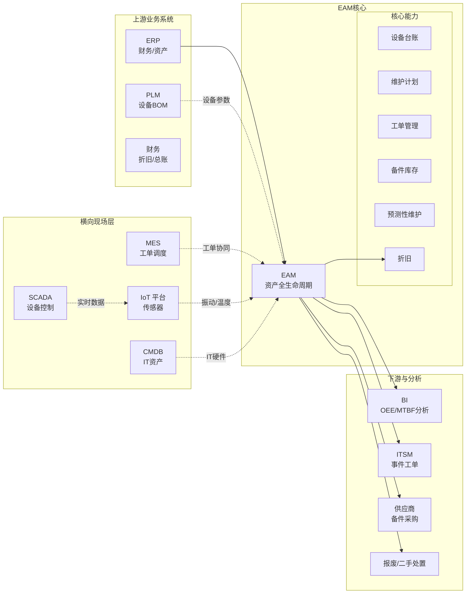

<!--
module:
  parent: application-systems
  slug: application-systems/05-operations/eam
  type: article
  category: 主模块子文章
  summary: 一份按业务场景梳理的 EAM 速查手册：从"管设备"到"管全资产"。
-->

# EAM · 企业资产管理系统

> 一份按业务场景梳理的 EAM 速查手册：从"管设备"到"管全资产"。

---

## 一、一句话定位

**EAM（Enterprise Asset Management，企业资产管理系统）**：对企业所有"有形资产"（设备/车辆/房产/IT 硬件/工具）进行全生命周期管理（采购 → 使用 → 维护 → 报废），目标是"让资产价值最大化"。

---

## 二、核心功能（5 大模块）

| 模块 | 功能 | 价值 |
|------|------|------|
| **资产台账** | 资产卡片、折旧计算 | 财务对账 |
| **维护管理** | 计划维护、故障维修、预测维护 | 减少停机 |
| **备件管理** | 备件库存、领用 | 减少库存资金 |
| **工单管理** | 维护工单、报修流程 | 流程标准化 |
| **分析报表** | OEE / MTTR / MTBF 分析 | 决策支持 |

---

## 三、典型行业应用

| 行业 | 重点 |
|------|------|
| **制造业** | 设备维护、OEE 提升 |
| **电力** | 电网设备、变电站管理 |
| **物业** | 房屋设施、电梯维护 |
| **交通** | 车辆、船舶、飞机维护 |
| **IT 运维** | 服务器、网络设备、终端 |

---

## 四、EAM vs CMMS vs ERP 区别

| 系统 | 关注点 |
|------|--------|
| **EAM** | 企业级资产管理（全生命周期）|
| **CMMS** | 维护管理系统（侧重工单）|
| **ERP** | 财务为主，资产只是其中模块 |

**关系**：EAM = CMMS（维护） + 资产财务 + 备件库存 + 数据分析

---

## 五、主流厂商/产品对比

| 类型 | 代表产品 | 适用场景 |
|------|---------|---------|
| **国际大厂** | IBM Maximo / Infor EAM / SAP PM | 大型集团 |
| **专业 EAM** | Fiix / UpKeep | 中型工厂 |
| **国内主流** | 鼎捷 EAM / 用友 / 金蝶 | 中大型 |
| **新兴 SaaS** | 修工邦 / 设备管家 | 中小 |

---

## 六、选型建议

| 场景 | 推荐 |
|------|------|
| 大型集团（资产 10 亿+）| IBM Maximo / Infor EAM |
| 中型企业 | 鼎捷 EAM / 用友 |
| 小型工厂 | 修工邦 / 设备管家 SaaS |
| 设备密集（电力/石化）| Maximo / 鼎捷 |
| 车辆管理 | 用友 / 金蝶 |

---

## 七、实施关键点

1. **资产盘点**：先盘点现有资产（RFID/二维码/扫码）
2. **编码规则**：统一资产编码（如 001-机械-001-001）
3. **预防性维护**：定期保养（PM）vs 故障维修（CM）的比例目标 80:20
4. **IoT 集成**：传感器数据接入（如振动/温度）
5. **AI 预测维护**：用机器学习预测设备故障（Remaining Useful Life）

---

← [返回业务系统总览](../README.md)

## 📊 本节统计

- **核心模块**：5 大模块（资产台账 / 维护管理 / 备件管理 / 工单管理 / 分析报表）
- **典型行业**：5 类（制造业 / 电力 / 物业 / 交通 / IT 运维）
- **对比维度**：3 系统（EAM / CMMS / ERP）
- **厂商分类**：4 类（国际大厂 / 专业 EAM / 国内主流 / 新兴 SaaS）
- **所属价值链**：05 运营管理

---

# 📚 深度补深：EAM 全景、核心能力与选型实施

> 以下章节在保留原有 98 行框架基础上扩展，深入 EAM 的全景架构、核心能力、关键模块、选型决策、实施陷阱与参考来源。

## 📌 全景图

EAM 在企业 IT 架构中的位置是"**资产全生命周期的管理中枢**"——向上承接 ERP/财务的资产数据，向下对接 MES/SCADA/IoT 的设备实时数据，向外延伸至 CMDB（IT 资产）、PLM（设备 BOP/BOM）、供应商管理（备件采购）和财务折旧系统：



> **边界与协作关键点**：
> - **EAM ↔ MES**：MES 管"生产工单"（何时生产/良率/产能），EAM 管"维护工单"（设备保养/检修）；两者共用"设备主数据"，通过设备编码打通工单关联（"在某生产工单的执行过程中触发设备故障维护工单"）。
> - **EAM ↔ SCADA/IoT**：SCADA 提供实时遥测数据（振动/温度/电流），通过 IoT 平台或边缘网关接入 EAM，驱动预测性维护（PdM）；纯 SCADA 不分析，EAM 才是分析的承担者。
> - **EAM ↔ ERP**：ERP 是资产财务的"账务账"，EAM 是资产运营的"实物账"；两边的资产折旧计算需对齐（常见"双账不一致"，见实施陷阱）。
> - **EAM ↔ CMDB**：CMDB 是 IT 资产（服务器/网络/终端）的配置管理库，与 EAM 在"IT 硬件资产"上重叠，部分企业用 CMDB 取代 EAM 的 IT 硬件模块。

## 🔧 核心能力

EAM 的"核心能力"围绕设备全生命周期展开，可拆解为 9 大能力域：

### 1. 设备台账（Asset Register / Equipment Master）
- **资产卡片**：每台设备一张卡片，含基本信息（设备编码/名称/型号/序列号/生产厂家/购置日期/原值/净值/位置/责任人）
- **编码规则**：分层编码（如 `01-02-03-0001`，01=工厂/02=车间/03=设备类型/0001=流水号）；中国国标 GB/T 50593 推荐编码
- **技术参数**：铭牌参数（额定功率/电压/转速/流量/扬程）+ 工艺参数（操作上限/下限）+ 维护参数（润滑/密封/换油周期）
- **附属文档**：说明书/图纸/合格证/保修单/检验报告（电子化归档）
- **价值**：设备台账是 EAM 的"主数据"，所有维护/工单/备件/折旧都挂在设备卡片上
- **关键指标**：台账完整率（卡片字段填写完整度）目标 ≥ 95%

### 2. 设备采购（Procurement）
- **采购申请**：使用部门提需求 → 维护部门评审 → 采购部门询价 → 财务审批
- **采购方式**：直接采购（小额/标准化）/ 招标采购（大型/定制）/ 框架协议（常用备件）
- **验收入库**：设备到货 → 开箱检验 → 安装调试 → 验收单 → 转固定资产 → 自动建台账
- **与 ERP 集成**：采购订单从 ERP 推送 EAM；资产卡片创建后推送 ERP 资产模块
- **TCO 概念**：Total Cost of Ownership（全生命周期总成本）—— 采购价仅占 20-30%，维护/能源/备件/停机损失占 70-80%

### 3. 设备点检（Inspection / Daily Check）
- **点检类别**：日常点检（操作员每日/班前/班后）/ 定期点检（专业维护员周/月/季）/ 精密点检（专业仪器，振动分析/红外热成像）
- **点检方式**：纸质点检表（落后）/ PDA 扫码点检（推荐）/ 移动 App 扫码点检
- **点检路线**：按设备重要度 + 风险等级设定巡检路径（点检员按路线扫码）
- **点检结果**：正常 / 异常（自动触发工单）/ 需润滑（自动触发润滑工单）
- **行业标准**：TPM（Total Productive Maintenance 全员生产维护）—— 把点检纳入操作员日常职责（"我的设备我维护"）
- **关键指标**：点检完成率 ≥ 98%，点检异常发现率 5-15%

### 4. 维护工单（Maintenance Work Order）
- **工单类型**：
  - **纠正性维护（CM, Corrective Maintenance）**：故障后维修（被动响应，"救火"）
  - **预防性维护（PM, Preventive Maintenance）**：定期保养（主动预防，按时间/工作量触发）
  - **预测性维护（PdM, Predictive Maintenance）**：基于状态监测（按设备实际状态触发）
  - **改善性维护（Improvement Maintenance）**：消除根本问题（一次性项目）
- **工单生命周期**：创建 → 派工 → 接单 → 到达现场 → 检修 → 备件领用 → 完工 → 验收 → 关闭
- **工单状态**：待派工 / 已派工 / 处理中 / 等待备件 / 等待计划 / 已完成 / 已关闭 / 已取消
- **优先级**：紧急（影响生产/安全）/ 高（影响主要设备）/ 中（一般缺陷）/ 低（可延后）
- **人员派工**：按技能（电工/钳工/机修/仪表）+ 位置（最近）+ 负荷（工作量均衡）派工
- **关键指标**：工单按时完成率 ≥ 90%，平均响应时间 MTTR（Mean Time To Repair）≤ 4 小时

### 5. 预防性维护（PM, Preventive Maintenance）
- **PM 触发方式**：
  - **时间触发**：每 N 天/周/月/年（如每月润滑、每季度小修、每年大修）
  - **计数触发**：每 N 小时运行/每 N 次循环/每 N 公里行驶
  - **条件触发**：状态达到某阈值（如温度 > 80℃触发检查）
- **PM 任务清单**：设备级"标准作业包"—— 包含步骤、工具、备件、安全注意事项、耗时
- **PM 计划**：年度 PM 计划 → 月度 PM 计划 → 周 PM 计划 → 日 PM 派工
- **PM 比例目标**：PM / (PM + CM) 比例 ≥ 80%（成熟 EAM 实施目标），CM < 20%
- **RCM（Reliability-Centered Maintenance 以可靠性为中心的维护）**：行业方法论—— 按设备功能/故障模式/后果决定维护策略（PM/PdM/Run-to-Failure）

### 6. 预测性维护（PdM, Predictive Maintenance）
- **技术原理**：通过传感器实时监测设备状态（振动/温度/压力/电流/声纹/油液），用机器学习模型识别异常征兆，预测故障时间
- **典型场景**：
  - **旋转设备**：振动频谱分析（轴承/齿轮箱/电机故障，频段 FFT 特征）
  - **电气设备**：红外热成像（接头/触点过热）+ 局部放电（开关柜绝缘）
  - **流体设备**：温度/压力/流量趋势（泵/阀门/换热器）
  - **仪表仪器**：零点漂移/精度退化
- **AI 模型**：
  - **异常检测**：Isolation Forest / AutoEncoder（识别"与正常模式偏离"）
  - **故障诊断**：CNN / LSTM + 频谱图（识别具体故障类型）
  - **RUL 预测**：Remaining Useful Life 剩余寿命预测（Transformer / XGBoost）
- **价值**：减少非计划停机 30-70%（行业基准），降低维护成本 10-25%
- **数据要求**：设备历史数据 ≥ 1 年（含正常+故障标签），传感器数据 ≥ 6 个月高频采集（秒级）

### 7. 备件管理（Spare Parts Management）
- **备件台账**：备件编码/名称/规格/适用设备/库存量/安全库存/ABC 分类
- **ABC-XYZ 分类**：
  - **ABC 分类**：按年消耗金额分（A 类 80% 金额，20% 数量；B 类中等；C 类 80% 数量，5% 金额）
  - **XYZ 分类**：按消耗波动性分（X 稳定/Y 中等/Z 不稳定）
  - **管理策略**：A+X 严格管控（安全库存 + 双周盘点）/ C+Z 简化管理（按需采购）
- **库存管理**：安全库存（Safety Stock）+ 再订货点（ROP Re-Order Point）+ 经济订货量（EOQ）
- **备件领用**：工单领料 → 库存扣减 → 成本归集到工单 → 关联设备
- **关键指标**：备件可用率 ≥ 95%，备件库存周转率 ≥ 4 次/年，呆滞库存比例 ≤ 5%
- **典型痛点**：备件积压（买了不用）+ 备件短缺（影响维修），EAM 通过 ABC 分析 + 库存预警解决

### 8. 设备折旧（Depreciation）
- **折旧方法**：直线法（平均年限）/ 工作量法（按运行小时）/ 双倍余额递减法（加速折旧）/ 年数总和法
- **折旧周期**：按税法规定（机械 10 年/电子 3-5 年/房屋 20 年）与按实际使用寿命（可能短于税法）
- **与 ERP 对账**：EAM 的资产净值 vs ERP 财务账面值—— **常见"双账不一致"**（实施陷阱 #6）
- **残值管理**：设备报废时残值处置（出售/回收/捐赠），净残值 = 报废收入 - 处置费用
- **关键作用**：准确折旧 → 真实反映设备资产价值 → 辅助"该不该换"的决策

### 9. 设备报废（Retirement / Disposal）
- **报废流程**：使用部门申请 → 技术鉴定（不可修复/经济性差/超期服役）→ 财务审批 → 残值评估 → 处置（变卖/回收/捐赠/销毁）
- **报废标准**：
  - **技术报废**：超过设计寿命 / 故障频繁 / 修复费用 > 现值
  - **经济报废**：运营成本 > 购置新设备成本（更新换代）
  - **政策报废**：行业强制淘汰（如高耗能电机/老旧锅炉）
  - **安全报废**：存在安全隐患 / 不符合新法规
- **残值与处置**：
  - **变卖**：二手市场（二手机床/工程车辆有活跃市场）
  - **回收**：金属回收（钢铁/铜/铝）
  - **环保处置**：危废（电池/油液/电子元件）按环保法规处置
- **EAM 价值**：自动触发报废决策（基于 TCO 模型），处理合规审批，记录完整档案（30 年留存）

## 📊 关键模块详解

### 设备台账模块（Asset Master Data）
**核心地位**：台账是 EAM 的"主数据根基"——所有维护/工单/备件/折旧都挂接设备卡片。**台账质量决定 EAM 实施成败**。

- **核心字段**：
  - **基础信息**：编码、名称、型号、序列号、生产厂家、出厂日期、购置日期、启用日期
  - **位置信息**：工厂/车间/工段/工位（4 级位置树）
  - **财务信息**：原值/净值/累计折旧/折旧方法/使用年限/残值率
  - **技术参数**：铭牌参数（功率/电压/转速）+ 工艺参数 + 维护参数
  - **责任信息**：使用部门/维护部门/责任人/操作员
  - **关联关系**：父设备（如产线→工位→设备）/ 子设备（如电机→轴承）/ 相关备件
- **编码设计**：
  - **分层编码**：`工厂-车间-工段-设备类型-流水号`（如 `01-02-03-0001`）
  - **功能码 + 位置码**：如 `P-001`（泵 #001）/ `C-002`（压缩机 #002）
  - **国际标准**：KKS 编码（德标电厂常用）/ KLM 编码（日标）/ ISA-95 命名
- **台账盘点**：
  - **盘点方式**：RFID（批量盘点，效率高）+ 二维码（扫码盘点，普及广）+ 人工盘点（兜底）
  - **盘点频次**：年度大盘 + 季度抽盘 + 月度循环盘点
  - **账实核对**：EAM 台账 vs 实物 vs 财务账—— 三方一致是基础
- **关键指标**：
  - **台账完整率** = 有完整字段的资产 / 总资产 × 100%（目标 ≥ 95%）
  - **账实一致率** = 实物存在且编码匹配 / 总资产 × 100%（目标 ≥ 98%）

### 维护计划模块（Maintenance Planning）
**核心地位**：维护计划是 PM 的"执行蓝图"——没有计划，PM 退化为 CM（救火模式）。

- **PM 任务模板**：
  - **任务包**：一组标准步骤（步骤/工具/备件/安全/耗时/技能要求）
  - **任务类型**：润滑/清洁/紧固/检查/更换/测试/校准
  - **任务模板创建**：维护工程师基于设备类型创建（如"电机月度润滑"模板适用于所有电机）
- **PM 计划类型**：
  - **时间型 PM**：每 N 天/周/月（如"每月 1 号润滑"）
  - **计数型 PM**：每 N 小时/次/公里（如"每运行 500 小时换油"）
  - **混合型 PM**：时间和计数先到先触发（如"每 1000 小时或每 6 个月，以先到为准"）
- **PM 计划编制**：
  - **年度 PM 计划**：全年 PM 排程（重要设备 24×7 排，避免扎堆）
  - **月度 PM 计划**：细化到具体日期 + 责任班组
  - **PM 平衡**：避免 PM 集中爆发（如"周一集中 PM"导致维护人员过载）
- **PM 优化**：
  - **RCM 分析**：对每台关键设备进行 RCM 分析，决定 PM 策略（PM/PdM/Run-to-Failure）
  - **任务合并**：相同时间窗的任务合并执行（如月度 PM 把润滑/紧固/清洁合并为一次停机）
  - **机会维护**：在生产停机间隙/检修期间顺便做 PM（"搭车维护"）
- **关键指标**：PM 计划达成率 ≥ 95%，PM/(PM+CM) ≥ 80%

### 工单管理模块（Work Order Management）
**核心地位**：工单是 EAM 的"业务流"——所有维护活动通过工单承载（CM/PM/PdM/项目/改造都建工单）。

- **工单来源**：
  - **点检触发**：点检发现异常 → 自动生成 CM 工单
  - **PM 计划触发**：按 PM 计划自动生成 PM 工单
  - **预测告警触发**：PdM 模型告警 → 生成检查工单或预防性更换工单
  - **人工报修**：操作员报修按钮 / 扫码报修 → 生成 CM 工单
  - **项目触发**：设备改造/升级项目 → 生成项目工单
- **工单执行流程**：
  1. **创建**：来源（点检/PM/PdM/报修/项目）+ 设备 + 故障描述 + 优先级
  2. **派工**：自动派工（按班组/技能/位置/负荷）或手工派工
  3. **接单**：维护人员收到工单（移动 App/邮件/短信）
  4. **现场签到**：到达现场扫码签到（GPS/二维码/蓝牙信标）
  5. **故障诊断**：检查 → 确定原因 → 记录（故障代码/原因代码）
  6. **备件领用**：扫码领料 → 库存自动扣减 → 成本归集
  7. **实际工时**：开始/结束时间 → 自动计算工时
  8. **完工报告**：实际工序/更换备件/发现问题/建议
  9. **验收**：使用部门验收签字（移动端）
  10. **关闭**：工单状态关闭，KPI 累计（MTTR/MTBF）
- **关键字段**：
  - **计划信息**：计划开始/结束时间、计划工时
  - **实际信息**：实际开始/结束时间、实际工时、实际成本
  - **故障信息**：故障代码/原因代码/处置代码（行业标准如 ISO 14224）
  - **关联信息**：关联设备、关联工单（多工单联动）、关联领料、关联文档
- **关键指标**：
  - **MTTR**（Mean Time To Repair 平均修复时间）= 总维修时间 / 维修次数
  - **MTBF**（Mean Time Between Failures 平均故障间隔时间）= 总运行时间 / 故障次数
  - **MTTF**（Mean Time To Failure 平均故障前时间，针对不可修设备）
  - **工单按时完成率** = 按时完成工单数 / 工单总数 × 100%（目标 ≥ 90%）

### 备件库存模块（Spare Parts Inventory）
**核心地位**：备件库存是"**维修的弹药库**"——备件短缺导致停机延长（备件等待占 MTTR 的 30-50%）。

- **备件主数据**：编码/名称/规格型号/计量单位/适用设备/库存量/安全库存/最大库存/再订货点
- **库存管理模型**：
  - **定量订货（Q-Model）**：库存降到再订货点 → 订货固定量 EOQ（适合 A+X 类备件，稳定消耗）
  - **定期订货（P-Model）**：固定周期检查库存 → 补到最大库存（适合 C+Z 类备件）
  - **双堆法（Two-Bin）**：两个仓位的物理管理，触及下仓位触发订货（适合简单品类）
- **库存优化**：
  - **ABC-XYZ 分析**：A+X 严格管控，A+Z 灵活，C 类简化
  - **呆滞库存清理**：超过 12 个月无出库的备件 → 评估处置（变卖/调拨/废弃）
  - **替代件管理**：不同厂家但可互换的备件建立映射（如 SKF 轴承与 FAG 轴承等价）
- **备件与设备 BOM**：
  - **设备 BOM**（Bill of Materials）：每台设备的备件清单（如"电机→轴承/密封圈/接线端子"）
  - **关键备件**：易损件 + 更换周期短的备件 → 设安全库存
- **关键指标**：
  - **备件可用率** = 一请即到（不缺货）的备件数 / 申请备件数 × 100%（目标 ≥ 95%）
  - **库存周转率** = 年出库金额 / 平均库存金额（目标 ≥ 4 次/年）
  - **呆滞库存比例** = 12 个月未动库存金额 / 总库存金额（目标 ≤ 5%）

### 预测性维护模块（PdM, Predictive Maintenance）
**核心地位**：PdM 是 EAM 的"**智能化前沿**"——从被动响应转向主动预测，是制造业 EAM 价值最大化的关键。

- **PdM 技术栈**：
  - **感知层**：振动传感器 / 温度传感器 / 压力传感器 / 电流互感器 / 油液在线监测 / 红外热成像仪
  - **传输层**：边缘网关（采集 + 预处理）+ 5G/WiFi/LoRa（无线传输）
  - **平台层**：IoT 平台（设备接入 + 数据存储）+ 时序数据库（InfluxDB / TDengine）
  - **算法层**：异常检测模型 + 故障诊断模型 + RUL 预测模型
  - **应用层**：PdM 告警平台 + 工单自动生成 + 可视化看板
- **PdM 场景分类**：
  - **振动分析**：旋转设备主流方案，FFT 频谱识别轴承/齿轮故障（如 SKF / Brüel & Kjær）
  - **油液分析**：润滑油在线监测，识别磨损颗粒（ICP-OES / 铁谱分析）
  - **红外热成像**：电气设备（开关柜/变压器）/ 机械（轴/轴承），识别过热
  - **电机电流分析（MCSA）**：电机定子/转子故障
  - **声纹分析**：新兴方向，深度学习识别异音
  - **超声检测**：高压设备局放（GIS/变压器）
- **PdM 项目实施步骤**：
  1. **设备分级**：A 类关键设备（高价值/高故障成本）优先做 PdM
  2. **故障模式分析（FMEA）**：识别关键设备的故障模式与征兆
  3. **传感器选型**：根据故障模式选传感器（振动/温度/电流等）
  4. **数据采集**：安装传感器 + 历史数据回溯（≥ 6 个月）
  5. **模型训练**：基于历史数据训练异常检测/故障诊断模型
  6. **上线验证**：盲测验证模型准确度（目标 ≥ 85%）
  7. **运维迭代**：持续采集新数据，迭代模型
- **PdM 价值**：
  - **降低非计划停机 30-70%**（行业基准）
  - **降低维护成本 10-25%**（减少过度维护）
  - **延长设备寿命 20-40%**（及时发现处理）
  - **关键前提**：设备密度高（≥ 50 台关键设备）+ 历史数据充分 + 投入产出合理

### IoT 集成模块（IoT Integration）
**核心地位**：IoT 是 PdM 的"**数据底座**"——没有 IoT 数据，PdM 是空中楼阁。

- **IoT 接入方式**：
  - **PLC 直连**：通过 OPC UA / Modbus / PROFIBUS 协议直连设备 PLC（西门子 S7/三菱/罗克韦尔）
  - **SCADA 接入**：从 SCADA 系统读取实时数据（已聚合的设备数据）
  - **IoT 网关**：边缘网关采集传感器数据（振动/温度），MQTT/Modbus 协议接入 IoT 平台
  - **第三方平台**：阿里云 Link IoT / 华为云 IoTDA / 微软 Azure IoT Hub
- **IoT 数据应用**：
  - **实时监控**：设备状态大屏（运行/停机/告警）
  - **数据采集**：历史数据存入时序数据库，支撑 PdM 模型
  - **告警联动**：设备异常 → 自动触发维护工单（如温度 > 阈值）
  - **OEE 计算**：自动采集运行/性能/质量数据，计算 OEE
- **典型 IoT-EAM 集成架构**：
  - **边缘层**：传感器/PLC/SCADA（数据源）
  - **网关层**：边缘网关（协议转换 + 预处理）
  - **平台层**：IoT 平台 + EAM + BI
  - **应用层**：监控大屏 + 工单 App + 分析报表
- **集成挑战**：
  - **协议异构**：不同厂家设备协议不同（OPC UA / Modbus / PROFIBUS / EtherNet/IP）
  - **数据高频**：振动数据每秒上万条，传统 EAM 数据库扛不住（需时序数据库）
  - **网络安全**：工业控制系统（OT）网络安全要求高（隔离/单向网闸）

### 设备绩效 OEE 模块（OEE, Overall Equipment Effectiveness）
**核心地位**：OEE 是 EAM 的"**北极星指标**"——衡量设备综合效率，是设备管理水平的"成绩单"。

- **OEE 三要素**（基于 SEMI E10）：
  - **可用率（Availability）** = 实际运行时间 / 计划运行时间
  - **性能率（Performance）** = 实际产出 / 理论产出（考虑速度损失）
  - **合格率（Quality Rate）** = 合格品数 / 总产出
  - **OEE = 可用率 × 性能率 × 合格率**（乘积关系）
- **OEE 基准**：
  - **世界级**（World Class）：OEE ≥ 85%（可用率 90% × 性能率 95% × 合格率 95%）
  - **优秀**：OEE 70-85%
  - **平均**：OEE 60-70%
  - **改进空间大**：OEE < 60%
- **OEE 数据来源**：
  - **可用率**：设备运行/停机时间（EAM 工单数据 + IoT 状态数据）
  - **性能率**：实际节拍 vs 标准节拍（MES/PLC 数据）
  - **合格率**：合格品数 / 总产出（MES/QMS 数据）
- **OEE 损失分析**：
  - **可用率损失**：设备故障/换模/调整（EAM 主导改进）
  - **性能率损失**：速度降低/小停机（设备/MES 主导）
  - **合格率损失**：废品/返工（QMS 主导）
- **关键应用**：
  - **OEE 看板**：车间大屏实时显示每台设备 OEE
  - **OEE 损失根因分析**：每周 OEE 损失归因会议（EAM + MES + QMS 联席）
  - **OEE 改善项目**：基于 OEE 损失的优先级排序改善项目

### 文档管理模块（Document Management）
**核心地位**：文档是设备的"**说明书**"——维护/操作/合规的依据。

- **文档类型**：
  - **设备文档**：说明书/图纸（机械图/电气图/液压图）/ 合格证/检验报告
  - **维护文档**：PM 标准作业包/工单模板/故障处理 SOP
  - **合规文档**：压力容器/起重机械/特种设备的检验报告（合规留存 30 年）
  - **合同文档**：采购合同/保修合同/维保合同
- **管理要点**：
  - **版本管理**：文档版本（V1.0/V1.1/V2.0），历史版本可查
  - **权限管理**：按角色授权（操作员看 SOP/工程师看图纸/领导看报告）
  - **电子化查阅**：PDA/移动端在线查阅（取代纸质手册）
  - **扫描归档**：纸质文档扫描 OCR 识别 → 关键字段提取
- **文档与设备关联**：每份文档挂接到具体设备（如"电机 M-001 说明书"），设备卡片可一键查阅所有相关文档

## 🏆 选型决策

### 自研 vs 商用 vs SaaS

| 维度 | 自研 EAM | 商用 EAM（私有化） | SaaS EAM |
|------|----------|------------------|----------|
| **适用规模** | 央国企/军工/特殊行业（合规极严）| 中大型企业（数据本地化要求）| 中小企业 / 通用场景 |
| **优势** | 100% 自主可控 / 深度定制 / 行业匹配 | 数据本地化 / 行业方案成熟 / 合规保障 | 快速上线（数周）/ 成本低 / 免运维 |
| **劣势** | 投入大（5000 万-1 亿+）/ 周期长（2-5 年）/ 需对接 IoT + 移动 + 分析 | 投入中等（500-3000 万）/ 运维成本高 | 数据在 SaaS 厂商 / 定制受限 |
| **典型代表** | 大型央国企自研（如国家电网 PMS）| Maximo 私有化 / Infor EAM 私有化 / 鼎捷 EAM | 修工邦 / 设备管家 / Fiix / UpKeep |
| **决策阈值** | 特殊合规 + 长期投入 + 强定制 → 自研；否则 → 商用/SaaS | 数据本地化 + 中等规模 → 私有化 | 通用场景 + 快速上线 → SaaS |

### 国际三巨头 vs 国内五虎

| 厂商 | 总部 | 定位 | 优势 | 劣势 | 适用规模 |
|------|------|------|------|------|---------|
| **IBM Maximo** | 美国（纽约） | **EAM 全球龙头** | **全球第一**（超过 10000+ 客户，覆盖 100+ 国家/40+ 行业）/ 完整功能（11 大模块全覆盖）/ 行业方案深（电力/航空/铁路/石油）/ 支持多租户 / SaaS + 私有化 | **贵**（License 500-2000 万起）/ 实施复杂（需专业顾问）/ UI 偏旧 | 大型集团 / 跨国 / 资产密集（电力/航空/铁路） |
| **Infor EAM** | 美国（纽约） | EAM 第二 | **行业方案深**（制造业/酒店/医疗/政府）/ 用户体验好（Web 化）/ 云原生 Infor OS | 国际化弱于 Maximo / 中国本地化弱 | 中大型集团 / 跨国制造 / 资产密集 |
| **SAP PM** | 德国（沃尔多夫） | SAP 资产模块 | **与 SAP ERP 深度集成**（资产主数据/财务无缝）/ 跨国合规 / 流程规范 | 仅 SAP ERP 用户友好 / 独立 EAM 体验弱 | 已用 SAP ERP 的大型集团 / 跨国 |
| **Oracle EAM** | 美国（奥斯汀） | Oracle 资产模块 | **与 Oracle ERP 深度集成** / 流程规范 | 仅 Oracle ERP 用户友好 / 行业方案弱 | 已用 Oracle EBS/Cloud 的大型集团 |
| **Aveva EAM（formerly InduSoft/Wonderware）** | 英国（剑桥） | 工业 EAM + MES | **与 Aveva PI System 集成强**（实时数据）/ OT 与 IT 融合 | EAM 模块功能弱于 Maximo/Infor | 工业 4.0 / 数字孪生场景 |
| **鼎捷 EAM** | 中国（台北/上海） | **国内 EAM 第一** | **本土化最强**（ERP 集成深）/ 制造业方案深 / 性价比高 | 国际化弱 / IoT/PdM 弱于国际 | 国内中大型制造 / 已用鼎捷 ERP |
| **用友 / 金蝶 EAM** | 中国（北京/深圳） | ERP + EAM | **财务 + EAM 一体化**（资产折旧无缝）/ 国密合规 / 国内中大型覆盖广 | 设备维护功能弱于专业 EAM | 国内中大型（财务驱动）/ 已用用友金蝶 |
| **修工邦 / 设备管家** | 中国（北上深） | 新兴 SaaS | **快速上线（数周）/ 移动端体验好** / 价格低（万元级别） | 仅适合中小 / 定制弱 / 不支持 IoT 深度集成 | 中小工厂 / 起步阶段 |
| **智参 / 树根互联** | 中国（广州） | 工业互联网 + EAM | **IoT + AI 强**（设备数据接入 + PdM）/ 工业互联网生态 | EAM 传统功能弱 / 适合场景有限 | 工业互联网试点 / 已用树根互联平台 |
| **设备邦（设备医生）** | 中国（杭州） | 设备管理 SaaS | **移动巡检 + IoT 集成** / 性价比高 | 行业方案少 / 大型项目能力弱 | 中小制造 / 设备巡检场景 |

### 选型决策树（5 层）

1. **先看规模与资产密度**：
   - 资产 100 亿+ 的大型集团 → Maximo / Infor EAM（功能强 + 行业方案深）
   - 资产 10-100 亿的中型集团 → 鼎捷 EAM / Infor EAM（本土化 + 性价比）
   - 资产 1-10 亿的中小企业 → 修工邦 / 设备管家（SaaS 快速上线）
   - 资产 < 1 亿的小工厂 → SaaS + 通用 OA（用 SaaS 起步）
2. **再看行业**：
   - 电力/航空/铁路/石油 → Maximo（行业方案深）
   - 制造业 → 鼎捷 / Infor / Aveva
   - 物业/酒店 → Infor / 修工邦
   - 军工/特殊行业 → 自研或国产化（考虑国密合规）
3. **再看合规**：
   - 央国企/军工 → 国产化或私有化（数据本地化 + 国密合规）
   - 跨国企业 → Maximo / Infor（多语言 + 多地区合规）
   - 中小企业 → SaaS 通用方案
4. **再看 IoT/PdM 需求**：
   - 关键设备多 + 故障成本高 → 选择 PdM 能力强的厂商（Maximo + Aveva PI / 树根互联）
   - 简单巡检 → 标准 EAM 即可
5. **最后看集成**：
   - 已用 SAP/Oracle ERP → 配套 SAP PM / Oracle EAM
   - 已用国产 ERP（用友/金蝶）→ 用友 EAM / 金蝶 EAM
   - 多系统集成复杂 → Maximo（API 完善）

### TCO 估算要点（1000 人企业 5 年 TCO）

- **IBM Maximo 私有化**：1000-3000 万（License 50% + 实施 30% + 集成 15% + 运维 5%）
- **Infor EAM 私有化**：800-2000 万
- **SAP PM（搭配 SAP ERP）**：增量 500-1500 万（已有 SAP ERP）
- **鼎捷 EAM**：300-800 万（本土化，性价比高）
- **修工邦 SaaS**：50-200 万（订阅 60% + 实施 30% + 集成 10%）
- **设备管家 SaaS**：30-100 万
- **自研 EAM**：3000 万-1 亿 + 500 万/年级运维

## 🚨 实施陷阱 / 反模式

### 陷阱 1：设备台账不完整

**现象**：EAM 上线后，工单/维护/备件功能都用不起来——根因是设备台账缺失字段（位置/技术参数/责任人），工单无法关联设备。

**根因**：
- 急于上线，盘点不彻底（一次性盘点 70% 资产卡住）
- 编码规则混乱（多个编码体系并存，新设备无编码）
- 字段定义不清（"位置"字段名笼统，无法精确定位）
- 责任人不明确（资产责任部门/责任人空白）

**规避**：
- **先行盘点，再上线**：用 3-6 个月集中盘点（RFID + 人工），目标账实一致率 ≥ 98%
- **统一编码规则**：发布企业级《资产编码规范》，新购资产强制按规范编码
- **字段标准化**：每个字段定义填写规范（如"位置"采用"工厂-车间-工段-工位"四级）
- **责任到人**：每台资产指定责任部门和责任人，未指定的不允许入库

### 陷阱 2：维护计划形式化（PM 退化为 CM）

**现象**：EAM 上线后，PM 计划一大堆但实际无人执行；维护人员按 PM 计划打卡但实际"零维护"；最终 PM 比例从目标 80% 跌到 20%，系统变成"打卡器"。

**根因**：
- PM 任务模板设计过于理想化（如"5 小时完成"实际需 2 天）
- 没有 PM 执行资源（维护人员不足 / 备件不足）
- 没有 PM 完成标准（执行了就行，无验收）
- 考核机制偏差（考核 PM 计划达成率而非 PM 完成质量）

**规避**：
- **PM 任务精细化**：基于历史数据设计任务（工时/备件/工具必须可执行）
- **平衡 PM 与生产**：月度平衡会议（EAM + 生产），把 PM 嵌入生产停机间隙
- **PM 完成验收**：PM 工单必须填写"实际做了什么"+"发现什么问题"，由工程师审核
- **考核 PM 质量**：考核"设备故障率"而非"PM 完成数"—— PM 做得好的设备故障率应下降

### 陷阱 3：备件积压（数千万库存沉淀）

**现象**：EAM 上线后，备件库存不断增长（年增 10-20%），3-5 年后沉淀数千万呆滞库存，占用大量资金。

**根因**：
- 备件安全库存过高（拍脑袋设 3 个月 → 实际平均 6-12 个月）
- ABC 分类未做或不准（A 类备件管理同 C 类）
- 无替代件管理（不同品牌相同规格各买一套）
- 缺乏呆滞库存清理机制

**规避**：
- **ABC-XYZ 分析**：基于年消耗金额 × 波动性四象限分类，每类设不同策略
- **科学安全库存**：基于服务水平（95%/98%/99%）+ 采购周期 + 消耗波动计算
- **备件领用追溯**：每件备件领用关联工单（"为什么领"），反推需求合理性
- **年度呆滞清理**：每年度专题盘点呆滞库存，处置（变卖/调拨/弃用）

### 陷阱 4：预测性维护数据不足（POC 失败）

**现象**：企业想上 PdM，采购 IoT 传感器 + 部署平台 + 训练模型，但上线后误报率 80%+，"狼来了"故事频发，维护人员不再信任告警。

**根因**：
- 历史数据不足（生产数据 < 6 个月，特别是故障样本）
- 传感器选型不当（振动传感器采样频率不够 / 安装位置不对）
- 模型验证不充分（未做盲测就上线）
- 缺乏现场工程师闭环（告警无响应机制）

**规避**：
- **小步快跑 POC**：选 5-10 台关键设备 6 个月 POC，验证数据采集 + 模型 + 业务闭环
- **数据基础先行**：上 PdM 前必须有 1 年以上设备维护数据（含故障标签）
- **传感器选型对版**：根据 FMEA 故障模式选传感器（不是传感器越多越好）
- **盲测验证**：模型上线前用未标注数据盲测，精确度 ≥ 85% 才上线
- **人机闭环**：告警 → 工单 → 处理 → 反馈，必须形成业务闭环

### 陷阱 5：与 IoT 集成失败（"数据孤岛"陷阱）

**现象**：EAM 接 IoT，但传感器数据与 EAM 工单数据未打通——传感器告警在 IoT 平台，EAM 工单在另一个系统，维护人员两边跑。

**根因**：
- IoT 与 EAM 集成"只做表面"——数据流没打通
- 协议适配不充分（不同品牌 PLC 协议不同）
- 缺乏数据治理（IoT 数据质量差，EAM 拒收）

**规避**：
- **统一数据底座**：选 IoT 平台时考虑与 EAM 集成（Maximo 自带 IoT / 鼎捷 / 树根互联有现成集成）
- **协议适配**：评估 IoT 平台多协议支持能力（OPC UA / Modbus / PROFIBUS / MQTT）
- **告警联动**：IoT 告警 → 自动调 EAM API 建工单（一键打通）
- **数据质量治理**：IoT 上线前做数据质量评估（缺失率/异常率），治理好再对接

### 陷阱 6：与 ERP 折旧冲突（"双账不一致"陷阱）

**现象**：EAM 与 ERP 都做资产折旧，两边资产净值不一致——财务按 ERP 数据做账，但 EAM 实际维护记录与 ERP 对不上。

**根因**：
- EAM 与 ERP 资产主数据不同步（编码不一致/购置日期不同）
- 折旧方法在两边分别设置，未对齐
- 资产变更（位置/部门）只在一个系统更新

**规避**：
- **主数据统一**：资产主数据以一个系统为单一可信源（通常以 ERP 为准），EAM 订阅
- **折旧单一计算**：折旧只在一个系统计算（推荐 ERP，因为财务对账），EAM 只读
- **双向同步**：资产创建/变更/报废 → 两边实时同步（消息队列或 API）
- **月度对账**：EAM 资产 vs ERP 资产，差异列表解决

### 陷阱 7：移动端体验差（巡检/工单 App 被弃用）

**现象**：EAM 配套移动 App 上线后，操作员和维护员拒绝使用——"不如用手写方便"。现场仍用纸质单据。

**根因**：
- App 操作复杂（5 层菜单才能点检）
- 离线不可用（地下车间/户外无信号）
- 加载慢/卡顿（设备老旧 + App 性能差）
- 流程不变（App 只是把纸质流程电子化）

**规避**：
- **极简设计**：单页面操作，扫码直接进入任务（不超过 3 步）
- **离线优先**：支持离线操作（数据本地缓存），有信号时同步
- **深度适配**：PDA/手机扫码 + 拍照 + GPS + 离线签名
- **流程重塑**：App 上线前重塑流程（去除纸质时代的繁琐步骤）

### 陷阱 8：组织变革阻力（"老员工拒绝新系统"）

**现象**：EAM 上线后，老维护员/老操作员拒绝使用——"我干了 20 年维护，不用系统也知道怎么干"。

**根因**：
- EAM 流程改变老员工工作习惯
- 缺乏变革沟通（员工不知道为什么变）
- 缺乏培训（员工不会用系统）
- KPI 考核偏离（用系统 vs 凭经验，激励错位）

**规避**：
- **高管挂帅**：EAM 项目必须有高管（如生产副总）挂帅
- **早期参与**：让资深维护员参与系统设计与流程设计（"我们设计的"）
- **分阶段培训**：基础培训（全员）+ 进阶培训（关键角色）+ 现场辅导（首个 PM 周期）
- **KPI 重新设计**：把"EAM 使用率"（点检/工单在系统完成的比例）纳入考核
- **早期看见价值**：先在 1 个车间/工段做"灯塔项目"，快速看见价值（如 PM 完成率从 60% 升到 90%）

### 陷阱 9：选型过度追求"大而全"（买了功能用不起来）

**现象**：企业花重金买 Maximo 全模块，但实际只用了 30%（工单 + 备件），其他模块（如 PdM）空置。

**根因**：
- 选型看产品不看需求（销售导向，被 Maximo "所有功能都强"吸引）
- 未做差距分析（不清楚自己需要哪些功能）
- 未做投资回报分析（不了解每个模块的成本/收益）

**规避**：
- **差距分析先行**：用 Gartner EAM 能力模型评估现状，明确所需功能
- **分模块实施**：先核心模块（设备台账 + 工单 + 备件）→ 二期扩展（PM/PdM）
- **TCO 与 ROI 分析**：每个模块的投入（License + 实施 + 运维）与收益（OEE 提升/停机减少）

### 陷阱共性规律

行业研究统计 EAM 项目失败/未达预期率约 **30-50%**，主要失败原因分布：
- 约 **25%** 源自「数据基础薄弱」（台账不完整 / 主数据混乱 / 编码缺失）
- 约 **20%** 源自「流程未重塑」（仍按纸质流程运行系统 / 系统只是表面工具）
- 约 **15%** 源自「组织变革未做」（高管不重视 / 员工不配合 / 培训不足）
- 约 **15%** 源自「IoT/PdM 数据基础不足」（历史数据少 / 传感器选型错 / 模型不准）
- 约 **15%** 源自「集成黑洞」（ERP/MES/SCADA 集成"只做表面"）
- 约 **10%** 源自「选型偏差」（买了不适用 / 功能过度 / 实施商能力弱）

规避核心：「**数据基础先行 + 流程重塑 + 组织变革 + IoT/PdM 小步快跑 + 深度集成 + 选型匹配需求**」是 EAM 实施的 **6 大关键成功要素**。

## 🛤️ 学习路线

### 入门（0-3 个月，建立基础认知）

1. **第 1-4 周**：阅读 EAM 基础教材（如《EAM 企业资产管理体系》），理解 EAM vs CMMS vs ERP 边界
2. **第 5-8 周**：研究 TPM/RCM 方法论（TPM 全员生产维护 + RCM 以可靠性为中心的维护）
3. **第 9-12 周**：试用 1 个 SaaS EAM（如修工邦免费版 / 设备管家体验版），亲手做设备台账 + 工单

### 进阶（3-12 个月，深度技能）

1. **3-6 个月**：选择一个细分模块（设备台账 / PM / PdM / IoT 集成 / 备件）做深度研究——理论 + 厂商方案 + POC
2. **6-9 个月**：参与 1 个 EAM 实施项目，从需求调研 → 选型 → 数据治理 → 实施 → 上线全流程
3. **9-12 个月**：学习 PdM AI 模型（异常检测 + RUL 预测），了解 EAM 与 IoT/AI 融合趋势

### 精通（12 个月以上，专家级）

1. **12-24 个月**：主导 1 个企业级 EAM 实施（≥ 10000 台设备/10000+ 月工单/3+ 系统集成），覆盖选型/数据/PM/PdM/IoT
2. **24-36 个月**：建立 EAM 选型方法论（决策树 / RFP 模板 / POC 脚本 / 数据治理手册），成为公司 EAM 选型的"内部顾问"
3. **36 个月+**：横向扩展到"**设备全生命周期数字化**"——EAM + MES + SCADA + IoT + AI + 数字孪生；主导企业"智能制造"战略

### 学习资源

- **国际标准**：ISO 55000（资产管理系列标准）/ ISO 14224（设备可靠性数据收集）/ IEC 60300（可靠性维修）/ SEMI E10（OEE 定义）
- **方法论**：TPM（Total Productive Maintenance 全员生产维护）/ RCM（Reliability-Centered Maintenance）/ FMEA（Failure Mode and Effects Analysis 故障模式分析）/ 8D Report（八项问题解决）
- **书籍**：《EAM 实施指南》《设备管理与维修》《可靠性维修工程》《预测性维护技术》《智能制造与设备管理》
- **平台文档**：IBM Maximo 文档中心 / Infor EAM University / 鼎捷 EAM 学院 / 树根互联开发者平台
- **行业组织**：中国设备管理协会（CAM）/ 国际资产管理协会（IAM）/ 美国维修与可靠性协会（SMRP）/ 国际维护大会（ICOMS）
- **认证**：SMRP CMRP（Certified Maintenance and Reliability Professional 维护可靠性专家）/ IAM 资产管理专家 / CSEP（Certified Systems Engineering Professional）

## 🔗 上下游关系

```mermaid
flowchart LR
    subgraph 上游业务
        ERP[ERP<br/>资产财务]
        PLM[PLM<br/>设备BOM]
        Procurement[采购<br/>备件采购]
    end
    subgraph 横向现场层
        MES[MES<br/>生产工单]
        SCADA[SCADA<br/>实时控制]
        IoT[IoT 平台<br/>传感器数据]
        CMDB[CMDB<br/>IT资产]
    end
    subgraph EAM
        EAM[EAM<br/>资产全生命周期]
    end
    subgraph 下游与分析
        BI[BI<br/>OEE分析]
        OTSM[ITSM<br/>事件工单]
        Finance[财务<br/>折旧分摊]
        Disposal[报废/二手处置]
    end
    ERP -->|资产主数据| EAM
    PLM -.设备BOM.-> EAM
    Procurement -->|备件订单| EAM
    MES -.工单协同.-> EAM
    SCADA -.实时数据.-> IoT
    IoT -.振动/温度.-> EAM
    CMDB -.IT资产.-> EAM
    EAM --> BI
    EAM --> OTSM
    EAM --> Finance
    EAM --> Disposal
```

- **上游业务系统**：ERP（资产财务/折旧账）/ PLM（设备 BOM 与技术参数）/ 采购（备件采购订单）/ HR（维护人员资质）
- **横向现场层**：MES（生产工单与维护工单协同）/ SCADA（设备实时控制 + 遥测数据）/ IoT 平台（传感器接入 + 数据湖）/ CMDB（IT 硬件资产）
- **下游与分析**：BI（OEE/MTBF/MTTR 可视化）/ ITSM（事件工单联动）/ 财务（折旧自动分摊）/ 报废处置（二手交易/危废处置）

**集成要点**：
- **EAM ↔ ERP**：资产主数据统一（推荐 ERP 为单一可信源，EAM 订阅）+ 折旧单一计算（ERP）+ 双向同步（资产变更事件驱动）+ 月度对账
- **EAM ↔ MES**：生产工单与维护工单协同（生产过程中触发维护工单）+ 设备 OEE 数据共享（EAM 的维护数据提升 MES 的可用率分析）+ 共同维护设备主数据
- **EAM ↔ SCADA/IoT**：SCADA/IoT 提供实时数据（振动/温度/压力）+ EAM 反馈工单状态（"维护中" vs "运行中"）+ 双向打通实现 PdM
- **EAM ↔ CMDB**：IT 硬件资产可在两个系统选其一管理（推荐 CMDB 管 IT 资产/EAM 管 OT 资产）；如必须双管，需主数据同步
- **EAM ↔ BI**：EAM 提供工单/MTBF/MTTR 数据 → BI 做 OEE/可用率/维护成本可视化 → 决策支持

## ⚖️ 关键考量

- **数据基础决定实施成败**：台账完整率 ≥ 95% / 账实一致率 ≥ 98% 是 EAM 启动前提
- **PM/(PM+CM) 比例是成熟度核心指标**：≥ 80% 是世界级水平
- **PdM 是 EAM 价值最大化的关键**：可降低非计划停机 30-70%（行业基准）
- **OEE 是设备管理北极星指标**：世界级 ≥ 85%
- **移动端决定一线使用率**：70% 用户操作在移动端完成
- **集成决定价值上限**：EAM 孤立使用仅是"维护工具"，与 MES/ERP/IoT 集成是"资产数据中枢"
- **国产化与合规**：央国企/军工优先国产（鼎捷/用友/金蝶）或国产化定制（Maximo 国产化版本）
- **安全合规**：特种设备（压力容器/起重机械/电梯）需按法规留存检验档案 30 年

## 🎯 选型指南

| 企业类型 | 推荐 | 理由 |
|---------|------|------|
| 跨国集团（万人+） | Maximo / Infor EAM | 多语言 + 多地区合规 + 行业方案深 |
| 大型集团（5000+） | Maximo / 鼎捷 EAM（私有化） | 数据本地化 + 国密合规 + 行业方案 |
| 中型企业（500-5000） | 鼎捷 EAM / Infor EAM | 性价比 + 本土化 + 实施成熟 |
| 小型企业（< 500） | 修工邦 / 设备管家 SaaS | 快速上线 + 成本低 + 移动端 |
| 电力/航空/铁路 | Maximo | 行业方案深（电力 PMS / 航空 MRO） |
| 制造业（OEE 提升） | 鼎捷 / Infor / Aveva | MES + EAM + OEE 一体化 |
| 物业/酒店 | Infor EAM / 修工邦 | 行业方案 + 多组织支持 |
| 央国企/军工 | 自研 / 国产化（鼎捷/用友/金蝶）| 数据本地化 + 国密合规 + 自主可控 |
| 工业互联网试点 | 树根互联 + EAM | IoT + AI 强，工业互联网生态 |

**自检维度**：
1. 是否覆盖 ISO 55000 资产管理体系（方针/目标/计划/绩效）？
2. 设备台账完整率 ≥ 95%、账实一致率 ≥ 98%？
3. PM/(PM+CM) 是否能提升到 ≥ 80%？
4. 是否支持 RCM 分析与 PM 任务优化？
5. 是否具备 PdM 能力（振动/温度/油液监测 + AI 异常检测）？
6. 是否支持 IoT 集成（OPC UA / Modbus / MQTT 多协议）？
7. 是否支持移动端 + 离线操作？
8. 备件 ABC-XYZ 分类与库存优化能力？
9. 与 ERP/MES/SCADA 集成方案（API + 消息队列 + 事件驱动）？
10. 行业案例与实施商能力（电力/航空/铁路/制造 ≥ 5 个案例）？

**红线**：
- 设备台账完整率 < 70% = 慎选（数据基础不达标）
- 无 PM 任务模板与计划编制能力 = 慎选（PM 无法落地）
- 无移动端支持 = 落后（70% 用户无法在移动端操作）
- 无 IoT 集成能力 = 慎选（无法支持 PdM）
- 实施商无同行业案例 = 慎选（行业方法论不足）
- 私有化版本未国产化（央国企）= 慎选（合规风险）

**RFP 模板要点**：建议 RFP 覆盖 **6 大类 30+ 评分项**：
- **功能类（30%）**：设备台账 / 工单管理 / PM/PdM / 备件库存 / 折旧 / 文档 / OEE / IoT 集成
- **IoT/PdM 类（20%）**：振动分析 / 温度监测 / AI 异常检测 / RUL 预测 / 振动 FFT / 油液在线
- **集成类（20%）**：ERP/MES/SCADA/CMDB 标准连接器 / REST API / 消息队列 / 事件驱动
- **移动类（10%）**：移动 App + 离线操作 + PDA 适配 + 扫码 + GPS
- **合规类（10%）**：ISO 55000 / 国密 / 等保三级 / 特种设备档案 / GDPR
- **服务类（10%）**：行业最佳实践 / 实施商案例数 / 升级策略 / SLA 承诺

## ⚠️ 常见陷阱（与 EAM 强相关）

- **「EAM = 设备台账」**：错——EAM 是"资产全生命周期管理"，台账只是基础；还包括 PM/PdM/工单/备件/折旧/报废
- **「EAM 上线即见效」**：错——EAM 实施周期 6-18 个月（含数据治理与流程重塑），6 个月见效是"快速"节奏
- **「PM 计划越多越好」**：错——PM 任务过密会导致维护人员过载，应基于 RCM 分析优化
- **「备件越多越安全」**：错——备件积压占大量资金，ABC-XYZ 分类 + 安全库存计算是核心
- **「PdM 取代 PM」**：错——PdM 适用于关键设备，PM 仍是基础；二者协同
- **「EAM 与 ERP 二选一」**：错——EAM 与 ERP 是协同关系（资产实物 vs 资产财务），大型企业通常双系统集成
- **「CMMS = EAM」**：错——CMMS 是 EAM 的子集（侧重维护），EAM 是更广义的资产管理
- **「OEE 高 = 设备管得好」**：部分对——OEE 是结果指标，过程指标还包括 PM 完成率/MTTR/MTBF/备件可用率
- **「Maximo 适合所有场景」**：错——Maximo 强在大型/跨国/复杂场景，中小企业用 SaaS 更合适（性价比低）
- **「IoT 接入越多越好」**：错——传感器选型应基于 FMEA 故障模式，不是传感器越多越好（成本 + 维护压力）

## 📚 参考来源

- **ISO 55000/55001/55002 资产管理体系**：ISO 国际资产管理系列标准，明确资产管理方针、目标、计划、控制、审计框架，是 EAM 体系建设的国际权威标准（https://www.iso.org/standard/55000.html）
- **Gartner Magic Quadrant for EAM 2024**：Gartner "Magic Quadrant for Enterprise Asset Management Software 2024"，EAM 市场格局权威参考，IBM Maximo/Infor/SAP/Oracle 居领导者象限（https://www.gartner.com）
- **IBM Maximo Application Suite 官方文档**：IBM Maximo 官方文档，EAM 11 大模块 + 移动端 + IoT + AI + Manage 部署模式，全球 10000+ 客户 / 100+ 国家 / 40+ 行业（https://www.ibm.com/products/maximo）
- **Infor EAM 官方文档**：Infor EAM 官方文档，云原生 + 行业方案 + 用户体验导向，覆盖制造/酒店/医疗/政府（https://www.infor.com/products/eam）
- **SAP Plant Maintenance（PM）官方文档**：SAP PM 与 SAP ERP/S/4HANA 深度集成，资产财务 + 维护一体化方案（https://help.sap.com）
- **SEMI E10 OEE 标准**：Semiconductor Equipment and Materials International E10 标准，OEE = 可用率 × 性能率 × 合格率定义，国际通用（https://www.semi.org）
- **SMRP 维护可靠性知识体系**：Society for Maintenance & Reliability Professionals 知识体系，TPM/RCM/FMEA/PM 优化方法论（https://www.smrp.org）
- **IDC EAM MarketScape 2024**：IDC "MarketScape: Worldwide Enterprise Asset Management Software 2024"，EAM 厂商评估 + 市场预测（https://www.idc.com）
- **树根互联工业互联网 EAM 案例**：树根互联（广州）根云平台，IoT + 工业互联网 + EAM 整合，覆盖三一重工等大型制造客户（https://www.rootcloud.com）
- **鼎捷软件 EAM 行业方案**：鼎捷软件（台北/上海）EAM 解决方案，国内 EAM 第一，本土化 + ERP 集成深（https://www.digiwin.com）

---

← [返回: 业务应用系统](../../README.md)

## 📊 本节统计（扩充版）

- **核心模块**：5 大模块（资产台账 / 维护管理 / 备件管理 / 工单管理 / 分析报表）
- **核心能力**：9 大能力域（设备台账 / 设备采购 / 设备点检 / 维护工单 / 预防性维护 / 预测性维护 / 备件管理 / 设备折旧 / 设备报废）
- **关键模块详解**：8 大模块（设备台账 / 维护计划 / 工单管理 / 备件库存 / 预测性维护 / IoT 集成 / OEE / 文档管理）
- **全景图**：含 EAM ↔ MES / SCADA / ERP / CMDB / IoT / BI / ITSM / 财务 / 报废处置
- **典型行业**：5 类（制造业 / 电力 / 物业 / 交通 / IT 运维）
- **对比维度**：3 系统（EAM / CMMS / ERP）
- **部署模式**：3 类（自研 / 商用私有化 / SaaS）
- **厂商分类**：4 类国际 + 5 类国内（IBM Maximo / Infor EAM / SAP PM / Oracle EAM / Aveva + 鼎捷 / 用友金蝶 / 修工邦 / 设备管家 / 树根互联 / 设备邦）
- **实施关键点**：基础 5 项 + 补深 9 项（数据治理 / PM 重塑 / 备件 ABC-XYZ / PdM 小步快跑 / IoT 集成 / ERP 双账对齐 / 移动端体验 / 组织变革 / 选型匹配）
- **关键指标**：OEE / MTBF / MTTR / PM 完成率 / 工单完成率 / 备件可用率 / 库存周转率 / 台账完整率 / 账实一致率
- **国际标准**：ISO 55000 系列 / ISO 14224 / IEC 60300 / SEMI E10
- **方法论**：TPM / RCM / FMEA / 8D / OEE 分析
- **实施陷阱**：9 大陷阱（台账不完整 / PM 形式化 / 备件积压 / PdM 数据不足 / IoT 集成失败 / ERP 折旧冲突 / 移动端差 / 组织变革阻力 / 选型过度）
- **陷阱统计**：EAM 项目失败/未达预期率 30-50%（25% 数据 / 20% 流程 / 15% 组织 / 15% PdM / 15% 集成 / 10% 选型）
- **常见误解**：10 项（EAM≠台账 / 上线即见效 / PM 越多越好 / 备件越多越安全 / PdM 取代 PM / EAM 与 ERP 二选一 / CMMS=EAM / OEE 高=管得好 / Maximo 适合所有 / IoT 越多越好）
- **成功要素**：6 大关键（数据基础 + 流程重塑 + 组织变革 + PdM 小步快跑 + 深度集成 + 选型匹配）
- **所属价值链**：05 运营管理
- **关联系统**：[MES 深读](../../02-production/mes/README.md) / [SCADA 深读](../../02-production/scada/README.md) / [OA 深读](../oa/README.md) / [ERP 深读](../erp/README.md) / [ITSM 深读](../../06-specialized/itsm/README.md)（含 CMDB）/ [BI 深读](../bi/README.md)

<!-- TODO: 拆分候选 (841 行 / 20 个 H2，超 500+8 阈值） -->
