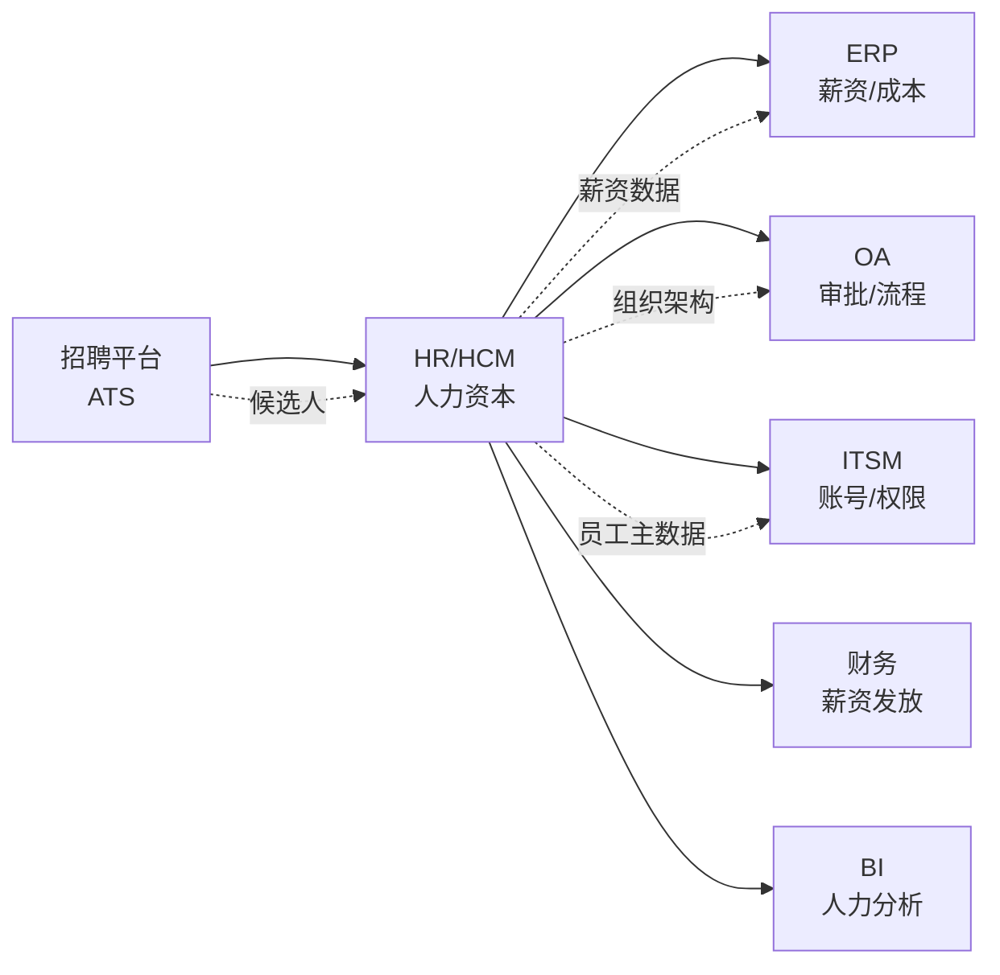
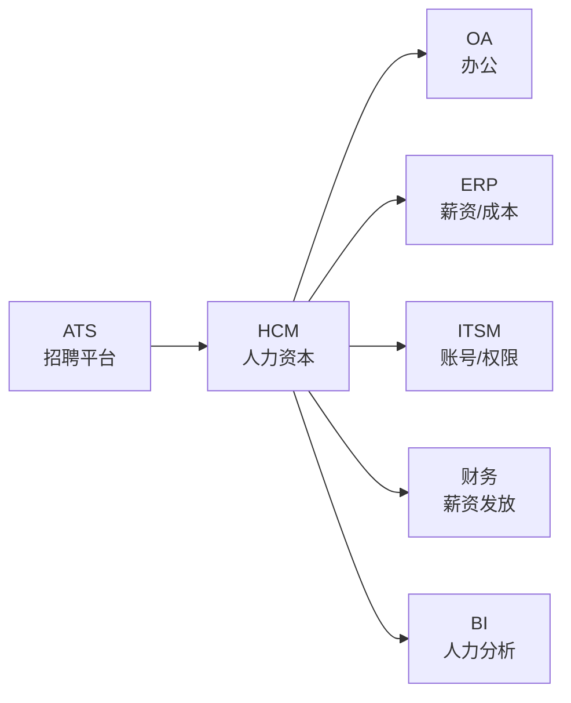

<!--
module:
  parent: application-systems
  slug: application-systems/05-operations/hr
  type: article
  category: 主模块子文章
  summary: HR / HCM（Human Capital Management 人力资本管理） 一句话定位：以员工全生命周期为主线的人力资本管理平台，覆盖组织/招聘/考勤/薪酬/绩效/培训等模块，是企业把人当成"资本"经营的核心系统。
  depth: ⭐⭐⭐⭐⭐
-->

# HR / HCM（Human Capital Management 人力资本管理）

> 一句话定位：以员工**全生命周期**为主线的人力资本管理平台，覆盖组织 → 招聘 → 入职 → 考勤 → 薪酬 → 绩效 → 培训 → 离职的全链路，是企业把人当成"资本"经营的核心系统。

## 📌 全景图

## 📖 定义

HR / HCM（Human Capital Management 人力资本管理）是以**员工全生命周期**为主线的人力资本管理平台，覆盖组织架构、招聘、入职、考勤、薪酬、绩效、培训、员工体验、离职管理等模块，是企业把人当成"资本"经营的核心系统。

**术语演进**：从 HR（Human Resources 人力资源）→ HRIS（HR Information System 人力资源信息系统）→ HRMS（HR Management System 人力资源管理系统）→ HCM（Human Capital Management 人力资本管理）。术语升级反映认知升级：从"把人当成本"到"把人当资本"。

**权威定义参考**：
- **Gartner**：HCM 是"以战略目标为导向，通过招聘、绩效、薪酬、培训等模块系统化提升员工能力与敬业度的人力资本管理套件"
- **SHRM（Society for Human Resource Management 战略人力资源管理协会）**：HCM 强调"员工体验（EX）+ 数据驱动（People Analytics）+ 战略协同（Strategic Workforce Planning）"

**历史演进**：
- **1970s**：薪资计算系统（Payroll），单机版，处理薪资发放
- **1980s**：HRIS 数据库化，加入员工档案与组织架构
- **1990s**：HRMS 模块化（薪资/考勤/招聘/培训各模块独立）
- **2000s**：ERP 内嵌 HR（SAP HR/Oracle HR），与 ERP 财务/成本深度耦合
- **2010s**：SaaS HCM 兴起（Workday/SuccessFactors），云原生 + 移动端 + 员工体验优先
- **2020s**：People Analytics + AI（人才盘点、智能招聘、员工流失预测）；员工体验平台化（EX）

**与各系统的边界**：
- **vs ERP**：现代 ERP 内含 HR 子模块（SAP HR），但专业 HCM 在体验/敏捷/全球合规上远超 ERP 内嵌模块；中型以上企业常单独部署 HCM
- **vs OA**：OA 管"全员流程"（含部分 HR 流程），HCM 管"人力专属流程"（招聘/绩效/薪酬）；HCM 与 OA 通过 SSO + 单点登录集成
- **vs 招聘平台（ATS）**：ATS 管"候选人漏斗"（投递 → 面试 → Offer），HCM 管"员工全生命周期"；Offer 接受后候选人主数据转入 HCM
- **vs 财务系统**：HCM 计算薪资总额 → 推送财务总账（应付职工薪酬科目）；HCM 不管账务核算，财务不管人事流程
- **vs ITSM**：HCM 是员工主数据源头，ITSM 用员工数据开通账号/权限；员工离职时 HCM → ITSM 自动关停账号

**HCM 不擅长**：财务账务（财务系统）、车间执行（MES）、客户运营（CRM）、资产维护（EAM）、办公审批（OA）。

**在企业 IT 架构中的位置**：HCM 是企业"员工主数据中枢"，与 ERP（薪资成本对接）、OA（审批流集成）、ITSM（账号权限开通）、招聘平台（候选人漏斗）、财务（薪资入账）、BI（人力分析）双向同步。Gartner 将 HCM 与 ERP/CRM/SCM 并列为"业务核心系统"，强调其"数据中枢 + 流程中枢"双重身份。员工主数据（员工号/组织/职位/汇报关系）是仅次于客户/物料的第三大主数据。

**典型数据量级**：成熟 HCM 系统的数据量通常在 **100GB-10TB** 区间（量级参考，取决于员工规模与历史积累）。员工主数据、历史薪资、绩效记录、培训记录是主要占用项；活跃用户从百人到上万人（典型中小企业 100-500，大型集团 5000-50000）。年度员工记录量在百万级，跨国集团多语言多币种数据量翻倍。

## 🔧 核心能力

- **组织架构管理（Organization Management）**：法人/部门/岗位/职位/汇报关系的层级结构
- **人事管理（Personnel Administration）**：员工档案、合同、调动、离职全生命周期
- **招聘管理（Talent Acquisition / ATS）**：职位发布、简历筛选、面试评估、Offer 管理
- **考勤与排班（Time & Attendance）**：打卡、请假、加班、调休、班次规则
- **薪酬管理（Payroll / Compensation）**：薪资计算、社保公积金、个税申报、薪资条
- **绩效管理（Performance Management）**：KPI/OKR 设定、评估流程、360° 评估、绩效结果
- **培训管理（Learning Management）**：课程库、培训计划、在线学习、培训记录
- **员工体验（Employee Experience / EX）**：自助门户、移动端、员工关怀、调查问卷
- **人才管理（Talent Management）**：人才盘点、继任计划、关键人才管理
- **People Analytics**：人力数据可视化、流失预测、HR 仪表盘
- **全球合规（Global Compliance）**：多国劳动法、税务、数据隐私（GDPR/个保法）

**「组织 → 员工 → 薪酬 → 绩效」四大基石**：HCM 最核心的四大基石，所有模块都建立在此之上：

**1. 组织架构（Organization）**：
- **法人架构**：母公司/子公司/分公司/代表处的法人主体
- **部门架构**：事业部/部门/小组的层级树
- **岗位（Position）**：组织中"岗位"的位置，绑定职责、职级、汇报关系
- **职位（Job）**：岗位的"工作内容定义"，跨组织可复用
- **汇报关系（Reporting Line）**：实线/虚线/矩阵汇报，决定审批/绩效/薪酬归属
- **变更管理**：组织调整（合并/拆分/重组）走 ECN 流程（Engineer Change Note 类比 PLM），全员通报

**2. 人事管理（Personnel）**：
- **员工档案**：基本信息（姓名/身份证/工号/银行卡）、教育/工作经历、家庭信息、紧急联系人
- **合同管理**：劳动合同/竞业协议/保密协议的全生命周期（起草 → 签订 → 续签 → 终止）
- **入职（Onboarding）**：入职清单（设备申领/账号开通/培训安排）+ 入职引导（Buddy 制度）
- **调动（Transfer）**：部门/职位/工作地的变更，关联薪资/社保/权限调整
- **离职（Offboarding）**：离职申请 → 工作交接 → 资产归还 → 社保转移 → 薪资结算 → 账号关停

**3. 薪酬管理（Payroll）**：
- **薪资结构**：基本工资/岗位工资/绩效工资/津贴补贴/五险一金/个税/实发
- **薪资计算**：月度/季度/年度薪资计算规则（加班费/请假扣款/奖金/股权）
- **社保公积金**：按当地法规计算五险一金（养老/医疗/失业/工伤/生育 + 公积金）
- **个税申报**：累计预扣预缴（国内税法）/年度汇算（个税 APP）/专项附加扣除
- **薪资条**：电子薪资条（PDF/邮件/移动端推送），合规留痕
- **薪资成本**：薪资总额分摊到成本中心/项目/部门，作为 ERP 成本核算输入

**4. 绩效管理（Performance）**：
- **目标设定（KPI/OKR）**：公司目标 → 部门目标 → 个人目标层层拆解
- **过程辅导（Coaching）**：季度中期 review + 月度 1:1
- **绩效评估（Appraisal）**：自评 → 上级评 → 跨级评 → HR 校准 → 结果反馈
- **结果应用**：绩效结果关联晋升、调薪、奖金、培训、淘汰
- **360° 评估**：上级/平级/下级/客户多维评价（管理岗必备）

**按 HCM 成熟度分级的功能深度**（行业参考框架）：
- **L1 基础**：人事档案 + 考勤 + 薪资（解决 50% 人事问题）
- **L2 标准**：招聘 + 绩效 + 培训（解决 70% 人才管理问题）
- **L3 高级**：人才盘点 + 继任计划 + People Analytics（解决 85% 战略人力问题）
- **L4 卓越**：全球合规 + 多语言多币种 + 跨国派遣（解决 95% 跨国人力问题）
- **L5 智能化**：AI 招聘筛选 + 流失预测 + 智能排班（前沿探索）

**「员工体验（EX）」的现代升级**：员工体验（Employee Experience）已成为 HCM 选型的核心指标，与客户体验（CX）同等重要：
- **统一门户（Single Portal）**：员工一个入口办所有事（请假/查薪资/看绩效/提流程/查福利）
- **移动端（Mobile-First）**：请假/打卡/审批/查薪资/报销全部移动化，员工 70% 操作在手机上完成
- **即时反馈（Continuous Feedback）**：绩效反馈从年度变为月度/季度，反馈方式从会议变为 IM 工具
- **个性化推荐（Personalization）**：基于岗位/职级/兴趣推荐培训课程、福利项目、内部岗位
- **HR 聊天机器人（HR Chatbot）**：AI 客服回答"我的年假还剩几天"等高频问题，80% 工单自动解决

**People Analytics 的「从描述到预测」演进**：人力数据分析正从"事后统计"走向"事前预测"：
- **L1 描述（Descriptive）**：现有员工多少人、流失率多少、平均司龄多长（传统报表）
- **L2 诊断（Diagnostic）**：为什么流失率高？哪个部门流失率最高？流失员工有什么特征？（多维分析）
- **L3 预测（Predictive）**：预测下季度流失率、识别高流失风险员工（机器学习）
- **L4 处方（Prescriptive）**：给流失风险员工推荐干预措施（加薪/调岗/培训/晋升）

按企业关注度排序，HCM 最常被列为「核心采购理由」的前 5 项是：薪资合规、组织架构清晰、移动端体验、与 ERP/OA 集成、People Analytics。

## 📊 关键模块详解

### 组织架构管理（OM Organization Management）

组织架构是 HCM 的"骨架"，所有人事/薪酬/审批都基于组织：
- **法人层级**：集团公司 → 子公司 → 分公司的法人主体树
- **行政层级**：集团总部 → 事业部 → 部门 → 小组的行政管理树
- **汇报关系**：实线（业务）/虚线（职能）/矩阵（项目）的多维汇报
- **职位矩阵**：岗位 × 职级 × 序列（管理/技术/职能/销售）的二维矩阵
- **组织变更 ECN**：组织合并/拆分/重组走变更流程，全员通报
- **国际化**：跨国集团的多法人多组织多币种架构（关键能力）
- **核心难点**：组织架构变更频繁（每月调整），变更留痕与历史追溯是核心能力

### 人事管理（PA Personnel Administration）

员工档案是 HCM 的"血液"：
- **员工主数据**：工号/姓名/身份证/护照/银行卡（薪资发放关键）
- **合同管理**：劳动合同类型（无固定期/固定期/以完成一定工作任务为期限）、合同期限、试用期
- **入职清单**：入职前 7 天完成设备申领/账号开通/培训安排/工位准备
- **离职清单**：离职前 30 天启动交接清单（工作交接/资产归还/社保转移）
- **黑名单管理**：离职员工记录，特别是不合规离职（违反竞业/侵占资产）
- **合规要求**：员工档案保存至离职后 2 年（劳动合同法），跨境数据传输需合规

### 招聘管理（TA Talent Acquisition）

招聘是"人才入口"，决定组织能力上限：
- **职位发布（Job Posting）**：内/外部渠道发布职位（官网/招聘平台/社交）
- **简历收集（Resume Parsing）**：多渠道简历聚合（智联/前程无忧/LinkedIn/猎聘/脉脉）
- **简历筛选（Resume Screening）**：关键词匹配 + AI 筛选（视频面试分析）+ HR 初筛
- **面试评估（Interview）**：多轮面试（HR 面/技术面/leader 面/HRBP 面）+ 评估表
- **背景调查（Background Check）**：学历/工作经历/犯罪记录/竞业核查
- **Offer 管理**：薪资方案沟通、Offer Letter 审批、签约、入职日期
- **ATS 协作**：HR/用人经理/面试官在 ATS 上协作（评价/审批/进度）
- **招聘漏斗**：投递 → 简历筛选 → 面试 → Offer → 入职的转化率分析
- **雇主品牌（Employer Branding）**：招聘官网/微信公众号/视频号/小红书的内容运营
- **AI 招聘**：简历自动筛选（NLP 匹配）/ 视频面试分析（微表情/情绪识别）/ 智能问答

### 考勤与排班（T&A Time & Attendance）

考勤是"劳动时间记录"，直接关联薪资计算：
- **打卡方式**：指纹/人脸/工卡/GPS 定位/钉钉企微打卡
- **请假管理**：年假/事假/病假/婚假/产假/陪产假/哺乳假/丧假
- **加班管理**：加班申请 → 审批 → 调休/加班费结算
- **出差管理**：出差申请 → 报销 → 调休/出差补贴
- **排班规则**：倒班/轮班/弹性工时/远程办公/混合办公
- **劳动法合规**：每月加班上限 36 小时（劳动法规定），超时预警
- **特殊行业**：制造业倒班（早/中/晚三班）、零售业排班（高峰/低谷）、呼叫中心弹性排班

### 薪酬管理（Payroll）

薪酬是 HCM 最复杂、最合规敏感的模块：
- **薪资结构**：基本工资 + 岗位工资 + 绩效工资 + 津贴补贴 + 股权激励
- **薪资计算**：固定项（基本/岗位）+ 浮动项（绩效/加班/奖金）- 扣款项（五险一金/个税）
- **社保公积金**：按当地法规缴纳（养老 8%/医疗 2%/失业 0.5%/公积金 5-12%）
- **个税申报**：累计预扣预缴（5000 元起征 + 专项附加扣除）+ 年度汇算清缴
- **薪资条**：电子薪资条（合规留痕 2 年以上），支持加密/水印/邮件推送
- **薪资成本分摊**：按部门/项目/成本中心分摊，传入 ERP 成本核算
- **跨境薪资**：多币种（实时汇率折算）+ 多税制（中国个税/美国 W-2/英国 PAYE）
- **薪资合规**：劳动法/个税法/社保法/公积金管理条例；违规处罚可至千万级

### 绩效管理（PM Performance Management）

绩效是"人才评估与激励"的核心：
- **目标管理（MBO/KPI/OKR）**：目标设定 → 过程跟踪 → 评估 → 结果应用
- **评估方式**：自评 + 上级评 + 同事评 + 下属评 + 客户评（360°）
- **评估周期**：年度 + 半年度 + 季度 + 月度（不同公司不同节奏）
- **绩效结果**：A/B/C/D 等级分布强制（避免"老好人文化"，如 10/20/40/20/10）
- **结果应用**：晋升 + 调薪 + 奖金 + 培训 + 淘汰（PIP Performance Improvement Plan）
- **绩效改进（PIP）**：低绩效员工进入 PIP（90 天改进期），未达标则解聘
- **绩效面谈**：评估结果必须 1:1 沟通，避免"冷数据"伤害员工
- **争议处理**：员工对绩效结果有异议，可申诉到 HR 复核

### 培训管理（LM Learning Management）

培训是"人才发展"的引擎：
- **课程库**：内部课程（讲师/PPT/视频）+ 外部课程（购买版权/平台合作）
- **培训方式**：线下培训 + 在线学习（LMS Learning Management System）+ 直播 + 混合式
- **培训计划**：新员工入职培训 + 岗位培训 + 领导力培训 + 专业技能培训
- **学分管理**：员工完成课程获得学分，年度学分要求与晋升挂钩
- **培训记录**：员工培训档案（合规要求：特殊岗位需定期复训，如安全员/电工作业证）
- **培训效果评估**：柯氏四级评估（反应/学习/行为/结果），但 80% 公司只做第一级
- **移动学习**：员工在移动端完成课程（地铁/通勤时间），碎片化学习

### 人才管理（TM Talent Management）

人才管理是"战略人力"的核心：
- **人才盘点（Talent Review）**：每年 1-2 次全员人才盘点（九宫格：能力 × 潜力）
- **继任计划（Succession Planning）**：关键岗位（VP/总监级）必须有 2-3 个继任候选人
- **关键人才管理（Key Talent）**：高潜人才（Top 10%）专项培养（轮岗/外派/MBA/导师制）
- **IDP（Individual Development Plan）**：高潜员工的个人发展计划（18-24 个月）
- **人才梯队**：高层 → 中层 → 基层的梯队建设（管培生/储备干部计划）

### People Analytics

人力数据分析是"战略决策"的支撑：
- **基础报表**：员工数/流失率/平均司龄/年龄分布/学历分布/部门分布
- **诊断分析**：流失率高的部门/岗位/年龄段/司龄段（多维钻取）
- **预测模型**：基于历史数据预测下季度流失率（机器学习）
- **HR 仪表盘**：CEO 视角的"人力资本仪表盘"（员工数/成本/产能/流失率）
- **数据来源**：HCM（人事/薪资/绩效）+ OA（审批）+ ERP（成本）+ BI（可视化）

## 🏆 选型决策

### 自研 vs 商用

| 维度 | 自研 HCM | 商用 HCM |
|------|---------|---------|
| 适用规模 | 大型集团（万人以上）有定制需求 | 中小企业（百-千人），快速上线 |
| 优势 | 100% 定制化、数据自主可控 | 行业最佳实践沉淀、合规保障、迭代快 |
| 劣势 | 投入大（千万级以上）、周期长（2-3 年）、合规风险 | 定制受限（5-15%）、长期成本高（SaaS 订阅） |
| 典型代表 | 阿里/字节/华为/腾讯自研 | Workday / SuccessFactors / 薪人薪事 / 北森 |
| 决策阈值 | 万人员工 + 特殊合规 + 长期投入 → 自研；否则 → 商用 | - |

### 主流厂商对比

| 厂商 | 定位 | 优势 | 劣势 | 适用规模 |
|------|------|------|------|---------|
| **Workday** | 全球 SaaS HCM 标杆 | 移动优先、用户体验、People Analytics 强、全球合规 | 贵（人均 200-400 美元/年）、中国本地化弱 | 跨国集团/大型企业 |
| **SAP SuccessFactors** | SAP 生态 HCM | 与 ERP S/4HANA 深度集成、跨国合规、行业方案成熟 | UI 偏传统、实施贵、迭代慢 | 大型集团/SAP 客户 |
| **Oracle HCM Cloud** | Oracle 生态 HCM | 与 Oracle ERP Cloud 集成、全球合规、绩效/招聘强 | 实施贵、生态弱于 Salesforce | 大型集团/Oracle 客户 |
| **薪人薪事** | 国内 SaaS HCM 头部 | 性价比高、移动端好、本土化合规、考勤模块强 | 国际化弱、复杂业务（B2B 大客户）成熟度有差距 | 国内中小型企业 |
| **北森** | 国内 SaaS HCM 头部 | 一体化云端、人才管理（人才盘点/继任）行业领先 | 国际化弱、规模略小 | 国内中型企业 |
| **用友 / 金蝶** | 国内传统 ERP+HCM | 与 ERP 财务/成本深度集成、本土化强、性价比高 | UI 偏传统、SaaS 化进度慢 | 国内中大型集团 |
| **Moka** | 招聘 + 员工体验 | 招聘 ATS 体验行业领先、UI 现代、面试官体验好 | 人才管理模块深度不足 | 互联网/科技公司 |
| **钉钉智能人事 / 企微** | 协同办公 + HCM 轻模块 | 集成钉钉/企微生态、移动端原生 | 深度 HR 模块弱、需配合专业 HCM | 小型企业/钉钉企微深度用户 |

### 选型决策树（5 层）

1. **先看规模**：员工 < 500 → 国内 SaaS（薪人薪事/北森/Moka）；500-5000 → 国内头部 SaaS 或 ERP 内嵌；> 5000 → 国际 HCM 或自研
2. **再看合规需求**：跨国集团 → Workday/SuccessFactors（多语言多币种）；纯国内 → 国内 SaaS（合规/税务/社保本地化）
3. **再看 ERP 生态**：SAP 客户 → SuccessFactors；Oracle 客户 → Oracle HCM Cloud；用友/金蝶客户 → 用友/金蝶 HCM；非 ERP 生态 → Workday/独立 HCM
4. **再看预算与 TCO**：5 年 TCO 是否在 ROI 测算范围内？国际 vs 国内差距通常 3-5 倍
5. **最后看实施能力**：是否有 SAP/Oracle 实施经验？是否有 Workday 认证顾问？行业案例 ≥ 5 个？

## 🚨 实施陷阱 / 反模式

### 1. 员工数据迁移陷阱

**现象**：HR 项目数据迁移"差不多就行"，结果上线后员工档案缺失/合同记录丢失/薪资余额对不上。
**根因**：员工档案涉及劳动法合规（保存 2 年），数据质量要求远高于 CRM/ERP；历史数据清洗是"脏活累活"，实施商通常不愿做。
**规避**：数据迁移占实施总成本 **25-35%** 是合理的；上线前必须有"员工档案完整度报告"（员工号/身份证/银行卡/合同齐全率）；迁移必须"零容忍"。

### 2. 多组织架构陷阱

**现象**：跨国集团 HCM 上线后，发现组织架构变更频繁（每月调整），系统响应慢；历史组织变更追溯困难（3 年前的组织架构什么样？）。
**根因**：组织架构是 HCM 的"骨架"，所有人事/薪资/审批都基于组织；组织变更频繁时，传统 HCM 性能与变更追溯能力不足。
**规避**：选型时重点评估"组织架构变更 ECN 流程"+"历史组织快照"+"多维度组织视图"（法人/行政/汇报/项目）；预留组织架构治理项目预算（占实施总投入 15-20%）。

### 3. 跨国薪酬合规陷阱

**现象**：跨国集团 HCM 上线后，某个国家子公司薪资计算错误（个税/社保汇率折算），触发当地劳动法纠纷；或数据跨境传输违反 GDPR/个保法。
**根因**：跨国薪酬涉及多国劳动法/税务/汇率，数据跨境传输涉及 GDPR/中国个保法/各国数据本地化法规；单一 HCM 厂商难以覆盖 30+ 国家合规。
**规避**：选型时重点评估"覆盖国家数"+"多币种薪资计算"+"个税申报接口"+"数据本地化部署能力"；优先选择有"全球合规白皮书"的厂商（Workday/SuccessFactors）；当地合规咨询必须由当地律师参与。

### 4. 与钉钉/企微集成陷阱

**现象**：HCM 与钉钉/企微集成后，组织架构同步延迟（30 分钟-1 小时）；员工离职后钉钉/企微账号未及时关停；考勤打卡数据不同步。
**根因**：HCM 是员工主数据源头，钉钉/企微是协同工具；集成方向（单向/双向）、同步频率（实时/分钟级/小时级）、字段映射（组织/岗位/员工）需要明确设计。
**规避**：与钉钉/企微集成采用"事件驱动"架构（组织变更通过 Kafka 实时推送）；明确集成责任边界（HCM 管主数据，钉钉/企微管协同）；离职流程必须联动关停账号（24 小时内）。

### 5. 报表过度定制陷阱

**现象**：HCM 上线后，每个业务部门提 100 个报表需求（人力成本/流失率/培训覆盖），IT 加班加点 1 年都在写报表；报表维护成本是 HCM License 的 2 倍。
**根因**：HCM 的强项是"人事交易型报表"（员工档案/薪资条/考勤表），不是"分析型报表"；让 HCM 承担 BI 角色是错位。
**规避**：80% 业务用"标准报表"（HCM 自带）+ 20% 分析型报表用"BI 平台"（Tableau/Power BI/帆软）；People Analytics 通过数据集市从 HCM 抽取数据做分析。

### 6. 绩效文化缺失陷阱

**现象**：HCM 上线绩效模块后，业务部门不愿用（"我们都是兄弟，不搞排名"），绩效流于形式；3 个月后 HR 把绩效模块废弃。
**根因**：绩效管理是"文化工程"而非"系统项目"——没有强制分布（10/20/40/20/10）、没有绩效改进（PIP）、没有结果挂钩（晋升/调薪），系统只是"电子表单"。
**规避**：上线绩效模块前必须明确"绩效文化"——强制分布规则、PIP 流程、结果挂钩机制；CEO/CPO 亲自推动绩效文化；绩效结果必须 100% 应用到晋升/调薪/淘汰。

### 7. 自研 HCM 烂尾陷阱

**现象**：某大型集团投入 8000 万自研 HCM，3 年后只完成人事/薪资/考勤，招聘/绩效/培训全部"烂尾"；被迫转向 Workday/SuccessFactors。
**根因**：HCM 是"行业知识沉淀 + 长期迭代"的产物——Workday/SuccessFactors 沉淀了 20 年行业经验；自研 HCM 在"合规保障/全球部署/人才管理深度"上难以匹敌。
**规避**：除非企业有"特殊合规需求"（如军工/金融）且有"自研长期投入"承诺（10 年 + 5 亿+），否则不建议自研 HCM；自研 HCM 的真实成本是商用 HCM 的 5-10 倍。

### 8. 员工抵触"数字监工"陷阱

**现象**：HCM 上线考勤/绩效模块后，员工认为"被监控"，抵触情绪强；打卡/加班申请数据失真；3 个月后使用率 50%。
**根因**：HCM 是"全员系统"，员工抵触会直接导致数据失真；特别是考勤/绩效涉及员工利益（薪资/晋升）。
**规避**：HCM 上线前做"员工沟通 workshop"——明确"不是监工是赋能"；管理层以身作则（领导也打卡/也接受评估）；分阶段上线（先人事/薪资，再考勤，最后绩效）。

### 陷阱共性规律

行业研究统计 HCM 项目失败率约 **30-50%**，失败原因中：
- 约 **25%** 源自「数据迁移 + 历史档案清洗」（数据陷阱）
- 约 **20%** 源自「组织架构治理不力」（架构陷阱）
- 约 **20%** 源自「合规风险 + 跨国部署」（合规陷阱）
- 约 **15%** 源自「绩效文化缺失」（文化陷阱）
- 约 **10%** 源自「员工抵触」（推广陷阱）
- 约 **10%** 源自「自研烂尾」（决策陷阱）

规避核心：「数据迁移零容忍 + 组织架构治理 + 合规优先 + 绩效文化先行 + 员工沟通」是 HCM 成功的 5 大前置条件。

## 🛤️ 学习路线

### 入门（0-3 个月，建立基础认知）

1. **第 1 周**：阅读 Gartner HCM 魔力象限报告（2024-2025），了解 Workday/SuccessFactors/Oracle/SAP 在 HCM 领域的市场地位
2. **第 2-3 周**：阅读《HR 从人力资本到员工体验》/《People Analytics》入门书，建立 HCM 全局认知
3. **第 4-6 周**：试用一款国内 SaaS HCM（薪人薪事/北森免费版），亲自体验核心模块（请假/打卡/查薪资）
4. **第 7-10 周**：研究 1-2 家头部企业案例（如华为 HCM、字节跳动 People 系统、阿里 HR 体系）
5. **第 11-12 周**：参加 1 次行业会议（如 SHRM 年会/中国 HR 科技大会），了解最新趋势

### 进阶（3-12 个月，深度技能）

1. **3-6 个月**：选择一个细分模块（薪酬/绩效/招聘）做深度研究——法律法规 + 行业最佳实践 + 厂商方案对比
2. **6-9 个月**：参与 1 个 HCM 选型项目，从 RFP 撰写到 POC 验证到商务谈判全流程
3. **9-12 个月**：学习 People Analytics 基础（SQL + 数据可视化 + 基础统计），能产出 1-2 个人力分析报告（流失率分析/人效分析）

### 精通（12 个月以上，专家级）

1. **12-24 个月**：主导 1 个完整 HCM 实施项目（≥ 1000 人规模），覆盖数据迁移/组织架构/合规/集成
2. **24-36 个月**：建立 HCM 选型方法论（决策树/RFP 模板/POC 脚本），成为公司 HCM 选型的"内部顾问"
3. **36 个月+**：横向扩展到"数字化人力转型"（HRSSC/HRSBP/COE 三支柱模型）、员工体验（EX）设计、组织发展（OD）

### 学习资源

- **书籍**：《HR 转型》《Workday 实战》《People Analytics》《人力资源管理》（加里·德斯勒）
- **报告**：Gartner HCM 魔力象限 / Forrester HCM Wave / IDC 中国 HCM 市场报告
- **会议**：SHRM 年会 / 中国 HR 科技大会 / HR SaaS 峰会
- **社区**：三茅人力资源网 / HR 沙龙 / LinkedIn HR 话题
- **认证**：SHRM-CP/SCP / PHR/SPHR（HR 专业人士认证）

## 🔗 上下游关系

- **上游**：招聘平台（候选人漏斗 → 员工入职）
- **下游**：ERP（薪资成本/工时数据）、OA（组织架构/审批流）、ITSM（员工主数据 → 账号权限开通/关停）、财务（薪资发放）
- **横向**：BI（People Analytics）、绩效（OKR/KPI 工具）、培训（LMS 学习平台）

**集成要点**：
- **HCM ↔ ATS**：ATS 的 Offer 接受后，员工主数据自动转入 HCM
- **HCM ↔ ERP**：HCM 把薪资总额/工时数据推送给 ERP 做成本核算；ERP 把组织架构/部门主数据同步给 HCM
- **HCM ↔ OA**：HCM 是组织架构/汇报关系的"单一真相源"，OA 实时拉取组织架构做审批路由
- **HCM ↔ ITSM**：员工入职 → HCM 推送主数据 → ITSM 自动开账号；员工离职 → HCM 推送离职事件 → ITSM 自动关停账号
- **HCM ↔ 财务**：HCM 计算薪资 → 推送薪资明细给财务总账（应付职工薪酬科目）→ 财务发起银行代发
- **HCM ↔ BI**：HCM 通过数据仓库抽取人力数据，BI 做 People Analytics（流失率/人均产能/培训覆盖）

**集成模式选择**：
- **紧耦合（实时双向）**：HCM 与 ERP/OA 的组织架构实时双向同步（中间表/REST API）— 适合组织变更频繁
- **松耦合（定时批处理）**：HCM 每日定时推送薪资数据给财务总账 — 适合月结场景
- **事件驱动**：HCM 通过 Kafka/RabbitMQ 异步推送员工变更事件 — 适合云原生 HCM 架构
- **iPaaS 集成平台**：HCM/ATS/ERP/ITSM 异构系统通过 iPaaS 连接 — 适合多系统集成场景

## ⚖️ 关键考量

- **合规优先于功能**：HCM 涉及劳动法/个税法/社保法/数据隐私法，合规是"一票否决项"
- **组织架构治理先行**：组织架构是 HCM 骨架，组织不清晰就上 HCM = 混乱固化到系统
- **跨国部署慎之又慎**：跨国 HCM 涉及多国合规/多语言/多币种/数据本地化，预算与周期翻倍
- **员工体验决定使用率**：HCM 是全员系统，移动端/自助门户体验差 = 使用率低 = 数据失真
- **绩效是文化工程**：绩效模块不是"系统项目"，是"一把手工程"，CEO 不推动 = 形式主义
- **数据迁移占成本 25-35%**：员工档案/历史薪资/历史绩效的数据清洗是"脏活累活"，预算不能省
- **自研 HCM 慎之又慎**：除非万人 + 特殊合规 + 长期投入，否则不推荐自研

## 🎯 选型指南

| 企业类型 | 推荐 | 理由 |
|---------|------|------|
| 跨国集团（万人+） | Workday / SAP SuccessFactors | 全球合规、移动优先、People Analytics 强 |
| 大型集团（5000+） | SAP SuccessFactors / Oracle HCM Cloud | 与 ERP 深度集成、跨国合规、行业方案成熟 |
| 中型企业（500-5000） | 北森 / 薪人薪事 / 用友 / 金蝶 | 性价比、本土化、移动端 |
| 小型企业（< 500） | 薪人薪事 / Moka / 钉钉智能人事 | 快速上线、成本低、移动端 |
| 互联网/科技公司 | Moka（招聘）+ 北森（人力） | 体验优先、招聘 ATS 强 |
| 制造业（大型） | 用友 / 金蝶 HCM | 与 ERP 财务/成本深度集成 |
| 国企/金融 | 用友 / 金蝶 / 私有化部署 | 部署可控、合规留痕 |

**自检维度**：
1. 是否覆盖所在国家/行业合规要求？
2. 移动端体验（员工 70% 操作在手机上）？
3. 与 ERP/OA/ITSM/ATS 的集成能力？
4. People Analytics 能力（描述 → 诊断 → 预测 → 处方）？
5. 行业案例与实施商能力？

**红线**：
- 无目标国家合规经验 = 慎选
- 无 People Analytics 能力 = 落后一代
- 移动端体验差（APP 评分 < 4.0）= 慎选
- 实施商无同行业案例 = 慎选

**RFP 模板要点**：建议 RFP 覆盖 **5 大类 30+ 评分项**：
- **功能类（30%）**：组织架构、人事、招聘、考勤、薪酬、绩效、培训、人才管理、员工体验
- **性能类（15%）**：并发用户数、移动端响应时间（< 2 秒）、薪资计算时间（< 30 分钟）、报表生成时间
- **集成类（25%）**：ERP/OA/ITSM/ATS/财务标准接口、REST API、消息队列、Webhook、iPaaS 集成平台
- **合规类（15%）**：GDPR / 个保法 / ISO 27001 / SOC 2 / 等保三级 / 当地劳动法合规、电子签名、审计日志
- **服务类（15%）**：行业最佳实践参考、客户案例、升级策略、SLA 承诺、实施伙伴能力

**TCO 估算要点**（1000 人企业 5 年 TCO）：
- **SaaS HCM（Workday/SuccessFactors）**：500-1500 万（License 60% + 实施 25% + 集成 10% + 运维 5%）
- **国内 SaaS（北森/薪人薪事）**：100-300 万
- **私有化（用友/金蝶）**：300-800 万一次性 + 50-100 万/年运维
- **自研**：5000 万-1 亿 + 1000 万/年级运维

## ⚠️ 常见陷阱

- **「HCM 只是个工资系统」**：HCM 不只是发工资，是人力资本经营系统。只用薪资模块 = 浪费 80% 价值
- **「组织架构是 HR 的事」**：组织架构涉及业务/财务/IT，必须业务一把手亲自定，组织不清就上 HCM = 混乱固化
- **「绩效是 HR 推的」**：绩效是 CEO 工程，HR 推不动，没有强制分布/结果挂钩/CEO 推动，绩效模块必败
- **「跨国 HCM 直接上 Workday」**：Workday 在中国本地化弱（社保/公积金/个税接口），直接上 = 实施周期翻倍
- **「HRSSC = 砍成本」**：HRSSC 不是"砍 HR 头"是"让 HR 转型"，没有 HRSSC + HRSBP + COE 三支柱 = 形式主义
- **「People Analytics 是个报表」**：People Analytics 是从描述到诊断到预测到处方的演进，做不到预测 = 不是真 People Analytics

## 📚 参考来源

- **Gartner HCM 魔力象限 2024**：Gartner, "Magic Quadrant for Cloud HCM Suites for 1,000+ Employee Enterprises", 2024。Workday/Oracle/SuccessFactors/UKG 四大领导者，市场格局权威参考（https://www.gartner.com）
- **SHRM 战略人力资源管理框架**：SHRM (Society for Human Resource Management), "SHRM Body of Competency & Knowledge"，全球 HR 领域权威能力框架（https://www.shrm.org）
- **Forrester Wave™ HCM 2024**：Forrester, "The Forrester Wave™ for Human Capital Management, Q4 2024"，从战略/当前产品、市场表现、客户服务等维度评估 HCM 厂商（https://www.forrester.com）
- **IDC 中国 HCM SaaS 市场报告 2024**：IDC, "中国 HCM SaaS 市场跟踪报告"，国内 HCM 市场格局（薪人薪事/北森/Moka/钉钉）权威数据
- **《HR 转型：从人力资本到员工体验》**：[美]乔西·伯恩斯丁 著，HR 转型经典著作，介绍 HRSSC/HRSBP/COE 三支柱模型
- **《Workday 实战》**：Workday 中国团队 编，Workday 在中国落地的最佳实践参考
- **《People Analytics》**：[美]托雷斯/科利尔 著，从描述到诊断到预测到处方的 People Analytics 进阶指南
- **加里·德斯勒《人力资源管理》**：HR 领域经典教材，全球 HR 从业者入门必读

---

← [返回: 业务应用系统](../../README.md)

## 📊 本节统计

- **核心能力**：11 大模块（组织架构 / 人事 / 招聘 / 考勤 / 薪酬 / 绩效 / 培训 / 员工体验 / 人才管理 / People Analytics / 全球合规）
- **四大基石**：组织架构 / 人事管理 / 薪酬管理 / 绩效管理
- **HCM 成熟度分级**：5 级（L1 基础 / L2 标准 / L3 高级 / L4 卓越 / L5 智能化）
- **员工体验升级**：统一门户 / 移动优先 / 即时反馈 / 个性化推荐 / HR 聊天机器人
- **People Analytics 演进**：4 级（描述 / 诊断 / 预测 / 处方）
- **典型场景**：7 类（跨国集团 / 大型集团 / 中型企业 / 小型企业 / 互联网科技 / 制造业 / 国企金融）
- **集成架构**：6 类（HCM-ATS / HCM-ERP / HCM-OA / HCM-ITSM / HCM-财务 / HCM-BI）
- **集成模式**：4 类（紧耦合 / 松耦合 / 事件驱动 / iPaaS）
- **关键考量**：7 维度（合规优先 / 组织治理 / 跨国部署 / 员工体验 / 绩效文化 / 数据迁移 / 自研慎选）
- **选型自检维度**：5 项（合规覆盖 / 移动端 / 集成生态 / People Analytics / 行业案例）
- **RFP 评分项**：5 大类 30+ 项（功能 30% / 性能 15% / 集成 25% / 合规 15% / 服务 15%）
- **TCO 估算**（1000 人）：SaaS 国际 500-1500 万 / 国内 SaaS 100-300 万 / 私有化 300-800 万 / 自研 5000 万-1 亿
- **常见陷阱**：6 类（HCM ≠ 工资 / 组织架构治理 / 绩效 CEO 工程 / 跨国本地化 / HRSSC 形式主义 / People Analytics 深度）
- **陷阱统计**：HCM 项目失败率 30-50%（25% 数据 / 20% 架构 / 20% 合规 / 15% 文化 / 10% 推广 / 10% 决策）
- **所属价值链**：05 运营管理
- 关联系统：ERP（[ERP 深读](../erp/README.md)）/ OA（[OA 深读](../oa/README.md)）/ ITSM（ITSM 章节）/ ATS（招聘平台）/ 财务（财务系统）/ BI（[BI 深读](../bi/README.md)）/ MES（[MES 深读](../../02-production/mes/README.md)）/ CRM（[CRM 深读](../../04-sales-service/crm/README.md)）