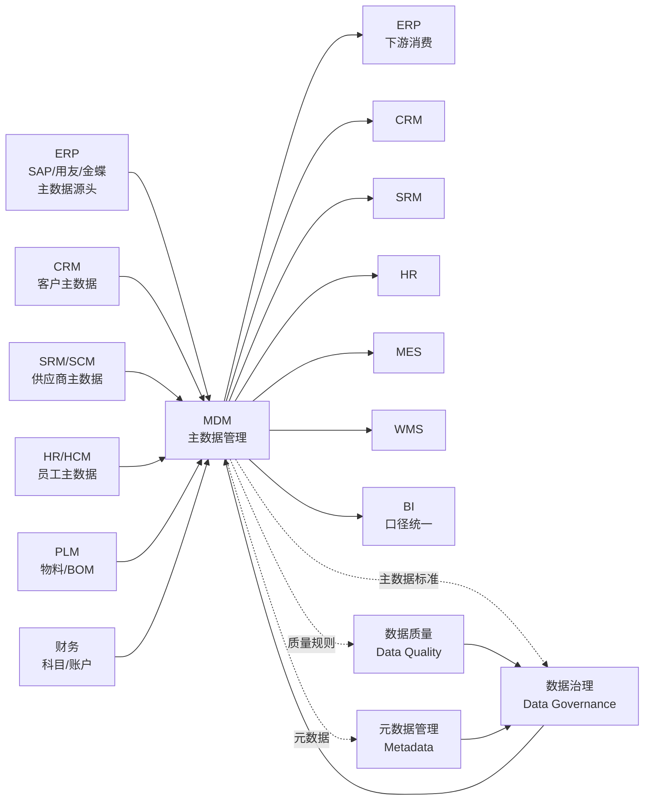
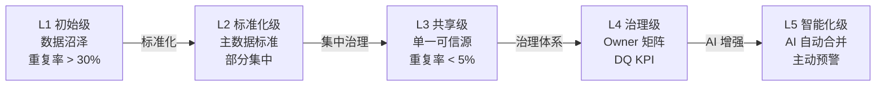
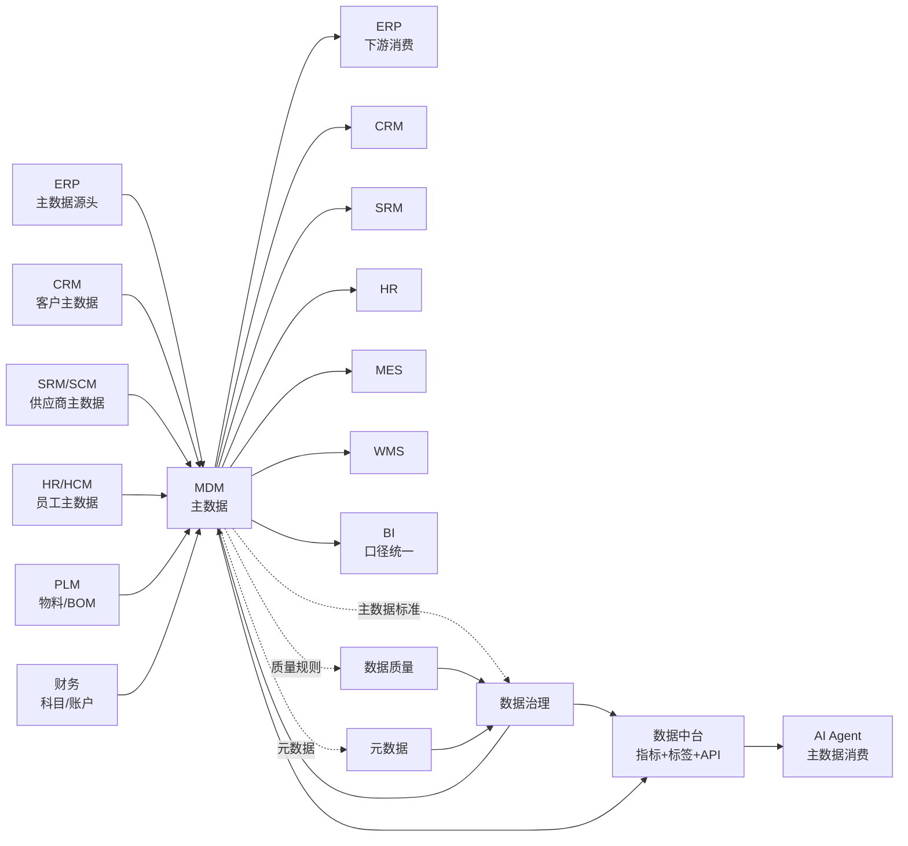

<!--
module:
  parent: application-systems
  slug: application-systems/05-operations/mdm
  type: article
  category: 主模块子文章
  summary: MDM（Master Data Management 主数据管理） 一句话定位：把企业"主数据"（客户/物料/供应商/组织/账户）统一管理 + 单一可信源治理的系统，是数据治理体系的核心抓手，也是 ERP/CRM/SRM/SCM/MES 等业务系统之间"数据口径统一"的唯一基础设施。
-->

# MDM（Master Data Management 主数据管理）

> 一句话定位：把企业**主数据**（客户 / 物料 / 供应商 / 组织 / 账户 / 员工 / 项目 等"核心业务实体"）从"散落在 ERP/CRM/SRM/SCM/MES 各业务系统"的状态，收敛到**统一建模 + 单一可信源（Single Source of Truth）+ 分发同步 + 治理闭环**的系统；是数据治理体系的核心抓手，也是 ERP / CRM / SRM / SCM / MES / HR / 财务 各业务系统之间"数据口径统一"的**唯一基础设施**——没有 MDM，"主数据冲突 / 一物多码 / 客户重复"会成为企业数字化转型的头号拦路虎。

## 📌 全景图

**MDM 在企业 IT 架构中的位置**：MDM 位于**业务系统之上、数据治理之下**的"中间枢纽"——向上承接数据治理体系（数据标准 / 元数据 / 数据质量 / 数据安全），向下为所有业务系统（ERP / CRM / SRM / SCM / MES / WMS / HR / 财务 / BI）提供"统一主数据服务"；同时**与数据中台、数据湖、数据仓库有明确边界**——MDM 管"主数据"，数据中台管"指标 + 标签 + API"，数据仓库管"历史交易数据"。

## 📖 定义

MDM（Master Data Management 主数据管理）是对企业**核心业务实体**（客户 / 物料 / 供应商 / 组织 / 账户 / 员工 / 项目 / 资产 / 地点 等）的**统一建模、数据标准、采集清洗、分发同步、治理闭环**的方法论与平台；目标是让"一份数据在企业所有系统中口径一致、版本统一、责任清晰"。

**为什么需要 MDM（企业普遍痛点）**：
- **客户主数据分散**：CRM 里的"华为"是销售眼中的"客户"，ERP 里的"华为"是财务眼中的"应收方"，SRM 里的"华为"是采购眼中的"供应商关联方"——3 个系统 3 套编码，财报合并时发现"同一个华为有 7 个客户编码、4 个供应商编码"
- **物料一物多码**：同一个 M8×20 内六螺丝，在研发部门叫"M8 螺钉 20mm"，在生产部门叫"GB/T 70.1 M8×20"，在仓储部门叫"内六角螺栓 8-20"，3 个部门 3 个编码，库存合并时发现"账面对不上"
- **组织架构失同步**：HR 调整了组织架构（销售一部并入销售二部），ERP / OA / CRM 30 天后才同步，期间审批流全部走错部门
- **供应商主数据"家家有"**：每个 SRM 用户都"建过一遍"——同一家物流公司在 SRM / 财务 / ERP / 招标系统 4 处注册，资质证书重复审核
- **数据治理"无抓手"**：企业建了"数据治理委员会"、发了"数据标准手册"，但**没有一个系统能强制落地**——业务系统还是各管各的，治理委员会沦为"开会机构"

**权威定义参考**：
- **Gartner（MDM 魔力象限 2024）**：MDM 是"对企业核心业务实体（客户 / 产品 / 供应商 / 资产 等）的**关键数据**进行**统一管理、共享、分析、分发**的解决方案，支持业务系统间的数据集成与一致性"
- **DAMA-DMBOK 2.0（数据管理知识体系）**：主数据是"在企业内**跨业务、跨系统、跨部门共享**的核心业务实体数据；MDM 是对其进行**全生命周期管理**的学科"
- **Informatica（全球 MDM 龙头）**：MDM 包含 4 大能力——**数据建模（Model）+ 数据质量（Quality）+ 数据集成（Integration）+ 数据治理（Governance）**，简称"MQIG"
- **ISO 8000（数据质量国际标准）**：主数据是"在企业多个系统间共享、保持**唯一识别 + 统一语义 + 稳定结构**的核心数据"

**历史演进**：
- **1990s 萌芽**：ERP 内嵌主数据管理（SAP ERP / Oracle EBS 自带客户 / 物料主数据），但**不跨系统共享**——每个 ERP 厂商有自己的主数据模型
- **2000s 起步**：CRM / SRM / BI 系统兴起，**多系统主数据冲突**问题首次暴露；2004 年 Gartner 首次发布"MDM 魔力象限"；Informatica / IBM / Oracle / SAP 纷纷推出 MDM 套件
- **2010s 行业 MDM 兴起**：行业垂直 MDM（金融 MDM / 电信 BSS 主数据 / 零售商品主数据）成熟；2015 年 Gartner 将"MDM 解决方案"列为"信息基础设施核心"
- **2018-2020 多域 MDM**：从"客户 MDM"扩展到"多域 MDM（Multi-Domain MDM）"——客户 + 物料 + 供应商 + 组织 + 账户 + 员工 同时治理；云 MDM 崛起（Informatica / Reltio / Tibco）
- **2021-2024 数据治理融合**：MDM 与"数据治理平台（Collibra / Alation / Atlan）"、"数据质量（Informatica DQ / Talend DQ）"、"数据目录（Data Catalog）"深度融合；**MDM 从"工具"升级为"治理体系"**
- **2025-2026+ AI + 主动治理**：AI Agent 介入 MDM（自动合并重复客户 / 自动建议主数据标准 / 自动校验数据质量）；MDM 从"事后治理"走向"**事前预防 + 实时治理**"；**MDM 与数据中台融合**——MDM 管"主数据"，数据中台管"标签 + 指标 + 服务化"

**与各系统的边界**（2025-2026 高频混淆点，重点厘清）：

- **vs ERP（企业资源计划）**：**ERP 是"业务系统 + 内置主数据"**——SAP ERP / 用友 / 金蝶 都有自己的客户 / 物料 / 供应商主数据；但 ERP 主数据**只在 ERP 内一致，跨系统不一致**（ERP 的"客户" vs CRM 的"客户" vs SRM 的"供应商"对不上）。**MDM 是"跨系统主数据中枢"**——把 ERP / CRM / SRM 的主数据集中治理、统一分发。**现代架构：MDM 做"主数据单一可信源"，ERP / CRM / SRM 做"业务交易"**——典型如 SAP MDG（Master Data Governance）从 ERP 独立出来做"MDM 套件"
- **vs 数据中台（Data Middle Platform）**：**MDM 管"主数据"（客户 / 物料 / 供应商 等核心实体）**；**数据中台管"指标 + 标签 + 服务化"**（如"VIP 客户标签"、"30 天复购率指标"、"客户 360 API"）。**MDM 是数据中台的"输入"**——数据中台消费 MDM 的主数据，再加工成指标 / 标签 / API。**简单记：MDM 管"实体"，数据中台管"实体加工后的产品"**
- **vs 数据治理（Data Governance）**：**数据治理是"管理体系"**（数据标准 / 政策 / 流程 / 组织 / 责任），是"治理框架"；**MDM 是"治理框架的核心抓手 / 工具"**——把"客户主数据标准"落到系统里强制执行。**关系：数据治理 = 政策，MDM = 政策落地的系统**——光有治理委员会没 MDM = 治理"无落地"
- **vs 数据质量（Data Quality / DQ）**：**数据质量是"数据准确性 + 完整性 + 一致性 + 时效性 + 唯一性的度量与提升"**——是 MDM 的核心能力之一（Informatica MQIG 模型中的 Q）；**MDM = 数据建模 + 数据质量 + 数据集成 + 数据治理**。**DQ 是 MDM 的子能力**，DQ 工具可独立采购（Informatica DQ / Talend DQ），也可作为 MDM 套件的一部分
- **vs 元数据管理（Metadata Management）**：**元数据是"描述数据的数据"**（如"客户编码"字段是 10 位字符、长度 10、类型 String、来源 ERP）；**MDM 是"管理核心业务实体的数据"**——主数据本身就是元数据的"对象"。**关系：元数据描述主数据，MDM 治理主数据**——元数据管理（如 Alation / Collibra / DataHub）与 MDM 是数据治理的"双轮"
- **vs 数据目录（Data Catalog）**：**数据目录是"企业数据资产的检索 + 血缘 + 分类"**（让业务人员找到"哪个字段在哪个表里"）；**MDM 是"治理核心业务实体的数据本身"**。**关系：数据目录管理"数据资产清单"，MDM 管理"核心实体的数据值"**
- **vs 主数据 vs 交易数据 vs 参考数据**：**主数据 = 跨业务长期相对稳定的"核心实体"**（客户、物料、供应商、组织、账户）；**交易数据 = 业务过程产生的数据**（订单、发票、库存流水）；**参考数据 = 业务引用的"标准值表"**（国家代码、行业代码、币种、计量单位）。**MDM 管主数据，参考数据管理（RDM）管参考数据，ODS/数据仓库管交易数据**

**MDM 不擅长**：业务交易处理（ERP）、客户体验（CRM）、车间执行（MES）、数据分析可视化（BI）、非结构化数据（文档/图片）、实时流式数据（Kafka）。

**在企业 IT 架构中的位置**：MDM 是企业**"主数据单一可信源（Golden Record）"的核心基础设施**——向上承接数据治理（标准 / 政策 / 流程），向下为 ERP / CRM / SRM / SCM / MES / WMS / HR / 财务 / BI 提供**统一主数据 API**；横向与数据质量、元数据、数据安全、数据中台、数据湖紧密协同。Gartner 2024 预测**到 2027 年 70% 的大型企业将部署企业级 MDM**（vs 2024 年 35%），主数据治理是数字化转型"必修课"。

**典型数据量级**：成熟 MDM 平台管理的**主数据条数**在**10 万 - 1000 万**级别（大型集团客户主数据 100 万 - 1000 万条、物料主数据 50 万 - 500 万条、供应商主数据 5 万 - 50 万条、组织主数据 1 万 - 10 万条）；**主数据容量**通常在 **50GB - 500GB**；活跃用户从数十人（数据治理团队 + 业务主数据 Owner）到数百人（业务部门主数据协作）；**单一主数据条目的治理全周期（创建 → 审核 → 生效 → 同步 → 归档）通常 3-10 个工作日**。

**为什么 2026 年 MDM 仍是数字化转型的"必修课"**（客户常问"AI 时代 MDM 是不是过时了"）：
1. **AI 模型的"数据底座"必须统一**：2025-2026 LLM / 多模态 AI 训练需要"统一口径的客户 / 物料主数据"——同一个"华为"在不同业务系统有 7 个编码，AI 训练数据就是"垃圾进垃圾出"
2. **监管合规越来越严**：中国《数据安全法》《个人信息保护法》、欧盟 GDPR、美国 CCPA 都要求"数据来源可追溯、口径可审计"——MDM 的"Golden Record + 数据血缘"是合规刚需
3. **企业并购整合刚需**：跨国并购后"两个 SAP 系统客户 / 物料合并"是 12 个月主数据治理项目——MDM 套件（SAP MDG / Informatica / Reltio）是唯一选择
4. **数字化转型"底座先行"**：客户 360 / 供应商 360 / 物料 360 是数字化转型的"三大底座"——而"360 视图"的**唯一基础设施就是 MDM**
5. **数据资产入表（中国 2024 新政）**：财政部 2024 年发布《企业数据资源相关会计处理暂行规定》，**数据资产可入资产负债表**——MDM 是"数据资产盘点"的核心工具

## 🔧 核心能力

- **主数据建模（Master Data Modeling）**：客户 / 物料 / 供应商 / 组织 / 账户 等核心实体的数据模型设计（实体 + 属性 + 关系 + 层级）
- **数据标准管理（Data Standards）**：编码规则、命名规范、字段定义、数据字典、主数据参考表（参考数据管理 RDM）
- **数据采集（Data Ingestion）**：从业务系统采集主数据（CSV / API / 数据库 CDC / Kafka 事件流）
- **数据清洗（Data Cleansing）**：去重（去重算法 / 合并规则 / 黄金记录生成）、标准化（大小写 / 缩写 / 格式）、补全（缺失值填充）
- **数据质量（Data Quality / DQ）**：6 维度评估（准确性 / 完整性 / 一致性 / 时效性 / 唯一性 / 有效性）+ 数据质量规则引擎 + 数据质量报告
- **主数据分发（Data Distribution）**：主数据变更后实时 / 定时同步到下游业务系统（ERP / CRM / SRM / MES / WMS / HR / BI）
- **数据治理（Data Governance）**：数据 Owner / 数据 Steward 责任体系、数据标准审批流程、数据变更留痕、数据血缘追踪
- **元数据管理（Metadata Management）**：主数据的元数据（字段定义 / 来源系统 / 责任人 / 变更历史 / 数据血缘）
- **数据安全（Data Security）**：主数据的访问权限控制（按角色 / 部门 / 业务场景）、数据脱敏、审计日志
- **数据生命周期（Data Lifecycle）**：主数据的创建 → 审核 → 生效 → 同步 → 冻结 → 归档全生命周期管理
- **黄金记录（Golden Record / Master Record）**：通过合并算法（Match & Merge）生成的"企业级唯一可信主数据版本"
- **工作流（Workflow）**：主数据的新增 / 变更 / 合并 / 失效审批流（多级审批 / 数据 Owner 审核）
- **API 与服务化（API & Service）**：REST API / GraphQL / 事件订阅（Kafka）让业务系统消费主数据
- **AI 增强（AI Enhancement）**：AI 自动合并重复客户 / AI 主数据标准建议 / AI 数据质量检测 / AI 主数据 Owner 推荐

**「建模 + 质量 + 集成 + 治理」MQIG 四件套**：MDM 最核心的四大能力，所有功能都建立在此之上（Informatica 模型）：

**1. 主数据建模（Modeling / M）**：
- **实体建模**：客户 / 物料 / 供应商 / 组织 / 账户 / 员工 / 项目 / 资产 / 地点 等核心实体的概念模型 + 逻辑模型 + 物理模型
- **属性建模**：每个实体的属性（名称 / 编码 / 分类 / 状态 / 关键字段），属性类型（基础属性 / 业务属性 / 扩展属性）
- **关系建模**：实体间关系（客户-联系人、客户-地址、物料-BOM、组织-汇报关系、供应商-物料）
- **层级建模**：客户层级（集团/分部/部门）、物料层级（品类/中类/小类/SKU）、组织层级（集团/事业部/部门/岗位）
- **版本管理**：主数据模型的多版本管理（v1.0 / v2.0），灰度发布与回滚
- **建模工具**：ERWin / PowerDesigner / ER/Studio / Avolution / 国内 iModeling

**2. 数据质量（Quality / Q）**：
- **6 维度评估**：准确性（数据值正确）/ 完整性（字段填充率）/ 一致性（跨系统一致）/ 时效性（更新及时）/ 唯一性（无重复）/ 有效性（符合业务规则）
- **规则引擎**：可配置的 DQ 规则（如"客户名称不能为空"、"客户编码必须是 10 位数字"、"客户电话必须是 11 位手机号"）
- **质量评分**：每个主数据集的质量分（0-100），低于阈值告警
- **质量报告**：质量仪表盘（各业务域质量分、TOP 异常字段、趋势）
- **质量修复**：人工修复 + AI 自动修复（如 AI 自动合并重复客户）
- **典型工具**：Informatica Data Quality / Talend Data Quality / SAP Information Steward / IBM InfoSphere QualityStage / 国内华为 DataArts（原 DAYU）/ 阿里云数据治理

**3. 数据集成（Integration / I）**：
- **采集（Ingest）**：从 ERP / CRM / SRM / HR 等业务系统采集主数据（CSV / Excel 批量 / API 实时 / CDC 数据库变更捕获 / Kafka 事件流）
- **转换（Transform）**：数据标准化（地址标准化 / 名称标准化 / 编码映射）、数据补全、数据脱敏
- **合并（Merge / Match & Merge）**：从多个数据源**识别同一实体**（如两个系统的"华为技术有限公司" vs "华为技术有限公司-深圳"是同一客户）→ 生成"黄金记录（Golden Record）"
- **去重（Deduplication）**：基于规则 + 算法的去重（编辑距离 / 模糊匹配 / 机器学习）
- **分发（Distribute）**：主数据变更后**主动推送**给业务系统（REST API / 消息队列 / 数据库同步 / 文件下发）
- **典型工具**：Informatica PowerCenter / Talend / IBM InfoSphere / SAP MDG / 国内华为 ROMA / 阿里云 DataWorks

**4. 数据治理（Governance / G）**：
- **组织**：CDO（Chief Data Officer）+ 数据治理委员会 + 数据 Owner（业务一把手）+ 数据 Steward（业务专员）+ 数据 Custodian（IT 运维）
- **政策**：主数据标准（编码规则 / 命名规范）、数据质量政策（KPI）、数据安全政策（分级分类）
- **流程**：主数据新增 / 变更 / 合并 / 冻结 / 归档流程
- **责任**：每个主数据字段都有"业务 Owner"（决定字段定义 / 取值规则）
- **审计**：所有主数据变更留痕（谁 / 何时 / 改了什么 / 审批人）
- **典型工具**：Collibra / Alation / Atlan / Informatica Data Governance / IBM Data Governance / 国内阿里云数据治理 / 华为 DataArts

**「主数据全生命周期」6 阶段**：主数据从"创建"到"归档"的完整生命周期：

**1. 申请（Request）**：业务部门提交主数据申请（新建客户 / 新建物料）→ 走工作流
**2. 审核（Approval）**：数据 Owner / 数据 Steward 审核（业务合理性 + 数据规范性）
**3. 创建 / 采集（Create / Ingest）**：手动创建或从业务系统采集 + 标准化清洗
**4. 合并（Match & Merge）**：与现有主数据合并去重，生成黄金记录
**5. 发布（Publish）**：黄金记录生效，通过订阅 / 推送同步给下游业务系统
**6. 变更 / 归档（Change / Archive）**：主数据变更走变更流程；长期不用的主数据走归档（冻结 + 隐藏）

**「匹配合并（Match & Merge）」去重算法**：MDM 核心算法，决定"两条疑似重复数据是不是同一个"：

**1. 精确匹配（Exact Match）**：所有字段完全相同 → 100% 是同一实体（如两个系统的客户编码都是"20240101001"）
**2. 模糊匹配（Fuzzy Match）**：部分字段相似度超过阈值 → 可能是同一实体
- **编辑距离（Levenshtein Distance）**：字符串相似度（如"华为技术有限公司" vs "华为技术公司" 距离=2）
- **Jaro-Winkler 距离**：人名匹配常用
- **余弦相似度（Cosine Similarity）**：基于词向量的语义相似度
- **音近码（Soundex / Metaphone）**：英文名称匹配
**3. AI 匹配（AI Match）**：基于 LLM / 预训练模型的语义匹配（如"阿里" vs "阿里巴巴" vs "Alibaba Group"）
**4. 黄金记录生成（Golden Record Generation）**：合并后取"最完整 + 最准确 + 最权威"字段（如"客户名称"取最规范的、"客户地址"取最新的、"客户编码"取系统主编码）

**「主数据订阅分发（Publish / Subscribe）」模式**：MDM 与下游业务系统的数据同步模式：

**1. 推送模式（Push）**：MDM 主数据变更后**主动推送**给订阅的业务系统（REST API / 消息队列）
- **优点**：实时性高（秒级同步）
- **缺点**：下游系统宕机时数据可能丢失；强耦合
- **适用**：实时性要求高的场景（如 CRM 客户变更实时同步到 ERP）

**2. 拉取模式（Pull）**：业务系统**定时从 MDM 拉取**主数据（API / 数据库视图）
- **优点**：解耦；下游系统灵活
- **缺点**：实时性差（小时/天级）
- **适用**：实时性要求不高的场景（如 BI 拉取主数据做分析）

**3. 事件订阅（Event Subscription）**：MDM 发布主数据变更事件到 Kafka / RabbitMQ，业务系统订阅
- **优点**：实时 + 解耦 + 可重放
- **缺点**：需要事件总线基础设施
- **适用**：云原生 / 微服务架构

**4. 中间库（Staging / Middle DB）**：MDM 把主数据写入中间库，业务系统从中间库读取
- **优点**：稳定、可追溯
- **缺点**：实时性差（分钟级）；数据冗余
- **适用**：传统 ERP / 老系统集成

**「主数据治理（Governance）」3 大责任主体**：MDM 不仅是技术，更是"组织 + 政策 + 流程"的治理体系：

**1. CDO（Chief Data Officer 首席数据官）**：
- **职责**：企业数据战略、数据治理委员会负责人、向 CEO 汇报
- **重要性**：没有 CDO，数据治理 = 没人拍板；2024 年 Forbes 统计**全球 1000 强企业 CDO 设置率达 65%**

**2. 数据 Owner（Data Owner）**：
- **职责**：某个主数据域（如"客户主数据"）的业务负责人，对主数据的"完整性 + 准确性"最终负责
- **典型人选**：销售 VP（客户 Owner）/ 采购 VP（供应商 Owner）/ 制造 VP（物料 Owner）/ HR VP（员工 Owner）/ CFO（账户 Owner）

**3. 数据 Steward（Data Steward）**：
- **职责**：数据 Owner 的执行者，负责日常主数据审核、新增、变更、合并操作
- **典型人选**：主数据管理专员 / 业务分析师 / MDM 系统管理员

**4. 数据 Custodian（Data Custodian）**：
- **职责**：MDM 系统的 IT 运维（系统部署 / 性能 / 安全 / 备份）
- **典型人选**：DBA / 系统管理员 / 数据工程师

**「主数据成熟度分级」（行业参考框架）**：

- **L1 初始级**：各业务系统各管各的主数据，无统一标准，重复率高（客户重复率 > 30%）
- **L2 标准化级**：定义主数据标准（编码 / 命名），部分主数据集中管理，但未全集团统一
- **L3 共享级**：企业级 MDM 上线，主数据"单一可信源"，跨系统分发（重复率 < 5%）
- **L4 治理级**：MDM + 数据治理体系成熟，数据 Owner / Steward 责任清晰，数据质量 KPI 纳入考核
- **L5 智能化级**：AI 自动合并重复 / 自动建议标准 / 主动数据质量预警；MDM 与数据中台、AI Agent 融合

按 Gartner 2024 调研，全球大型企业主数据成熟度分布大致是：**L1 占 25%**、**L2 占 30%**、**L3 占 25%**、**L4 占 15%**、**L5 占 5%**——多数企业仍在 L1-L2 "数据沼泽"阶段。

## 📊 关键模块详解

### 客户主数据（Customer MDM）

客户主数据是 MDM 最核心、最复杂的领域，被称为"**企业最重要的资产**"：

- **客户类型**：企业客户（B2B）/ 个人客户（B2C）/ 政府客户（B2G）/ 渠道客户（经销商 / 代理商）
- **客户属性**：基础信息（名称 / 编码 / 类型 / 状态）/ 工商信息（统一社会信用代码 / 法人 / 注册资金）/ 联系方式（地址 / 电话 / 邮箱）/ 业务属性（行业 / 规模 / 信用等级 / 风险等级）/ 财务属性（结算方式 / 账期 / 信用额度）
- **客户层级**：集团客户 → 分公司 → 部门 → 门店（支持"客户树"层级管理）
- **客户关系**：总部-分部、母公司-子公司、关联企业、上下游供应链关系
- **客户合并（Customer Merge）**：识别"同一个客户在不同系统的不同编码"（如"华为技术有限公司" vs "华为公司"）→ 合并生成"黄金客户"
- **360° 客户视图**：客户基础信息 + 交易记录 + 合同 + 发票 + 回款 + 售后 + 投诉 全方位视图
- **典型场景**：CRM ↔ ERP 客户同步、跨法人客户合并、客户主数据治理项目

**行业数据**：Informatica 2024 报告指出，**全球 5000+ 客户主数据治理项目**中，"客户合并"占 60% 工作量；**客户主数据重复率**平均从治理前 **30%** 降到治理后 **< 3%**。

### 物料主数据（Material / Product MDM）

物料主数据是制造业 / 零售业的"灵魂数据"，决定 MRP / 库存 / 采购 / 销售的全链路准确性：

- **物料类型**：原材料 / 半成品 / 成品 / 包装材料 / 备品备件 / 服务 / 虚拟物料（费用类）
- **物料属性**：基础信息（编码 / 名称 / 规格 / 型号 / 单位）/ 分类（品类 / 中类 / 小类）/ 业务属性（采购 / 销售 / 库存 / 生产）/ 财务属性（计价方式 / 成本中心 / 税码）/ 技术属性（BOM / 工艺路线 / 检验标准）
- **物料层级**：物料分类树（Category Tree）+ 物料主数据（SKU）
- **BOM 关系**：物料的物料清单（Bill of Materials）—— 成品 vs 半成品 vs 原材料的层级关系
- **替代料关系**：A 物料不可用时用 B 物料替代
- **批次 / 序列号**：批次管理（食品 / 医药）+ 序列号管理（医疗器械 / 3C）
- **物料合并（Material Merge）**：识别"同一物料在不同部门不同编码"（如研发叫"M8 螺钉 20mm" vs 生产叫"GB/T 70.1 M8×20"）→ 合并生成"黄金物料"
- **典型场景**：ERP 物料治理 / PLM-ERP 物料同步 / 零售商品主数据 / 电商 SKU 主数据

**行业数据**：制造业物料主数据治理项目通常占 ERP 项目总投入的 **15-20%**（SAP 实施经验数据）；**物料一物多码率**治理前 **20-40%**，治理后 **< 2%**。

### 供应商主数据（Vendor / Supplier MDM）

供应商主数据是采购 / SRM 系统的核心，与财务应付 / 合规审查深度耦合：

- **供应商类型**：生产商 / 代理商 / 经销商 / 服务商 / 物流商 / 劳务商
- **供应商属性**：基础信息（编码 / 名称 / 类型）/ 工商信息（统一社会信用代码 / 法人）/ 资质（营业执照 / 行业资质 / ISO 证书）/ 财务（开户行 / 账号 / 税号）/ 业务（合作范围 / 结算方式 / 账期）/ 评估（绩效 / 风险 / 等级）
- **供应商层级**：集团供应商 → 子公司 → 区域
- **资质管理**：供应商资质有效期管理（营业执照 3 年 / ISO 证书 3 年 / 行业资质动态），到期前预警
- **黑名单 / 灰名单**：不合格供应商管理（合规风险 / 质量事故 / 商业贿赂）
- **供应商合并**：识别"同一供应商在不同系统的不同编码"（如"华为物流有限公司" vs "华为物流"）
- **典型场景**：SRM ↔ ERP 供应商同步 / 招采平台供应商治理 / 财务三单匹配

**行业数据**：Gartner 2024 报告，**采购支出占企业营收 40-60%**（制造企业），供应商主数据质量直接决定采购合规与成本；**供应商资质合规率**治理前 **< 60%**，治理后 **> 95%**。

### 组织主数据（Organization MDM）

组织主数据是 HR / OA / ERP / CRM 各系统"审批流 + 汇报关系 + 业务归口"的基础：

- **组织类型**：法人组织 / 行政组织 / 业务组织（事业部 / 利润中心）/ 项目组织 / 虚拟组织（委员会 / 临时项目组）
- **组织属性**：编码 / 名称 / 类型 / 上级组织 / 成立日期 / 关停日期 / 业务范围 / 负责人
- **组织变更（ECN）**：组织合并 / 拆分 / 重组 / 名称变更 走变更流程，全员通报 + 历史快照
- **组织层级树**：集团 → 事业部 → 部门 → 小组 的层级结构
- **汇报关系**：实线 / 虚线 / 矩阵汇报，决定审批 / 绩效 / 薪酬归属
- **组织 ↔ 岗位 ↔ 员工**：组织包含岗位，岗位对应员工，3 者深度耦合
- **典型场景**：HR 组织架构调整 → 同步到 ERP / OA / CRM / BPM（审批流）

**行业数据**：**组织架构变更频率**大型集团每月 100+ 次，中型企业每月 20-50 次；**组织架构同步延迟**治理前 **24-72 小时**，治理后 **< 5 分钟**（事件驱动同步）。

### 账户主数据（Account / Finance MDM）

账户主数据是财务系统的核心，决定总账 / 应收应付 / 资金管理：

- **账户类型**：总账科目 / 银行账户 / 客户账户（应收）/ 供应商账户（应付）/ 成本中心 / 利润中心 / 项目账户
- **科目体系**：一级科目 → 二级科目 → 三级科目 → 辅助核算（部门 / 项目 / 客户 / 供应商）
- **银行账户**：开户行 / 账号 / 币种 / SWIFT Code / 用途（收款 / 付款 / 信用证）
- **会计政策**：科目映射（集团科目 vs 当地科目）、会计准则（中国 GAAP / IFRS / US GAAP）
- **典型场景**：财务系统主数据 / 多组织合并 / 跨国多币种多税制

### 员工主数据（Employee MDM）

员工主数据是 HR / ITSM / OA 的核心（详见 HR 章节）：

- **员工属性**：工号 / 姓名 / 身份证 / 部门 / 岗位 / 汇报关系 / 入职日期 / 离职日期
- **员工 ↔ 组织 ↔ 岗位**：深度耦合，员工主数据变更触发组织 + 岗位 + 权限 + 薪资全链路变更
- **典型场景**：HR 入职 → 同步到 ITSM 开账号 → 同步到 ERP 开权限 → 同步到 BPM 更新审批人

### 主数据治理（Master Data Governance）

主数据治理是 MDM 的"治理层"，决定 MDM 能否真正落地：

- **数据标准**：每个主数据域的编码规则、命名规范、字段定义（如"客户编码 = 10 位数字，前 2 位是大区代码"）
- **数据 Owner 矩阵**：每个主数据字段的 Owner（业务 VP）+ Steward（业务专员）
- **数据质量 KPI**：完整率 / 准确率 / 一致率 / 重复率纳入业务部门考核
- **变更审批流**：主数据新增 / 变更 / 合并 / 冻结 走多级审批（业务部门 → 数据 Owner → 数据治理委员会）
- **数据血缘**：主数据从哪来、经过哪些转换、输出到哪去（Informatica Metadata Manager / 国内华为 DataArts）
- **审计日志**：所有主数据变更留痕（谁 / 何时 / 改了什么 / 审批人）
- **合规**：GDPR / 个保法 / 数据安全法 / SOX 法案合规（数据脱敏 / 访问审计 / 数据本地化）

## 🏆 选型决策

### 国际六大 MDM 厂商 vs 国内五大 MDM 厂商

| 厂商 | 总部 | 定位 | 优势 | 劣势 | 适用规模 |
|------|------|------|------|------|---------|
| **Informatica** | 美国 | **全球 MDM 龙头**（IDC 2024 第一） | **全球 5000+ 企业客户**、MDM + DQ + 元数据全栈、AI 数据治理领先、行业沉淀深 | 极贵（百万美元级）、中国本地化弱（钉钉 / 企微集成需自研）、实施复杂 | 跨国集团 / 大型企业 / 金融保险 |
| **SAP MDG（Master Data Governance）** | 德国 | **SAP 生态 MDM** | **与 SAP S/4HANA 深度集成**、SAP ERP 客户迁移首选、行业模板（金融 / 制造 / 零售）、SAP BTP 云原生版本 | 仅 SAP 生态适配强（Oracle / 用友 / 金蝶客户需评估）、UI 偏传统 | SAP 客户 / 大型集团 / 跨国制造 |
| **IBM InfoSphere MDM** | 美国 | **传统 MDM 巨头** | 算法强（Match & Merge 算法行业领先）、物理 / 虚拟 MDM 双模、金融行业深耕 | 实施复杂、价格高、UI 偏传统、迭代慢 | 跨国金融 / 保险 / 大型集团 |
| **Oracle MDM** | 美国 | **Oracle 生态 MDM** | 与 Oracle ERP / CX Cloud 深度集成、Customer Data Platform 强 | Oracle 生态绑定、贵、中国本地化弱 | Oracle 客户 / 大型集团 |
| **Reltio** | 美国 | **云原生 MDM** | SaaS 模式、Graph 数据模型、AI 匹配（AI 合并重复）、现代 API、迭代快（季度版本） | 中国本地化弱、数据出境合规风险 | 互联网 / 跨国企业 / 创新业务 |
| **Ataccama** | 捷克 | **AI 数据质量 + MDM** | AI 数据质量（AI 主动发现 DQ 问题）、现代 UI、性价比高 | 市场份额小、生态弱于 Informatica / SAP | 中型 / 创新企业 |
| **Talend（被 SAP 收购）** | 法国 | **开源 + 商业 MDM** | 开源版（Talend Open Studio）+ 商业版、ETL + DQ + MDM 一体、集成能力强 | 商业版价格高、MDM 模块相对 Informatica 弱 | 中型企业 / 数据集成场景 |
| **华为 DataArts（原 DAYU）/ ROMA** | 中国 | **国内政企 MDM 龙头** | **国产化信创合规**、政企案例深、与华为云 / 华为 ERP 集成、与 GaussDB / 鲲鹏适配、性价比高 | 商业化进度晚于互联网厂商、AI 能力弱 | 国内政企 / 国企 / 央企 / 金融 |
| **阿里云数据治理 / DataWorks** | 中国 | **云原生 MDM + 数据中台** | 与阿里云生态深度集成（MaxCompute / Quick BI）、数据中台方法论、电商场景深 | 与阿里云深度绑定、政企案例弱于华为 | 国内互联网 / 电商 / 中大型企业 |
| **滴普科技 DIMP** | 中国 | **云原生数据治理** | DMP 数据治理平台、AI 数据资产盘点、制造业案例 | 市场份额小、生态弱 | 国内中型企业 / 制造业 |
| **数澜科技** | 中国 | **数据中台 + MDM** | 数据中台方法论、政府 / 金融案例、地产 / 制造业场景 | MDM 单独能力弱于专门厂商 | 国内中型企业 / 政府 |
| **袋鼠云 / 网易数帆** | 中国 | **数据治理平台** | EasyData / 大数据治理、政企 / 金融案例 | MDM 专业深度弱于 Informatica / SAP | 国内中型企业 / 政企 |

### 自研 vs 商用 vs 开源

| 维度 | 自研 MDM | 商用 MDM | 开源 MDM |
|------|---------|---------|---------|
| 适用规模 | 大型集团（万人+）+ 特殊行业（金融监管 / 军工）+ 10 年+ 投入承诺 | 中大型企业（百-万人），快速上线 | 中型以上企业，有自研团队 |
| 优势 | 100% 自主可控、深度业务绑定 | 产品成熟（Informatica 沉淀 30 年）、行业最佳实践、运维保障 | 成本可控（License 免费）、代码可见可改、生态丰富 |
| 劣势 | 投入大（5000 万-1 亿）、周期长（3-5 年）、Match & Merge 算法需自研 | 贵（年订阅百万级）、定制受限（5-15%） | 实施复杂、需自建实施/运维能力、二次开发成本不可控 |
| 典型代表 | 阿里 / 字节 / 华为内部 MDM | Informatica / SAP MDG / IBM MDM / Reltio | Talend Open Studio / Apache Atlas + 自研 / Apache Griffin + 自研 |
| 决策阈值 | 万人 + 特殊合规 + 10 年+ 投入 → 自研；否则 → 商用/开源 | - | 有 Java / 数据团队 + 中等复杂度 → 开源主流选择 |

### 选型决策树（5 层）

1. **先看业务系统生态**：SAP 客户 → **SAP MDG**（深度集成首选）；Oracle 客户 → **Oracle MDM**；多生态 → **Informatica**（中立第三方 MDM）；纯国内 ERP（用友 / 金蝶）→ **国内 MDM**（华为 / 阿里云 / 数澜）
2. **再看行业**：金融 / 保险 / 跨国 → **Informatica / IBM / SAP MDG**（合规 + 全球部署）；政企 / 国企 / 信创 → **华为 DataArts / 阿里云**（国产化合规）；互联网 / 创新 → **Reltio / Ataccama**（云原生 + AI）
3. **再看治理深度**：仅客户主数据 → 轻量 MDM（Reltio / 阿里云）；多域 MDM（客户 + 物料 + 供应商 + 组织）→ 中量 MDM（SAP MDG / Informatica）；全企业治理（主数据 + 数据质量 + 元数据 + 数据安全）→ **重量 MDM（Informatica + Collibra + Alation）**
4. **再看 AI 与云原生**：需要 AI 合并 / AI 数据质量 → **Reltio / Ataccama / Informatica CLAIRE**；需要云原生 SaaS → **Reltio / 阿里云 / 华为云**；本地化部署 → **SAP MDG / IBM MDM / Informatica**
5. **最后看预算与 TCO**：5 年 TCO 在 100 万以下 → **国内 SaaS**（阿里云 / 华为云 MDM）；100-500 万 → **国内商用 + 中型 MDM**；500-1000 万 → **Informatica / Reltio**；1000 万+ → **SAP MDG / Informatica 全球版**

### MDM + 数据治理 + 数据中台 选型（2026+ 趋势）

**Gartner 2024 趋势**：MDM 不再是"独立系统"，而是与数据治理（Collibra / Alation / Atlan）、数据中台（阿里云 / 华为云 / 滴普 / 数澜）、AI Agent 深度融合的"治理套件"。选型注意：

- **MDM + 数据治理套件**：Informatica MDM + Collibra / Alation 是国际标配；国内阿里云数据治理 + 华为 DataArts 是政企标配
- **MDM + 数据中台**：数据中台消费 MDM 的主数据，再加工成指标 / 标签 / API；MDM 是数据中台的"输入"
- **MDM + AI Agent**：AI Agent 自动合并重复 / 自动建议主数据标准 / 主动数据质量预警
- **"MDM-first" vs "Data Catalog-first"**：先建 MDM 再建数据目录，还是先建数据目录再治理？**先 MDM（核心实体优先）→ 后数据目录（资产盘点）** 是更稳健路径

## 🚨 实施陷阱 / 反模式

### 1. 主数据建模不当陷阱

**现象**：MDM 上线后，发现"客户模型缺关键字段"（如缺统一社会信用代码，工商核验做不了）、"物料模型过于复杂"（500+ 字段没人填得完）、"模型层级不清"（客户层级和供应商层级混用）。
**根因**：主数据建模前没做"业务调研 + 数据调研 + 行业对标"——直接照搬厂商模板或国外最佳实践。
**规避**：建模前做**3 个动作**——①**业务调研**（与业务部门访谈 5-10 个业务场景，明确"客户 / 物料的字段需求"）②**数据调研**（盘点现有 ERP / CRM / SRM 系统的客户 / 物料字段，做合并去重）③**行业对标**（参考 SAP / Informatica 行业模板 + 同行业案例）；**模型字段 ≤ 200 个**（物料）/ **≤ 150 个**（客户）；**模型分层**（基础属性 / 业务属性 / 扩展属性 / 自定义属性）。

### 2. 数据所有权不清陷阱

**现象**：MDM 上线后，业务部门不愿当"数据 Owner"——"客户是销售部的事 / 物料是生产部的事 / 供应商是采购部的事"，各部门互相推诿；3 个月后 MDM 数据没人审核。
**根因**：**没有明确的数据 Owner 矩阵**——每个主数据域没有"业务一把手 Owner" + "业务专员 Steward"；数据治理委员会缺位。
**规避**：**数据 Owner 矩阵**是 MDM 落地的"一号工程"——①**客户 Owner**：销售 VP / CMO；②**物料 Owner**：制造 VP / COO；③**供应商 Owner**：采购 VP / CPO；④**组织 / 员工 Owner**：HR VP / CHO；⑤**账户 Owner**：CFO。每个主数据域有明确 Owner + 备份 Owner + Steward；**数据质量 KPI 纳入业务部门考核**（如"客户主数据完整率 < 95% 扣绩效 5%"）。

### 3. 治理流程缺失陷阱

**现象**：MDM 上线后，业务部门"绕过 MDM 直接在 ERP 建客户"——ERP 新增客户不走 MDM 流程；3 个月后 MDM 与 ERP 数据完全不一致。
**根因**：MDM 流程与业务流程脱节——"MDM 是 IT 系统"，业务部门不愿配合。
**规避**：**MDM 必须强制嵌入业务流程**——①**业务系统禁建**：ERP / CRM / SRM 客户 / 物料创建功能关闭（或限制为"申请"），全部从 MDM 创建后再同步；②**变更联动**：ERP 客户变更走 MDM 审批流；③**质量校验**：业务系统提交数据前先经 MDM 校验（编码规范 / 必填字段 / 重复校验）。

### 4. 与 ERP 主数据冲突陷阱

**现象**：上了 MDM 后，ERP 仍然有"自己的客户主数据"——ERP 客户编码、ERP 客户名称 vs MDM 客户编码、MDM 客户名称不一致；CRM / SRM / MES 各有各的"主数据副本"。
**根因**：MDM 没有"真正取代" ERP 主数据，而是"多了一个 MDM 副本"——ERP 仍是"主数据源头"。
**规避**：**MDM 是"主数据单一可信源"（Single Source of Truth），ERP / CRM / SRM 是"消费者"**——①**ERP 客户创建功能禁用**（或仅保留"只读"权限）；②**ERP 客户变更走 MDM 审批**；③**数据同步单向**：MDM → ERP（推送），不反向；④**老 ERP 主数据迁移**：老 ERP 历史客户一次性迁移到 MDM，ERP 仅保留"业务交易字段"。

### 5. 数据同步黑洞陷阱

**现象**：MDM 客户变更后，ERP 同步了但 CRM 没同步；或 ERP 同步成功但同步延迟 24 小时；3 个月后业务系统数据漂移严重。
**根因**：**没有"主数据同步监控"**——不知道哪些系统同步了、哪些没同步、哪些延迟；同步链路无监控。
**规避**：**主数据同步监控是"运维一号工程"**——①**同步链路全监控**：MDM → ERP / CRM / SRM / MES / WMS / BI 同步链路全部监控（成功率 / 延迟 / 失败原因）；②**同步失败告警**：失败率 > 阈值自动告警（短信 / 钉钉 / 企微）；③**数据一致性校验**：每日定时校验 MDM vs 各业务系统主数据一致性；④**同步策略**：实时同步 + 定时全量校验（每日 / 每周）。

### 6. 客户 / 物料合并"做不动"陷阱

**现象**：MDM 上线后，"客户合并"是最难啃的骨头——10 万客户有 30% 重复（3 万对疑似重复），人工合并 1 对要 10 分钟，3 万对要 5000 小时 / 6 人月；3 个月后合并项目烂尾。
**根因**：客户合并是"体力活 + 技术活"——需要模糊匹配算法 + 人工确认 + 业务规则；很多企业低估合并工作量。
**规避**：**客户合并必须"AI + 人工"双轨**——①**AI 自动合并**：编辑距离 / Jaro-Winkler / LLM 语义匹配自动识别疑似重复（Informatica / Reltio / Ataccama 内置）；②**AI 置信度高自动合并**（如 95%+ 置信度自动合并）+ **AI 置信度低人工审核**（70-95% 置信度由数据 Steward 审核）；③**批量合并工具**：可视化批量合并界面，一次合并 100 对；④**合并优先级**：先合并"金额大 / 活跃"客户（如"华为 / 阿里"等头部客户优先）。

### 7. 数据质量"测了不修"陷阱

**现象**：MDM 上线后，做了数据质量评估（客户完整率 80% / 准确率 70%），但**没有修复机制**——业务部门说"历史数据就是这样，没法改"；3 年后数据质量报告还是 80% / 70%。
**根因**：数据质量评估 ≠ 数据质量修复——修复是"脏活累活"，没人愿意做。
**规避**：**数据质量必须"评估 + 修复 + 考核"闭环**——①**质量评估常态化**：每月 / 每周跑质量评分；②**质量修复责任化**：每个数据问题有"责任部门 + 修复人 + 修复期限"；③**质量提升 KPI**：数据质量评分纳入业务部门考核（如"客户完整率 < 95% 扣绩效"）；④**修复工具**：AI 自动修复（如 AI 自动补全缺失字段）+ 人工修复（数据 Steward）。

### 8. MDM 与数据中台 / 数据治理职责混乱陷阱

**现象**：公司同时上了 MDM（治理主数据）、数据中台（指标 + 标签 + API）、数据治理（标准 + 政策），三者职责不清——"客户标签"到底归 MDM 还是数据中台？"客户编码规则"到底归 MDM 还是数据治理？
**根因**：MDM / 数据中台 / 数据治理是 3 个不同的"东西"，但都涉及"数据"，容易混淆。
**规避**：**三者明确边界**——①**数据治理 = 政策 / 组织 / 标准**（"客户编码规则"由数据治理委员会定）；②**MDM = 主数据本身**（"客户编码"由 MDM 落地）；③**数据中台 = 指标 / 标签 / API**（"VIP 客户标签"由数据中台加工）。**关系链：数据治理定规则 → MDM 落地主数据 → 数据中台消费 MDM 主数据加工指标 / 标签**。

### 9. 数据迁移"差不多就行"陷阱

**现象**：MDM 项目"老系统主数据迁移"草草了事——10 万客户迁移后有 20% 缺失字段、5% 重复、3% 编码格式错误；上线后业务部门投诉"数据还不如老系统准"。
**根因**：数据迁移是"脏活累活"——实施商不愿做；客户 / 物料迁移比 ERP 数据迁移更复杂（涉及历史变更 + 多版本 + 多来源）。
**规避**：数据迁移占 MDM 项目总成本 **20-30%** 是合理的；迁移前必做**数据质量基线**（老系统完整率 / 重复率 / 准确率）；迁移必须**零容忍**（字段缺失 / 编码错误必须补齐）；上线后 3-6 个月"老系统 + MDM 并行"，确认数据一致后再切换。

### 10. 自研 MDM 烂尾陷阱

**现象**：某大型集团投入 5000 万自研 MDM，3 年后只完成"客户主数据"，Match & Merge 算法粗糙（漏合并率 30%）、数据质量工具弱、与 ERP 集成 bug 不断；被迫转向 Informatica / SAP MDG。
**根因**：MDM 是"行业沉淀 + 长期迭代"的产物——Informatica 沉淀了 25 年 MDM 算法、SAP 沉淀了 30 年 ERP 主数据模板；自研 MDM 在"算法精度 + 行业模板 + 生态集成"上难以匹敌。
**规避**：除非企业有"特殊行业流程"（如军工 / 金融监管 / 央企信创）+ "长期投入承诺"（10 年 + 5 亿+），否则不推荐自研 MDM；**深度业务用"商用 MDM 二次开发（Informatica / SAP MDG）"**，轻量化用"国内 SaaS（华为 / 阿里云）"。

### 陷阱共性规律

行业研究统计 MDM 项目失败率约 **35-50%**（高于 RPA / BPM），失败原因中：
- 约 **30%** 源自「主数据建模不当 + 数据所有权不清」（治理陷阱）
- 约 **25%** 源自「治理流程缺失 + 与 ERP 冲突」（落地陷阱）
- 约 **20%** 源自「数据同步黑洞 + 数据质量不修复」（运维陷阱）
- 约 **15%** 源自「合并项目烂尾 + 迁移失败」（实施陷阱）
- 约 **10%** 源自「与数据中台 / 数据治理职责混乱」（定位陷阱）

规避核心：「数据 Owner 矩阵 + MDM 强制嵌入业务流程 + MDM 是单一可信源 + 同步监控 + AI + 人工合并 + 商用优先 + 数据治理职责清晰」是 MDM 成功的 8 大前置条件。

## 🛤️ 学习路线

### 入门（0-3 个月，建立基础认知）

1. **第 1 周**：阅读 Gartner MDM 魔力象限 2024 报告，了解 Informatica / SAP / IBM / Oracle / Reltio / Ataccama 在 MDM 领域的市场地位
2. **第 2-3 周**：阅读 DAMA-DMBOK 2.0 第 6 章「主数据与参考数据」，建立 MDM 全局认知
3. **第 4-6 周**：试用一款 MDM 工具（Informatica Customer 360 Demo / Reltio Free Trail / 阿里云数据治理 Demo），亲自体验客户主数据建模 + 合并 + 分发
4. **第 7-10 周**：研究 1-2 家头部企业案例（如某跨国集团 SAP MDG 实施 / 某大型银行 Informatica 客户主数据治理）
5. **第 11-12 周**：参加 1 次行业会议（如 Informatica World / SAPPHIRE / 中国数据治理峰会），了解最新趋势

### 进阶（3-12 个月，深度技能）

1. **3-6 个月**：选择一个**MDM 模块**（客户 / 物料 / 供应商）做深度研究——主数据建模 + Match & Merge 算法 + 数据质量 + 集成 + 治理全流程
2. **6-9 个月**：参与 1 个 **MDM 实施项目**，从数据调研 → 模型设计 → POC → 部署上线全流程
3. **9-12 个月**：学习 **数据质量（DQ）+ 元数据管理 + 数据治理**（Informatica DQ / Collibra / Alation），能产出 1 个完整主数据治理报告

### 精通（12 个月以上，专家级）

1. **12-24 个月**：主导 1 个完整 MDM 实施项目（≥ 100 万主数据 / 5+ 业务系统集成），覆盖建模 / 集成 / 治理 / 质量全栈
2. **24-36 个月**：建立 **MDM 治理体系**（数据 Owner 矩阵 / 数据质量 KPI / 主数据订阅分发 / 主数据合并流程），成为企业主数据治理专家
3. **36 个月+**：横向扩展到 **数据治理全栈**（MDM + 数据质量 + 元数据 + 数据安全 + 数据中台），主导企业"数据资产化"战略（数据资产入表）

### 学习资源

- **标准规范**：DAMA-DMBOK 2.0 第 6 章「主数据与参考数据」/ ISO 8000 数据质量国际标准 / DGI 数据治理框架
- **书籍**：《主数据管理实战》《Data Management at Scale》《Master Data Management in Practice》《数据治理：工业企业数字化转型之道》
- **报告**：Gartner MDM 魔力象限 / Forrester Wave for MDM / IDC 中国数据治理市场报告 / DAMA 中国数据治理白皮书
- **会议**：Informatica World / SAPPHIRE / Gartner Data & Analytics Summit / 中国数据治理峰会 / DAMA 中国年会
- **认证**：CDMP（Certified Data Management Professional 数据管理专业人士认证）/ Informatica MDM 认证 / SAP MDG 认证 / DAMA 中国 CDGA / CDGP

## 🔗 上下游关系

- **上游**：ERP / CRM / SRM / SCM / HR / PLM / 财务（主数据源头，但最终归 MDM 统一治理）
- **下游**：ERP / CRM / SRM / MES / WMS / HR / 财务 / BI（主数据消费者）
- **横向**：数据质量（DQ）/ 元数据管理 / 数据治理 / 数据中台 / AI Agent

**集成要点**：
- **MDM ↔ ERP（主数据源头 → 治理后回流）**：ERP 把客户 / 物料 / 供应商主数据推送给 MDM 治理 → MDM 把"黄金记录"回写 ERP；老 ERP 主数据一次性迁移
- **MDM ↔ CRM（客户 360）**：CRM 的客户主数据由 MDM 统一治理；客户变更走 MDM 审批；CRM 是"客户 360"的前端
- **MDM ↔ SRM（供应商治理）**：SRM 的供应商主数据由 MDM 统一治理；供应商资质合规校验走 MDM
- **MDM ↔ HR（组织 + 员工）**：HR 的组织架构 / 员工主数据由 MDM 统一治理；组织变更走 MDM 事件驱动同步（分钟级）
- **MDM ↔ PLM（物料 / BOM）**：PLM 的研发 BOM → 生产 BOM 由 MDM 物料主数据统一；ECN 走 MDM 同步
- **MDM ↔ 数据质量**：MDM 内置 DQ 引擎（Informatica DQ / Talend DQ）；数据质量评分纳入 MDM 治理 KPI
- **MDM ↔ 数据治理**：MDM 是数据治理的核心抓手——数据治理委员会定政策，MDM 落地主数据标准
- **MDM ↔ 数据中台**：数据中台消费 MDM 主数据，加工成指标 / 标签 / API；MDM 是数据中台的"输入"
- **MDM ↔ AI Agent**：AI Agent 消费 MDM 主数据做决策（如"VIP 客户智能推荐"）；AI Agent 自动合并重复主数据

**集成模式选择**：
- **实时推送（Push / Kafka）**：MDM 主数据变更 → Kafka 事件 → 业务系统订阅（实时性高，适合云原生）
- **REST API 拉取**：业务系统按需调用 MDM API 获取主数据（解耦，适合中小规模）
- **中间库同步**：MDM 把主数据写入中间库，业务系统定时读取（稳定，适合传统 ERP）
- **CDC 数据库同步**：业务系统数据库变更捕获（CDC）→ MDM 反向同步主数据变更（适合 Oracle / MySQL 等支持 CDC 的数据库）
- **批量下发（CSV / Excel）**：定时批量下发主数据给业务系统（适合数据量大、实时性要求不高的场景，如 BI 数据仓库）

## ⚖️ 关键考量

- **MDM 是"治理体系"不是"IT 系统"**：MDM 落地 70% 在"组织 + 政策 + 流程"，30% 在"技术 + 工具"；没有数据 Owner 矩阵 + 治理委员会，MDM 必败
- **MDM 是"单一可信源"不是"多系统副本"**：MDM 必须是企业级"主数据唯一来源"——ERP / CRM / SRM 不能再独立维护主数据
- **数据质量是"持续工作"不是"一次性项目"**：数据质量评估 / 修复 / 考核是日常运营工作，不是上线后就不管
- **Match & Merge 是"AI + 人工"双轨**：完全靠人工合并 = 项目烂尾；完全靠 AI 自动合并 = 误合并风险高；**AI 置信度高自动 + 置信度低人工** 是最佳实践
- **主数据同步监控是"运维一号工程"**：没有同步监控 = 数据漂移；同步失败告警 + 数据一致性校验 + 同步链路全监控
- **数据治理 vs MDM vs 数据中台 职责清晰**：数据治理定政策、MDM 管主数据、数据中台管指标标签；三者不重叠
- **AI 增强是趋势但不是万能**：AI 自动合并 / 自动建议标准 / 自动 DQ 检测是 2025-2026 趋势，但不能完全替代人工（关键决策必须人工）
- **跨国 MDM 慎之又慎**：跨国 MDM 涉及多国数据隐私法（GDPR / 个保法）、多语言、多币种；数据本地化部署 + 合规审计是刚需
- **MDM + 数据资产入表**：中国 2024 数据资产入表新政后，**MDM 是"数据资产盘点 + 估值 + 入表"的核心工具**——主数据治理项目优先级提升

## 🎯 选型指南

| 企业类型 | 推荐 | 理由 |
|---------|------|------|
| 跨国集团（万人+）+ 多生态 | **Informatica MDM** + **Collibra / Alation**（数据治理） | 全球 5000+ 客户、中立第三方、AI 数据治理领先、行业沉淀深 |
| SAP 客户 + 大型集团 | **SAP MDG** + **SAP Information Steward**（DQ） | 与 SAP S/4HANA 深度集成、行业模板丰富、SAP 生态首选 |
| Oracle 客户 + 大型集团 | **Oracle MDM** + **Oracle Enterprise Data Management** | 与 Oracle ERP / CX Cloud 集成、CDP 强、Oracle 生态 |
| 金融 / 保险（合规要求高） | **IBM InfoSphere MDM** / **Informatica** | 算法强（Match & Merge）、金融行业深耕、合规保障 |
| 政企 / 国企 / 信创 | **华为 DataArts / ROMA** + **阿里云数据治理**（备份） | 国产化合规（信创）、政企案例深、性价比高 |
| 互联网 / 电商 / 创新 | **Reltio** / **Ataccama** | 云原生 SaaS、AI 匹配、Graph 数据模型、迭代快 |
| 国内中型企业（500-5000） | **阿里云数据治理** / **数澜** / **滴普 DIMP** | 性价比、云原生、数据中台方法论 |
| 国内大型集团（5000+）+ 非 SAP/Oracle | **华为 DataArts** + **Informatica 中国版** | 国产化 + 国际经验、兼顾合规与生态 |
| 跨国互联网（北美 / 欧洲） | **Reltio** + **Ataccama** | 云原生 SaaS、AI 领先、GDPR 合规 |
| 重数据合规（金融 / 医疗 / 政府） | **Informatica** + **Collibra**（审计） | 强合规、强审计、强数据血缘 |

**自检维度**：
1. 是否覆盖核心主数据域（客户 / 物料 / 供应商 / 组织 / 账户）？
2. Match & Merge 算法（编辑距离 / 模糊匹配 / AI 语义匹配）精度？
3. 数据质量 6 维度（准确性 / 完整性 / 一致性 / 时效性 / 唯一性 / 有效性）评估能力？
4. 主数据分发能力（实时推送 / 拉取 / 事件订阅）？
5. 集成生态（SAP / Oracle / Salesforce / 用友 / 金蝶 / 钉钉 / 企微）？
6. 治理体系（数据 Owner / Steward / Custodian / 治理委员会）？
7. AI 增强（自动合并 / 自动建议标准 / 主动 DQ 检测）？
8. 合规（GDPR / 个保法 / SOX / 数据安全法）？
9. 行业案例与实施商能力？
10. TCO 测算（5 年 License + 实施 + 运维）？

**红线**：
- 无数据 Owner 矩阵 = 必败
- MDM 与 ERP 主数据冲突（不强制 ERP 走 MDM） = 必败
- 无数据质量 KPI 考核 = 必败
- 无同步监控 = 数据漂移
- 无 Match & Merge 算法（纯人工合并） = 项目烂尾
- 自研 MDM 无 10 年+ 5 亿+ 投入 = 慎选
- 不覆盖核心主数据域（如只做客户 MDM） = 价值有限

**RFP 模板要点**：建议 RFP 覆盖 **6 大类 35+ 评分项**：
- **功能类（25%）**：主数据建模（多域 MDM）、Match & Merge 算法、数据质量 6 维度、主数据分发、API 与服务化、AI 增强
- **性能类（15%）**：主数据条数（百万级到千万级）、同步延迟（秒级 / 分钟级 / 小时级）、批量合并速度、API 并发
- **集成类（25%）**：SAP / Oracle / Salesforce / 用友 / 金蝶 / 钉钉 / 企微标准连接器、REST API、消息队列、Webhook、CDC、ETL
- **治理类（10%）**：数据 Owner / Steward 矩阵、数据血缘、数据质量 KPI、变更审计、数据生命周期
- **合规类（10%）**：GDPR / 个保法 / 数据安全法 / SOX / ISO 27001 / 等保三级、数据脱敏、访问审计、数据本地化
- **服务类（15%）**：行业最佳实践、客户案例、社区活跃度、升级策略、SLA 承诺、实施伙伴能力

**TCO 估算要点**（万人集团 5 年 TCO）：
- **Informatica MDM 全球版**：2000-5000 万（License 50% + 实施 30% + 集成 15% + 运维 5%）
- **SAP MDG**：1500-4000 万（与 S/4HANA 绑定）
- **IBM InfoSphere MDM**：1500-3500 万
- **Oracle MDM**：1500-3000 万
- **Reltio 云原生**：500-1500 万（SaaS 订阅）
- **Ataccama**：500-1200 万
- **华为 DataArts / 阿里云数据治理**：300-1000 万
- **国内中型（数澜 / 滴普）**：200-500 万
- **自研 MDM**：5000 万-1 亿 + 1000 万/年级运维

## ⚠️ 常见陷阱

- **「MDM = 客户主数据」**：MDM 不只是客户主数据，物料 / 供应商 / 组织 / 账户 / 员工都是 MDM 域；只做客户 = 价值有限
- **「MDM 是 IT 系统」**：MDM 落地 70% 在"组织 + 政策 + 流程"，30% 在"技术 + 工具"；没有数据 Owner 矩阵 + 治理委员会，MDM 必败
- **「MDM 一次性项目」**：MDM 是"持续运营工作"——数据质量评估 / 修复 / 合并 / 同步是日常运营；上线只是开始
- **「MDM 取代 ERP」**：MDM 不取代 ERP，ERP 是"业务交易系统"，MDM 是"主数据中枢"——ERP 消费 MDM 的主数据
- **「MDM = 数据中台」**：MDM 管主数据（实体），数据中台管指标 + 标签 + API（实体加工后的产品）；二者互补不互斥
- **「MDM = 数据治理」**：数据治理是"管理体系"，MDM 是"治理体系的核心抓手"；治理委员会 + MDM 工具缺一不可
- **「Match & Merge 全靠人工」**：10 万客户人工合并要 5000 小时；必须 AI 辅助（编辑距离 / LLM 语义匹配）
- **「MDM 上线就万事大吉」**：MDM 没有"上线完成"——主数据持续新增 / 变更 / 合并 / 同步，运维是日常工作
- **「自研 MDM 比商用好」**：MDM 是"行业沉淀 + 长期迭代"的产物（Informatica 25 年算法 / SAP 30 年 ERP 主数据模板）；自研 MDM 难以匹敌
- **「客户 / 物料合并是技术活」**：客户 / 物料合并 70% 是"业务活"——业务部门确认合并 / 决定取舍 / 处理异议，技术只是辅助

## 📚 参考来源

- **Gartner Magic Quadrant for Master Data Management Solutions 2024**：Gartner, "Magic Quadrant for Master Data Management Solutions"，Informatica / SAP / IBM / Oracle / Reltio / Ataccama 六大领导者评估（https://www.gartner.com）
- **DAMA-DMBOK 2.0（Data Management Body of Knowledge）**：DAMA International, "DAMA-DMBOK: Data Management Body of Knowledge 2nd Edition"，第 6 章「主数据与参考数据」权威参考（https://www.dama.org）
- **Informatica MDM 官方文档**：Informatica, "Master Data Management"，全球 MDM 龙头产品文档，MQIG（Modeling / Quality / Integration / Governance）四件套权威解读（https://www.informatica.com）
- **SAP MDG 官方文档**：SAP, "Master Data Governance (MDG)"，SAP S/4HANA 生态的主数据治理套件（https://www.sap.com）
- **Forrester Wave™ for Master Data Management 2024**：Forrester, "The Forrester Wave™ for Master Data Management"，从战略 / 当前产品 / 市场表现等维度评估 MDM 厂商（https://www.forrester.com）
- **IDC China Data Governance Market Report 2024**：IDC, "中国数据治理市场跟踪报告 2024"，华为 / 阿里云 / 滴普 / 数澜 / 袋鼠云 / 网易数帆 等国内 MDM + 数据治理厂商评估
- **ISO 8000 数据质量国际标准**：ISO, "ISO 8000 Data Quality"，主数据质量评估的国际标准（https://www.iso.org）
- **《主数据管理实战》**：国内 MDM 实施专家合著，讲解 MDM 在中国企业的落地实践（客户 / 物料 / 供应商 / 组织治理）
- **《Data Management at Scale》**：Piethein Strengholt 著，现代企业级数据管理（含 MDM / 数据治理 / 数据中台）实战指南
- **《Master Data Management in Practice》**：Wintersport 等著，MDM 实施方法论与项目案例集
- **DAMA 中国数据治理白皮书 2024**：DAMA 中国，数据治理 + 主数据管理中国本地化最佳实践
- **华为 DataArts（原 DAYU）官方文档**：华为云数据治理中心 DataArts，国产化数据治理平台权威参考（https://www.huaweicloud.com）
- **阿里云 DataWorks 数据治理白皮书**：阿里云，DataWorks 数据治理 + 数据中台方法论（https://www.aliyun.com）

---

← [返回: 业务应用系统](../../README.md)

## 📊 本节统计

- **核心能力**：14 大模块（主数据建模 / 数据标准 / 数据采集 / 数据清洗 / 数据质量 / 数据分发 / 数据治理 / 元数据 / 数据安全 / 数据生命周期 / 黄金记录 / 工作流 / API / AI 增强）
- **MQIG 四件套**：Modeling（建模）+ Quality（质量）+ Integration（集成）+ Governance（治理）
- **主数据全生命周期**：6 阶段（申请 → 审核 → 创建 → 合并 → 发布 → 变更 / 归档）
- **Match & Merge 算法**：4 类（精确 / 模糊 / AI / 黄金记录生成）
- **主数据分发模式**：4 类（推送 / 拉取 / 事件订阅 / 中间库）
- **治理责任主体**：4 类（CDO / 数据 Owner / 数据 Steward / 数据 Custodian）
- **主数据成熟度分级**：5 级（L1 初始 / L2 标准化 / L3 共享 / L4 治理 / L5 智能化）
- **国际六大 MDM**：Informatica / SAP MDG / IBM InfoSphere / Oracle MDM / Reltio / Ataccama
- **国内五大 MDM**：华为 DataArts / 阿里云 DataWorks / 滴普 DIMP / 数澜 / 袋鼠云 + 网易数帆
- **典型主数据域**：6 类（客户 / 物料 / 供应商 / 组织 / 账户 / 员工）
- **集成架构**：6 上下游（ERP / CRM / SRM / MES / WMS / BI）+ 横向（DQ / 元数据 / 数据治理 / 数据中台 / AI Agent）
- **集成模式**：5 类（实时推送 / REST API / 中间库 / CDC / 批量下发）
- **关键考量**：9 维度（治理体系 / 单一可信源 / 数据质量 / Match & Merge / 同步监控 / 职责清晰 / AI 增强 / 跨国合规 / 资产入表）
- **选型自检维度**：10 项（主数据域 / 算法 / 数据质量 / 分发 / 集成 / 治理 / AI / 合规 / 案例 / TCO）
- **RFP 评分项**：6 大类 35+ 项（功能 25% / 性能 15% / 集成 25% / 治理 10% / 合规 10% / 服务 15%）
- **TCO 估算**（万人集团 5 年）：Informatica 2000-5000 万 / SAP MDG 1500-4000 万 / IBM 1500-3500 万 / Reltio 500-1500 万 / 华为阿里 300-1000 万 / 自研 5000 万-1 亿
- **常见陷阱**：10 类（建模不当 / 数据所有权 / 治理流程 / ERP 冲突 / 同步黑洞 / 合并烂尾 / DQ 不修 / 职责混乱 / 迁移失败 / 自研烂尾）
- **陷阱统计**：MDM 项目失败率 35-50%（30% 治理 / 25% 落地 / 20% 运维 / 15% 实施 / 10% 定位）
- **关键数据**：Informatica 全球 5000+ 客户 / 客户主数据重复率 30% → <3% / 物料一物多码率 20-40% → <2% / 资质合规率 <60% → >95% / 组织同步延迟 24-72h → <5min
- **所属价值链**：05 运营管理
- 关联系统：[ERP 深读](../erp/README.md) / [HR 深读](../hr/README.md) / [BPM 深读](../bpm/README.md) / [RPA 深读](../rpa/README.md) / [BI 深读](../bi/README.md) / [MES 深读](../../02-production/mes/README.md) / [CRM 深读](../../04-sales-service/crm/README.md)
<!-- TODO: 拆分候选 (628 行 / 13 个 H2，超 500+8 阈值） -->
