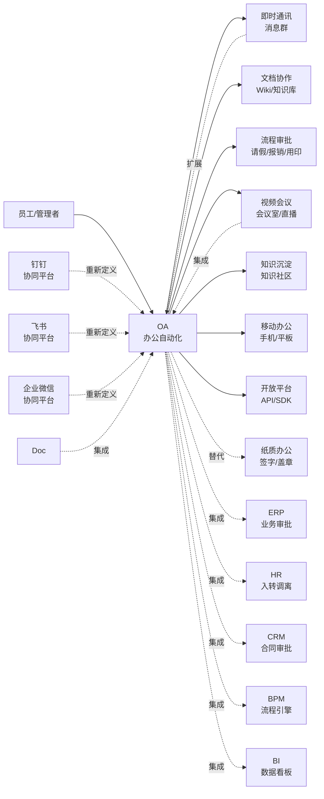
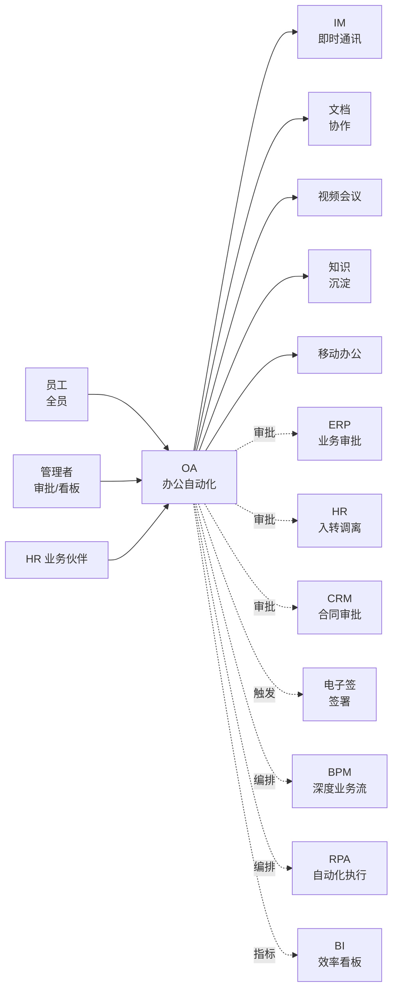

<!--
module:
  parent: application-systems
  slug: application-systems/05-operations/oa
  type: article
  category: 主模块子文章
  summary: 一份按业务场景梳理的 OA 速查手册：从"纸质办公"到"流程数字化"。
-->

# OA · 办公自动化系统

> 一份按业务场景梳理的 OA 速查手册：从"纸质办公"到"流程数字化"。

---

## 📌 全景图

OA 在企业 IT 架构中是"全员日常办公入口"——既是员工每天打开的第一个系统（消息/审批/文档），也是跨业务系统流程审批的"汇聚点"（HR/ERP/CRM/财务的待办都收口到 OA 待办中心）。从 2024-2026 趋势看，传统 OA（泛微/致远为代表）正在被"协同办公平台"（钉钉/飞书/企微）以"全员 IM + 自带审批 + 自带文档"的组合包形态"挤压"——泛微 e-cology 也已发布 e-termianl 飞书/钉钉集成方案，致远互联则打造"协同云"承接。

**OA 在企业 IT 架构中的位置**：OA 是"全员日常办公的统一入口"——一个员工每天打开 OA 看消息（IM）、查待办（流程审批）、找文档（Wiki）、定会议室（视频会议）。向上承接"全员 IM + 协同"诉求（与钉钉/飞书/企微融合），向下与 ERP/HR/CRM/BPM 的"业务审批流"对接，把跨系统的"待办"收口到 OA 待办中心，避免员工在 10 个系统间来回切换。

---

## 一、一句话定位

**OA（Office Automation，办公自动化系统）**：把企业日常行政事务（审批 / 文档 / 会议 / 公告）搬到线上，实现"流程化、数字化、移动化"办公。

---

## 二、核心功能（6 大模块）

| 模块 | 功能 | 价值 |
|------|------|------|
| **流程审批** | 请假 / 报销 / 用印 / 合同 | 流程标准化 |
| **公文管理** | 发文 / 收文 / 签报 | 合规存档 |
| **文档协作** | Wiki / 知识库 / 在线文档 | 知识沉淀 |
| **会议管理** | 会议室预定 / 视频会议 | 协同效率 |
| **即时通讯** | 企业 IM / 工作群 | 沟通效率 |
| **综合行政** | 车辆 / 资产 / 宿舍 | 后勤管理 |

---

## 三、典型用户与场景

| 角色 | 主要诉求 |
|------|---------|
| 普通员工 | 流程审批、文档协作 |
| 中层管理 | 流程监控、审批效率 |
| 高层管理 | 决策支持、数据看板 |
| HR / 行政 | 流程设计、数据统计 |

---

## 四、OA vs BPM vs 工作流引擎

| 系统 | 关注点 |
|------|--------|
| **OA** | 通用办公（流程+文档+IM 一体化）|
| **BPM** | 业务流程建模（专业流程平台）|
| **工作流引擎** | 流程执行引擎（如 Camunda、Flowable）|

**关系**：OA 是"应用"，BPM 是"建模工具"，工作流引擎是"底层执行"。

**OA vs BPM vs 工作流引擎关系详解**（2025-2026 高频混淆点）：

- **OA（应用层）**：面向全员日常办公（请假/报销/用印/会议/文档/IM 一体化），覆盖 80% 行政办公场景；流程建模能力通常较弱（多数用"图形化拖拽"但不支持完整 BPMN 2.0/DMN/CMMN）
- **BPM（建模层）**：面向跨系统业务流程（销售合同/采购审批/信贷审批/保险理赔），提供完整的 BPMN 2.0 建模 + DMN 规则引擎 + CMMN 案例管理 + 流程挖掘
- **工作流引擎（执行层）**：纯技术组件——Camunda Zeebe / Flowable / Activiti / jBPM / 自研 State Machine；不直接面向业务用户，被 BPM 或 OA 嵌入作为"流程运行底座"

**典型组合模式**（**2025-2026 主流**）：

| 组合模式 | 场景 | 代表 |
|---------|------|------|
| **OA + 自带工作流** | 行政办公为主 | 泛微、致远、钉钉、飞书、企微 |
| **BPM + 工作流引擎** | 深度业务流程 | Camunda Platform / Flowable + 自建表单 |
| **OA + BPM 双平台** | 大型企业 | 钉钉/泛微做日常行政审批 + Camunda 做核心业务流 |
| **低代码 + 工作流引擎** | 创新业务 | 钉钉宜搭 / 飞书多维表格 + 简道云内置引擎 |

---

## 五、主流厂商/产品对比

| 类型 | 代表产品 | 适用场景 |
|------|---------|---------|
| **国内主流** | 泛微 e-cology / 致远互联 / 华天动力 | 大型集团 |
| **互联网 SaaS** | 钉钉 / 飞书 / 企业微信 | 中小企业 |
| **传统老牌** | 用友致远 / 金蝶 K/3 OA | 国企/政府 |
| **低代码** | 简道云 / 明道云 / 轻流 | 轻量级 |

**主流厂商深度对比**（**2025-2026 用户规模**）：

| 厂商 | 总部 | 产品定位 | 用户规模 | 核心优势 | 核心劣势 | 适用规模 |
|------|------|---------|---------|---------|---------|---------|
| **钉钉** | 杭州 | 互联网 OA 龙头 | **7 亿+ 用户**（2024）/ **2400 万+ 企业组织**（2024） | 阿里生态（淘宝/天猫/支付宝/1688 一体化）/ 免费版功能强大 / 智能硬件（钉钉考勤机/钉钉视频会议）/ Teambition 协同 | 流程建模深度偏弱 / 高度依赖钉钉生态 / 私有化能力弱 | 中小企业 / 教育 / 制造业 |
| **飞书** | 北京 | 互联网 OA 第二梯队 | **1.4 亿+ 用户**（2024） | 字节生态（抖音/飞连/火山引擎）/ 文档协作最强（飞书文档）/ AI Copilot（智能伙伴）/ 字节内部最佳实践 | 审批流不如钉钉深厚 / 行业方案较少 / 商业化较激进 | 互联网 / 媒体 / 创新企业 |
| **企业微信** | 深圳 | 互联网 OA 第三梯队 | **1.3 亿+ 用户**（2024，含微信生态客户） | 微信生态（与微信互通 14 亿用户）/ 连接客户能力最强（客户群/客户朋友圈）/ 腾讯会议联动 | IM 体验略弱于钉钉/飞书 / 企业管理功能不如钉钉 | 零售 / 服务 / 教育（重客户连接） |
| **泛微 e-cology** | 上海 | 国内 OA 传统龙头 | **8000+ 大型企业客户**（2024，覆盖 80% 中国 500 强） | 复杂流程处理能力强（BPMN 兼容）/ 私有化部署成熟 / 移动端体验完善（e-mobile）/ 行业方案 50+ 行业 | 移动体验仍弱于互联网 OA / 实施周期长（6-12 个月）/ 单价高（100 万-1000 万+） | 大型集团 / 国企 / 政府 / 金融 |
| **致远互联** | 北京 | 国内 OA 第二 | **6000+ 企业客户**（2024） | 协同云架构（CAP 协同技术平台）/ 与用友 ERP 深度集成 / 央企国企案例深 | 移动端不如泛微 / 互联网产品体验较弱 | 国企 / 央企 / 大型集团 |
| **华天动力** | 北京 | 国内 OA 专注型 | **5000+ 企业客户** | 工作流引擎强（自研）/ 流程效率高 / 性价比较好 | 品牌知名度不如泛微/致远 / 移动端一般 | 中大型企业 / 政府 / 制造 |
| **用友致远** | 北京 | 用友系 OA | 依托用友 NC / U8 / YonBIP 用户 | 与用友财务/HR 深度集成 / 财务用户转化方便 | OA 专业能力不如专业厂商 / 创新乏力 | 用友财务用户 |
| **金蝶 K/3 OA** | 深圳 | 金蝶系 OA | 依托金蝶 K/3 / 云·苍穹用户 | 与金蝶 ERP 集成 / 中小企业用户转化 | 类似用友系困境 | 金蝶 ERP 用户 |

**低代码 OA 补充**（2025-2026 趋势）：

| 厂商 | 定位 | 与传统 OA 关系 |
|------|------|---------------|
| **简道云** | 表单 + 流程 + 数据可视化 | 流程审批型 OA，可作为传统 OA 补充 |
| **明道云** | 工作流 + 业务应用搭建 | 适合轻量级 OA + 业务应用一体化 |
| **轻流** | 流程自动化 + 表单 | 与 OA 互补，专注流程模板 |
| **钉钉宜搭** | 钉钉生态低代码 | 钉钉用户搭建业务应用 |
| **飞书多维表格 + 应用引擎** | 飞书生态低代码 | 飞书用户搭建业务应用 |

---

## 六、选型建议

| 场景 | 推荐 |
|------|------|
| 大型集团（万人以上）| 泛微 / 致远互联 |
| 中型企业（千人-万人）| 钉钉 / 飞书 / 企业微信 |
| 小微企业 | 钉钉免费版 / 飞书 |
| 国企 / 政府 | 泛微 / 华天动力 |
| 互联网 / 创业公司 | 飞书 / 钉钉 |

**选型决策树（5 层，2025-2026）**：

1. **先看规模与行业**：万人以上大型集团 → 泛微/致远（私有化深度 + 复杂流程）；千人-万人的中大型企业 → 钉钉/飞书（移动化 + 性价比）；国企央企/政府 → 泛微/华天动力（合规 + 信创案例）；互联网/创业公司 → 飞书/钉钉（产品体验 + 协作）
2. **再看生态绑定**：阿里生态（淘宝/天猫/支付宝/1688/菜鸟）→ 钉钉；字节生态（抖音/火山引擎）→ 飞书；微信生态（微信/视频号/小程序）→ 企业微信；SAP/Oracle/用友 NC → 致远；金蝶 ERP → 金蝶 OA
3. **再看核心诉求**：复杂流程 + 行业方案 + 私有化 → 泛微/致远；全员 IM 协同 + 移动办公 → 钉钉/飞书；客户连接（私域/营销/客服）→ 企业微信；文档协作 + 知识沉淀 → 飞书；考勤/审批/会议全能 + 阿里生态 → 钉钉
4. **再看合规与信创**：央国企/政府/金融需信创（信创要求纯国产化 + 安全可控）→ 泛微（信创版）/ 致远（信创版）/ 华天动力；外资/合资 → 飞书/钉钉外资版更友好
5. **最后看预算与 TCO**：5 年 TCO 需在 50 万-2000 万区间合理分配——SaaS 型（钉钉/飞书/企微）50-500 万；私有化型（泛微/致远）200-2000 万

---

## 七、实施关键点

1. **流程梳理**：先做流程梳理（BPMN），再上系统
2. **移动化**：必须支持手机审批（钉钉/飞书原生支持）
3. **集成**：与 ERP / HR / 财务系统集成（避免数据孤岛）
4. **数据归档**：合规要求（电子档案法）
5. **AI 增强**：智能审批（自动识别异常）、智能问答

**实施关键点详解**（2025-2026 经验）：

1. **流程梳理先于系统**：
   - 用 BPMN 2.0 标准梳理业务流（请参考 [BPM 深读](../bpm/README.md)）
   - 识别"高频流程"（每天 100+ 单）与"长尾流程"（每月 < 10 单）
   - **先做 5-10 个标杆流程**，验证 ROI 后再推广
   - 流程 Owner 机制：每个流程指定业务负责人，定期 review

2. **移动化是必选项**：
   - **钉钉/飞书/企微原生支持手机审批**（70% 审批在手机上完成）
   - 泛微/致远需配移动 APP（e-mobile / 致远 M3）
   - 注意 iOS/Android 兼容性（WKWebView / WebView 适配）
   - **移动审批平均时长 < 2 秒响应**，否则体验崩塌

3. **集成避免数据孤岛**：
   - **OA ↔ ERP**：采购订单触发 OA 审批流；审批通过回写 ERP 状态
   - **OA ↔ HR**：员工入转调离触发 OA 账号开通/权限变更
   - **OA ↔ CRM**：销售合同审批 → 触发电子签签署（参考 [电子签 深读](../e-signature/README.md)）
   - **OA ↔ BI**：流程耗时/审批效率作为 KPI 进 BI 看板

4. **数据归档与合规**：
   - 《电子档案法》（2020 修订，2021 实施）要求电子档案"来源可靠、程序规范、要素合规"
   - 流程数据需"长期保存"（至少 10 年）+ "可追溯"（时间戳 + 数字签名）
   - 钉钉/飞书/企微支持云端存档 + 私有部署；泛微/致远支持私有化 + 区块链存证
   - 涉密文件（机密/秘密/绝密）需按等保 2.0 三级要求建设

5. **AI 增强是 2025-2026 趋势**：
   - **智能审批**：AI 自动识别"异常申请"（如差旅费用高于均值 2 倍 / 请假时长异常）
   - **智能问答**：员工问"年假还剩几天？"AI 直接给答案（基于员工数据）
   - **智能流程挖掘**：Process Mining 工具分析历史审批流，识别瓶颈（如某节点平均耗时 5 天）
   - **智能文档**：飞书智能伙伴 / 钉钉斜杠（/）AI / 企微智能机器人（2025 标配）

---

## 八、与现代协作工具的关系

| 工具 | 关系 |
|------|------|
| **钉钉 / 飞书 / 企业微信** | 现代 OA 替代品（自带审批/IM/文档）|
| **传统 OA（泛微等）** | 适合"复杂流程 + 合规"场景 |
| **Notion / 飞书文档** | 知识管理工具，可与 OA 集成 |

**OA vs 钉钉 / 飞书 / 企微 详解**（**2025-2026 最热门的 OA 选型问题**）：

| 维度 | 传统 OA（泛微/致远） | 钉钉 / 飞书 / 企微 |
|------|---------------------|-------------------|
| **核心定位** | 流程审批 + 公文管理 + 综合行政 | 协同办公套件（IM + 审批 + 文档 + 视频会议 + 应用平台）|
| **流程审批深度** | **强**（BPMN 兼容 + 复杂流程 + 行业模板） | 中（拖拽式配置 + 智能审批 + 模板市场）|
| **IM 即时通讯** | **弱**（自带 IM 不如专业 IM） | **强**（钉钉/飞书/企微 IM 体验最强）|
| **文档协作** | 中（Wiki 为主） | **强**（飞书文档最强 / 钉钉文档 / 企微腾讯文档）|
| **视频会议** | 中（集成第三方） | **强**（钉钉视频会议 / 飞书视频会议 / 企微腾讯会议）|
| **移动化** | 需配移动 APP | **原生支持**（手机就是入口）|
| **AI 能力** | 中 | **强**（飞书智能伙伴 / 钉钉 AI / 企微智能机器人）|
| **生态绑定** | 不依赖特定生态 | 钉钉 = 阿里生态 / 飞书 = 字节生态 / 企微 = 微信生态 |
| **私有化** | **强**（泛微/致远私有化成熟） | **弱**（钉钉专有云/飞书专有云需定制 / 企微主要 SaaS）|
| **合规与信创** | **强**（泛微信创版/致远信创版/华天动力） | 中（互联网厂商信创进度不一）|
| **价格** | **高**（100 万-1000 万+ 私有化） | **低**（SaaS 免费版可用，付费版 50-500 万/年）|
| **实施周期** | **长**（6-12 个月） | **短**（SaaS 1-2 周上线）|
| **适用规模** | **大型集团 / 国企 / 政府** | **中小企业 / 互联网 / 创新公司** |

**趋势判断**（**2024-2026**）：
- **大型央企 / 国企 / 金融 / 政府**：仍以**传统 OA + 私有化部署**为主（泛微/致远/华天动力），但会"互联网化升级"——叠加钉钉/飞书/企微的 IM 能力
- **中型企业（500-5000 人）**：**互联网协同套件替代传统 OA**——钉钉/飞书/企微全套使用
- **小微企业（< 500 人）**：**钉钉 / 飞书 / 企微免费版 + 钉钉宜搭 / 飞书多维表格**完全替代传统 OA
- **互联网 / 创新公司**：**首选飞书**（字节内部最佳实践 + AI Copilot + 文档体验）
- **零售 / 服务 / 教育（重客户连接）**：**首选企业微信**（与微信 14 亿用户互通）
- **制造业 / 教育 / 政企（中大型）**：**首选钉钉**（行业方案 + 智能硬件 + 阿里生态）

---

## 九、🔧 核心能力（OA 平台 8 大能力）

OA 系统的核心能力可归纳为 8 大模块，**钉钉/飞书/企微/泛微/致远**均围绕这 8 大能力构建：

| 序号 | 能力 | 说明 | 价值 |
|------|------|------|------|
| 1 | **流程审批** | 请假/报销/用印/合同审批等 | 流程标准化，效率提升 50-80% |
| 2 | **文档协作** | Wiki/知识库/在线文档/飞书文档 | 知识沉淀，版本可控 |
| 3 | **即时通讯** | 企业 IM/工作群/视频/语音 | 沟通效率（钉钉/飞书/企微核心能力）|
| 4 | **视频会议** | 会议室预定/视频会议/直播/录播 | 远程协作（疫情后成为标配）|
| 5 | **通讯录** | 组织架构/员工信息/一键找人 | 全员搜索（钉钉/飞书/企微原生）|
| 6 | **知识沉淀** | 知识社区/培训/考试/学习地图 | 企业学习与人才发展 |
| 7 | **移动办公** | 手机/平板/智能硬件（考勤机/会议屏）| 远程办公（2020+ 标配）|
| 8 | **集成能力** | 开放平台/API/SDK/低代码 | 与 ERP/HR/CRM/电子签/BI 集成 |

### 1. 流程审批（Workflow Approval）

**OA 最核心的能力**——把企业日常审批（请假/报销/用印/合同/采购/出差）从"纸质签字"搬到线上。

- **审批流类型**：
  - **固定流程**：A → B → C → D，节点和审批人固定（请假、报销）
  - **条件流程**：根据金额/部门/时间触发不同分支（如"金额 > 10 万需 CEO 审批"）
  - **并行流程**：A 和 B 同时审批（如"财务和法务并行审查合同"）
  - **子流程**：父流程嵌套子流程（如"采购审批"嵌套"用印审批"）
- **审批人模式**：
  - **指定人**：审批人固定（如"张三审批"）
  - **指定角色**：审批人为某角色（如"部门总监"）
  - **直属上级**：审批人为发起人直属上级（最常用）
  - **指定层级**：审批人为发起人 N 级上级
  - **矩阵式**：同时考虑"行政线 + 业务线"
- **审批节点操作**：
  - **同意 / 拒绝**（最基础）
  - **加签**（多人审批：会签/或签）
  - **转办**（把审批转给其他人）
  - **退回**（退回到某个节点）
  - **委托**（委托给代理人，如请假时代理审批）
  - **抄送**（不参与审批但知晓）
- **智能审批**（**2025-2026 趋势**）：
  - **自动识别异常**（AI 检测差旅费用异常、合同条款风险）
  - **自动审批**（小额报销无需人工，AI 自动审批）
  - **智能推荐审批人**（AI 推荐最合适的审批人）
  - **流程效率分析**（Process Mining 工具识别瓶颈）

### 2. 文档协作（Document Collaboration）

**OA 知识沉淀的核心**——把企业文档（制度/流程/手册/报告）沉淀为可复用资产。

- **文档类型**：
  - **Wiki / 知识库**（泛微/致远主流）：结构化知识库 + 全文搜索 + 版本管理
  - **在线文档**（钉钉文档 / 飞书文档 / 腾讯文档）：多人实时协作 + 评论 + 引用
  - **文件存储**（钉盘 / 飞书云文档）：网盘式存储 + 权限分级
  - **知识地图**：按角色/岗位提供知识导航
- **协作能力**：
  - **多人编辑**：实时同步 + 冲突解决（飞书文档最强）
  - **评论与@**：文档内评论 + @提醒
  - **历史版本**：版本回溯 + 版本对比
  - **权限管理**：阅读/编辑/管理/分享控制
- **AI 增强**（飞书智能伙伴 / 钉钉 / 企微）：
  - **AI 总结**：长文档一键摘要
  - **AI 问答**：基于文档内容回答问题（RAG 架构）
  - **AI 翻译**：多语言翻译
  - **AI 写稿**：基于主题自动生成文档

### 3. 即时通讯（Instant Messaging / IM）

**钉钉/飞书/企微的核心差异化能力**——传统 OA 通常自带 IM 但远不如专业 IM。

- **基础能力**：单聊/群聊/文件传输/消息撤回/已读回执
- **企业 IM 能力**：
  - **全员群 / 部门群**（组织架构自动建群）
  - **工作群 / 项目群**（基于业务自动建群）
  - **消息分类**：重要消息 / 普通消息 / 群机器人
  - **消息触达**：短信 / 邮件 / 推送 / 应用内
- **钉钉 / 飞书 / 企微 差异**：
  - **钉钉**：强消息触达（重要消息必达，DING 一下）+ Teambition 项目协同
  - **飞书**：强消息与文档结合（飞书消息支持嵌入文档/表格）
  - **企微**：与微信互通（可加微信用户为好友）

### 4. 视频会议（Video Conferencing）

**2020 疫情后成为 OA 标配**——钉钉/飞书/企微原生支持。

- **会议类型**：即时会议 / 预约会议 / 大型会议（1000+）/ 直播
- **基础能力**：音视频 / 屏幕共享 / 白板 / 录制 / 字幕
- **钉钉视频会议**：300 人免费 / 1024 人付费 / 硬件会议室
- **飞书视频会议**：100 人免费 / 1000 人付费
- **企微腾讯会议**：与腾讯会议深度集成（1000+ 人会议能力）
- **Zoom / Teams**：跨国企业首选（中企出海常用 Zoom）

### 5. 通讯录（Contacts / Organization）

**OA 全员搜索的基础**——传统 OA 通讯录通常较弱，互联网 OA 强大。

- **基础字段**：姓名/工号/部门/职位/邮箱/手机
- **扩展字段**：办公地点/入职日期/汇报关系/技能标签
- **搜索能力**：
  - **按姓名/拼音/工号搜索**（最基础）
  - **按部门/职位搜索**
  - **按技能/标签搜索**
  - **按组织树展开**（钉钉/飞书原生）
- **隐私控制**：手机号脱敏 / 部分字段对普通员工隐藏
- **与 HR 集成**：员工入转调离自动同步通讯录（OA 账号自动开通/关闭）

### 6. 知识沉淀（Knowledge Base / Learning）

**OA 与企业学习结合**——把"文档协作"升级为"企业学习"。

- **知识社区**：问答 / 文章 / 分享 / 积分（钉钉学习 / 飞书知识库 / 企微学习）
- **培训管理**：课程发布 / 在线学习 / 考试 / 培训记录（与 HR 培训模块集成）
- **学习地图**：按岗位/角色推荐学习内容
- **企业百科**：企业专属百度百科（沉淀制度/流程/术语）

### 7. 移动办公（Mobile Office）

**2020+ 标配能力**——OA 70%+ 操作在移动端完成。

- **移动 APP**：员工手机装 OA APP（钉钉/飞书/企微/泛微 e-mobile / 致远 M3）
- **移动审批**：手机审批 + 指纹/面容登录 + 消息推送
- **移动考勤**：打卡 / 外勤 / 请假 / 报销（钉钉考勤机 / 钉钉打卡）
- **移动会议**：手机入会 / 移动会议预约 / 会议室扫码
- **移动文档**：手机查阅/编辑文档

### 8. 集成能力（Integration & API）

**OA 价值最大化的关键**——OA 与业务系统集成决定生态价值。

- **开放 API**：REST API + Webhook + SDK（多语言 Java/Python/Node.js/PHP）
- **集成方向**：
  - **OA ↔ ERP**（采购审批 / 销售订单审批）
  - **OA ↔ HR**（员工入转调离 / 薪资审批）
  - **OA ↔ CRM**（销售合同审批 / 客户分配）
  - **OA ↔ 电子签**（审批通过触发电子签签署，见 [电子签 深读](../e-signature/README.md)）
  - **OA ↔ BPM**（复杂业务流程编排，见 [BPM 深读](../bpm/README.md)）
  - **OA ↔ BI**（审批效率 / 流程耗时 KPI 看板，见 [BI 深读](../bi/README.md)）
- **低代码平台**：钉钉宜搭 / 飞书多维表格 / 企微腾讯轻连，让业务人员搭建集成应用

---

## 十、📊 关键模块详解

### 流程引擎（Workflow Engine）

OA 流程引擎是"流程审批的发动机"——决定 OA 能支撑多复杂的审批流。

- **流程设计器**：
  - **图形化拖拽**（所有 OA 均支持）
  - **BPMN 2.0 标准**（泛微支持，致远部分支持；钉钉/飞书/企微采用自研 DSL）
  - **分支/并行/会签/或签**
  - **子流程/嵌套**
  - **条件表达式**（金额/部门/时间）
- **规则引擎**：
  - **阈值规则**（金额 > 10 万需 CEO 审批）
  - **路由规则**（差旅申请路由到对应差旅审批人）
  - **跳过规则**（小额自动审批）
- **流程监控**：
  - **流程实例跟踪**（当前节点/已用时长/处理人）
  - **超时提醒**（审批超过 24 小时自动提醒）
  - **流程效率分析**（平均耗时/瓶颈节点）
- **流程优化**：
  - **Process Mining**（2025 趋势）：分析历史流程数据，识别优化机会
  - **A/B 测试**：对比不同流程设计的审批效率
  - **流程版本管理**：流程迭代不破坏历史实例

### 表单引擎（Form Engine）

OA 表单引擎是"流程数据的载体"——决定 OA 收集数据的易用性。

- **表单设计器**：
  - **拖拽式设计**（输入框/下拉框/日期/附件/部门/人员）
  - **字段类型**（文本/数字/日期/附件/位置/富文本/手写签名）
  - **字段联动**（"国家"决定"省份"选项）
  - **校验规则**（必填/格式/数值范围）
- **表单能力**：
  - **表单模板**（请假单/报销单/出差申请单）
  - **表单版本管理**
  - **表单数据分析**（每月请假类型分布）
- **电子化签名**：
  - **手写签名**（钉钉/飞书原生支持）
  - **电子印章**（部分厂商支持，但**仅手写签名无法律效力**——见下方陷阱）

### 文档管理（Document Management）

- **文档类型**：Wiki / 在线文档 / 知识库 / 制度库
- **协作能力**：多人编辑 / 评论 / 权限 / 版本 / 检索
- **存储与备份**：本地存储 / 云端存储（钉盘/飞书云文档）/ 混合存储
- **安全控制**：加密 / 水印 / 权限分级 / 防泄密（DLP）
- **归档与合规**：电子档案法要求 + 长期保存

### 通讯录 + 组织架构

- **组织架构**：树形 / 矩阵式 / 多法人（集团多公司）
- **同步集成**：与 HR 模块双向同步（员工入转调离）
- **字段扩展**：自定义字段（业务线/技能标签）
- **对外显示**：部分字段对外隐藏（手机号脱敏）

### 即时通讯（IM）

- **基础能力**：单聊/群聊/文件/语音/视频
- **企业能力**：工作群/项目群/全员群/部门群
- **消息必达**：钉钉 DING / 飞书急通知 / 企微语音电话
- **消息分类**：普通/重要/紧急
- **应用消息**：OA / 审批 / 业务系统推送

### 视频会议

- **即时会议** vs **预约会议**
- **小型会议**（< 50 人）vs **大型会议**（1000+ 人）
- **硬件会议室** vs **软件会议室**
- **录制 / 转写 / 字幕**（2025 标配）
- **AI 会议纪要**（飞书智能伙伴 / 钉钉 / 企微）

### 知识社区

- **问答系统**：提问 / 回答 / 采纳 / 积分
- **文章系统**：发布 / 分类 / 标签 / 推荐
- **培训系统**：课程 / 学习 / 考试 / 证书
- **学习地图**：按岗位推荐学习路径

### 移动端

- **iOS + Android 原生 APP**
- **移动审批**（70%+ 审批在手机上完成）
- **移动考勤**（钉钉考勤机 + GPS 打卡）
- **移动会议**（手机入会）
- **消息推送**（审批推送 / 会议邀请）

### 开放平台

- **REST API**：单点登录（SSO）/ 审批接口 / 组织架构同步
- **Webhook**：审批状态变更 / 流程事件
- **SDK**：Java/Python/Node.js/PHP/小程序
- **低代码集成**：钉钉宜搭 / 飞书多维表格

---

## 十一、🏆 选型决策（自研 vs SaaS vs 私有化）

### 自研 vs 商用 vs SaaS（OA 决策框架）

| 维度 | 自研 OA | 传统 OA 私有化（泛微/致远） | SaaS OA（钉钉/飞书/企微） |
|------|--------|---------------------------|--------------------------|
| **适用规模** | 万亿级互联网巨头（仅字节/阿里/腾讯内部使用）| 大型集团 / 国企 / 政府 / 金融（万人以上） | 中小企业 / 中型企业 / 互联网（< 万人） |
| **优势** | 100% 自主可控 / 深度定制 / 弹性扩展 | 复杂流程 + 行业方案成熟 / 私有化部署 / 合规保障 | 快速上线（1-2 周） / 成本低 / 移动化 / AI 能力 |
| **劣势** | 投入巨大（数亿+） / 周期长（3-5 年） / 需 100+ 人团队 | 实施周期长（6-12 个月） / 单价高 / 移动体验弱 | 数据在云（部分客户担心） / 定制受限 / 难以满足深度合规 |
| **典型代表** | 字节跳动 Lark（飞书前身）/ 阿里钉钉（早期自研） | 泛微 / 致远 / 华天动力 | 钉钉 / 飞书 / 企业微信 |
| **决策阈值** | 万亿级巨头 + 长期投入 → 自研；否则 → 商用/SaaS | 大型集团 + 数据本地化 + 行业方案 → 私有化 | 通用场景 + 快速上线 + 移动办公 → SaaS |

### 钉钉 / 飞书 / 企微 选型决策

**钉钉 vs 飞书 vs 企微 详细对比**（**2025-2026 终极选型问题**）：

| 维度 | **钉钉** | **飞书** | **企业微信** |
|------|---------|---------|------------|
| **定位** | 阿里协同办公龙头（**7 亿+用户**） | 字节协同办公（**1.4 亿+用户**） | 腾讯协同办公（**1.3 亿+用户**） |
| **核心优势** | **生态最强**（阿里电商/支付/物流）/ 智能硬件 / 高频迭代 / 智能审批 | **AI 最强**（智能伙伴 + 多维表格 AI）/ 文档体验最佳（飞书文档）/ 字节内部最佳实践 | **客户连接**（与微信 14 亿用户互通）/ 私域营销 / 微信小程序互通 |
| **核心劣势** | 文档弱于飞书 / 客户连接弱于企微 | 审批流不如钉钉深厚 / 行业方案较少 | IM 体验弱于钉钉/飞书 / 企业内管理功能不如专业 OA |
| **行业最佳实践** | 制造业 / 教育 / 政企 / 中大型企业 | 互联网 / 媒体 / 设计 / 创新公司 | 零售 / 服务 / 教育（重客户连接） / 营销 |
| **价格（1000 人企业）** | SaaS 50-200 万 / 年 | SaaS 80-300 万 / 年 | SaaS 50-150 万 / 年 |
| **企业版价格** | 9800 元/年起（100 人以下）| 9800 元/年起（100 人以下）| 6000 元/年起 |
| **AI 能力** | 钉钉斜杠（/）AI / 智能问答 | **飞书智能伙伴**（最强，多维表格 AI） | 企微智能机器人（基础） |
| **开放性** | 钉钉开放平台 + 钉钉宜搭 | 飞书开放平台 + 飞书多维表格 | 企微第三方应用 + 腾讯轻连 |
| **生态绑定** | 阿里（淘宝/天猫/支付宝/菜鸟/1688） | 字节（抖音/火山引擎/飞书） | 微信（微信/视频号/小程序） |

**选型决策树（钉钉 vs 飞书 vs 企微）**：

1. **企业核心诉求是"内部协同"**：飞书（最强文档 + AI） / 钉钉（最强 IM + 生态）
2. **企业核心诉求是"客户连接"**：**企业微信**（与微信互通）
3. **企业核心诉求是"阿里生态对接"**：**钉钉**
4. **企业核心诉求是"字节生态对接"**：**飞书**
5. **企业核心诉求是"微信生态对接"**：**企业微信**
6. **企业核心诉求是"AI + 文档协作"**：**飞书**
7. **企业核心诉求是"复杂审批流 + 行业方案"**：**钉钉** / **泛微**
8. **企业核心诉求是"智能硬件 + 制造业"**：**钉钉**
9. **企业核心诉求是"出海 / 跨国"**：**飞书**（Lark）/ Zoom / Microsoft Teams
10. **企业核心诉求是"免费 + 够用"**：**钉钉免费版** / **飞书免费版** / **企微免费版**

---

## 十二、🚨 实施陷阱 / 反模式

### 1. OA 选型偏差陷阱

**现象**：选型时贪图"功能多"，上了泛微/致远，结果 80% 员工不会用复杂的流程设计器；或者选钉钉/飞书免费版，结果合规要求满足不了。
**根因**：选型时没有"业务场景 + 用户画像 + 预算"三维评估，凭厂商销售 PPT 决策。
**规避**：先做"业务场景清单"（10-30 个核心流程）+ "用户画像分析"（一线员工占比 / 高管占比 / 移动办公比例）+ "预算评估"（5 年 TCO 上限），再做选型。

### 2. 流程冗余陷阱

**现象**：OA 上线后流程越来越多（员工离职/请假/报销/用印/采购/合同/出差...），3 个月后 100+ 流程，员工查不到想要的流程。
**根因**：流程设计没有"统一规范"，每个部门各自设计，流程命名混乱、入口分散。
**规避**：建立"流程分类标准"（按业务域/审批类型）+ "流程命名规范"（请假类_差旅类_报销类_用印类）+ "流程入口统一"（一个待办中心汇总）+ "流程 Owner 机制"（每个流程指定业务负责人）。

### 3. 移动化缺失陷阱

**现象**：OA 上线后审批效率反而下降——员工需要打开 PC 才能审批，出差期间审批大量超时。
**根因**：移动化做得差（泛微/致远早期移动体验弱于钉钉/飞书）；移动 APP 需要单独审批 / 需要 VPN / 体验差。
**规避**：移动化是 OA 的"必选项"——钉钉/飞书/企微原生支持；泛微/致远需配移动 APP（e-mobile / 致远 M3）+ 移动审批优化（响应时间 < 2 秒）。

### 4. 集成黑洞陷阱

**现象**：OA 与 ERP/HR/CRM 集成"只做表面"——OA 审批通过后，ERP 状态未更新；员工需要手动在 ERP 二次操作。
**根因**：OA ↔ ERP 集成"只做了 API 调用"未做"业务事件驱动 + 双向同步"。
**规避**：深度集成 = 事件驱动 + 双向同步：
- OA 审批通过 → 推送事件到 ERP → ERP 自动更新状态
- ERP 业务事件（如采购订单创建）→ 推送到 OA → OA 自动发起审批流
- 数据回写：OA 把审批结果（时间/审批人/意见）回写到 ERP

### 5. 数据归档陷阱（合规）

**现象**：OA 上线 3 年后，因合规要求（电子档案法 / 等保 2.0）需要导出历史数据，发现数据格式混乱、时间戳不统一，无法满足合规审计。
**根因**：OA 上线时未规划"数据归档与长期保存"；未使用区块链存证；未对接时间戳服务。
**规避**：OA 必须支持"电子档案法"要求：
- 流程数据"长期保存"（至少 10 年）+ 时间戳
- 关键文档（合同/公文）区块链存证
- 数据格式标准化（PDF/A + 元数据）
- 与电子签 / 时间戳 / 区块链集成（参考 [电子签 深读](../e-signature/README.md)）

### 6. 用户使用率低陷阱

**现象**：OA 实施完成，但日活用户 < 30%（钉钉/飞书/企微通常 70%+）；员工仍用微信群沟通，OA 待办堆积。
**根因**：OA 体验差（UI 难用 / 加载慢 / 移动端差）；未与 IM 深度整合（OA 审批推送不到 IM）；上线培训不足。
**规避**：
- 选择"用户友好型"OA（钉钉/飞书/企微 >> 泛微/致远）
- **OA ↔ IM 深度整合**（审批推送在 IM 中点击直达）
- 上线前做"用户培训 + 灰度上线 + 持续运营"
- 设置"OA 使用率"作为 KPI（如"日活 > 60%"）

### 7. 权限失控陷阱

**现象**：OA 管理员权限分散（多个管理员都能改流程 / 删数据）；离职员工账号未及时关闭，仍能登录 OA 看敏感数据。
**根因**：权限管理不严——管理员权限未集中；员工入转调离未与 HR 系统联动关闭账号。
**规避**：
- **管理员权限集中**（仅 IT 部门 2-3 人）
- **与 HR 系统联动**（员工离职 24 小时内自动关闭 OA 账号）
- **权限最小化原则**（员工仅授予岗位所需权限）
- **定期权限审计**（每季度一次）

### 8. AI 智能化陷阱

**现象**：盲目引入"AI 智能审批"，结果 AI 误判率高（差旅费用异常误报率 > 20%），员工投诉，反而降低效率。
**根因**：AI 模型未训练，误判率高；员工对 AI 决策不信任。
**规避**：AI 智能化循序渐进——
- **L1**：先用 AI 做"参考建议"（AI 推荐审批人 / 推荐结果），最终决策仍由人
- **L2**：AI 做"小额自动审批"（如 < 100 元报销自动批）
- **L3**：AI 做"全流程自动化"（需大量训练 + 信任度）
- **从 L1 渐进到 L3**，避免一步到位

### 行业失败率统计

**OA 项目失败/未达预期率约 20-30%**（IDC 2024 调研），失败原因中：
- 约 **25%** 源自「选型偏差」（选错厂商 / 选错产品）
- 约 **20%** 源自「用户使用率低」（员工不愿意用）
- 约 **20%** 源自「移动化缺失」（移动体验差）
- 约 **15%** 源自「集成黑洞」（与业务系统集成不通）
- 约 **10%** 源自「合规与数据归档」（不满足电子档案法）
- 约 **10%** 源自「治理与权限失控」（管理员权限 / 账号管理）

规避核心：「**业务场景清单 + 选型决策树 + 移动化原生 + 集成事件驱动 + 电子档案合规 + 用户体验优先 + 权限最小化 + AI 循序渐进**」是 OA 成功的 **8 大前置条件**。

---

## 十三、🔗 上下游关系

- **上游用户**：员工（流程发起人）、管理者（审批人/数据看板用户）、HR 业务伙伴（流程设计/数据分析）
- **同源能力**：IM（即时通讯）/ 文档协作 / 视频会议 / 知识沉淀 / 移动办公
- **下游业务系统**：ERP（采购/销售/财务审批）/ HR（员工入转调离审批）/ CRM（销售合同审批）/ 电子签（审批通过触发签署，见 [电子签 深读](../e-signature/README.md)）/ BPM（复杂业务流程编排，见 [BPM 深读](../bpm/README.md)）/ RPA（自动化执行，见 [RPA 深读](../rpa/README.md)）/ BI（流程效率/审批时效 KPI 看板，见 [BI 深读](../bi/README.md)）

**集成要点**：

- **OA ↔ ERP**：ERP 业务事件（采购订单创建/销售订单创建）→ 推送 OA → 自动发起审批流；OA 审批通过 → 回调 ERP 更新状态
- **OA ↔ HR**：HR 员工入转调离 → 同步 OA（账号开通/权限变更/通讯录更新）；离职员工 24 小时内自动关闭 OA
- **OA ↔ CRM**：CRM 销售合同审批 → 触发 OA 审批流 → 审批通过触发电子签签署
- **OA ↔ 电子签**：OA 审批通过（用印申请/合同审批）→ 自动触发电子签签署（参考 [电子签 深读](../e-signature/README.md)）
- **OA ↔ BPM**：OA 处理"高频行政流"（请假/报销/用印），BPM 处理"复杂业务流"（销售订单/信贷审批）；二者通过 API 集成
- **OA ↔ RPA**：RPA 自动化"跨系统数据搬运"，OA 处理"流程审批"；二者协同实现"端到端自动化"
- **OA ↔ BI**：OA 把流程数据（耗时/审批量/异常率）推送 BI → 管理者看审批效率看板

**集成模式选择**：

- **单点登录（SSO）**：OA 与 ERP/HR/CRM 统一登录（钉钉/飞书/企微可作为 SSO 入口）
- **API 同步（实时）**：OA 审批状态变更 → 实时回调业务系统 REST API
- **消息队列（异步）**：业务事件通过 Kafka/RabbitMQ 推送 → OA 消费
- **事件驱动（Webhook）**：业务系统事件触发 OA 流程（如"采购订单创建"事件）
- **嵌入式流程**：业务系统嵌入 OA 审批组件（无需跳转）
- **双向同步**：OA ↔ 业务系统数据双向同步（账号/权限/组织架构）

---

## 十四、⚖️ 关键考量

- **OA 是"全员入口"**——70% 员工每天打开的第一个系统，决定企业数字化"门面"
- **流程梳理先于系统**——BPMN 2.0 标准梳理业务流，避免"流程上线即混乱"
- **移动化是底线**——70%+ 审批在手机上完成，移动体验差 = OA 失败
- **IM 是 OA 的核心差异化**——钉钉/飞书/企微已经用 IM 重新定义了 OA
- **AI 是 2025-2026 主旋律**——飞书智能伙伴 / 钉钉 AI / 企微智能机器人成标配
- **集成决定生态价值**——OA 与 ERP/HR/CRM/电子签深度集成决定上限
- **合规是底线**——《电子档案法》要求流程数据长期保存 + 时间戳 + 区块链存证
- **不要"贪大求全"**——先做 5-10 个标杆流程验证 ROI，再大规模推广
- **用户体验是 80% 成功的关键**——选择"用户友好型"OA（钉钉/飞书/企微），避免"功能强大但没人用"
- **私域客户连接选企微**——零售/服务/教育等重客户连接场景，企业微信（与微信互通）是首选

---

## 十五、🎯 选型指南

| 企业类型 | 推荐 | 理由 |
|---------|------|------|
| **大型集团（万人+）** | 泛微 e-cology / 致远互联（私有化）| 复杂流程 + 行业方案 + 私有化 + 合规 |
| **中型企业（千人-万人）** | 钉钉 / 飞书 / 企业微信（SaaS）| 快速上线 + 移动化 + AI 能力 |
| **小微企业（< 千人）** | 钉钉免费版 / 飞书 / 企微（SaaS）| 免费 + 够用 + 移动化 |
| **国企 / 政府** | 泛微 / 致远 / 华天动力（私有化/信创）| 合规 + 信创 + 行业案例 |
| **金融 / 银行** | 泛微 / 致远（私有化 + 金融行业方案）| 合规 + 安全 + 行业方案 |
| **制造业** | 钉钉 + 行业版（钉钉制造业版）| 智能硬件 + 行业方案 + 阿里工业互联网 |
| **互联网 / 创业公司** | 飞书 / 钉钉 | 体验 + AI + 文档协作 |
| **零售 / 服务 / 教育** | 企业微信 | 与微信互通 + 私域营销 + 客户连接 |
| **跨国 / 出海企业** | 飞书（Lark）/ Microsoft Teams | 全球化合规 + 多语言 |
| **媒体 / 设计 / 创新** | 飞书 | AI 文档 + 字节最佳实践 |

**选型自检维度（10 项）**：

1. **业务场景覆盖**：是否覆盖请假/报销/用印/合同/会议/文档/IM/视频会议？覆盖 70% 业务即可
2. **流程建模能力**：是否支持 BPMN 2.0 / 条件流 / 并行流 / 子流程？
3. **移动化能力**：是否原生支持手机审批？响应时间 < 2 秒？
4. **IM 能力**：是否原生 IM？消息必达？群机器人？
5. **AI 能力**：是否原生 AI（飞书智能伙伴 / 钉钉 AI）？智能审批 / 智能问答 / 智能文档？
6. **集成能力**：是否提供开放 API + Webhook + SDK？标准连接器（ERP/HR/CRM/电子签）数？
7. **合规与信创**：是否私有化部署？是否信创版？是否支持电子档案法要求？
8. **生态绑定**：是否与阿里/字节/微信生态对接？是否与现有 ERP/HR/CRM 对接？
9. **行业案例**：是否有本行业（制造/金融/教育/政企/零售）案例 ≥ 5 个？
10. **TCO 估算**：5 年 TCO 是否在预算范围内？私有化 vs SaaS 差距通常 5-10 倍

**红线**：

- 用户使用率 < 30% = 必败（不接受）
- 移动化缺失 = 落后一代（钉钉/飞书/企微已是标配）
- 无 IM 能力 = 落后两代（IM 是 OA 的核心能力）
- 无 AI 能力 = 落后（2025+ 标配）
- 无开放 API = 价值受限（无法与业务系统集成）
- 私有化但无信创 = 不满足央国企要求
- TCO > 2000 万 / 5 年 = 高于行业均值（需谨慎评估）
- 用户体验差 = 必败（钉钉/飞书/企微已重新定义 OA 体验）

**RFP 模板要点**：建议 RFP 覆盖 **6 大类 30+ 评分项**：

- **功能类（25%）**：流程引擎 / 表单引擎 / 文档协作 / 即时通讯 / 视频会议 / 通讯录 / 知识沉淀 / 移动办公 / 开放 API
- **AI 类（15%）**：智能审批 / 智能问答 / 智能文档 / 会议转写 / AI Copilot / 流程挖掘
- **性能类（10%）**：单平台用户数（万人级）/ 并发审批能力 / 移动端响应时间 / 文档加载时间
- **集成类（20%）**：ERP / HR / CRM / 电子签 / BPM / RPA 标准连接器数 / REST API / Webhook / SDK 多语言
- **合规类（15%）**：私有化部署 / 信创支持 / 电子档案法 / 等保 2.0 / GDPR / 数据本地化
- **服务类（15%）**：行业最佳实践 / 客户案例数 / 实施伙伴能力 / 培训认证 / SLA 承诺 / 持续迭代

**TCO 估算要点（1000 人企业 5 年 TCO）**：

| 方案 | License + 实施 | 运维/年 | 5 年 TCO |
|------|--------------|--------|---------|
| **钉钉 SaaS** | 100-300 万 | 30-80 万 | **300-700 万** |
| **飞书 SaaS** | 200-500 万 | 50-150 万 | **450-1250 万** |
| **企微 SaaS** | 50-200 万 | 20-50 万 | **150-450 万** |
| **泛微 e-cology 私有化** | 300-800 万一次性 | 50-150 万 | **550-1550 万** |
| **致远互联 私有化** | 250-700 万一次性 | 40-120 万 | **450-1300 万** |
| **华天动力 私有化** | 150-500 万一次性 | 30-80 万 | **300-900 万** |
| **自研** | 5000 万-1 亿一次性 | 500 万 | **7500 万-1.5 亿** |

---

## 十六、⚠️ 常见陷阱

- **「OA = 流程审批」**：错——OA 是"全员办公入口"（含 IM/文档/视频会议/知识沉淀/移动办公），流程审批只是其中一部分
- **「钉钉/飞书/企微 = OA」**：部分对——钉钉/飞书/企微本质是"协同办公套件"，已超越传统 OA；泛微/致远等"OA 厂商"也提供 IM/文档能力
- **「OA 选型看功能数」**：错——OA 用户体验远比功能数重要；用户使用率 < 30% 时，100 个功能无人用也等于 0
- **「泛微/致远 = 大型集团必选」**：部分对——大型集团确实需要复杂流程，但 2024-2026 趋势是"传统 OA + 钉钉/飞书/企微叠加"——传统 OA 做深度业务流，互联网 OA 做全员协同
- **「钉钉/飞书/企微是免费的」**：部分对——免费版可用，但企业版（1000 人）需付费 50-300 万/年
- **「OA 自带电子签章 = 合法电子签」**：错——OA 的"电子签章"通常不满足《电子签名法》第十三条的 4 个条件，**无法律效力**；需对接专业电子签厂商（e签宝/法大大/DocuSign，见 [电子签 深读](../e-signature/README.md)）
- **「OA 自带邮件 = 邮件系统」**：错——OA 自带邮件仅做"流程通知"，不能替代企业邮件系统（Exchange / 阿里云邮 / 腾讯企业邮）
- **「OA 自带视频会议 = 视频会议系统」**：部分对——钉钉/飞书/腾讯会议支持 1000+ 人级视频会议，与 Zoom/Teams 接近；但跨国企业首选 Zoom/Teams
- **「OA 自带文档 = 文档协作系统」**：部分对——飞书文档 / 钉钉文档 / 腾讯文档已具备专业文档协作能力，但 Notion / Confluence / 语雀在"知识管理"方面仍更专业
- **「上了 OA 就万事大吉」**：错——OA 没有"完成时"，只有"持续运营"；流程优化 / 用户培训 / 集成扩展持续进行
- **「OA 实施完就能 ROI」**：错——OA 的 ROI 主要在"流程效率提升"（审批耗时减少 50%+）和"移动办公提升"（远程协作），需 6-12 个月才能显现
- **「自研 OA 比 SaaS 安全」**：错——自研需对接 IM/视频会议/AI 等能力，开发成本 5000 万+；SaaS 厂商已对接好，自研不一定更安全

---

## 十七、📚 参考来源

- **钉钉官方报告**：钉钉 2024 年度发布会数据，"用户 7 亿+/企业组织 2400 万+"（https://www.dingtalk.com）
- **飞书官方报告**：飞书 2024 年度发布会数据，"用户 1.4 亿+"（https://www.feishu.cn）
- **企业微信官方报告**：企业微信 2024 年度发布会数据，"用户 1.3 亿+"（https://work.weixin.qq.com）
- **泛微官方数据**：泛微 2024 年报，"8000+ 大型企业客户，覆盖 80% 中国 500 强"（https://www.weaver.com.cn）
- **致远互联 2024 年报**：致远互联 2024 年报，"6000+ 企业客户"（https://www.seeyon.com）
- **IDC China Collaboration Software Market Report 2024**：IDC《中国协同办公软件市场报告 2024》，中国 OA/协同办公市场份额与厂商格局权威数据
- **Gartner Magic Quadrant for Collaboration Software 2024**：Gartner, "Magic Quadrant for Collaboration Software 2024"，从战略/当前产品/市场表现等维度评估全球协同办公厂商（Microsoft 365 / Google Workspace / Slack / Zoom 等）
- **Forrester Wave™ for Enterprise Collaboration 2024**：Forrester, "The Forrester Wave™ for Enterprise Collaboration, Q2 2024"，企业协作平台评估报告
- **《电子档案法》（2020 修订，2021 实施）**：中华人民共和国《电子档案法》，规定电子档案"来源可靠、程序规范、要素合规"（http://www.npc.gov.cn）
- **中国信创办公软件标准**：工信部信创办公软件标准，OA 软件的信创合规要求（https://www.miit.gov.cn）
- **艾瑞咨询《中国协同办公行业研究报告 2024》**：艾瑞咨询，2024 年中国协同办公行业研究报告，行业规模、增长率、用户画像、AI 趋势

---

← [返回: 业务应用系统](../../README.md)

## 📊 本节统计

- **核心模块**：6 大模块（流程审批 / 公文管理 / 文档协作 / 会议管理 / 即时通讯 / 综合行政）
- **典型用户**：4 类（普通员工 / 中层管理 / 高层管理 / HR-行政）
- **对比维度**：3 系统（OA / BPM / 工作流引擎）
- **厂商分类**：4 类（国内主流 / 互联网 SaaS / 传统老牌 / 低代码）
- **所属价值链**：05 运营管理
- 关联系统：[ERP 深读](../erp/README.md) / [BPM 深读](../bpm/README.md) / [HR 深读](../hr/README.md) / [RPA 深读](../rpa/README.md) / [电子签 深读](../e-signature/README.md) / [BI 深读](../bi/README.md) / [CRM 深读](../../04-sales-service/crm/README.md)

